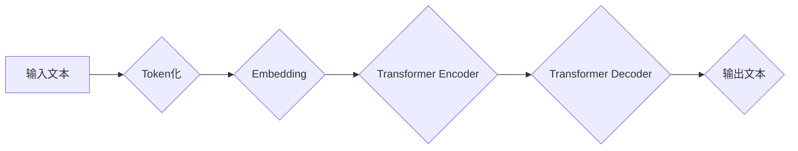

> Large Language Model (LLM), Transformer, Attention机制, 自然语言处理 (NLP), 深度学习, 机器学习

## 1. 背景介绍

近年来，大型语言模型 (Large Language Model, LLM) 作为人工智能领域最令人瞩目的突破之一，展现出强大的文本生成、理解和翻译能力，深刻地改变了我们与语言交互的方式。从 ChatGPT 的问答能力到 LaMDA 的对话流，这些模型的出现引发了广泛的关注和讨论。然而，对于大多数人来说，LLM 的内部机制仍然是一个神秘的领域。本文将深入探讨 LLMs 的核心概念、算法原理、数学模型以及实际应用场景，帮助读者揭开 AI 大脑的神秘面纱。

## 2. 核心概念与联系

LLMs 的核心在于利用深度学习技术，从海量文本数据中学习语言的规律和模式。其架构通常基于 Transformer 网络，并依赖于注意力机制来捕捉文本序列中的长距离依赖关系。

**Mermaid 流程图：**



**核心概念解释：**

* **Token化:** 将输入文本分割成一个个独立的单位，例如单词或子词。
* **Embedding:** 将每个 token 映射到一个低维向量空间，使得语义相似的词语拥有相似的向量表示。
* **Transformer Encoder:** 利用多头注意力机制和前馈神经网络，对输入文本进行编码，提取其语义信息。
* **Transformer Decoder:** 基于编码后的语义信息，生成目标文本序列。
* **输出文本:** 将生成的文本序列解码回原始文本格式。

## 3. 核心算法原理 & 具体操作步骤

### 3.1  算法原理概述

LLMs 的核心算法是 Transformer 网络，其主要特点是利用注意力机制来捕捉文本序列中的长距离依赖关系。注意力机制允许模型关注输入序列中与当前位置相关的关键信息，从而更好地理解上下文语义。

### 3.2  算法步骤详解

1. **输入处理:** 将输入文本进行 token 化和 embedding 操作。
2. **编码阶段:** 将嵌入后的 token 通过 Transformer Encoder 进行编码，提取文本语义信息。
3. **解码阶段:** 将编码后的语义信息作为输入，通过 Transformer Decoder 生成目标文本序列。
4. **输出生成:** 将生成的文本序列解码回原始文本格式。

### 3.3  算法优缺点

**优点:**

* 能够捕捉长距离依赖关系，提升文本理解和生成能力。
* 并行计算能力强，训练速度快。
* 可迁移性强，可以应用于多种自然语言处理任务。

**缺点:**

* 训练成本高，需要大量计算资源和数据。
* 模型参数量大，部署成本高。
* 容易受到训练数据偏差的影响，可能产生偏见或错误的输出。

### 3.4  算法应用领域

LLMs 广泛应用于自然语言处理领域，例如：

* **文本生成:** 写作、翻译、对话系统等。
* **文本理解:** 文本分类、情感分析、问答系统等。
* **代码生成:** 自动生成代码片段。
* **数据分析:** 从文本数据中提取信息和洞察。

## 4. 数学模型和公式 & 详细讲解 & 举例说明

### 4.1  数学模型构建

LLMs 的数学模型主要基于神经网络，其中 Transformer 网络是其核心架构。Transformer 网络由编码器和解码器组成，每个部分由多个注意力层和前馈神经网络组成。

### 4.2  公式推导过程

注意力机制的核心公式是计算每个词与其他词之间的相关性，并根据相关性权重来加权求和。

**注意力权重计算公式:**

$$
\text{Attention}(Q, K, V) = \text{softmax}\left(\frac{Q K^T}{\sqrt{d_k}}\right) V
$$

其中：

* $Q$：查询矩阵
* $K$：键矩阵
* $V$：值矩阵
* $d_k$：键向量的维度
* $\text{softmax}$：softmax 函数

### 4.3  案例分析与讲解

假设我们有一个句子 "The cat sat on the mat"，我们想要计算 "sat" 这个词与其他词之间的注意力权重。

* 将句子中的每个词都转换为嵌入向量。
* 计算每个词的查询向量 $Q$、键向量 $K$ 和值向量 $V$。
* 使用注意力权重计算公式计算每个词与 "sat" 词之间的注意力权重。
* 将注意力权重加权求和，得到 "sat" 词的上下文表示。

## 5. 项目实践：代码实例和详细解释说明

### 5.1  开发环境搭建

* Python 3.7+
* PyTorch 或 TensorFlow
* CUDA 和 cuDNN (可选，用于 GPU 加速)

### 5.2  源代码详细实现

```python
import torch
import torch.nn as nn

class Attention(nn.Module):
    def __init__(self, d_model, num_heads):
        super(Attention, self).__init__()
        self.d_model = d_model
        self.num_heads = num_heads
        self.head_dim = d_model // num_heads

        self.query = nn.Linear(d_model, d_model)
        self.key = nn.Linear(d_model, d_model)
        self.value = nn.Linear(d_model, d_model)
        self.fc_out = nn.Linear(d_model, d_model)

    def forward(self, query, key, value, mask=None):
        batch_size = query.size(0)

        # Linear projections
        Q = self.query(query).view(batch_size, -1, self.num_heads, self.head_dim).transpose(1, 2)
        K = self.key(key).view(batch_size, -1, self.num_heads, self.head_dim).transpose(1, 2)
        V = self.value(value).view(batch_size, -1, self.num_heads, self.head_dim).transpose(1, 2)

        # Scaled dot-product attention
        scores = torch.matmul(Q, K.transpose(-2, -1)) / torch.sqrt(torch.tensor(self.head_dim, dtype=torch.float))
        if mask is not None:
            scores = scores.masked_fill(mask == 0, -1e9)
        attention_weights = torch.softmax(scores, dim=-1)

        # Weighted sum of values
        context = torch.matmul(attention_weights, V)

        # Concatenate heads and project
        context = context.transpose(1, 2).contiguous().view(batch_size, -1, self.d_model)
        output = self.fc_out(context)

        return output, attention_weights
```

### 5.3  代码解读与分析

* `Attention` 类定义了一个注意力机制模块，包含查询、键、值线性投影层以及最终的输出层。
* `forward` 方法实现注意力机制的计算过程，包括线性投影、缩放点积注意力计算、加权求和以及最终输出的投影。
* `mask` 参数用于屏蔽某些词之间的注意力关系，例如在机器翻译中屏蔽源语言中的词与目标语言中的词之间的关系。

### 5.4  运行结果展示

运行上述代码可以得到注意力权重矩阵，通过分析权重矩阵可以了解模型对不同词的关注程度，从而更好地理解模型的内部机制。

## 6. 实际应用场景

LLMs 在各个领域都有着广泛的应用场景，例如：

### 6.1  聊天机器人

LLMs 可以用于构建更智能、更自然的聊天机器人，能够理解用户意图并提供更精准的回复。

### 6.2  文本摘要

LLMs 可以自动生成文本摘要，提取文本的关键信息，节省用户阅读时间。

### 6.3  机器翻译

LLMs 可以实现高质量的机器翻译，突破语言障碍，促进跨文化交流。

### 6.4  未来应用展望

随着 LLMs 的不断发展，其应用场景将更加广泛，例如：

* **个性化教育:** 根据学生的学习进度和需求提供个性化的学习内容和辅导。
* **医疗诊断:** 辅助医生进行疾病诊断，提高诊断准确率。
* **法律服务:** 自动分析法律文件，提供法律建议。

## 7. 工具和资源推荐

### 7.1  学习资源推荐

* **书籍:**
    * "Deep Learning" by Ian Goodfellow, Yoshua Bengio, and Aaron Courville
    * "Attention Is All You Need" by Vaswani et al.
* **在线课程:**
    * Coursera: Deep Learning Specialization
    * fast.ai: Practical Deep Learning for Coders

### 7.2  开发工具推荐

* **PyTorch:** 开源深度学习框架，支持 GPU 加速。
* **TensorFlow:** 谷歌开发的开源深度学习框架。
* **Hugging Face Transformers:** 提供预训练的 LLMs 和相关的工具。

### 7.3  相关论文推荐

* "Attention Is All You Need"
* "BERT: Pre-training of Deep Bidirectional Transformers for Language Understanding"
* "GPT-3: Language Models are Few-Shot Learners"

## 8. 总结：未来发展趋势与挑战

### 8.1  研究成果总结

LLMs 在自然语言处理领域取得了显著的进展，展现出强大的文本生成、理解和翻译能力。Transformer 网络和注意力机制是 LLMs 的核心技术，为模型的性能提升做出了重要贡献。

### 8.2  未来发展趋势

* **模型规模和能力的提升:** 预计 LLMs 的模型规模将继续扩大，从而提升其理解和生成文本的能力。
* **多模态 LLMs:** 将文本与其他模态数据（例如图像、音频）相结合，构建更全面的理解和交互能力。
* **可解释性和安全性:** 研究 LLMs 的内部机制，提高模型的可解释性和安全性，避免模型产生偏见或错误的输出。

### 8.3  面临的挑战

* **训练成本:** LLMs 的训练成本非常高，需要大量的计算资源和数据。
* **数据偏差:** LLMs 的训练数据可能存在偏差，导致模型产生偏见或错误的输出。
* **伦理问题:** LLMs 的应用可能引发伦理问题，例如信息操纵、隐私泄露等。

### 8.4  研究展望

未来，LLMs 将继续朝着更强大、更智能、更安全的方向发展，为人类社会带来更多福祉。


## 9. 附录：常见问题与解答

**Q1: LLMs 和 RNN 的区别是什么？**

**A1:** RNN (循环神经网络) 是一种传统的序列模型，其核心特点是利用循环结构来处理序列数据。然而，RNN 难以捕捉长距离依赖关系，而 Transformer 网络通过注意力机制有效地解决了这个问题。

**Q2: 如何训练一个 LLMs？**

**A2:** 训练 LLMs 需要大量的文本数据和强大的计算资源。通常使用自监督学习方法，例如语言建模，来训练模型。

**Q3: LLMs 的应用场景有哪些？**

**A3:** LLMs 的应用场景非常广泛，例如聊天机器人、文本摘要、机器翻译、代码生成等。

**Q4: LLMs 的伦理问题有哪些？**

**A4:** LLMs 的应用可能引发伦理问题，例如信息操纵、隐私泄露、算法偏见等。需要谨慎考虑这些问题，并制定相应的伦理规范和监管机制。


作者：禅与计算机程序设计艺术 / Zen and the Art of Computer Programming 
<end_of_turn>