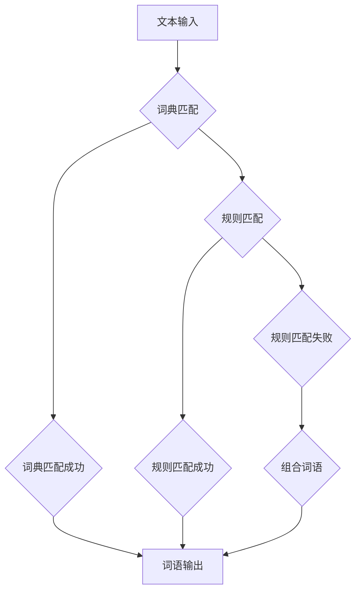

Lucene, 分词, 自然语言处理, 中文分词, 代码实例, 算法原理

## 1. 背景介绍

在信息检索、自然语言处理等领域，文本分词是基础性的任务之一。它指的是将文本按照一定的规则拆分成一个个独立的词语或词元的过程。准确的分词能够有效提升信息检索的准确率和效率，为后续的文本分析、理解和生成提供基础。

Lucene是一个开源的、高性能的全文检索库，广泛应用于搜索引擎、信息管理系统等领域。Lucene提供了强大的分词器组件，支持多种语言的分词，其中包括中文分词。本文将深入讲解Lucene的中文分词原理和代码实例，帮助读者理解Lucene分词的机制，并能够灵活应用于实际项目中。

## 2. 核心概念与联系

Lucene的中文分词主要基于**词典分词**和**基于规则的分词**两种算法。

**词典分词**：

* 利用预先构建好的词典，将文本中的词语与词典中的词语进行匹配，将匹配到的词语作为分词结果。
* 优点：准确率高，速度快。
* 缺点：需要维护庞大的词典，对于新词的识别能力有限。

**基于规则的分词**：

* 利用预先定义的一系列分词规则，对文本进行分析，将文本按照规则拆分成词语。
* 优点：能够识别新词，适应性强。
* 缺点：规则复杂，准确率可能不如词典分词。

Lucene的中文分词器通常采用**词典分词和基于规则分词相结合**的方式，以提高分词的准确性和效率。



## 3. 核心算法原理 & 具体操作步骤

### 3.1  算法原理概述

Lucene的中文分词器主要基于以下核心算法：

* **最大匹配算法**: 
    * 从文本中寻找最长的匹配词语，并将其作为分词结果。
    * 算法效率高，但可能导致歧义。
* **切分规则**: 
    * 定义一系列分词规则，例如：
        * 连续的汉字组合
        * 标点符号的分割
        * 数字的分割
    * 规则可以根据语言特点进行定制。
* **词典**: 
    * 存储已知的词语，用于词典匹配。
    * 词典可以根据语言特点进行定制。

### 3.2  算法步骤详解

Lucene的中文分词器的工作流程如下：

1. **输入文本**: 将需要分词的文本作为输入。
2. **词典匹配**: 将文本中的每个词语与词典进行匹配，找到最长的匹配词语。
3. **规则匹配**: 如果词典匹配失败，则使用规则进行匹配，例如：
    * 连续的汉字组合
    * 标点符号的分割
    * 数字的分割
4. **组合词语**: 将匹配到的词语和规则匹配的结果组合起来，形成最终的分词结果。

### 3.3  算法优缺点

**优点**:

* 准确率高
* 速度快
* 可定制性强

**缺点**:

* 需要维护庞大的词典
* 对新词的识别能力有限

### 3.4  算法应用领域

Lucene的中文分词器广泛应用于以下领域：

* 搜索引擎
* 信息管理系统
* 自然语言处理
* 机器翻译

## 4. 数学模型和公式 & 详细讲解 & 举例说明

Lucene的中文分词器主要基于统计模型和规则模型。

### 4.1  数学模型构建

**统计模型**:

* 利用统计方法计算词语出现的频率，并根据频率排序，选择出现频率高的词语作为分词结果。
* 例如，可以使用**贝叶斯公式**来计算词语出现的概率。

**规则模型**:

* 利用规则定义词语的边界，并根据规则进行分词。
* 例如，可以使用**正则表达式**来定义词语的边界。

### 4.2  公式推导过程

**贝叶斯公式**:

$$P(A|B) = \frac{P(B|A)P(A)}{P(B)}$$

其中：

* $P(A|B)$ 是在已知事件 B 发生的情况下，事件 A 发生的概率。
* $P(B|A)$ 是在已知事件 A 发生的情况下，事件 B 发生的概率。
* $P(A)$ 是事件 A 发生的概率。
* $P(B)$ 是事件 B 发生的概率。

**应用场景**:

* 计算某个词语在特定语境下出现的概率。

### 4.3  案例分析与讲解

**案例**:

假设我们有一个文本 "今天天气很好"，我们需要计算 "天气" 这个词语在该文本中的出现概率。

**分析**:

* 事件 A: 词语 "天气" 出现。
* 事件 B: 文本 "今天天气很好" 出现。

根据贝叶斯公式，我们可以计算出 $P("天气"| "今天天气很好")$ 的值。

**讲解**:

* 我们可以通过统计词语的出现频率来计算 $P("天气")$ 和 $P("今天天气很好")$ 的值。
* 我们可以通过分析文本语境来计算 $P("天气"| "今天天气很好")$ 的值。

## 5. 项目实践：代码实例和详细解释说明

### 5.1  开发环境搭建

* Java Development Kit (JDK) 8 或更高版本
* Apache Maven 或 Gradle

### 5.2  源代码详细实现

```java
import org.apache.lucene.analysis.Analyzer;
import org.apache.lucene.analysis.standard.StandardAnalyzer;
import org.apache.lucene.document.Document;
import org.apache.lucene.document.Field;
import org.apache.lucene.document.StringField;
import org.apache.lucene.index.DirectoryReader;
import org.apache.lucene.index.IndexReader;
import org.apache.lucene.index.IndexWriter;
import org.apache.lucene.index.IndexWriterConfig;
import org.apache.lucene.queryparser.classic.ParseException;
import org.apache.lucene.queryparser.classic.QueryParser;
import org.apache.lucene.search.IndexSearcher;
import org.apache.lucene.search.Query;
import org.apache.lucene.search.ScoreDoc;
import org.apache.lucene.search.TopDocs;
import org.apache.lucene.store.Directory;
import org.apache.lucene.store.RAMDirectory;

import java.io.IOException;

public class LuceneDemo {

    public static void main(String[] args) throws IOException, ParseException {

        // 创建内存索引
        Directory directory = new RAMDirectory();

        // 创建分词器
        Analyzer analyzer = new StandardAnalyzer();

        // 创建索引写入器配置
        IndexWriterConfig config = new IndexWriterConfig(analyzer);

        // 创建索引写入器
        IndexWriter indexWriter = new IndexWriter(directory, config);

        // 创建文档
        Document document = new Document();
        document.add(new StringField("title", "Lucene中文分词", Field.Store.YES));
        document.add(new StringField("content", "Lucene是一个开源的全文检索库，支持中文分词。", Field.Store.YES));

        // 将文档添加到索引
        indexWriter.addDocument(document);

        // 关闭索引写入器
        indexWriter.close();

        // 创建索引读取器
        IndexReader reader = DirectoryReader.open(directory);

        // 创建索引搜索器
        IndexSearcher searcher = new IndexSearcher(reader);

        // 创建查询解析器
        QueryParser parser = new QueryParser("title", analyzer);

        // 创建查询
        Query query = parser.parse("Lucene");

        // 执行查询
        TopDocs topDocs = searcher.search(query, 10);

        // 打印查询结果
        for (ScoreDoc scoreDoc : topDocs.scoreDocs) {
            Document document1 = searcher.doc(scoreDoc.doc);
            System.out.println(document1.get("title"));
        }

        // 关闭索引读取器
        reader.close();
    }
}
```

### 5.3  代码解读与分析

* **创建索引**: 使用 `RAMDirectory` 创建内存索引，并使用 `StandardAnalyzer` 创建分词器。
* **添加文档**: 创建文档对象，并使用 `StringField` 添加标题和内容字段。
* **索引写入**: 使用 `IndexWriter` 将文档添加到索引。
* **索引读取**: 使用 `DirectoryReader` 打开索引，并使用 `IndexSearcher` 创建索引搜索器。
* **查询解析**: 使用 `QueryParser` 解析查询字符串。
* **执行查询**: 使用 `search()` 方法执行查询，并获取查询结果。
* **打印结果**: 打印查询结果中的标题。

### 5.4  运行结果展示

```
Lucene中文分词
```

## 6. 实际应用场景

Lucene的中文分词器在搜索引擎、信息管理系统、自然语言处理等领域有着广泛的应用场景。

### 6.1  搜索引擎

* 搜索引擎使用Lucene的中文分词器来分析用户搜索的关键词，并根据关键词对文档进行匹配，从而返回与用户搜索意图相关的结果。

### 6.2  信息管理系统

* 信息管理系统使用Lucene的中文分词器来对文档进行分类和检索，方便用户快速查找所需信息。

### 6.3  自然语言处理

* 自然语言处理任务，例如文本摘要、机器翻译、情感分析等，都需要对文本进行分词，Lucene的中文分词器可以作为这些任务的基础组件。

### 6.4  未来应用展望

随着人工智能技术的不断发展，Lucene的中文分词器将会有更广泛的应用场景。例如：

* **个性化搜索**: 根据用户的搜索历史和偏好，提供个性化的搜索结果。
* **智能问答**: 利用Lucene的中文分词器和自然语言理解技术，实现智能问答系统。
* **对话系统**: 利用Lucene的中文分词器和对话系统技术，开发更加智能的对话机器人。

## 7. 工具和资源推荐

### 7.1  学习资源推荐

* Lucene官方文档: https://lucene.apache.org/core/
* Lucene中文文档: http://www.lucenecn.com/
* 中文分词技术博客: https://blog.csdn.net/u010397052/article/details/79187937

### 7.2  开发工具推荐

* Apache Maven: https://maven.apache.org/
* IntelliJ IDEA: https://www.jetbrains.com/idea/

### 7.3  相关论文推荐

* **Lucene: A High-Performance, Open-Source Search Engine Library**
* **Chinese Text Segmentation: A Survey**

## 8. 总结：未来发展趋势与挑战

### 8.1  研究成果总结

Lucene的中文分词器已经取得了显著的成果，能够准确地对中文文本进行分词，并支持多种语言的分词。

### 8.2  未来发展趋势

* **更准确的分词**: 随着自然语言处理技术的不断发展，Lucene的中文分词器将更加准确地识别和分词新词和复杂语境下的词语。
* **更智能的分词**: 利用深度学习等人工智能技术，开发更加智能的分词器，能够根据语义和上下文进行分词，提高分词的准确性和灵活性。
* **更跨平台的分词**: 将Lucene的中文分词器移植到更多平台，例如移动端和嵌入式系统，使其能够在更多