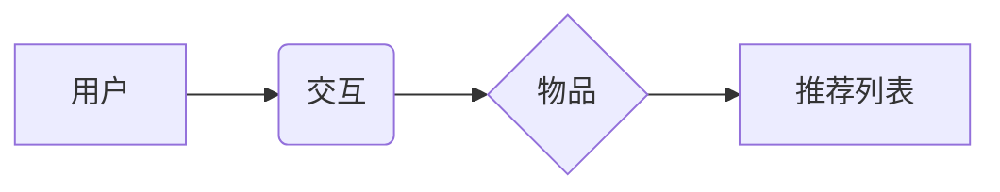

> Mahout,推荐算法,协同过滤,矩阵分解,机器学习,数据挖掘,代码实例

## 1. 背景介绍

在当今数据爆炸的时代，个性化推荐已成为互联网应用的核心竞争力。从电商平台的商品推荐到视频网站的影视推荐，从社交媒体的个性化内容推送到音乐平台的歌曲推荐，推荐算法无处不在，深刻地影响着我们的生活。Mahout作为Apache基金会旗下的开源机器学习平台，提供了丰富的推荐算法实现，为开发者提供了强大的工具和资源。

本篇文章将深入探讨Mahout推荐算法的原理和实践，通过代码实例和详细讲解，帮助读者理解推荐算法的核心概念、算法原理、数学模型以及实际应用场景。

## 2. 核心概念与联系

推荐算法的核心目标是根据用户的历史行为、偏好和兴趣，预测用户对未来物品的喜好程度，并推荐最相关的物品。

**2.1 核心概念**

* **用户:** 推荐系统的参与者，拥有自己的兴趣和偏好。
* **物品:** 需要被推荐的对象，例如商品、电影、音乐等。
* **交互:** 用户与物品之间的互动行为，例如点击、购买、评分等。
* **推荐列表:** 根据算法预测，为用户推荐的物品列表。

**2.2 联系图**



## 3. 核心算法原理 & 具体操作步骤

Mahout支持多种推荐算法，其中协同过滤和矩阵分解是两种常用的算法。

### 3.1 算法原理概述

**3.1.1 协同过滤**

协同过滤算法基于用户的相似性和物品的相似性进行推荐。

* **用户-基于协同过滤:** 寻找与当前用户兴趣相似的用户，并推荐他们喜欢的物品。
* **物品-基于协同过滤:** 寻找与当前用户喜欢的物品相似的物品，并推荐这些物品。

**3.1.2 矩阵分解**

矩阵分解算法将用户-物品交互矩阵分解成两个低维矩阵，分别表示用户特征和物品特征。通过计算这两个矩阵的点积，预测用户对物品的评分。

### 3.2 算法步骤详解

**3.2.1 协同过滤算法步骤**

1. 收集用户-物品交互数据。
2. 计算用户相似度或物品相似度。
3. 根据相似度，推荐相关物品。

**3.2.2 矩阵分解算法步骤**

1. 将用户-物品交互矩阵分解成两个低维矩阵。
2. 使用优化算法训练模型，最小化预测误差。
3. 根据训练好的模型，预测用户对物品的评分。

### 3.3 算法优缺点

**3.3.1 协同过滤算法**

* **优点:** 能够发现隐含的模式，推荐个性化结果。
* **缺点:** 数据稀疏性问题，冷启动问题。

**3.3.2 矩阵分解算法**

* **优点:** 能够处理数据稀疏性问题，冷启动问题较小。
* **缺点:** 需要大量的计算资源，模型解释性较差。

### 3.4 算法应用领域

* **电商推荐:** 商品推荐、用户画像、个性化营销。
* **视频网站推荐:** 视频推荐、用户兴趣分析、内容分类。
* **社交媒体推荐:** 朋友推荐、内容推荐、兴趣小组推荐。
* **音乐平台推荐:** 歌曲推荐、用户音乐偏好分析、音乐分类。

## 4. 数学模型和公式 & 详细讲解 & 举例说明

### 4.1 数学模型构建

**4.1.1 协同过滤模型**

协同过滤模型通常使用余弦相似度或皮尔逊相关系数来度量用户或物品之间的相似性。

**4.1.2 矩阵分解模型**

矩阵分解模型将用户-物品交互矩阵分解成两个低维矩阵，例如：

* **用户特征矩阵:** U，每个行代表一个用户，每个列代表一个特征。
* **物品特征矩阵:** V，每个行代表一个物品，每个列代表一个特征。

**4.1.3 公式表示**

预测用户u对物品i的评分：

$$
\hat{r}_{ui} = u_i^T v_i
$$

其中：

* $\hat{r}_{ui}$ 是预测的评分。
* $u_i$ 是用户u的特征向量。
* $v_i$ 是物品i的特征向量。
* $^T$ 表示转置。

### 4.2 公式推导过程

矩阵分解模型的训练目标是最小化预测误差与实际评分之间的差值。常用的优化算法包括梯度下降法和随机梯度下降法。

### 4.3 案例分析与讲解

假设有一个用户-物品交互矩阵，其中每个元素表示用户对物品的评分。可以使用矩阵分解算法将这个矩阵分解成两个低维矩阵，并训练模型预测用户对物品的评分。

## 5. 项目实践：代码实例和详细解释说明

### 5.1 开发环境搭建

* Java Development Kit (JDK)
* Apache Mahout
* Hadoop

### 5.2 源代码详细实现

```java
// 使用Mahout的协同过滤算法进行推荐
import org.apache.mahout.cf.taste.impl.model.file.FileDataModel;
import org.apache.mahout.cf.taste.impl.neighborhood.NearestNUserNeighborhood;
import org.apache.mahout.cf.taste.impl.recommender.GenericUserBasedRecommender;
import org.apache.mahout.cf.taste.model.DataModel;
import org.apache.mahout.cf.taste.neighborhood.UserNeighborhood;
import org.apache.mahout.cf.taste.recommender.RecommendedItem;
import org.apache.mahout.cf.taste.recommender.Recommender;

import java.io.File;
import java.util.List;

public class MahoutRecommendation {

    public static void main(String[] args) throws Exception {
        // 加载数据
        File dataFile = new File("data.csv");
        DataModel model = new FileDataModel(dataFile);

        // 创建用户邻域
        UserNeighborhood neighborhood = new NearestNUserNeighborhood(2, null, model);

        // 创建推荐器
        Recommender recommender = new GenericUserBasedRecommender(model, neighborhood, null);

        // 获取用户ID
        long userId = 1;

        // 获取推荐列表
        List<RecommendedItem> recommendations = recommender.recommend(userId, 5);

        // 打印推荐结果
        for (RecommendedItem recommendation : recommendations) {
            System.out.println("推荐物品: " + recommendation.getItemID() + ", 评分: " + recommendation.getValue());
        }
    }
}
```

### 5.3 代码解读与分析

* 代码首先加载用户-物品交互数据，并将其转换为Mahout支持的数据模型。
* 然后，创建用户邻域，用于寻找与当前用户兴趣相似的用户。
* 接着，创建推荐器，并使用用户邻域进行推荐。
* 最后，获取用户ID和推荐列表，并打印推荐结果。

### 5.4 运行结果展示

运行代码后，将输出当前用户ID的推荐物品列表，每个物品包含其ID和评分。

## 6. 实际应用场景

### 6.1 电商推荐

* **商品推荐:** 根据用户的浏览历史、购买记录和评分，推荐相关的商品。
* **用户画像:** 分析用户的购买行为和偏好，构建用户画像，进行个性化营销。

### 6.2 视频网站推荐

* **视频推荐:** 根据用户的观看历史、点赞记录和评论，推荐相关的视频。
* **用户兴趣分析:** 分析用户的观看行为，挖掘用户的兴趣爱好，进行内容分类和推荐。

### 6.3 社交媒体推荐

* **朋友推荐:** 根据用户的社交关系和共同兴趣，推荐新的朋友。
* **内容推荐:** 根据用户的关注话题和兴趣，推荐相关的文章、视频和图片。

### 6.4 未来应用展望

* **个性化学习推荐:** 根据用户的学习进度和兴趣，推荐相关的学习资源。
* **医疗健康推荐:** 根据用户的健康状况和需求，推荐相关的医疗服务和健康知识。
* **智能家居推荐:** 根据用户的使用习惯和需求，推荐相关的智能家居设备和服务。

## 7. 工具和资源推荐

### 7.1 学习资源推荐

* **Mahout官方文档:** https://mahout.apache.org/users/
* **Mahout教程:** https://mahout.apache.org/users/tutorial/
* **机器学习书籍:** 《机器学习》 (周志华)

### 7.2 开发工具推荐

* **Eclipse:** https://www.eclipse.org/
* **IntelliJ IDEA:** https://www.jetbrains.com/idea/

### 7.3 相关论文推荐

* **Collaborative Filtering for Implicit Feedback Datasets:** https://dl.acm.org/doi/10.1145/2901112.2901120
* **Matrix Factorization Techniques for Recommender Systems:** https://dl.acm.org/doi/10.1145/1201806.1201829

## 8. 总结：未来发展趋势与挑战

### 8.1 研究成果总结

Mahout推荐算法在实际应用中取得了显著的成果，为个性化推荐提供了强大的工具和资源。

### 8.2 未来发展趋势

* **深度学习推荐:** 将深度学习技术应用于推荐算法，提升推荐效果。
* **联邦学习推荐:** 利用联邦学习技术，保护用户隐私，实现安全可靠的推荐。
* **多模态推荐:** 将文本、图像、视频等多模态数据融合，构建更全面的用户画像，实现更精准的推荐。

### 8.3 面临的挑战

* **数据稀疏性:** 用户-物品交互数据往往稀疏，需要采用有效的算法和技术进行处理。
* **冷启动问题:** 新用户和新物品难以获得推荐，需要采用冷启动策略进行解决。
* **用户隐私保护:** 推荐算法需要保护用户的隐私信息，避免数据泄露和滥用。

### 8.4 研究展望

未来，推荐算法将朝着更智能、更个性化、更安全的方向发展，为用户提供更精准、更丰富的体验。

## 9. 附录：常见问题与解答

* **Q1: Mahout推荐算法有哪些？**

* **A1:** Mahout支持多种推荐算法，包括协同过滤、矩阵分解、基于内容的推荐等。

* **Q2: 如何使用Mahout进行推荐？**

* **A2:** 需要首先安装Mahout和Hadoop，然后根据需要选择合适的推荐算法，并使用Mahout提供的API进行开发。

* **Q3: Mahout推荐算法有哪些优缺点？**

* **A3:** 每个算法都有其优缺点，需要根据实际应用场景选择合适的算法。

* **Q4: 如何解决数据稀疏性问题？**

* **A4:** 可以采用矩阵分解、协同过滤等算法，以及数据增强等技术进行解决。

* **Q5: 如何保护用户隐私？**

* **A5:** 可以采用联邦学习、差分隐私等技术，保护用户隐私信息。


作者：禅与计算机程序设计艺术 / Zen and the Art of Computer Programming 
<end_of_turn>