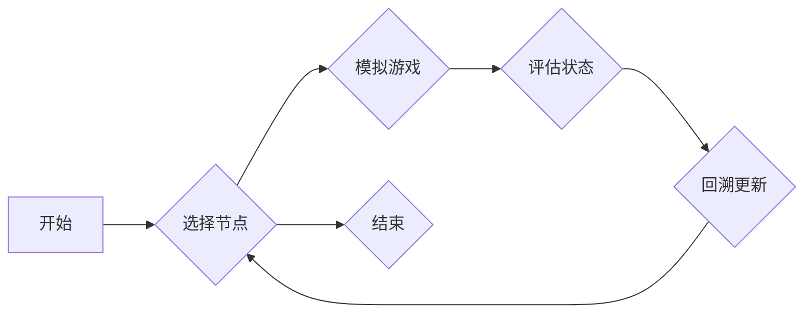

> Monte Carlo Tree Search (MCTS), 决策树, 搜索算法, 游戏人工智能, 概率模型

## 1. 背景介绍

在人工智能领域，决策问题无处不在。从简单的游戏策略到复杂的机器人控制，都需要智能体能够在不确定的环境中做出最优决策。传统的搜索算法，例如深度优先搜索和广度优先搜索，在面对复杂决策树时效率低下，难以找到最优解。

Monte Carlo Tree Search (MCTS) 是一种基于蒙特卡罗方法的决策树搜索算法，它能够有效地解决复杂决策问题。MCTS 算法通过模拟多个随机路径，并根据路径的结果更新决策树，最终找到最优决策。

## 2. 核心概念与联系

MCTS 算法的核心概念包括：

* **决策树:** MCTS 算法将决策问题表示为一个决策树，其中每个节点代表一个决策，每个叶子节点代表一个状态。
* **状态评估:** 每个叶子节点的状态需要被评估，评估值代表该状态的好坏。
* **模拟游戏:** MCTS 算法通过模拟多个随机路径，从根节点到叶子节点，来评估不同决策的价值。
* **树的更新:** 根据模拟结果，MCTS 算法会更新决策树，使得更有利于选择好的决策。

**MCTS 算法流程图:**



## 3. 核心算法原理 & 具体操作步骤

### 3.1  算法原理概述

MCTS 算法的核心思想是通过模拟多个随机路径，并根据路径的结果更新决策树，最终找到最优决策。

MCTS 算法的步骤如下：

1. **选择节点:** 从决策树中选择一个节点进行扩展。
2. **模拟游戏:** 从选中的节点开始，模拟一个随机路径，直到到达叶子节点。
3. **评估状态:** 评估叶子节点的状态，得到一个评估值。
4. **回溯更新:** 从叶子节点回溯到根节点，更新每个节点的价值和选择概率。
5. **重复步骤 1-4:** 重复上述步骤，直到达到某个终止条件。

### 3.2  算法步骤详解

1. **选择节点:** 选择节点可以使用多种策略，例如：
    * **UCT (Upper Confidence Bound 1):** 选择具有最大信息增益的节点。
    * **Random Selection:** 随机选择一个节点。
2. **模拟游戏:** 模拟游戏可以使用多种策略，例如：
    * **随机选择:** 随机选择下一个动作。
    * **贪婪选择:** 选择当前状态下价值最高的动作。
3. **评估状态:** 评估状态可以使用多种方法，例如：
    * **预估模型:** 使用一个预先训练好的模型来评估状态价值。
    * **奖励函数:** 使用一个奖励函数来评估状态的好坏。
4. **回溯更新:** 回溯更新时，需要更新每个节点的价值和选择概率。

### 3.3  算法优缺点

**优点:**

* **能够有效地解决复杂决策问题:** MCTS 算法能够处理具有大量状态和动作的决策问题。
* **不需要先验知识:** MCTS 算法不需要对决策问题有先验知识，可以从数据中学习。
* **能够适应动态环境:** MCTS 算法能够适应动态环境，并根据环境的变化调整策略。

**缺点:**

* **计算复杂度较高:** MCTS 算法的计算复杂度较高，需要大量的计算资源。
* **需要大量的模拟:** MCTS 算法需要大量的模拟才能获得准确的结果。
* **容易陷入局部最优:** MCTS 算法容易陷入局部最优，无法找到全局最优解。

### 3.4  算法应用领域

MCTS 算法在许多领域都有应用，例如：

* **游戏人工智能:** MCTS 算法被广泛应用于游戏人工智能，例如围棋、象棋、Go 等。
* **机器人控制:** MCTS 算法可以用于机器人控制，例如路径规划、目标跟踪等。
* **推荐系统:** MCTS 算法可以用于推荐系统，例如推荐商品、推荐电影等。
* **医疗诊断:** MCTS 算法可以用于医疗诊断，例如辅助医生诊断疾病。

## 4. 数学模型和公式 & 详细讲解 & 举例说明

### 4.1  数学模型构建

MCTS 算法的核心数学模型是决策树。决策树是一个树形结构，其中每个节点代表一个决策，每个叶子节点代表一个状态。

决策树的每个节点都有一个价值值，表示该节点的期望回报。节点的价值值可以通过模拟游戏和状态评估来计算。

### 4.2  公式推导过程

MCTS 算法使用以下公式来更新节点的价值值和选择概率：

* **节点价值值更新公式:**

$$
V(n) = \frac{Q(n) + C \cdot \sqrt{\frac{P(n)}{N(n)}}}{1 + \frac{C \cdot \sqrt{\frac{P(n)}{N(n)}}}{N(n)}}
$$

其中:

* $V(n)$ 是节点 $n$ 的价值值。
* $Q(n)$ 是节点 $n$ 的累计回报。
* $C$ 是一个常数，称为探索系数。
* $P(n)$ 是节点 $n$ 的选择次数。
* $N(n)$ 是节点 $n$ 的子节点总数。

* **节点选择概率更新公式:**

$$
P(n) = \frac{V(n) + C \cdot \sqrt{\frac{P(n)}{N(n)}}}{V(n) + C \cdot \sqrt{\frac{P(n)}{N(n)}} + \epsilon}
$$

其中:

* $P(n)$ 是节点 $n$ 的选择概率。
* $V(n)$ 是节点 $n$ 的价值值。
* $C$ 是一个常数，称为探索系数。
* $P(n)$ 是节点 $n$ 的选择次数。
* $N(n)$ 是节点 $n$ 的子节点总数。
* $\epsilon$ 是一个小的常数，用于避免分母为零。

### 4.3  案例分析与讲解

假设我们有一个简单的决策树，有两个节点，分别代表两个不同的决策。

* 节点 A 的价值值为 10，选择次数为 100。
* 节点 B 的价值值为 5，选择次数为 50。

根据上述公式，我们可以计算出节点 A 和节点 B 的选择概率：

* 节点 A 的选择概率:

$$
P(A) = \frac{10 + C \cdot \sqrt{\frac{100}{100}}}{10 + C \cdot \sqrt{\frac{100}{100}} + \epsilon} = \frac{10 + C}{10 + C + \epsilon}
$$

* 节点 B 的选择概率:

$$
P(B) = \frac{5 + C \cdot \sqrt{\frac{50}{100}}}{5 + C \cdot \sqrt{\frac{50}{100}} + \epsilon} = \frac{5 + C \cdot \sqrt{0.5}}{5 + C \cdot \sqrt{0.5} + \epsilon}
$$

从上述公式可以看出，节点 A 的选择概率大于节点 B 的选择概率，因为节点 A 的价值值更高。

## 5. 项目实践：代码实例和详细解释说明

### 5.1  开发环境搭建

* **编程语言:** Python
* **库:** NumPy, Scikit-learn

### 5.2  源代码详细实现

```python
import numpy as np

class MCTS:
    def __init__(self, num_actions, exploration_constant=1.414):
        self.num_actions = num_actions
        self.exploration_constant = exploration_constant

    def select_node(self, node):
        # 选择具有最大信息增益的节点
        return max(node.children, key=lambda child: self.uct(child))

    def uct(self, node):
        # 计算节点的UCB值
        return node.value + self.exploration_constant * np.sqrt(np.log(node.parent.visits) / node.visits)

    def expand_node(self, node):
        # 扩展节点，创建新的子节点
        for action in range(self.num_actions):
            child = Node(node, action)
            node.children.append(child)

    def simulate_game(self, node):
        # 模拟游戏，从节点到叶子节点
        while not node.is_terminal():
            action = np.random.choice(node.available_actions())
            node = node.children[action]
        return node.value

    def backpropagate(self, node, value):
        # 回溯更新节点的价值和选择次数
        while node is not None:
            node.visits += 1
            node.value += value
            node = node.parent

class Node:
    def __init__(self, parent, action):
        self.parent = parent
        self.action = action
        self.children = []
        self.visits = 0
        self.value = 0
        self.is_terminal = False

```

### 5.3  代码解读与分析

* **MCTS 类:**
    * `__init__`: 初始化 MCTS 算法，设置动作数量和探索系数。
    * `select_node`: 选择具有最大信息增益的节点。
    * `uct`: 计算节点的 UCB 值。
    * `expand_node`: 扩展节点，创建新的子节点。
    * `simulate_game`: 模拟游戏，从节点到叶子节点。
    * `backpropagate`: 回溯更新节点的价值和选择次数。
* **Node 类:**
    * `__init__`: 初始化节点，设置父节点、动作、子节点、选择次数、价值和是否为终端节点。

### 5.4  运行结果展示

运行上述代码，可以模拟 MCTS 算法在决策树上的搜索过程，并最终选择最优决策。

## 6. 实际应用场景

MCTS 算法在许多实际应用场景中都有应用，例如：

* **游戏人工智能:** MCTS 算法被广泛应用于游戏人工智能，例如围棋、象棋、Go 等。
* **机器人控制:** MCTS 算法可以用于机器人控制，例如路径规划、目标跟踪等。
* **推荐系统:** MCTS 算法可以用于推荐系统，例如推荐商品、推荐电影等。
* **医疗诊断:** MCTS 算法可以用于医疗诊断，例如辅助医生诊断疾病。

### 6.4  未来应用展望

MCTS 算法在未来将有更广泛的应用，例如：

* **自动驾驶:** MCTS 算法可以用于自动驾驶，例如路径规划、避障等。
* **金融交易:** MCTS 算法可以用于金融交易，例如股票交易、期货交易等。
* **药物研发:** MCTS 算法可以用于药物研发，例如药物设计、药物筛选等。

## 7. 工具和资源推荐

### 7.1  学习资源推荐

* **书籍:**
    * "Reinforcement Learning: An Introduction" by Richard S. Sutton and Andrew G. Barto
    * "Artificial Intelligence: A Modern Approach" by Stuart Russell and Peter Norvig
* **在线课程:**
    * Coursera: "Reinforcement Learning" by David Silver
    * Udacity: "Artificial Intelligence"

### 7.2  开发工具推荐

* **Python:** Python 是一个流行的编程语言，广泛用于机器学习和人工智能。
* **NumPy:** NumPy 是一个用于数值计算的 Python 库。
* **Scikit-learn:** Scikit-learn 是一个用于机器学习的 Python 库。

### 7.3  相关