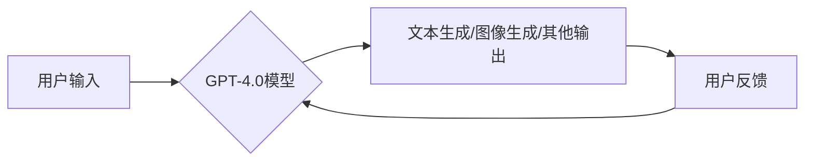

> GPT-4.0, 大语言模型, 实际应用, 创新, 挑战

## 1. 背景介绍

近年来，人工智能（AI）技术取得了飞速发展，其中大语言模型（LLM）作为AI领域的重要分支，展现出强大的学习和生成文本的能力。OpenAI推出的GPT系列模型，特别是GPT-4.0，凭借其先进的算法和海量数据训练，在文本生成、翻译、摘要、问答等领域取得了突破性的进展，引发了广泛的关注和讨论。

GPT-4.0作为一款多模态的大语言模型，不仅能够理解和生成文本，还能处理图像、音频等多种数据类型。它拥有更强大的参数规模、更丰富的训练数据和更先进的算法架构，使其在性能、准确性和泛化能力方面都取得了显著提升。

## 2. 核心概念与联系

### 2.1  大语言模型（LLM）

大语言模型是指能够理解和生成人类语言的深度学习模型。它们通常基于Transformer架构，通过学习海量文本数据，掌握语言的语法、语义和上下文关系。

### 2.2  GPT-4.0

GPT-4.0是OpenAI开发的第四代生成式预训练转换器模型，它是一个参数规模庞大的多模态模型，能够处理文本、图像等多种数据类型。

### 2.3  实际应用

GPT-4.0的强大能力使其在各个领域都有着广泛的应用前景，例如：

* **文本生成:** 自动写作、创意写作、代码生成、剧本创作等。
* **翻译:** 精准的跨语言文本翻译。
* **摘要:** 自动生成文本摘要，提取关键信息。
* **问答:** 回答用户的问题，提供相关信息。
* **对话系统:** 开发更自然、更智能的聊天机器人。
* **图像理解:** 描述图像内容、识别物体、生成图像等。

**Mermaid 流程图**



## 3. 核心算法原理 & 具体操作步骤

### 3.1  算法原理概述

GPT-4.0的核心算法是基于Transformer架构的深度学习模型。Transformer模型通过自注意力机制，能够捕捉文本序列中长距离依赖关系，从而实现更准确的文本理解和生成。

GPT-4.0在Transformer架构的基础上进行了改进，例如：

* **更大的参数规模:** GPT-4.0拥有比前几代模型更多的参数，这使得模型能够学习更复杂的语言模式。
* **更丰富的训练数据:** GPT-4.0在海量文本数据上进行训练，这使得模型能够掌握更广泛的语言知识。
* **多模态能力:** GPT-4.0能够处理文本、图像等多种数据类型，这使得模型能够应用于更广泛的场景。

### 3.2  算法步骤详解

GPT-4.0的训练过程可以概括为以下步骤：

1. **数据预处理:** 将文本数据进行清洗、分词、标记等预处理操作。
2. **模型训练:** 使用梯度下降算法，在训练数据上训练GPT-4.0模型。
3. **模型评估:** 使用测试数据评估模型的性能，例如准确率、困惑度等。
4. **模型调优:** 根据评估结果，调整模型参数，提高模型性能。

### 3.3  算法优缺点

**优点:**

* 强大的文本生成能力
* 精准的语言理解能力
* 广泛的应用场景

**缺点:**

* 训练成本高
* 存在潜在的偏见和错误
* 需要大量的计算资源

### 3.4  算法应用领域

GPT-4.0的应用领域非常广泛，包括：

* **自然语言处理:** 文本分类、情感分析、机器翻译等。
* **人工智能助手:** 聊天机器人、虚拟助理等。
* **内容创作:** 自动写作、创意写作、代码生成等。
* **教育:** 智能辅导、个性化学习等。
* **医疗:** 疾病诊断、药物研发等。

## 4. 数学模型和公式 & 详细讲解 & 举例说明

### 4.1  数学模型构建

GPT-4.0的数学模型基于Transformer架构，其核心是自注意力机制。自注意力机制能够捕捉文本序列中不同词之间的关系，从而实现更准确的文本理解和生成。

### 4.2  公式推导过程

自注意力机制的计算公式如下：

$$
Attention(Q, K, V) = softmax(\frac{QK^T}{\sqrt{d_k}})V
$$

其中：

* $Q$：查询矩阵
* $K$：键矩阵
* $V$：值矩阵
* $d_k$：键向量的维度
* $softmax$：softmax函数

### 4.3  案例分析与讲解

假设我们有一个文本序列“我爱学习编程”，我们想要计算“学习”这个词与其他词之间的关系。

1. 将文本序列转换为词嵌入向量。
2. 计算查询矩阵 $Q$、键矩阵 $K$ 和值矩阵 $V$。
3. 使用公式计算自注意力权重。
4. 将权重与值矩阵相乘，得到最终的注意力输出。

通过分析注意力输出，我们可以了解“学习”这个词与其他词之间的关系，例如，“学习”与“编程”的关系比较强，因为它们共同构成了一个主题。

## 5. 项目实践：代码实例和详细解释说明

### 5.1  开发环境搭建

为了使用GPT-4.0，需要搭建相应的开发环境。OpenAI提供了API接口，可以通过API调用GPT-4.0模型进行文本生成等操作。

### 5.2  源代码详细实现

```python
import openai

# 设置API密钥
openai.api_key = "YOUR_API_KEY"

# 定义文本生成任务
prompt = "写一篇关于人工智能的文章。"

# 调用GPT-4.0模型进行文本生成
response = openai.Completion.create(
    engine="text-davinci-003",
    prompt=prompt,
    max_tokens=100,
    temperature=0.7
)

# 打印生成文本
print(response.choices[0].text)
```

### 5.3  代码解读与分析

* `import openai`: 导入OpenAI的Python库。
* `openai.api_key = "YOUR_API_KEY"`: 设置OpenAI API密钥。
* `prompt = "写一篇关于人工智能的文章。"`: 定义文本生成任务的提示信息。
* `openai.Completion.create(...)`: 调用GPT-4.0模型进行文本生成。
* `engine="text-davinci-003"`: 指定使用的GPT-4.0模型引擎。
* `max_tokens=100`: 设置生成的文本长度上限。
* `temperature=0.7`: 控制文本生成的随机性。
* `print(response.choices[0].text)`: 打印生成的文本内容。

### 5.4  运行结果展示

运行上述代码后，将输出一篇关于人工智能的文章。

## 6. 实际应用场景

### 6.1  文本生成

GPT-4.0可以用于自动生成各种文本内容，例如：

* **新闻报道:** 根据事件数据自动生成新闻报道。
* **产品描述:** 根据产品信息自动生成产品描述。
* **广告文案:** 根据目标受众自动生成广告文案。

### 6.2  翻译

GPT-4.0可以实现精准的跨语言文本翻译，例如：

* **网站翻译:** 将网站内容翻译成不同的语言。
* **文档翻译:** 将文档翻译成不同的语言。
* **实时翻译:** 将实时语音或文本翻译成不同的语言。

### 6.3  摘要

GPT-4.0可以自动生成文本摘要，提取关键信息，例如：

* **会议纪要:** 自动生成会议纪要，提取关键议题和决策。
* **学术论文摘要:** 自动生成学术论文摘要，提取研究内容和结论。
* **新闻摘要:** 自动生成新闻摘要，提取新闻要点和事件背景。

### 6.4  未来应用展望

GPT-4.0的未来应用前景非常广阔，例如：

* **个性化教育:** 根据学生的学习进度和需求，提供个性化的学习内容和辅导。
* **智能客服:** 开发更智能、更自然的客服机器人，提供更优质的客户服务。
* **创意写作:** 辅助人类进行创意写作，例如小说、剧本、诗歌等。
* **科学研究:** 辅助科学家进行科学研究，例如数据分析、模型构建等。

## 7. 工具和资源推荐

### 7.1  学习资源推荐

* **OpenAI官方文档:** https://platform.openai.com/docs/
* **HuggingFace Transformers库:** https://huggingface.co/docs/transformers/index
* **DeepLearning.AI课程:** https://www.deeplearning.ai/

### 7.2  开发工具推荐

* **Python:** https://www.python.org/
* **Jupyter Notebook:** https://jupyter.org/

### 7.3  相关论文推荐

* **Attention Is All You Need:** https://arxiv.org/abs/1706.03762
* **Language Models are Few-Shot Learners:** https://arxiv.org/abs/2005.14165

## 8. 总结：未来发展趋势与挑战

### 8.1  研究成果总结

GPT-4.0的出现标志着大语言模型技术取得了重大突破，其强大的能力和广泛的应用前景，为人工智能的发展带来了新的机遇。

### 8.2  未来发展趋势

未来，大语言模型技术将朝着以下方向发展：

* **更大的模型规模:** 模型参数规模将继续扩大，从而提升模型的性能和能力。
* **更丰富的多模态能力:** 模型将能够处理更多种类的输入数据，例如图像、音频、视频等。
* **更强的推理能力:** 模型将能够进行更复杂的推理和决策，例如解决问题、规划行动等。
* **更注重伦理和安全:** 模型的开发和应用将更加注重伦理和安全问题，例如避免偏见、确保隐私等。

### 8.3  面临的挑战

大语言模型技术也面临着一些挑战：

* **训练成本高:** 训练大型语言模型需要大量的计算资源和时间，成本很高。
* **数据安全问题:** 模型的训练数据可能包含敏感信息，需要采取措施保护数据安全。
* **模型可解释性问题:** 模型的决策过程难以理解，需要提高模型的可解释性。
* **伦理和社会影响问题:** 模型的应用可能带来一些伦理和社会问题，需要进行深入研究和讨论。

### 8.4  研究展望

未来，我们需要继续深入研究大语言模型技术，解决其面临的挑战，并将其应用于更多领域，为人类社会带来更多福祉。

## 9. 附录：常见问题与解答

**Q1: GPT-4.0和GPT-3.5有什么区别？**

**A1:** GPT-4.0比GPT-3.5更强大，拥有更大的参数规模、更丰富的训练数据和更先进的算法架构。

**Q2: 如何使用GPT-4.0？**

**A2:** 可以通过OpenAI提供的API接口调用GPT-4.0模型进行文本生成等操作。

**Q3: GPT-4.0的训练数据是什么？**

**A3:** OpenAI没有公开GPT-4.0的训练数据具体内容。

**Q4: GPT-4.0存在哪些局限性？**

**A4:** GPT-4.0可能存在偏见、错误和安全风险，需要谨慎使用。

**Q5: GPT-4.0的未来发展趋势是什么？**

**A5:** 未来，GPT-4.0将朝着更大的模型规模、更丰富的多模态能力、更强的推理能力和更注重伦理和安全的方向发展。


作者：禅与计算机程序设计艺术 / Zen and