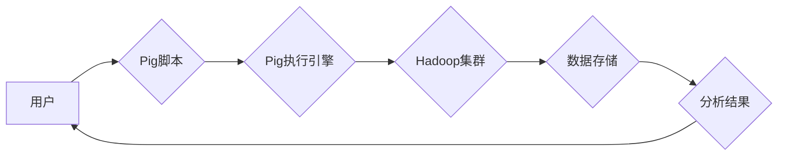

> Pig, Hadoop, 数据分析, MapReduce, 脚本语言, 数据处理, 数据挖掘

## 1. 背景介绍

随着互联网和移动互联网的快速发展，海量数据呈爆炸式增长。如何高效地存储、管理和分析这些数据成为了当今企业和研究机构面临的重大挑战。Pig是一个基于Hadoop的开源数据分析平台，它提供了一种简单易用的脚本语言来处理和分析大规模数据。Pig通过将数据分析任务分解成一系列的MapReduce作业，并利用Hadoop的分布式计算能力，能够高效地处理海量数据。

## 2. 核心概念与联系

Pig平台的核心概念包括：

* **数据流:** Pig将数据视为一个流，可以进行一系列的转换和操作。
* **脚本语言:** Pig使用一种类似SQL的脚本语言来定义数据分析任务。
* **MapReduce:** Pig将数据分析任务分解成一系列的MapReduce作业，并利用Hadoop的分布式计算能力进行执行。
* **数据类型:** Pig支持多种数据类型，包括整数、浮点数、字符串、布尔值等。
* **UDF:** Pig支持用户自定义函数(UDF)，可以扩展Pig的分析能力。

**Pig平台架构图:**



## 3. 核心算法原理 & 具体操作步骤

### 3.1  算法原理概述

Pig平台的核心算法是基于MapReduce的分布式计算模型。MapReduce将数据分析任务分解成两个阶段：

* **Map阶段:** 将数据划分为多个块，每个块由一个Map任务处理。Map任务对每个数据块进行处理，并将处理结果输出为键值对。
* **Reduce阶段:** 将所有Map任务的输出结果聚合，每个聚合操作由一个Reduce任务处理。Reduce任务对相同键的键值对进行聚合，并将最终结果输出。

### 3.2  算法步骤详解

1. **数据加载:** 将数据加载到Hadoop集群中。
2. **脚本编写:** 使用Pig脚本语言定义数据分析任务。
3. **Pig执行引擎:** Pig执行引擎将Pig脚本编译成MapReduce作业。
4. **MapReduce执行:** Hadoop集群执行MapReduce作业，对数据进行处理。
5. **结果输出:** 将处理结果输出到Hadoop集群中。

### 3.3  算法优缺点

**优点:**

* **分布式计算:** 可以利用Hadoop集群的分布式计算能力，高效地处理海量数据。
* **易用性:** Pig脚本语言简单易用，可以方便地定义数据分析任务。
* **可扩展性:** Pig平台可以根据需要扩展集群规模，处理更大的数据量。

**缺点:**

* **性能瓶颈:** MapReduce模型存在性能瓶颈，对于一些复杂的分析任务，性能可能不足。
* **数据类型限制:** Pig平台对数据类型的支持有限，对于一些复杂的数据类型，可能需要使用UDF进行处理。

### 3.4  算法应用领域

Pig平台广泛应用于以下领域:

* **数据挖掘:** 从海量数据中发现模式和趋势。
* **机器学习:** 训练机器学习模型，进行预测和分类。
* **商业智能:** 分析商业数据，提高决策效率。
* **科学研究:** 处理和分析科学数据，进行研究和探索。

## 4. 数学模型和公式 & 详细讲解 & 举例说明

### 4.1  数学模型构建

Pig平台的算法模型基于MapReduce的思想，可以抽象为以下数学模型：

* **输入数据:** $D = \{d_1, d_2, ..., d_n\}$，其中$d_i$表示单个数据点。
* **Map函数:** $f_m: d_i \rightarrow \{ (k_j, v_j) \}$，其中$k_j$表示键，$v_j$表示值，$f_m$将每个数据点$d_i$映射到多个键值对。
* **Reduce函数:** $f_r: \{ (k_j, v_j) \} \rightarrow v_r$，其中$f_r$将相同键的键值对聚合，得到最终结果$v_r$。

### 4.2  公式推导过程

Pig平台的计算过程可以表示为以下公式：

* **Map阶段:** $D' = \bigcup_{i=1}^{n} f_m(d_i)$
* **Reduce阶段:** $R = \bigcup_{k_j} f_r(\{ (k_j, v_j) \})$

其中，$D'$表示Map阶段的输出结果，$R$表示Reduce阶段的最终结果。

### 4.3  案例分析与讲解

例如，我们想要统计每个单词出现的次数。可以使用Pig脚本语言编写如下代码：

```pig
data = LOAD 'input.txt' USING PigStorage('\t');
word_counts = GROUP data BY $0;
result = FOREACH word_counts GENERATE group, COUNT(data);
STORE result INTO 'output.txt';
```

在这个例子中，`LOAD`语句加载数据，`GROUP`语句将数据分组，`COUNT`语句统计每个分组的元素个数，`FOREACH`语句遍历分组，`STORE`语句将结果存储到文件。

## 5. 项目实践：代码实例和详细解释说明

### 5.1  开发环境搭建

为了使用Pig平台，需要搭建一个Hadoop集群环境。Hadoop集群环境的搭建步骤可以参考Hadoop官方文档。

### 5.2  源代码详细实现

以下是一个简单的Pig脚本代码实例，用于计算一个数据集中的平均值：

```pig
-- 定义数据源
data = LOAD 'input.txt' USING PigStorage('\t');

-- 计算平均值
avg = AVG(data.$0);

-- 输出结果
DUMP avg;
```

### 5.3  代码解读与分析

* `LOAD 'input.txt' USING PigStorage('\t')`: 从文件`input.txt`中加载数据，使用制表符`\t`作为分隔符。
* `AVG(data.$0)`: 计算数据列`$0`的平均值。
* `DUMP avg`: 输出平均值的结果。

### 5.4  运行结果展示

运行上述Pig脚本代码后，会输出数据集中的平均值。

## 6. 实际应用场景

Pig平台在实际应用场景中具有广泛的应用价值。例如：

* **电商平台:** 分析用户购买行为，推荐商品，提高转化率。
* **金融机构:** 识别欺诈交易，评估风险，优化投资策略。
* **医疗机构:** 分析患者数据，预测疾病风险，提高诊断准确率。

### 6.4  未来应用展望

随着大数据技术的不断发展，Pig平台的应用场景将会更加广泛。未来，Pig平台可能会与其他大数据技术，例如Spark和Flink，进行整合，提供更强大的数据分析能力。

## 7. 工具和资源推荐

### 7.1  学习资源推荐

* **Pig官方文档:** https://pig.apache.org/docs/r0.14.0/
* **Hadoop官方文档:** https://hadoop.apache.org/docs/current/

### 7.2  开发工具推荐

* **Pig客户端:** Pig提供了命令行客户端和图形化界面客户端。
* **IDE:** Eclipse、IntelliJ IDEA等IDE可以用于编写Pig脚本。

### 7.3  相关论文推荐

* **Pig: A Platform for Analyzing Terabytes of Data**
* **MapReduce: Simplified Data Processing on Large Clusters**

## 8. 总结：未来发展趋势与挑战

### 8.1  研究成果总结

Pig平台作为一种基于Hadoop的开源数据分析平台，为大规模数据分析提供了简单易用的解决方案。Pig平台的算法模型、脚本语言和工具都经过了多年的发展和完善，已经成为大数据分析领域的重要工具之一。

### 8.2  未来发展趋势

未来，Pig平台的发展趋势包括：

* **与其他大数据技术整合:** 与Spark、Flink等大数据技术进行整合，提供更强大的数据分析能力。
* **支持更多数据类型:** 支持更多复杂的数据类型，例如图数据、时间序列数据等。
* **提高性能和效率:** 优化算法模型和执行引擎，提高Pig平台的性能和效率。

### 8.3  面临的挑战

Pig平台也面临一些挑战：

* **性能瓶颈:** MapReduce模型存在性能瓶颈，对于一些复杂的分析任务，性能可能不足。
* **数据类型限制:** Pig平台对数据类型的支持有限，对于一些复杂的数据类型，可能需要使用UDF进行处理。
* **人才缺口:** Pig平台的开发和维护需要专业人才，人才缺口是一个不容忽视的问题。

### 8.4  研究展望

未来，研究人员将继续致力于解决Pig平台面临的挑战，提高其性能、扩展性和易用性，使其成为更强大的大数据分析平台。

## 9. 附录：常见问题与解答

### 9.1  常见问题

* Pig平台与Hadoop的关系是什么？
* Pig平台的脚本语言有哪些特点？
* Pig平台有哪些应用场景？

### 9.2  解答

* Pig平台是基于Hadoop的开源数据分析平台，它利用Hadoop的分布式计算能力，提供了一种简单易用的数据分析解决方案。
* Pig平台的脚本语言类似SQL，语法简单易懂，可以方便地定义数据分析任务。
* Pig平台广泛应用于电商平台、金融机构、医疗机构等领域，用于分析用户行为、识别欺诈交易、预测疾病风险等。


作者：禅与计算机程序设计艺术 / Zen and the Art of Computer Programming 
<end_of_turn>