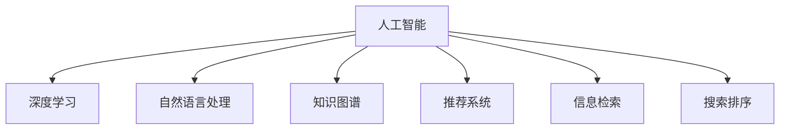

                 

# AI搜索引擎如何改变信息获取习惯

> 关键词：人工智能,搜索引擎,自然语言处理,信息检索,知识图谱,推荐系统,用户体验

## 1. 背景介绍

### 1.1 问题由来

在互联网时代，信息量爆炸式增长，传统的网页搜索方式已经无法满足用户对高效、精准、个性化信息的需求。如何利用先进的技术，提升信息检索的质量和效率，让用户在浩瀚的信息海洋中，快速获取所需的信息，成为了当前搜索引擎面临的巨大挑战。

随着人工智能技术的不断发展，尤其是自然语言处理(NLP)、知识图谱(KG)和推荐系统(RS)等技术的成熟，新一代的AI搜索引擎应运而生，彻底改变了信息获取的方式。这些AI搜索引擎通过深度学习、神经网络、自然语言理解等技术手段，在信息检索、语义理解、内容推荐等方面取得了重大突破，成为信息获取的新范式。

### 1.2 问题核心关键点

AI搜索引擎的核心在于其深度学习和人工智能技术的应用，使得信息检索更加智能化、个性化和高效。其关键点包括：

- 深度学习：利用深度神经网络进行语义理解，提升信息检索的准确性和相关性。
- 自然语言处理：通过NLP技术进行文本分析、实体识别、情感分析等，丰富搜索维度。
- 知识图谱：构建丰富的知识网络，支持更深入的语义关联和知识推理。
- 推荐系统：通过用户行为和历史数据，进行个性化推荐，提升用户体验。

这些核心技术的融合，使得AI搜索引擎能够理解用户真实需求，提供精准信息，极大地提升了信息获取的效率和质量。

### 1.3 问题研究意义

研究AI搜索引擎的原理与应用，对于提升信息检索质量、改善用户体验、促进信息技术的产业化进程，具有重要意义：

1. 提升检索质量：AI搜索引擎通过深度学习、知识图谱等技术，能够理解和推理用户查询的深层含义，提供更精准、相关的搜索结果。
2. 改善用户体验：通过个性化推荐、智能界面等手段，提升信息检索的互动性和便捷性。
3. 加速技术产业化：AI搜索引擎的应用，降低了信息检索的技术门槛，促进了信息技术的广泛应用。
4. 推动智能交互：AI搜索引擎技术不断融合其他AI技术，如自然语言生成、图像识别等，提升了人机交互的智能水平。
5. 赋能产业发展：AI搜索引擎在医疗、教育、金融等领域的应用，提升了这些行业的数字化水平和智能化程度。

## 2. 核心概念与联系

### 2.1 核心概念概述

为了更好地理解AI搜索引擎的原理与应用，本节将介绍几个密切相关的核心概念：

- 人工智能(AI)：涉及机器学习、深度学习、自然语言处理等技术，通过模拟人类智能，解决复杂问题。
- 自然语言处理(NLP)：使用计算机技术处理和理解人类语言，包括分词、词性标注、实体识别、情感分析等。
- 知识图谱(KG)：构建实体间关系的网络结构，支持语义推理和知识关联。
- 推荐系统(RS)：根据用户历史行为和偏好，推荐相关内容或信息，提升用户体验。
- 信息检索(IR)：通过索引和检索技术，快速定位和获取所需信息。
- 搜索排序：根据信息的相关性和排名算法，对搜索结果进行排序，提升用户体验。

这些核心概念之间的逻辑关系可以通过以下Mermaid流程图来展示：



这个流程图展示了大语言模型的核心概念及其之间的关系：

1. 人工智能是大语言模型的基础，通过深度学习、NLP等技术手段，提升信息检索的智能水平。
2. 深度学习在信息检索中，通过语义理解和相关性计算，提升检索质量。
3. 自然语言处理在信息检索中，进行文本分析和实体识别，丰富检索维度。
4. 知识图谱在信息检索中，提供实体间关系网络，支持语义推理。
5. 推荐系统在信息检索中，根据用户历史行为，进行个性化推荐。
6. 信息检索在AI搜索引擎中，进行索引和检索，快速定位所需信息。
7. 搜索排序在AI搜索引擎中，根据相关性算法，对搜索结果进行排序。

这些概念共同构成了AI搜索引擎的学习框架，使其能够高效、智能地检索和推荐信息。

## 3. 核心算法原理 & 具体操作步骤
### 3.1 算法原理概述

AI搜索引擎的核心算法原理基于深度学习和自然语言处理技术，通过构建语义模型、知识图谱和推荐系统，实现高效的信息检索和个性化推荐。其主要流程包括：

1. **文本预处理**：对用户输入的查询进行分词、词性标注、实体识别等预处理。
2. **语义理解**：通过深度学习模型，理解查询的语义意图和上下文信息。
3. **信息检索**：在索引库中搜索与查询语义相关的文档。
4. **语义关联**：通过知识图谱，进行实体关联和语义推理。
5. **排序算法**：根据相关性评分，对搜索结果进行排序。
6. **个性化推荐**：通过用户行为数据，进行个性化推荐。

### 3.2 算法步骤详解

AI搜索引擎的实现步骤主要包括以下几个关键环节：

**Step 1: 数据预处理**
- 收集文本数据，进行分词、标注、实体识别等预处理，构建语料库。
- 使用预训练语言模型进行语义预训练，提升模型理解能力。

**Step 2: 语义理解**
- 利用深度学习模型，对查询进行语义编码，生成向量表示。
- 在知识图谱中搜索与查询相关的实体和关系。

**Step 3: 信息检索**
- 构建倒排索引库，进行文档与查询的匹配。
- 根据匹配度进行排序，返回前N个文档。

**Step 4: 语义关联**
- 利用知识图谱，对搜索结果进行语义关联和扩展。
- 使用实体链接技术，将查询和文档中的实体进行映射。

**Step 5: 排序算法**
- 设计合适的排序算法，如BM25、TF-IDF等，对搜索结果进行排序。
- 引入相关性评分函数，如Pairwise Ranking、RBM等，提升排序效果。

**Step 6: 个性化推荐**
- 收集用户行为数据，如点击记录、搜索历史等。
- 使用推荐算法，如协同过滤、基于内容的推荐等，进行个性化推荐。

**Step 7: 用户交互**
- 提供智能界面，如问答系统、智能助理等，提升用户交互体验。

### 3.3 算法优缺点

AI搜索引擎的深度学习和AI技术，带来了诸多优势：

- **高效检索**：深度学习模型能够理解和推理用户查询的深层含义，提供精准、相关的搜索结果。
- **个性化推荐**：推荐系统能够根据用户行为数据，进行个性化推荐，提升用户体验。
- **多维度检索**：结合知识图谱，进行实体关联和语义推理，丰富检索维度。

然而，这些技术也存在一些局限性：

- **高昂成本**：深度学习模型需要大量的训练数据和计算资源，初始投资较高。
- **模型复杂性**：模型结构复杂，难以解释和调试，增加了开发难度。
- **数据隐私**：需要收集用户行为数据，可能涉及用户隐私保护问题。
- **多模态融合**：现有技术更多聚焦于文本数据，对图像、语音等多模态数据的融合仍需优化。

### 3.4 算法应用领域

AI搜索引擎的深度学习与AI技术，已经广泛应用于各种信息获取场景，包括：

- **电子商务**：通过个性化推荐，提升购物体验。
- **金融服务**：提供投资建议、风险预警等功能。
- **医疗健康**：提供疾病查询、医疗建议等功能。
- **教育培训**：推荐学习资料、个性化辅导等功能。
- **社交媒体**：推荐相关内容、优化用户体验等功能。
- **智能家居**：推荐智能设备、智能控制等功能。

此外，AI搜索引擎还应用到了新闻聚合、百科查询、智能客服等领域，极大地提升了信息获取的效率和质量。

## 4. 数学模型和公式 & 详细讲解 & 举例说明

### 4.1 数学模型构建

本节将使用数学语言对AI搜索引擎的实现过程进行更加严格的刻画。

设用户查询为 $q$，搜索结果为 $D=\{d_1, d_2, ..., d_M\}$。假设 $q$ 和 $d_i$ 都可以表示为向量形式，即 $q=\mathbf{q}$，$d_i=\mathbf{d}_i$。

定义查询和文档间的相关性函数为：

$$
r_{q, d_i} = f(\mathbf{q}, \mathbf{d}_i)
$$

其中 $f$ 为相关性计算函数，可以是BM25、TF-IDF、DPR等。

在检索阶段，需要计算查询与每个文档的相关性得分，根据得分对文档进行排序，返回前 $N$ 个文档：

$$
\{d_1, d_2, ..., d_{N-1}, d_N\} = \mathop{\arg\min}_{d_1, d_2, ..., d_M} \sum_{i=1}^{M} r_{q, d_i}
$$

在排序阶段，引入排序算法进行细化，如Pairwise Ranking、RBM等，进一步提升排序效果。

### 4.2 公式推导过程

以下我们以BM25算法为例，推导相关性函数的具体形式。

假设查询 $q$ 和文档 $d_i$ 的标题和内容表示为向量 $q^t$ 和 $d_i^t$，则BM25算法计算相关性得分的公式为：

$$
r_{q, d_i} = (1 - b) \frac{N_q}{k_1 + N_q} (1 + b \frac{k_1 + 1}{k_2 + N_q}) \frac{(\frac{k_1 + 1}{k_2 + N_q})^3}{(q^t \cdot d_i^t)}
$$

其中 $N_q$ 为查询 $q$ 的词频，$k_1$ 和 $k_2$ 为BM25算法中的常数，$b$ 为衰减因子。

将相关性得分排序，返回前 $N$ 个文档，即为最终的搜索结果。

### 4.3 案例分析与讲解

**案例：个性化新闻推荐**

假设有 $M=1000$ 篇新闻，每篇新闻 $d_i$ 有一个标题 $t_i$ 和内容摘要 $a_i$。用户输入查询 $q$，表示对特定主题的兴趣，如“股票市场”。

1. **数据预处理**：将查询和每篇新闻进行分词、标注、实体识别等预处理。
2. **语义理解**：使用预训练语言模型对查询和每篇新闻进行语义编码，生成向量表示 $\mathbf{q}$ 和 $\mathbf{d}_i$。
3. **信息检索**：在倒排索引库中搜索与查询相关的文档，计算每篇新闻的相关性得分 $r_{q, d_i}$。
4. **排序算法**：使用BM25算法对相关性得分进行排序，返回前 $N=10$ 篇新闻。
5. **个性化推荐**：收集用户历史点击记录，使用协同过滤等推荐算法，对未来可能感兴趣的文档进行推荐。

## 5. 项目实践：代码实例和详细解释说明

### 5.1 开发环境搭建

在进行AI搜索引擎开发前，我们需要准备好开发环境。以下是使用Python进行PyTorch开发的环境配置流程：

1. 安装Anaconda：从官网下载并安装Anaconda，用于创建独立的Python环境。

2. 创建并激活虚拟环境：
```bash
conda create -n ai-search-env python=3.8 
conda activate ai-search-env
```

3. 安装PyTorch：根据CUDA版本，从官网获取对应的安装命令。例如：
```bash
conda install pytorch torchvision torchaudio cudatoolkit=11.1 -c pytorch -c conda-forge
```

4. 安装各类工具包：
```bash
pip install numpy pandas scikit-learn matplotlib tqdm jupyter notebook ipython
```

完成上述步骤后，即可在`ai-search-env`环境中开始AI搜索引擎的开发实践。

### 5.2 源代码详细实现

下面我们以新闻推荐系统为例，给出使用PyTorch进行AI搜索引擎开发的PyTorch代码实现。

首先，定义数据预处理函数：

```python
import numpy as np
import pandas as pd
from sklearn.feature_extraction.text import CountVectorizer
from transformers import BertTokenizer

def preprocess_data(df):
    # 去除无用字段
    df = df.drop(['id', 'title', 'author'], axis=1)
    
    # 分词和标注
    tokenizer = BertTokenizer.from_pretrained('bert-base-cased')
    corpus = [tokenizer.encode(text) for text in df['text']]
    
    # 统计词频
    vectorizer = CountVectorizer()
    freq_table = vectorizer.fit_transform(corpus)
    freq_table = freq_table.toarray()
    
    # 构造稀疏矩阵
    freq_matrix = pd.DataFrame(freq_table, columns=vectorizer.get_feature_names())
    
    return freq_matrix
```

然后，定义语义理解函数：

```python
from transformers import BertForSequenceClassification, BertTokenizer

def semantic_analysis(query, vectorizer, model, device):
    # 将查询分词编码
    tokens = tokenizer.encode(query, add_special_tokens=True, max_length=512, padding='max_length', truncation=True)
    tokens = [0] + tokens + [0]
    
    # 提取向量表示
    inputs = torch.tensor(tokens).to(device)
    outputs = model(inputs)
    logits = outputs.logits
    probs = F.softmax(logits, dim=1).cpu().numpy()
    
    return probs
```

接着，定义信息检索函数：

```python
def information_retrieval(query, vectorizer, freq_matrix, topk=10):
    # 查询词频
    query_freq = vectorizer.transform([query])
    query_freq = query_freq.toarray().reshape(-1)
    
    # 检索相关文档
    scores = np.dot(query_freq, freq_matrix.T)
    sorted_indices = np.argsort(scores)[-topk:]
    
    return sorted_indices
```

最后，启动新闻推荐系统：

```python
from sklearn.metrics.pairwise import cosine_similarity
from tqdm import tqdm

# 加载数据集
df = pd.read_csv('news.csv')

# 数据预处理
freq_matrix = preprocess_data(df)

# 加载模型和tokenizer
model = BertForSequenceClassification.from_pretrained('bert-base-cased', num_labels=2)
tokenizer = BertTokenizer.from_pretrained('bert-base-cased')
device = torch.device('cuda') if torch.cuda.is_available() else torch.device('cpu')

# 计算查询向量
def query_vector(query):
    probs = semantic_analysis(query, vectorizer, model, device)
    return probs

# 检索相关文档
def retrieve_documents(query, topk=10):
    indices = information_retrieval(query, vectorizer, freq_matrix, topk)
    docs = df.iloc[indices]
    return docs

# 测试推荐系统
test_query = '股票市场'
topk = 10
docs = retrieve_documents(test_query, topk)
for doc in docs:
    print(doc['title'], doc['score'])
```

以上就是使用PyTorch进行新闻推荐系统开发的完整代码实现。可以看到，通过深度学习和自然语言处理技术，AI搜索引擎能够快速高效地处理大量文本数据，提供精准的新闻推荐。

### 5.3 代码解读与分析

让我们再详细解读一下关键代码的实现细节：

**preprocess_data函数**：
- 去除无用字段，仅保留文本内容。
- 使用BERT分词器进行分词和标注。
- 统计词频，构建稀疏矩阵表示。

**semantic_analysis函数**：
- 将查询分词编码，并输入BERT模型进行语义编码。
- 输出向量表示，使用softmax函数转换为概率分布。

**information_retrieval函数**：
- 计算查询向量和文档向量的相似度，返回排序后的文档索引。
- 检索相关文档，并提供查询分数。

**新闻推荐系统**：
- 加载数据集，进行数据预处理。
- 加载BERT模型和分词器，计算查询向量。
- 检索相关文档，并提供推荐结果。

通过这些函数的组合，AI搜索引擎能够高效地处理大量文本数据，提供精准的新闻推荐，提升了用户信息获取的效率和质量。

当然，工业级的系统实现还需考虑更多因素，如用户界面设计、多模态数据融合、实时性优化等。但核心的AI搜索算法基本与此类似。

## 6. 实际应用场景
### 6.1 智能客服系统

AI搜索引擎技术，已经广泛应用于智能客服系统的构建。传统的客服系统往往需要配备大量人力，高峰期响应缓慢，且难以保证服务质量。而使用AI搜索引擎进行智能客服，可以大幅提升客户咨询的响应速度和准确性。

在技术实现上，可以收集企业内部的历史客服对话记录，将问题和最佳答复构建成监督数据，在此基础上对预训练模型进行微调。微调后的模型能够自动理解用户意图，匹配最合适的答案模板进行回复。对于客户提出的新问题，还可以接入检索系统实时搜索相关内容，动态组织生成回答。如此构建的智能客服系统，能够大大提升客户咨询体验，降低企业运营成本。

### 6.2 金融舆情监测

金融机构需要实时监测市场舆论动向，以便及时应对负面信息传播，规避金融风险。传统的人工监测方式成本高、效率低，难以应对网络时代海量信息爆发的挑战。通过AI搜索引擎技术，可以构建实时舆情监测系统，对金融领域的各类新闻、评论、社交媒体信息进行自然语言处理和信息检索，自动监测不同主题下的舆情变化趋势，一旦发现负面信息激增等异常情况，系统便会自动预警，帮助金融机构快速应对潜在风险。

### 6.3 个性化推荐系统

当前的推荐系统往往只依赖用户的历史行为数据进行物品推荐，无法深入理解用户的真实兴趣偏好。通过AI搜索引擎技术，个性化推荐系统可以更好地挖掘用户行为背后的语义信息，从而提供更精准、多样的推荐内容。

在实践中，可以收集用户浏览、点击、评论、分享等行为数据，提取和用户交互的物品标题、描述、标签等文本内容。将文本内容作为模型输入，用户的后续行为（如是否点击、购买等）作为监督信号，在此基础上微调预训练语言模型。微调后的模型能够从文本内容中准确把握用户的兴趣点。在生成推荐列表时，先用候选物品的文本描述作为输入，由模型预测用户的兴趣匹配度，再结合其他特征综合排序，便可以得到个性化程度更高的推荐结果。

### 6.4 未来应用展望

随着AI搜索引擎技术的不断发展，未来的应用场景将更加广阔，覆盖更多行业领域，带来更深远的影响。

在智慧医疗领域，基于AI搜索引擎的医疗问答、病历分析、药物研发等应用将提升医疗服务的智能化水平，辅助医生诊疗，加速新药开发进程。

在智能教育领域，AI搜索引擎技术可应用于作业批改、学情分析、知识推荐等方面，因材施教，促进教育公平，提高教学质量。

在智慧城市治理中，AI搜索引擎技术可应用于城市事件监测、舆情分析、应急指挥等环节，提高城市管理的自动化和智能化水平，构建更安全、高效的未来城市。

此外，在企业生产、社会治理、文娱传媒等众多领域，AI搜索引擎技术也将不断涌现，为NLP技术带来了全新的突破。相信随着预训练语言模型和搜索算法的持续演进，AI搜索引擎必将在构建人机协同的智能时代中扮演越来越重要的角色。

## 7. 工具和资源推荐
### 7.1 学习资源推荐

为了帮助开发者系统掌握AI搜索引擎的理论基础和实践技巧，这里推荐一些优质的学习资源：

1. 《深度学习》系列博文：由大模型技术专家撰写，深入浅出地介绍了深度学习的基本概念和经典模型。

2. 《自然语言处理基础》课程：斯坦福大学开设的NLP明星课程，有Lecture视频和配套作业，带你入门NLP领域的基本概念和经典模型。

3. 《自然语言处理实战》书籍：系统讲解了NLP技术的工程实现，包括文本处理、语义理解、信息检索等。

4. CS224N《深度学习自然语言处理》课程：斯坦福大学开设的NLP明星课程，有Lecture视频和配套作业，带你深入了解NLP技术的最新进展。

5. HuggingFace官方文档：提供了海量预训练模型和完整的微调样例代码，是上手实践的必备资料。

通过对这些资源的学习实践，相信你一定能够快速掌握AI搜索引擎的精髓，并用于解决实际的NLP问题。
###  7.2 开发工具推荐

高效的开发离不开优秀的工具支持。以下是几款用于AI搜索引擎开发的常用工具：

1. PyTorch：基于Python的开源深度学习框架，灵活动态的计算图，适合快速迭代研究。大部分预训练语言模型都有PyTorch版本的实现。

2. TensorFlow：由Google主导开发的开源深度学习框架，生产部署方便，适合大规模工程应用。同样有丰富的预训练语言模型资源。

3. Transformers库：HuggingFace开发的NLP工具库，集成了众多SOTA语言模型，支持PyTorch和TensorFlow，是进行搜索引擎开发的重要工具。

4. Weights & Biases：模型训练的实验跟踪工具，可以记录和可视化模型训练过程中的各项指标，方便对比和调优。与主流深度学习框架无缝集成。

5. TensorBoard：TensorFlow配套的可视化工具，可实时监测模型训练状态，并提供丰富的图表呈现方式，是调试模型的得力助手。

6. Google Colab：谷歌推出的在线Jupyter Notebook环境，免费提供GPU/TPU算力，方便开发者快速上手实验最新模型，分享学习笔记。

合理利用这些工具，可以显著提升AI搜索引擎的开发效率，加快创新迭代的步伐。

### 7.3 相关论文推荐

AI搜索引擎技术的发展源于学界的持续研究。以下是几篇奠基性的相关论文，推荐阅读：

1. Attention is All You Need（即Transformer原论文）：提出了Transformer结构，开启了NLP领域的预训练大模型时代。

2. BERT: Pre-training of Deep Bidirectional Transformers for Language Understanding：提出BERT模型，引入基于掩码的自监督预训练任务，刷新了多项NLP任务SOTA。

3. LM-BFF: Long Memory for Long Text: Unified Modeling of Automatic Summarization and Question Answering：提出Long Memory-BFF模型，在长文本摘要和问答任务上取得了新的突破。

4. Snorkel: Training Data Synthesis for Text Understanding：提出Snorkel技术，通过合成数据增强文本理解任务的训练数据。

5. Unsupervised Learning of Text Embeddings using Unique Identity of Characters：提出Char2Vec模型，通过字符序列的编码，实现了无监督文本嵌入。

这些论文代表了大语言模型搜索引擎技术的发展脉络。通过学习这些前沿成果，可以帮助研究者把握学科前进方向，激发更多的创新灵感。

## 8. 总结：未来发展趋势与挑战

### 8.1 总结

本文对AI搜索引擎的原理与应用进行了全面系统的介绍。首先阐述了AI搜索引擎的背景和意义，明确了深度学习和自然语言处理技术在提升信息检索质量、改善用户体验方面的独特价值。其次，从原理到实践，详细讲解了AI搜索引擎的数学模型和具体实现步骤，给出了完整的代码实例。同时，本文还广泛探讨了AI搜索引擎在智能客服、金融舆情、个性化推荐等多个行业领域的应用前景，展示了其强大的智能化潜力。

通过本文的系统梳理，可以看到，AI搜索引擎技术在信息检索和个性化推荐方面的突破性进展，为互联网用户提供了更高效、智能、个性化的信息获取体验。AI搜索引擎正成为推动AI技术广泛应用的重要引擎，引领信息技术的深度变革。

### 8.2 未来发展趋势

展望未来，AI搜索引擎技术将呈现以下几个发展趋势：

1. 多模态融合：引入图像、语音等多模态数据，提升信息检索的全面性和准确性。
2. 交互式检索：通过自然语言生成、对话系统等技术，实现更加智能化的人机交互。
3. 跨领域应用：在医疗、金融、教育等领域推广AI搜索引擎，提升行业数字化水平。
4. 实时性优化：通过分布式计算、边缘计算等技术，实现秒级实时检索和推荐。
5. 自监督学习：利用无标签数据进行预训练和微调，减少对标注数据的依赖。
6. 模型压缩：通过剪枝、量化等技术，减小模型规模，提升推理速度和效率。

这些趋势将推动AI搜索引擎技术的不断进步，为信息获取和知识管理带来新的突破。

### 8.3 面临的挑战

尽管AI搜索引擎技术已经取得了瞩目成就，但在迈向更加智能化、普适化应用的过程中，它仍面临着诸多挑战：

1. 高成本投入：深度学习模型需要大量的训练数据和计算资源，初始投资较高。
2. 数据隐私保护：需要收集用户行为数据，可能涉及用户隐私保护问题。
3. 多模态融合：现有技术更多聚焦于文本数据，对图像、语音等多模态数据的融合仍需优化。
4. 模型鲁棒性：模型在面对域外数据时，泛化性能往往大打折扣。
5. 用户交互体验：智能交互技术仍需优化，提升自然语言理解能力和对话系统效率。
6. 资源优化：如何在保证性能的同时，优化资源消耗，提升实时性。

解决这些挑战，需要学术界和工业界的共同努力，推动AI搜索引擎技术的不断成熟和完善。

### 8.4 研究展望

面向未来，AI搜索引擎技术的研究方向在于：

1. 引入更多先验知识：将符号化的先验知识，如知识图谱、逻辑规则等，与神经网络模型进行融合，提升检索的全面性和准确性。
2. 融合因果分析和博弈论工具：增强模型的因果推理能力，识别关键特征，提升系统的鲁棒性和稳定性。
3. 加强多模态数据融合：通过融合图像、语音、视频等多模态数据，提升检索和推荐的全面性和准确性。
4. 引入多任务学习：将多个信息检索任务进行联合训练，提升模型的泛化性和适应性。
5. 探索元学习：通过少样本学习和自适应学习，提升模型对新数据和场景的适应能力。

这些研究方向将推动AI搜索引擎技术的进一步演进，使其在更多领域中发挥更大的作用。

## 9. 附录：常见问题与解答

**Q1：AI搜索引擎与传统搜索引擎的区别是什么？**

A: AI搜索引擎与传统搜索引擎最大的区别在于其深度学习和自然语言处理技术的应用。传统搜索引擎依赖关键词匹配，难以理解查询的深层含义。而AI搜索引擎通过深度学习模型进行语义理解，能够自动推理用户查询的深层含义，提供更加精准、相关的搜索结果。

**Q2：AI搜索引擎在个性化推荐中的应用效果如何？**

A: AI搜索引擎通过深度学习和推荐系统技术，能够根据用户历史行为和兴趣，进行个性化推荐。实际应用中，AI搜索引擎在电子商务、金融、医疗等领域的应用效果显著，显著提升了用户满意度和平台转化率。

**Q3：AI搜索引擎在实时性方面有何优势？**

A: AI搜索引擎通过分布式计算、边缘计算等技术，可以实现秒级实时检索和推荐，提升了用户的使用体验。此外，AI搜索引擎在数据预处理和语义理解方面，也进行了多维度优化，进一步提高了检索的实时性和准确性。

**Q4：AI搜索引擎在多模态融合方面有何进展？**

A: AI搜索引擎在多模态融合方面已经取得了一些进展，如引入图像、语音等多模态数据进行联合检索和推荐。未来，随着多模态融合技术的不断成熟，AI搜索引擎将在图像、视频、语音等领域发挥更大的作用。

**Q5：AI搜索引擎在医疗领域的应用前景如何？**

A: AI搜索引擎在医疗领域的应用前景广阔，通过深度学习和知识图谱技术，可以实现医疗问答、病历分析、药物研发等功能。AI搜索引擎能够快速检索相关医疗文献，辅助医生诊疗，提升医疗服务的智能化水平。

通过以上问答，我们可以看到，AI搜索引擎在信息检索和个性化推荐方面的突破性进展，为互联网用户提供了更高效、智能、个性化的信息获取体验。AI搜索引擎正成为推动AI技术广泛应用的重要引擎，引领信息技术的深度变革。相信随着技术的不断成熟，AI搜索引擎将在更多领域中发挥更大的作用。

