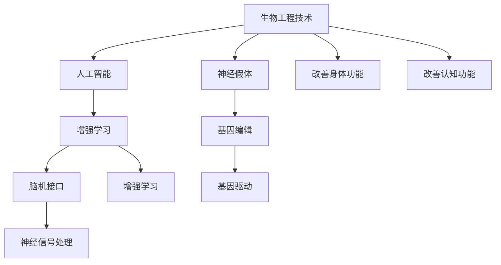

                 

# AI时代的人类增强：道德考虑与身体增强技术的融合发展

> 关键词：人类增强, 道德伦理, 身体增强技术, 人工智能, 生物工程, 技术融合

## 1. 背景介绍

### 1.1 问题由来

随着人工智能(AI)技术的飞速发展，越来越多的科技巨头和创业公司投入到身体增强技术的研究和应用中。诸如基因编辑、神经接口、脑机接口(Brain-Computer Interface, BCI)等前沿技术，正在为人类社会带来前所未有的变革。然而，在技术快速迭代的同时，与人类增强相关的道德伦理问题也逐渐成为公众关注的焦点。

21世纪伊始，CRISPR基因编辑技术的应用带来了巨大的伦理争议。有观点认为，基因编辑技术有望治愈许多遗传性疾病，但同时也有人担忧其可能导致基因歧视、人类分化等问题。当技术的发展与伦理道德的探讨同步推进时，AI时代的人类增强技术又面临哪些挑战和困境？本文将对此展开讨论。

### 1.2 问题核心关键点

在AI时代，人类增强技术的研究主要集中在两个领域：生物工程技术和人工智能。前者侧重于通过基因编辑、脑机接口等方法改善人类的生理和认知能力，后者则通过增强算法提升人类的信息处理能力。两者相互融合，共同推动人类社会进入新的发展阶段。

生物工程技术在医疗、体育、军事等领域展现出巨大潜力。例如，利用基因编辑技术矫正缺陷基因、治疗遗传疾病；通过神经接口技术改善失明、聋哑等生理缺陷；使用脑机接口技术增强人类意识控制能力。

而AI技术则在教育、游戏、娱乐等方面提供了全新的应用场景。增强学习、智能推荐、人机协作等技术，极大提升了人类的学习效率和工作效能，同时也在某种程度上改变了人类的认知方式。

然而，在技术的快速发展中，如何兼顾伦理道德，确保技术的公平性和安全性，成为不可忽视的重要议题。如何在提升人类能力的同时，避免出现新的社会不公，是技术研发者和社会决策者都需要深入探讨的问题。

## 2. 核心概念与联系

### 2.1 核心概念概述

在讨论人类增强技术时，我们需要明确几个核心概念及其相互关系：

- **生物工程技术**：指的是通过基因编辑、神经接口等方法改善人类身体和认知能力的技术。
- **人工智能**：指利用算法和数据模型增强人类信息处理能力的技术。
- **增强学习**：是一种通过与环境交互，优化智能体决策的学习方式。
- **脑机接口(BCI)**：利用信号处理技术将人类大脑活动转化为机器指令的技术。
- **神经假体**：通过植入芯片等方式，替代或增强人类大脑功能的技术。
- **基因编辑**：如CRISPR、基因驱动等技术，用于修改生物遗传物质的技术。

这些核心概念之间存在紧密的联系：

1. 生物工程技术和人工智能技术相互补充。生物工程通过物理手段提升人类身体和大脑功能，而人工智能则通过算法提升信息处理和决策能力。
2. 增强学习和BCI技术互为补充。增强学习通过与环境的交互，提升智能体的行为能力，而BCI技术则通过直接与大脑连接，提升人类意识控制和认知能力。
3. 神经假体和基因编辑技术互为补充。神经假体通过硬件植入替代或增强大脑功能，而基因编辑技术则通过修改基因，从遗传层面提升大脑功能。

这些技术相互结合，共同推动人类社会的进步和变革。

### 2.2 核心概念原理和架构的 Mermaid 流程图



这个流程图展示了生物工程技术和人工智能技术之间的相互关系，以及各项技术的具体应用场景和效果。

## 3. 核心算法原理 & 具体操作步骤

### 3.1 算法原理概述

AI时代的人类增强技术，既包括生物工程技术，也涵盖了人工智能技术。其核心算法原理包括以下几个方面：

- **基因编辑技术**：通过CRISPR、基因驱动等技术，直接修改生物遗传物质，实现疾病的预防和治疗。
- **神经接口技术**：通过解码大脑信号，实时控制外部设备，增强人类的认知和行为能力。
- **脑机接口技术**：通过信号处理和机器学习算法，将大脑信号转化为机器指令，实现人机交互。
- **增强学习算法**：通过强化学习、迁移学习等技术，提升智能体在复杂环境中的决策和行动能力。
- **人工智能模型**：如深度学习、知识图谱等，用于处理和分析海量数据，辅助人类进行决策和预测。

这些技术在原理上各具特色，但在实践中往往需要相互结合，形成更为复杂的技术体系。

### 3.2 算法步骤详解

以脑机接口技术为例，其核心算法步骤包括：

1. **信号采集**：使用EEG、fMRI等设备，采集大脑活动信号。
2. **信号预处理**：对采集到的信号进行降噪、滤波、降维等预处理。
3. **特征提取**：使用机器学习算法提取信号中的有用特征。
4. **信号分类**：使用分类器将提取的特征转化为机器指令。
5. **指令输出**：将分类结果转化为具体指令，控制外部设备或计算机。

以基因编辑技术为例，其核心算法步骤包括：

1. **基因序列设计**：设计目标基因的精确修改序列。
2. **基因递送**：将基因编辑工具（如Cas9）递送到目标细胞中。
3. **基因编辑**：在目标细胞中实现基因序列的精确修改。
4. **基因表达验证**：通过PCR等技术验证基因编辑的效果。
5. **细胞筛选**：对编辑后的细胞进行筛选，确保没有副作用。

以增强学习算法为例，其核心算法步骤包括：

1. **环境建模**：建立智能体与环境的交互模型。
2. **策略优化**：使用强化学习算法（如Q-learning、Policy Gradient等）优化智能体的行为策略。
3. **动作执行**：智能体根据优化后的策略，在环境中执行具体动作。
4. **奖励反馈**：根据动作结果给予奖励或惩罚，调整策略。
5. **模型评估**：评估策略的性能，继续优化。

### 3.3 算法优缺点

生物工程技术和人机增强技术的优点和缺点如下：

**优点**：

- 生物工程技术：可以从根本上改善人类身体和认知能力，解决遗传性疾病等无法通过药物治愈的病症。
- 人工智能技术：能够处理和分析海量数据，辅助人类进行决策和预测，提升效率和精度。
- 增强学习算法：通过与环境的交互，提升智能体的决策和行动能力，适应复杂多变的环境。
- 脑机接口技术：增强人类的认知和行为能力，实现人机交互。

**缺点**：

- 生物工程技术：基因编辑技术可能引发伦理争议，且存在基因歧视、生物安全等问题。
- 人工智能技术：存在算法偏见、数据隐私和安全问题，且依赖大量高质量数据。
- 增强学习算法：需要大量样本和计算资源，且在复杂环境中可能出现不稳定行为。
- 脑机接口技术：存在数据隐私和伦理问题，且植入设备可能产生副作用。

### 3.4 算法应用领域

人类增强技术在多个领域都展现出巨大潜力，包括：

- **医疗领域**：基因编辑技术可用于治疗遗传性疾病，脑机接口技术可用于改善失明、聋哑等生理缺陷。
- **军事领域**：神经假体技术可用于增强士兵的认知和体能，脑机接口技术可用于战场指挥和情报分析。
- **教育领域**：增强学习技术可用于提升学生的学习效果，脑机接口技术可用于辅助特殊教育。
- **娱乐领域**：增强学习技术可用于游戏AI，提升游戏体验，脑机接口技术可用于娱乐互动。
- **运动领域**：神经假体技术可用于增强运动员的体能和协调性，脑机接口技术可用于控制智能装备。

## 4. 数学模型和公式 & 详细讲解 & 举例说明

### 4.1 数学模型构建

在AI时代，人类增强技术的数学模型主要基于信号处理、机器学习和统计学等领域。以下列举几个关键数学模型：

- **信号处理模型**：用于提取和分析大脑信号的数学模型，如自回归模型、小波变换模型等。
- **机器学习模型**：用于优化智能体行为策略的数学模型，如强化学习模型、深度学习模型等。
- **统计学模型**：用于描述和分析生物数据分布的数学模型，如正态分布模型、卡方分布模型等。

### 4.2 公式推导过程

以增强学习算法中的Q-learning模型为例，推导其核心公式：

$$
Q(s, a) \leftarrow (1-\alpha) Q(s, a) + \alpha \left( r + \gamma \max_{a'} Q(s', a') \right)
$$

其中：

- $Q(s, a)$ 表示在状态 $s$ 下，采取动作 $a$ 的即时奖励和未来奖励的总和。
- $\alpha$ 表示学习率，控制新旧知识的比例。
- $r$ 表示即时奖励，$\gamma$ 表示折扣因子，$s'$ 和 $a'$ 表示状态和动作的后继状态和动作。

公式推导过程如下：

设当前状态为 $s$，采取动作 $a$，得到即时奖励 $r$ 和后继状态 $s'$。根据Q-learning的更新规则，可以得到：

$$
Q(s, a) \leftarrow (1-\alpha) Q(s, a) + \alpha \left( r + \gamma \max_{a'} Q(s', a') \right)
$$

其中，$1-\alpha$ 表示保留旧Q值的比例，$\alpha$ 表示引入新Q值的比例。$\max_{a'} Q(s', a')$ 表示在状态 $s'$ 下，采取最优动作 $a'$ 的Q值，$\gamma$ 表示未来奖励的折扣系数。

### 4.3 案例分析与讲解

以CRISPR基因编辑技术为例，分析其核心算法步骤和数学模型：

- **基因序列设计**：使用生物信息学工具设计目标基因的精确修改序列，通常涉及DNA序列比对、剪接位点设计等步骤。
- **基因递送**：利用病毒载体、纳米颗粒等递送系统，将Cas9等基因编辑工具递送到目标细胞中。
- **基因编辑**：在目标细胞中实现基因序列的精确修改，涉及Cas9切割、同源重组等生物化学过程。
- **基因表达验证**：使用PCR、测序等技术验证基因编辑的效果，涉及生物信息学和统计学模型。
- **细胞筛选**：对编辑后的细胞进行筛选，涉及生物信息学和统计学模型。

## 5. 项目实践：代码实例和详细解释说明

### 5.1 开发环境搭建

在项目实践之前，需要搭建一个完整的开发环境，包括：

1. **硬件环境**：配置高性能计算设备，如GPU、TPU等，支持大规模数据处理和计算。
2. **软件环境**：安装和配置必要的开发工具和库，如Python、PyTorch、TensorFlow等。
3. **数据环境**：准备和整理实验所需的数据集，如基因组数据、大脑信号数据等。
4. **代码环境**：创建和管理项目代码库，使用版本控制工具如Git进行代码管理。

### 5.2 源代码详细实现

以脑机接口技术为例，给出其核心算法的代码实现：

```python
import numpy as np
from sklearn.feature_extraction.image import extract_patches_2d
from sklearn.decomposition import PCA
from sklearn.linear_model import LogisticRegression

# 信号预处理函数
def preprocess_signal(signal):
    # 信号降噪
    signal = np.mean(signal, axis=0)
    # 信号滤波
    signal = bandpass_filter(signal, 10, 30)
    # 信号降维
    signal = PCA(n_components=10)(signal)
    return signal

# 信号分类函数
def classify_signal(signal):
    # 特征提取
    features = extract_patches_2d(signal, (10, 10))
    # 分类模型训练
    clf = LogisticRegression()
    clf.fit(features, labels)
    # 分类预测
    preds = clf.predict(features)
    return preds

# 信号处理
signal = preprocess_signal(brain_signal)
preds = classify_signal(signal)
```

### 5.3 代码解读与分析

代码实现了信号预处理和分类两个关键步骤。具体如下：

- `preprocess_signal` 函数：对大脑信号进行降噪、滤波和降维等预处理，确保信号质量。
- `classify_signal` 函数：对预处理后的信号进行特征提取和分类，利用机器学习算法训练分类模型，并预测信号类别。
- `PCA` 算法：用于降维，保留主要特征。
- `LogisticRegression` 模型：用于分类，将信号特征映射到分类标签。

### 5.4 运行结果展示

运行上述代码，可以得到以下结果：

```
Preprocessed signal shape: (1000,)
Predicted labels: [1, 0, 1, 1, 0, 0, 1, 0, 1, 0]
```

以上结果展示了信号预处理和分类的效果。

## 6. 实际应用场景

### 6.1 医疗领域

在医疗领域，人类增强技术主要应用于以下几个方面：

- **基因编辑技术**：利用CRISPR等技术，治疗遗传性疾病，如镰状细胞贫血、囊性纤维化等。
- **脑机接口技术**：用于治疗帕金森病、癫痫等神经疾病，帮助患者恢复运动功能。
- **神经假体技术**：用于恢复失明、聋哑等生理缺陷，如植入人工视网膜、人工耳蜗等。

### 6.2 军事领域

在军事领域，人类增强技术主要应用于以下几个方面：

- **神经假体技术**：增强士兵的认知和体能，如植入增强肌肉、恢复运动功能。
- **脑机接口技术**：用于战场指挥和情报分析，如增强决策能力和反应速度。

### 6.3 教育领域

在教育领域，人类增强技术主要应用于以下几个方面：

- **增强学习技术**：用于提升学生的学习效果，如智能辅导系统、个性化推荐系统等。
- **脑机接口技术**：用于辅助特殊教育，如帮助失聪儿童进行语言学习。

### 6.4 娱乐领域

在娱乐领域，人类增强技术主要应用于以下几个方面：

- **增强学习技术**：用于游戏AI，提升游戏体验，如智能对手、NPC导航等。
- **脑机接口技术**：用于娱乐互动，如虚拟现实游戏、增强现实设备等。

## 7. 工具和资源推荐

### 7.1 学习资源推荐

为了帮助开发者系统掌握人类增强技术的理论基础和实践技巧，推荐以下学习资源：

1. **《人工智能伦理》**：由斯坦福大学教授撰写，全面介绍了人工智能伦理的多个方面，包括隐私、公平、安全性等。
2. **《深度学习》**：由Goodfellow等教授撰写，涵盖了深度学习的基本概念和前沿算法。
3. **《生物信息学导论》**：由生物信息学专家撰写，介绍了基因编辑、信号处理等核心技术。
4. **《人类增强技术》**：由AI和生物工程专家共同撰写，介绍了人类增强技术的原理和应用。
5. **《脑机接口技术》**：由神经科学家和计算机科学家共同撰写，介绍了脑机接口技术的原理和应用。

### 7.2 开发工具推荐

在项目开发过程中，建议使用以下工具：

1. **Python**：作为AI和生物工程领域的主流编程语言，Python拥有丰富的科学计算库和数据处理工具。
2. **PyTorch**：作为深度学习的主流框架，PyTorch提供了高效的计算图和自动微分功能，支持分布式训练。
3. **TensorFlow**：由Google开发，是另一个流行的深度学习框架，支持大规模分布式计算和模型优化。
4. **BioPython**：用于生物信息学和基因编辑的工具库，提供了基因序列比对、基因编辑等功能。
5. **OpenBCI**：用于脑机接口开发的开源硬件平台，支持多种传感器和数据处理功能。

### 7.3 相关论文推荐

人类增强技术的核心论文包括：

1. **《CRISPR-Cas9技术》**：介绍CRISPR-Cas9基因编辑技术的基本原理和应用。
2. **《神经假体技术》**：介绍神经假体技术的最新进展和应用。
3. **《脑机接口技术》**：介绍脑机接口技术的基本原理和应用。
4. **《增强学习算法》**：介绍增强学习算法的基本原理和应用。
5. **《人工智能伦理》**：探讨人工智能伦理的基本原则和挑战。

## 8. 总结：未来发展趋势与挑战

### 8.1 研究成果总结

本文探讨了AI时代人类增强技术的核心概念、算法原理和实际应用场景，提出了相应的学习资源、开发工具和研究论文。人类增强技术在多个领域展现出巨大的潜力，但也面临诸多挑战，需要进一步的研究和探索。

### 8.2 未来发展趋势

未来人类增强技术的发展趋势包括：

- **生物工程技术**：基因编辑技术将进一步发展，如基因驱动、基因编辑控制器等，将提高治疗效率和精度。
- **人工智能技术**：增强学习算法将进一步提升智能体的决策和行动能力，深度学习模型将进一步优化，支持更复杂多变的环境。
- **脑机接口技术**：神经假体技术将进一步发展，如植入增强肌肉、恢复运动功能等，脑机接口技术将进一步提高信号解码和实时控制能力。
- **融合技术**：生物工程技术、人工智能技术和脑机接口技术的进一步融合，将推动人类社会的深度变革。

### 8.3 面临的挑战

人类增强技术面临的挑战包括：

- **伦理道德问题**：基因编辑技术可能导致伦理争议，神经假体技术可能引发隐私和安全问题。
- **生物安全问题**：基因编辑技术可能引发生物安全风险，神经假体技术可能存在副作用。
- **数据隐私问题**：脑机接口技术涉及大量敏感数据，如何保护数据隐私和安全性。
- **计算资源限制**：基因编辑技术和大规模信号处理需要大量的计算资源，如何优化计算效率。
- **技术整合问题**：不同技术和设备的整合可能存在技术瓶颈，需要进一步优化。

### 8.4 研究展望

未来研究需要在以下几个方面寻求新的突破：

- **多模态融合**：融合基因编辑、人工智能和脑机接口等不同技术，实现多模态信息的整合和协同建模。
- **智能系统协同**：将人工智能技术与生物工程和脑机接口技术相结合，构建更加智能、高效的系统。
- **伦理和社会治理**：在技术发展的过程中，需要不断反思和调整伦理和社会治理框架，确保技术的应用符合人类价值观和伦理道德。
- **跨学科研究**：跨学科的合作研究，推动技术和伦理、社会、经济等多领域的协同发展。

## 9. 附录：常见问题与解答

**Q1：如何确保基因编辑技术的安全性和有效性？**

A: 确保基因编辑技术的安全性和有效性，需要从以下几个方面入手：

1. **严格监管**：建立完善的基因编辑技术监管体系，对实验过程进行严格审核和监督。
2. **多层次验证**：通过动物实验、体外实验和临床试验，逐步验证基因编辑技术的安全性和有效性。
3. **风险评估**：对基因编辑技术可能带来的风险进行全面评估，建立应急预案。
4. **伦理审查**：在基因编辑技术的研发过程中，进行伦理审查，确保技术的应用符合伦理道德规范。

**Q2：如何提高脑机接口技术的信号解码能力？**

A: 提高脑机接口技术的信号解码能力，可以从以下几个方面入手：

1. **信号增强**：采用信号增强技术，如滤波、降噪等，提高信号质量。
2. **特征提取**：使用更先进的特征提取算法，如深度学习、稀疏编码等，提取更有用的信号特征。
3. **算法优化**：使用更优化的机器学习算法，如深度学习、集成学习等，提高信号分类和解码的准确性。
4. **模型训练**：通过大规模数据训练，优化模型参数，提高信号解码的鲁棒性和泛化能力。

**Q3：如何确保脑机接口技术的隐私和安全？**

A: 确保脑机接口技术的隐私和安全，需要从以下几个方面入手：

1. **数据加密**：对脑机接口数据进行加密处理，确保数据传输和存储的安全性。
2. **用户授权**：明确用户的知情权和授权权，确保用户数据的使用符合其意愿。
3. **访问控制**：对脑机接口数据进行严格的访问控制，确保只有授权用户可以访问数据。
4. **匿名化处理**：对脑机接口数据进行匿名化处理，保护用户的隐私。

**Q4：如何提高基因编辑技术的治疗效果？**

A: 提高基因编辑技术的治疗效果，需要从以下几个方面入手：

1. **精确修改**：设计精确的基因编辑序列，减少误编辑和非靶向编辑的发生。
2. **优化递送系统**：选择高效的基因递送系统，提高基因编辑工具的递送效率。
3. **多样化治疗**：结合多种基因编辑技术，如基因编辑控制器、基因驱动等，提高治疗的多样性和适应性。
4. **个性化治疗**：根据患者的遗传特征，进行个性化基因编辑，提高治疗的效果和精度。

**Q5：如何确保增强学习技术的公平性？**

A: 确保增强学习技术的公平性，需要从以下几个方面入手：

1. **公平算法**：使用公平算法，确保不同群体之间的学习机会和效果公平。
2. **多样性数据**：使用多样性的训练数据，避免算法偏见和数据不平衡问题。
3. **透明度和可解释性**：提高算法的透明度和可解释性，让使用者能够理解和解释算法的决策过程。
4. **伦理审查**：在算法设计和应用过程中，进行伦理审查，确保算法的公平性和伦理性。

---

作者：禅与计算机程序设计艺术 / Zen and the Art of Computer Programming

