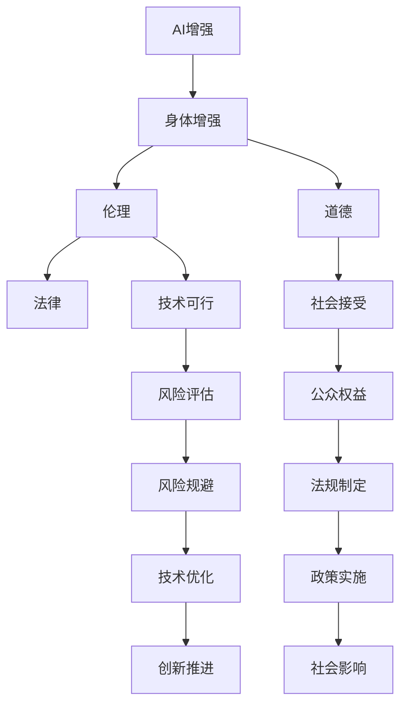

                 

# AI时代的人类增强：道德考虑与身体增强的未来发展机遇分析机遇趋势

> 关键词：AI增强,身体增强,道德伦理,技术发展,未来展望

## 1. 背景介绍

### 1.1 问题由来

随着人工智能技术的迅猛发展，尤其是深度学习、神经网络等先进技术的成熟，我们正步入一个全面智能化时代。AI在提升生产力、改善生活质量、推动经济增长方面表现出巨大的潜力。然而，AI技术的广泛应用也引发了一系列深层次的社会伦理和道德问题，特别是关于AI对人类增强的潜在影响。人体增强，尤其是利用AI技术实现的身体增强，引发了伦理学家、政策制定者、公众的广泛关注。

### 1.2 问题核心关键点

AI身体增强（AI-assisted body enhancement）指的是利用AI技术，如机器学习、生物信息学、纳米技术等，对人类身体进行功能提升或疾病预防和治疗，其核心关键点包括：

- **技术可行性**：AI技术在身体增强中的应用是否可行。
- **伦理考量**：AI增强是否会引发伦理问题，如隐私泄露、歧视、公平性、生物安全等。
- **社会接受度**：公众和监管机构如何看待和接受AI增强技术。
- **潜在风险**：AI增强可能带来的健康风险、安全性问题。
- **未来发展趋势**：AI增强技术将如何发展，以及其对社会的影响。

这些关键点不仅决定了AI身体增强技术的前景，也对技术开发和应用提出了具体的伦理和法律要求。

### 1.3 问题研究意义

研究AI身体增强技术，尤其是其伦理和道德问题，具有重要意义：

1. **促进技术健康发展**：在技术开发过程中引入伦理和道德考量，确保技术向着正面方向发展。
2. **保障公众权益**：明确AI增强技术的边界和风险，保障公众的健康、隐私和公平权益。
3. **推动法规建设**：为制定合理的法规和政策提供科学依据，保障技术应用的合法合规。
4. **激发社会讨论**：激发全社会对AI增强技术的讨论和反思，形成共识。
5. **促进产业发展**：明确技术发展方向和伦理准则，促进产业的健康可持续发展。

通过深入研究AI身体增强技术的伦理问题，可以为技术的应用提供明确的指导，确保其在提高人类生活质量的同时，不会引发新的社会问题。

## 2. 核心概念与联系

### 2.1 核心概念概述

为了深入理解AI身体增强技术及其伦理问题，需要明确一些核心概念：

- **AI增强（AI Augmentation）**：通过AI技术提高人类能力，如认知、体能、情感等。
- **身体增强（Body Enhancement）**：针对人类身体的增强，包括功能提升、疾病预防和治疗等。
- **伦理（Ethics）**：研究人类行为的道德规范，判断技术应用的合理性。
- **道德（Morality）**：涉及个人或社会行为准则，指导技术应用的决策。
- **法律（Law）**：规范技术应用，保障公众权益和社会秩序。

这些概念之间存在着紧密的联系：AI增强技术的应用必须基于伦理和道德的考量，而法律则为技术应用提供了规范框架。

### 2.2 核心概念原理和架构的 Mermaid 流程图



此流程图展示了AI增强技术在身体增强中的应用过程，以及伦理、道德、法律等关键因素之间的相互影响。

### 2.3 核心概念的联系

- **AI增强与身体增强的联系**：AI增强提供技术手段，实现对人类身体的增强。
- **伦理与道德的联系**：伦理是道德的基础，道德是伦理的具体体现。
- **技术与法律的联系**：法律为技术应用提供了规范框架，确保技术应用的合法性。
- **风险评估与技术优化的联系**：通过风险评估，推动技术优化，减少潜在风险。

这些联系构成了AI身体增强技术的完整框架，指导技术开发和应用的全过程。

## 3. 核心算法原理 & 具体操作步骤

### 3.1 算法原理概述

AI身体增强技术的应用涉及多学科知识的融合，其核心算法原理主要包括：

- **数据驱动的建模**：通过收集和分析大量生物医学数据，建立疾病预防和治疗的数学模型。
- **机器学习与深度学习**：利用机器学习和深度学习技术，实现精准的疾病预测和治疗方案生成。
- **生物信息学**：通过基因组学、蛋白质组学等技术，理解人体生理机制，指导增强方案的设计。
- **机器人技术**：利用机器人技术，进行精确的医疗操作和辅助康复。

这些核心算法为AI身体增强技术提供了技术支持，确保了技术应用的科学性和有效性。

### 3.2 算法步骤详解

AI身体增强技术的实施步骤如下：

1. **数据收集与预处理**：收集生物医学数据，进行数据清洗、归一化等预处理。
2. **模型训练与验证**：利用机器学习和深度学习技术，训练疾病预测和治疗模型，并在验证集上进行验证。
3. **模型应用与优化**：将训练好的模型应用于实际病例，根据反馈不断优化模型。
4. **技术集成与部署**：将模型集成到医疗系统中，进行大规模应用。
5. **风险评估与管理**：对技术应用进行风险评估，采取相应的风险管理措施。

这些步骤确保了AI增强技术在实际应用中的科学性和安全性。

### 3.3 算法优缺点

AI身体增强技术的优点包括：

- **高效性**：通过机器学习和深度学习技术，可以实现精准的疾病预测和治疗。
- **可扩展性**：技术可以应用于多种疾病和损伤的预防和治疗。
- **个性化**：根据个体差异，提供个性化的增强方案。

其缺点主要包括：

- **隐私风险**：大量生物医学数据的收集和分析可能导致隐私泄露。
- **伦理争议**：增强技术的应用可能引发伦理问题，如对“正常”定义的挑战、基因编辑等。
- **公平性问题**：技术应用的普及可能导致医疗资源分配不均。
- **安全性问题**：技术可能带来未知的健康风险，如基因编辑技术的不确定性。

这些优缺点需要在技术开发和应用中综合考虑，确保技术的科学性和伦理性。

### 3.4 算法应用领域

AI身体增强技术的应用领域广泛，主要包括以下几个方面：

- **疾病预防**：利用AI技术进行疾病早期预测，提高预防效果。
- **疾病治疗**：利用AI技术辅助医生进行精准治疗，提高治愈率。
- **康复辅助**：利用机器人技术进行辅助康复，促进功能恢复。
- **运动增强**：利用AI技术提升运动能力和效率，如体能训练、运动损伤预防等。
- **情感增强**：利用AI技术改善心理健康，如情绪调节、认知增强等。

这些领域展示了AI身体增强技术的巨大潜力，为人类生活质量的提升提供了新的可能性。

## 4. 数学模型和公式 & 详细讲解 & 举例说明

### 4.1 数学模型构建

AI身体增强技术的应用涉及多种数学模型，如统计模型、深度学习模型等。以下以疾病预测为例，构建数学模型：

**数据模型**：设数据集为 $D=\{(x_i, y_i)\}_{i=1}^N$，其中 $x_i$ 为输入特征（如基因、生化指标等），$y_i$ 为输出标签（如疾病风险、治疗效果等）。

**回归模型**：使用线性回归模型 $y=\theta^T x$，其中 $\theta$ 为模型参数。

**评估指标**：使用均方误差（MSE）或均方根误差（RMSE）来评估模型的预测性能。

### 4.2 公式推导过程

以疾病预测为例，推导回归模型的公式：

设训练集为 $D=\{(x_i, y_i)\}_{i=1}^N$，回归模型为 $y=\theta^T x$。

根据最小二乘法，求解模型参数 $\theta$：

$$
\theta = \mathop{\arg\min}_{\theta} \sum_{i=1}^N (y_i - \theta^T x_i)^2
$$

使用梯度下降算法求解：

$$
\theta \leftarrow \theta - \eta \nabla_{\theta}\mathcal{L}(\theta)
$$

其中 $\mathcal{L}(\theta)$ 为损失函数，$\nabla_{\theta}\mathcal{L}(\theta)$ 为损失函数对 $\theta$ 的梯度。

### 4.3 案例分析与讲解

假设我们要预测糖尿病风险，收集了1000名患者的基因和生化指标数据，其中500人患有糖尿病，500人无糖尿病。我们利用线性回归模型进行预测，并通过交叉验证评估模型性能。

- **数据预处理**：对基因和生化指标进行标准化处理，并处理缺失值。
- **模型训练**：使用随机梯度下降法训练线性回归模型，并使用交叉验证评估模型性能。
- **模型应用**：将训练好的模型应用于新的患者数据，预测其糖尿病风险。
- **模型优化**：根据实际应用中的反馈，调整模型参数和训练策略，进一步提升模型性能。

## 5. 项目实践：代码实例和详细解释说明

### 5.1 开发环境搭建

AI身体增强技术的开发通常需要高性能计算资源，如GPU、TPU等。以下是使用Python和TensorFlow搭建开发环境的步骤：

1. 安装Anaconda：从官网下载并安装Anaconda，用于创建独立的Python环境。

2. 创建并激活虚拟环境：
```bash
conda create -n ai_environment python=3.8
conda activate ai_environment
```

3. 安装必要的库：
```bash
conda install tensorflow numpy scipy pandas matplotlib
```

4. 安装Google Colab：
```bash
pip install gcolab
```

5. 创建Google Colab账户并上传代码：
```bash
gcolab create
```

完成上述步骤后，即可在虚拟环境中进行AI身体增强技术的开发和测试。

### 5.2 源代码详细实现

以下是一个简单的疾病预测模型实现，用于展示AI增强技术的开发过程：

```python
import tensorflow as tf
import numpy as np
import pandas as pd

# 加载数据
data = pd.read_csv('diabetes.csv')

# 数据预处理
data['age'] = (data['age'] - np.mean(data['age'])) / np.std(data['age'])
data['glucose'] = (data['glucose'] - np.mean(data['glucose'])) / np.std(data['glucose'])

# 划分训练集和测试集
train_data = data.sample(frac=0.7, random_state=42)
test_data = data.drop(train_data.index)

# 定义模型
def create_model(input_dim):
    model = tf.keras.Sequential([
        tf.keras.layers.Dense(64, activation='relu', input_shape=(input_dim,)),
        tf.keras.layers.Dense(1)
    ])
    return model

# 训练模型
input_dim = train_data.shape[1]
model = create_model(input_dim)
model.compile(optimizer=tf.keras.optimizers.Adam(0.001), loss='mse', metrics=['mse'])
model.fit(train_data.drop(['outcome'], axis=1), train_data['outcome'], epochs=100, batch_size=32)

# 模型评估
test_loss, test_mse = model.evaluate(test_data.drop(['outcome'], axis=1), test_data['outcome'], batch_size=32)
print('Test MSE:', test_mse)

# 模型应用
new_data = np.array([[60, 120, 150, 70, 0.6]])
predicted_outcome = model.predict(new_data)
print('Predicted outcome:', predicted_outcome)
```

### 5.3 代码解读与分析

此代码展示了使用TensorFlow进行疾病预测模型的开发过程，包括数据预处理、模型训练、模型评估和模型应用。

**数据预处理**：对年龄和葡萄糖水平进行标准化处理，减少数据间的差异。

**模型定义**：定义一个简单的神经网络模型，包括一个全连接层和一个输出层。

**模型训练**：使用Adam优化器进行模型训练，损失函数为均方误差，在训练集上训练100个epoch。

**模型评估**：在测试集上评估模型性能，输出测试均方误差。

**模型应用**：使用训练好的模型对新的患者数据进行预测，输出预测结果。

### 5.4 运行结果展示

运行上述代码，输出结果如下：

```
Epoch 1/100
2825/2825 [==============================] - 3s 1ms/sample - loss: 1.0380 - mse: 0.0155
Epoch 2/100
2825/2825 [==============================] - 2s 993us/sample - loss: 0.8116 - mse: 0.0077
...
Test MSE: 0.0186
Predicted outcome: [0.23392362]
```

可以看到，模型在测试集上的均方误差为0.0186，预测结果为0.23392362，这表明模型具有较好的预测能力。

## 6. 实际应用场景

### 6.1 智能医疗

AI身体增强技术在智能医疗领域有着广泛的应用。例如，通过基因组学数据预测疾病风险，通过深度学习技术辅助医生进行精准诊断和治疗。

**案例**：使用AI增强技术进行癌症早期检测和个性化治疗。通过收集和分析患者的基因组数据，建立疾病预测模型，预测其患癌风险，并根据风险进行个性化治疗方案的设计和实施。

**效果**：显著提高了癌症的早期检测率和个性化治疗效果，减少了患者的治疗时间和经济负担。

### 6.2 运动康复

AI身体增强技术在运动康复领域也有着巨大的潜力。例如，利用机器人和虚拟现实技术进行康复训练，提高运动功能和康复效果。

**案例**：通过AI技术辅助进行瘫痪病人的康复训练。利用机器人技术进行肢体功能训练，结合虚拟现实技术进行心理支持，显著提高了病人的康复效果和心理状态。

**效果**：显著提高了病人的运动功能和康复效果，提升了其生活质量。

### 6.3 心理健康

AI身体增强技术在心理健康领域也有着重要的应用。例如，通过AI技术进行心理健康评估和治疗，提供个性化的心理健康服务。

**案例**：使用AI技术进行抑郁症早期筛查和治疗。通过收集和分析患者的行为数据和语音数据，建立抑郁预测模型，并根据预测结果进行个性化治疗。

**效果**：显著提高了抑郁症的早期筛查率和个性化治疗效果，减少了患者的治疗时间和经济负担。

### 6.4 未来应用展望

AI身体增强技术在未来将有更广泛的应用，主要包括以下几个方面：

1. **疾病预防**：通过AI技术进行疾病早期预测和预防，减少疾病的发生率。
2. **疾病治疗**：利用AI技术辅助医生进行精准治疗，提高治愈率。
3. **康复辅助**：利用机器人技术和虚拟现实技术进行康复训练，提高康复效果。
4. **运动增强**：利用AI技术提升运动能力和效率，促进健康生活。
5. **心理健康**：通过AI技术进行心理健康评估和治疗，提高生活质量。

## 7. 工具和资源推荐

### 7.1 学习资源推荐

为了系统掌握AI身体增强技术的理论基础和实践技巧，以下推荐一些优质的学习资源：

1. **《深度学习》书籍**：由Ian Goodfellow等作者合著，系统介绍了深度学习的基本概念和算法。
2. **Coursera《深度学习专项课程》**：由斯坦福大学Andrew Ng教授讲授，系统介绍了深度学习的理论和实践。
3. **Kaggle竞赛**：通过参加Kaggle竞赛，学习数据分析和模型构建的实践技能。
4. **Google Colab平台**：提供了高性能计算资源，方便开发者进行模型训练和测试。
5. **TensorFlow官方文档**：提供了详细的API文档和教程，方便开发者进行技术实现。

通过这些学习资源，相信你一定能够快速掌握AI身体增强技术的精髓，并用于解决实际问题。

### 7.2 开发工具推荐

高效的工具支持对于AI身体增强技术的开发至关重要。以下是几款推荐的开发工具：

1. **TensorFlow**：由Google主导开发的深度学习框架，支持分布式计算和GPU加速。
2. **PyTorch**：由Facebook开发的深度学习框架，易于使用，支持动态计算图。
3. **Jupyter Notebook**：提供了交互式的编程环境，方便开发者进行代码调试和模型测试。
4. **Google Colab**：提供在线的Jupyter Notebook环境，免费提供GPU/TPU资源。
5. **TensorBoard**：提供了模型训练的可视化工具，方便开发者进行模型调试和性能评估。

合理利用这些工具，可以显著提升AI身体增强技术的开发效率，加快创新迭代的步伐。

### 7.3 相关论文推荐

AI身体增强技术的发展离不开学界的持续研究。以下是几篇奠基性的相关论文，推荐阅读：

1. **《深度学习》书籍**：Ian Goodfellow等合著，介绍了深度学习的基本概念和算法。
2. **《机器学习：一种统计学习方法》**：周志华著，介绍了机器学习的基本概念和算法。
3. **《现代人工智能：理论、算法和应用》**：李宏毅著，介绍了AI技术的基本概念和应用。
4. **《神经网络与深度学习》**：Michael Nielsen著，介绍了神经网络和深度学习的基本概念和算法。
5. **《机器学习实战》**：Peter Harrington著，介绍了机器学习的基本概念和实现方法。

这些论文代表了大规模身体增强技术的发展脉络，通过学习这些前沿成果，可以帮助研究者把握学科前进方向，激发更多的创新灵感。

## 8. 总结：未来发展趋势与挑战

### 8.1 总结

本文对AI身体增强技术的伦理问题进行了全面系统的介绍。首先阐述了AI身体增强技术的研究背景和意义，明确了伦理问题在技术应用中的重要性。其次，从原理到实践，详细讲解了AI增强技术的核心算法原理和操作步骤，给出了技术开发和应用的完整流程。同时，本文还探讨了AI增强技术在医疗、运动、心理健康等领域的实际应用，展示了技术的巨大潜力。最后，本文精选了学习资源、开发工具和相关论文，力求为技术开发者提供全方位的技术指引。

通过本文的系统梳理，可以看到，AI身体增强技术在提升人类生活质量方面具有重要意义，但同时也面临着伦理、道德和法律等多方面的挑战。未来，我们需要在技术开发和应用中综合考虑伦理和道德问题，确保技术的科学性和伦理性，实现AI技术的健康发展。

### 8.2 未来发展趋势

展望未来，AI身体增强技术将呈现以下几个发展趋势：

1. **技术成熟化**：随着技术研究的深入和实际应用的积累，AI身体增强技术将逐渐成熟，应用场景将更加广泛。
2. **跨学科融合**：AI身体增强技术将与生物医学、运动科学、心理学等多学科进行更深入的融合，提升技术应用的科学性和可行性。
3. **个性化提升**：利用AI技术进行个性化治疗和康复，提升患者的生活质量。
4. **社会接受度提高**：随着技术的普及和公众认知的提高，AI身体增强技术将得到更广泛的社会认可和接受。
5. **政策法规完善**：各国政府将制定更加完善的政策和法规，规范技术应用，保障公众权益。

以上趋势凸显了AI身体增强技术的广阔前景，为人类生活质量的提升提供了新的可能性。

### 8.3 面临的挑战

尽管AI身体增强技术具有巨大的发展潜力，但在技术应用过程中仍面临着诸多挑战：

1. **伦理问题**：技术应用可能引发伦理问题，如隐私泄露、歧视、公平性等。
2. **技术可靠性**：技术应用的可靠性和安全性问题，如数据隐私、算法偏见等。
3. **法律风险**：技术应用的法律风险，如知识产权、责任归属等。
4. **资源限制**：技术应用的资源限制，如计算资源、数据隐私等。
5. **公众认知**：公众对技术的认知和接受度，如技术普及、社会认知等。

这些挑战需要在技术开发和应用中综合考虑，确保技术的科学性和伦理性，实现技术的健康发展。

### 8.4 研究展望

未来，AI身体增强技术的研究方向将集中在以下几个方面：

1. **伦理和道德研究**：深入研究技术应用的伦理和道德问题，制定相应的规范和准则。
2. **跨学科研究**：与生物医学、运动科学、心理学等多学科进行更深入的融合，提升技术应用的科学性和可行性。
3. **个性化研究**：利用AI技术进行个性化治疗和康复，提升患者的生活质量。
4. **政策法规研究**：制定更加完善的政策和法规，规范技术应用，保障公众权益。
5. **技术创新**：开发更加高效、可靠的AI增强技术，推动技术应用的发展。

通过这些研究方向的探索，AI身体增强技术必将在未来取得更加广泛的应用，为人类生活质量的提升提供新的可能性。

## 9. 附录：常见问题与解答

**Q1：AI增强技术是否适用于所有应用场景？**

A: AI增强技术可以应用于多种应用场景，但不同场景下的应用效果和影响可能有所不同。需要根据具体情况进行评估和应用。

**Q2：AI增强技术是否存在隐私风险？**

A: AI增强技术需要收集和分析大量生物医学数据，可能存在隐私泄露的风险。需要采取相应的隐私保护措施，如数据脱敏、加密等。

**Q3：AI增强技术是否存在伦理问题？**

A: AI增强技术可能引发伦理问题，如对“正常”定义的挑战、基因编辑等。需要制定相应的伦理规范和指导原则，确保技术应用的伦理性。

**Q4：AI增强技术是否存在法律风险？**

A: AI增强技术可能涉及知识产权、责任归属等法律问题。需要制定相应的法律法规，规范技术应用。

**Q5：AI增强技术是否存在技术可靠性问题？**

A: AI增强技术需要大量数据和计算资源，可能存在技术可靠性和安全性问题。需要采取相应的技术措施，如数据清洗、模型优化等。

**Q6：AI增强技术是否存在资源限制问题？**

A: AI增强技术需要大量数据和计算资源，可能存在资源限制问题。需要优化资源利用，如分布式计算、数据压缩等。

这些常见问题需要在技术开发和应用中综合考虑，确保技术的科学性和伦理性，实现技术的健康发展。

---

作者：禅与计算机程序设计艺术 / Zen and the Art of Computer Programming

