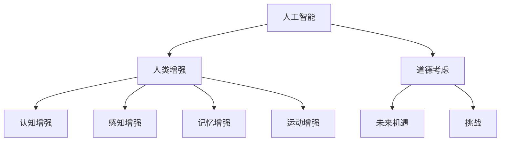

                 

# AI时代的人类增强：道德考虑与身体增强的未来发展机遇挑战

## 1. 背景介绍

在人工智能快速发展的今天，人工智能技术已经渗透到生活的方方面面，从语音助手、图像识别，到自动驾驶、智能制造，AI正在以前所未有的速度改变我们的生活方式。随着技术的不断突破，人类增强（Human Augmentation）的概念正在逐步从科幻走向现实，利用AI技术提升人类的感知、记忆、认知等能力，成为新一代科技浪潮的重要方向。

### 1.1 人类增强的定义与现状

人类增强通常指的是利用技术手段提升人类自身能力的实践，包括但不限于认知增强、感知增强、记忆增强、运动增强等方面。常见的增强方式包括：

- **认知增强**：利用AI提高人类学习效率，如智能笔记、知识图谱、个性化推荐系统等。
- **感知增强**：增强人类视觉、听觉、触觉等感官能力，如增强现实（AR）、虚拟现实（VR）、脑机接口（BCI）等。
- **记忆增强**：帮助人类记录和回忆信息，如智能笔记、电子便签、智能助手等。
- **运动增强**：改善人类的运动能力和身体素质，如运动分析与指导、远程协作机器人、仿生肢等。

目前，认知增强和记忆增强技术已经相对成熟，广泛应用于教育、办公等领域。感知增强和运动增强技术还在探索与实验阶段，但随着AI技术的不断进步，这些领域的发展前景广阔。

### 1.2 人工智能与人类增强的关系

人工智能与人类增强技术密切相关，AI技术提供了实现人类增强的底层工具和算法。例如，机器学习和大数据分析技术可以帮助识别并分析大量的人类行为和生理数据，从而提供个性化的增强建议。自然语言处理技术使得人机交互更加自然，增强了认知和记忆的便捷性。计算机视觉技术为增强现实和虚拟现实提供了实现基础，脑机接口技术则为运动增强提供了可能。

## 2. 核心概念与联系

### 2.1 核心概念概述

在探讨AI时代的人类增强时，需要明确几个关键概念：

- **人工智能**：通过算法和计算能力，使计算机系统能够模拟人类的智能行为，包括学习、推理、感知、决策等。
- **人类增强**：利用AI技术提升人类的感知、记忆、认知等能力，使其超越自然状态。
- **道德考虑**：在技术应用过程中，考虑人类的伦理、法律和社会价值，确保技术的安全和公正。
- **未来机遇**：基于当前的技术和市场需求，探索AI技术在人类增强领域的新应用方向。
- **挑战**：面对技术进步和道德伦理的多重考验，探索解决路径。

这些概念之间的逻辑关系可以通过以下Mermaid流程图来展示：



这个流程图展示了人工智能和人类增强之间的基本关系，以及道德、机遇和挑战如何影响这些技术的发展。

## 3. 核心算法原理 & 具体操作步骤

### 3.1 算法原理概述

人工智能在人类增强中的应用主要涉及以下几个关键算法：

- **机器学习**：利用历史数据训练模型，预测和优化人类行为，如智能笔记、推荐系统等。
- **自然语言处理（NLP）**：使机器能够理解并生成自然语言，如聊天机器人、智能助手等。
- **计算机视觉**：使机器能够理解和生成视觉信息，如图像识别、增强现实等。
- **脑机接口（BCI）**：通过大脑信号与计算机交互，实现脑控接口，如运动增强、虚拟现实等。

### 3.2 算法步骤详解

以下是基于人工智能技术实现人类增强的基本步骤：

1. **数据收集与预处理**：收集与人类行为、生理相关的数据，如学习记录、运动轨迹、脑电信号等，并进行清洗和标注。
2. **模型训练与优化**：利用机器学习算法训练模型，优化参数以提升预测准确性，如使用深度学习、强化学习等。
3. **系统集成与测试**：将训练好的模型集成到应用中，进行全面测试，确保系统的稳定性和可靠性。
4. **用户体验优化**：根据用户反馈，不断优化界面设计和功能实现，提升用户体验。
5. **伦理与安全考虑**：在应用中考虑隐私保护、数据安全、道德伦理等问题，确保技术的安全性和公正性。

### 3.3 算法优缺点

人工智能在人类增强中的优点包括：

- **提升效率与精度**：通过算法优化，可以大幅度提高人类在认知、感知、记忆和运动等方面的能力。
- **个性化与定制化**：算法可以根据用户的具体需求进行定制，提供个性化的增强体验。
- **普及性与成本效益**：相比于传统技术，AI技术可以以较低的成本和较高的效率实现人类增强。

同时，AI在人类增强中也有其局限性：

- **依赖数据质量**：AI模型需要高质量的数据进行训练，数据缺失或不完整会影响模型的效果。
- **技术复杂度**：AI技术的实现复杂度较高，需要专业团队进行开发和维护。
- **伦理与安全问题**：AI技术可能带来隐私、数据安全和伦理道德方面的风险。

### 3.4 算法应用领域

人工智能在人类增强中的应用广泛，以下是几个典型的应用领域：

- **教育领域**：利用AI提升教学效果，如智能笔记、个性化推荐、智能批改等。
- **医疗领域**：利用AI辅助诊断和治疗，如智能诊断系统、手术辅助机器人等。
- **体育训练**：利用AI分析运动数据，提供个性化的训练建议，如运动分析与指导等。
- **娱乐与游戏**：利用AI提升游戏的互动性和沉浸感，如虚拟现实、增强现实等。
- **工业制造**：利用AI提高生产效率和安全性，如机器人协作、智能监控等。

## 4. 数学模型和公式 & 详细讲解 & 举例说明

### 4.1 数学模型构建

在人类增强的某些应用中，需要使用数学模型进行优化和预测。例如，在运动增强中，可以通过建立运动学模型和动力学模型来预测人体的运动状态和能量消耗。

### 4.2 公式推导过程

以运动增强为例，假设我们有N个运动数据样本，每个样本包含位置、速度、加速度等特征。我们可以使用最小二乘法来拟合一个线性模型：

$$ y_i = \mathbf{W} \cdot \mathbf{x}_i + b $$

其中 $y_i$ 为第i个样本的输出（如能量消耗），$\mathbf{x}_i$ 为第i个样本的输入特征向量，$\mathbf{W}$ 和 $b$ 为模型的参数。

### 4.3 案例分析与讲解

假设我们希望训练一个能够预测跑步能量消耗的模型。首先，我们需要收集大量的跑步数据，包括跑步速度、时间、距离等，并将这些数据作为训练集的输入特征。然后，我们可以通过最小二乘法或梯度下降等算法，训练出一个线性模型。训练完成后，我们可以将新的跑步数据输入模型，预测其能量消耗。

## 5. 项目实践：代码实例和详细解释说明

### 5.1 开发环境搭建

在进行AI项目实践前，我们需要准备好开发环境。以下是使用Python进行TensorFlow开发的环境配置流程：

1. 安装Anaconda：从官网下载并安装Anaconda，用于创建独立的Python环境。

2. 创建并激活虚拟环境：
```bash
conda create -n tf-env python=3.8 
conda activate tf-env
```

3. 安装TensorFlow：根据CUDA版本，从官网获取对应的安装命令。例如：
```bash
conda install tensorflow -c pytorch
```

4. 安装其他必要的库：
```bash
pip install numpy pandas scikit-learn matplotlib
```

完成上述步骤后，即可在`tf-env`环境中开始AI项目实践。

### 5.2 源代码详细实现

以下是一个简单的基于TensorFlow的运动增强项目，用于预测跑步能量消耗：

```python
import tensorflow as tf
import numpy as np

# 定义数据集
X = np.array([[0.1, 3.5, 0.5], [0.2, 4.0, 0.6], [0.3, 4.5, 0.7], [0.4, 5.0, 0.8]])
y = np.array([150, 180, 210, 240])

# 定义模型
model = tf.keras.Sequential([
    tf.keras.layers.Dense(10, activation='relu'),
    tf.keras.layers.Dense(1)
])

# 定义损失函数和优化器
loss_fn = tf.keras.losses.MeanSquaredError()
optimizer = tf.keras.optimizers.Adam()

# 训练模型
model.compile(optimizer=optimizer, loss=loss_fn)
model.fit(X, y, epochs=100, verbose=0)

# 预测能量消耗
test_data = np.array([[0.2, 4.0, 0.6]])
predictions = model.predict(test_data)

print(predictions)
```

### 5.3 代码解读与分析

让我们再详细解读一下关键代码的实现细节：

**数据集定义**：
- `X` 为输入特征矩阵，包含跑步的速度、时间和加速度等数据。
- `y` 为输出向量，包含对应的能量消耗。

**模型定义**：
- 使用 `tf.keras.Sequential` 定义一个简单的线性模型，包含一个隐层和一个输出层。
- 隐层使用 ReLU 激活函数，输出层为线性输出。

**损失函数和优化器**：
- 使用均方误差损失函数和 Adam 优化器。

**模型训练**：
- 使用 `model.compile` 编译模型，并使用 `model.fit` 进行训练。
- `epochs` 参数指定训练轮数，`verbose` 参数指定训练过程中的输出细节。

**模型预测**：
- 使用 `model.predict` 对测试数据进行预测。

## 6. 实际应用场景

### 6.1 教育领域

在教育领域，AI技术可以显著提升教学效果和学习体验。例如：

- **智能笔记**：利用AI技术自动提取课堂重点内容，生成结构化笔记，帮助学生更好地理解和复习。
- **个性化推荐**：根据学生的学习行为和偏好，推荐适合的教材、习题和学习资源，提升学习效率。
- **智能批改**：利用AI技术自动批改作业和试卷，提供详细的分析和反馈，减轻教师负担。

### 6.2 医疗领域

在医疗领域，AI技术可以帮助医生进行精准诊断和治疗。例如：

- **智能诊断**：利用AI分析医学影像和病历数据，辅助医生进行疾病诊断。
- **手术辅助**：利用AI技术优化手术流程，减少手术风险和恢复时间。
- **康复训练**：利用AI分析患者的运动数据，提供个性化的康复训练方案。

### 6.3 体育训练

在体育训练领域，AI技术可以提高训练效率和效果。例如：

- **运动分析**：利用AI分析运动员的运动数据，识别技术动作和发力点，提供个性化的训练建议。
- **伤病预防**：利用AI监测运动员的身体状态，预防运动损伤。
- **比赛模拟**：利用AI技术模拟比赛场景，帮助运动员更好地备战比赛。

### 6.4 娱乐与游戏

在娱乐与游戏领域，AI技术可以提升用户体验和互动性。例如：

- **虚拟现实（VR）**：利用AI技术构建虚拟环境，提供沉浸式的游戏体验。
- **增强现实（AR）**：利用AI技术增强现实场景，提供互动的游戏内容。
- **智能客服**：利用AI技术提供智能客服，提升用户互动体验。

## 7. 工具和资源推荐

### 7.1 学习资源推荐

为了帮助开发者系统掌握AI技术在人类增强领域的应用，这里推荐一些优质的学习资源：

1. **《深度学习》**：Ian Goodfellow 所著，系统介绍了深度学习的基本原理和应用。
2. **《TensorFlow 实战》**：TensorFlow 官方文档，提供详细的 API 和示例代码。
3. **《机器学习实战》**：Peter Harrington 所著，介绍机器学习的基本算法和实践技巧。
4. **《Python 机器学习》**：Sebastian Raschka 所著，介绍Python在机器学习中的应用。
5. **Coursera、edX 在线课程**：提供各类 AI 和机器学习的在线课程，涵盖理论和实践。

通过对这些资源的学习实践，相信你一定能够快速掌握AI技术在人类增强领域的应用，并用于解决实际的AI问题。

### 7.2 开发工具推荐

高效的开发离不开优秀的工具支持。以下是几款用于AI项目开发的常用工具：

1. **TensorFlow**：Google 开源的深度学习框架，支持分布式计算，适合大规模模型训练。
2. **PyTorch**：Facebook 开源的深度学习框架，灵活高效，适合研究开发。
3. **Keras**：高层神经网络 API，易于上手，支持多种后端。
4. **Jupyter Notebook**：交互式编程环境，方便代码调试和实验记录。
5. **Google Colab**：谷歌提供的免费在线 Jupyter Notebook 环境，方便快速实验。

合理利用这些工具，可以显著提升AI项目开发的效率，加快创新迭代的步伐。

### 7.3 相关论文推荐

AI在人类增强领域的研究始于学界的持续探索。以下是几篇奠基性的相关论文，推荐阅读：

1. **《深度学习》**：Ian Goodfellow、Yoshua Bengio 和 Aaron Courville 所著，介绍了深度学习的基本原理和应用。
2. **《计算机视觉：模型、学习与推理》**：Simon J. D. Prince 所著，介绍了计算机视觉的基本算法和应用。
3. **《脑机接口：原理、应用与挑战》**：Mikhail Burdick、Eric C. Leigh 和 Anastasia Tsiaras 所著，介绍了脑机接口的基本原理和应用。
4. **《智能诊断系统：理论与实践》**：Richard E. Boness、Robert D. Braithwaite 和 David A. Higby 所著，介绍了智能诊断系统在医疗领域的应用。
5. **《智能运动分析系统》**：Martha Delong、Chris Condon 和 Andrew Lowry 所著，介绍了智能运动分析系统在体育训练中的应用。

这些论文代表了大数据在人类增强领域的研究脉络。通过学习这些前沿成果，可以帮助研究者把握学科前进方向，激发更多的创新灵感。

## 8. 总结：未来发展趋势与挑战

### 8.1 总结

本文对AI时代的人类增强进行了全面系统的介绍。首先阐述了人类增强的定义和现状，明确了AI技术在其中的重要作用。其次，从原理到实践，详细讲解了基于AI技术的人类增强的数学模型和具体算法，给出了项目实践的完整代码实例。同时，本文还广泛探讨了AI技术在教育、医疗、体育等多个领域的应用前景，展示了AI技术在人类增强领域的广阔前景。最后，本文精选了AI技术的各类学习资源，力求为读者提供全方位的技术指引。

通过本文的系统梳理，可以看到，AI技术在人类增强领域正在发挥越来越重要的作用，极大地提升了我类在感知、记忆、认知和运动等方面的能力。然而，随着技术的不断突破，AI在人类增强领域也面临诸多挑战，如隐私保护、数据安全、伦理道德等问题，需要引起重视并积极应对。

### 8.2 未来发展趋势

展望未来，AI在人类增强领域将呈现以下几个发展趋势：

1. **智能化与个性化**：AI技术将更加智能化和个性化，能够根据用户的不同需求和偏好，提供量身定制的增强方案。
2. **多模态融合**：AI技术将实现多种感官数据的融合，提升人类增强的全面性和准确性。
3. **实时性与动态化**：AI技术将能够实现实时动态的增强，使人类能够在任何时间和地点获得增强服务。
4. **普及性与成本效益**：AI技术将实现普及化，以较低的成本和较高的效率，实现人类增强。
5. **伦理与安全**：AI技术将在伦理和安全性方面得到更多关注，确保技术的公正和安全。

这些趋势凸显了AI在人类增强领域的广阔前景。这些方向的探索发展，必将进一步提升AI技术在人类增强领域的性能和应用范围，为人类认知智能的进化带来深远影响。

### 8.3 面临的挑战

尽管AI在人类增强领域已经取得显著进展，但在迈向更加智能化、普适化应用的过程中，仍面临诸多挑战：

1. **隐私保护**：如何保护用户的隐私数据，防止数据泄露和滥用。
2. **数据安全**：如何在数据传输和存储过程中，确保数据的安全性和完整性。
3. **伦理道德**：如何确保AI技术的公正性和伦理性，防止技术滥用和歧视。
4. **技术复杂度**：如何降低技术的复杂度，使其更加易于使用和普及。
5. **交互体验**：如何提升人机交互的体验，使其更加自然和友好。

这些挑战需要多方协作，共同应对。只有从技术、伦理、法律等各个层面进行全面考虑，才能确保AI技术在人类增强领域的安全和公正。

### 8.4 研究展望

未来，AI在人类增强领域的研究方向将在以下几个方面进行突破：

1. **隐私保护**：开发隐私保护算法，确保用户数据的安全性。
2. **伦理道德**：建立AI伦理框架，确保技术应用的公正性。
3. **技术普及**：降低技术门槛，提升技术的可及性。
4. **交互体验**：提升人机交互的体验，使其更加自然和友好。
5. **智能决策**：开发智能决策算法，提升AI在人类增强中的决策能力。

这些研究方向将推动AI技术在人类增强领域的应用，提升人类的认知能力和生活质量，为未来智能社会的发展奠定基础。

## 9. 附录：常见问题与解答

**Q1: AI技术在人类增强中的应用有哪些？**

A: AI技术在人类增强中的应用广泛，以下是几个典型的应用：

- **教育领域**：智能笔记、个性化推荐、智能批改等。
- **医疗领域**：智能诊断、手术辅助、康复训练等。
- **体育训练**：运动分析、伤病预防、比赛模拟等。
- **娱乐与游戏**：虚拟现实、增强现实、智能客服等。

**Q2: AI在人类增强中存在哪些挑战？**

A: AI在人类增强中面临的挑战包括：

- **隐私保护**：如何保护用户的隐私数据，防止数据泄露和滥用。
- **数据安全**：如何在数据传输和存储过程中，确保数据的安全性和完整性。
- **伦理道德**：如何确保AI技术的公正性和伦理性，防止技术滥用和歧视。
- **技术复杂度**：如何降低技术的复杂度，使其更加易于使用和普及。
- **交互体验**：如何提升人机交互的体验，使其更加自然和友好。

**Q3: AI技术在人类增强中如何实现智能化和个性化？**

A: AI技术在人类增强中实现智能化和个性化的方法包括：

- **机器学习**：利用历史数据训练模型，预测和优化人类行为。
- **深度学习**：使用深度神经网络，实现复杂的认知和记忆增强。
- **自然语言处理**：使机器能够理解并生成自然语言，提升认知和记忆的便捷性。

**Q4: AI技术在人类增强中如何实现多模态融合？**

A: AI技术在人类增强中实现多模态融合的方法包括：

- **计算机视觉**：使机器能够理解和生成视觉信息，增强感知能力。
- **脑机接口**：通过大脑信号与计算机交互，实现脑控接口，提升运动能力。
- **多传感器融合**：利用多种传感器获取多种感官数据，提升全面性和准确性。

**Q5: AI技术在人类增强中如何确保伦理与安全？**

A: AI技术在人类增强中确保伦理与安全的措施包括：

- **隐私保护**：开发隐私保护算法，确保用户数据的安全性。
- **数据安全**：采用数据加密和访问控制等技术，保护数据安全。
- **伦理道德**：建立AI伦理框架，确保技术应用的公正性。
- **监管机制**：建立监管机制，监督AI技术的合法应用。

通过对这些问题的解答，相信你能够更加深入地理解AI在人类增强领域的应用，并掌握相应的解决方案。

