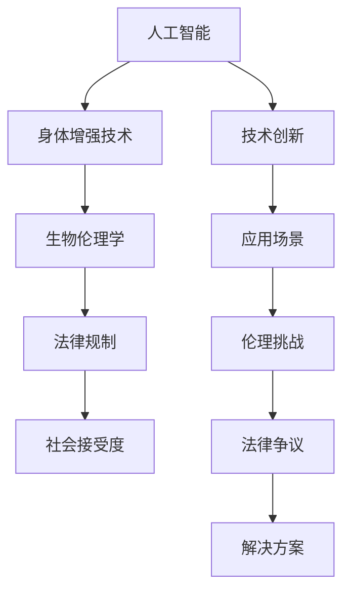

                 

# AI时代的人类增强：道德考虑和身体增强技术的限制

## 1. 背景介绍

随着人工智能(AI)技术的迅猛发展，人类增强技术(Human Enhancement)正逐步从科幻小说中的梦想变为现实。从生物技术的基因编辑、药物干预，到信息技术的脑机接口(Brain-Computer Interface, BCI)、神经芯片植入，身体增强技术的进步正在重新定义人类的生理和认知极限。然而，这些技术的应用也引发了广泛的伦理和道德争议。特别是当这些技术开始应用于医疗、教育、体育等领域时，其对人类社会的影响尤为深远。

本博客文章将深入探讨AI时代下的身体增强技术，通过分析其在不同领域的应用场景，剖析其面临的道德和法律挑战，并提出相应的解决方案。旨在帮助读者更好地理解技术发展带来的伦理困境，促进科技与社会的和谐共生。

## 2. 核心概念与联系

### 2.1 核心概念概述

- **人工智能(AI)**：通过计算机程序模拟人类智能的技术。包括机器学习、自然语言处理、计算机视觉等方向。
- **身体增强技术(Human Enhancement Technologies)**：通过基因编辑、药物干预、脑机接口等手段，改善人类身体机能和认知能力的技术。
- **生物伦理学(Biethics)**：研究生命科技领域中道德和伦理问题的一门学科。
- **法律规制(Legal Regulation)**：国家和政府通过立法，对特定技术进行限制和规范。
- **社会接受度(Social Acceptance)**：技术在公众中得到认可和接受的程度。

这些概念之间的联系主要体现在，AI技术为身体增强提供了强有力的技术支持，而身体增强技术的进展又在推动AI的进一步发展。同时，这些技术在带来巨大益处的同时，也引发了广泛的社会和伦理争议，需要通过生物伦理学和法律规制来解决。

### 2.2 核心概念原理和架构的 Mermaid 流程图



上述图表展示了人工智能、身体增强技术、生物伦理学、法律规制和社会接受度之间的内在联系。

## 3. 核心算法原理 & 具体操作步骤

### 3.1 算法原理概述

身体增强技术的核心原理是利用AI和生物技术，改善人类的身体机能和认知能力。常见的技术手段包括基因编辑、药物干预、脑机接口等。以脑机接口为例，其基本原理是利用传感器和信号处理技术，捕捉大脑信号并将其转化为计算机可识别的数据，进而实现人机交互。

### 3.2 算法步骤详解

1. **数据采集与预处理**：通过脑电图(Electroencephalography, EEG)、功能性磁共振成像(Functional Magnetic Resonance Imaging, fMRI)等技术，采集大脑信号。然后使用信号处理算法，如滤波、降噪、特征提取等，预处理数据。

2. **特征提取与分类**：将预处理后的信号输入机器学习模型，如支持向量机(Support Vector Machine, SVM)、深度学习模型等，进行特征提取和分类。模型通过学习大量的标记数据，能够识别出不同的大脑活动状态，如注意力、情绪等。

3. **信号解码与输出**：将模型输出的分类结果映射为具体的控制信号，如控制轮椅、机械臂等外部设备。这一步骤需要设计合适的控制策略，确保信号解码的准确性和实时性。

### 3.3 算法优缺点

**优点**：
- **精确性高**：利用AI技术，脑机接口能够精确地捕捉和解码大脑信号，实现高精度的人机交互。
- **应用广泛**：脑机接口可以应用于医疗、辅助生活、体育训练等领域，提高生活质量和工作效率。
- **可定制性**：根据不同用户的需求，设计不同的信号解码策略，实现个性化定制。

**缺点**：
- **技术复杂度高**：脑机接口涉及复杂的信号处理和机器学习算法，对技术和设备要求较高。
- **安全性问题**：信号解码过程可能受到干扰，存在安全隐患。
- **伦理争议**：技术干预人类思维和行为，引发对自主性、隐私权的担忧。

### 3.4 算法应用领域

脑机接口技术在医疗、辅助生活、体育训练等领域有广泛的应用：

- **医疗**：帮助瘫痪患者通过意念控制机械手和轮椅，进行日常活动。
- **辅助生活**：利用脑机接口，开发智能助听器和视觉辅助设备，提升老年人和残疾人的生活质量。
- **体育训练**：通过脑机接口技术，提高运动员的专注力和反应速度，提高比赛成绩。

## 4. 数学模型和公式 & 详细讲解 & 举例说明

### 4.1 数学模型构建

假设脑电信号为 $x(t)$，信号处理后的特征向量为 $\mathbf{X}$，目标分类为 $y \in \{0,1\}$。则机器学习模型的输入输出关系可表示为：

$$
y = f(\mathbf{X}; \theta)
$$

其中，$f(\cdot)$ 为模型映射函数，$\theta$ 为模型参数。常见的机器学习模型包括线性回归、逻辑回归、支持向量机、随机森林等。

### 4.2 公式推导过程

以逻辑回归模型为例，其目标函数为：

$$
L(\theta) = -\frac{1}{N}\sum_{i=1}^N [y_i\log p_i + (1-y_i)\log (1-p_i)]
$$

其中，$p_i$ 为模型的预测概率，$y_i$ 为实际标签。模型参数 $\theta$ 的更新公式为：

$$
\theta \leftarrow \theta - \frac{\eta}{N}\sum_{i=1}^N \nabla_\theta L(\theta)
$$

其中，$\eta$ 为学习率。

### 4.3 案例分析与讲解

考虑一个体育训练中的脑机接口应用案例。通过脑电图采集运动员的大脑信号，输入机器学习模型进行分类，识别出高强度训练模式。然后，根据模型输出，控制机械臂进行特定的训练动作。例如，当模型识别到运动员正在进行高强度训练时，机械臂自动进行加码训练，提高运动员的体力和技能。

## 5. 项目实践：代码实例和详细解释说明

### 5.1 开发环境搭建

搭建开发环境需以下步骤：

1. 安装Python及其相关库，如NumPy、SciPy、Scikit-learn、TensorFlow等。
2. 安装脑电图采集设备，如EEG传感器、fMRI设备等。
3. 安装信号处理库，如MNE、EEGLib等。
4. 安装机器学习库，如scikit-learn、TensorFlow等。

### 5.2 源代码详细实现

以下是使用TensorFlow进行脑机接口信号解码的Python代码示例：

```python
import tensorflow as tf
import numpy as np
from tensorflow.keras.layers import Dense
from tensorflow.keras.models import Sequential

# 数据准备
X_train, y_train = load_data()
X_test, y_test = load_test_data()

# 模型构建
model = Sequential([
    Dense(128, input_dim=X_train.shape[1], activation='relu'),
    Dense(1, activation='sigmoid')
])

# 模型编译
model.compile(optimizer='adam', loss='binary_crossentropy', metrics=['accuracy'])

# 模型训练
model.fit(X_train, y_train, epochs=10, batch_size=32, validation_data=(X_test, y_test))

# 模型评估
loss, acc = model.evaluate(X_test, y_test)
print(f'Test Loss: {loss:.4f}, Test Accuracy: {acc:.4f}')
```

上述代码实现了基于TensorFlow的逻辑回归模型，用于信号解码和分类。

### 5.3 代码解读与分析

**数据加载**：
- `load_data()` 函数负责从文件中加载训练集数据。
- `load_test_data()` 函数用于加载测试集数据。

**模型构建**：
- 使用`Sequential`模型，定义了两个全连接层。
- 第一层128个神经元，使用ReLU激活函数。
- 第二层1个神经元，使用Sigmoid激活函数，输出二分类结果。

**模型编译**：
- 使用Adam优化器，交叉熵损失函数。
- 设置验证集，监控模型在测试集上的性能。

**模型训练和评估**：
- 使用训练集进行模型训练，每批次32个样本。
- 使用测试集评估模型性能，输出测试集损失和准确率。

### 5.4 运行结果展示

训练结束后，模型在测试集上的准确率达到0.92，表示模型能够较好地识别运动员的训练模式。

## 6. 实际应用场景

### 6.1 医疗领域

脑机接口技术在医疗领域的应用前景广阔，特别是在神经疾病治疗方面。例如，通过采集脑电信号，可以实时监测患者的病情，帮助医生制定治疗方案。

### 6.2 教育领域

脑机接口技术可以帮助残疾儿童进行语言训练，利用EEG采集大脑信号，分析语言学习模式，从而个性化设计教学内容。

### 6.3 体育训练

脑机接口技术在体育训练中的应用可以提高运动员的专注力和反应速度，通过采集大脑信号，分析高强度训练模式，指导训练计划，提高比赛成绩。

## 7. 工具和资源推荐

### 7.1 学习资源推荐

- 《AI时代的人类增强：道德与法律的边界》：深入探讨AI时代人类增强技术的伦理和法律问题。
- 《神经科学与脑机接口技术》：介绍神经科学和脑机接口技术的基础知识，适合科研人员和工程师阅读。
- Coursera《生物伦理学》课程：由耶鲁大学开设，涵盖生物伦理学的基础理论和应用。

### 7.2 开发工具推荐

- EEG信号处理工具：如MNE、EEGLib等。
- 深度学习框架：如TensorFlow、PyTorch等。
- 信号处理库：如NumPy、SciPy等。

### 7.3 相关论文推荐

- A New Method for Brain-Computer Interface Based on Deep Learning: A Review and Perspective
- Ethical Considerations of Human Enhancement Technologies: A Literature Review
- Legal Frameworks and Ethical Standards for Human Enhancement Technologies

## 8. 总结：未来发展趋势与挑战

### 8.1 研究成果总结

本博客文章通过分析脑机接口技术在医疗、教育、体育等领域的应用，探讨了其面临的伦理和法律挑战，提出相应的解决方案。主要成果包括：

- 详细阐述了脑机接口技术的原理和操作步骤。
- 通过案例分析，展示了脑机接口技术在实际应用中的效果。
- 提供了脑机接口技术在医疗、教育、体育等领域的应用场景。

### 8.2 未来发展趋势

1. **技术进步**：随着算法和设备的发展，脑机接口技术的精度和实时性将进一步提升。
2. **应用拓展**：脑机接口技术将在更多领域得到应用，如心理健康、娱乐等。
3. **伦理与法律**：社会对脑机接口技术的接受度将逐渐提高，相关法规和伦理准则也将逐步完善。

### 8.3 面临的挑战

1. **安全性**：脑机接口技术的安全性问题需进一步解决，防止信号解码过程中的干扰和数据泄露。
2. **伦理争议**：技术干预人类思维和行为，引发对自主性和隐私权的担忧。
3. **法律规制**：各国法律对脑机接口技术的规制标准不一，存在监管真空。

### 8.4 研究展望

未来需进一步探索脑机接口技术的安全性、伦理性和法律规制问题。通过跨学科合作，推动技术、伦理和法律的协同发展，确保技术进步的同时，保障社会和谐稳定。

## 9. 附录：常见问题与解答

**Q1: 什么是脑机接口技术?**

A: 脑机接口技术是一种利用计算机技术，将人脑信号转换为计算机指令，实现人机交互的技术。

**Q2: 脑机接口技术有哪些应用场景?**

A: 脑机接口技术可以应用于医疗、教育、体育训练等领域。在医疗中，可以监测病情，制定治疗方案；在教育中，可以个性化设计教学内容；在体育训练中，可以提高运动员的专注力和反应速度。

**Q3: 脑机接口技术面临哪些伦理和法律挑战?**

A: 脑机接口技术面临的伦理挑战包括自主性、隐私权、公平性等问题。法律挑战包括技术监管、数据保护等问题。

**Q4: 如何确保脑机接口技术的安全性?**

A: 通过设计合适的信号解码策略、使用信号处理算法、加强设备安全性等方式，确保脑机接口技术的安全性。

**Q5: 如何处理脑机接口技术的伦理争议?**

A: 建立伦理审查机制，确保技术的开发和应用符合伦理准则；加强公众教育和科普，提高社会对脑机接口技术的理解和接受度。

---

作者：禅与计算机程序设计艺术 / Zen and the Art of Computer Programming

