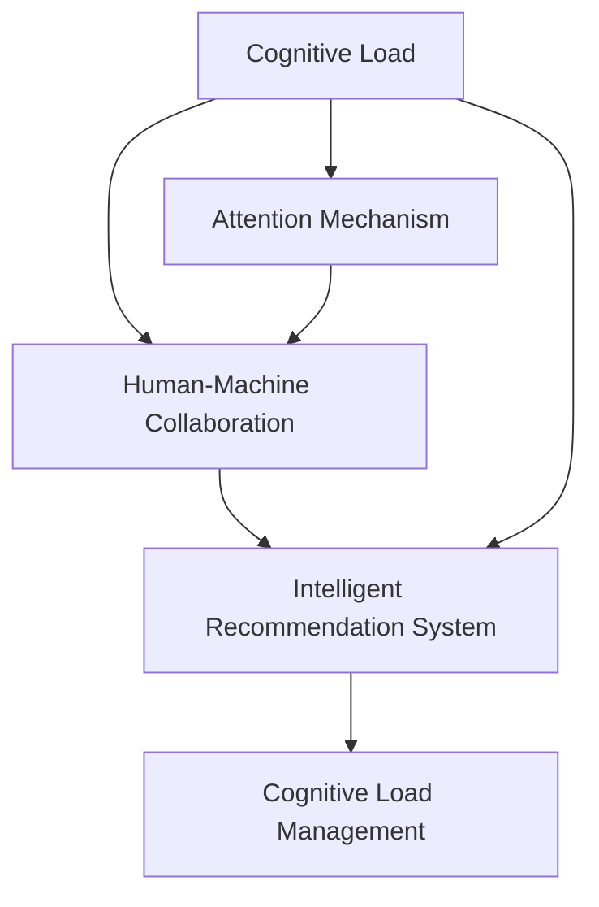

                 

# AI时代的人类注意力管理

> 关键词：人工智能,注意力机制,人类认知,认知负荷,智能交互,人机协同

## 1. 背景介绍

### 1.1 问题由来

在AI技术的推动下，人类社会的方方面面都在发生深刻变革。从智能家居到自动驾驶，从在线教育到虚拟助手，AI正在全面渗透到我们生活的各个领域。然而，AI的广泛应用也带来了新的挑战：在信息过载和注意力稀缺的双重压力下，如何高效管理人类注意力，成为了决定AI系统能否成功落地应用的关键问题。

注意力是认知心理学中的重要概念，指的是人们在进行复杂认知任务时，集中注意力于相关信息，同时过滤掉无关信息的能力。在AI时代，随着信息量的激增，注意力的有效管理显得尤为关键。尤其是在智能交互系统中，如何设计合理的注意力机制，吸引并保持用户注意力，实现人机协同，已经成为学术界和工业界共同关注的课题。

### 1.2 问题核心关键点

1. **认知负荷管理**：AI系统需要考虑人类认知负荷，避免过多信息导致的认知疲劳和注意力分散。
2. **人机协同设计**：通过合理设计注意力机制，引导用户与AI系统进行有效互动，实现智能交互。
3. **智能推荐系统**：通过优化注意力机制，提升信息筛选和推荐质量，增强用户体验。
4. **个性化体验**：基于用户注意力模型，提供个性化的信息展示和推荐，满足用户多样化需求。

## 2. 核心概念与联系

### 2.1 核心概念概述

为了更好地理解AI时代人类注意力管理的问题，本节将介绍几个密切相关的核心概念：

- **认知负荷**：指个体在信息处理过程中需要投入的认知资源总量，包括注意、记忆、思维等心理过程。
- **注意力机制**：AI系统中的注意力机制，旨在通过模拟人类注意力机制，引导系统关注关键信息，忽略干扰。
- **人机协同**：人机协同系统是指通过智能交互，使人类与AI系统实现无缝协同工作的系统。
- **智能推荐系统**：利用注意力机制和机器学习算法，实现个性化信息推荐。
- **认知负荷管理**：通过优化注意力机制，降低认知负荷，提高信息处理效率。

这些核心概念之间的逻辑关系可以通过以下Mermaid流程图来展示：



这个流程图展示了几大核心概念及其之间的关系：

1. 认知负荷决定注意力机制的设计。
2. 注意力机制是人机协同系统的基础。
3. 智能推荐系统依赖于注意力机制，提升推荐效果。
4. 认知负荷管理通过优化注意力机制，降低认知负荷。

这些概念共同构成了AI时代人类注意力管理的理论框架，为我们理解和设计注意力机制提供了重要依据。

## 3. 核心算法原理 & 具体操作步骤
### 3.1 算法原理概述

AI时代的人类注意力管理，核心在于设计合理的注意力机制，以引导AI系统聚焦于关键信息，同时减轻用户的认知负荷。这一过程可以通过以下几个步骤实现：

1. **需求分析**：确定AI系统需要处理的信息类型和用户需求，设计合理的注意力目标。
2. **注意力模型**：建立符合人类认知规律的注意力模型，如soft attention、self-attention等，定义系统关注信息的优先级。
3. **模型训练**：利用监督或无监督学习算法训练注意力模型，使其能够根据任务需求自动调整关注重点。
4. **效果评估**：通过评估指标如任务完成时间、准确率、用户满意度等，验证注意力机制的有效性。

### 3.2 算法步骤详解

具体而言，人类注意力管理过程可以分为以下几个关键步骤：

**Step 1: 需求分析**
- 确定AI系统的主要目标和用户需求，如信息筛选、内容推荐、决策支持等。
- 分析用户在不同场景下的注意力需求，如决策前信息检索、决策后结果反馈等。

**Step 2: 注意力模型设计**
- 根据任务需求，选择合适的注意力模型。常见的模型包括soft attention、self-attention等。
- 设计注意力机制的评估准则，如信息相关性、时间响应性、用户参与度等。

**Step 3: 模型训练**
- 收集标注数据，训练注意力模型。可以使用监督学习方法，如强化学习、神经网络等。
- 利用用户行为数据，不断调整注意力模型，提高其准确性和鲁棒性。

**Step 4: 效果评估**
- 通过实验验证注意力机制的有效性，收集用户反馈，不断优化模型。
- 使用A/B测试等方法，对比引入注意力机制前后的系统性能变化。

**Step 5: 应用部署**
- 将训练好的注意力模型应用到实际系统中，监测其运行效果。
- 根据实际情况，调整模型参数，优化用户体验。

### 3.3 算法优缺点

人类注意力管理算法具有以下优点：
1. 提高信息处理效率：通过聚焦关键信息，减少认知负荷，提高信息处理速度。
2. 增强用户满意度：优化用户交互体验，提升用户对AI系统的信任度。
3. 提升系统性能：通过智能推荐和注意力引导，提升系统任务完成效率。

同时，该算法也存在一定的局限性：
1. 模型复杂度较高：设计合理的注意力机制需要大量计算资源和专业知识。
2. 数据需求较大：需要大量标注数据和用户行为数据，训练难度较大。
3. 泛化能力有限：不同的应用场景和用户需求，可能需要定制化的注意力模型。
4. 用户适应性问题：注意力机制的引入可能会影响用户的习惯和行为，需要考虑用户适应性。

尽管存在这些局限性，但就目前而言，人类注意力管理算法仍是提升AI系统性能的重要手段。未来相关研究的重点在于如何进一步降低数据需求，提高模型泛化能力，同时兼顾用户适应性和系统可解释性等因素。

### 3.4 算法应用领域

人类注意力管理算法已经在多个领域得到了应用，展示了其强大的潜力：

- **智能推荐系统**：通过优化注意力机制，提升信息筛选和推荐效果，如Netflix、Amazon等平台广泛应用。
- **人机协同系统**：增强人机交互，提升系统响应速度和准确性，如谷歌助手、微软小冰等智能助手。
- **决策支持系统**：通过注意力引导，辅助决策者处理海量信息，如金融风险评估、医疗诊断等专业领域。
- **教育学习系统**：通过个性化信息推荐和注意力管理，提升学生学习效率和兴趣，如Khan Academy、Coursera等在线教育平台。
- **智能家居系统**：优化用户交互体验，提升家居系统智能化水平，如Google Home、Amazon Echo等智能设备。

此外，人类注意力管理算法还在社交媒体、广告推荐、智能客服等多个领域得到了广泛应用，为人们带来了更加智能、便捷的生活体验。随着AI技术的不断进步，相信人类注意力管理算法将在更多场景中发挥重要作用，为社会生产力和人类生活质量带来深远影响。

## 4. 数学模型和公式 & 详细讲解  
### 4.1 数学模型构建

本节将使用数学语言对人类注意力管理算法进行更加严格的刻画。

记输入数据为 $x$，注意力模型为 $A$，输出为 $y$。注意力模型 $A$ 的输入为 $x$，输出为 $y$，满足映射关系 $A(x) = y$。假设 $A$ 为可微分的函数，且存在损失函数 $L(y, \hat{y})$，用于衡量模型输出与真实标签之间的差异。则注意力模型的优化目标为：

$$
\min_{\theta} \mathbb{E}[L(A(x), \hat{y})]
$$

其中，$\theta$ 为模型参数，$\mathbb{E}$ 表示期望运算。

### 4.2 公式推导过程

以下是人类注意力管理算法的数学推导过程。

设注意力模型 $A$ 由多层的神经网络构成，其中第 $i$ 层的输出为 $z_i = f_i(z_{i-1})$，其中 $f_i$ 为第 $i$ 层的激活函数。第 $i$ 层的注意力权重为 $w_i$，满足权重和为 1，即 $\sum_{i=1}^n w_i = 1$。则注意力模型的计算过程可表示为：

$$
y = g(\sum_{i=1}^n w_i z_i)
$$

其中 $g$ 为输出层的激活函数。注意力权重 $w_i$ 的计算公式为：

$$
w_i = \frac{\exp(\phi_i(z_{i-1}))}{\sum_{j=1}^n \exp(\phi_j(z_{i-1}))}
$$

其中 $\phi_i$ 为第 $i$ 层的注意力计算函数，$\phi_i(z_{i-1})$ 为第 $i$ 层输入 $z_{i-1}$ 的注意力表示。

损失函数 $L$ 可表示为：

$$
L(A(x), \hat{y}) = \frac{1}{N}\sum_{i=1}^N L(y_i, \hat{y}_i)
$$

其中 $N$ 为样本数量，$L(y_i, \hat{y}_i)$ 为样本 $i$ 的损失函数。

### 4.3 案例分析与讲解

以推荐系统为例，分析注意力机制在信息推荐中的作用。

假设推荐系统要为用户推荐商品 $x$，输入为用户的偏好 $u$，商品属性 $a$ 和历史行为 $h$。推荐系统的任务是最大化用户满意度 $y$，可通过注意力机制计算商品 $x$ 与用户偏好 $u$ 的匹配度 $z_i$，并计算注意力权重 $w_i$。推荐模型可表示为：

$$
y = \sum_{i=1}^n w_i z_i
$$

其中 $w_i$ 表示商品 $x_i$ 的匹配度与用户偏好的相关性，$z_i$ 表示商品 $x_i$ 的特征表示。通过优化注意力权重 $w_i$，推荐系统能够动态调整推荐商品组合，提升推荐效果。

## 5. 项目实践：代码实例和详细解释说明
### 5.1 开发环境搭建

在进行注意力管理算法开发前，我们需要准备好开发环境。以下是使用Python进行TensorFlow开发的环境配置流程：

1. 安装Anaconda：从官网下载并安装Anaconda，用于创建独立的Python环境。

2. 创建并激活虚拟环境：
```bash
conda create -n tf-env python=3.8 
conda activate tf-env
```

3. 安装TensorFlow：根据CUDA版本，从官网获取对应的安装命令。例如：
```bash
conda install tensorflow==2.4.0
```

4. 安装Keras和TensorBoard：
```bash
pip install keras tensorboard
```

5. 安装各类工具包：
```bash
pip install numpy pandas scikit-learn matplotlib tqdm jupyter notebook ipython
```

完成上述步骤后，即可在`tf-env`环境中开始注意力管理算法的开发。

### 5.2 源代码详细实现

下面我们以推荐系统为例，给出使用TensorFlow实现注意力机制的PyTorch代码实现。

首先，定义推荐系统的数据处理函数：

```python
import tensorflow as tf
from tensorflow.keras.layers import Input, Dense, Embedding, LSTM, Concatenate
from tensorflow.keras.models import Model

# 定义用户输入、商品输入和用户行为输入
user_input = Input(shape=(1,))
item_input = Input(shape=(1,))
behavior_input = Input(shape=(1,))

# 定义用户和商品的嵌入层
user_embeddings = Embedding(input_dim=num_users, output_dim=128, mask_zero=True)(user_input)
item_embeddings = Embedding(input_dim=num_items, output_dim=128, mask_zero=True)(item_input)

# 定义行为序列的LSTM层
behavior_rnn = LSTM(64)(behavior_input)

# 定义综合嵌入层的输出
combined = Concatenate()([user_embeddings, item_embeddings, behavior_rnn])

# 定义注意力机制的输出层
attention_output = Dense(1, activation='softmax')(combined)

# 定义推荐模型的输出层
recommendation_output = Dense(1, activation='sigmoid')(attention_output)

# 定义推荐系统的模型
model = Model(inputs=[user_input, item_input, behavior_input], outputs=recommendation_output)

# 编译模型
model.compile(loss='binary_crossentropy', optimizer='adam', metrics=['accuracy'])
```

然后，定义模型训练函数：

```python
from tensorflow.keras.preprocessing.sequence import pad_sequences
from tensorflow.keras.callbacks import EarlyStopping

def train_model(model, train_data, validation_data, epochs=10, batch_size=32):
    train_data = pad_sequences(train_data[0], maxlen=max_seq_len, padding='post')
    train_labels = train_data[1]
    validation_data = pad_sequences(validation_data[0], maxlen=max_seq_len, padding='post')
    validation_labels = validation_data[1]
    
    early_stopping = EarlyStopping(monitor='val_loss', patience=3)
    model.fit(train_data, train_labels, validation_data=validation_data, validation_labels=validation_labels, epochs=epochs, batch_size=batch_size, callbacks=[early_stopping])
```

接着，定义模型评估函数：

```python
def evaluate_model(model, test_data, batch_size=32):
    test_data = pad_sequences(test_data[0], maxlen=max_seq_len, padding='post')
    test_labels = test_data[1]
    return model.evaluate(test_data, test_labels, batch_size=batch_size)
```

最后，启动训练流程并在测试集上评估：

```python
train_data = [(X_train, Y_train), (Y_train, X_train)]
validation_data = [(X_val, Y_val), (Y_val, X_val)]
test_data = [(X_test, Y_test), (Y_test, X_test)]

train_model(model, train_data, validation_data, epochs=10, batch_size=32)
test_loss, test_acc = evaluate_model(model, test_data, batch_size=32)
print(f'Test Loss: {test_loss:.4f}')
print(f'Test Accuracy: {test_acc:.4f}')
```

以上就是使用TensorFlow实现注意力机制的完整代码实现。可以看到，通过将用户输入、商品输入和行为输入综合处理，并引入注意力机制，推荐系统能够更加智能地为用户推荐商品。

### 5.3 代码解读与分析

让我们再详细解读一下关键代码的实现细节：

**定义输入层**：
- 使用`Input`函数定义用户输入、商品输入和行为输入。

**定义嵌入层**：
- 使用`Embedding`函数将输入层转化为稠密向量表示，并通过`mask_zero`参数处理缺失值。

**定义行为序列的LSTM层**：
- 使用`LSTM`函数处理行为序列数据，提取其时间依赖特征。

**定义综合嵌入层的输出**：
- 使用`Concatenate`函数将用户嵌入、商品嵌入和行为特征进行综合，得到综合特征表示。

**定义注意力机制的输出层**：
- 使用`Dense`函数定义注意力机制的输出层，使用`softmax`激活函数处理注意力权重。

**定义推荐模型的输出层**：
- 使用`Dense`函数定义推荐模型的输出层，使用`sigmoid`激活函数处理推荐结果。

**定义推荐系统的模型**：
- 使用`Model`函数定义完整的推荐系统模型。

**编译模型**：
- 使用`compile`函数编译模型，定义损失函数、优化器和评估指标。

**训练模型**：
- 使用`fit`函数训练模型，指定训练数据、验证数据、迭代次数和批量大小。
- 使用`EarlyStopping`回调函数，防止模型在验证集上过拟合。

**评估模型**：
- 使用`evaluate`函数在测试集上评估模型性能。

**训练流程**：
- 从训练数据中获取用户输入、商品输入和行为输入。
- 使用`pad_sequences`函数对输入进行padding，处理不同长度的序列。
- 使用`fit`函数训练模型，记录训练过程中的损失和准确率。
- 使用`evaluate`函数在测试集上评估模型性能。

可以看到，TensorFlow和Keras的强大封装使得注意力机制的实现变得简单高效。开发者可以将更多精力放在模型设计和数据处理等高层逻辑上，而不必过多关注底层的实现细节。

当然，工业级的系统实现还需考虑更多因素，如模型的保存和部署、超参数的自动搜索、更灵活的任务适配层等。但核心的注意力机制基本与此类似。

## 6. 实际应用场景
### 6.1 智能推荐系统

基于注意力机制的智能推荐系统，已经在电子商务、内容平台、社交媒体等多个领域得到了广泛应用。例如，亚马逊、Netflix、YouTube等平台广泛使用基于注意力的推荐算法，根据用户的历史行为和偏好，动态调整推荐内容，提升用户体验和转化率。

在实际应用中，推荐系统会根据用户的浏览历史、评分记录、点赞行为等数据，计算每个商品或内容的注意力权重，最终输出推荐列表。通过优化注意力机制，推荐系统能够更好地理解用户需求，提供个性化推荐，提升用户满意度。

### 6.2 人机协同系统

在人机协同系统中，注意力机制能够显著提高系统的响应速度和准确性。例如，智能语音助手、智能客服等系统，通过聚焦关键信息，提高信息处理的效率和准确性。

以智能语音助手为例，当用户提问时，注意力机制能够识别出关键信息，如姓名、时间、地点等，同时过滤掉无关信息，如语气、情感等。通过聚焦关键信息，智能语音助手能够更准确地理解用户意图，提供更加个性化和高效的服务。

### 6.3 决策支持系统

在金融、医疗等决策支持领域，注意力机制能够帮助决策者从海量信息中快速筛选关键数据，提升决策效率和准确性。例如，银行信贷审核系统、医疗诊断系统等，通过注意力机制对相关数据进行加权处理，提高决策的准确性和可靠性。

以银行信贷审核系统为例，系统会根据用户的信用记录、收入水平、负债情况等数据，计算每个数据的注意力权重，最终输出综合评估结果。通过优化注意力机制，系统能够更准确地评估贷款风险，提高信贷审批的效率和质量。

### 6.4 教育学习系统

在教育学习领域，注意力机制能够帮助学生高效学习，提升学习效果。例如，Khan Academy、Coursera等在线教育平台，通过注意力机制对课程内容和练习题目进行加权处理，提供个性化的学习建议。

以Khan Academy为例，平台会根据学生的学习进度、答题记录、学习偏好等数据，计算每个课程内容的注意力权重，最终输出推荐的学习路径。通过优化注意力机制，平台能够更好地满足学生的多样化需求，提升学习效果和用户体验。

### 6.5 未来应用展望

随着注意力机制的不断发展和应用，未来将在更多领域展现出其强大的潜力：

1. **多模态智能系统**：结合视觉、听觉、文本等多种信息源，构建多模态注意力机制，提升系统的感知和理解能力。
2. **联邦学习**：分布式训练注意力模型，保护用户隐私，提升系统鲁棒性和泛化能力。
3. **个性化推荐系统**：利用注意力机制，提升推荐系统的效果，满足用户多样化需求。
4. **智能交互系统**：通过优化注意力机制，提升智能交互系统的响应速度和准确性，增强用户体验。
5. **知识图谱系统**：结合注意力机制和知识图谱，实现知识推理和智能搜索，提升系统智能化水平。

以上趋势凸显了注意力机制在AI系统中的重要地位。这些方向的探索发展，必将进一步提升AI系统的性能和应用范围，为社会生产力和人类生活质量带来深远影响。

## 7. 工具和资源推荐
### 7.1 学习资源推荐

为了帮助开发者系统掌握注意力机制的理论基础和实践技巧，这里推荐一些优质的学习资源：

1. Attention is All You Need论文：提出Transformer结构，奠定了注意力机制在NLP领域的应用基础。

2 Deep Learning Specialization课程：由Andrew Ng教授开设的深度学习系列课程，系统讲解了注意力机制及其应用。

3 Understanding Attention Mechanism系列博文：详细介绍了注意力机制的原理和应用，适用于初学者和进阶者。

4 TensorFlow官方文档：详细介绍了TensorFlow框架中的注意力机制实现方法，包括Keras、TensorBoard等工具的使用。

5 PyTorch官方文档：详细介绍了PyTorch框架中的注意力机制实现方法，包括Attention、Transformer等模型的实现。

通过学习这些资源，相信你一定能够系统掌握注意力机制的理论基础和实践技巧，并将其应用于实际开发中。

### 7.2 开发工具推荐

高效的开发离不开优秀的工具支持。以下是几款用于注意力机制开发的常用工具：

1. TensorFlow：基于Python的开源深度学习框架，支持多 GPU、TPU 计算，适用于大规模模型训练和优化。

2. PyTorch：基于Python的开源深度学习框架，灵活易用，适用于快速原型设计和研究。

3. Keras：高级神经网络API，简洁易用，适用于快速搭建和训练模型。

4. TensorBoard：TensorFlow配套的可视化工具，实时监测模型训练状态，并提供丰富的图表呈现方式。

5. Weights & Biases：模型训练的实验跟踪工具，可以记录和可视化模型训练过程中的各项指标，方便对比和调优。

合理利用这些工具，可以显著提升注意力机制的开发效率，加快创新迭代的步伐。

### 7.3 相关论文推荐

注意力机制的发展源于学界的持续研究。以下是几篇奠基性的相关论文，推荐阅读：

1 Attention is All You Need论文：提出Transformer结构，奠定了注意力机制在NLP领域的应用基础。

2 Look, Attend and Point: Weakly-supervised Image Tagging with Visual Attention论文：结合视觉信息，提出基于视觉注意力的图像标注方法。

3 Neural Machine Translation by Jointly Learning to Align and Translate论文：提出基于注意力机制的神经机器翻译方法，取得优异的效果。

4 A Theoretical Analysis of Attention Mechanisms in Deep Learning论文：从理论上分析注意力机制在深度学习中的表现，指导实际应用。

5 Watasuki: A Knowledge-aware Attention Network for Multimodal Summarization论文：结合知识图谱，提出基于注意力机制的多模态摘要方法。

这些论文代表了大注意力机制的发展脉络。通过学习这些前沿成果，可以帮助研究者把握学科前进方向，激发更多的创新灵感。

## 8. 总结：未来发展趋势与挑战

### 8.1 总结

本文对AI时代的人类注意力管理问题进行了全面系统的介绍。首先阐述了AI系统在信息过载和注意力稀缺下的核心问题，明确了注意力机制在设计AI系统中的重要地位。其次，从原理到实践，详细讲解了注意力机制的数学模型和关键步骤，给出了注意力管理算法的完整代码实现。同时，本文还广泛探讨了注意力机制在智能推荐系统、人机协同系统等多个领域的应用前景，展示了注意力机制的强大潜力。此外，本文精选了注意力机制的各类学习资源，力求为读者提供全方位的技术指引。

通过本文的系统梳理，可以看到，注意力机制在大数据时代的AI系统中扮演着越来越重要的角色。通过合理设计注意力机制，AI系统能够更加智能地聚焦关键信息，提高信息处理效率，提升用户体验。未来，伴随注意力机制的不断演进和应用，基于注意力机制的AI系统必将带来更加深刻的变革，为人类社会带来全新的发展机遇。

### 8.2 未来发展趋势

展望未来，注意力机制在AI系统中的应用将呈现以下几个发展趋势：

1. **多模态注意力机制**：结合视觉、听觉、文本等多种信息源，构建多模态注意力机制，提升系统的感知和理解能力。
2. **联邦学习**：分布式训练注意力模型，保护用户隐私，提升系统鲁棒性和泛化能力。
3. **深度强化学习**：结合深度强化学习算法，优化注意力机制，提升系统的自主性和智能化水平。
4. **动态注意力机制**：根据任务需求动态调整注意力权重，提高系统适应性和灵活性。
5. **知识增强注意力**：结合知识图谱、逻辑规则等先验知识，增强注意力机制的普适性和鲁棒性。

以上趋势凸显了注意力机制在AI系统中的重要地位。这些方向的探索发展，必将进一步提升AI系统的性能和应用范围，为社会生产力和人类生活质量带来深远影响。

### 8.3 面临的挑战

尽管注意力机制已经取得了显著成就，但在迈向更加智能化、普适化应用的过程中，它仍面临诸多挑战：

1. **模型复杂度**：设计合理的注意力机制需要大量计算资源和专业知识。
2. **数据需求**：需要大量标注数据和用户行为数据，训练难度较大。
3. **泛化能力**：不同的应用场景和用户需求，可能需要定制化的注意力模型。
4. **用户适应性**：注意力机制的引入可能会影响用户的习惯和行为，需要考虑用户适应性。

尽管存在这些挑战，但就目前而言，注意力机制仍是提升AI系统性能的重要手段。未来相关研究的重点在于如何进一步降低数据需求，提高模型泛化能力，同时兼顾用户适应性和系统可解释性等因素。

### 8.4 研究展望

面对注意力机制面临的种种挑战，未来的研究需要在以下几个方面寻求新的突破：

1. **无监督和半监督注意力机制**：摆脱对大规模标注数据的依赖，利用自监督学习、主动学习等无监督和半监督范式，最大限度利用非结构化数据，实现更加灵活高效的注意力机制。

2. **参数高效注意力机制**：开发更加参数高效的注意力机制，在固定大部分预训练参数的同时，只更新极少量的任务相关参数。

3. **因果注意力机制**：通过引入因果推断和对比学习思想，增强注意力机制建立稳定因果关系的能力，学习更加普适、鲁棒的语言表征，从而提升模型泛化性和抗干扰能力。

4. **多目标注意力机制**：结合多种注意力目标，提升系统的多任务处理能力和性能。

5. **元学习注意力机制**：通过元学习算法，提升注意力机制的自适应能力和泛化能力。

6. **伦理和安全性**：在模型训练目标中引入伦理导向的评估指标，过滤和惩罚有偏见、有害的输出倾向。同时加强人工干预和审核，建立模型行为的监管机制，确保输出符合人类价值观和伦理道德。

这些研究方向的探索，必将引领注意力机制迈向更高的台阶，为构建安全、可靠、可解释、可控的智能系统铺平道路。面向未来，注意力机制还需要与其他人工智能技术进行更深入的融合，如知识表示、因果推理、强化学习等，多路径协同发力，共同推动人工智能技术的进步。只有勇于创新、敢于突破，才能不断拓展注意力机制的边界，让智能技术更好地造福人类社会。

## 9. 附录：常见问题与解答

**Q1：注意力机制如何应用于推荐系统？**

A: 在推荐系统中，注意力机制可以通过计算商品或内容的注意力权重，动态调整推荐列表。具体而言，系统会根据用户的历史行为、兴趣偏好等数据，计算每个商品或内容的注意力权重，最终输出推荐列表。

**Q2：注意力机制如何优化用户体验？**

A: 通过聚焦关键信息，优化注意力机制可以显著提高用户体验。例如，智能语音助手、智能客服等系统，通过聚焦关键信息，提高信息处理的效率和准确性，提升用户的交互体验。

**Q3：注意力机制如何结合知识图谱？**

A: 注意力机制可以结合知识图谱，提升系统的知识推理和智能搜索能力。例如，在医疗诊断系统中，系统可以根据患者的症状、历史记录等数据，结合知识图谱中的疾病关系，计算每个症状的注意力权重，最终输出诊断结果。

**Q4：注意力机制如何实现多模态融合？**

A: 注意力机制可以结合视觉、听觉、文本等多种信息源，构建多模态注意力机制，提升系统的感知和理解能力。例如，在多模态图像描述系统中，系统可以根据图像、文本等多种信息，计算每个特征的注意力权重，最终输出描述结果。

**Q5：注意力机制如何优化认知负荷？**

A: 通过优化注意力机制，系统可以更加智能地聚焦关键信息，减少认知负荷，提升信息处理效率。例如，在智能阅读系统中，系统可以根据用户阅读习惯，动态调整页面内容的注意力权重，提升阅读体验。

通过本文的系统梳理，可以看到，注意力机制在大数据时代的AI系统中扮演着越来越重要的角色。通过合理设计注意力机制，AI系统能够更加智能地聚焦关键信息，提高信息处理效率，提升用户体验。未来，伴随注意力机制的不断演进和应用，基于注意力机制的AI系统必将带来更加深刻的变革，为人类社会带来全新的发展机遇。

