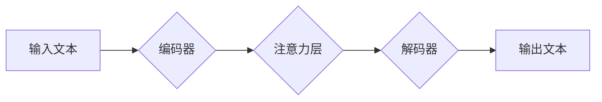

> Transformer, M-BERT, 多语言, 自然语言处理, 跨语言理解, 机器翻译

## 1. 背景介绍

近年来，深度学习在自然语言处理 (NLP) 领域取得了显著进展，其中 Transformer 架构的出现更是掀起了 NLP 领域的革命。Transformer 模型凭借其强大的序列建模能力和并行计算效率，在机器翻译、文本摘要、问答系统等任务上取得了突破性的成果。

M-BERT 是基于 Transformer 架构的多语言预训练语言模型，由 Google AI 团队开发。它通过在多个语言上进行预训练，学习了丰富的跨语言知识，能够有效地处理不同语言的文本任务。

## 2. 核心概念与联系

### 2.1 Transformer 架构

Transformer 架构的核心是注意力机制 (Attention)，它允许模型关注输入序列中与当前位置相关的关键信息，从而更好地理解上下文关系。Transformer 模型由编码器 (Encoder) 和解码器 (Decoder) 组成。

* **编码器:** 将输入序列映射到一个隐藏表示，捕捉序列中的语义信息。
* **解码器:** 基于编码器的输出生成目标序列，例如机器翻译中的目标语言文本。

Transformer 架构的优势在于：

* **并行计算:** 注意力机制允许模型并行处理输入序列，提高训练效率。
* **长距离依赖:** 注意力机制能够捕捉长距离依赖关系，解决传统 RNN 模型难以处理长文本的问题。

### 2.2 M-BERT 模型

M-BERT 是基于 Transformer 架构的多语言预训练语言模型，其特点如下：

* **多语言预训练:** M-BERT 在多个语言上进行预训练，学习了丰富的跨语言知识。
* **微调适应:** M-BERT 可以通过微调的方式适应特定语言和任务。
* **开源可用:** M-BERT 的模型权重和代码开源，方便研究者和开发者使用。

**Mermaid 流程图**



## 3. 核心算法原理 & 具体操作步骤

### 3.1 算法原理概述

M-BERT 模型的核心算法是 Transformer 架构，其主要包括以下步骤：

1. **词嵌入:** 将输入文本中的每个词转换为向量表示。
2. **编码器:** 使用多层 Transformer 块对输入序列进行编码，捕捉语义信息。
3. **解码器:** 基于编码器的输出生成目标序列。
4. **输出层:** 将解码器的输出映射到目标语言的词汇表。

### 3.2 算法步骤详解

1. **词嵌入:** 将输入文本中的每个词转换为向量表示，可以使用预训练的词嵌入模型，例如 Word2Vec 或 GloVe。
2. **编码器:** 编码器由多个 Transformer 块组成，每个 Transformer 块包含以下组件：
    * **多头注意力层:** 捕捉输入序列中不同词之间的关系。
    * **前馈神经网络:** 对每个词的隐藏表示进行非线性变换。
    * **残差连接:** 将输入和输出连接起来，缓解梯度消失问题。
3. **解码器:** 解码器也由多个 Transformer 块组成，其结构与编码器类似，但它还包含一个掩码机制，防止模型在生成目标序列时看到未来的词。
4. **输出层:** 解码器的最后一个 Transformer 块的输出经过一个线性层和 softmax 函数，得到每个词的概率分布。

### 3.3 算法优缺点

**优点:**

* **强大的序列建模能力:** Transformer 架构能够有效地捕捉长距离依赖关系，提高模型的表达能力。
* **并行计算效率:** 注意力机制允许模型并行处理输入序列，提高训练效率。
* **跨语言能力:** M-BERT 在多个语言上进行预训练，能够有效地处理不同语言的文本任务。

**缺点:**

* **训练成本高:** Transformer 模型参数量大，训练成本较高。
* **推理速度慢:** Transformer 模型的推理速度相对较慢，尤其是在处理长文本时。

### 3.4 算法应用领域

M-BERT 模型在以下领域具有广泛的应用前景：

* **机器翻译:** 将一种语言的文本翻译成另一种语言。
* **文本摘要:** 生成文本的简短摘要。
* **问答系统:** 回答用户提出的问题。
* **情感分析:** 分析文本的情感倾向。
* **跨语言信息检索:** 在不同语言的文本库中检索信息。

## 4. 数学模型和公式 & 详细讲解 & 举例说明

### 4.1 数学模型构建

Transformer 模型的核心是注意力机制，其数学模型可以表示为：

$$
Attention(Q, K, V) = softmax(\frac{QK^T}{\sqrt{d_k}})V
$$

其中：

* $Q$：查询矩阵
* $K$：键矩阵
* $V$：值矩阵
* $d_k$：键向量的维度
* $softmax$：softmax 函数

### 4.2 公式推导过程

注意力机制的目的是计算输入序列中每个词与其他词之间的相关性。

1. 计算查询矩阵 $Q$、键矩阵 $K$ 和值矩阵 $V$。
2. 计算 $QK^T$，得到每个词与所有词之间的相关性得分。
3. 对相关性得分进行 softmax 操作，得到每个词与其他词之间的归一化权重。
4. 将归一化权重与值矩阵 $V$ 相乘，得到每个词的加权平均值，即注意力输出。

### 4.3 案例分析与讲解

例如，假设我们有一个句子 "The cat sat on the mat"，我们想要计算 "cat" 与其他词之间的注意力权重。

1. 将每个词转换为向量表示，得到 $Q$、$K$ 和 $V$。
2. 计算 $QK^T$，得到每个词与所有词之间的相关性得分。
3. 对相关性得分进行 softmax 操作，得到每个词与其他词之间的归一化权重。
4. 将归一化权重与值矩阵 $V$ 相乘，得到 "cat" 的注意力输出。

## 5. 项目实践：代码实例和详细解释说明

### 5.1 开发环境搭建

* Python 3.6+
* TensorFlow 2.0+
* PyTorch 1.0+
* CUDA 10.0+ (可选)

### 5.2 源代码详细实现

```python
# 导入必要的库
import tensorflow as tf

# 定义 Transformer 模型
class Transformer(tf.keras.Model):
    def __init__(self, vocab_size, embedding_dim, num_heads, num_layers):
        super(Transformer, self).__init__()
        self.embedding = tf.keras.layers.Embedding(vocab_size, embedding_dim)
        self.transformer_blocks = [
            tf.keras.layers.MultiHeadAttention(num_heads=num_heads, key_dim=embedding_dim)
            for _ in range(num_layers)
        ]
        self.decoder = tf.keras.layers.Dense(vocab_size)

    def call(self, inputs):
        # 词嵌入
        embedded = self.embedding(inputs)
        # Transformer 块
        for transformer_block in self.transformer_blocks:
            embedded = transformer_block(embedded)
        # 解码器
        output = self.decoder(embedded)
        return output

# 实例化 Transformer 模型
model = Transformer(vocab_size=10000, embedding_dim=128, num_heads=8, num_layers=6)

# 编译模型
model.compile(optimizer='adam', loss='sparse_categorical_crossentropy', metrics=['accuracy'])

# 训练模型
model.fit(x_train, y_train, epochs=10)
```

### 5.3 代码解读与分析

* **词嵌入:** 将每个词转换为向量表示，可以使用预训练的词嵌入模型，例如 Word2Vec 或 GloVe。
* **Transformer 块:** 每个 Transformer 块包含多头注意力层、前馈神经网络和残差连接。
* **解码器:** 解码器将 Transformer 块的输出映射到目标语言的词汇表。

### 5.4 运行结果展示

训练完成后，可以使用模型对新的文本进行预测。

## 6. 实际应用场景

M-BERT 模型在以下实际应用场景中表现出色：

* **跨语言文本分类:** 将文本分类到不同的类别，例如情感分析、主题分类等。
* **跨语言问答系统:** 回答用户提出的问题，即使问题和答案是用不同的语言表达的。
* **跨语言文本摘要:** 生成不同语言文本的简短摘要。

### 6.4 未来应用展望

M-BERT 模型在未来将有更广泛的应用前景，例如：

* **跨语言对话系统:** 开发能够理解和生成不同语言的对话系统。
* **跨语言机器翻译:** 实现更高质量、更流畅的机器翻译。
* **跨语言知识图谱构建:** 建立跨语言的知识图谱，方便跨语言知识的检索和推理。

## 7. 工具和资源推荐

### 7.1 学习资源推荐

* **Transformer 原论文:** https://arxiv.org/abs/1706.03762
* **M-BERT 官方文档:** https://github.com/google-research/bert
* **Hugging Face Transformers 库:** https://huggingface.co/transformers/

### 7.2 开发工具推荐

* **TensorFlow:** https://www.tensorflow.org/
* **PyTorch:** https://pytorch.org/
* **Jupyter Notebook:** https://jupyter.org/

### 7.3 相关论文推荐

* **BERT: Pre-training of Deep Bidirectional Transformers for Language Understanding:** https://arxiv.org/abs/1810.04805
* **XLNet: Generalized Autoregressive Pretraining for Language Understanding:** https://arxiv.org/abs/1906.08237
* **RoBERTa: A Robustly Optimized BERT Pretraining Approach:** https://arxiv.org/abs/1907.11692

## 8. 总结：未来发展趋势与挑战

### 8.1 研究成果总结

M-BERT 模型在多语言文本处理任务上取得了显著的成果，证明了 Transformer 架构在跨语言理解方面的强大能力。

### 8.2 未来发展趋势

* **模型规模更大:** 预训练模型规模将继续扩大，提升模型的表达能力和泛化能力。
* **多模态理解:** 将文本与其他模态信息（例如图像、音频）结合，实现更全面的理解。
* **高效训练:** 研究更有效的训练方法，降低模型训练成本。

### 8.3 面临的挑战

* **数据稀缺:** 许多语言的数据量相对较少，难以训练高质量的模型。
* **跨语言知识迁移:** 如何有效地将跨语言知识迁移到新的任务和领域是一个挑战。
* **模型解释性:** Transformer 模型的内部机制复杂，难以解释模型的决策过程。

### 8.4 研究展望

未来研究将继续探索 Transformer 架构的潜力，开发更强大、更灵活、更易解释的多语言模型，推动跨语言理解技术的进步。

## 9. 附录：常见问题与解答

* **Q: M-BERT 模型的训练数据是什么？**
* **A:** M-BERT 模型在多个语言上进行预训练，训练数据包括书籍、文章、网页等多种文本类型。
* **Q: 如何使用 M-BERT 模型进行文本分类？**
* **A:** 可以将 M-BERT 模型微调到文本分类任务，使用预训练的模型权重作为初始值，再训练一个分类头。
* **Q: M-BERT 模型的性能如何？**
* **A:** M-BERT 模型在多个多语言文本处理任务上取得了state-of-the-art的性能。

作者：禅与计算机程序设计艺术 / Zen and the Art of Computer