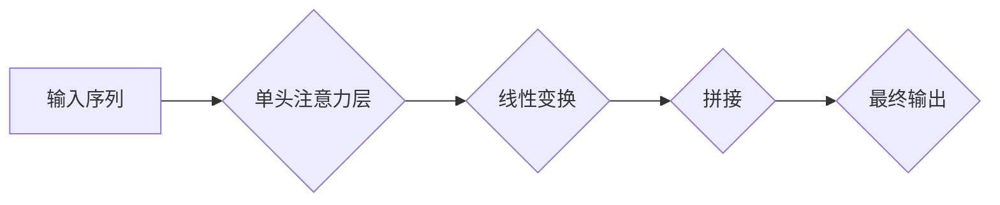
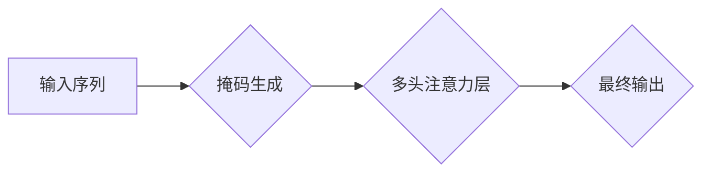

> Transformer, 多头注意力, 带掩码注意力, 自然语言处理, 深度学习, 大模型

## 1. 背景介绍

近年来，深度学习在自然语言处理 (NLP) 领域取得了显著进展，其中 Transformer 架构成为 NLP 领域的新宠。其核心在于利用多头注意力机制，有效捕捉文本序列中的长距离依赖关系，超越了传统 RNN 模型的局限性。

Transformer 架构的出现，标志着 NLP 领域进入了一个新的时代。BERT、GPT、T5 等基于 Transformer 的模型，在各种 NLP 任务上取得了突破性的成绩，例如机器翻译、文本摘要、问答系统等。

然而，Transformer 模型的训练过程也面临着一些挑战，例如训练时间长、参数量大等。为了解决这些问题，研究者们提出了许多改进方案，其中之一就是带掩码的多头注意力层。

## 2. 核心概念与联系

### 2.1 多头注意力机制

多头注意力机制是 Transformer 架构的核心，它允许模型关注不同位置的词语之间的关系，并学习不同类型的语义信息。

多头注意力机制可以看作是多个单头注意力的组合，每个单头注意力关注不同的方面，最终将多个单头注意力的输出进行融合，得到更丰富的语义表示。

**Mermaid 流程图:**



### 2.2 带掩码注意力

在训练 Transformer 模型时，我们需要使用掩码来防止模型看到未来词语的信息。

例如，在机器翻译任务中，我们需要将源语言句子翻译成目标语言句子。为了防止模型在翻译目标语言句子时看到源语言句子的未来词语信息，我们需要使用掩码将源语言句子的未来词语信息遮盖掉。

**Mermaid 流程图:**



## 3. 核心算法原理 & 具体操作步骤

### 3.1 算法原理概述

带掩码的多头注意力层是在多头注意力机制的基础上，加入了掩码机制。

其核心思想是：在计算注意力权重时，使用掩码来屏蔽掉未来词语的信息，从而保证模型只关注当前词语及其之前的词语信息。

### 3.2 算法步骤详解

1. **输入序列:** 将输入序列分割成多个词语，每个词语表示为一个向量。

2. **查询、键、值矩阵:** 将输入序列分别投影到查询 (Q)、键 (K) 和值 (V) 三个矩阵。

3. **计算注意力权重:** 计算每个词语与其他词语之间的注意力权重。

4. **掩码操作:** 使用掩码屏蔽掉未来词语的信息。

5. **加权求和:** 将注意力权重与值矩阵相乘，并进行加权求和，得到每个词语的上下文表示。

6. **拼接和线性变换:** 将多个头注意力层的输出拼接起来，并进行线性变换，得到最终的输出。

### 3.3 算法优缺点

**优点:**

* 能够有效捕捉文本序列中的长距离依赖关系。
* 训练速度更快，参数量更少。

**缺点:**

* 仍然存在一些计算复杂度的问题。
* 掩码机制可能会导致信息丢失。

### 3.4 算法应用领域

带掩码的多头注意力层广泛应用于各种 NLP 任务，例如：

* 机器翻译
* 文本摘要
* 问答系统
* 情感分析
* 语义理解

## 4. 数学模型和公式 & 详细讲解 & 举例说明

### 4.1 数学模型构建

设输入序列为 $X = \{x_1, x_2, ..., x_n\}$, 其中 $x_i$ 为第 $i$ 个词语的向量表示。

多头注意力层的输出可以表示为：

$$
\text{MultiHeadAttention}(X) = \text{Concat}(head_1, head_2, ..., head_h)W_O
$$

其中：

* $head_i$ 为第 $i$ 个头的注意力输出。
* $h$ 为多头数量。
* $W_O$ 为最终线性变换矩阵。

### 4.2 公式推导过程

每个头的注意力输出可以表示为：

$$
head_i = \text{Attention}(Q_i, K_i, V_i)
$$

其中：

* $Q_i$, $K_i$, $V_i$ 分别为第 $i$ 个头的查询、键和值矩阵。

注意力权重计算公式为：

$$
\text{Attention}(Q, K, V) = \text{softmax}\left(\frac{Q K^T}{\sqrt{d_k}}\right) V
$$

其中：

* $d_k$ 为键向量的维度。

### 4.3 案例分析与讲解

假设我们有一个输入序列 $X = \{“我”, “喜欢”, “吃”, “饭”\}$，我们使用一个多头注意力层来计算每个词语的上下文表示。

在计算注意力权重时，我们会将每个词语的查询向量与其他词语的键向量进行点积，然后进行 softmax 操作，得到每个词语与其他词语之间的注意力权重。

例如，对于词语 “吃”，它的注意力权重会更高地关注 “我” 和 “喜欢” 两个词语，因为它们与 “吃” 相关的语义信息更强。

## 5. 项目实践：代码实例和详细解释说明

### 5.1 开发环境搭建

* Python 3.6+
* PyTorch 1.0+
* CUDA 10.0+

### 5.2 源代码详细实现

```python
import torch
import torch.nn as nn

class MultiHeadAttention(nn.Module):
    def __init__(self, embed_dim, num_heads):
        super(MultiHeadAttention, self).__init__()
        self.embed_dim = embed_dim
        self.num_heads = num_heads
        self.head_dim = embed_dim // num_heads

        assert self.head_dim * num_heads == embed_dim, "Embed dim must be divisible by num_heads"

        self.query = nn.Linear(embed_dim, embed_dim)
        self.key = nn.Linear(embed_dim, embed_dim)
        self.value = nn.Linear(embed_dim, embed_dim)
        self.fc_out = nn.Linear(embed_dim, embed_dim)

    def forward(self, query, key, value, mask=None):
        batch_size = query.size(0)

        # Linear projections
        Q = self.query(query).view(batch_size, -1, self.num_heads, self.head_dim).transpose(1, 2)
        K = self.key(key).view(batch_size, -1, self.num_heads, self.head_dim).transpose(1, 2)
        V = self.value(value).view(batch_size, -1, self.num_heads, self.head_dim).transpose(1, 2)

        # Scaled dot-product attention
        scores = torch.matmul(Q, K.transpose(-2, -1)) / torch.sqrt(torch.tensor(self.head_dim, dtype=torch.float))
        if mask is not None:
            scores = scores.masked_fill(mask == 0, -1e9)
        attention = torch.softmax(scores, dim=-1)

        # Weighted sum of values
        context = torch.matmul(attention, V)

        # Concatenate heads and project
        context = context.transpose(1, 2).contiguous().view(batch_size, -1, self.embed_dim)
        output = self.fc_out(context)

        return output
```

### 5.3 代码解读与分析

* `__init__` 方法：初始化多头注意力层的参数，包括嵌入维度、头数、每个头的维度等。
* `forward` 方法：实现多头注意力层的计算过程，包括线性投影、注意力权重计算、加权求和和最终线性变换等步骤。

### 5.4 运行结果展示

运行上述代码，可以得到每个词语的上下文表示，并用于后续的 NLP 任务。

## 6. 实际应用场景

### 6.1 机器翻译

带掩码的多头注意力层可以有效捕捉源语言和目标语言之间的长距离依赖关系，从而提高机器翻译的准确率。

### 6.2 文本摘要

带掩码的多头注意力层可以帮助模型识别文本中最关键的信息，并生成简洁准确的文本摘要。

### 6.3 问答系统

带掩码的多头注意力层可以帮助模型理解问题和上下文，并给出准确的答案。

### 6.4 情感分析

带掩码的多头注意力层可以帮助模型捕捉文本中的情感线索，并进行情感分析。

### 6.5 语义理解

带掩码的多头注意力层可以帮助模型理解文本的深层语义，并进行语义分析。

## 7. 工具和资源推荐

### 7.1 学习资源推荐

* **Transformer 论文:** https://arxiv.org/abs/1706.03762
* **BERT 论文:** https://arxiv.org/abs/1810.04805
* **GPT 论文:** https://openai.com/blog/language-unsupervised/
* **HuggingFace Transformers 库:** https://huggingface.co/transformers/

### 7.2 开发工具推荐

* **PyTorch:** https://pytorch.org/
* **TensorFlow:** https://www.tensorflow.org/

### 7.3 相关论文推荐

* **BERT: Pre-training of Deep Bidirectional Transformers for Language Understanding**
* **GPT: Generative Pre-trained Transformer**
* **T5: Text-to-Text Transfer Transformer**

## 8. 总结：未来发展趋势与挑战

### 8.1 研究成果总结

带掩码的多头注意力层是 Transformer 架构的核心，它有效地解决了传统 RNN 模型在处理长距离依赖关系方面的局限性。

### 8.2 未来发展趋势

* **更有效的注意力机制:** 研究更有效的注意力机制，例如自注意力、交叉注意力等，以提高模型的性能。
* **更强大的预训练模型:** 训练更强大的预训练模型，例如 GPT-3、PaLM 等，以进一步提升模型的泛化能力。
* **更广泛的应用场景:** 将 Transformer 模型应用于更多领域，例如计算机视觉、语音识别等。

### 8.3 面临的挑战

* **计算复杂度:** Transformer 模型的计算复杂度较高，需要更高效的训练算法和硬件支持。
* **数据需求:** Transformer 模型需要大量的训练数据，而高质量的训练数据往往难以获取。
* **可解释性:** Transformer 模型的内部机制较为复杂，难以解释模型的决策过程。

### 8.4 研究展望

未来，Transformer 模型的研究将继续朝着更有效、更强大、更可解释的方向发展。

## 9. 附录：常见问题与解答

**Q1: 带掩码的多头注意力层与普通的多头注意力层有什么区别？**

**A1:** 带掩码的多头注意力层在计算注意力权重时，会使用掩码屏蔽掉未来词语的信息，从而保证模型只关注当前词语及其之前的词语信息。

**Q2: 带掩码的多头注意力层有什么应用场景？**

**A2:** 带掩码的多头注意力层广泛应用于各种 NLP 任务，例如机器翻译、文本摘要、问答系统、情感分析和语义理解等。

**Q3: 如何实现带掩码的多头注意力层？**

**A3:** 可以使用 PyTorch 或 TensorFlow 等深度学习