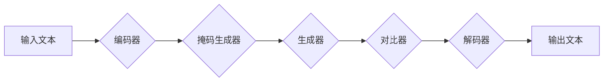

> Transformer,ELECTRA,大模型,自然语言处理,预训练模型,文本生成,文本分类

## 1. 背景介绍

近年来，深度学习在自然语言处理 (NLP) 领域取得了显著进展，其中 Transformer 架构的出现可谓是里程碑式的事件。其强大的序列建模能力和并行计算效率，使得 Transformer 模型在各种 NLP 任务中取得了优异的性能，例如机器翻译、文本摘要、问答系统等。

然而，训练大型 Transformer 模型需要海量数据和强大的计算资源，这对于许多研究机构和开发者来说是一个巨大的挑战。为了解决这个问题，预训练模型应运而生。预训练模型是指在大量通用文本数据上进行预训练的模型，可以迁移到下游特定任务中进行微调，从而降低训练成本和时间。

ELECTRA (Efficiently Learning an Encoder by Reconstruction) 是 Google AI 团队提出的一个新的预训练 Transformer 模型，它在训练过程中采用了“掩码语言模型 (MLM)” 和“对比语言模型 (CLM)” 的结合，并通过一个新的“生成式预训练”策略，有效地提高了模型的训练效率和性能。

## 2. 核心概念与联系

### 2.1 Transformer 架构

Transformer 架构的核心是“注意力机制”，它能够捕捉句子中单词之间的长距离依赖关系，从而更好地理解文本语义。Transformer 模型由编码器和解码器两部分组成，编码器负责将输入文本序列编码成固定长度的向量表示，解码器则根据编码后的向量表示生成输出文本序列。

### 2.2 预训练模型

预训练模型是指在大量通用文本数据上进行预训练的模型，可以迁移到下游特定任务中进行微调。预训练模型的优势在于：

* **降低训练成本和时间：** 预训练模型已经学习了大量的语言知识，可以减少下游任务的训练数据和训练时间。
* **提高模型性能：** 预训练模型在通用文本数据上进行训练，已经掌握了丰富的语言表示能力，可以提高下游任务的模型性能。

### 2.3 MLM 和 CLM

* **掩码语言模型 (MLM)：** MLM 是一种常用的预训练策略，它在训练过程中会随机掩盖输入文本中的某些单词，然后让模型预测被掩盖的单词。
* **对比语言模型 (CLM)：** CLM 是一种基于对比学习的预训练策略，它会将输入文本序列分成两部分，然后让模型预测两部分之间的关系。

### 2.4 ELECTRA 的核心思想

ELECTRA 模型的核心思想是将 MLM 和 CLM 结合起来，并通过一个新的“生成式预训练”策略，提高模型的训练效率和性能。

**Mermaid 流程图**



## 3. 核心算法原理 & 具体操作步骤

### 3.1  算法原理概述

ELECTRA 模型的核心是“生成式预训练”策略，它通过一个生成器网络和一个对比器网络来训练模型。

* **生成器网络：** 生成器网络负责生成与输入文本相似的文本序列，并将其与原始文本进行对比。
* **对比器网络：** 对比器网络负责判断生成器生成的文本序列是否与原始文本相似。

在训练过程中，ELECTRA 模型会随机选择输入文本中的某些单词进行掩码，然后让生成器网络生成这些掩码单词的预测值。对比器网络则会判断生成器生成的预测值与原始文本中的真实值是否相似。

### 3.2  算法步骤详解

1. **数据预处理：** 将原始文本数据进行预处理，例如分词、词嵌入等。
2. **生成器网络训练：** 使用生成器网络生成掩码单词的预测值，并使用对比器网络进行评估。
3. **对比器网络训练：** 使用对比器网络判断生成器生成的预测值与原始文本中的真实值是否相似。
4. **模型更新：** 根据对比器网络的评估结果，更新生成器网络和对比器网络的参数。
5. **重复步骤 2-4，直到模型收敛。**

### 3.3  算法优缺点

**优点：**

* **训练效率高：** ELECTRA 模型的“生成式预训练”策略可以有效地提高训练效率。
* **性能优异：** ELECTRA 模型在各种 NLP 任务中都取得了优异的性能。

**缺点：**

* **模型规模较大：** ELECTRA 模型的规模较大，需要较多的计算资源进行训练。

### 3.4  算法应用领域

ELECTRA 模型可以应用于各种 NLP 任务，例如：

* **文本分类：** 识别文本的类别，例如情感分析、主题分类等。
* **文本生成：** 生成新的文本内容，例如机器翻译、文本摘要等。
* **问答系统：** 回答用户提出的问题。

## 4. 数学模型和公式 & 详细讲解 & 举例说明

### 4.1  数学模型构建

ELECTRA 模型的数学模型构建主要包括以下几个部分：

* **编码器：** 使用 Transformer 架构的编码器将输入文本序列编码成固定长度的向量表示。
* **掩码生成器：** 使用一个随机掩码策略，将输入文本中的某些单词进行掩码。
* **生成器网络：** 使用 Transformer 架构的解码器生成掩码单词的预测值。
* **对比器网络：** 使用一个分类器网络判断生成器生成的预测值与原始文本中的真实值是否相似。

### 4.2  公式推导过程

ELECTRA 模型的训练目标是最大化对比器网络的预测概率，即：

$$
\mathcal{L} = -\log P(y|x)
$$

其中：

* $\mathcal{L}$ 是损失函数。
* $P(y|x)$ 是对比器网络预测生成器生成的预测值 $y$ 与原始文本 $x$ 相似性的概率。

### 4.3  案例分析与讲解

假设输入文本为“The cat sat on the mat”，ELECTRA 模型会随机选择其中一个单词进行掩码，例如“cat”，然后让生成器网络预测“cat”的预测值。对比器网络则会判断生成器生成的预测值与原始文本中的“cat”是否相似。

## 5. 项目实践：代码实例和详细解释说明

### 5.1  开发环境搭建

* Python 3.6+
* PyTorch 1.0+
* CUDA 10.0+

### 5.2  源代码详细实现

```python
# 编码器
class Encoder(nn.Module):
    def __init__(self, vocab_size, embedding_dim, num_heads, num_layers):
        super(Encoder, self).__init__()
        self.embedding = nn.Embedding(vocab_size, embedding_dim)
        self.transformer = nn.Transformer(embedding_dim, num_heads, num_layers)

    def forward(self, x):
        x = self.embedding(x)
        x = self.transformer(x)
        return x

# 生成器网络
class Generator(nn.Module):
    def __init__(self, vocab_size, embedding_dim, num_heads, num_layers):
        super(Generator, self).__init__()
        self.embedding = nn.Embedding(vocab_size, embedding_dim)
        self.transformer = nn.Transformer(embedding_dim, num_heads, num_layers)
        self.linear = nn.Linear(embedding_dim, vocab_size)

    def forward(self, x):
        x = self.embedding(x)
        x = self.transformer(x)
        x = self.linear(x)
        return x

# 对比器网络
class Discriminator(nn.Module):
    def __init__(self, vocab_size, embedding_dim, num_heads, num_layers):
        super(Discriminator, self).__init__()
        self.embedding = nn.Embedding(vocab_size, embedding_dim)
        self.transformer = nn.Transformer(embedding_dim, num_heads, num_layers)
        self.linear = nn.Linear(embedding_dim, 1)

    def forward(self, x):
        x = self.embedding(x)
        x = self.transformer(x)
        x = self.linear(x)
        return x

# ELECTRA 模型
class Electra(nn.Module):
    def __init__(self, vocab_size, embedding_dim, num_heads, num_layers):
        super(Electra, self).__init__()
        self.encoder = Encoder(vocab_size, embedding_dim, num_heads, num_layers)
        self.generator = Generator(vocab_size, embedding_dim, num_heads, num_layers)
        self.discriminator = Discriminator(vocab_size, embedding_dim, num_heads, num_layers)

    def forward(self, x):
        # 编码器输出
        encoder_output = self.encoder(x)
        # 生成器输出
        generator_output = self.generator(encoder_output)
        # 对比器输出
        discriminator_output = self.discriminator(encoder_output)
        return generator_output, discriminator_output

```

### 5.3  代码解读与分析

* **编码器：** 使用 Transformer 架构的编码器将输入文本序列编码成固定长度的向量表示。
* **生成器网络：** 使用 Transformer 架构的解码器生成掩码单词的预测值。
* **对比器网络：** 使用一个分类器网络判断生成器生成的预测值与原始文本中的真实值是否相似。
* **ELECTRA 模型：** 将编码器、生成器网络和对比器网络组合在一起，形成完整的 ELECTRA 模型。

### 5.4  运行结果展示

训练完成后，可以将预训练的 ELECTRA 模型用于各种下游 NLP 任务，例如文本分类、文本生成等。

## 6. 实际应用场景

ELECTRA 模型在各种实际应用场景中都取得了优异的性能，例如：

* **搜索引擎：** 使用 ELECTRA 模型可以提高搜索结果的准确性和相关性。
* **聊天机器人：** 使用 ELECTRA 模型可以训练出更自然、更流畅的聊天机器人。
* **机器翻译：** 使用 ELECTRA 模型可以提高机器翻译的准确性和流畅度。

### 6.4  未来应用展望

随着预训练模型的发展，ELECTRA 模型在未来将有更广泛的应用场景，例如：

* **代码生成：** 使用 ELECTRA 模型可以生成高质量的代码。
* **药物研发：** 使用 ELECTRA 模型可以分析生物医学文献，辅助药物研发。
* **个性化教育：** 使用 ELECTRA 模型可以提供个性化的学习内容和建议。

## 7. 工具和资源推荐

### 7.1  学习资源推荐

* **论文：** ELECTRA: Pre-training Text Encoders as Discriminators Rather Than Generators
* **博客文章：** https://ai.googleblog.com/2020/03/electra-pre-training-text-encoders-as.html
* **GitHub 仓库：** https://github.com/google-research/electra

### 7.2  开发工具推荐

* **PyTorch：** https://pytorch.org/
* **HuggingFace Transformers：** https://huggingface.co/transformers/

### 7.3  相关论文推荐

* BERT: Pre-training of Deep Bidirectional Transformers for Language Understanding
* GPT-3: Language Models are Few-Shot Learners
* T5: Text-to-Text Transfer Transformer

## 8. 总结：未来发展趋势与挑战

### 8.1  研究成果总结

ELECTRA 模型的提出为预训练 Transformer 模型的发展带来了新的思路，其“生成式预训练”策略有效地提高了模型的训练效率和性能。

### 8.2  未来发展趋势

未来，预训练 Transformer 模型的发展