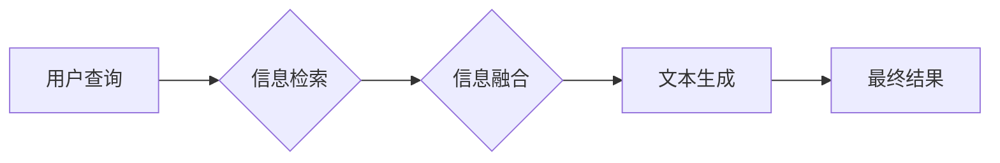

> RAG, LangChain, 检索式生成, 知识库, 语言模型, 应用程序

## 1. 背景介绍

近年来，大型语言模型（LLM）在自然语言处理领域取得了显著进展，展现出强大的文本生成、翻译、问答等能力。然而，LLM的知识储备主要依赖于训练数据，缺乏对外部知识的实时更新和访问能力。这限制了其在某些应用场景中的实用性，例如需要访问特定领域知识或最新信息的任务。

检索增强生成（Retrieval Augmented Generation，RAG）技术应运而生，旨在结合LLM的文本生成能力和外部知识库的丰富信息，从而提升模型的准确性、可靠性和知识更新能力。RAG技术通过检索相关信息，将外部知识融入到LLM的生成过程中，使模型能够访问更广泛、更准确的信息，并生成更符合用户需求的文本。

## 2. 核心概念与联系

RAG技术的核心概念包括：

* **语言模型（LLM）：** 能够理解和生成人类语言的深度学习模型，例如GPT-3、BERT等。
* **知识库（Knowledge Base）：** 存储着结构化或非结构化知识的数据库，例如维基百科、知识图谱等。
* **检索系统（Retrieval System）：** 用于从知识库中检索与用户查询相关的文档或信息。
* **融合模块（Fusion Module）：** 将检索到的信息与LLM的输出进行融合，生成最终的文本。

RAG技术的架构通常包括以下几个步骤：

1. **用户查询：** 用户提出一个问题或请求。
2. **信息检索：** 检索系统根据用户查询从知识库中检索相关信息。
3. **信息融合：** 融合模块将检索到的信息与LLM的输出进行融合，生成最终的文本。
4. **文本生成：** LLM根据融合后的信息生成最终的文本。



## 3. 核心算法原理 & 具体操作步骤

### 3.1  算法原理概述

RAG技术的核心算法原理是将外部知识融入到LLM的文本生成过程中。这可以通过多种方式实现，例如：

* **检索式生成：** 首先使用检索系统从知识库中检索与用户查询相关的文档，然后将这些文档作为输入，引导LLM生成文本。
* **知识注入：** 将知识库中的知识以结构化的形式注入到LLM的训练数据中，使模型能够在生成文本时访问和利用这些知识。
* **知识图谱嵌入：** 将知识图谱中的实体和关系嵌入到LLM的词嵌入空间中，使模型能够理解和利用知识图谱中的知识。

### 3.2  算法步骤详解

以检索式生成为例，RAG技术的具体操作步骤如下：

1. **用户输入：** 用户输入一个问题或请求。
2. **关键词提取：** 从用户输入中提取关键词，用于检索相关信息。
3. **信息检索：** 使用检索系统根据关键词从知识库中检索相关文档。
4. **文档摘要：** 对检索到的文档进行摘要，提取关键信息。
5. **信息融合：** 将文档摘要与用户输入和LLM的输出进行融合，生成最终的文本。
6. **文本生成：** LLM根据融合后的信息生成最终的文本。

### 3.3  算法优缺点

**优点：**

* 能够访问外部知识库，提升模型的知识储备和准确性。
* 能够实时更新知识，使模型能够适应最新的信息变化。
* 能够处理更复杂的任务，例如需要推理和解释的文本生成任务。

**缺点：**

* 需要构建和维护知识库，这需要一定的成本和时间投入。
* 检索系统和融合模块的设计需要考虑效率和准确性。
* 模型的性能仍然依赖于LLM的质量和训练数据。

### 3.4  算法应用领域

RAG技术在多个领域都有广泛的应用，例如：

* **问答系统：** RAG技术可以构建更智能、更准确的问答系统，能够回答更复杂的问题，并提供更丰富的答案。
* **搜索引擎：** RAG技术可以提升搜索引擎的准确性和相关性，提供更精准的搜索结果。
* **聊天机器人：** RAG技术可以使聊天机器人更具知识性和对话能力，能够进行更自然、更流畅的对话。
* **内容创作：** RAG技术可以帮助作家、记者等内容创作者获取更多信息，提高创作效率和质量。

## 4. 数学模型和公式 & 详细讲解 & 举例说明

### 4.1  数学模型构建

RAG技术的数学模型通常基于信息检索和文本生成两个方面。

**信息检索方面：**

常用的信息检索模型包括TF-IDF、BM25等。这些模型通过计算文档中关键词的频率和重要性，来评估文档与查询的相关性。

**文本生成方面：**

常用的文本生成模型包括Transformer、GPT等。这些模型使用注意力机制和循环神经网络，学习语言的语法和语义，生成流畅、自然的文本。

### 4.2  公式推导过程

**TF-IDF公式：**

```latex
TF-IDF(t, d) = TF(t, d) * IDF(t)
```

其中：

* $TF(t, d)$ 表示词语 $t$ 在文档 $d$ 中的词频。
* $IDF(t)$ 表示词语 $t$ 在整个语料库中的逆向文档频率。

**BM25公式：**

```latex
BM25(t, d) = \frac{(k_1 + 1) * TF(t, d)}{(TF(t, d) + k_1 * (1 - b + b * \frac{length(d)}{average\_length}))} * IDF(t)
```

其中：

* $k_1$ 和 $b$ 是BM25模型的参数。
* $length(d)$ 是文档 $d$ 的长度。
* $average\_length$ 是语料库中文档的平均长度。

### 4.3  案例分析与讲解

假设我们有一个知识库包含关于动物的知识，用户查询“猫的特征”。

1. **关键词提取：** 提取关键词“猫”和“特征”。
2. **信息检索：** 使用TF-IDF或BM25模型从知识库中检索与“猫”和“特征”相关的文档。
3. **文档摘要：** 对检索到的文档进行摘要，提取关于猫的特征信息，例如“猫有四条腿、毛发、尖耳朵和长尾巴”。
4. **信息融合：** 将文档摘要与用户输入“猫的特征”和LLM的输出进行融合，生成最终的文本，例如“猫是一种哺乳动物，具有四条腿、毛发、尖耳朵和长尾巴”。

## 5. 项目实践：代码实例和详细解释说明

### 5.1  开发环境搭建

* Python 3.7+
* LangChain 0.0.20+
* OpenAI API key
* 其他依赖库：transformers, faiss-cpu

### 5.2  源代码详细实现

```python
from langchain.chains import RetrievalQA
from langchain.llms import OpenAI
from langchain.document_loaders import TextLoader
from langchain.vectorstores import FAISS
from langchain.embeddings import OpenAIEmbeddings

# 1. 加载知识库
documents = TextLoader("knowledge_base.txt").load()

# 2. 生成向量嵌入
embeddings = OpenAIEmbeddings()
vectorstore = FAISS.from_documents(documents, embeddings)

# 3. 初始化语言模型
llm = OpenAI(temperature=0)

# 4. 创建检索式问答链
qa_chain = RetrievalQA.from_chain_type(llm=llm, chain_type="stuff", retriever=vectorstore.as_retriever())

# 5. 进行问答
query = "猫的特征是什么？"
answer = qa_chain.run(query)
print(answer)
```

### 5.3  代码解读与分析

* 代码首先加载知识库文件，并使用TextLoader将其转换为文档对象。
* 然后，使用OpenAIEmbeddings生成文档的向量嵌入，并将其存储在FAISS向量库中。
* 接着，初始化OpenAI语言模型，并创建RetrievalQA问答链。
* 最后，使用问答链运行用户查询，并打印答案。

### 5.4  运行结果展示

```
猫是一种哺乳动物，具有四条腿、毛发、尖耳朵和长尾巴。
```

## 6. 实际应用场景

### 6.1  智能客服

RAG技术可以用于构建智能客服系统，使客服机器人能够访问公司知识库，回答客户常见问题，提高服务效率和客户满意度。

### 6.2  个性化教育

RAG技术可以用于构建个性化教育系统，根据学生的学习进度和需求，从知识库中检索相关学习资源，提供个性化的学习建议和辅导。

### 6.3  法律研究

RAG技术可以用于法律研究，帮助律师从法律法规数据库中检索相关案例和法律条文，进行法律分析和研究。

### 6.4  未来应用展望

RAG技术的应用前景广阔，未来可能在更多领域得到应用，例如：

* **医疗诊断：** RAG技术可以帮助医生从医学文献数据库中检索相关病例和诊断信息，提高诊断准确率。
* **金融分析：** RAG技术可以帮助金融分析师从市场数据和财务报表数据库中检索相关信息，进行风险评估和投资决策。
* **科学研究：** RAG技术可以帮助科学家从学术论文数据库中检索相关研究成果，加速科学发现。

## 7. 工具和资源推荐

### 7.1  学习资源推荐

* **LangChain官方文档：** https://python.langchain.com/docs/
* **OpenAI API文档：** https://platform.openai.com/docs/api-reference
* **FAISS官方文档：** https://github.com/facebookresearch/faiss

### 7.2  开发工具推荐

* **Python：** https://www.python.org/
* **Jupyter Notebook：** https://jupyter.org/

### 7.3  相关论文推荐

* **Retrieval Augmented Generation for Question Answering:** https://arxiv.org/abs/2109.09611
* **RAG: A Survey of Retrieval Augmented Generation:** https://arxiv.org/abs/2204.05377

## 8. 总结：未来发展趋势与挑战

### 8.1  研究成果总结

RAG技术在近年来取得了显著进展，能够有效地结合LLM的文本生成能力和外部知识库的丰富信息，提升模型的准确性、可靠性和知识更新能力。

### 8.2  未来发展趋势

* **更强大的检索系统：** 研究更先进的检索算法和模型，提高检索效率和准确性。
* **更有效的融合模块：** 研究更有效的融合算法，更好地将检索到的信息与LLM的输出进行融合。
* **多模态RAG：** 将图像、音频等多模态信息融入到RAG系统中，构建更全面的知识表示和理解能力。

### 8.3  面临的挑战

* **知识库的构建和维护：** 构建高质量的知识库需要大量的资源和时间投入。
* **模型的训练和部署：** RAG系统的训练和部署需要强大的计算资源和技术支持。
* **伦理和安全问题：** RAG系统可能存在偏见、误导和安全风险，需要进行充分的伦理和安全评估。

### 8.4  研究展望

未来，RAG技术将继续朝着更智能、更可靠、更安全的方向发展，在更多领域发挥重要作用。


## 9. 附录：常见问题与解答

**Q1：RAG技术与传统问答系统的区别是什么？**

**A1：** 传统问答系统通常依赖于规则或模板匹配，而RAG