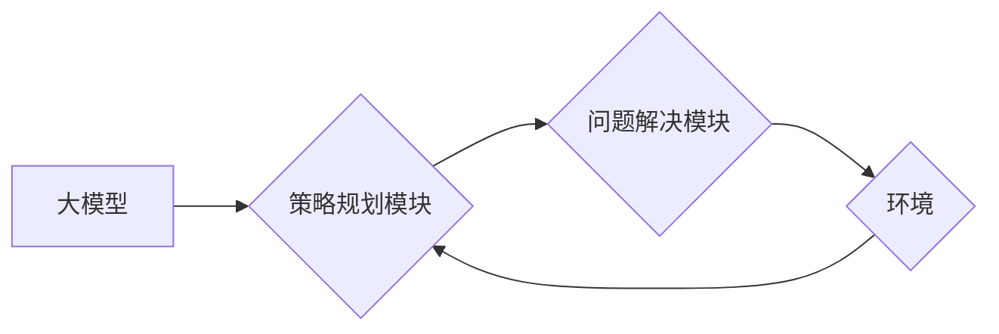

> 大模型、AI Agent、Plan-and-Solve、策略规划、问题解决、应用开发

## 1. 背景介绍

近年来，大模型技术取得了飞速发展，其强大的泛化能力和知识表示能力为人工智能领域带来了革命性的变革。大模型的应用场景也日益广泛，涵盖了自然语言处理、计算机视觉、语音识别等多个领域。然而，将大模型应用于实际场景中，仍然面临着一些挑战。

传统的基于规则的AI Agent，虽然能够解决特定领域的特定问题，但缺乏灵活性，难以应对复杂、多变的现实世界。而基于深度学习的大模型，虽然能够学习复杂的模式和关系，但缺乏明确的决策逻辑和规划能力，难以进行高层次的推理和决策。

为了解决这些问题，我们提出了Plan-and-Solve策略，旨在将大模型与策略规划相结合，构建能够自主学习、规划和解决复杂问题的AI Agent。

## 2. 核心概念与联系

Plan-and-Solve策略的核心思想是将问题分解为多个子问题，并通过策略规划和问题解决两个阶段来完成。

**2.1 策略规划阶段**

在这个阶段，AI Agent会根据当前状态和目标，制定一个行动计划，即策略。策略可以是序列化的动作，也可以是更抽象的决策规则。

**2.2 问题解决阶段**

在这个阶段，AI Agent会根据策略执行相应的动作，并根据环境反馈进行调整。

**2.3 核心架构**



**2.4 核心概念联系**

* **大模型:** 提供强大的知识表示和推理能力，用于理解问题和生成解决方案。
* **策略规划模块:** 利用搜索算法、强化学习等方法，根据目标和环境状态，制定行动计划。
* **问题解决模块:** 根据策略执行动作，并根据环境反馈进行调整。
* **环境:** AI Agent所处的外部世界，提供反馈和影响AI Agent行为。

## 3. 核心算法原理 & 具体操作步骤

### 3.1  算法原理概述

Plan-and-Solve策略的核心算法是基于搜索的策略规划算法，例如A*算法、IDA*算法等。这些算法通过评估节点的成本和估算目标节点的距离，选择最优路径，从而生成策略。

### 3.2  算法步骤详解

1. **状态表示:** 将问题环境的状态表示为一个数据结构，例如状态空间图、状态向量等。
2. **目标定义:** 明确AI Agent的目标，例如到达某个位置、完成某个任务等。
3. **动作定义:** 定义AI Agent可以执行的动作，例如移动、交互、决策等。
4. **成本函数:** 定义动作执行的成本，例如时间、资源、能量等。
5. **估算函数:** 定义从当前状态到目标状态的估算距离，例如曼哈顿距离、欧氏距离等。
6. **搜索算法:** 使用搜索算法，例如A*算法、IDA*算法等，从当前状态出发，搜索到目标状态的路径。
7. **策略生成:** 将搜索到的路径转换为AI Agent可以执行的动作序列，即策略。

### 3.3  算法优缺点

**优点:**

* 能够解决复杂、多变的现实世界问题。
* 具有较强的可扩展性和适应性。

**缺点:**

* 计算复杂度较高，可能需要大量的计算资源。
* 依赖于准确的成本函数和估算函数。

### 3.4  算法应用领域

Plan-and-Solve策略可以应用于各种领域，例如：

* **机器人导航:** 规划机器人从起点到终点的路径。
* **游戏AI:** 规划游戏角色的行动策略。
* **自动驾驶:** 规划车辆的驾驶路线。
* **医疗诊断:** 规划医生诊断患者的步骤。

## 4. 数学模型和公式 & 详细讲解 & 举例说明

### 4.1  数学模型构建

Plan-and-Solve策略可以抽象为一个状态空间搜索问题。

* **状态空间:** 所有可能的系统状态的集合。
* **初始状态:** 系统当前的状态。
* **目标状态:** 系统期望达到的状态。
* **动作:** 从一个状态到另一个状态的转换操作。
* **成本函数:** 描述动作执行的代价。

### 4.2  公式推导过程

A*算法是一种常用的搜索算法，其核心思想是利用估算函数来优先搜索最有可能到达目标状态的路径。

A*算法的公式如下：

$$f(n) = g(n) + h(n)$$

其中：

* $f(n)$: 节点 $n$ 的总代价，即从初始状态到节点 $n$ 的路径成本加上从节点 $n$ 到目标状态的估算距离。
* $g(n)$: 从初始状态到节点 $n$ 的实际路径成本。
* $h(n)$: 从节点 $n$ 到目标状态的估算距离。

### 4.3  案例分析与讲解

假设我们有一个机器人需要从起点到终点，环境是一个简单的迷宫。

* 状态空间: 迷宫中的所有格子。
* 初始状态: 机器人所在的位置。
* 目标状态: 终点位置。
* 动作: 向上、向下、向左、向右移动。
* 成本函数: 每移动一个格子，成本为1。
* 估算函数: 曼哈顿距离。

A*算法可以根据上述信息，搜索出机器人从起点到终点的最优路径。

## 5. 项目实践：代码实例和详细解释说明

### 5.1  开发环境搭建

* Python 3.x
* TensorFlow/PyTorch 等深度学习框架
* ROS 等机器人操作系统

### 5.2  源代码详细实现

```python
# 策略规划模块
def plan(state, goal):
    # 使用A*算法搜索最优路径
    path = astar(state, goal)
    return path

# 问题解决模块
def solve(path):
    # 根据路径执行动作
    for action in path:
        # 执行动作
        # 获取环境反馈
        # 更新状态

# 环境模拟
class Environment:
    # ...

# 主程序
if __name__ == "__main__":
    # 初始化环境
    env = Environment()
    # 获取初始状态
    state = env.get_current_state()
    # 设置目标状态
    goal = env.get_goal_state()
    # 规划策略
    path = plan(state, goal)
    # 解决问题
    solve(path)
```

### 5.3  代码解读与分析

* 策略规划模块使用A*算法搜索最优路径。
* 问题解决模块根据路径执行动作，并根据环境反馈进行调整。
* 环境模拟模块提供环境状态和反馈。

### 5.4  运行结果展示

运行结果将显示AI Agent从起点到终点的路径，以及执行的动作序列。

## 6. 实际应用场景

Plan-and-Solve策略可以应用于各种实际场景，例如：

* **机器人导航:** 规划机器人从起点到终点的路径，避开障碍物。
* **游戏AI:** 规划游戏角色的行动策略，例如在游戏中完成任务、击败对手。
* **自动驾驶:** 规划车辆的驾驶路线，避开障碍物、遵守交通规则。
* **医疗诊断:** 规划医生诊断患者的步骤，例如根据患者症状、检查结果等信息，制定诊断方案。

### 6.4  未来应用展望

随着大模型技术的不断发展，Plan-and-Solve策略的应用场景将更加广泛。例如，可以应用于：

* **个性化教育:** 根据学生的学习情况，制定个性化的学习计划。
* **智能客服:** 理解用户的需求，并提供个性化的服务。
* **科学研究:** 自动化科学实验，加速科学发现。

## 7. 工具和资源推荐

### 7.1  学习资源推荐

* **书籍:**
    * 《人工智能：现代方法》
    * 《机器学习》
    * 《深度学习》
* **在线课程:**
    * Coursera
    * edX
    * Udacity

### 7.2  开发工具推荐

* **Python:** 
* **TensorFlow/PyTorch:** 深度学习框架
* **ROS:** 机器人操作系统

### 7.3  相关论文推荐

* **A* Search Algorithm:** https://en.wikipedia.org/wiki/A*_search_algorithm
* **Deep Reinforcement Learning:** https://arxiv.org/abs/1602.06762

## 8. 总结：未来发展趋势与挑战

### 8.1  研究成果总结

Plan-and-Solve策略为将大模型应用于实际场景提供了新的思路，并取得了一定的成果。

### 8.2  未来发展趋势

* **模型融合:** 将大模型与其他人工智能技术，例如强化学习、知识图谱等，进行融合，提升AI Agent的智能水平。
* **场景化定制:** 根据不同的应用场景，定制化Plan-and-Solve策略，提高其效率和准确性。
* **可解释性增强:** 提升Plan-and-Solve策略的可解释性，使AI Agent的行为更加透明和可控。

### 8.3  面临的挑战

* **计算复杂度:** Plan-and-Solve策略的计算复杂度较高，需要更高效的算法和计算资源。
* **数据依赖:** Plan-and-Solve策略需要大量的训练数据，数据质量和数量直接影响其性能。
* **安全可靠性:** AI Agent的决策需要安全可靠，避免出现意外情况。

### 8.4  研究展望

未来，我们将继续研究Plan-and-Solve策略，探索其在更多领域中的应用，并致力于解决其面临的挑战，推动AI技术的发展。

## 9. 附录：常见问题与解答

* **Q1: Plan-and-Solve策略与其他AI Agent架构有什么区别？**

* **A1:** Plan-and-Solve策略与其他AI Agent架构的区别在于，它将策略规划和问题解决两个阶段结合在一起，能够解决更复杂、更灵活的问题。

* **Q2: Plan-and-Solve策略的计算复杂度如何降低？**

* **A2:** 可以通过使用更有效的搜索算法、优化成本函数和估算函数等方法，降低Plan-and-Solve策略的计算复杂度。

* **Q3: Plan-and-Solve策略如何保证安全可靠性？**

* **A3:** 可以通过使用安全可靠的算法、进行严格的测试和验证、建立安全机制等方法，保证Plan-and-Solve策略的安全可靠性。


作者：禅与计算机程序设计艺术 / Zen and the Art of Computer Programming 
<end_of_turn>