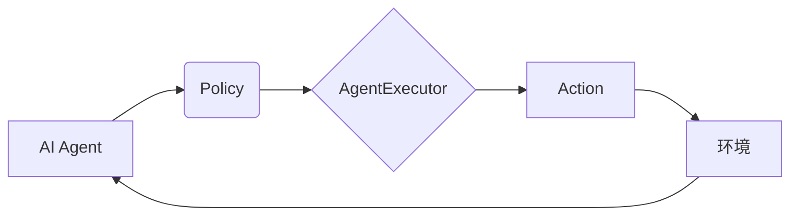

> 大模型、AI Agent、AgentExecutor、运行机制、应用开发、实践案例

## 1. 背景介绍

近年来，大模型技术蓬勃发展，其强大的语言理解和生成能力为人工智能应用的创新提供了无限可能。其中，AI Agent作为一种智能化的软件实体，能够自主地感知环境、制定决策并执行行动，在各个领域展现出巨大的应用潜力。

AgentExecutor作为AI Agent的核心执行引擎，负责将Agent的决策转化为实际操作，是实现AI Agent功能的关键组件。深入理解AgentExecutor的运行机制，对于开发高效、可靠的AI Agent至关重要。

本篇文章将深入探讨AgentExecutor的运行机制，从核心概念、算法原理到实际应用场景，全面解析其工作原理，并结合代码实例和实践案例，帮助读者更好地理解和应用AgentExecutor。

## 2. 核心概念与联系

**2.1 核心概念**

* **AI Agent:**  一种能够感知环境、制定决策并执行行动的智能化软件实体。
* **AgentExecutor:**  负责执行AI Agent决策的引擎，将Agent的指令转化为实际操作。
* **Action:**  Agent执行的具体操作，例如发送消息、访问数据库、控制设备等。
* **State:**  Agent当前的环境状态，包括感知到的信息和系统变量。
* **Policy:**  Agent根据状态做出决策的策略，通常由机器学习模型训练得到。

**2.2 架构关系**



**2.3 核心联系**

AI Agent通过感知环境获取状态信息，根据策略选择相应的Action，AgentExecutor负责执行Action，并将结果反馈给AI Agent，从而完成一个完整的交互循环。

## 3. 核心算法原理 & 具体操作步骤

**3.1 算法原理概述**

AgentExecutor的核心算法通常基于状态机或事件驱动模型。

* **状态机模型:** 将Agent的行为划分为不同的状态，每个状态对应特定的动作和状态转换规则。AgentExecutor根据当前状态和输入事件，选择相应的动作并更新状态。
* **事件驱动模型:**  AgentExecutor监听环境事件，当接收到特定事件时，根据预定义的规则执行相应的动作。

**3.2 算法步骤详解**

1. **初始化:** AgentExecutor初始化状态变量，并注册事件监听器。
2. **事件处理:**  AgentExecutor监听环境事件，当接收到事件时，根据事件类型和状态信息，选择相应的动作。
3. **动作执行:** AgentExecutor执行选定的动作，例如发送消息、访问数据库、控制设备等。
4. **状态更新:**  AgentExecutor根据动作执行结果更新状态变量，并通知AI Agent状态变化。

**3.3 算法优缺点**

* **优点:**  易于理解和实现，能够处理简单的交互场景。
* **缺点:**  难以处理复杂、动态的环境，状态转换规则难以维护。

**3.4 算法应用领域**

* **聊天机器人:**  根据用户输入处理对话，并生成相应的回复。
* **自动化测试:**  根据测试用例执行自动化测试脚本。
* **智能家居:**  根据用户指令控制智能设备。

## 4. 数学模型和公式 & 详细讲解 & 举例说明

**4.1 数学模型构建**

AgentExecutor的运行机制可以抽象为一个状态转移模型，其中状态表示Agent的当前状态，动作表示Agent可以执行的操作，转移函数表示状态转移规则。

**状态:**  S = {s1, s2, ..., sn}

**动作:**  A = {a1, a2, ..., am}

**转移函数:**  T: S x A -> S

**4.2 公式推导过程**

状态转移公式:

```latex
s_{t+1} = T(s_t, a_t)
```

其中:

*  $s_t$ 表示Agent在时间t的当前状态。
*  $a_t$ 表示Agent在时间t执行的动作。
*  $s_{t+1}$ 表示Agent在时间t+1的状态。

**4.3 案例分析与讲解**

例如，一个简单的聊天机器人Agent，其状态可以表示为对话主题，动作可以表示为回复类型。

* 状态:  S = {天气, 娱乐, 购物}
* 动作:  A = {问候, 提供信息, 转移话题}

当用户输入“今天天气怎么样？”时，Agent的当前状态为“天气”，根据策略选择动作“提供信息”，并返回天气预报信息。

## 5. 项目实践：代码实例和详细解释说明

**5.1 开发环境搭建**

* Python 3.7+
* TensorFlow/PyTorch
* NLTK/SpaCy

**5.2 源代码详细实现**

```python
class AgentExecutor:
    def __init__(self, policy):
        self.policy = policy
        self.state = None

    def set_state(self, state):
        self.state = state

    def execute_action(self, action):
        # 执行动作，例如发送消息、访问数据库等
        print(f"执行动作: {action}")

    def get_next_action(self):
        # 根据策略和当前状态选择动作
        action = self.policy.get_action(self.state)
        return action
```

**5.3 代码解读与分析**

* `AgentExecutor`类负责执行Agent的决策。
* `policy`属性存储Agent的策略模型。
* `set_state`方法设置Agent的当前状态。
* `execute_action`方法执行选定的动作。
* `get_next_action`方法根据策略和当前状态选择动作。

**5.4 运行结果展示**

```
# 设置初始状态
executor.set_state("天气")

# 获取下一个动作
action = executor.get_next_action()

# 执行动作
executor.execute_action(action)
```

## 6. 实际应用场景

**6.1 智能客服**

AgentExecutor可以用于构建智能客服系统，根据用户的咨询内容，选择相应的回复，并提供个性化的服务。

**6.2 自动化测试**

AgentExecutor可以用于自动化测试，根据测试用例执行测试脚本，并生成测试报告。

**6.3 智能家居**

AgentExecutor可以用于控制智能家居设备，根据用户的指令，控制灯光、温度、窗帘等设备。

**6.4 未来应用展望**

随着大模型技术的不断发展，AgentExecutor的应用场景将更加广泛，例如：

* **个性化教育:**  根据学生的学习情况，提供个性化的学习方案和辅导。
* **医疗诊断:**  辅助医生进行疾病诊断，提高诊断准确率。
* **金融理财:**  根据用户的风险偏好和财务状况，提供个性化的理财建议。

## 7. 工具和资源推荐

**7.1 学习资源推荐**

* **书籍:**
    * 《Reinforcement Learning: An Introduction》
    * 《Artificial Intelligence: A Modern Approach》
* **在线课程:**
    * Coursera: Reinforcement Learning Specialization
    * Udacity: Artificial Intelligence Nanodegree

**7.2 开发工具推荐**

* **TensorFlow:**  开源深度学习框架
* **PyTorch:**  开源深度学习框架
* **NLTK:**  自然语言处理工具包
* **SpaCy:**  自然语言处理工具包

**7.3 相关论文推荐**

* **Deep Reinforcement Learning with Double Q-learning**
* **Proximal Policy Optimization Algorithms**
* **Asynchronous Methods for Deep Reinforcement Learning**

## 8. 总结：未来发展趋势与挑战

**8.1 研究成果总结**

AgentExecutor的运行机制研究取得了显著进展，从状态机模型到深度强化学习模型，AgentExecutor的性能和应用场景不断扩展。

**8.2 未来发展趋势**

* **模型复杂度提升:**  利用更复杂的深度学习模型，提高AgentExecutor的决策能力和适应性。
* **多模态交互:**  支持多模态交互，例如文本、图像、语音等，使AgentExecutor能够更好地理解和响应用户的需求。
* **联邦学习:**  利用联邦学习技术，训练更加安全、隐私保护的AgentExecutor模型。

**8.3 面临的挑战**

* **数据获取和标注:**  训练高性能的AgentExecutor模型需要大量的标注数据，数据获取和标注成本较高。
* **模型解释性和可解释性:**  深度学习模型的决策过程难以解释，如何提高AgentExecutor的透明度和可解释性是一个重要的挑战。
* **安全性和可靠性:**  AgentExecutor在实际应用中需要保证安全性和可靠性，防止恶意攻击和意外错误。

**8.4 研究展望**

未来，AgentExecutor的研究将继续朝着更智能、更安全、更可靠的方向发展，为人工智能的广泛应用提供坚实的基础。

## 9. 附录：常见问题与解答

**9.1 如何选择合适的AgentExecutor模型？**

选择合适的AgentExecutor模型需要根据具体的应用场景和需求进行评估。例如，对于简单的对话系统，可以使用基于状态机的AgentExecutor模型；而对于复杂的决策任务，则需要使用基于深度强化学习的AgentExecutor模型。

**9.2 如何训练AgentExecutor模型？**

训练AgentExecutor模型需要使用大量的标注数据，并利用深度学习框架进行训练。具体的训练方法和参数设置需要根据模型类型和应用场景进行调整。

**9.3 如何评估AgentExecutor模型的性能？**

评估AgentExecutor模型的性能可以使用各种指标，例如准确率、召回率、F1-score等。具体的评估指标需要根据应用场景和任务目标进行选择。


作者：禅与计算机程序设计艺术 / Zen and the Art of Computer Programming 
<end_of_turn>