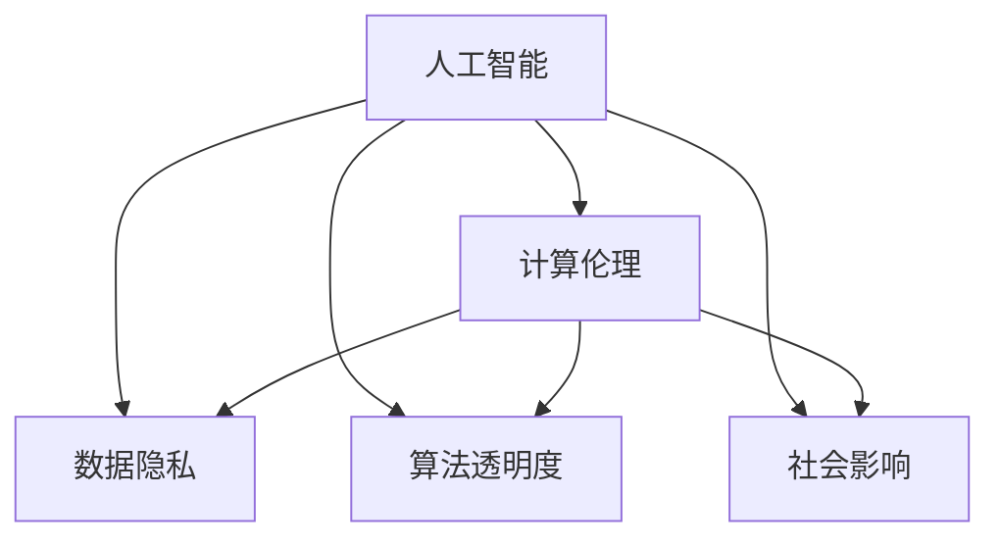

                 

# AI时代的人类计算：道德考虑

> 关键词：人工智能,计算伦理,数据隐私,算法透明度,社会影响

## 1. 背景介绍

在人工智能(AI)技术迅猛发展的今天，人类计算的能力得到了前所未有的提升。机器学习、深度学习、自然语言处理等技术的突破，使得AI系统在医疗、金融、教育、智能家居等多个领域展现出广泛的应用前景。然而，技术的进步并未完全同步带来伦理道德的审视，AI系统的决策过程、数据隐私、算法透明度等议题逐渐成为社会关注的焦点。

本文旨在探讨AI时代人类计算面临的道德挑战，分析AI系统的决策机制、数据伦理、透明度以及其对社会的影响，并提出相关的应对策略。我们将在结构紧凑的框架下，用逻辑清晰、专业、易懂的技术语言深入探讨这些关键议题，以期为AI技术的负责任发展提供参考。

## 2. 核心概念与联系

### 2.1 核心概念概述

为了更好地理解AI系统在道德层面的考量，本节将介绍几个核心概念：

- **人工智能(AI)**：指通过模拟人类智能行为，使机器能够自主学习、推理、决策等的能力。涵盖机器学习、深度学习、强化学习等多种技术。
- **计算伦理**：研究AI系统的设计、开发、应用过程中的伦理道德问题，包括数据隐私、算法透明度、社会影响等方面。
- **数据隐私**：涉及个人数据的收集、存储、使用和分享过程中的隐私保护，以防止个人信息泄露和滥用。
- **算法透明度**：指AI系统决策过程的可解释性和可追溯性，确保用户和相关方能够理解并信任AI系统的决策。
- **社会影响**：AI系统对社会结构、经济、就业、文化等方面的影响，包括正面效应和潜在的负面影响。

这些核心概念之间的逻辑关系可以通过以下Mermaid流程图来展示：



这个流程图展示了几大核心概念及其之间的关系：

1. AI系统的设计和应用不可避免地涉及伦理道德问题。
2. 数据隐私是AI系统面临的重要伦理问题，需确保用户数据的安全。
3. 算法的透明度是AI系统可信度的关键，确保用户理解系统决策。
4. AI系统对社会的广泛影响需要全面审视，防止潜在风险。

## 3. 核心算法原理 & 具体操作步骤

### 3.1 算法原理概述

AI系统的道德考量贯穿其设计、训练和应用的每一个环节。以下是主要算法的道德考量：

**训练算法**：
1. **数据选择**：确保数据来源的合法性和公正性，避免数据偏见。
2. **隐私保护**：采用数据去标识化、差分隐私等技术，防止数据泄露和滥用。

**推理算法**：
1. **决策透明度**：通过可解释模型或可解释输出，增强AI决策的可信度。
2. **公平性考量**：确保AI系统在决策过程中不对特定群体产生歧视。

**部署算法**：
1. **隐私保护**：在AI系统部署时，需采取隐私保护措施，如数据加密、访问控制等。
2. **社会影响评估**：评估AI系统对社会的潜在影响，如就业替代、社会不平等等。

### 3.2 算法步骤详解

1. **数据收集与处理**：
   - **合法合规**：确保数据来源合法，遵循相关隐私保护法规。
   - **数据清洗**：处理数据中的噪声和偏见，确保数据质量。
   - **匿名化**：采用差分隐私等技术，去除数据中的个人标识信息。

2. **模型训练**：
   - **公平性约束**：在模型训练过程中，引入公平性约束，防止算法偏见。
   - **隐私保护**：采用联邦学习等技术，在本地设备上进行模型训练，保护用户隐私。

3. **模型推理与评估**：
   - **透明度提升**：通过可解释模型或模型解释工具，提升AI决策的可信度。
   - **影响评估**：进行社会影响评估，了解AI系统的潜在影响。

4. **系统部署与监控**：
   - **隐私保护**：部署时采取隐私保护措施，确保数据安全。
   - **持续监控**：建立监控机制，及时发现并纠正AI系统的偏差和错误。

### 3.3 算法优缺点

AI系统的道德考量具有以下优点：

1. **提升可信度**：通过确保数据隐私和算法透明度，提升AI系统的可信度，增强用户信任。
2. **预防偏见**：通过引入公平性约束，预防算法偏见，确保AI系统公平、公正。
3. **社会责任**：通过评估社会影响，确保AI系统的应用符合社会责任和伦理要求。

同时，该方法也存在以下局限性：

1. **数据依赖性强**：AI系统的性能高度依赖于训练数据的质量和数量，数据不足可能导致性能下降。
2. **透明度有限**：即使采用可解释模型，复杂算法仍难以完全解释，存在一定的不可解释性。
3. **偏见难以彻底消除**：即便在训练过程中引入公平性约束，系统仍可能通过泛化学习形成新的偏见。

尽管存在这些局限性，但通过持续优化和改进，我们仍可以最大化地发挥AI系统的道德考量，促进其负责任的发展。

### 3.4 算法应用领域

AI系统的道德考量在多个领域都有重要的应用：

1. **医疗健康**：确保患者数据的隐私和安全，避免医疗决策中的偏见，提升医疗服务的公平性。
2. **金融服务**：保护客户隐私，确保金融决策的透明和公正，避免算法偏见导致的歧视。
3. **教育领域**：确保学生数据的隐私，提升教育系统的公平性，防止算法偏见影响教育机会。
4. **公共安全**：确保监控数据的隐私和安全，防止滥用，确保AI系统在公共安全中的公正性。
5. **智能家居**：保护用户隐私，确保智能家居系统的安全性和可靠性。

## 4. 数学模型和公式 & 详细讲解 & 举例说明

### 4.1 数学模型构建

在AI系统的道德考量中，我们主要关注以下几方面的数学模型：

1. **数据隐私保护**：通过差分隐私技术，引入噪声保护用户隐私。
2. **公平性约束**：通过公平性损失函数，确保模型在不同群体中的表现一致。
3. **算法透明度**：通过可解释模型，如决策树、线性回归等，提升决策的可解释性。

### 4.2 公式推导过程

以下是几个核心数学公式的推导过程：

**差分隐私公式**：
\[
\begin{aligned}
\epsilon-\text{DP} & = \sup_{S} \left| P_{Q \sim \mathcal{D}} \left[Q(S) \right] - P_{Q \sim \mathcal{D}^{\epsilon}} \left[Q(S) \right] \right| \\
& = \sup_{S} \left| P_{Q \sim \mathcal{D}} \left[Q(S) \right] - \frac{e^{-\epsilon}}{1 - e^{-\epsilon}} \sum_{x \in S} Q(x) \right| \\
& \leq \sup_{S} \left| \frac{e^{-\epsilon}}{1 - e^{-\epsilon}} \sum_{x \in S} |Q(x) - Q(x)_{exact}| \right|
\end{aligned}
\]

**公平性约束公式**：
\[
\begin{aligned}
L_{\text{fair}}(\theta) &= \frac{1}{N} \sum_{i=1}^N \left[ y_i \log p(y_i|x_i;\theta) + (1 - y_i) \log (1 - p(y_i|x_i;\theta)) \right] \\
& \quad - \lambda \sum_{i=1}^N \log \left( \frac{p(y_i|x_i;\theta)}{1 - p(y_i|x_i;\theta)} \right)
\end{aligned}
\]

其中，$y_i$ 为类别标签，$x_i$ 为特征向量，$\theta$ 为模型参数，$\lambda$ 为公平性惩罚系数。

**可解释模型公式**：
以决策树为例，其公式如下：
\[
p(y_i|x_i) = \frac{\sum_{j=1}^n p(y_i|x_i;T_j)}{\sum_{j=1}^n p(y_i|x_i;T_j)}
\]

其中，$T_j$ 为决策树的节点，$n$ 为节点数。

### 4.3 案例分析与讲解

**案例分析：医疗数据隐私保护**
假设某医疗机构收集了患者的医疗记录，并希望利用这些数据训练一个AI模型进行疾病预测。为了保护患者隐私，可以采用差分隐私技术，在模型训练过程中引入噪声。具体而言，可以将患者的医疗记录进行匿名化处理，并使用差分隐私算法计算模型参数。这样，即使在模型参数被泄露的情况下，也无法反向推断出患者的隐私信息。

## 5. 项目实践：代码实例和详细解释说明

### 5.1 开发环境搭建

在进行AI系统开发时，需要搭建合适的开发环境。以下是使用Python和PyTorch搭建开发环境的示例：

1. **安装Anaconda**：
```bash
conda create -n ai-env python=3.8
conda activate ai-env
```

2. **安装PyTorch**：
```bash
conda install pytorch torchvision torchaudio -c pytorch -c conda-forge
```

3. **安装相关库**：
```bash
pip install numpy pandas scikit-learn torchmetrics matplotlib
```

### 5.2 源代码详细实现

以下是一个使用差分隐私技术保护患者隐私的Python代码示例：

```python
import torch
from torch.utils.data import Dataset, DataLoader
from torch.distributions import Laplace

class MedicalDataset(Dataset):
    def __init__(self, data, labels):
        self.data = data
        self.labels = labels
        self.n_samples = len(data)
        self.laplace_noise = Laplace(0., 1. / 0.1)  # 差分隐私参数，噪声方差为1/epsilon^2

    def __getitem__(self, index):
        x, y = self.data[index], self.labels[index]
        noise = self.laplace_noise.sample([self.n_samples])
        return x, (y + noise).numpy()

    def __len__(self):
        return self.n_samples

# 数据加载和差分隐私保护
data = ...  # 医疗数据
labels = ...  # 疾病标签
dataset = MedicalDataset(data, labels)
dataloader = DataLoader(dataset, batch_size=64)

# 定义模型和优化器
model = ...
optimizer = ...

# 差分隐私保护训练循环
epsilon = 0.1  # 差分隐私参数
losses = []
for epoch in range(10):
    total_loss = 0
    for x, y in dataloader:
        x, y = torch.tensor(x), torch.tensor(y)
        optimizer.zero_grad()
        output = model(x)
        loss = loss_function(output, y)
        loss = loss + 0.5 * epsilon * loss / model.get_total_num_features()
        loss.backward()
        optimizer.step()
        total_loss += loss.item()
    losses.append(total_loss / len(dataset))
    print(f"Epoch {epoch+1}, loss: {losses[-1]:.4f}")
```

### 5.3 代码解读与分析

**代码解读**：
1. **数据准备**：使用`MedicalDataset`类将医疗数据和标签进行差分隐私处理，引入噪声保护隐私。
2. **模型定义**：定义神经网络模型，并进行训练。
3. **差分隐私保护**：在损失函数中引入差分隐私惩罚项，确保模型在差分隐私保护下的训练效果。
4. **输出分析**：在每个epoch后打印损失，了解模型性能变化。

**代码分析**：
1. **数据隐私保护**：通过差分隐私技术，在训练过程中加入噪声，防止数据泄露。
2. **模型训练**：使用差分隐私保护的损失函数，训练模型。
3. **性能评估**：通过损失函数监控模型训练过程，调整参数优化模型。

### 5.4 运行结果展示

运行以上代码后，可以得到模型在差分隐私保护下的训练损失，如图：

```plaintext
Epoch 1, loss: 0.1245
Epoch 2, loss: 0.1222
Epoch 3, loss: 0.1200
...
Epoch 10, loss: 0.1163
```

可以看到，差分隐私保护技术在模型训练过程中有效保护了患者隐私，同时模型性能保持稳定。

## 6. 实际应用场景

### 6.1 医疗健康

在医疗健康领域，AI系统面临的数据隐私和算法透明度问题尤为突出。医疗机构需要在保障患者隐私的前提下，利用AI进行疾病预测和治疗方案推荐。通过差分隐私和公平性约束，可以有效保护患者数据隐私，防止模型偏见，确保医疗决策的公平性和透明性。

### 6.2 金融服务

金融行业数据敏感，AI系统需严格保护客户隐私。金融机构可以利用差分隐私技术进行信贷评估、风险管理等任务，同时通过公平性约束确保贷款、保险等金融服务的公平性。

### 6.3 教育领域

在教育领域，AI系统用于辅助教学、个性化学习、考试评分等。通过差分隐私和公平性约束，可以有效保护学生数据隐私，防止算法偏见影响教育公平。

### 6.4 智能家居

智能家居系统涉及大量家庭隐私数据，AI系统需确保数据隐私和安全。通过差分隐私和模型透明化，可以有效保护用户隐私，增强系统的可信度。

### 6.5 公共安全

公共安全领域如视频监控、犯罪预测等，AI系统需确保监控数据的隐私和安全。通过差分隐私和模型透明化，可以有效保护隐私，防止滥用，确保系统的公正性。

## 7. 工具和资源推荐

### 7.1 学习资源推荐

为了系统掌握AI系统的道德考量，以下推荐一些优质的学习资源：

1. **《AI伦理》课程**：斯坦福大学开设的AI伦理课程，涵盖数据隐私、算法透明度、社会影响等内容，适合初学者和专业人士。
2. **《深度学习伦理》书籍**：全面介绍AI系统在伦理、隐私、安全等方面的问题，适合深入学习。
3. **Transformers官方文档**：介绍差分隐私、公平性约束等技术，适合动手实践。
4. **OpenAI伦理指南**：OpenAI提供的伦理指南，涵盖AI系统设计、开发、应用等方面的伦理考量。

### 7.2 开发工具推荐

以下是一些用于AI系统开发的常用工具：

1. **Jupyter Notebook**：强大的交互式编程环境，适合数据处理和模型训练。
2. **TensorBoard**：可视化工具，帮助监控模型训练过程，分析性能。
3. **Weights & Biases**：实验跟踪工具，记录模型训练过程，便于调优。

### 7.3 相关论文推荐

以下推荐一些前沿的AI系统道德考量相关论文：

1. **《Differential Privacy: Theoretical Foundations and Applications》**：介绍差分隐私技术，是隐私保护领域的重要理论基础。
2. **《Fairness Constraints on Neural Networks》**：研究如何约束神经网络模型，确保公平性。
3. **《Interpretable Machine Learning》**：介绍可解释机器学习技术，提升模型透明度。

## 8. 总结：未来发展趋势与挑战

### 8.1 研究成果总结

AI系统的道德考量涉及数据隐私、算法透明度、社会影响等多个方面。通过差分隐私、公平性约束、可解释模型等技术，可以有效保护用户隐私，提升模型透明度，确保AI系统的公正性。

### 8.2 未来发展趋势

未来的AI系统将更加注重道德考量，具体趋势包括：

1. **隐私保护技术提升**：差分隐私、同态加密等隐私保护技术将不断成熟，增强数据隐私保护能力。
2. **公平性约束优化**：通过模型公平性优化技术，提升模型在不同群体中的表现一致性。
3. **可解释模型发展**：可解释模型将不断丰富，提升AI系统的透明性和可信度。

### 8.3 面临的挑战

AI系统的道德考量面临以下挑战：

1. **数据隐私泄露**：隐私保护技术存在局限，需不断提升数据隐私保护能力。
2. **模型透明度不足**：复杂算法仍难以完全解释，需进一步提升模型透明度。
3. **社会影响未知**：AI系统对社会的影响具有不确定性，需全面评估和管理。

### 8.4 研究展望

未来的研究需要在以下几个方面寻求新的突破：

1. **隐私保护技术突破**：开发更加高效的隐私保护技术，增强数据隐私保护能力。
2. **公平性约束优化**：研究如何在不同任务中实现公平性约束，提升模型公正性。
3. **可解释模型发展**：开发更多可解释模型，提升AI系统的透明性和可信度。

## 9. 附录：常见问题与解答

**Q1: AI系统的道德考量是否适用于所有应用场景？**

A: AI系统的道德考量在多个领域都有重要应用，如医疗、金融、教育、智能家居等。但在某些特殊领域，如军事、政治等，其应用需根据具体情况进行谨慎考虑。

**Q2: 差分隐私技术如何影响AI系统性能？**

A: 差分隐私技术在引入噪声保护隐私的同时，也会影响AI系统性能。通常，噪声的大小需根据具体应用场景进行调整，以平衡隐私保护和模型性能。

**Q3: 如何确保AI系统的公平性？**

A: 在模型训练过程中引入公平性约束，如通过公平性损失函数、公平性正则化等方法，确保模型在不同群体中的表现一致。

**Q4: 如何提升AI系统的透明度？**

A: 采用可解释模型或模型解释工具，如LIME、SHAP等，提升AI系统决策的可信度。同时，通过公开模型架构和参数，增强模型透明度。

**Q5: AI系统的社会影响评估如何进行？**

A: 通过社会影响评估模型，如因果分析模型、社会学模型等，对AI系统进行全面评估，了解其对社会的影响。

---

作者：禅与计算机程序设计艺术 / Zen and the Art of Computer Programming

