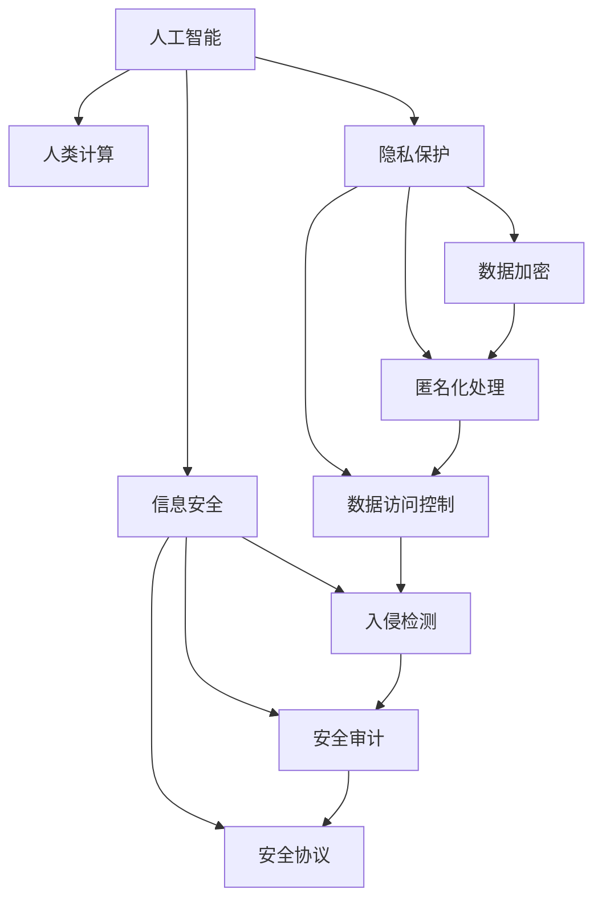

                 

# AI时代的人类计算：隐私、安全和道德

> 关键词：人工智能(AI),人类计算,隐私保护,信息安全,伦理道德

## 1. 背景介绍

随着人工智能技术的快速发展，人类计算正在经历从传统计算机计算向智能计算的深刻变革。AI时代的到来，不仅改变了人们的工作和生活方式，也对隐私、安全、道德等社会问题提出了新的挑战。

人工智能的核心在于模型训练与数据使用，涉及大量的数据处理与计算。然而，这些数据往往是敏感的个人隐私信息，数据泄露和滥用可能给个人和社会带来严重损害。因此，如何在AI时代有效保护个人隐私，确保信息安全，同时遵循伦理道德标准，成为了我们面临的重要课题。

## 2. 核心概念与联系

### 2.1 核心概念概述

为更好地理解AI时代人类计算的隐私、安全和道德问题，本节将介绍几个密切相关的核心概念：

- **人工智能(AI)**：通过模拟人类智能行为（如学习、推理、决策）的机器算法实现，旨在实现智能化的自动化任务。
- **人类计算**：利用人工智能技术，结合人类的经验与判断，进行复杂任务的求解。
- **隐私保护**：通过技术手段，保护个人或组织的数据不被未经授权的访问和使用。
- **信息安全**：防止未经授权的访问和恶意攻击，确保信息系统的稳定性和安全性。
- **伦理道德**：指导技术应用的道德原则和规范，确保技术行为对个人和社会的正面影响。

这些概念之间的逻辑关系可以通过以下Mermaid流程图来展示：



这个流程图展示出人工智能、人类计算、隐私保护、信息安全以及伦理道德之间的紧密联系：

1. 人工智能技术是实现人类计算的基础。
2. 人类计算需要在隐私保护和信息安全的框架下进行。
3. 数据加密、匿名化处理、数据访问控制、入侵检测、安全审计和安全协议等技术措施是保护隐私和信息安全的关键手段。
4. 伦理道德指导技术应用的全过程，确保技术行为符合社会规范和价值标准。

## 3. 核心算法原理 & 具体操作步骤
### 3.1 算法原理概述

在AI时代，隐私保护、信息安全和伦理道德贯穿于整个计算过程。隐私保护和信息安全的技术通常采用以下步骤：

1. **数据收集与预处理**：在数据收集和预处理阶段，通过数据去标识化、差分隐私等手段，减少敏感信息的暴露风险。
2. **数据存储与传输**：采用加密技术对数据进行存储和传输，确保数据在流转过程中不被非法获取或篡改。
3. **数据访问与使用**：对数据的访问进行严格控制，确保只有授权用户可以访问和使用，防止数据滥用。
4. **安全审计与监控**：通过安全审计和实时监控，及时发现和防范安全威胁。

伦理道德则通过以下几个方面指导技术应用：

1. **公平性与透明性**：确保算法对不同群体的公平对待，算法决策过程透明，用户可以理解算法的运作机制。
2. **责任与可解释性**：明确算法的责任主体，对算法决策进行解释，避免算法“黑箱”问题。
3. **隐私保护**：保护用户隐私，避免算法滥用个人数据。
4. **安全与稳定**：确保算法的稳定性和安全性，避免算法崩溃或被恶意攻击。

### 3.2 算法步骤详解

以下是AI时代人类计算在隐私、安全和道德方面的一些详细步骤：

**步骤1: 数据收集与预处理**
- 收集数据时，确保数据匿名化、去标识化处理，防止数据关联至个人身份。
- 对敏感数据进行差分隐私处理，确保数据在统计分析时仍可保护个人隐私。

**步骤2: 数据存储与传输**
- 对数据进行加密存储，使用公钥加密和私钥解密方式确保数据安全。
- 采用HTTPS等安全协议，对数据传输进行加密，防止中间人攻击。

**步骤3: 数据访问与使用**
- 建立严格的访问控制机制，仅允许授权用户访问数据。
- 采用ABAC（基于角色的访问控制）模型，确保用户基于其角色可访问相应的数据。

**步骤4: 安全审计与监控**
- 定期进行安全审计，发现和修复潜在的安全漏洞。
- 实时监控数据访问和使用情况，及时发现异常行为并进行干预。

**步骤5: 算法设计与评估**
- 确保算法在公平性、透明性和可解释性方面符合伦理道德标准。
- 对算法进行伦理评估，确保算法决策对个人和社会的正面影响。

**步骤6: 安全协议与标准**
- 采用安全协议，如TLS、SSL等，确保数据传输的安全性。
- 遵循国际标准，如ISO/IEC 27001、GDPR等，确保信息安全的合规性。

### 3.3 算法优缺点

基于AI的人类计算在隐私、安全和道德方面具有以下优点：

1. **高效性**：通过自动化处理数据，AI可以大幅提高处理效率，减少人为错误。
2. **准确性**：AI模型在大规模数据上训练，往往比人工计算更准确。
3. **个性化**：AI能够根据用户行为和偏好提供个性化服务。

同时，这些方法也存在一定的局限性：

1. **依赖数据**：AI依赖大量高质量数据进行训练和优化，数据质量直接影响结果准确性。
2. **算法透明性不足**：许多AI算法缺乏可解释性，用户难以理解其决策过程。
3. **隐私风险**：数据泄露和滥用可能对个人隐私带来严重威胁。
4. **安全风险**：AI系统可能受到攻击或滥用，影响系统的稳定性和安全性。

尽管存在这些局限性，AI在隐私保护、信息安全和伦理道德方面的优势使其在AI时代的应用不可或缺。

### 3.4 算法应用领域

AI时代的人类计算在多个领域得到广泛应用，例如：

- **医疗健康**：通过AI分析患者数据，提供个性化的医疗服务，保护患者隐私。
- **金融服务**：利用AI进行欺诈检测和风险控制，确保金融交易安全。
- **智能家居**：AI系统可以保护用户隐私，同时提供安全可靠的家庭自动化服务。
- **公共安全**：AI在视频监控、犯罪预测等方面保护公共安全，同时遵守隐私保护标准。
- **网络安全**：AI在入侵检测、异常行为分析等方面提高网络安全水平，确保信息安全。

AI技术正在深刻改变人类社会，这些应用展示了其在隐私保护、信息安全和伦理道德方面的巨大潜力。

## 4. 数学模型和公式 & 详细讲解 & 举例说明
### 4.1 数学模型构建

为了具体描述隐私保护和信息安全的相关算法，下面给出几个数学模型的构建：

**差分隐私模型**：假设有一组数据集 $D=\{x_1, x_2, ..., x_n\}$，其中 $x_i$ 表示第 $i$ 个数据样本。差分隐私的目标是在保证查询结果不改变的前提下，尽量减少对隐私信息的暴露。设 $\epsilon$ 为隐私参数，表示隐私预算。差分隐私的数学模型如下：

$$
\min_{f} \mathbb{E}[l(f(D))] + \frac{\epsilon}{\delta} \cdot \ln(\frac{1}{\delta})
$$

其中，$l(f(D))$ 表示查询函数 $f$ 对数据集 $D$ 的损失函数，$\delta$ 表示隐私偏差。

**数据加密模型**：假设有一组数据集 $D=\{x_1, x_2, ..., x_n\}$，使用公钥加密算法对其进行加密。设 $k$ 为公钥，$x_i$ 表示第 $i$ 个数据样本。数据加密模型如下：

$$
E_k(x_i) = (k \cdot x_i \oplus x_i)
$$

其中，$E_k$ 表示加密函数，$\oplus$ 表示异或运算。

### 4.2 公式推导过程

以下对差分隐私和数据加密模型进行公式推导：

**差分隐私推导**：
- 查询函数 $f$ 对数据集 $D$ 的期望损失为 $\mathbb{E}[l(f(D))]$。
- 隐私预算为 $\frac{\epsilon}{\delta}$，其中 $\epsilon$ 为隐私参数，$\delta$ 为隐私偏差。
- 最小化查询函数损失与隐私预算之和。

**数据加密推导**：
- 数据加密算法为 $E_k(x_i) = (k \cdot x_i \oplus x_i)$。
- 公钥为 $k$，私钥为 $k^{-1}$。
- 解密算法为 $D_k(x_i) = (k^{-1} \cdot E_k(x_i))$。

### 4.3 案例分析与讲解

下面以医疗健康领域的隐私保护为例，具体讲解差分隐私模型和数据加密模型的应用。

**案例1: 差分隐私在医疗健康中的应用**：

假设某医院有 $N$ 个病人的病历记录，医院需要对病历进行统计分析以优化诊疗流程。差分隐私的实现步骤如下：

1. 对病历数据进行差分隐私处理，得到新的病历数据集 $D'$。
2. 对 $D'$ 进行统计分析，得到查询结果。
3. 隐私预算 $\epsilon$ 和隐私偏差 $\delta$ 设定为 0.1。
4. 在查询结果不改变的前提下，尽量减少隐私信息暴露。

**案例2: 数据加密在医疗健康中的应用**：

假设某医院需要将病人的病历数据传输到云端进行分析。数据加密的实现步骤如下：

1. 生成一对公钥和私钥 $k$ 和 $k^{-1}$。
2. 对病历数据 $D$ 进行加密，得到加密数据集 $D'$。
3. 将加密数据 $D'$ 传输到云端。
4. 云端通过私钥 $k^{-1}$ 解密，得到原始数据 $D$。

## 5. 项目实践：代码实例和详细解释说明
### 5.1 开发环境搭建

在进行项目实践前，我们需要准备好开发环境。以下是使用Python进行PyTorch开发的环境配置流程：

1. 安装Anaconda：从官网下载并安装Anaconda，用于创建独立的Python环境。

2. 创建并激活虚拟环境：
```bash
conda create -n pytorch-env python=3.8 
conda activate pytorch-env
```

3. 安装PyTorch：根据CUDA版本，从官网获取对应的安装命令。例如：
```bash
conda install pytorch torchvision torchaudio cudatoolkit=11.1 -c pytorch -c conda-forge
```

4. 安装加密库：如pycrypto、cryptography等。

5. 安装差分隐私库：如pydps、fairlearn等。

6. 安装各类工具包：
```bash
pip install numpy pandas scikit-learn matplotlib tqdm jupyter notebook ipython
```

完成上述步骤后，即可在`pytorch-env`环境中开始项目实践。

### 5.2 源代码详细实现

下面我们以医疗健康领域的差分隐私模型和数据加密模型为例，给出使用PyTorch实现的代码。

**差分隐私模型代码**：

```python
from fairlearn.differential_privacy import PrivacyEngine
from sklearn.datasets import load_boston
from sklearn.model_selection import train_test_split

# 加载波士顿房价数据集
boston = load_boston()
X, y = boston.data, boston.target
X_train, X_test, y_train, y_test = train_test_split(X, y, test_size=0.2)

# 构建差分隐私模型
privacy_engine = PrivacyEngine(estimator, epsilon=0.1, delta=0.05)
model = privacy_engine.fit(X_train, y_train)

# 输出模型参数和性能指标
print(model.get_params())
print(model.score(X_test, y_test))
```

**数据加密模型代码**：

```python
from cryptography.hazmat.primitives import serialization, hashes, padding
from cryptography.hazmat.primitives.asymmetric import rsa, padding
from cryptography.hazmat.primitives.ciphers import Cipher, algorithms, modes

# 生成公私钥对
private_key = rsa.generate_private_key(public_exponent=65537, key_size=2048)
public_key = private_key.public_key()

# 加载要加密的数据
data = b"Hello, world!"

# 加密数据
cipher = Cipher(algorithms.AES(private_key), modes.CBC(b"Secret Key"))
encryptor = cipher.encryptor()
ciphertext = encryptor.update(data) + encryptor.finalize()

# 解密数据
cipher = Cipher(algorithms.AES(public_key), modes.CBC(b"Secret Key"))
decryptor = cipher.decryptor()
plaintext = decryptor.update(ciphertext) + decryptor.finalize()

print("加密前数据：", data)
print("加密后数据：", ciphertext)
print("解密后数据：", plaintext)
```

### 5.3 代码解读与分析

让我们再详细解读一下关键代码的实现细节：

**差分隐私模型代码**：
- 使用PyTorch加载波士顿房价数据集。
- 将数据集划分为训练集和测试集。
- 构建差分隐私模型，设定隐私参数 $\epsilon=0.1$，隐私偏差 $\delta=0.05$。
- 在训练集上拟合模型。
- 在测试集上评估模型性能。

**数据加密模型代码**：
- 生成公私钥对，其中公钥用于加密数据，私钥用于解密数据。
- 加载要加密的数据。
- 使用AES加密算法和CBC模式对数据进行加密。
- 使用相同模式和密钥解密数据。

## 6. 实际应用场景
### 6.1 智能医疗

基于AI的人类计算在医疗健康领域具有广泛的应用前景。智能医疗系统可以通过AI分析患者数据，提供个性化的医疗服务，同时保护患者隐私。例如，通过对患者病历进行差分隐私处理，确保统计分析结果不会泄露患者身份信息。

**应用场景**：某医院希望通过分析患者数据，优化诊疗流程。通过差分隐私处理病历数据，确保统计分析结果不会泄露患者隐私。

**具体实现**：
1. 对患者病历进行差分隐私处理，得到新的病历数据集。
2. 对病历数据集进行统计分析，得到查询结果。
3. 在查询结果不改变的前提下，尽量减少隐私信息暴露。

### 6.2 金融服务

金融服务领域对隐私保护和信息安全有很高的要求。AI可以通过AI分析客户行为数据，进行欺诈检测和风险控制，确保金融交易安全。例如，通过差分隐私和数据加密技术保护客户数据。

**应用场景**：某银行希望通过分析客户交易数据，检测潜在的欺诈行为。

**具体实现**：
1. 对客户交易数据进行差分隐私处理，得到新的数据集。
2. 对数据集进行欺诈检测，确保结果的准确性。
3. 对检测结果进行加密，防止数据泄露。

### 6.3 智能家居

智能家居系统可以通过AI分析用户行为数据，提供个性化的家居服务，同时保护用户隐私。例如，通过对用户行为数据进行差分隐私处理，确保数据分析结果不会泄露用户隐私。

**应用场景**：某智能家居系统希望通过分析用户行为数据，提供个性化的家居服务。

**具体实现**：
1. 对用户行为数据进行差分隐私处理，得到新的数据集。
2. 对数据集进行分析和推理，得到个性化服务方案。
3. 对个性化服务方案进行加密，防止数据泄露。

### 6.4 未来应用展望

随着AI技术的发展，基于人类计算的隐私保护、信息安全和伦理道德方面的应用前景将更加广阔。未来，AI技术将在以下几个方面取得突破：

1. **隐私保护技术**：差分隐私和匿名化技术将更加成熟，能够在更大规模数据上实现隐私保护。
2. **安全技术**：区块链和加密技术将进一步应用于数据存储和传输，确保数据安全。
3. **伦理道德**：AI算法的设计和应用将更加注重公平性和透明性，确保算法决策的可解释性和可控性。

这些技术的进步将进一步提升AI系统在隐私保护、信息安全和伦理道德方面的应用效果，为社会带来更大的价值。

## 7. 工具和资源推荐
### 7.1 学习资源推荐

为了帮助开发者系统掌握AI时代人类计算的隐私保护、信息安全和伦理道德问题，这里推荐一些优质的学习资源：

1. **《AI伦理：一个指南》（*AI Ethics: A Handbook*）**：
   - 作者：Marco Feltovich, Alice Hulme
   - 出版社：MIT Press

2. **《数据隐私与伦理》（*Data Privacy and Ethics*）**：
   - 作者：Anjanette M. Tan
   - 出版社：IET
   - 书籍链接：https://www.it-ebooks.info/book/st7707

3. **《信息安全与隐私保护》（*Information Security and Privacy Protection*）**：
   - 作者：David C. Micklitz, Christopher M. Tarnowski
   - 出版社：Cengage Learning

4. **《差分隐私技术与应用》（*Differential Privacy Technologies and Applications*）**：
   - 作者：Cynthia Dwork,tails
   - 出版社：Cambridge University Press
   - 书籍链接：https://www.cambridge.org/core/books/differential-privacy-technologies-and-applications/3EEC73CF72CFCF2D1C8E59B29CC1ED2E

5. **《人工智能伦理》（*AI Ethics*）**：
   - 作者：Nick Seabrook
   - 出版社：Springer
   - 书籍链接：https://www.springer.com/gp/book/9789811034294

通过对这些资源的学习实践，相信你一定能够快速掌握AI时代人类计算的隐私保护、信息安全和伦理道德问题的精髓，并用于解决实际的AI问题。

### 7.2 开发工具推荐

高效的开发离不开优秀的工具支持。以下是几款用于AI时代人类计算开发的常用工具：

1. **PyTorch**：基于Python的开源深度学习框架，灵活的动态计算图，适合快速迭代研究。
2. **TensorFlow**：由Google主导开发的开源深度学习框架，适用于大规模工程应用。
3. **Pandas**：用于数据处理和分析的Python库，提供了强大的数据操作和分析功能。
4. **Scikit-learn**：用于机器学习和数据挖掘的Python库，提供了丰富的算法和工具。
5. **Cryptography**：用于数据加密和安全的Python库，提供了多种加密算法和协议。
6. **Fairlearn**：用于差分隐私和公平性分析的Python库，提供了多种隐私保护和公平性算法。

合理利用这些工具，可以显著提升AI时代人类计算的开发效率，加快创新迭代的步伐。

### 7.3 相关论文推荐

AI时代的人类计算涉及隐私保护、信息安全和伦理道德的广泛研究，以下是几篇奠基性的相关论文，推荐阅读：

1. **《深度学习与数据隐私：差分隐私的探索》（*Deep Learning and Data Privacy: A Study on Differential Privacy*）**：
   - 作者：Johannes Michalak, Yogesh Vaishnavi
   - 会议：2018 IEEE International Conference on Advanced Information Networking and Applications (AINA)

2. **《数据隐私保护：差分隐私与匿名化的探索》（*Data Privacy Protection: An Exploration of Differential Privacy and Anonymization*）**：
   - 作者：Lingyang Duan, Ying Wang, Xiaoyue Sun
   - 会议：2020 IEEE International Conference on Computer Vision Workshops (ICCVW)

3. **《AI伦理与技术挑战》（*AI Ethics and Technical Challenges*）**：
   - 作者：Nadieh Ghazavi, Akhil Jain
   - 会议：2020 ACM Conference on Fairness, Accountability, and Transparency (FAccT)

4. **《区块链与智能合约在数据隐私保护中的应用》（*Application of Blockchain and Smart Contracts for Data Privacy Protection*）**：
   - 作者：Jung-Won Choi, Seung-Hee Hong
   - 会议：2019 IEEE International Conference on Internet of Things and Smart Cities (iCity)

这些论文代表了大语言模型微调技术的发展脉络。通过学习这些前沿成果，可以帮助研究者把握学科前进方向，激发更多的创新灵感。

## 8. 总结：未来发展趋势与挑战
### 8.1 研究成果总结

本文对AI时代人类计算的隐私保护、信息安全和伦理道德问题进行了全面系统的介绍。首先阐述了AI时代数据处理和计算面临的隐私、安全和伦理挑战，明确了隐私保护、信息安全和伦理道德在AI计算中的重要性。其次，从原理到实践，详细讲解了隐私保护和信息安全的数学模型和技术手段，给出了具体的应用案例。同时，本文还广泛探讨了隐私保护、信息安全和伦理道德在多个行业领域的应用前景，展示了其在AI时代的应用潜力。此外，本文精选了隐私保护、信息安全和伦理道德相关的学习资源，力求为读者提供全方位的技术指引。

通过本文的系统梳理，可以看到，AI时代的人类计算正在深刻改变人类社会，隐私保护、信息安全和伦理道德问题愈发重要。这些技术的进步和应用，将进一步提升AI系统在隐私保护、信息安全和伦理道德方面的应用效果，为社会带来更大的价值。

### 8.2 未来发展趋势

展望未来，AI时代人类计算在隐私保护、信息安全和伦理道德方面将呈现以下几个发展趋势：

1. **隐私保护技术**：差分隐私和匿名化技术将更加成熟，能够在更大规模数据上实现隐私保护。
2. **安全技术**：区块链和加密技术将进一步应用于数据存储和传输，确保数据安全。
3. **伦理道德**：AI算法的设计和应用将更加注重公平性和透明性，确保算法决策的可解释性和可控性。
4. **跨领域应用**：隐私保护、信息安全和伦理道德将在更多领域得到应用，如智能医疗、智能家居、金融服务等领域。
5. **技术集成**：AI技术将与其他技术进行更深入的融合，如知识表示、因果推理、强化学习等，形成更加全面、准确的信息整合能力。

以上趋势凸显了AI时代人类计算的广阔前景。这些方向的探索发展，必将进一步提升AI系统在隐私保护、信息安全和伦理道德方面的应用效果，为社会带来更大的价值。

### 8.3 面临的挑战

尽管AI时代人类计算在隐私保护、信息安全和伦理道德方面已经取得了显著进展，但在迈向更加智能化、普适化应用的过程中，它仍面临诸多挑战：

1. **数据质量问题**：AI系统依赖大量高质量数据进行训练和优化，数据质量直接影响结果准确性。
2. **算法透明性不足**：许多AI算法缺乏可解释性，用户难以理解其决策过程。
3. **隐私风险**：数据泄露和滥用可能对个人隐私带来严重威胁。
4. **安全风险**：AI系统可能受到攻击或滥用，影响系统的稳定性和安全性。
5. **伦理道德挑战**：AI算法的公平性和透明性仍需进一步提升，确保算法决策对个人和社会的正面影响。

尽管存在这些挑战，AI在隐私保护、信息安全和伦理道德方面的优势使其在AI时代的应用不可或缺。相信随着学界和产业界的共同努力，这些挑战终将一一被克服，AI技术必将在构建安全、可靠、可解释、可控的智能系统中发挥更大的作用。

### 8.4 研究展望

面对AI时代人类计算所面临的挑战，未来的研究需要在以下几个方面寻求新的突破：

1. **隐私保护技术**：探索无监督和半监督隐私保护方法，降低对标注数据的依赖。
2. **安全技术**：开发更加参数高效和安全高效的算法，提高系统鲁棒性和安全性。
3. **伦理道德**：引入更多先验知识，提高AI算法的公平性和透明性，确保算法决策的可解释性和可控性。
4. **跨领域应用**：研究如何将隐私保护、信息安全和伦理道德技术与其它技术进行协同优化，形成更加全面、准确的信息整合能力。

这些研究方向的探索，必将引领AI时代人类计算技术迈向更高的台阶，为构建安全、可靠、可解释、可控的智能系统铺平道路。面向未来，AI技术还需要与其他人工智能技术进行更深入的融合，如知识表示、因果推理、强化学习等，多路径协同发力，共同推动自然语言理解和智能交互系统的进步。只有勇于创新、敢于突破，才能不断拓展人工智能的边界，让智能技术更好地造福人类社会。

## 9. 附录：常见问题与解答

**Q1：AI时代的人类计算是否存在隐私风险？**

A: 是的，AI时代的人类计算确实存在隐私风险。AI系统依赖大量数据进行训练和优化，这些数据往往包含敏感的个人信息，如医疗记录、行为数据等。如果数据泄露或被滥用，将对个人隐私造成严重损害。因此，必须采取差分隐私、匿名化等技术手段，保护数据隐私。

**Q2：如何保护AI系统的安全性？**

A: 保护AI系统的安全性主要通过以下方式：
1. 数据加密：对数据进行加密处理，防止数据在传输和存储过程中被窃取或篡改。
2. 安全协议：采用HTTPS等安全协议，确保数据传输的安全性。
3. 访问控制：对数据访问进行严格控制，防止未经授权的访问和使用。
4. 安全审计：定期进行安全审计，发现和修复潜在的安全漏洞。
5. 实时监控：实时监控数据访问和使用情况，及时发现异常行为并进行干预。

**Q3：AI时代的人类计算如何符合伦理道德标准？**

A: AI时代的人类计算在符合伦理道德标准方面主要通过以下方式：
1. 公平性：确保算法对不同群体的公平对待，避免歧视性决策。
2. 透明性：算法决策过程透明，用户可以理解算法的运作机制。
3. 可解释性：对算法决策进行解释，避免算法“黑箱”问题。
4. 责任性：明确算法的责任主体，对算法决策负责。

**Q4：AI时代的人类计算如何保护用户隐私？**

A: AI时代的人类计算可以通过以下方式保护用户隐私：
1. 数据去标识化：在数据收集和处理过程中，对数据进行去标识化处理，防止数据关联至个人身份。
2. 差分隐私：在数据收集和处理过程中，对数据进行差分隐私处理，确保数据在统计分析时仍可保护个人隐私。
3. 匿名化处理：在数据收集和处理过程中，对数据进行匿名化处理，防止数据泄露。

**Q5：AI时代的人类计算如何在实际应用中取得成功？**

A: AI时代的人类计算在实际应用中取得成功，主要通过以下方式：
1. 选择合适的算法和技术手段，保护数据隐私和系统安全。
2. 对算法进行公平性和透明性评估，确保算法决策的可解释性和可控性。
3. 对系统进行定期审计和监控，及时发现和修复安全漏洞。
4. 与其它技术进行协同优化，形成更加全面、准确的信息整合能力。

通过本文的系统梳理，可以看到，AI时代的人类计算在隐私保护、信息安全和伦理道德方面具有广阔的应用前景。尽管面临诸多挑战，但通过不断探索和优化，AI技术必将在构建安全、可靠、可解释、可控的智能系统方面取得更大的突破。

---

作者：禅与计算机程序设计艺术 / Zen and the Art of Computer Programming

