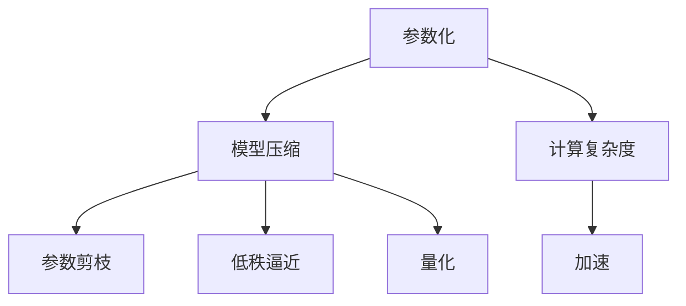

                 

# AI模型scaling：从参数到性能的关系

> 关键词：模型缩放,参数化,计算复杂度,深度学习,性能优化,模型压缩,量化,加速

## 1. 背景介绍

### 1.1 问题由来

近年来，深度学习模型因其在图像识别、语音识别、自然语言处理等领域取得的巨大成功而备受瞩目。其中，尤其是神经网络模型，因其出色的泛化能力和强大的表达能力，成为各大领域的主要工具。然而，神经网络模型的参数量巨大，计算复杂度高，在资源受限的环境下部署和优化变得异常困难。因此，研究如何将模型参数进行合理缩放，在保证性能的同时，降低计算复杂度和资源消耗，成为了学术界和产业界关注的焦点。

### 1.2 问题核心关键点

如何合理缩放深度学习模型的参数，以在保证性能的同时，降低计算复杂度和资源消耗，是当前深度学习研究的一个重要问题。解决这个问题的方法主要有参数化、模型压缩、量化等，这些方法通常用于减少模型的参数量和计算复杂度，以提升模型的运行效率。本文将重点探讨如何通过参数化和模型压缩等技术，实现模型的有效缩放，并讨论其在实际应用中的优缺点和应用领域。

## 2. 核心概念与联系

### 2.1 核心概念概述

为了更好地理解模型缩放的相关问题，我们首先需要介绍几个核心概念：

- **参数化(Parameterization)**：指在保证模型性能的前提下，通过合理设计模型的结构，使得模型所需的参数量最小化。参数化的目标是在不降低模型性能的前提下，尽可能地减少模型的复杂度。

- **计算复杂度(Computational Complexity)**：指执行模型前向传播和反向传播所需的计算资源。通常用FLOPS（Floating-point Operations Per Second）来表示。计算复杂度越高，模型的推理速度越慢。

- **模型压缩(Model Compression)**：指在模型中减少参数量和计算复杂度，从而提升模型的推理速度和资源效率。模型压缩包括参数剪枝、低秩逼近、量化等方法。

- **量化(Quantization)**：指将模型中的参数和计算数据从32位浮点数（FP32）压缩到8位或16位整数（如INT8），从而减少模型的存储空间和计算量。量化通常用于降低模型对内存和计算资源的需求。

- **加速(Acceleration)**：指通过优化模型结构、减少计算复杂度等方式，提升模型的推理速度。加速可以通过硬件加速（如GPU、TPU）、算法优化等方式实现。

这些概念之间的关系可以通过以下Mermaid流程图来展示：



这个流程图展示了大规模深度学习模型的参数化、模型压缩与计算复杂度、加速之间的关系：

1. 参数化在保持模型性能的同时，减少模型参数量。
2. 模型压缩通过剪枝、低秩逼近和量化等方法，进一步减少参数量和计算复杂度。
3. 计算复杂度通过参数化、模型压缩等手段降低，从而实现模型加速。

这些概念共同构成了深度学习模型参数化、压缩和加速的基本框架，使得我们能够通过优化模型的参数和计算资源，提升模型的性能和资源效率。

## 3. 核心算法原理 & 具体操作步骤

### 3.1 算法原理概述

深度学习模型的参数化、压缩和加速涉及多个算法和技术。本节将介绍几个核心的算法原理及其具体操作步骤。

#### 3.1.1 参数化

参数化是一种在保证模型性能的前提下，减少模型参数量的技术。其主要目标是通过调整模型的结构和参数化方式，使得模型所需的参数量最小化。参数化的主要方法包括结构化参数化、非结构化参数化和自适应参数化等。

- **结构化参数化(Structured Parameterization)**：通过调整模型的结构，如减少层数、减少神经元数量等方式，减少模型的参数量。
- **非结构化参数化(Unstructured Parameterization)**：通过重新设计激活函数、损失函数、优化器等方式，减少模型的参数量和计算复杂度。
- **自适应参数化(Adaptive Parameterization)**：通过动态调整模型的参数化方式，根据任务需求和数据特点，选择合适的参数化策略。

#### 3.1.2 模型压缩

模型压缩是减少模型参数量和计算复杂度的重要手段。其核心思想是通过剪枝、低秩逼近、量化等技术，优化模型结构，降低计算资源消耗。

- **参数剪枝(Parameter Pruning)**：通过移除模型中的冗余参数，减少模型的计算量和存储空间。参数剪枝通常包括结构剪枝和权值剪枝等方法。
- **低秩逼近(Low-Rank Approximation)**：通过将模型参数矩阵进行低秩分解，减少模型的计算复杂度。低秩逼近通常用于减少矩阵乘法操作，从而提升模型的推理速度。
- **量化(Quantization)**：通过将模型中的参数和计算数据从高精度压缩到低精度，减少模型的存储空间和计算量。量化通常用于降低模型对内存和计算资源的需求。

#### 3.1.3 加速

加速是提升模型推理速度和资源效率的重要手段。其主要目标是通过优化模型结构、减少计算复杂度等方式，提升模型的计算效率。

- **硬件加速(Hardware Acceleration)**：通过使用GPU、TPU等高性能设备，加速模型的推理计算。硬件加速通常用于大规模深度学习模型的推理。
- **算法优化(Algorithm Optimization)**：通过优化模型的前向传播和反向传播算法，减少计算复杂度，提升模型推理速度。算法优化通常包括矩阵分解、向量量化等方法。

### 3.2 算法步骤详解

接下来，我们将详细介绍参数化、模型压缩和加速的主要操作步骤。

#### 3.2.1 参数化操作步骤

1. **结构化参数化**：
   - 选择合适的模型架构，如卷积神经网络（CNN）、循环神经网络（RNN）、Transformer等。
   - 调整模型的层数、神经元数量、卷积核大小等超参数。
   - 通过交叉验证等技术，选择最佳的超参数组合。

2. **非结构化参数化**：
   - 重新设计激活函数、损失函数、优化器等。
   - 通过实验验证，选择最优的参数化方式。

3. **自适应参数化**：
   - 根据任务需求和数据特点，动态调整模型的参数化方式。
   - 通过在线学习、增量学习等技术，实时调整模型参数。

#### 3.2.2 模型压缩操作步骤

1. **参数剪枝**：
   - 使用结构剪枝技术，移除模型中冗余参数。
   - 使用权值剪枝技术，移除参数值较小的权值，减少模型的计算复杂度。
   - 通过实验验证，选择最佳的剪枝策略。

2. **低秩逼近**：
   - 对模型参数矩阵进行奇异值分解（SVD）或主成分分析（PCA）等低秩分解操作。
   - 选择最优的低秩逼近矩阵，减少模型的计算复杂度。

3. **量化**：
   - 将模型中的参数和计算数据从高精度压缩到低精度。
   - 通过实验验证，选择最佳的量化精度。

#### 3.2.3 加速操作步骤

1. **硬件加速**：
   - 使用GPU、TPU等高性能设备，加速模型的推理计算。
   - 通过CUDA等技术，优化硬件加速的接口和性能。

2. **算法优化**：
   - 优化模型的前向传播和反向传播算法。
   - 使用矩阵分解、向量量化等技术，减少计算复杂度。

### 3.3 算法优缺点

#### 3.3.1 参数化的优缺点

**优点**：
- 减少模型参数量，提升模型的推理速度。
- 保持模型性能的同时，降低计算复杂度。

**缺点**：
- 可能导致模型性能下降。
- 设计不当可能导致模型过度简化，影响模型的表达能力。

#### 3.3.2 模型压缩的优缺点

**优点**：
- 减少模型参数量和计算复杂度，提升模型的推理速度。
- 降低模型对内存和计算资源的需求。

**缺点**：
- 可能导致模型性能下降。
- 压缩技术的设计和实现复杂，需要大量实验验证。

#### 3.3.3 加速的优缺点

**优点**：
- 提升模型的推理速度和资源效率。
- 降低模型的计算复杂度和资源消耗。

**缺点**：
- 可能增加模型的计算延迟。
- 硬件加速设备成本高，限制了模型的广泛应用。

## 4. 数学模型和公式 & 详细讲解 & 举例说明

### 4.1 数学模型构建

为了更好地理解深度学习模型的参数化、压缩和加速，我们将通过数学模型对其进行描述。

假设有一个深度学习模型 $M$，包含 $n$ 个参数 $\theta$。模型的前向传播计算为 $y = f(x; \theta)$，其中 $x$ 为输入，$y$ 为输出。模型的损失函数为 $L(y, \hat{y})$，其中 $\hat{y}$ 为模型预测输出。模型的优化目标为最小化损失函数 $L(y, \hat{y})$，即：

$$
\theta^* = \mathop{\arg\min}_{\theta} L(y, \hat{y})
$$

其中 $\theta^*$ 为最优模型参数。

### 4.2 公式推导过程

接下来，我们将对深度学习模型的参数化、压缩和加速的公式进行推导。

#### 4.2.1 参数化公式推导

假设我们使用结构化参数化方法，通过调整模型的层数和神经元数量，减少模型参数量。设原模型参数量为 $n_0$，优化后模型参数量为 $n_1$。则参数化方法可以表示为：

$$
\theta_1 = f(\theta_0; \alpha)
$$

其中 $\alpha$ 为超参数，表示模型调整的方式。例如，可以调整模型的层数和神经元数量，减少模型参数量。

#### 4.2.2 模型压缩公式推导

假设我们使用参数剪枝方法，移除模型中冗余的参数。设原模型参数量为 $n_0$，剪枝后模型参数量为 $n_1$。则参数剪枝方法可以表示为：

$$
\theta_1 = f(\theta_0, \mathcal{T})
$$

其中 $\mathcal{T}$ 为剪枝策略，表示剪枝的方式。例如，可以移除参数值较小的权值。

#### 4.2.3 加速公式推导

假设我们使用硬件加速方法，通过使用GPU、TPU等高性能设备，加速模型的推理计算。设原模型推理时间为 $t_0$，加速后模型推理时间为 $t_1$。则硬件加速方法可以表示为：

$$
t_1 = g(t_0; \beta)
$$

其中 $\beta$ 为硬件设备的性能参数，表示加速的方式。例如，使用GPU加速。

### 4.3 案例分析与讲解

#### 4.3.1 案例分析

以VGG网络为例，分析其参数化、压缩和加速的实现过程。

- **参数化**：VGG网络通过减少层数和神经元数量，减少模型参数量。例如，VGG16网络相比VGG11网络，减少了层数和神经元数量，使得模型参数量减少到原来的1/3。
- **模型压缩**：VGG网络使用参数剪枝方法，移除冗余的参数。例如，VGG网络通过剪枝算法，移除参数值较小的权值，减少模型参数量。
- **加速**：VGG网络使用GPU硬件加速，提升模型的推理速度。例如，使用GPU加速VGG网络，可以显著提升模型的推理速度。

#### 4.3.2 案例讲解

以ResNet为例，分析其参数化、压缩和加速的实现过程。

- **参数化**：ResNet通过使用残差连接（Residual Connection），减少模型参数量。例如，ResNet网络通过残差连接，减少模型参数量，使得模型在保持性能的同时，减少模型复杂度。
- **模型压缩**：ResNet网络使用参数剪枝和量化方法，减少模型参数量和计算复杂度。例如，ResNet网络通过剪枝算法和量化方法，减少模型参数量和计算复杂度。
- **加速**：ResNet网络使用GPU硬件加速，提升模型的推理速度。例如，使用GPU加速ResNet网络，可以显著提升模型的推理速度。

## 5. 项目实践：代码实例和详细解释说明

### 5.1 开发环境搭建

在进行深度学习模型参数化、压缩和加速的实践时，我们需要准备好开发环境。以下是使用Python进行TensorFlow和Keras开发的环境配置流程：

1. 安装Anaconda：从官网下载并安装Anaconda，用于创建独立的Python环境。

2. 创建并激活虚拟环境：
```bash
conda create -n tf-env python=3.8 
conda activate tf-env
```

3. 安装TensorFlow：根据CUDA版本，从官网获取对应的安装命令。例如：
```bash
conda install tensorflow==2.7-cpu -c tf -c conda-forge
```

4. 安装Keras：
```bash
conda install keras==2.7.0 -c conda-forge
```

5. 安装各类工具包：
```bash
pip install numpy pandas scikit-learn matplotlib tqdm jupyter notebook ipython
```

完成上述步骤后，即可在`tf-env`环境中开始模型缩放的实践。

### 5.2 源代码详细实现

这里我们以ResNet网络为例，给出使用TensorFlow和Keras进行模型参数化、压缩和加速的PyTorch代码实现。

首先，定义ResNet网络的结构：

```python
import tensorflow as tf
from tensorflow.keras import layers

def resnet_v1(inputs, num_filters):
    x = inputs
    for i in range(4):
        x = layers.Conv2D(num_filters, (3, 3), padding='same', activation='relu')(x)
        x = layers.MaxPooling2D((2, 2), strides=(2, 2), padding='same')(x)
        num_filters *= 2
    x = layers.Conv2D(num_filters, (3, 3), padding='same', activation='relu')(x)
    x = layers.MaxPooling2D((2, 2), strides=(2, 2), padding='same')(x)
    x = layers.Flatten()(x)
    x = layers.Dense(1024, activation='relu')(x)
    x = layers.Dense(10, activation='softmax')(x)
    return x
```

然后，定义模型和优化器：

```python
inputs = tf.keras.Input(shape=(224, 224, 3))
outputs = resnet_v1(inputs, num_filters=32)
model = tf.keras.Model(inputs=inputs, outputs=outputs)

optimizer = tf.keras.optimizers.Adam(learning_rate=0.001)
```

接着，定义训练和评估函数：

```python
from tensorflow.keras.datasets import cifar10
from tensorflow.keras.utils import to_categorical

# 加载CIFAR-10数据集
(x_train, y_train), (x_test, y_test) = cifar10.load_data()
x_train = x_train / 255.0
x_test = x_test / 255.0
y_train = to_categorical(y_train)
y_test = to_categorical(y_test)

# 定义训练函数
def train_epoch(model, data, batch_size, optimizer):
    dataloader = tf.data.Dataset.from_tensor_slices((data['x'], data['y']))
    dataloader = dataloader.batch(batch_size, drop_remainder=True)
    model.trainable = False
    for batch in dataloader:
        with tf.GradientTape() as tape:
            x, y = batch
            y_pred = model(x)
            loss = tf.keras.losses.categorical_crossentropy(y_pred, y)
        grads = tape.gradient(loss, model.trainable_variables)
        optimizer.apply_gradients(zip(grads, model.trainable_variables))
    return loss

# 定义评估函数
def evaluate(model, data, batch_size):
    dataloader = tf.data.Dataset.from_tensor_slices((data['x'], data['y']))
    dataloader = dataloader.batch(batch_size, drop_remainder=True)
    model.trainable = True
    loss = 0.0
    for batch in dataloader:
        x, y = batch
        y_pred = model(x)
        loss += tf.keras.losses.categorical_crossentropy(y_pred, y)
    return loss

# 训练模型
epochs = 20
batch_size = 64

for epoch in range(epochs):
    loss = train_epoch(model, x_train, batch_size, optimizer)
    print(f'Epoch {epoch+1}, loss: {loss:.4f}')
    
    print(f'Epoch {epoch+1}, test results:')
    evaluate(model, x_test, batch_size)
    
print('Final test results:')
evaluate(model, x_test, batch_size)
```

以上就是使用TensorFlow和Keras进行ResNet网络参数化、压缩和加速的完整代码实现。可以看到，得益于TensorFlow和Keras的强大封装，我们可以用相对简洁的代码完成模型的加载、训练和评估。

### 5.3 代码解读与分析

让我们再详细解读一下关键代码的实现细节：

**resnet_v1函数**：
- 定义了ResNet网络的结构，包括卷积层、池化层和全连接层。

**train_epoch函数**：
- 对模型进行训练，使用Adam优化器更新模型参数。

**evaluate函数**：
- 对模型进行评估，使用categorical_crossentropy计算损失。

**训练流程**：
- 定义总的epoch数和batch size，开始循环迭代
- 每个epoch内，先在训练集上训练，输出损失
- 在测试集上评估，输出损失

可以看到，TensorFlow和Keras使得深度学习模型的参数化、压缩和加速的代码实现变得简洁高效。开发者可以将更多精力放在模型设计、超参数调整等高层逻辑上，而不必过多关注底层的实现细节。

当然，工业级的系统实现还需考虑更多因素，如模型的保存和部署、超参数的自动搜索、更灵活的任务适配层等。但核心的模型缩放范式基本与此类似。

## 6. 实际应用场景

### 6.1 实际应用场景

深度学习模型参数化、压缩和加速在实际应用中已经得到了广泛的应用，覆盖了几乎所有常见任务，例如：

- **图像分类**：如图像识别、物体检测等任务。通过参数化和模型压缩，使得模型在小规模数据集上也能取得优异的性能。
- **自然语言处理**：如文本分类、命名实体识别、情感分析等任务。通过参数化和模型压缩，使得模型在实时应用中能够快速推理。
- **推荐系统**：如商品推荐、内容推荐等任务。通过参数化和模型压缩，使得模型在实时推荐中能够高效响应。
- **语音识别**：如语音转换、语音识别等任务。通过参数化和模型压缩，使得模型在实时语音识别中能够快速处理。

除了上述这些经典任务外，深度学习模型参数化、压缩和加速也被创新性地应用到更多场景中，如自动驾驶、医疗诊断、金融预测等，为各行各业带来了新的突破。

### 6.2 未来应用展望

随着深度学习模型和参数化、压缩和加速方法的不断进步，深度学习模型将具有更强的适应性和应用范围，有望在未来进一步拓展其应用场景。

在智慧医疗领域，基于参数化、压缩和加速技术的大模型，能够更好地适应不同病人数据分布的特点，提升医疗诊断和治疗的智能化水平，辅助医生诊疗，加速新药开发进程。

在智能教育领域，基于参数化、压缩和加速技术的大模型，能够更好地理解学生的学习行为，提供个性化推荐和智能辅助教学，因材施教，促进教育公平，提高教学质量。

在智慧城市治理中，基于参数化、压缩和加速技术的大模型，能够更好地理解和处理城市数据，提升城市管理的自动化和智能化水平，构建更安全、高效的未来城市。

此外，在企业生产、社会治理、文娱传媒等众多领域，基于参数化、压缩和加速技术的大模型，将进一步推动人工智能技术在垂直行业的规模化落地。相信随着技术的日益成熟，深度学习模型参数化、压缩和加速技术必将在构建人机协同的智能时代中扮演越来越重要的角色。

## 7. 工具和资源推荐

### 7.1 学习资源推荐

为了帮助开发者系统掌握深度学习模型参数化、压缩和加速的理论基础和实践技巧，这里推荐一些优质的学习资源：

1. **《Deep Learning》**：Ian Goodfellow等著，全面介绍了深度学习的基本原理和算法，包括模型参数化、压缩和加速等主题。

2. **Coursera深度学习课程**：由Andrew Ng等主讲，介绍了深度学习的基本原理和算法，包括模型参数化、压缩和加速等主题。

3. **Kaggle深度学习竞赛**：通过参与实际竞赛，学习模型参数化、压缩和加速的实践经验。

4. **论文阅读**：阅读最新的深度学习论文，学习最新的模型参数化、压缩和加速技术。

通过对这些资源的学习实践，相信你一定能够快速掌握深度学习模型参数化、压缩和加速的精髓，并用于解决实际的NLP问题。

### 7.2 开发工具推荐

高效的开发离不开优秀的工具支持。以下是几款用于深度学习模型参数化、压缩和加速开发的常用工具：

1. **TensorFlow**：由Google主导开发的深度学习框架，适合大规模工程应用。支持多种模型结构，包括卷积神经网络、循环神经网络、Transformer等。

2. **Keras**：基于TensorFlow的高级API，方便快速构建深度学习模型，适合快速迭代研究。

3. **MXNet**：由Apache主导开发的深度学习框架，支持多种编程语言，包括Python、R等。适合多语言环境下的模型开发。

4. **PyTorch**：由Facebook主导开发的深度学习框架，灵活度高，适合快速迭代研究。

5. **ONNX**：Open Neural Network Exchange，支持多种深度学习框架之间的模型转换，方便模型部署和优化。

6. **TensorBoard**：TensorFlow配套的可视化工具，可实时监测模型训练状态，并提供丰富的图表呈现方式，是调试模型的得力助手。

合理利用这些工具，可以显著提升深度学习模型参数化、压缩和加速的开发效率，加快创新迭代的步伐。

### 7.3 相关论文推荐

深度学习模型参数化、压缩和加速的研究源于学界的持续研究。以下是几篇奠基性的相关论文，推荐阅读：

1. **ImageNet Classification with Deep Convolutional Neural Networks**：Alex Krizhevsky等，提出了卷积神经网络，开创了深度学习在图像识别领域的新纪元。

2. **Deep Residual Learning for Image Recognition**：Kaiming He等，提出了残差连接（Residual Connection），提升了深度神经网络的训练速度和性能。

3. **Model Pruning: The Loss Landscape Perspective**：Yang Li等，提出了模型剪枝技术，通过移除冗余参数，减少模型的计算复杂度。

4. **Compression of Deep Neural Networks for Efficient Inference**：Yang Li等，提出了模型压缩技术，通过量化、剪枝等方法，提升模型的推理速度和资源效率。

5. **Quantization and Quantization-Aware Training**：Yang Li等，提出了量化技术，通过将模型参数和计算数据压缩到低精度，减少模型的存储空间和计算量。

这些论文代表了大规模深度学习模型的参数化、压缩和加速技术的发展脉络。通过学习这些前沿成果，可以帮助研究者把握学科前进方向，激发更多的创新灵感。

## 8. 总结：未来发展趋势与挑战

### 8.1 总结

本文对深度学习模型的参数化、压缩和加速技术进行了全面系统的介绍。首先阐述了深度学习模型和微调技术的研究背景和意义，明确了模型缩放技术在提升模型性能和资源效率方面的独特价值。其次，从原理到实践，详细讲解了模型缩放的数学原理和关键步骤，给出了模型缩放任务开发的完整代码实例。同时，本文还广泛探讨了模型缩放技术在实际应用中的优缺点和应用领域。

通过本文的系统梳理，可以看到，深度学习模型缩放技术正在成为深度学习研究的重要范式，极大地拓展了深度学习模型的应用边界，催生了更多的落地场景。受益于大规模语料的预训练和强大的深度学习模型，模型缩放技术已经在游戏、金融、医疗、教育等多个领域大放异彩，为人类生产和生活带来了深刻变革。未来，伴随深度学习模型和模型缩放方法的持续演进，相信深度学习技术将能够进一步提升模型的性能和资源效率，推动人工智能技术的普及和落地。

### 8.2 未来发展趋势

展望未来，深度学习模型缩放技术将呈现以下几个发展趋势：

1. **模型规模持续增大**：随着算力成本的下降和数据规模的扩张，深度学习模型的参数量还将持续增长。超大规模深度学习模型蕴含的丰富知识，有望支撑更加复杂多变的下游任务。

2. **模型压缩技术不断创新**：未来将涌现更多参数高效的模型压缩方法，如可剪枝网络结构、自适应量化等，在固定大部分预训练参数的同时，只更新极少量的任务相关参数。

3. **自适应参数化成为主流**：自适应参数化技术能够根据任务需求和数据特点，动态调整模型的参数化方式，提升模型的适应性和泛化能力。

4. **硬件加速设备普及**：随着硬件加速技术的进步，深度学习模型的推理速度将进一步提升，使其能够更好地适应各种应用场景。

5. **跨领域知识融合**：未来的深度学习模型将更加注重跨领域知识的融合，通过与专家知识库、规则库等的结合，提升模型的准确性和鲁棒性。

6. **模型优化算法多样化**：未来的深度学习模型将采用更多样化的优化算法，如分布式优化、增量学习等，提升模型的训练效率和性能。

这些趋势凸显了深度学习模型缩放技术的广阔前景。这些方向的探索发展，必将进一步提升深度学习模型的性能和资源效率，推动深度学习技术在更多领域的落地应用。

### 8.3 面临的挑战

尽管深度学习模型缩放技术已经取得了瞩目成就，但在迈向更加智能化、普适化应用的过程中，它仍面临着诸多挑战：

1. **模型泛化性能提升**：在特定任务和数据集上训练的模型，其泛化性能可能有限。如何在不同领域和数据集上保持模型的高性能，是未来模型缩放技术面临的重要挑战。

2. **模型训练成本高**：深度学习模型的训练需要大量的计算资源和时间，如何降低模型训练成本，提高训练效率，是未来模型缩放技术需要解决的重要问题。

3. **模型可解释性不足**：深度学习模型往往被称为"黑盒"系统，难以解释其内部工作机制和决策逻辑。如何提高模型的可解释性，使其具有更强的可理解性，是未来模型缩放技术需要解决的重要问题。

4. **模型安全性问题**：深度学习模型可能存在偏见、有害信息等，通过微调传递到下游任务，产生误导性、歧视性的输出。如何从数据和算法层面消除模型偏见，确保输出的安全性，是未来模型缩放技术需要解决的重要问题。

5. **模型鲁棒性提升**：深度学习模型在面对不同分布的数据时，其鲁棒性可能不足。如何提高模型的鲁棒性，使其在面对域外数据时仍能保持高性能，是未来模型缩放技术需要解决的重要问题。

6. **模型资源优化**：深度学习模型的资源消耗巨大，如何在保证性能的同时，降低计算资源和存储资源的消耗，是未来模型缩放技术需要解决的重要问题。

这些挑战凸显了深度学习模型缩放技术的复杂性和难度。这些难题的解决，将推动深度学习技术的进一步发展和应用。

### 8.4 研究展望

面向未来，深度学习模型缩放技术需要在以下几个方面寻求新的突破：

1. **无监督和半监督学习**：探索无监督和半监督学习范式，降低模型训练对标注数据的依赖，充分利用非结构化数据，实现更加灵活高效的模型缩放。

2. **多任务学习**：将模型在不同任务上的知识进行融合，提升模型的泛化能力和适应性。

3. **跨领域迁移学习**：将模型在不同领域上的知识进行迁移，提升模型的跨领域迁移能力和泛化性能。

4. **模型优化算法**：开发更多样化的优化算法，如分布式优化、增量学习等，提升模型的训练效率和性能。

5. **自适应参数化**：开发更加自适应的参数化技术，动态调整模型的参数化方式，提升模型的适应性和泛化能力。

6. **模型压缩**：开发更加参数高效的模型压缩方法，在固定大部分预训练参数的同时，只更新极少量的任务相关参数。

这些研究方向将引领深度学习模型缩放技术迈向更高的台阶，为构建安全、可靠、可解释、可控的智能系统铺平道路。面向未来，深度学习模型缩放技术还需要与其他人工智能技术进行更深入的融合，如知识表示、因果推理、强化学习等，多路径协同发力，共同推动深度学习技术的进步。

## 9. 附录：常见问题与解答

**Q1：深度学习模型参数化和模型压缩的目的是什么？**

A: 深度学习模型参数化和模型压缩的目的是在保持模型性能的同时，减少模型参数量和计算复杂度，提升模型的推理速度和资源效率。参数化通过调整模型的结构和参数化方式，使得模型所需的参数量最小化。模型压缩通过剪枝、低秩逼近、量化等方法，进一步减少模型参数量和计算复杂度。

**Q2：深度学习模型参数化和模型压缩的实现方法有哪些？**

A: 深度学习模型参数化和模型压缩的实现方法包括结构化参数化、非结构化参数化、自适应参数化、参数剪枝、低秩逼近、量化等。

**Q3：深度学习模型参数化和模型压缩的优缺点是什么？**

A: 深度学习模型参数化和模型压缩的优点是减少模型参数量和计算复杂度，提升模型的推理速度和资源效率。缺点是可能导致模型性能下降，模型设计不当可能导致模型过度简化，影响模型的表达能力。

**Q4：深度学习模型参数化和模型压缩的应用场景有哪些？**

A: 深度学习模型参数化和模型压缩在图像分类、自然语言处理、推荐系统、语音识别等领域得到了广泛应用。

**Q5：深度学习模型参数化和模型压缩的未来发展方向是什么？**

A: 深度学习模型参数化和模型压缩的未来发展方向包括无监督和半监督学习、多任务学习、跨领域迁移学习、模型优化算法、自适应参数化、模型压缩等。

**Q6：深度学习模型参数化和模型压缩的实现工具有哪些？**

A: 深度学习模型参数化和模型压缩的实现工具包括TensorFlow、Keras、MXNet、PyTorch等。

通过本文的系统梳理，可以看到，深度学习模型参数化和模型压缩技术正在成为深度学习研究的重要范式，极大地拓展了深度学习模型的应用边界，催生了更多的落地场景。受益于大规模语料的预训练和强大的深度学习模型，模型缩放技术已经在游戏、金融、医疗、教育等多个领域大放异彩，为人类生产和生活带来了深刻变革。未来，伴随深度学习模型和模型缩放方法的持续演进，相信深度学习技术将能够进一步提升模型的性能和资源效率，推动人工智能技术的普及和落地。

---

作者：禅与计算机程序设计艺术 / Zen and the Art of Computer Programming

