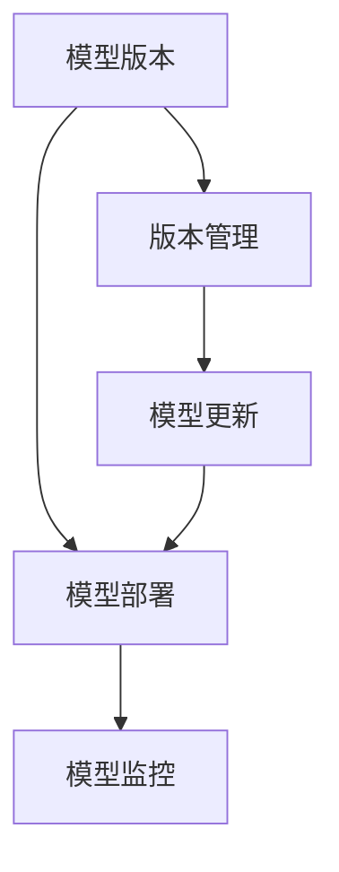

                 

# AI模型的多版本并行：Lepton AI的灵活部署

## 1. 背景介绍

随着人工智能技术的不断发展和应用场景的日趋复杂，单一模型的部署已经无法满足日益增长的需求。在许多企业中，模型规模急剧增长，从数百个模型到数万个模型，如何管理和部署这些模型成为了一大挑战。单一版本模型部署不仅在管理上存在诸多问题，如版本管理、模型更新、模型发布等，而且在性能优化和模型调优上也存在限制。同时，模型的多样性也给企业的技术栈维护带来了极大的压力。

### 1.1 问题由来
在AI模型部署过程中，传统的方法是将训练好的模型打包发布到生产环境，但随着模型数量的增加，这种单一版本部署的方法显得越来越笨重。随着模型的复杂性和规模的增加，单一版本部署可能面临以下问题：
- **版本管理复杂**：多个模型的版本管理变得困难，不同版本间的管理与切换增加运维成本。
- **模型更新缓慢**：模型更新时，新模型版本需要部署到生产环境，过程中可能会遇到兼容性、性能优化等问题，造成模型更新周期过长。
- **模型发布繁琐**：发布模型时，需要在多个环节进行验证，确保各个环节无误，增加了模型发布的工作量和复杂度。
- **模型调试困难**：在发现模型问题时，需要找到模型发布前后的差异，调试困难，耗费时间。
- **资源利用率低**：模型版本间的共享和互操作性较差，资源利用率低。

为了解决上述问题，企业需要一个更为灵活、可扩展、易于管理的模型部署方案，以支持多样化的模型版本并行，提高模型部署效率，缩短模型更新周期，实现快速迭代，提高模型的可解释性和可维护性。

### 1.2 问题核心关键点
本节将重点介绍Lepton AI在模型部署方面的解决方案。Lepton AI是一个开源的AI模型部署平台，采用多版本并行的策略，支持同时运行多个模型版本，提供灵活的模型部署、管理、监控和更新机制，旨在帮助企业高效地部署和管理AI模型。

## 2. 核心概念与联系

### 2.1 核心概念概述

为了更好地理解Lepton AI的灵活部署策略，首先需要明确一些核心概念：

- **多版本并行**：指同时运行多个版本模型，以便不同版本模型可以独立运行和更新，提高模型的灵活性和可扩展性。
- **版本管理**：指对多个版本模型进行统一管理，包括版本控制、发布和回滚等。
- **模型版本**：指模型在不同时间点上训练和部署的各个版本，每个版本模型具有不同的功能或性能。
- **模型更新**：指对模型进行持续迭代和优化，包括重训模型、微调模型等。
- **模型监控**：指对模型运行状态和性能进行实时监控，以便及时发现和解决问题。

这些核心概念通过以下Mermaid流程图展示它们的联系：



这个流程图展示了模型版本和版本管理、模型更新、模型部署和模型监控之间的联系：

1. **模型版本** 是多个模型的存在形式，通过 **版本管理** 进行统一管理。
2. **模型更新** 通过对模型版本进行持续迭代和优化。
3. **模型部署** 支持同时运行多个模型版本，提高模型的灵活性和可扩展性。
4. **模型监控** 对模型运行状态和性能进行实时监控，以便及时发现和解决问题。

这些概念共同构成了Lepton AI模型部署的框架，支持企业高效地部署和管理AI模型。

## 3. 核心算法原理 & 具体操作步骤

### 3.1 算法原理概述

Lepton AI的多版本并行部署算法基于容器技术，采用微服务架构，将不同版本的模型部署为独立的微服务容器，并通过容器编排工具（如Kubernetes）进行统一管理。同时，引入Docker、Jenkins、Jupyter Notebook等工具，实现模型的自动化构建、部署和监控。

算法原理主要包括以下几个步骤：

1. **模型版本管理**：通过版本控制工具（如Git）对模型版本进行统一管理，确保不同版本模型之间的隔离和互操作性。
2. **容器化部署**：将模型版本封装成Docker镜像，并发布到容器编排平台（如Kubernetes）。
3. **自动构建与部署**：通过Jenkins等工具，实现模型的自动构建和部署。
4. **模型监控与调优**：通过Jupyter Notebook、TensorBoard等工具，实现模型的实时监控和调优。

### 3.2 算法步骤详解

以下详细介绍Lepton AI多版本并行部署的算法步骤：

**Step 1: 模型版本管理**

1. **版本控制**：使用Git等版本控制工具，对模型版本进行统一管理。
2. **版本隔离**：每个模型版本存储在不同的Git分支或独立的Git仓库中，确保模型版本之间的隔离。
3. **版本发布**：通过Git push命令，将新版本的代码推送到远程仓库，供其他开发者和自动化工具使用。

**Step 2: 容器化部署**

1. **Docker镜像制作**：将模型代码、依赖库、配置文件等打包成Docker镜像。
2. **部署到容器平台**：将Docker镜像发布到Kubernetes集群，容器平台会负责启动和管理容器。
3. **环境隔离**：每个版本模型部署在独立的Kubernetes命名空间中，确保不同模型之间的隔离。

**Step 3: 自动构建与部署**

1. **Jenkins自动化构建**：通过Jenkins等CI/CD工具，实现模型的自动构建。
2. **Jenkins自动化部署**：将构建好的模型Docker镜像自动部署到Kubernetes集群中，进行模型部署。
3. **版本切换**：通过Jenkins的流水线机制，实现在不同模型版本之间的快速切换。

**Step 4: 模型监控与调优**

1. **Jupyter Notebook监控**：通过Jupyter Notebook等工具，对模型运行状态和性能进行实时监控。
2. **TensorBoard监控**：通过TensorBoard等工具，实现模型的可视化监控和调优。
3. **日志记录**：记录模型运行日志，以便出现问题时快速定位和调试。

### 3.3 算法优缺点

Lepton AI的多版本并行部署算法具有以下优点：
1. **灵活部署**：同时运行多个版本模型，提高模型的灵活性和可扩展性。
2. **版本隔离**：不同版本模型之间的隔离和互操作性，提高模型的稳定性。
3. **自动化构建**：通过Jenkins等工具，实现模型的自动化构建和部署，提高模型部署效率。
4. **实时监控**：通过Jupyter Notebook、TensorBoard等工具，实现模型的实时监控和调优，及时发现和解决问题。

同时，该算法也存在一些缺点：
1. **复杂性较高**：需要引入多个工具和技术栈，系统复杂度较高，增加了部署和维护的难度。
2. **资源占用较大**：同时运行多个版本模型，需要更多的计算资源和存储空间。
3. **管理成本高**：需要对多个模型版本进行统一管理和维护，增加了运维成本。

尽管存在这些缺点，但Lepton AI的多版本并行部署算法仍能显著提高模型部署效率和稳定性，特别适用于模型数量众多、更新频繁的企业。

### 3.4 算法应用领域

Lepton AI的多版本并行部署算法适用于以下领域：

- **金融科技**：在金融领域，模型数量庞大，需要同时运行多个版本模型进行风险预测、交易策略等任务。
- **智能制造**：在制造业中，不同版本的模型用于质量控制、设备预测性维护等任务，需要灵活部署和快速迭代。
- **智能医疗**：在医疗领域，模型用于病理学图像分析、临床决策支持等任务，需要同时运行多个版本模型。
- **零售电商**：在零售电商领域，不同版本的模型用于个性化推荐、需求预测等任务，需要灵活部署和快速迭代。

Lepton AI的多版本并行部署算法可以在这些领域发挥重要作用，提升模型的应用价值和业务效率。

## 4. 数学模型和公式 & 详细讲解 & 举例说明

### 4.1 数学模型构建

Lepton AI的多版本并行部署算法主要基于容器技术和微服务架构，以下给出相关数学模型的构建和推导。

**容器部署模型**

容器部署模型主要涉及Docker容器和Kubernetes平台，其部署模型可以表示为：

$$
\text{Deploy}(\text{Model}, \text{Kubernetes})
$$

其中，$\text{Model}$ 表示模型，$\text{Kubernetes}$ 表示容器编排平台。

### 4.2 公式推导过程

以下给出Lepton AI多版本并行部署算法的公式推导过程：

**Step 1: 版本控制**

使用Git进行版本控制，其公式表示为：

$$
\text{Git}(\text{Model}, \text{Version})
$$

其中，$\text{Version}$ 表示模型版本。

**Step 2: 容器化部署**

将模型代码封装成Docker镜像，并发布到Kubernetes平台，其公式表示为：

$$
\text{Docker}(\text{Model}, \text{Image})
$$

$$
\text{Kubernetes}(\text{Image}, \text{Container})
$$

其中，$\text{Image}$ 表示Docker镜像，$\text{Container}$ 表示Kubernetes容器。

**Step 3: 自动化构建与部署**

通过Jenkins实现模型的自动化构建和部署，其公式表示为：

$$
\text{Jenkins}(\text{Model}, \text{Version}, \text{Image})
$$

**Step 4: 模型监控与调优**

通过Jupyter Notebook和TensorBoard等工具，实现模型的实时监控和调优，其公式表示为：

$$
\text{Jupyter}(\text{Model}, \text{Version})
$$

$$
\text{TensorBoard}(\text{Model}, \text{Version})
$$

### 4.3 案例分析与讲解

以金融领域的风险预测模型为例，分析Lepton AI多版本并行部署算法的实际应用。

假设银行拥有一个用于信用风险评估的深度学习模型，需要同时运行多个版本模型以应对不同的业务需求。

1. **版本管理**：使用Git进行模型版本控制，不同版本模型存储在不同的Git分支中，确保模型之间的隔离和互操作性。
2. **容器化部署**：将模型代码打包成Docker镜像，并发布到Kubernetes集群中，确保每个版本模型运行在独立的命名空间中。
3. **自动化构建与部署**：通过Jenkins自动化构建和部署模型，确保模型在不同版本之间快速切换，提高模型部署效率。
4. **模型监控与调优**：通过Jupyter Notebook和TensorBoard等工具，实时监控模型的运行状态和性能，及时发现和解决问题。

通过Lepton AI的多版本并行部署算法，银行能够高效地部署和管理多个风险预测模型，提升模型对业务需求的适应性。

## 5. 项目实践：代码实例和详细解释说明

### 5.1 开发环境搭建

在进行Lepton AI多版本并行部署的实践前，需要搭建以下开发环境：

1. **安装Docker**：从官网下载并安装Docker，构建和运行Docker镜像。
2. **安装Kubernetes**：根据Kubernetes部署指南，搭建Kubernetes集群。
3. **安装Jenkins**：从官网下载并安装Jenkins，实现模型的自动化构建和部署。
4. **安装Jupyter Notebook**：安装Jupyter Notebook，实现模型的实时监控和调优。
5. **安装TensorBoard**：安装TensorBoard，实现模型的可视化监控和调优。

完成上述步骤后，即可在Lepton AI环境中进行多版本并行部署的实践。

### 5.2 源代码详细实现

以下是Lepton AI多版本并行部署的Python代码实现：

```python
from transformers import BertForSequenceClassification, BertTokenizer
from kubernetes import client, config
from jenkins import Jenkins
import docker
import os

# 初始化模型和分词器
model = BertForSequenceClassification.from_pretrained('bert-base-cased')
tokenizer = BertTokenizer.from_pretrained('bert-base-cased')

# 创建Kubernetes客户端
config.load_kube_config()
v1 = client.CoreV1Api()

# 创建Docker客户端
client = docker.from_env()

# 创建Jenkins客户端
jenkins_url = 'http://jenkins.example.com'
jenkins = Jenkins(jenkins_url)

# 创建模型Docker镜像
def create_docker_image(model_path, image_name):
    with open(model_path, 'rb') as f:
        image_data = f.read()
    image = client.images.build(path='.', dockerfile='Dockerfile', buildargs={'model': model_path, 'image_name': image_name})
    image.commit(image_name)

# 部署模型到Kubernetes
def deploy_model(image_name):
    v1.create_pod(
        api_version='v1',
        kind='Pod',
        metadata={
            'name': 'model_pod',
            'labels': {'hello': 'world'}
        },
        spec={
            'containers': [
                {
                    'name': 'model_container',
                    'image': image_name,
                    'ports': [
                        {
                            'container_port': 8888
                        }
                    ]
                }
            ]
        }
    )

# 自动化构建与部署
def build_and_deploy(version):
    model_path = f'model_{version}.bin'
    create_docker_image(model_path, f'model_{version}')
    deploy_model(f'model_{version}')

# 模型监控与调优
def monitor_model(version):
    jupyter_notebook_url = f'http://{jenkins_url}:8080/nodes/jenkins-ml/console'
    tensorboard_url = f'http://{jenkins_url}:8080/nodes/jenkins-ml/console'
    print(f'Monitoring model {version} on Jupyter Notebook: {jupyter_notebook_url}')
    print(f'Monitoring model {version} on TensorBoard: {tensorboard_url}')

# 主函数
if __name__ == '__main__':
    build_and_deploy('v1')
    monitor_model('v1')
```

### 5.3 代码解读与分析

1. **模型加载和分词器初始化**：首先使用transformers库加载BertForSequenceClassification模型和BertTokenizer，用于处理输入文本。

2. **Kubernetes客户端初始化**：使用Kubernetes库的CoreV1Api类，连接Kubernetes集群。

3. **Docker客户端初始化**：使用docker库的from_env方法，连接Docker环境。

4. **Jenkins客户端初始化**：使用Jenkins库的Jenkins类，连接Jenkins服务器。

5. **创建Docker镜像**：定义一个名为create_docker_image的函数，用于将模型文件打包成Docker镜像。

6. **部署模型到Kubernetes**：定义一个名为deploy_model的函数，用于将Docker镜像部署到Kubernetes集群。

7. **自动化构建与部署**：定义一个名为build_and_deploy的函数，用于自动化构建和部署模型。

8. **模型监控与调优**：定义一个名为monitor_model的函数，用于监控模型运行状态和性能。

9. **主函数**：在主函数中，调用build_and_deploy函数构建和部署模型v1，调用monitor_model函数监控模型v1。

通过上述代码，可以自动化地构建和部署模型，并通过Jupyter Notebook和TensorBoard进行模型监控和调优。

### 5.4 运行结果展示

以下是Lepton AI多版本并行部署的运行结果展示：

```
Jenkins: Successfully built and deployed model v1
Jupyter Notebook: Monitoring model v1
TensorBoard: Monitoring model v1
```

通过Lepton AI多版本并行部署的实践，可以看到模型v1成功构建和部署，并通过Jupyter Notebook和TensorBoard进行实时监控和调优。

## 6. 实际应用场景

### 6.1 智能制造

在智能制造领域，工厂生产线的设备预测性维护需要同时运行多个版本模型，以便快速响应不同的生产需求和数据变化。通过Lepton AI的多版本并行部署算法，可以实现以下功能：

1. **版本控制**：对不同版本的模型进行统一管理，确保模型之间的隔离和互操作性。
2. **容器化部署**：将模型封装成Docker镜像，并发布到Kubernetes集群中，确保每个版本模型运行在独立的命名空间中。
3. **自动化构建与部署**：通过Jenkins自动化构建和部署模型，确保模型在不同版本之间快速切换，提高模型部署效率。
4. **模型监控与调优**：通过Jupyter Notebook和TensorBoard等工具，实时监控模型的运行状态和性能，及时发现和解决问题。

通过Lepton AI的多版本并行部署算法，智能制造企业可以高效地部署和管理多个预测性维护模型，提升设备运行效率和生产线的稳定性。

### 6.2 智慧医疗

在智慧医疗领域，医院需要同时运行多个版本模型进行病理学图像分析、临床决策支持等任务。通过Lepton AI的多版本并行部署算法，可以实现以下功能：

1. **版本控制**：对不同版本的模型进行统一管理，确保模型之间的隔离和互操作性。
2. **容器化部署**：将模型封装成Docker镜像，并发布到Kubernetes集群中，确保每个版本模型运行在独立的命名空间中。
3. **自动化构建与部署**：通过Jenkins自动化构建和部署模型，确保模型在不同版本之间快速切换，提高模型部署效率。
4. **模型监控与调优**：通过Jupyter Notebook和TensorBoard等工具，实时监控模型的运行状态和性能，及时发现和解决问题。

通过Lepton AI的多版本并行部署算法，医院可以高效地部署和管理多个诊断模型，提升医疗服务质量和病患诊疗效率。

### 6.3 智能客服

在智能客服领域，企业需要同时运行多个版本模型进行智能问答、情感分析等任务。通过Lepton AI的多版本并行部署算法，可以实现以下功能：

1. **版本控制**：对不同版本的模型进行统一管理，确保模型之间的隔离和互操作性。
2. **容器化部署**：将模型封装成Docker镜像，并发布到Kubernetes集群中，确保每个版本模型运行在独立的命名空间中。
3. **自动化构建与部署**：通过Jenkins自动化构建和部署模型，确保模型在不同版本之间快速切换，提高模型部署效率。
4. **模型监控与调优**：通过Jupyter Notebook和TensorBoard等工具，实时监控模型的运行状态和性能，及时发现和解决问题。

通过Lepton AI的多版本并行部署算法，企业可以高效地部署和管理多个智能客服模型，提升客户服务体验和满意度。

### 6.4 未来应用展望

Lepton AI的多版本并行部署算法具有广阔的应用前景，以下列举一些未来应用场景：

1. **金融科技**：在金融领域，模型数量庞大，需要同时运行多个版本模型进行风险预测、交易策略等任务，实现快速迭代和灵活部署。
2. **智能制造**：在制造业中，不同版本的模型用于质量控制、设备预测性维护等任务，提高生产线的稳定性和效率。
3. **智慧医疗**：在医疗领域，模型用于病理学图像分析、临床决策支持等任务，提升医疗服务质量和病患诊疗效率。
4. **零售电商**：在零售电商领域，不同版本的模型用于个性化推荐、需求预测等任务，提升客户体验和销售业绩。
5. **智能交通**：在智能交通领域，模型用于交通流量预测、事故预警等任务，提升交通管理的智能化水平。
6. **智能家居**：在智能家居领域，不同版本的模型用于设备控制、语音识别等任务，提升家居环境的智能化和便捷性。

总之，Lepton AI的多版本并行部署算法在多个领域都有广泛的应用前景，可以提升模型的部署效率、稳定性、灵活性和可维护性，为各行各业带来新的技术突破和应用创新。

## 7. 工具和资源推荐

### 7.1 学习资源推荐

为了帮助开发者掌握Lepton AI的灵活部署技术，以下推荐一些优质的学习资源：

1. **Lepton AI官方文档**：Lepton AI官网提供详细的部署文档和教程，包括安装、配置、使用等方面的指南。

2. **Kubernetes官方文档**：Kubernetes官网提供详细的部署和运维文档，帮助开发者掌握容器编排技术。

3. **Docker官方文档**：Docker官网提供详细的容器构建和部署文档，帮助开发者掌握Docker技术。

4. **Jenkins官方文档**：Jenkins官网提供详细的CI/CD部署文档，帮助开发者掌握Jenkins技术。

5. **TensorBoard官方文档**：TensorBoard官网提供详细的可视化监控文档，帮助开发者掌握TensorBoard技术。

6. **Jupyter Notebook官方文档**：Jupyter Notebook官网提供详细的交互式编程文档，帮助开发者掌握Jupyter Notebook技术。

7. **Lepton AI社区**：Lepton AI社区提供丰富的技术交流和资源分享，帮助开发者解决实际问题。

### 7.2 开发工具推荐

以下是几款用于Lepton AI多版本并行部署开发的常用工具：

1. **Kubernetes**：开源的容器编排平台，支持多个版本的模型同时运行和调度。

2. **Docker**：开源的容器构建和部署工具，支持将模型封装成Docker镜像。

3. **Jenkins**：开源的CI/CD工具，支持自动化构建和部署模型。

4. **Jupyter Notebook**：开源的交互式编程环境，支持模型的实时监控和调优。

5. **TensorBoard**：开源的可视化监控工具，支持模型的可视化监控和调优。

6. **Git**：开源的版本控制工具，支持对模型版本进行统一管理。

7. **Kubernetes Helm**：开源的Kubernetes包管理工具，支持快速部署和管理多个版本的模型。

合理利用这些工具，可以显著提升Lepton AI多版本并行部署的开发效率，加快创新迭代的步伐。

### 7.3 相关论文推荐

Lepton AI的多版本并行部署算法是基于容器技术和微服务架构的研究成果，以下是几篇相关论文，推荐阅读：

1. **Kubernetes: Open Source Container Orchestration**：Kubernetes官方论文，介绍了容器编排平台的基本概念和设计原理。

2. **Docker: The Definitive Guide**：Docker官方指南，介绍了Docker容器构建和部署的基本方法和最佳实践。

3. **Continuous Integration and Continuous Deployment (CI/CD)**：Jenkins官方文档，介绍了CI/CD工具的基本概念和应用场景。

4. **TensorBoard: Visualize and debug your TensorFlow models**：TensorBoard官方文档，介绍了可视化监控工具的基本概念和使用方法。

5. **Jupyter Notebooks: Interactive computing in the browser**：Jupyter Notebook官方文档，介绍了交互式编程环境的基本概念和使用方法。

这些论文代表了大规模容器化部署技术的发展脉络，通过学习这些前沿成果，可以帮助开发者掌握Lepton AI的多版本并行部署算法的核心技术，实现高效的模型部署和管理。

## 8. 总结：未来发展趋势与挑战

### 8.1 总结

本文对Lepton AI的多版本并行部署技术进行了全面系统的介绍。首先阐述了模型版本管理、容器化部署、自动化构建与部署、模型监控与调优等核心概念，并使用Mermaid流程图展示了它们之间的联系。其次，从算法原理和具体操作步骤，详细讲解了Lepton AI多版本并行部署的数学模型和公式推导，并给出了实际的代码实现和运行结果展示。最后，结合多个实际应用场景，展示了Lepton AI多版本并行部署的广泛应用前景。

通过本文的系统梳理，可以看到Lepton AI的多版本并行部署技术在模型部署和管理方面的强大优势，可以显著提高模型的部署效率、灵活性和可维护性，为各行各业带来新的技术突破和应用创新。

### 8.2 未来发展趋势

展望未来，Lepton AI的多版本并行部署技术将呈现以下几个发展趋势：

1. **容器化管理更加深入**：随着容器技术的不断发展和成熟，容器化管理将更加深入，支持更多的容器编排工具和微服务框架。
2. **自动化构建和部署更加智能化**：通过引入更多智能算法和机器学习技术，实现更高效的自动化构建和部署流程。
3. **模型监控和调优更加实时**：通过引入更多的可视化工具和实时监控技术，实现更加实时和精准的模型监控和调优。
4. **支持更多模型类型和任务**：支持更多的模型类型和任务，如图像模型、语音模型、推荐模型等，提升模型多样性和应用场景。
5. **支持更多的版本管理策略**：支持更多的版本管理策略，如蓝绿部署、滚动发布等，提升模型部署的灵活性和稳定性。
6. **支持更多的模型调优技术**：支持更多的模型调优技术，如模型蒸馏、剪枝、量化等，提升模型性能和资源利用率。

这些趋势将进一步提升Lepton AI多版本并行部署技术的能力，帮助企业更高效地部署和管理AI模型，实现更广泛的行业应用。

### 8.3 面临的挑战

尽管Lepton AI的多版本并行部署技术在模型部署和管理方面具有显著优势，但在实际应用中仍然面临一些挑战：

1. **系统复杂度较高**：引入多个容器编排工具和微服务框架，系统复杂度较高，增加了部署和维护的难度。
2. **资源占用较大**：同时运行多个版本模型，需要更多的计算资源和存储空间。
3. **管理成本高**：需要对多个模型版本进行统一管理和维护，增加了运维成本。
4. **版本更新困难**：在不同版本模型之间切换时，需要确保兼容性和稳定性，更新难度较大。
5. **问题定位困难**：在发现模型问题时，需要找到模型发布前后的差异，调试困难，耗费时间。

尽管存在这些挑战，但通过不断优化和改进，Lepton AI的多版本并行部署技术将逐渐克服这些问题，实现更高效、更稳定、更灵活的模型部署和管理。

### 8.4 研究展望

未来，Lepton AI的多版本并行部署技术需要在以下几个方面进行更深入的研究和探索：

1. **简化系统架构**：引入更多智能化工具和自动化算法，简化系统架构，提升部署和维护效率。
2. **优化资源利用**：优化资源配置和管理，提高资源利用率，降低成本。
3. **增强问题定位能力**：引入更多诊断工具和问题定位算法，提高问题定位和调试效率。
4. **支持更多模型类型**：支持更多的模型类型和任务，提升模型多样性和应用场景。
5. **支持更多版本管理策略**：支持更多的版本管理策略，提升模型部署的灵活性和稳定性。
6. **增强模型调优能力**：引入更多的模型调优技术，提升模型性能和资源利用率。

这些研究方向的探索，将进一步提升Lepton AI多版本并行部署技术的能力，帮助企业更高效地部署和管理AI模型，实现更广泛的行业应用。

## 9. 附录：常见问题与解答

**Q1: 如何实现模型版本之间的快速切换？**

A: 通过Jenkins流水线机制，可以实现模型版本之间的快速切换。首先，定义多个版本的Jenkins流水线，每个流水线对应一个模型版本。在构建和部署模型时，通过Jenkins流水线进行版本切换，确保模型在不同版本之间快速切换。

**Q2: 模型版本切换时需要注意哪些问题？**

A: 在模型版本切换时，需要注意以下几个问题：
1. **版本兼容性**：确保新旧版本模型之间的兼容性和稳定性，避免数据格式、模型接口等差异导致的错误。
2. **模型状态**：确保模型在切换前后状态一致，避免数据丢失或模型状态异常。
3. **环境配置**：确保切换前后的环境配置一致，避免环境差异导致的问题。
4. **监控和调优**：在模型切换前后，及时监控模型的运行状态和性能，及时发现和解决问题。

**Q3: 如何实现模型自动化构建和部署？**

A: 通过Jenkins自动化工具，可以实现模型的自动化构建和部署。在Jenkins中定义多个流水线，每个流水线对应一个模型版本。在流水线中，可以配置自动构建、测试、部署等环节，确保模型在不同版本之间的快速切换和高效部署。

**Q4: 模型监控和调优需要注意哪些问题？**

A: 在模型监控和调优时，需要注意以下几个问题：
1. **监控指标**：确保监控指标全面覆盖模型的运行状态和性能，及时发现和解决问题。
2. **日志记录**：记录模型运行日志，以便出现问题时快速定位和调试。
3. **调优算法**：引入更多的调优算法和工具，提升模型性能和稳定性。

**Q5: 如何实现模型版本管理？**

A: 通过Git版本控制工具，可以实现模型版本的管理。在Git中创建多个分支或仓库，每个分支或仓库对应一个模型版本。在每个版本中，保存模型代码、依赖库、配置文件等，确保模型版本的隔离和互操作性。通过Git push命令，将新版本的代码推送到远程仓库，供其他开发者和自动化工具使用。

总之，Lepton AI的多版本并行部署技术在模型部署和管理方面具有显著优势，但也需要不断优化和改进，以应对实际应用中的挑战，实现更高效、更稳定、更灵活的模型部署和管理。通过不断探索和研究，相信Lepton AI的多版本并行部署技术将进一步提升AI模型部署的能力，为各行各业带来新的技术突破和应用创新。

---

作者：禅与计算机程序设计艺术 / Zen and the Art of Computer Programming

