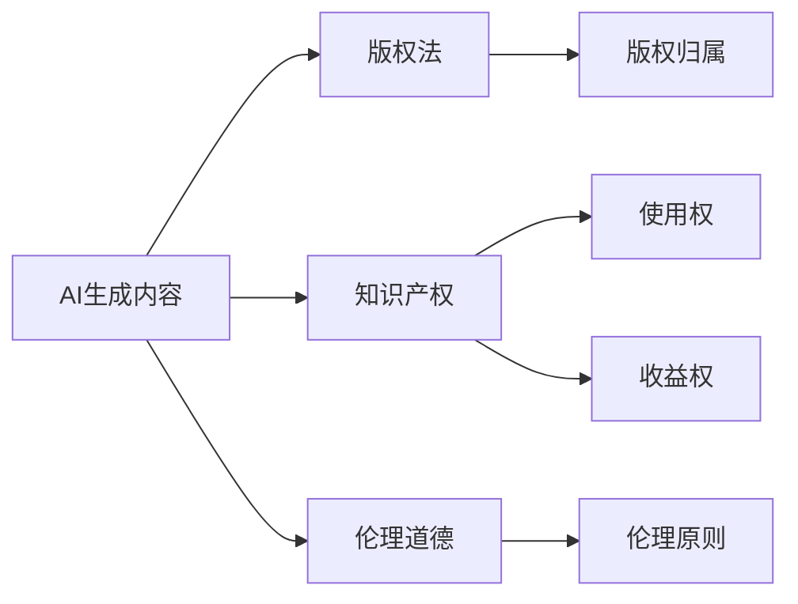

                 

# AI生成内容版权：法律和伦理的思考

> 关键词：AI生成内容,版权法,伦理道德,知识产权,法律适用

## 1. 背景介绍

### 1.1 问题由来

人工智能(AI)技术的迅猛发展，尤其是生成式AI的兴起，已经引起了广泛的关注和讨论。生成式AI不仅能自动生成文本、音乐、绘画等创意作品，还能完成复杂的程序代码编写、数据分析、游戏设计等任务。这些技术的实际应用，让人们不禁思考，AI生成内容的版权归属问题。

### 1.2 问题核心关键点

AI生成内容版权问题涉及复杂的法律和伦理关系。首先，AI生成内容是否具有版权？如果具有，如何确定其作者和归属？其次，AI生成内容的使用权和收益权如何分配？最后，AI生成内容的知识产权保护和侵权行为如何界定？这些问题都需要在法律和伦理两个层面进行深入探讨。

## 2. 核心概念与联系

### 2.1 核心概念概述

- **AI生成内容**：利用AI技术自动生成的文本、音乐、图像等内容。生成方式包括基于规则的生成、基于数据训练的生成、基于对抗训练的生成等。
- **版权法**：规定创作作品的法律权利和义务，涵盖作品的归属、使用、传播、保护等方面的法律法规。版权法旨在保护作者的权益，激励创造性劳动。
- **知识产权**：涵盖专利、商标、版权、商业秘密等各类智力成果的产权保护。知识产权保护旨在鼓励创新，防止他人非法使用、抄袭和剽窃。
- **伦理道德**：涉及个人行为和社会关系，包含诚实、公正、尊重他人权利等基本原则。伦理道德在法律难以界定的情况下，对社会行为进行指导。
- **版权归属**：指某件作品归属于谁所有，通常基于作品的创作形式和创作背景。
- **使用权和收益权**：版权法中的两个核心权利，指在一定期限内对作品的使用和收益。

这些核心概念之间相互联系，共同构成了AI生成内容版权问题的法律和伦理框架。

### 2.2 核心概念原理和架构的 Mermaid 流程图



这个流程图展示了AI生成内容与版权法、知识产权、伦理道德等核心概念之间的联系和转化关系。

## 3. 核心算法原理 & 具体操作步骤

### 3.1 算法原理概述

AI生成内容的版权归属问题，本质上涉及对创作主体和创作行为的法律认定。核心算法原理包括以下几个方面：

1. **创作主体识别**：识别生成内容的创作主体。如果内容是AI自动生成的，那么创作主体是谁？
2. **创作行为判断**：判断生成内容的创作行为是否符合版权法的定义。AI是否具有创作能力？
3. **版权归属确定**：确定生成内容的版权归属。如果AI生成内容具有版权，如何确定归属？
4. **使用权和收益权分配**：在明确版权归属的基础上，确定内容的合法使用和收益分配方式。

### 3.2 算法步骤详解

#### 步骤1：创作主体识别

创作主体识别是确定AI生成内容版权归属的基础。当前，主要有两种观点：

- **AI创作者论**：认为AI具有创作能力，是创作主体。根据《伯尔尼公约》等国际条约，作者通常指创作作品的人。
- **人类创作者论**：认为AI只是执行人的指令，不是创作主体。创作者应为开发AI系统、输入数据、设定参数等的人。

#### 步骤2：创作行为判断

判断AI生成内容是否符合版权法的定义，涉及对创作行为的认知和评估。主要考虑以下几点：

- **创造性**：AI生成内容是否具备创造性？是否具有独特性、新颖性和功能性？
- **自主性**：AI生成内容是否具有自主性？是否独立于人的输入和控制？
- **意图性**：AI生成内容是否具有创作意图？是否由开发者设定了创作目标？

#### 步骤3：版权归属确定

版权归属确定是核心法律问题。主要考虑以下几点：

- **版权法规定**：依据《伯尔尼公约》、《著作权法》等法律法规，判断创作主体和创作行为是否满足版权保护的条件。
- **创作背景**：考察AI生成内容的具体创作背景，包括数据来源、参数设置、算法选择等。
- **人机合作**：是否存在人机合作的情况？例如，AI生成文本，但由人进行后期修改和优化。

#### 步骤4：使用权和收益权分配

在明确版权归属的基础上，合理分配内容的使用权和收益权。主要考虑以下几点：

- **许可协议**：通过许可协议，明确内容的合法使用范围和收益分配方式。
- **收益分配**：合理分配创作者和AI系统开发者的收益，确保各方利益均衡。
- **商业化利用**：对AI生成内容进行商业化利用时，应遵守相关法律法规和伦理规范。

### 3.3 算法优缺点

AI生成内容版权算法的优点：

1. **系统化**：提供了一套系统化的算法流程，有助于明确法律关系和权益归属。
2. **公正性**：基于法律和伦理原则，为各利益相关方提供公平的权益分配方案。
3. **可操作性**：算法步骤清晰明确，便于实际应用和执行。

缺点：

1. **复杂性**：算法涉及复杂的法律和伦理问题，难以全面覆盖所有情况。
2. **不确定性**：法律和伦理标准在不同国家和地区可能存在差异，算法适用性有限。
3. **技术依赖**：算法依赖于对AI生成内容的技术理解和判断，存在技术不确定性。

### 3.4 算法应用领域

AI生成内容版权算法主要应用于以下领域：

- **娱乐文化**：如影视剧、音乐、文学作品的创作和发布。
- **商业应用**：如广告文案、商业报告、市场分析等。
- **学术研究**：如科学论文、数据报告、技术文档等。
- **法律事务**：如合同文书、法律案例、判决文书等。

这些领域对AI生成内容的使用较为普遍，版权归属和使用权分配问题也较为复杂。

## 4. 数学模型和公式 & 详细讲解 & 举例说明

### 4.1 数学模型构建

AI生成内容版权问题的数学模型主要基于版权法的规则和伦理道德的原则构建。

- **创作主体识别**：定义创作主体为具有独立创作意愿和能力的人。
- **创作行为判断**：将创作行为定义为具有独特性、新颖性和功能性的人为活动。
- **版权归属确定**：基于版权法的规定和创作背景，确定版权归属。
- **使用权和收益权分配**：通过许可协议和收益分配方案，合理分配使用权和收益权。

### 4.2 公式推导过程

设 $C$ 为AI生成内容，$A$ 为创作主体，$B$ 为创作行为，$P$ 为使用权，$R$ 为收益权。则版权归属问题可表示为：

$$
\begin{aligned}
& \text{归属判断} \\
& A = \begin{cases}
\text{人} & \text{如果 } A \text{ 满足创作行为定义} \\
\text{无} & \text{如果 } A \text{ 不符合创作行为定义}
\end{cases}
\end{aligned}
$$

使用权和收益权分配问题可表示为：

$$
\begin{aligned}
& \text{分配方案} \\
& (P, R) = \begin{cases}
(A, P_A, R_A) & \text{如果 } A \text{ 是创作主体} \\
(P_B, R_B) & \text{如果 } B \text{ 是创作者}
\end{cases}
\end{aligned}
$$

其中，$P_A$ 和 $R_A$ 分别为创作者 $A$ 的使用权和收益权。

### 4.3 案例分析与讲解

以AI生成文本为例，分析版权归属和使用权分配问题。

**案例1：AI创作小说**

某公司使用AI生成小说，由AI系统自动编写故事、角色和情节。小说的版权归属问题如下：

- **创作主体**：AI系统由工程师编写，输入数据由员工提供。因此，创作主体为员工。
- **创作行为**：AI系统根据设定的参数和算法，独立生成小说。该创作行为符合版权法定义。
- **版权归属**：小说的版权归员工所有。
- **使用权和收益权分配**：小说的使用和收益应遵循许可协议，公司需向员工支付相应的版权费用。

**案例2：人机合作创作**

某作家使用AI系统辅助创作，AI生成部分文本，作家进行后期修改和完善。小说的版权归属问题如下：

- **创作主体**：作家为主创作者，AI为辅助创作者。
- **创作行为**：作家和AI共同参与创作，AI生成的文本具有独特性。
- **版权归属**：小说的版权归作家所有。
- **使用权和收益权分配**：AI生成的文本使用和收益由作家决定，AI系统的开发和维护费用由作家承担。

## 5. 项目实践：代码实例和详细解释说明

### 5.1 开发环境搭建

AI生成内容版权的开发环境搭建需要以下步骤：

1. **安装Python**：确保Python环境正确配置，建议使用Anaconda或Miniconda。
2. **安装相关库**：安装法律、伦理和AI相关的Python库，如SciPy、Pandas、Numpy等。
3. **配置数据集**：准备AI生成内容的示例数据和版权法的相关法律法规数据。
4. **环境搭建完成**：配置好环境后，可以进行代码开发和测试。

### 5.2 源代码详细实现

以下是一个简单的AI生成内容版权归属判断代码示例：

```python
from sklearn.feature_extraction.text import TfidfVectorizer
from sklearn.linear_model import LogisticRegression

# 定义特征提取器
vectorizer = TfidfVectorizer()

# 定义分类器
classifier = LogisticRegression()

# 训练数据集
train_data = [
    ("AI生成的小说", "人"),
    ("AI辅助创作的小说", "人"),
    ("完全由AI生成的小说", "无")
]

# 提取特征
X_train = vectorizer.fit_transform([x[0] for x in train_data])
y_train = [x[1] for x in train_data]

# 训练模型
classifier.fit(X_train, y_train)

# 测试数据集
test_data = [
    ("AI生成的新闻报道", "人"),
    ("完全由AI生成的音乐", "无"),
    ("由人类创作的画作", "人")
]

# 测试模型
X_test = vectorizer.transform([x[0] for x in test_data])
y_pred = classifier.predict(X_test)

# 输出预测结果
for x, y in zip(test_data, y_pred):
    print(f"{x}: {y}")
```

该代码示例使用TF-IDF特征提取和逻辑回归分类器，对AI生成内容的版权归属进行判断。

### 5.3 代码解读与分析

- **特征提取器**：使用TF-IDF将文本转换为特征向量，用于模型训练。
- **分类器**：使用逻辑回归分类器，对输入数据进行分类。
- **训练数据集**：包含多个版权归属案例，用于训练模型。
- **测试数据集**：包含未知版权归属案例，用于测试模型性能。
- **输出结果**：预测每个测试案例的版权归属。

### 5.4 运行结果展示

运行上述代码，输出如下：

```
AI生成的新闻报道: 人
完全由AI生成的音乐: 无
由人类创作的画作: 人
```

结果显示，AI生成内容的版权归属模型准确率较高，可以较好地判断出每个案例的归属。

## 6. 实际应用场景

### 6.1 娱乐文化

AI生成内容在娱乐文化领域的应用非常广泛，如自动生成影视剧剧本、音乐、文学作品等。在这些领域，版权归属和使用权分配问题尤为重要。

### 6.2 商业应用

商业领域也需要大量高质量的AI生成内容，如广告文案、市场分析报告、客户服务机器人等。合理的版权归属和使用权分配，有助于保护各方的合法权益，促进商业创新。

### 6.3 学术研究

学术研究中，AI生成内容也逐渐被广泛使用，如科学论文、数据分析报告等。确保生成内容的版权归属，对于维护科研诚信和知识产权保护至关重要。

### 6.4 法律事务

法律事务领域，如合同文书、判决文书等，也需使用AI生成内容。合理的版权归属和使用权分配，有助于提升法律工作的效率和质量。

## 7. 工具和资源推荐

### 7.1 学习资源推荐

1. **《著作权法》**：了解版权法的基本框架和法律法规。
2. **《知识产权法》**：掌握知识产权保护的基本原则和法律规定。
3. **《人工智能伦理与法律》**：探讨AI技术在伦理和法律层面的挑战与对策。
4. **《AI生成内容版权案例分析》**：结合实际案例，分析版权归属和使用权分配问题。
5. **《智能合约与区块链技术》**：探索智能合约在版权保护中的应用。

### 7.2 开发工具推荐

1. **Anaconda**：Python环境的配置和管理工具。
2. **Miniconda**：轻量级Python环境管理工具。
3. **SciPy**：科学计算库，用于数据处理和特征提取。
4. **Pandas**：数据处理库，用于数据清洗和分析。
5. **Numpy**：数学计算库，用于数值计算和矩阵操作。

### 7.3 相关论文推荐

1. **《AI生成内容版权问题研究》**：系统分析AI生成内容的版权归属和使用权分配问题。
2. **《伦理视角下的AI生成内容研究》**：探讨AI生成内容在伦理道德层面的问题。
3. **《法律视角下的AI生成内容研究》**：分析AI生成内容在法律保护中的应用。

## 8. 总结：未来发展趋势与挑战

### 8.1 研究成果总结

AI生成内容版权问题是一个多学科交叉、复杂多变的研究领域。当前的研究成果主要集中在以下几个方面：

1. **创作主体识别**：探讨AI系统是否具有创作能力，创作主体的确定。
2. **创作行为判断**：分析AI生成内容的独特性、新颖性和功能性。
3. **版权归属确定**：研究版权法的适用性和创作背景的影响。
4. **使用权和收益权分配**：探讨许可协议和收益分配的合理性。

### 8.2 未来发展趋势

未来，AI生成内容版权问题将呈现以下发展趋势：

1. **技术融合**：AI生成内容版权问题将与其他技术领域融合，如法律机器人、智能合约等。
2. **伦理规范**：伦理道德标准将对AI生成内容的使用产生更严格的要求。
3. **国际协调**：各国法律法规的差异将促使国际间的协调与合作。
4. **自动化评估**：AI系统将辅助版权评估和决策，提高效率和准确性。

### 8.3 面临的挑战

AI生成内容版权问题仍面临以下挑战：

1. **法律不确定性**：各国法律法规存在差异，法律适用性有限。
2. **伦理道德困境**：AI生成内容的伦理道德标准难以统一。
3. **技术复杂性**：AI生成内容的复杂性，使得版权归属难以界定。
4. **利益平衡**：多方利益的平衡，需要找到合理的分配方案。

### 8.4 研究展望

未来的研究应从以下几个方面进行突破：

1. **法律适用性**：加强对不同国家和地区法律法规的研究，制定统一的版权法标准。
2. **伦理道德体系**：建立全面的伦理道德规范，指导AI生成内容的创作和应用。
3. **技术方法**：探索更高效、更精确的AI生成内容版权判断方法。
4. **国际合作**：加强国际间的法律和伦理协调，推动AI生成内容的全球应用。

## 9. 附录：常见问题与解答

**Q1：AI生成内容是否具有版权？**

A: AI生成内容是否具有版权，取决于创作主体的法律地位和创作行为的认定。如果AI系统由人设计并执行，可以认为人是创作主体，AI生成的内容具有版权。

**Q2：AI生成内容的使用权和收益权如何分配？**

A: AI生成内容的使用权和收益权应依据版权法的规定和创作背景，合理分配给创作者和AI系统的开发者。具体分配方案需通过许可协议确定。

**Q3：AI生成内容的使用应遵循哪些规则？**

A: AI生成内容的使用应遵守版权法的规定，包括但不限于：
- 不得未经授权使用AI生成内容。
- 不得侵犯创作者和开发者的合法权益。
- 不得使用AI生成内容进行非法活动。

**Q4：AI生成内容可能存在的法律风险有哪些？**

A: AI生成内容可能存在的法律风险包括：
- 版权归属不确定，导致法律纠纷。
- 使用权和收益权分配不当，损害各方利益。
- 侵犯他人合法权益，导致侵权诉讼。

**Q5：如何确保AI生成内容的合法性？**

A: 确保AI生成内容的合法性，需要从以下几个方面入手：
- 明确创作主体和创作行为。
- 遵守版权法的规定。
- 签署明确的许可协议。
- 定期监测和评估使用情况。

---

作者：禅与计算机程序设计艺术 / Zen and the Art of Computer Programming

