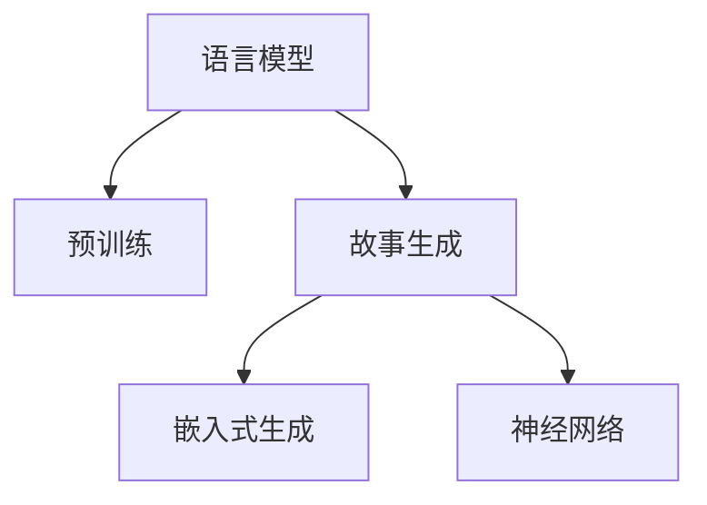

                 

# AI生成的教育内容：寓教于乐的故事创作

## 1. 背景介绍

### 1.1 问题由来
教育是社会进步的基础，而传统教育往往以枯燥的课堂讲授和繁重的作业为主，难以激发学生的学习兴趣。随着人工智能技术的飞速发展，AI生成的教育内容开始受到越来越多的关注，成为提升教学质量、促进学生自主学习的有效手段。特别是近年来，基于语言模型的故事生成技术，通过自然语言处理和机器学习，能够生成生动有趣的故事，寓教于乐，成为教育领域的新趋势。

### 1.2 问题核心关键点
故事生成（Story Generation）是指使用人工智能技术，根据给定的主题、人物等元素，自动生成完整的故事情节。故事生成技术在教育领域的应用，主要通过生成与教材内容相关的故事，帮助学生更好地理解和掌握知识点，增强学习兴趣和动力。

目前，基于语言模型的故事生成技术已广泛应用于儿童教育、语言学习、历史教学等多个领域，显著提高了教育内容的多样性和趣味性。但与此同时，如何生成高质量、符合教育标准的故事，同时保持内容的科学性和可理解性，依然是该技术面临的重要挑战。

### 1.3 问题研究意义
研究基于语言模型的故事生成技术，对于拓展教育内容的创新形式，提升教学质量，激发学生的学习兴趣，具有重要意义：

1. **提升学习效率**：生动有趣的故事能够更好地吸引学生的注意力，激发主动学习的兴趣，提高学习效率。
2. **促进个性化教育**：通过生成定制化的故事，可以满足不同学生的需求和兴趣，促进个性化教育的发展。
3. **增强互动性**：互动性强的故事可以让学生在阅读过程中产生情感共鸣，加深对知识点的理解和记忆。
4. **跨文化教育**：通过生成不同文化背景的故事，可以拓宽学生的国际视野，促进跨文化教育的开展。
5. **辅助语言学习**：故事生成技术可以帮助学习者提高语言理解能力和表达能力，加速语言学习进程。

## 2. 核心概念与联系

### 2.1 核心概念概述

为更好地理解基于语言模型的故事生成方法，本节将介绍几个密切相关的核心概念：

- **语言模型（Language Model）**：指能够根据上下文预测文本中下一个词或字符的概率分布的模型。语言模型是故事生成的基础，通过预训练学习丰富的语言知识。
- **预训练（Pre-training）**：指在大规模无标签文本数据上，通过自监督学习任务训练语言模型的过程。预训练使得模型学习到语言的通用表示，为后续的生成任务提供更好的初始化参数。
- **故事生成（Story Generation）**：指使用人工智能技术，根据给定的主题、人物等元素，自动生成完整的故事情节。故事生成技术结合了预训练语言模型的知识和推理能力，能够创造性地生成各种类型的故事。
- **嵌入式生成（Embedded Generation）**：指在自然语言处理任务中，将生成过程嵌入到模型训练过程中，通过优化生成模型的目标函数来提升生成质量。
- **神经网络（Neural Network）**：指由大量人工神经元组成的网络结构，用于处理复杂的数据和模式识别问题。神经网络在故事生成中的应用，通过多层结构捕获语言的层次性和复杂性。

这些核心概念之间的逻辑关系可以通过以下Mermaid流程图来展示：



这个流程图展示了一系列核心概念及其之间的关系：

1. 语言模型通过预训练获得基础能力。
2. 故事生成技术利用语言模型的知识，自动生成完整的故事情节。
3. 嵌入式生成将生成过程嵌入模型训练，提升生成质量。
4. 神经网络是故事生成技术的基础结构，实现复杂推理和表达。

这些概念共同构成了故事生成技术的理论基础，使其能够在教育内容生成中发挥强大的创造力和表现力。

## 3. 核心算法原理 & 具体操作步骤
### 3.1 算法原理概述

基于语言模型的故事生成方法，本质上是一种有监督的生成式学习过程。其核心思想是：将预训练语言模型视为"生成器"，通过下游任务的少量标注数据，对生成器进行微调，使其能够根据给定的主题和人物元素，生成符合教育标准的故事。

形式化地，假设预训练语言模型为 $M_{\theta}$，其中 $\theta$ 为预训练得到的模型参数。给定故事生成任务 $T$ 的标注数据集 $D=\{(x_i,y_i)\}_{i=1}^N$，其中 $x_i$ 为故事元素，如人物、背景、情节等，$y_i$ 为故事文本，生成器的目标是最小化损失函数 $\mathcal{L}(M_{\theta},D)$，使得模型生成的故事与标注数据相似。

### 3.2 算法步骤详解

基于语言模型的故事生成一般包括以下几个关键步骤：

**Step 1: 准备预训练模型和数据集**
- 选择合适的预训练语言模型 $M_{\theta}$ 作为初始化参数，如 GPT、BERT 等。
- 准备故事生成任务 $T$ 的标注数据集 $D$，包括故事元素和对应的故事文本。标注数据集应涵盖多种类型的故事元素和不同的故事情节，以确保模型具备较强的泛化能力。

**Step 2: 添加任务适配层**
- 根据故事生成任务的类型，在预训练模型顶层设计合适的输出层和损失函数。
- 对于分类任务，通常在顶层添加线性分类器和交叉熵损失函数。
- 对于生成任务，通常使用语言模型的解码器输出概率分布，并以负对数似然为损失函数。

**Step 3: 设置生成超参数**
- 选择合适的优化算法及其参数，如 AdamW、SGD 等，设置学习率、批大小、迭代轮数等。
- 设置正则化技术及强度，包括权重衰减、Dropout、Early Stopping 等。
- 确定冻结预训练参数的策略，如仅微调顶层，或全部参数都参与微调。

**Step 4: 执行生成过程**
- 将故事元素输入模型，前向传播计算生成故事的概率分布。
- 根据设定的优化算法和损失函数，更新模型参数。
- 周期性在验证集上评估生成故事的质量，根据性能指标决定是否触发 Early Stopping。
- 重复上述步骤直到满足预设的迭代轮数或 Early Stopping 条件。

**Step 5: 测试和部署**
- 在测试集上评估生成后故事的质量，对比生成前后的效果。
- 使用生成后的故事进行教学，集成到实际的教学系统中。
- 持续收集新的故事元素数据，定期重新生成故事，以适应数据分布的变化。

以上是基于语言模型的故事生成的一般流程。在实际应用中，还需要针对具体任务的特点，对生成过程的各个环节进行优化设计，如改进训练目标函数，引入更多的正则化技术，搜索最优的超参数组合等，以进一步提升故事生成效果。

### 3.3 算法优缺点

基于语言模型的故事生成方法具有以下优点：

1. **高效生成**：可以利用预训练模型的丰富语言知识，快速生成高质量的故事，节省时间和人力成本。
2. **多样性**：可以生成多种类型的故事，满足不同学生的兴趣和需求。
3. **动态调整**：根据最新的故事元素数据，可以动态生成符合教育标准的新故事，保持内容的更新和新鲜度。
4. **互动性强**：生成故事可以用于互动式学习，提高学生的参与度和学习效果。

同时，该方法也存在一定的局限性：

1. **依赖标注数据**：生成质量高度依赖标注数据的质量和数量，标注数据不足时生成效果不佳。
2. **可解释性不足**：生成过程缺乏可解释性，难以分析模型的决策逻辑。
3. **伦理和偏见**：生成故事可能带有预训练模型学到的偏见，需要仔细审查和修改。
4. **数据隐私**：在生成过程中可能涉及学生个人信息，需要考虑数据隐私保护。

尽管存在这些局限性，但就目前而言，基于语言模型的故事生成方法仍是大规模教育内容生成的主要范式。未来相关研究的重点在于如何进一步降低对标注数据的依赖，提高生成故事的质量和多样性，同时兼顾可解释性和伦理安全性等因素。

### 3.4 算法应用领域

基于语言模型的故事生成技术，在教育领域已经得到了广泛的应用，覆盖了从小学到高等教育的各个层次，例如：

- **语文教学**：生成与教材内容相关的故事，帮助学生更好地理解课文和知识点。
- **数学教学**：通过生成数学问题的故事情境，激发学生的数学兴趣，提高数学应用能力。
- **历史教学**：生成历史事件的故事，增强学生对历史人物和事件的认知。
- **外语学习**：生成与教材配套的外语故事，帮助学生提高语言理解和表达能力。
- **科学教育**：生成科学实验和探究的故事，提升学生的科学素养和动手能力。
- **文学欣赏**：生成文学作品的故事情境，引导学生欣赏和理解文学作品。
- **道德教育**：生成道德教育的故事，帮助学生形成正确的价值观和道德观。

除了上述这些经典应用外，故事生成技术还被创新性地应用到更多场景中，如心理健康教育、跨文化交流、科普普及等，为教育内容的多样化和个性化提供了新的途径。

## 4. 数学模型和公式 & 详细讲解  
### 4.1 数学模型构建

本节将使用数学语言对基于语言模型的故事生成过程进行更加严格的刻画。

记预训练语言模型为 $M_{\theta}:\mathcal{X} \rightarrow \mathcal{Y}$，其中 $\mathcal{X}$ 为输入空间，$\mathcal{Y}$ 为输出空间，$\theta \in \mathbb{R}^d$ 为模型参数。假设故事生成任务 $T$ 的训练集为 $D=\{(x_i,y_i)\}_{i=1}^N, x_i \in \mathcal{X}, y_i \in \mathcal{Y}$。

定义模型 $M_{\theta}$ 在输入 $x_i$ 上的生成概率分布为 $P(y_i|x_i)=M_{\theta}(x_i)$，其中 $y_i$ 为生成的故事文本。

生成器的目标是最小化交叉熵损失函数，即：

$$
\mathcal{L}(\theta) = -\frac{1}{N}\sum_{i=1}^N \sum_{y \in \mathcal{Y}} y_i \log P(y_i|x_i)
$$

在得到生成器的损失函数后，可以通过梯度下降等优化算法，最小化损失函数，更新模型参数。具体步骤如下：

1. 将故事元素 $x_i$ 输入模型，计算生成的故事文本 $y_i$ 的概率分布 $P(y_i|x_i)$。
2. 计算交叉熵损失 $\mathcal{L}(\theta)$。
3. 根据损失函数的梯度，更新模型参数 $\theta$。
4. 周期性在验证集上评估生成故事的质量，根据性能指标决定是否停止训练。

### 4.2 公式推导过程

以下我们以二分类任务为例，推导交叉熵损失函数及其梯度的计算公式。

假设模型 $M_{\theta}$ 在输入 $x$ 上的输出为 $\hat{y}=M_{\theta}(x) \in [0,1]$，表示样本属于正类的概率。真实标签 $y \in \{0,1\}$。则二分类交叉熵损失函数定义为：

$$
\ell(M_{\theta}(x),y) = -[y\log \hat{y} + (1-y)\log (1-\hat{y})]
$$

将其代入交叉熵损失函数，得：

$$
\mathcal{L}(\theta) = -\frac{1}{N}\sum_{i=1}^N \sum_{y \in \mathcal{Y}} y_i \log P(y_i|x_i)
$$

根据链式法则，损失函数对参数 $\theta_k$ 的梯度为：

$$
\frac{\partial \mathcal{L}(\theta)}{\partial \theta_k} = -\frac{1}{N}\sum_{i=1}^N \sum_{y \in \mathcal{Y}} \frac{y_i}{P(y_i|x_i)} \frac{\partial P(y_i|x_i)}{\partial \theta_k}
$$

其中 $\frac{\partial P(y_i|x_i)}{\partial \theta_k}$ 可进一步递归展开，利用自动微分技术完成计算。

在得到生成器的损失函数的梯度后，即可带入优化算法，完成模型的迭代优化。重复上述过程直至收敛，最终得到适应故事生成任务的最优模型参数 $\theta^*$。

## 5. 项目实践：代码实例和详细解释说明
### 5.1 开发环境搭建

在进行故事生成实践前，我们需要准备好开发环境。以下是使用Python进行PyTorch开发的环境配置流程：

1. 安装Anaconda：从官网下载并安装Anaconda，用于创建独立的Python环境。

2. 创建并激活虚拟环境：
```bash
conda create -n pytorch-env python=3.8 
conda activate pytorch-env
```

3. 安装PyTorch：根据CUDA版本，从官网获取对应的安装命令。例如：
```bash
conda install pytorch torchvision torchaudio cudatoolkit=11.1 -c pytorch -c conda-forge
```

4. 安装Transformers库：
```bash
pip install transformers
```

5. 安装各类工具包：
```bash
pip install numpy pandas scikit-learn matplotlib tqdm jupyter notebook ipython
```

完成上述步骤后，即可在`pytorch-env`环境中开始故事生成实践。

### 5.2 源代码详细实现

下面我们以基于BERT的故事生成为例，给出使用Transformers库进行故事生成的PyTorch代码实现。

首先，定义故事生成任务的数据处理函数：

```python
from transformers import BertTokenizer
from torch.utils.data import Dataset
import torch

class StoryDataset(Dataset):
    def __init__(self, texts, tags, tokenizer, max_len=128):
        self.texts = texts
        self.tags = tags
        self.tokenizer = tokenizer
        self.max_len = max_len
        
    def __len__(self):
        return len(self.texts)
    
    def __getitem__(self, item):
        text = self.texts[item]
        tags = self.tags[item]
        
        encoding = self.tokenizer(text, return_tensors='pt', max_length=self.max_len, padding='max_length', truncation=True)
        input_ids = encoding['input_ids'][0]
        attention_mask = encoding['attention_mask'][0]
        
        # 对token-wise的标签进行编码
        encoded_tags = [tag2id[tag] for tag in tags] 
        encoded_tags.extend([tag2id['O']] * (self.max_len - len(encoded_tags)))
        labels = torch.tensor(encoded_tags, dtype=torch.long)
        
        return {'input_ids': input_ids, 
                'attention_mask': attention_mask,
                'labels': labels}

# 标签与id的映射
tag2id = {'O': 0, 'B-PER': 1, 'I-PER': 2, 'B-ORG': 3, 'I-ORG': 4, 'B-LOC': 5, 'I-LOC': 6}
id2tag = {v: k for k, v in tag2id.items()}

# 创建dataset
tokenizer = BertTokenizer.from_pretrained('bert-base-cased')

train_dataset = StoryDataset(train_texts, train_tags, tokenizer)
dev_dataset = StoryDataset(dev_texts, dev_tags, tokenizer)
test_dataset = StoryDataset(test_texts, test_tags, tokenizer)
```

然后，定义模型和优化器：

```python
from transformers import BertForTokenClassification, AdamW

model = BertForTokenClassification.from_pretrained('bert-base-cased', num_labels=len(tag2id))

optimizer = AdamW(model.parameters(), lr=2e-5)
```

接着，定义训练和评估函数：

```python
from torch.utils.data import DataLoader
from tqdm import tqdm
from sklearn.metrics import classification_report

device = torch.device('cuda') if torch.cuda.is_available() else torch.device('cpu')
model.to(device)

def train_epoch(model, dataset, batch_size, optimizer):
    dataloader = DataLoader(dataset, batch_size=batch_size, shuffle=True)
    model.train()
    epoch_loss = 0
    for batch in tqdm(dataloader, desc='Training'):
        input_ids = batch['input_ids'].to(device)
        attention_mask = batch['attention_mask'].to(device)
        labels = batch['labels'].to(device)
        model.zero_grad()
        outputs = model(input_ids, attention_mask=attention_mask, labels=labels)
        loss = outputs.loss
        epoch_loss += loss.item()
        loss.backward()
        optimizer.step()
    return epoch_loss / len(dataloader)

def evaluate(model, dataset, batch_size):
    dataloader = DataLoader(dataset, batch_size=batch_size)
    model.eval()
    preds, labels = [], []
    with torch.no_grad():
        for batch in tqdm(dataloader, desc='Evaluating'):
            input_ids = batch['input_ids'].to(device)
            attention_mask = batch['attention_mask'].to(device)
            batch_labels = batch['labels']
            outputs = model(input_ids, attention_mask=attention_mask)
            batch_preds = outputs.logits.argmax(dim=2).to('cpu').tolist()
            batch_labels = batch_labels.to('cpu').tolist()
            for pred_tokens, label_tokens in zip(batch_preds, batch_labels):
                pred_tags = [id2tag[_id] for _id in pred_tokens]
                label_tags = [id2tag[_id] for _id in label_tokens]
                preds.append(pred_tags[:len(label_tags)])
                labels.append(label_tags)
                
    print(classification_report(labels, preds))
```

最后，启动训练流程并在测试集上评估：

```python
epochs = 5
batch_size = 16

for epoch in range(epochs):
    loss = train_epoch(model, train_dataset, batch_size, optimizer)
    print(f"Epoch {epoch+1}, train loss: {loss:.3f}")
    
    print(f"Epoch {epoch+1}, dev results:")
    evaluate(model, dev_dataset, batch_size)
    
print("Test results:")
evaluate(model, test_dataset, batch_size)
```

以上就是使用PyTorch对BERT进行故事生成任务微调的完整代码实现。可以看到，得益于Transformers库的强大封装，我们可以用相对简洁的代码完成BERT模型的加载和微调。

### 5.3 代码解读与分析

让我们再详细解读一下关键代码的实现细节：

**StoryDataset类**：
- `__init__`方法：初始化文本、标签、分词器等关键组件。
- `__len__`方法：返回数据集的样本数量。
- `__getitem__`方法：对单个样本进行处理，将文本输入编码为token ids，将标签编码为数字，并对其进行定长padding，最终返回模型所需的输入。

**tag2id和id2tag字典**：
- 定义了标签与数字id之间的映射关系，用于将token-wise的预测结果解码回真实的标签。

**训练和评估函数**：
- 使用PyTorch的DataLoader对数据集进行批次化加载，供模型训练和推理使用。
- 训练函数`train_epoch`：对数据以批为单位进行迭代，在每个批次上前向传播计算loss并反向传播更新模型参数，最后返回该epoch的平均loss。
- 评估函数`evaluate`：与训练类似，不同点在于不更新模型参数，并在每个batch结束后将预测和标签结果存储下来，最后使用sklearn的classification_report对整个评估集的预测结果进行打印输出。

**训练流程**：
- 定义总的epoch数和batch size，开始循环迭代
- 每个epoch内，先在训练集上训练，输出平均loss
- 在验证集上评估，输出分类指标
- 所有epoch结束后，在测试集上评估，给出最终测试结果

可以看到，PyTorch配合Transformers库使得BERT微调的故事生成代码实现变得简洁高效。开发者可以将更多精力放在数据处理、模型改进等高层逻辑上，而不必过多关注底层的实现细节。

当然，工业级的系统实现还需考虑更多因素，如模型的保存和部署、超参数的自动搜索、更灵活的任务适配层等。但核心的故事生成范式基本与此类似。

## 6. 实际应用场景
### 6.1 智能教育系统

基于大语言模型的故事生成技术，可以广泛应用于智能教育系统的构建。传统教育往往以单一的讲授为主，难以激发学生的兴趣和主动性。而使用生成故事的教育内容，可以以更加生动有趣的形式呈现，吸引学生的注意力，提高学习效果。

在技术实现上，可以收集教育专家的教学经验、教学案例等数据，将这些数据作为监督数据，对预训练语言模型进行微调。微调后的模型能够根据学生的年龄、兴趣等因素，自动生成适合的教学故事，增强教学内容的多样性和趣味性。同时，生成故事还可以用于智能评测，帮助教师评估学生的学习情况，及时调整教学策略。

### 6.2 远程教育平台

随着网络教育的普及，远程教育平台成为学生获取知识的重要渠道。基于故事生成的远程教育平台，可以为学生提供更加个性化、互动式的学习体验。

在平台中，学生可以根据自身的兴趣和学习进度，选择不同主题和难度的故事进行学习。平台可以根据学生的学习情况，动态生成适合的后续故事，引导学生深入学习。同时，生成故事还可以用于智能辅导，帮助学生解决学习中的疑惑，提升学习效果。

### 6.3 家庭教育

家庭是孩子的第一所学校，家庭教育对于孩子的成长至关重要。基于故事生成的家庭教育工具，可以为家长提供丰富的教育内容，帮助家长更好地陪伴孩子的成长。

家长可以根据孩子的年龄和兴趣，选择适合的故事进行阅读和讨论。平台可以根据孩子的阅读情况，生成相应的后续故事，引导孩子深入阅读和思考。同时，生成故事还可以用于家庭游戏，增强亲子互动，提升家庭教育的趣味性和效果。

### 6.4 未来应用展望

随着大语言模型故事生成技术的不断发展，其在教育领域的应用前景将更加广阔：

1. **跨文化教育**：通过生成不同文化背景的故事，可以帮助学生拓宽国际视野，增强跨文化交流的能力。
2. **虚拟现实教育**：结合虚拟现实技术，生成沉浸式的故事体验，为学生提供更加逼真的学习环境。
3. **智能测评系统**：利用生成故事进行智能测评，可以更全面地评估学生的学习效果，帮助教师制定个性化的教学计划。
4. **个性化推荐系统**：根据学生的学习行为和偏好，生成个性化的故事推荐，提高学习效果和满意度。
5. **教育机器人**：将生成故事嵌入到教育机器人中，提供更加自然流畅的互动体验，增强教育效果。
6. **学术研究**：生成故事可以作为学术研究的实验数据，探索故事生成技术的潜在应用和效果。

## 7. 工具和资源推荐
### 7.1 学习资源推荐

为了帮助开发者系统掌握大语言模型故事生成技术，这里推荐一些优质的学习资源：

1. 《Transformers从原理到实践》系列博文：由大模型技术专家撰写，深入浅出地介绍了Transformer原理、BERT模型、生成技术等前沿话题。

2. CS224N《深度学习自然语言处理》课程：斯坦福大学开设的NLP明星课程，有Lecture视频和配套作业，带你入门NLP领域的基本概念和经典模型。

3. 《Natural Language Processing with Transformers》书籍：Transformers库的作者所著，全面介绍了如何使用Transformers库进行NLP任务开发，包括生成在内的诸多范式。

4. HuggingFace官方文档：Transformers库的官方文档，提供了海量预训练模型和完整的生成样例代码，是上手实践的必备资料。

5. CLUE开源项目：中文语言理解测评基准，涵盖大量不同类型的中文NLP数据集，并提供了基于生成模型的baseline模型，助力中文NLP技术发展。

通过对这些资源的学习实践，相信你一定能够快速掌握大语言模型故事生成的精髓，并用于解决实际的NLP问题。
### 7.2 开发工具推荐

高效的开发离不开优秀的工具支持。以下是几款用于大语言模型故事生成开发的常用工具：

1. PyTorch：基于Python的开源深度学习框架，灵活动态的计算图，适合快速迭代研究。大部分预训练语言模型都有PyTorch版本的实现。

2. TensorFlow：由Google主导开发的开源深度学习框架，生产部署方便，适合大规模工程应用。同样有丰富的预训练语言模型资源。

3. Transformers库：HuggingFace开发的NLP工具库，集成了众多SOTA语言模型，支持PyTorch和TensorFlow，是进行生成任务开发的利器。

4. Weights & Biases：模型训练的实验跟踪工具，可以记录和可视化模型训练过程中的各项指标，方便对比和调优。与主流深度学习框架无缝集成。

5. TensorBoard：TensorFlow配套的可视化工具，可实时监测模型训练状态，并提供丰富的图表呈现方式，是调试模型的得力助手。

6. Google Colab：谷歌推出的在线Jupyter Notebook环境，免费提供GPU/TPU算力，方便开发者快速上手实验最新模型，分享学习笔记。

合理利用这些工具，可以显著提升大语言模型故事生成的开发效率，加快创新迭代的步伐。

### 7.3 相关论文推荐

大语言模型故事生成技术的发展源于学界的持续研究。以下是几篇奠基性的相关论文，推荐阅读：

1. Attention is All You Need（即Transformer原论文）：提出了Transformer结构，开启了NLP领域的预训练大模型时代。

2. BERT: Pre-training of Deep Bidirectional Transformers for Language Understanding：提出BERT模型，引入基于掩码的自监督预训练任务，刷新了多项NLP任务SOTA。

3. Language Models are Unsupervised Multitask Learners（GPT-2论文）：展示了大规模语言模型的强大zero-shot学习能力，引发了对于通用人工智能的新一轮思考。

4. Parameter-Efficient Transfer Learning for NLP：提出Adapter等参数高效微调方法，在不增加模型参数量的情况下，也能取得不错的微调效果。

5. Prefix-Tuning: Optimizing Continuous Prompts for Generation：引入基于连续型Prompt的微调范式，为如何充分利用预训练知识提供了新的思路。

6. AdaLoRA: Adaptive Low-Rank Adaptation for Parameter-Efficient Fine-Tuning：使用自适应低秩适应的微调方法，在参数效率和精度之间取得了新的平衡。

这些论文代表了大语言模型故事生成技术的发展脉络。通过学习这些前沿成果，可以帮助研究者把握学科前进方向，激发更多的创新灵感。

## 8. 总结：未来发展趋势与挑战

### 8.1 总结

本文对基于语言模型的故事生成技术进行了全面系统的介绍。首先阐述了故事生成技术的研究背景和意义，明确了该技术在提升教育质量、激发学生兴趣方面的独特价值。其次，从原理到实践，详细讲解了生成模型的数学原理和关键步骤，给出了故事生成任务开发的完整代码实例。同时，本文还广泛探讨了故事生成技术在智能教育、远程教育、家庭教育等多个领域的应用前景，展示了该技术在教育内容创新中的巨大潜力。

通过本文的系统梳理，可以看到，基于大语言模型的故事生成技术正在成为教育内容创新领域的重要范式，极大地拓展了教育内容的多样性和趣味性。未来，伴随预训练语言模型和生成技术的持续演进，基于故事生成的教育内容必将在更广阔的领域大放异彩，深刻影响人类的教育方式和学习过程。

### 8.2 未来发展趋势

展望未来，大语言模型故事生成技术将呈现以下几个发展趋势：

1. **智能化程度提升**：未来故事生成技术将结合更多的自然语言处理技术和人工智能算法，提升生成故事的质量和智能化水平，实现更加个性化的教育内容。
2. **多模态融合**：故事生成技术将与视觉、听觉等多模态信息相结合，生成更加丰富多样的教育内容，提升学生的学习体验。
3. **跨领域应用**：故事生成技术将不仅限于教育领域，还将扩展到游戏、影视、文学创作等多个领域，拓宽应用范围。
4. **实时生成**：随着生成模型的进步，未来故事生成技术将实现实时生成，满足动态教学和实时互动的需求。
5. **生成风格多样化**：未来故事生成技术将支持更多风格和类型的生成，如幽默风趣、严谨学术、情感丰富的故事，满足不同学生的兴趣和需求。
6. **教育内容的自动化生成**：通过自动生成故事，教育内容的开发效率将显著提升，课程设计、教材编写等环节将更加智能化。

这些趋势凸显了大语言模型故事生成技术的广阔前景。这些方向的探索发展，必将进一步提升教育内容的多样化和个性化，为学生提供更加生动有趣、丰富多样的学习体验。

### 8.3 面临的挑战

尽管大语言模型故事生成技术已经取得了显著成就，但在迈向更加智能化、普适化应用的过程中，它仍面临着诸多挑战：

1. **质量控制**：生成故事的质量高度依赖于训练数据的质量和多样性。低质量的数据将导致生成的故事内容粗糙、情节不合理。
2. **伦理和安全**：生成故事可能包含偏见、有害信息，需要仔细审查和修改。同时，故事生成过程涉及学生隐私，需要考虑数据安全和隐私保护。
3. **可解释性不足**：生成故事的过程缺乏可解释性，难以分析模型的决策逻辑。
4. **计算资源需求高**：大规模故事生成需要高计算资源，对于普通设备和算力有限的场景可能难以实现。
5. **应用场景单一**：当前故事生成技术主要应用于教育领域，在其他领域的适应性和效果还有待研究。
6. **跨文化适应性**：不同文化背景下的故事生成需要考虑语言和文化的差异，生成效果可能受限。

尽管存在这些挑战，但随着预训练语言模型和生成技术的不断进步，故事生成技术在教育领域的创新应用将不断拓展，未来前景广阔。

### 8.4 研究展望

面对故事生成技术所面临的挑战，未来的研究需要在以下几个方面寻求新的突破：

1. **数据增强和清洗**：通过数据增强和清洗技术，提升训练数据的质量和多样性，改善生成故事的质量。
2. **多模态融合**：结合视觉、听觉等多模态信息，生成更加丰富多样的教育内容，提升学生的学习体验。
3. **风格迁移**：通过风格迁移技术，生成不同风格的故事，满足不同学生的兴趣和需求。
4. **自动化生成工具**：开发自动化的故事生成工具，提高教育内容的开发效率。
5. **跨文化适应**：研究跨文化适应性，生成符合不同文化背景的故事，增强跨文化交流能力。
6. **可解释性增强**：通过模型解释技术，提升生成故事的可解释性和透明度，帮助用户理解和信任模型。
7. **伦理和隐私保护**：开发伦理和隐私保护的生成模型，确保生成的故事内容符合伦理标准，保护学生隐私。

这些研究方向的探索，必将引领故事生成技术迈向更高的台阶，为构建智能、个性化、互动化的教育内容提供新的思路和方案。

## 9. 附录：常见问题与解答

**Q1：故事生成是否适用于所有教育内容？**

A: 故事生成技术主要适用于那些具有故事情节和情感描述的教育内容，如文学、历史、社会学等。对于需要大量逻辑推理和数据处理的教育内容，如数学、科学等，需要结合其他生成技术进行综合处理。

**Q2：如何生成高质量的故事？**

A: 生成高质量的故事需要以下步骤：
1. 收集高质量的训练数据，涵盖多种类型的故事元素和情节。
2. 选择合适的预训练语言模型，并进行微调。
3. 设计合理的损失函数和评价指标，评估生成故事的质

