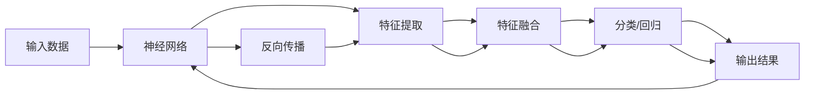

                 

# AI的链式推理能力及其应用前景

> 关键词：链式推理,神经网络,深度学习,推理引擎,自适应推理,增强学习

## 1. 背景介绍

### 1.1 问题由来

在深度学习领域，推理能力一直是研究热点之一。特别是近年来，基于神经网络架构的深度学习模型在图像识别、自然语言处理等领域取得了突破性进展。这类模型通过多层次的特征提取和融合，能够捕捉输入数据中的复杂关系，并以此为基础进行分类、回归、生成等任务。

链式推理能力是指利用神经网络对数据进行自适应、多层次的推理过程，从而实现更加复杂的推理和决策。与传统的符号推理不同，神经网络模型通过训练可以自适应学习新的知识，并且能够在各种复杂的场景下进行高效推理。因此，如何设计和优化神经网络的链式推理能力，成为当前深度学习研究的一个重要方向。

### 1.2 问题核心关键点

在神经网络中，链式推理能力通常通过多个层次的特征提取、特征融合、分类等操作实现。这一过程中，不同层次之间通过共享权重、梯度传递等机制，相互影响、相互增强，从而形成了一种递归的、自适应的推理结构。因此，链式推理能力的提升，需要考虑以下几个关键点：

- 模型结构的合理设计：如何通过网络结构的优化，增强链式推理能力，使其在多种场景下具有更好的泛化能力。
- 特征提取与融合的优化：如何利用多层次的特征提取和融合，构建更强大的模型表示，提升链式推理的精确度。
- 梯度传递的优化：如何通过合理的梯度传递机制，使不同层次之间的特征和信息能够有效传递和共享，避免梯度消失或爆炸等问题。
- 推理过程的自适应性：如何通过增强学习等技术，使模型在实际推理过程中能够自适应调整推理策略，提高推理的灵活性和准确性。

这些关键点相互交织，共同影响着神经网络模型的链式推理能力。

## 2. 核心概念与联系

### 2.1 核心概念概述

在探讨链式推理能力之前，我们需要先理解一些核心概念及其相互之间的联系：

- **神经网络**：一种基于反向传播算法训练的深度学习模型，通过多个层次的特征提取和融合，实现复杂的数据处理和推理。
- **链式推理**：神经网络模型对输入数据进行自适应、递归的推理过程，能够捕捉数据中的复杂关系，并进行精准的分类、回归、生成等任务。
- **深度学习**：一种利用多层神经网络模型进行特征提取、特征融合的机器学习方法，旨在构建具有强大推理能力的模型。
- **推理引擎**：负责计算神经网络模型的前向和后向传播过程，实现链式推理的引擎和工具。
- **自适应推理**：神经网络模型在实际推理过程中，能够根据输入数据的特点自适应调整推理策略，以应对不同的场景和问题。
- **增强学习**：一种利用奖励反馈机制，使模型在不断试错中优化推理策略的机器学习方法。

这些核心概念构成了神经网络模型的链式推理能力的基础，相互之间通过不同的机制和算法，共同实现复杂的数据处理和推理。

### 2.2 核心概念原理和架构的 Mermaid 流程图



这个流程图展示了神经网络模型的链式推理过程：输入数据通过神经网络的多层次特征提取和融合，形成初步的表示。然后，分类或回归操作对表示进行处理，最终输出结果。同时，反向传播算法通过梯度传递，调整各个层次的权重，实现链式推理能力的优化。

## 3. 核心算法原理 & 具体操作步骤
### 3.1 算法原理概述

链式推理能力的实现主要依赖于神经网络的结构和训练方式。以下是实现链式推理的主要算法原理：

- **多层感知机（MLP）**：一种基本的多层次神经网络结构，通过多层的全连接网络实现特征提取和分类。
- **卷积神经网络（CNN）**：一种专门用于图像处理的多层次神经网络结构，通过卷积操作实现特征提取和融合。
- **循环神经网络（RNN）**：一种能够处理序列数据的神经网络结构，通过循环连接实现对时间序列数据的特征提取和预测。
- **长短时记忆网络（LSTM）**：一种特殊的循环神经网络，通过门控机制实现对长期依赖关系的处理。
- **深度残差网络（ResNet）**：一种通过残差连接解决深度网络梯度消失问题的神经网络结构，能够实现更深的层次特征提取。
- **自注意力机制（Self-Attention）**：一种通过自注意力机制实现特征提取和融合的神经网络结构，能够高效地处理长序列数据。
- **变分自编码器（VAE）**：一种通过变分自编码器实现对数据分布建模的神经网络结构，能够生成具有高度可解释性的特征表示。

### 3.2 算法步骤详解

基于上述算法原理，链式推理能力的实现通常包括以下几个关键步骤：

**Step 1: 准备数据和模型**

- 收集和处理训练数据，将其转化为神经网络模型所需的形式。
- 设计合适的神经网络模型结构，确定各层次的特征提取和融合方式。

**Step 2: 模型训练**

- 使用训练数据对模型进行前向传播和反向传播，调整各个层次的权重。
- 采用合适的损失函数和优化算法，最小化模型在训练数据上的误差。

**Step 3: 推理计算**

- 使用模型对新的输入数据进行前向传播，实现特征提取和特征融合。
- 通过分类或回归操作，对特征表示进行处理，输出结果。

**Step 4: 模型评估和优化**

- 使用测试数据对模型进行评估，计算误差指标。
- 根据评估结果，调整模型结构或训练方式，优化链式推理能力。

### 3.3 算法优缺点

链式推理能力的实现，具有以下几个优点：

- **强大的表示能力**：神经网络模型能够自动学习数据中的复杂关系，实现高效的特征提取和融合。
- **灵活的推理方式**：通过调整模型结构和训练方式，可以适应不同的数据和问题，实现自适应的链式推理。
- **高效的计算能力**：神经网络模型能够并行计算，在硬件加速的支持下，实现高效的推理和决策。

同时，链式推理能力的实现也存在一些缺点：

- **高计算成本**：神经网络模型通常具有较大的参数规模，需要大量的计算资源进行训练和推理。
- **模型复杂性**：神经网络模型的结构和训练方式较为复杂，需要较强的算法和数学基础。
- **难以解释**：神经网络模型通常被视为"黑盒"系统，难以解释其内部推理过程和决策依据。
- **鲁棒性问题**：神经网络模型在处理噪声、异常值等复杂数据时，可能出现鲁棒性不足的问题。

### 3.4 算法应用领域

链式推理能力的实现，在以下几个领域具有广泛的应用前景：

- **自然语言处理（NLP）**：通过神经网络模型实现语言理解、生成、翻译等任务。
- **计算机视觉（CV）**：通过卷积神经网络（CNN）实现图像分类、检测、分割等任务。
- **语音识别**：通过循环神经网络（RNN）实现语音识别、转录等任务。
- **推荐系统**：通过自注意力机制（Self-Attention）实现用户行为分析、推荐结果生成等任务。
- **游戏AI**：通过增强学习（Reinforcement Learning）实现游戏策略学习、决策生成等任务。

## 4. 数学模型和公式 & 详细讲解 & 举例说明
### 4.1 数学模型构建

链式推理能力的实现，可以通过以下数学模型进行描述：

设输入数据为 $x$，神经网络模型为 $f(\cdot)$，特征表示为 $h$，分类结果为 $y$。则链式推理过程可以表示为：

$$
h = f(x) \\
y = g(h)
$$

其中 $f(\cdot)$ 和 $g(\cdot)$ 分别为特征提取和分类操作。

### 4.2 公式推导过程

对于多层感知机（MLP）模型，其前向传播过程可以表示为：

$$
z_1 = W_1x + b_1 \\
a_1 = \sigma(z_1) \\
z_2 = W_2a_1 + b_2 \\
a_2 = \sigma(z_2) \\
y = W_3a_2 + b_3
$$

其中 $\sigma(\cdot)$ 为激活函数，$W$ 和 $b$ 分别为权重和偏置项。

### 4.3 案例分析与讲解

以图像分类任务为例，卷积神经网络（CNN）通过卷积层、池化层、全连接层等操作实现链式推理。

**Step 1: 卷积层**

- 通过卷积核对输入图像进行特征提取，得到特征图。
- 卷积核的参数可以学习得到，因此可以自动适应不同的特征提取需求。

**Step 2: 池化层**

- 通过最大池化或平均池化操作，对特征图进行降维处理。
- 池化操作能够增强模型的鲁棒性和泛化能力。

**Step 3: 全连接层**

- 将特征图展开为向量，通过全连接层实现分类。
- 全连接层的参数可以学习得到，因此可以自动适应分类任务。

## 5. 项目实践：代码实例和详细解释说明
### 5.1 开发环境搭建

在进行链式推理能力实践前，我们需要准备好开发环境。以下是使用Python进行TensorFlow开发的环境配置流程：

1. 安装Anaconda：从官网下载并安装Anaconda，用于创建独立的Python环境。

2. 创建并激活虚拟环境：
```bash
conda create -n tf-env python=3.8 
conda activate tf-env
```

3. 安装TensorFlow：根据CUDA版本，从官网获取对应的安装命令。例如：
```bash
conda install tensorflow tensorflow-gpu=2.6 -c conda-forge
```

4. 安装Keras：
```bash
pip install keras
```

5. 安装各类工具包：
```bash
pip install numpy pandas scikit-learn matplotlib tqdm jupyter notebook ipython
```

完成上述步骤后，即可在`tf-env`环境中开始链式推理能力实践。

### 5.2 源代码详细实现

这里我们以图像分类任务为例，给出使用TensorFlow和Keras进行卷积神经网络（CNN）模型训练的PyTorch代码实现。

首先，定义CNN模型：

```python
from keras.models import Sequential
from keras.layers import Conv2D, MaxPooling2D, Flatten, Dense

model = Sequential()
model.add(Conv2D(32, (3, 3), activation='relu', input_shape=(28, 28, 1)))
model.add(MaxPooling2D((2, 2)))
model.add(Conv2D(64, (3, 3), activation='relu'))
model.add(MaxPooling2D((2, 2)))
model.add(Conv2D(64, (3, 3), activation='relu'))
model.add(Flatten())
model.add(Dense(64, activation='relu'))
model.add(Dense(10, activation='softmax'))
```

然后，定义损失函数和优化器：

```python
from keras.losses import categorical_crossentropy
from keras.optimizers import RMSprop

loss_fn = categorical_crossentropy
optimizer = RMSprop(lr=0.001)
```

接着，定义训练和评估函数：

```python
import numpy as np
import matplotlib.pyplot as plt
from keras.utils import to_categorical

def train_epoch(model, X_train, y_train, X_valid, y_valid):
    model.compile(optimizer=optimizer, loss=loss_fn, metrics=['accuracy'])
    model.fit(X_train, y_train, batch_size=32, epochs=10, validation_data=(X_valid, y_valid))
    return model.evaluate(X_valid, y_valid, verbose=0)

def evaluate(model, X_test, y_test):
    return model.evaluate(X_test, y_test, verbose=0)
```

最后，启动训练流程并在测试集上评估：

```python
from keras.datasets import mnist
from keras.utils import to_categorical

(X_train, y_train), (X_test, y_test) = mnist.load_data()
X_train = X_train.reshape(-1, 28, 28, 1) / 255.0
X_test = X_test.reshape(-1, 28, 28, 1) / 255.0
y_train = to_categorical(y_train, num_classes=10)
y_test = to_categorical(y_test, num_classes=10)

X_train, X_valid, y_train, y_valid = train_test_split(X_train, y_train, test_size=0.2, random_state=42)

model = Sequential()
model.add(Conv2D(32, (3, 3), activation='relu', input_shape=(28, 28, 1)))
model.add(MaxPooling2D((2, 2)))
model.add(Conv2D(64, (3, 3), activation='relu'))
model.add(MaxPooling2D((2, 2)))
model.add(Conv2D(64, (3, 3), activation='relu'))
model.add(Flatten())
model.add(Dense(64, activation='relu'))
model.add(Dense(10, activation='softmax'))

optimizer = RMSprop(lr=0.001)
loss_fn = categorical_crossentropy

model.compile(optimizer=optimizer, loss=loss_fn, metrics=['accuracy'])

train_loss, train_acc, test_loss, test_acc = [], [], [], []
for epoch in range(10):
    train_loss.append(train_epoch(model, X_train, y_train, X_valid, y_valid)[0])
    train_acc.append(train_epoch(model, X_train, y_train, X_valid, y_valid)[1])
    test_loss.append(evaluate(model, X_test, y_test)[0])
    test_acc.append(evaluate(model, X_test, y_test)[1])
    
plt.plot(range(1, 11), train_loss, label='train_loss')
plt.plot(range(1, 11), train_acc, label='train_acc')
plt.plot(range(1, 11), test_loss, label='test_loss')
plt.plot(range(1, 11), test_acc, label='test_acc')
plt.legend()
plt.show()
```

以上就是使用TensorFlow和Keras进行卷积神经网络（CNN）模型训练的完整代码实现。可以看到，使用Keras和TensorFlow进行神经网络模型构建和训练非常方便。

### 5.3 代码解读与分析

让我们再详细解读一下关键代码的实现细节：

**Sequential模型**：
- `Sequential` 是Keras中的一种模型类型，用于堆叠多个层次。
- 通过 `add` 方法，逐步添加卷积层、池化层、全连接层等操作。

**卷积层和池化层**：
- `Conv2D` 和 `MaxPooling2D` 分别为卷积和池化操作。
- 通过设置不同的参数，可以控制卷积核大小、步幅、激活函数等。

**全连接层**：
- `Flatten` 用于将卷积层的特征图展开为向量。
- `Dense` 用于实现全连接操作，通过激活函数 `relu` 和 `softmax` 实现特征融合和分类。

**损失函数和优化器**：
- `categorical_crossentropy` 用于计算多分类任务中的损失。
- `RMSprop` 是一种自适应学习率的优化算法，能够自动调整学习率，避免梯度消失或爆炸。

**训练和评估函数**：
- `train_epoch` 函数用于对模型进行单轮训练，并返回损失和精度指标。
- `evaluate` 函数用于对模型在测试集上进行评估，返回损失和精度指标。

**训练流程**：
- 在每一轮训练中，通过 `train_epoch` 函数计算损失和精度，并记录到列表中。
- 使用 `matplotlib` 库绘制训练和测试指标的走势图。

可以看到，使用TensorFlow和Keras进行神经网络模型的实现和训练非常方便，能够快速完成各种类型的任务。

## 6. 实际应用场景
### 6.1 智能推荐系统

智能推荐系统已经成为电商、社交媒体等平台的重要功能之一。链式推理能力的实现，可以显著提升推荐系统的个性化推荐能力，帮助用户发现更多感兴趣的内容。

**应用流程**：
- 收集用户的历史行为数据，包括浏览、点击、购买等行为。
- 使用神经网络模型对用户行为进行建模，提取特征表示。
- 通过分类或回归操作，对特征表示进行处理，预测用户对不同物品的兴趣程度。
- 根据兴趣程度进行排序，生成推荐结果。

**算法优化**：
- **特征工程**：通过特征选择、特征构造等手段，提升模型的特征提取能力。
- **注意力机制**：引入自注意力机制，增强模型对不同特征的关注度。
- **深度学习**：利用卷积神经网络（CNN）、循环神经网络（RNN）等模型，提高模型的复杂度和泛化能力。

**案例分析**：
- 某电商网站通过智能推荐系统，使用卷积神经网络（CNN）模型对用户行为进行建模，利用自注意力机制实现对不同特征的关注。系统会根据用户的浏览历史、购买历史、评分信息等，生成个性化推荐结果，提升用户满意度。

### 6.2 自动驾驶

自动驾驶技术是未来交通领域的核心技术之一。链式推理能力的实现，可以显著提升自动驾驶系统的感知和决策能力，提高车辆的安全性和可靠性。

**应用流程**：
- 通过摄像头、雷达等传感器获取车辆周围环境的信息。
- 使用神经网络模型对传感器数据进行特征提取和融合，构建环境表示。
- 通过分类或回归操作，对环境表示进行处理，预测车辆的运动状态和行为。
- 根据预测结果，生成驾驶指令，控制车辆行驶。

**算法优化**：
- **多模态融合**：利用多种传感器数据，通过卷积神经网络（CNN）、循环神经网络（RNN）等模型，实现多模态数据的融合和表示。
- **增强学习**：利用增强学习算法，使自动驾驶系统在不断试错中优化驾驶策略。
- **自适应推理**：根据环境变化，自动调整推理策略，提高系统的鲁棒性和适应性。

**案例分析**：
- 某自动驾驶公司通过卷积神经网络（CNN）模型对摄像头和雷达数据进行特征提取，利用循环神经网络（RNN）模型实现多模态数据的融合。系统能够实时感知周围环境，预测车辆行为，生成驾驶指令，实现智能驾驶。

### 6.3 医疗影像分析

医疗影像分析是医疗领域的重要应用之一，能够辅助医生进行疾病诊断和病情评估。链式推理能力的实现，可以显著提升医疗影像分析的准确性和可靠性，帮助医生提高诊断效率。

**应用流程**：
- 通过CT、MRI等设备获取患者的医疗影像数据。
- 使用神经网络模型对影像数据进行特征提取和融合，构建影像表示。
- 通过分类或回归操作，对影像表示进行处理，预测患者的病情和疾病类型。
- 根据预测结果，生成诊断报告。

**算法优化**：
- **多层次特征提取**：通过卷积神经网络（CNN）、循环神经网络（RNN）等模型，实现多层次特征提取。
- **注意力机制**：引入自注意力机制，增强模型对关键区域的关注度。
- **迁移学习**：利用预训练模型在医疗影像数据上的表现，对模型进行微调，提升模型的泛化能力。

**案例分析**：
- 某医院通过卷积神经网络（CNN）模型对患者的CT影像进行特征提取，利用循环神经网络（RNN）模型实现多层次特征融合。系统能够准确预测患者的病情和疾病类型，生成诊断报告，辅助医生进行诊断。

### 6.4 未来应用展望

随着链式推理能力的不断发展，其应用前景将更加广泛。以下是几个可能的应用场景：

- **自然语言处理（NLP）**：利用神经网络模型实现语言理解、生成、翻译等任务，提升NLP系统的自然语言处理能力。
- **计算机视觉（CV）**：通过卷积神经网络（CNN）模型实现图像分类、检测、分割等任务，提升CV系统的视觉识别能力。
- **语音识别**：利用循环神经网络（RNN）模型实现语音识别、转录等任务，提升语音识别系统的准确性。
- **推荐系统**：通过自注意力机制（Self-Attention）实现用户行为分析、推荐结果生成等任务，提升推荐系统的个性化推荐能力。
- **游戏AI**：利用增强学习算法实现游戏策略学习、决策生成等任务，提升游戏AI的智能水平。

## 7. 工具和资源推荐
### 7.1 学习资源推荐

为了帮助开发者系统掌握链式推理能力的理论基础和实践技巧，这里推荐一些优质的学习资源：

1. 《深度学习》书籍：由Goodfellow、Bengio、Courville等作者撰写，全面介绍了深度学习的原理和应用。
2. 《TensorFlow官方文档》：TensorFlow官方文档，提供了丰富的模型库和工具，适合快速上手TensorFlow开发。
3. 《PyTorch官方文档》：PyTorch官方文档，提供了完整的模型库和工具，适合快速上手PyTorch开发。
4. 《Keras官方文档》：Keras官方文档，提供了简单易用的模型库和工具，适合快速上手Keras开发。
5. 《自然语言处理综论》书籍：由Dell和Wang等作者撰写，全面介绍了自然语言处理的原理和应用。
6. 《计算机视觉：模型、学习和推理》书籍：由Goolchilah和Rabaud等作者撰写，全面介绍了计算机视觉的原理和应用。

通过对这些资源的学习实践，相信你一定能够快速掌握链式推理能力的精髓，并用于解决实际的深度学习问题。

### 7.2 开发工具推荐

高效的开发离不开优秀的工具支持。以下是几款用于链式推理能力开发的常用工具：

1. TensorFlow：由Google主导开发的深度学习框架，适合大规模工程应用，提供了丰富的模型库和工具。
2. PyTorch：由Facebook主导开发的深度学习框架，适合快速迭代研究，提供了灵活的计算图和动态图支持。
3. Keras：由François Chollet主导开发的深度学习框架，简单易用，适合初学者入门。
4. Jupyter Notebook：交互式编程环境，适合数据探索和模型开发，支持多种编程语言。
5. TensorBoard：TensorFlow配套的可视化工具，可实时监测模型训练状态，提供丰富的图表呈现方式。
6. Weights & Biases：模型训练的实验跟踪工具，可以记录和可视化模型训练过程中的各项指标，方便对比和调优。

合理利用这些工具，可以显著提升链式推理能力的开发效率，加快创新迭代的步伐。

### 7.3 相关论文推荐

链式推理能力的实现，涉及多领域的研究和应用。以下是几篇奠基性的相关论文，推荐阅读：

1. AlexNet：ImageNet大规模视觉识别挑战赛的冠军算法，展示了深度卷积神经网络在图像分类任务上的强大表现。
2. GoogLeNet：ImageNet大规模视觉识别挑战赛的亚军算法，提出了Inception模块，提高了模型的计算效率和泛化能力。
3. ResNet：Deep Residual Learning for Image Recognition，展示了深度残差网络在图像分类任务上的强大表现，解决了深度网络梯度消失的问题。
4. LSTM：Long Short-Term Memory，展示了循环神经网络在时间序列数据上的强大表现，解决了传统RNN的长期依赖问题。
5. Attention is All You Need：Transformer原论文，展示了自注意力机制在自然语言处理任务上的强大表现，提升了模型的推理能力和效率。
6. BERT：Pre-training of Deep Bidirectional Transformers for Language Understanding，展示了预训练语言模型在自然语言处理任务上的强大表现，提高了模型的泛化能力和精度。

这些论文代表了深度学习和自然语言处理领域的经典成果，对理解链式推理能力的实现具有重要意义。

## 8. 总结：未来发展趋势与挑战
### 8.1 总结

本文对链式推理能力的实现进行了全面系统的介绍。首先阐述了链式推理能力在深度学习中的重要性，明确了链式推理能力在神经网络模型中的作用。其次，从原理到实践，详细讲解了链式推理能力的数学模型和实现步骤，给出了链式推理能力实现的完整代码实例。同时，本文还探讨了链式推理能力在多个领域的应用前景，展示了链式推理能力的多样性和强大能力。

通过本文的系统梳理，可以看到，链式推理能力已经成为神经网络模型中不可或缺的重要组成部分，其强大表示能力和自适应推理能力，使得模型能够在多种复杂场景下发挥出色的性能。未来，链式推理能力将成为深度学习研究的重要方向，推动人工智能技术的进一步发展。

### 8.2 未来发展趋势

展望未来，链式推理能力的实现将呈现以下几个发展趋势：

1. **多模态融合**：链式推理能力将进一步拓展到多模态数据的融合，利用视觉、语音、文本等多种数据源，提升模型的综合表现。
2. **自适应推理**：链式推理能力将进一步增强自适应性，通过增强学习等技术，使模型能够根据不同场景和任务自适应调整推理策略。
3. **深度学习**：链式推理能力将进一步结合深度学习技术，通过更加复杂的模型结构，提升模型的复杂度和泛化能力。
4. **高效计算**：链式推理能力将进一步结合硬件加速技术，通过并行计算和分布式训练，提升模型的计算效率和推理速度。
5. **可解释性**：链式推理能力将进一步提升模型的可解释性，通过可视化、逻辑推理等手段，使模型的决策过程更加透明和可信。
6. **跨领域应用**：链式推理能力将进一步拓展到更多领域，如医疗、金融、交通等，为各个领域的智能化转型提供有力支持。

这些趋势凸显了链式推理能力的重要性和发展潜力，必将进一步推动人工智能技术的进步和应用。

### 8.3 面临的挑战

尽管链式推理能力在深度学习中取得了重要进展，但在实际应用中仍然面临一些挑战：

1. **计算资源需求**：链式推理能力通常需要大量的计算资源，尤其是在大规模数据集和复杂模型上，如何高效利用计算资源，是一个重要挑战。
2. **数据质量和多样性**：链式推理能力对数据质量和多样性要求较高，如何获取高质量和多样化的数据，是一个关键问题。
3. **模型鲁棒性**：链式推理能力在处理噪声、异常值等复杂数据时，鲁棒性不足，如何提高模型的鲁棒性，是一个重要课题。
4. **模型可解释性**：链式推理能力通常被视为"黑盒"系统，难以解释其内部推理过程和决策依据，如何提升模型的可解释性，是一个重要挑战。
5. **跨领域应用**：链式推理能力在不同领域的应用中，仍需进一步优化和改进，如何适应不同的领域和应用场景，是一个关键问题。

这些挑战需要学术界和工业界共同努力，通过不断的技术创新和实践探索，才能逐步克服。

### 8.4 研究展望

面对链式推理能力面临的挑战，未来的研究需要在以下几个方面寻求新的突破：

1. **多模态融合技术**：研究如何将多种数据源进行高效融合，构建更加全面和精准的模型表示。
2. **自适应推理算法**：研究如何通过增强学习等技术，使模型在实际推理过程中能够自适应调整推理策略，提高推理的灵活性和准确性。
3. **高效计算技术**：研究如何利用硬件加速和分布式计算技术，提升模型的计算效率和推理速度，实现高效的推理和决策。
4. **模型可解释性方法**：研究如何通过可视化、逻辑推理等手段，使模型的决策过程更加透明和可信，提升模型的可解释性。
5. **跨领域应用研究**：研究如何将链式推理能力应用到更多领域，提升各个领域的智能化水平和效率。

这些研究方向的探索，必将引领链式推理能力走向更高的台阶，为人工智能技术的进一步发展提供有力支持。

## 9. 附录：常见问题与解答

**Q1：链式推理能力和神经网络有什么区别？**

A: 链式推理能力是神经网络模型的一种推理过程，通过多层次的特征提取和融合，实现复杂的数据处理和推理。而神经网络则是实现链式推理能力的工具和算法，通过反向传播算法训练，实现神经网络模型的自动学习。

**Q2：如何优化链式推理能力？**

A: 优化链式推理能力主要从以下几个方面入手：
1. **特征工程**：通过特征选择、特征构造等手段，提升模型的特征提取能力。
2. **模型结构**：通过调整模型结构，引入更加复杂的神经网络模型，如卷积神经网络（CNN）、循环神经网络（RNN）等。
3. **正则化技术**：通过引入正则化技术，如L2正则、Dropout等，避免过拟合问题。
4. **数据增强**：通过数据增强技术，扩充训练集，提高模型的泛化能力。
5. **自适应推理**：通过增强学习等技术，使模型在实际推理过程中能够自适应调整推理策略，提高推理的灵活性和准确性。

**Q3：链式推理能力在实际应用中面临哪些挑战？**

A: 链式推理能力在实际应用中面临以下挑战：
1. **计算资源需求**：链式推理能力通常需要大量的计算资源，如何在有限资源下实现高效的推理，是一个重要问题。
2. **数据质量和多样性**：链式推理能力对数据质量和多样性要求较高，如何获取高质量和多样化的数据，是一个关键问题。
3. **模型鲁棒性**：链式推理能力在处理噪声、异常值等复杂数据时，鲁棒性不足，如何提高模型的鲁棒性，是一个重要课题。
4. **模型可解释性**：链式推理能力通常被视为"黑盒"系统，难以解释其内部推理过程和决策依据，如何提升模型的可解释性，是一个重要挑战。
5. **跨领域应用**：链式推理能力在不同领域的应用中，仍需进一步优化和改进，如何适应不同的领域和应用场景，是一个关键问题。

**Q4：链式推理能力在自然语言处理（NLP）中的应用前景如何？**

A: 链式推理能力在自然语言处理（NLP）中的应用前景非常广阔，可以应用于语言理解、生成、翻译等多个任务。通过卷积神经网络（CNN）、循环神经网络（RNN）等模型，可以实现多层次的特征提取和融合，提升模型的自然语言处理能力。在自然语言生成任务中，链式推理能力可以生成更加自然、流畅的语言文本，提升生成效果。在机器翻译任务中，链式推理能力可以实现更加准确、高效的翻译效果。

总之，链式推理能力在自然语言处理（NLP）中的应用前景非常广阔，必将推动NLP技术的进一步发展。

---

作者：禅与计算机程序设计艺术 / Zen and the Art of Computer Programming

