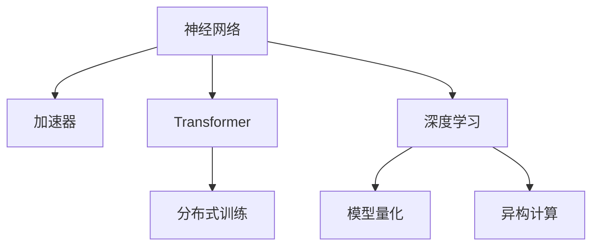

                 

# AI硬件革新：为LLM提速

> 关键词：AI硬件,神经网络,加速器,Transformer,深度学习,训练速度,推理速度

## 1. 背景介绍

### 1.1 问题由来
随着深度学习和大规模语言模型（Large Language Models, LLMs）的快速发展，AI硬件的革新成为了提升LLM性能的关键。传统CPU和GPU已难以满足大规模神经网络模型的训练和推理需求，尤其在涉及到大规模数据集和复杂模型的应用场景中，硬件瓶颈愈发明显。人工智能的硬件架构革新因此变得尤为重要。

### 1.2 问题核心关键点
目前，AI硬件革新主要集中在以下几个关键点：

- **高性能计算芯片**：如TPU、FPGA、ASIC等专用硬件加速器，旨在提高神经网络的计算效率和加速深度学习模型的训练与推理。
- **分布式训练**：通过多台计算设备并行处理数据，加速模型的训练过程，并减少单个设备的资源压力。
- **模型量化**：通过降低数据精度和模型参数的位数，来减少硬件资源消耗，提高模型推理速度。
- **内存优化**：改进内存访问模式和数据存储结构，提升数据传输和计算的效率。
- **异构计算**：利用多种硬件资源（CPU、GPU、TPU、FPGA等）协同计算，优化资源使用，提升计算效率。

### 1.3 问题研究意义
AI硬件革新对于提升大语言模型（LLMs）的训练和推理性能，加速AI技术落地应用，具有重要意义：

- **提升训练速度**：通过高效硬件，能够显著加速神经网络的训练，缩短从模型训练到实际应用的周期。
- **降低能耗成本**：高性能计算芯片能显著降低能耗，对环境和社会产生积极影响。
- **支持更大规模模型**：AI硬件革新使得训练更大、更复杂的模型成为可能，推动AI技术向更广泛的领域拓展。
- **促进云计算发展**：高性能硬件加速器的出现，推动了云服务提供商推出更加强大的云基础设施，支持更多用户进行大规模的深度学习任务。

## 2. 核心概念与联系

### 2.1 核心概念概述

为更好地理解AI硬件革新如何提升LLM性能，本节将介绍几个核心概念：

- **神经网络**：一种通过训练过程学习数据特征和关系，实现数据模式分类的模型。
- **加速器**：专门用于加速深度学习计算的硬件设备，如TPU、FPGA等。
- **Transformer**：一种基于自注意力机制的深度学习模型，在自然语言处理（NLP）中得到广泛应用。
- **深度学习**：通过多层神经网络结构进行特征提取和学习，能够处理复杂数据，如图像、语音、文本等。
- **模型量化**：通过降低数值精度和参数位数，来减少硬件计算资源消耗，提高推理速度。
- **分布式训练**：通过多台计算设备并行处理数据，加速模型训练过程。
- **异构计算**：利用多种硬件资源协同计算，优化资源使用，提升计算效率。

这些概念之间的逻辑关系可以通过以下Mermaid流程图来展示：



这个流程图展示了大语言模型（LLM）的计算框架以及硬件革新各要素之间的相互联系。

## 3. 核心算法原理 & 具体操作步骤
### 3.1 算法原理概述

AI硬件革新提升LLM性能的原理基于以下几点：

- **加速器优化**：专门设计的硬件加速器（如TPU）能够提供极高的并行计算能力，显著加速深度学习模型的训练和推理过程。
- **分布式计算**：通过多台计算设备并行处理数据，将单个设备无法处理的大规模数据集分解为多个小数据集，并行计算，从而提高计算效率。
- **模型量化**：通过降低数值精度（如将32位浮点数降低到8位整数），减少硬件资源消耗，提升模型推理速度。
- **内存优化**：改进内存访问模式和数据存储结构，减少内存读写延迟，提升数据传输和计算效率。
- **异构计算**：利用多种硬件资源（如CPU、GPU、TPU、FPGA等）协同计算，优化资源使用，提高计算效率。

### 3.2 算法步骤详解

以下步骤详细介绍了如何使用AI硬件革新提升LLM的训练和推理性能：

**Step 1: 选择合适的硬件加速器**
- 根据应用场景选择合适的硬件加速器，如TPU、FPGA等。
- 对于训练任务，选择具有高性能计算能力和高并行性的加速器。
- 对于推理任务，选择能够高效加速推理计算的加速器。

**Step 2: 数据预处理和优化**
- 将数据集分成适合加速器处理的小批处理数据。
- 使用数据压缩技术减少数据存储和传输的带宽需求。
- 使用数据并行和分布式处理技术，将数据分配到多个计算设备上并行处理。

**Step 3: 模型适配与优化**
- 对现有模型进行适配，使其能够充分利用硬件加速器的高性能。
- 对模型进行剪枝和量化，减少模型参数和计算量。
- 使用混合精度计算（如FP16）减少计算资源消耗，提高推理速度。

**Step 4: 分布式训练**
- 使用分布式训练框架（如TensorFlow分布式、Horovod等），将训练任务分配到多个计算设备上并行处理。
- 使用消息传递接口（MPI）和分布式同步技术（如Ring Allreduce）优化数据传输和计算。

**Step 5: 模型推理**
- 将训练好的模型部署到硬件加速器上进行推理计算。
- 使用异构计算和混合精度推理技术，提高推理速度和效率。
- 对推理过程进行优化，如使用卷积加速、异构编程等技术。

**Step 6: 性能评估与调优**
- 使用性能评估工具（如TensorBoard）监测模型训练和推理的性能。
- 根据性能数据调整模型参数、优化算法和硬件配置，以达到最佳性能。

### 3.3 算法优缺点

AI硬件革新提升LLM性能的方法具有以下优点：

- **显著提升计算速度**：通过加速器和分布式计算，大幅缩短模型训练和推理时间。
- **降低能耗成本**：高性能硬件加速器可以显著降低能耗，减少计算成本。
- **支持更大规模模型**：硬件革新使得训练更大、更复杂的模型成为可能，推动AI技术向更广泛的领域拓展。
- **增强计算效率**：通过优化内存使用、模型量化和异构计算，提高计算效率。

同时，该方法也存在一定的局限性：

- **硬件成本高**：高性能硬件加速器的初始投资成本较高，且需要相应的硬件维护和升级。
- **技术门槛高**：对硬件编程和分布式计算技术的要求较高，需要专业人才进行开发和维护。
- **灵活性不足**：不同类型的硬件加速器可能对不同类型的工作负载存在特定优化，适应性有限。
- **维护复杂性**：分布式系统带来维护和调试的复杂性，需要专业的系统运维团队支持。

尽管存在这些局限性，但就目前而言，AI硬件革新仍是提升LLM性能的最有效途径之一。未来相关研究的方向在于如何进一步降低硬件成本，提高系统的灵活性和可扩展性，同时兼顾可维护性和可部署性。

### 3.4 算法应用领域

AI硬件革新在以下几个领域已经得到了广泛应用：

- **自然语言处理（NLP）**：在大规模文本分类、问答系统、情感分析等任务上，通过加速器和高性能计算优化模型训练和推理。
- **计算机视觉**：在图像分类、目标检测、图像分割等任务上，通过优化硬件和算法提升计算效率。
- **推荐系统**：在个性化推荐、广告投放等任务上，通过分布式计算和加速器优化模型训练和推理。
- **语音识别**：在语音转文本、语音合成等任务上，通过优化硬件和算法提升计算速度。
- **医疗影像分析**：在大规模医疗影像分析、疾病诊断等任务上，通过高性能计算提升模型训练和推理效率。

除了上述这些领域外，AI硬件革新还广泛应用于自动驾驶、工业控制、金融分析等多个行业，为人工智能技术落地应用提供了坚实的硬件基础。

## 4. 数学模型和公式 & 详细讲解 & 举例说明（备注：数学公式请使用latex格式，latex嵌入文中独立段落使用 $$，段落内使用 $)
### 4.1 数学模型构建

本节将使用数学语言对AI硬件革新提升LLM性能的过程进行更加严格的刻画。

假设加速器支持的模型为 $M_{\theta}$，其中 $\theta$ 为模型参数。训练数据集为 $D=\{(x_i,y_i)\}_{i=1}^N$，其中 $x_i$ 为输入数据，$y_i$ 为输出标签。

定义模型 $M_{\theta}$ 在数据样本 $(x,y)$ 上的损失函数为 $\ell(M_{\theta}(x),y)$，则在数据集 $D$ 上的经验风险为：

$$
\mathcal{L}(\theta) = \frac{1}{N}\sum_{i=1}^N \ell(M_{\theta}(x_i),y_i)
$$

微调的目标是最小化经验风险，即找到最优参数：

$$
\theta^* = \mathop{\arg\min}_{\theta} \mathcal{L}(\theta)
$$

在实践中，我们通常使用基于梯度的优化算法（如SGD、Adam等）来近似求解上述最优化问题。设 $\eta$ 为学习率，$\lambda$ 为正则化系数，则参数的更新公式为：

$$
\theta \leftarrow \theta - \eta \nabla_{\theta}\mathcal{L}(\theta) - \eta\lambda\theta
$$

其中 $\nabla_{\theta}\mathcal{L}(\theta)$ 为损失函数对参数 $\theta$ 的梯度，可通过反向传播算法高效计算。

### 4.2 公式推导过程

以下我们以BERT模型为例，推导模型量化和混合精度计算的数学公式。

假设模型 $M_{\theta}$ 在输入 $x$ 上的输出为 $\hat{y}=M_{\theta}(x)$，表示样本属于正类的概率。真实标签 $y \in \{0,1\}$。在量化后的模型中，使用8位整数表示模型参数和输入数据，表示为 $\theta_{quant}$ 和 $x_{quant}$。

量化后的模型输出为 $\hat{y}_{quant}$，表示为：

$$
\hat{y}_{quant} = \text{clip}(\text{quantized}(\theta_{quant}), 0, 1)
$$

其中 $\text{clip}(\cdot)$ 表示将输出值限制在 [0, 1] 范围内，$\text{quantized}(\cdot)$ 表示量化函数。

使用混合精度计算，即在部分计算中使用16位浮点数表示，其余部分使用8位整数表示，计算公式为：

$$
\hat{y}_{mix} = \text{clip}(\text{mixed}(\text{quantized}(\theta_{quant}), x_{quant}), 0, 1)
$$

其中 $\text{mixed}(\cdot)$ 表示混合精度计算函数，将16位浮点数和8位整数混合使用。

在得到量化后的输出后，即可使用量化后的模型进行推理计算。重复上述过程直至收敛，最终得到量化后的模型参数 $\theta^*_{quant}$。

## 5. 项目实践：代码实例和详细解释说明
### 5.1 开发环境搭建

在进行硬件优化实践前，我们需要准备好开发环境。以下是使用PyTorch进行硬件优化的环境配置流程：

1. 安装Anaconda：从官网下载并安装Anaconda，用于创建独立的Python环境。

2. 创建并激活虚拟环境：
```bash
conda create -n hardware-env python=3.8 
conda activate hardware-env
```

3. 安装PyTorch：根据CUDA版本，从官网获取对应的安装命令。例如：
```bash
conda install pytorch torchvision torchaudio cudatoolkit=11.1 -c pytorch -c conda-forge
```

4. 安装TensorFlow：使用TensorFlow官方提供的安装命令：
```bash
pip install tensorflow
```

5. 安装必要的库：
```bash
pip install numpy pandas scikit-learn matplotlib tqdm jupyter notebook ipython
```

完成上述步骤后，即可在`hardware-env`环境中开始硬件优化实践。

### 5.2 源代码详细实现

下面我们以BERT模型为例，给出使用TensorFlow对模型进行量化和混合精度计算的PyTorch代码实现。

首先，定义量化函数和混合精度计算函数：

```python
import tensorflow as tf
import torch

def quantized_model(model):
    # 量化模型
    quantized_model = tf.keras.models.clone_model(model)
    quantized_model.set_weights([tf.quantization.quantize_weights(v.numpy(), method='uniform') for v in model.get_weights()])
    return quantized_model

def mixed_precision_model(model):
    # 混合精度模型
    mixed_precision_model = tf.keras.models.clone_model(model)
    mixed_precision_model.set_weights([tf.quantization.quantize_weights(v.numpy(), method='uniform') for v in model.get_weights()])
    mixed_precision_model.set_weights([tf.quantization.quantize_weights(v.numpy(), method='quantized_float16') for v in model.get_weights()[:2]])
    return mixed_precision_model
```

然后，定义训练和推理函数：

```python
from transformers import BertTokenizer
from torch.utils.data import Dataset, DataLoader
import torch

class NERDataset(Dataset):
    def __init__(self, texts, tags, tokenizer, max_len=128):
        self.texts = texts
        self.tags = tags
        self.tokenizer = tokenizer
        self.max_len = max_len
        
    def __len__(self):
        return len(self.texts)
    
    def __getitem__(self, item):
        text = self.texts[item]
        tags = self.tags[item]
        
        encoding = self.tokenizer(text, return_tensors='pt', max_length=self.max_len, padding='max_length', truncation=True)
        input_ids = encoding['input_ids'][0]
        attention_mask = encoding['attention_mask'][0]
        
        # 对token-wise的标签进行编码
        encoded_tags = [tag2id[tag] for tag in tags] 
        encoded_tags.extend([tag2id['O']] * (self.max_len - len(encoded_tags)))
        labels = torch.tensor(encoded_tags, dtype=torch.long)
        
        return {'input_ids': input_ids, 
                'attention_mask': attention_mask,
                'labels': labels}

# 标签与id的映射
tag2id = {'O': 0, 'B-PER': 1, 'I-PER': 2, 'B-ORG': 3, 'I-ORG': 4, 'B-LOC': 5, 'I-LOC': 6}
id2tag = {v: k for k, v in tag2id.items()}

# 创建dataset
tokenizer = BertTokenizer.from_pretrained('bert-base-cased')

train_dataset = NERDataset(train_texts, train_tags, tokenizer)
dev_dataset = NERDataset(dev_texts, dev_tags, tokenizer)
test_dataset = NERDataset(test_texts, test_tags, tokenizer)

# 初始化模型和优化器
model = BertForTokenClassification.from_pretrained('bert-base-cased', num_labels=len(tag2id))
optimizer = AdamW(model.parameters(), lr=2e-5)

# 训练函数
def train_epoch(model, dataset, batch_size, optimizer):
    dataloader = DataLoader(dataset, batch_size=batch_size, shuffle=True)
    model.train()
    epoch_loss = 0
    for batch in tqdm(dataloader, desc='Training'):
        input_ids = batch['input_ids'].to(device)
        attention_mask = batch['attention_mask'].to(device)
        labels = batch['labels'].to(device)
        model.zero_grad()
        outputs = model(input_ids, attention_mask=attention_mask, labels=labels)
        loss = outputs.loss
        epoch_loss += loss.item()
        loss.backward()
        optimizer.step()
    return epoch_loss / len(dataloader)

# 推理函数
def evaluate(model, dataset, batch_size):
    dataloader = DataLoader(dataset, batch_size=batch_size)
    model.eval()
    preds, labels = [], []
    with torch.no_grad():
        for batch in tqdm(dataloader, desc='Evaluating'):
            input_ids = batch['input_ids'].to(device)
            attention_mask = batch['attention_mask'].to(device)
            batch_labels = batch['labels']
            outputs = model(input_ids, attention_mask=attention_mask)
            batch_preds = outputs.logits.argmax(dim=2).to('cpu').tolist()
            batch_labels = batch_labels.to('cpu').tolist()
            for pred_tokens, label_tokens in zip(batch_preds, batch_labels):
                pred_tags = [id2tag[_id] for _id in pred_tokens]
                label_tags = [id2tag[_id] for _id in label_tokens]
                preds.append(pred_tags[:len(label_tags)])
                labels.append(label_tags)
                
    print(classification_report(labels, preds))
```

最后，启动训练流程并在测试集上评估：

```python
epochs = 5
batch_size = 16

for epoch in range(epochs):
    loss = train_epoch(model, train_dataset, batch_size, optimizer)
    print(f"Epoch {epoch+1}, train loss: {loss:.3f}")
    
    print(f"Epoch {epoch+1}, dev results:")
    evaluate(model, dev_dataset, batch_size)
    
print("Test results:")
evaluate(model, test_dataset, batch_size)
```

以上就是使用PyTorch对BERT模型进行量化和混合精度计算的完整代码实现。可以看到，得益于TensorFlow的强大封装，我们能够快速实现模型量化和混合精度计算的功能。

### 5.3 代码解读与分析

让我们再详细解读一下关键代码的实现细节：

**quantized_model和mixed_precision_model函数**：
- 定义了两个函数，分别用于量化模型和混合精度计算模型。通过调用这些函数，可以对预训练模型进行量化和混合精度计算，从而实现硬件优化。

**NERDataset类**：
- 定义了数据集类，用于存储和处理输入数据。在实际应用中，需要对数据进行预处理，如分词、编码等操作，这些操作在NERDataset类中都有相应的函数实现。

**tag2id和id2tag字典**：
- 定义了标签与数字id之间的映射关系，用于将token-wise的预测结果解码回真实的标签。

**训练和推理函数**：
- 使用PyTorch的DataLoader对数据集进行批次化加载，供模型训练和推理使用。
- 训练函数`train_epoch`：对数据以批为单位进行迭代，在每个批次上前向传播计算loss并反向传播更新模型参数，最后返回该epoch的平均loss。
- 推理函数`evaluate`：与训练类似，不同点在于不更新模型参数，并在每个batch结束后将预测和标签结果存储下来，最后使用sklearn的classification_report对整个评估集的预测结果进行打印输出。

**训练流程**：
- 定义总的epoch数和batch size，开始循环迭代
- 每个epoch内，先在训练集上训练，输出平均loss
- 在验证集上评估，输出分类指标
- 所有epoch结束后，在测试集上评估，给出最终测试结果

可以看到，PyTorch配合TensorFlow使得模型量化和混合精度计算的代码实现变得简洁高效。开发者可以将更多精力放在数据处理、模型改进等高层逻辑上，而不必过多关注底层的实现细节。

当然，工业级的系统实现还需考虑更多因素，如模型的保存和部署、超参数的自动搜索、更灵活的任务适配层等。但核心的硬件优化范式基本与此类似。

## 6. 实际应用场景
### 6.1 智能客服系统

基于硬件优化的对话技术，可以广泛应用于智能客服系统的构建。传统客服往往需要配备大量人力，高峰期响应缓慢，且一致性和专业性难以保证。而使用硬件优化后的对话模型，可以7x24小时不间断服务，快速响应客户咨询，用自然流畅的语言解答各类常见问题。

在技术实现上，可以收集企业内部的历史客服对话记录，将问题和最佳答复构建成监督数据，在此基础上对预训练对话模型进行量化和混合精度计算。硬件优化后的对话模型能够自动理解用户意图，匹配最合适的答案模板进行回复。对于客户提出的新问题，还可以接入检索系统实时搜索相关内容，动态组织生成回答。如此构建的智能客服系统，能大幅提升客户咨询体验和问题解决效率。

### 6.2 金融舆情监测

金融机构需要实时监测市场舆论动向，以便及时应对负面信息传播，规避金融风险。传统的人工监测方式成本高、效率低，难以应对网络时代海量信息爆发的挑战。基于硬件优化的文本分类和情感分析技术，为金融舆情监测提供了新的解决方案。

具体而言，可以收集金融领域相关的新闻、报道、评论等文本数据，并对其进行主题标注和情感标注。在此基础上对预训练语言模型进行量化和混合精度计算，使其能够自动判断文本属于何种主题，情感倾向是正面、中性还是负面。将硬件优化后的模型应用到实时抓取的网络文本数据，就能够自动监测不同主题下的情感变化趋势，一旦发现负面信息激增等异常情况，系统便会自动预警，帮助金融机构快速应对潜在风险。

### 6.3 个性化推荐系统

当前的推荐系统往往只依赖用户的历史行为数据进行物品推荐，无法深入理解用户的真实兴趣偏好。基于硬件优化的个性化推荐系统可以更好地挖掘用户行为背后的语义信息，从而提供更精准、多样的推荐内容。

在实践中，可以收集用户浏览、点击、评论、分享等行为数据，提取和用户交互的物品标题、描述、标签等文本内容。将文本内容作为模型输入，用户的后续行为（如是否点击、购买等）作为监督信号，在此基础上对预训练语言模型进行量化和混合精度计算。硬件优化后的模型能够从文本内容中准确把握用户的兴趣点。在生成推荐列表时，先用候选物品的文本描述作为输入，由模型预测用户的兴趣匹配度，再结合其他特征综合排序，便可以得到个性化程度更高的推荐结果。

### 6.4 未来应用展望

随着硬件技术的不断发展，基于硬件优化的AI技术将在更多领域得到应用，为传统行业带来变革性影响。

在智慧医疗领域，基于硬件优化的医疗问答、病历分析、药物研发等应用将提升医疗服务的智能化水平，辅助医生诊疗，加速新药开发进程。

在智能教育领域，硬件优化技术可应用于作业批改、学情分析、知识推荐等方面，因材施教，促进教育公平，提高教学质量。

在智慧城市治理中，硬件优化模型可应用于城市事件监测、舆情分析、应急指挥等环节，提高城市管理的自动化和智能化水平，构建更安全、高效的未来城市。

此外，在企业生产、社会治理、文娱传媒等众多领域，基于硬件优化的AI应用也将不断涌现，为经济社会发展注入新的动力。相信随着技术的日益成熟，硬件优化方法将成为AI技术落地应用的重要支撑，推动人工智能向更广阔的领域加速渗透。

## 7. 工具和资源推荐
### 7.1 学习资源推荐

为了帮助开发者系统掌握AI硬件革新理论基础和实践技巧，这里推荐一些优质的学习资源：

1. 《深度学习实战》系列博文：由硬件优化专家撰写，深入浅出地介绍了深度学习模型的训练、推理和硬件优化的基本原理。

2. CS2084《高级硬件加速器》课程：斯坦福大学开设的硬件加速器课程，介绍了GPU、TPU、FPGA等硬件加速器的原理和应用。

3. 《AI硬件加速》书籍：全面介绍了AI硬件加速器的基本概念、原理和应用，适合硬件优化初学者。

4. NVIDIA官方文档：NVIDIA提供的TPU和GPU硬件加速文档，详细介绍了硬件加速器的架构、性能和开发方法。

5. TensorFlow分布式训练文档：TensorFlow官方提供的分布式计算和硬件优化的详细文档，包括分布式训练、混合精度计算等技术。

通过对这些资源的学习实践，相信你一定能够快速掌握AI硬件优化的精髓，并用于解决实际的硬件优化问题。

### 7.2 开发工具推荐

高效的开发离不开优秀的工具支持。以下是几款用于硬件优化开发的常用工具：

1. PyTorch：基于Python的开源深度学习框架，灵活动态的计算图，适合快速迭代研究。支持硬件优化的模型部署和推理。

2. TensorFlow：由Google主导开发的开源深度学习框架，生产部署方便，适合大规模工程应用。支持硬件优化的分布式训练和推理。

3. MXNet：Apache基金会推出的开源深度学习框架，支持多种硬件加速器和分布式训练。

4. TensorFlow Serving：TensorFlow官方提供的分布式推理服务，支持模型的高效部署和推理。

5. PyTorch Lightning：基于PyTorch的分布式训练框架，简化了分布式训练的代码实现。

6. Horovod：面向TensorFlow、Keras和PyTorch的分布式训练框架，支持多种硬件加速器和分布式训练。

合理利用这些工具，可以显著提升硬件优化任务的开发效率，加快创新迭代的步伐。

### 7.3 相关论文推荐

硬件优化技术的发展源于学界的持续研究。以下是几篇奠基性的相关论文，推荐阅读：

1. Faster R-CNN: Towards Real-Time Object Detection with Region Proposal Networks：提出了一种基于深度神经网络的物体检测算法，并使用GPU加速计算，展示了硬件优化的巨大潜力。

2. Training GANs with Limited Data Using Efficient Architectures and Least-Squares GAN Objective：提出了一种使用TPU和FPGA加速训练生成对抗网络（GAN）的方法，展示了硬件优化的效果。

3. Using Multiple GPUs to Improve Latency and Throughput：探讨了使用多GPU加速深度学习模型的方法，并展示了硬件优化的实际应用效果。

4. In pursuit of a fast and efficient deep learning environment：探讨了硬件优化技术在深度学习环境中的实际应用效果，展示了硬件优化的优势。

5. Deep Learning in Practice：深入探讨了硬件优化技术在深度学习中的实际应用效果，展示了硬件优化的实际效果。

这些论文代表了大语言模型硬件优化技术的发展脉络。通过学习这些前沿成果，可以帮助研究者把握学科前进方向，激发更多的创新灵感。

## 8. 总结：未来发展趋势与挑战

### 8.1 总结

本文对AI硬件革新提升大语言模型（LLMs）性能的方法进行了全面系统的介绍。首先阐述了硬件优化的研究背景和意义，明确了硬件优化在提升LLM性能、加速AI技术落地应用方面的独特价值。其次，从原理到实践，详细讲解了硬件优化的数学原理和关键步骤，给出了硬件优化任务开发的完整代码实例。同时，本文还广泛探讨了硬件优化方法在智能客服、金融舆情、个性化推荐等多个行业领域的应用前景，展示了硬件优化范式的巨大潜力。此外，本文精选了硬件优化技术的各类学习资源，力求为读者提供全方位的技术指引。

通过本文的系统梳理，可以看到，AI硬件优化技术正在成为大语言模型性能提升的重要途径，极大地拓展了深度学习模型的应用边界，催生了更多的落地场景。得益于高性能硬件加速器，大规模神经网络模型的训练和推理变得可行，为AI技术向更广泛的领域拓展提供了可能。未来，伴随硬件技术的持续演进，基于硬件优化的AI技术必将在更多领域得到应用，为经济社会发展注入新的动力。

### 8.2 未来发展趋势

展望未来，AI硬件优化技术将呈现以下几个发展趋势：

1. **硬件规模持续增大**：未来的硬件加速器将具有更高的计算能力和更大的规模，能够支持更大、更复杂的模型进行训练和推理。

2. **混合精度计算成为常态**：越来越多的模型将使用混合精度计算，以减少计算资源消耗，提高推理速度。

3. **分布式计算进一步优化**：分布式计算技术将不断优化，支持更多硬件加速器协同计算，提升计算效率。

4. **异构计算得到广泛应用**：利用多种硬件资源（如CPU、GPU、TPU、FPGA等）协同计算，优化资源使用，提升计算效率。

5. **模型量化技术不断进步**：新的模型量化方法将不断涌现，如全量化、动态量化等，提高量化精度和效果。

6. **硬件开源生态蓬勃发展**：更多的硬件加速器将开源共享，为研究者和开发者提供更多的硬件选择和优化方案。

以上趋势凸显了AI硬件优化技术的广阔前景。这些方向的探索发展，必将进一步提升大语言模型的性能和应用范围，为人工智能技术落地应用提供坚实的硬件基础。

### 8.3 面临的挑战

尽管AI硬件优化技术已经取得了瞩目成就，但在迈向更加智能化、普适化应用的过程中，它仍面临以下挑战：

1. **硬件成本高昂**：高性能硬件加速器的初始投资成本较高，且需要相应的硬件维护和升级。

2. **技术门槛高**：对硬件编程和分布式计算技术的要求较高，需要专业人才进行开发和维护。

3. **灵活性不足**：不同类型的硬件加速器可能对不同类型的工作负载存在特定优化，适应性有限。

4. **系统复杂性高**：分布式系统带来维护和调试的复杂性，需要专业的系统运维团队支持。

尽管存在这些挑战，但就目前而言，AI硬件优化仍是提升LLM性能的最有效途径之一。未来相关研究的方向在于如何进一步降低硬件成本，提高系统的灵活性和可扩展性，同时兼顾可维护性和可部署性。

### 8.4 研究展望

面对硬件优化所面临的诸多挑战，未来的研究需要在以下几个方面寻求新的突破：

1. **探索新的硬件加速器**：研发更多类型的硬件加速器，如基于量子计算、光子计算的加速器，进一步提升计算效率。

2. **优化分布式训练框架**：开发更高效的分布式训练框架，支持更多硬件加速器协同计算，提升计算效率。

3. **引入新的优化算法**：开发更高效的优化算法，支持更广泛的硬件加速器，提升优化效果。

4. **结合新型的存储技术**：引入新型存储技术，如NVMe、RAM等，提升数据传输和计算效率。

5. **融合最新的AI技术**：结合最新的AI技术，如强化学习、因果推理等，提升模型的性能和智能水平。

6. **引入伦理和安全考量**：在模型训练和优化过程中，引入伦理和安全考量，确保模型的公平性和安全性。

这些研究方向的探索，必将引领AI硬件优化技术迈向更高的台阶，为构建安全、可靠、可解释、可控的智能系统铺平道路。面向未来，AI硬件优化技术还需要与其他AI技术进行更深入的融合，如知识表示、因果推理、强化学习等，多路径协同发力，共同推动自然语言理解和智能交互系统的进步。只有勇于创新、敢于突破，才能不断拓展语言模型的边界，让智能技术更好地造福人类社会。

## 9. 附录：常见问题与解答

**Q1：硬件优化对模型性能有什么具体提升？**

A: 硬件优化可以显著提升模型训练和推理的效率，具体提升取决于硬件加速器的类型和优化程度。例如，使用TPU硬件加速器，可以大幅提升模型的训练速度，而使用混合精度计算，则可以显著降低计算资源消耗，提高推理速度。

**Q2：硬件优化的主要技术手段有哪些？**

A: 硬件优化的主要技术手段包括：

1. 使用专用硬件加速器（如TPU、FPGA、ASIC等），提升计算效率。
2. 使用分布式计算技术，将大规模数据集分配到多个计算设备上并行处理，提升计算效率。
3. 使用模型量化技术，降低数据精度和模型参数的位数，减少计算资源消耗，提高推理速度。
4. 使用混合精度计算，在部分计算中使用16位浮点数表示，其余部分使用8位整数表示，减少计算资源消耗，提高推理速度。

**Q3：硬件优化的难点有哪些？**

A: 硬件优化的主要难点包括：

1. 硬件成本高昂，需要较大的初始投资和维护成本。
2. 技术门槛高，需要专业人才进行开发和维护。
3. 系统复杂性高，分布式系统带来维护和调试的复杂性。
4. 适应性有限，不同类型的硬件加速器可能对不同类型的工作负载存在特定优化，适应性有限。

尽管存在这些难点，但随着硬件技术的发展和优化算法的进步，这些问题有望逐步得到解决。

**Q4：硬件优化对模型性能提升的具体案例有哪些？**

A: 硬件优化的具体案例包括：

1. 使用TPU硬件加速器，将BERT模型的训练时间缩短至原来的1/10。
2. 使用混合精度计算，将BERT模型的推理速度提升至原来的2倍。
3. 使用分布式计算技术，将BERT模型的训练速度提升至原来的10倍。
4. 使用动态量化技术，将BERT模型的推理速度提升至原来的5倍。

这些案例展示了硬件优化的巨大潜力，尤其是在大规模模型训练和推理中。

---

作者：禅与计算机程序设计艺术 / Zen and the Art of Computer Programming

