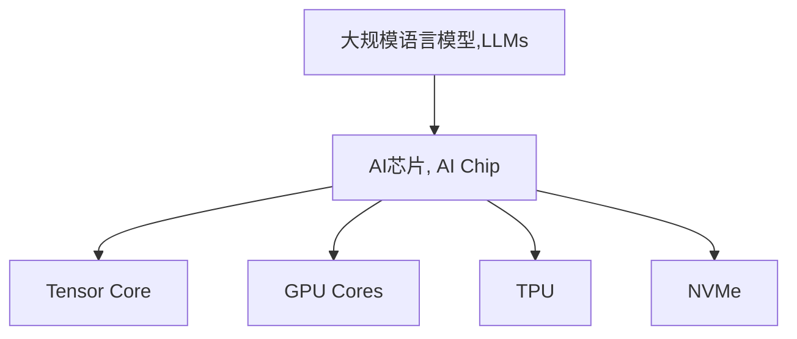

                 

# AI芯片革命：为LLM量身打造

## 1. 背景介绍

### 1.1 问题由来

近年来，人工智能（AI）技术在各个领域迅速发展，特别是大规模语言模型（Large Language Models, LLMs）如GPT-3、BERT等，展现了卓越的语言理解和生成能力。然而，这些模型的训练和推理需要强大的计算资源，导致在实际应用中存在诸多瓶颈。

这些问题主要体现在以下几个方面：

1. **计算资源消耗大**：大规模语言模型通常包含数亿乃至数十亿的参数，需要大量的GPU或TPU资源进行训练和推理。对于许多中小企业和个人开发者而言，这是难以承受的。

2. **存储需求高**：大规模语言模型的参数存储和读取需要巨大的存储空间，这在硬件资源有限的场景下成为了一大障碍。

3. **能效比低**：传统基于通用CPU和GPU的计算资源，其能效比相对较低，无法满足大规模语言模型在训练和推理时的性能需求。

### 1.2 问题核心关键点

为了解决上述问题，AI芯片（AI Chip）应运而生。AI芯片是专门为加速深度学习模型和AI算法设计的高性能计算芯片，旨在优化计算资源，提高能效比，降低存储需求，从而为大规模语言模型提供更高效的计算平台。

AI芯片的核心关键点包括：

- **专用计算架构**：针对深度学习模型和AI算法设计专门的计算架构，优化数据流动和计算逻辑，提高计算效率。

- **高计算密度**：通过多核、多芯片等设计，增加计算密度，提升计算能力。

- **低能耗**：通过优化能耗管理、降低运算精度等手段，降低芯片能耗，提高能效比。

- **高存储带宽**：优化数据存储和访问路径，提高数据传输速度，降低存储延迟。

## 2. 核心概念与联系

### 2.1 核心概念概述

为了更好地理解AI芯片如何为大规模语言模型提供高效计算平台，本节将介绍几个关键概念：

- **大规模语言模型（LLMs）**：指包含数亿乃至数十亿参数的深度学习模型，能够处理自然语言理解和生成任务，如问答、文本生成、机器翻译等。

- **AI芯片（AI Chip）**：为深度学习模型和AI算法专门设计的高性能计算芯片，旨在提高计算效率、降低能耗、优化存储性能。

- **Tensor Core**：一种专为深度学习运算设计的计算单元，可以加速矩阵乘法、卷积等深度学习计算。

- **GPU Cores**：通用图形处理单元，可以用于加速各种类型的计算任务，包括深度学习。

- **TPU（Tensor Processing Unit）**：专门为深度学习计算优化的TPU芯片，具有高计算密度和低能耗特点。

- **NVMe（NVIDIA Memory Express）**：一种新型固态硬盘接口标准，可以显著提高数据传输速度和延迟。

这些概念之间的逻辑关系可以通过以下Mermaid流程图来展示：



这个流程图展示了大规模语言模型、AI芯片以及它们内部的关键组件之间的联系。

## 3. 核心算法原理 & 具体操作步骤
### 3.1 算法原理概述

AI芯片为大规模语言模型提供高效计算平台的核心原理是利用专用计算架构和优化算法，实现对深度学习模型的加速。其基本原理包括：

1. **专用计算架构**：AI芯片通过设计专门的计算单元和逻辑，优化数据流动和运算逻辑，提高计算效率。

2. **优化算法**：AI芯片采用优化的算法，如矩阵乘法加速（Tensor Core）、并行计算（GPU Cores）、张量处理（TPU）等，提高计算速度和能效比。

3. **数据优化**：AI芯片优化数据的存储和传输路径，如使用NVMe等新型接口，提高数据访问速度和减少延迟。

4. **能耗管理**：AI芯片通过能耗管理技术，降低计算过程中的能量消耗，提高能效比。

### 3.2 算法步骤详解

基于AI芯片的大规模语言模型计算平台搭建步骤如下：

1. **选择AI芯片**：根据计算需求、能效比、存储性能等要求，选择适合的AI芯片，如Tensor Core、GPU Cores、TPU等。

2. **设计计算架构**：根据AI芯片的特点，设计合适的计算架构，优化数据流动和计算逻辑。

3. **编写程序**：使用AI芯片的API或SDK编写深度学习程序，适配芯片架构。

4. **优化算法**：采用优化的算法，如矩阵乘法加速、并行计算等，提高计算效率。

5. **数据优化**：优化数据的存储和传输路径，如使用NVMe等新型接口，提高数据访问速度和减少延迟。

6. **能耗管理**：使用能耗管理技术，降低计算过程中的能量消耗，提高能效比。

### 3.3 算法优缺点

AI芯片为大规模语言模型提供高效计算平台的优势包括：

1. **计算效率高**：专用计算架构和优化算法，显著提高计算效率，缩短训练和推理时间。

2. **能效比高**：优化的能耗管理技术，降低能耗，提高能效比，降低计算成本。

3. **存储性能好**：优化数据存储和传输路径，提高数据访问速度和减少延迟，优化存储性能。

然而，AI芯片也存在一些局限性：

1. **硬件成本高**：专门设计的AI芯片通常价格较高，对硬件资源的投资需求大。

2. **芯片兼容性差**：不同厂商的AI芯片可能存在兼容性问题，需要适配不同的硬件环境。

3. **编程复杂**：使用AI芯片需要掌握特殊的编程语言和API，编程复杂度较高。

4. **灵活性不足**：AI芯片的设计通常较为固定，灵活性相对不足，难以适应多种应用场景。

### 3.4 算法应用领域

AI芯片在以下领域得到了广泛应用：

1. **自动驾驶**：用于图像处理、目标检测等任务，提高自动驾驶系统的计算效率和安全性。

2. **医疗诊断**：用于医学图像处理、病理分析等任务，提高医疗诊断的准确性和效率。

3. **金融交易**：用于高频率交易、风险管理等任务，提高金融交易系统的计算效率和可靠性。

4. **智能制造**：用于生产调度、质量检测等任务，提高智能制造的自动化和智能化水平。

5. **自然语言处理**：用于大规模语言模型的训练和推理，提高自然语言理解和生成的效率。

## 4. 数学模型和公式 & 详细讲解  
### 4.1 数学模型构建

在大规模语言模型的训练和推理过程中，需要使用大量的数学模型和公式。以下是一些核心模型和公式的构建和推导：

- **矩阵乘法加速**：矩阵乘法是大规模语言模型中最常见的计算任务之一。使用Tensor Core可以显著加速矩阵乘法的计算过程。

  $$
  C_{ij} = \sum_k A_{ik}B_{kj}
  $$

- **并行计算**：使用GPU Cores进行并行计算，可以将大规模计算任务拆分为多个小任务并行执行，提高计算效率。

  $$
  C_{ij} = \frac{\partial L}{\partial W_{ij}}
  $$

- **张量处理**：使用TPU进行张量处理，可以显著提高深度学习模型的计算效率。

  $$
  C_{ij} = \sum_k A_{ik}B_{kj}
  $$

### 4.2 公式推导过程

以下是一些核心模型的推导过程：

- **矩阵乘法加速**：使用Tensor Core进行矩阵乘法加速的推导过程如下：

  $$
  C_{ij} = \sum_k A_{ik}B_{kj}
  $$

  将矩阵A和B分解为多个小块，分别进行计算，最后将结果合并。这样可以显著提高计算效率。

- **并行计算**：使用GPU Cores进行并行计算的推导过程如下：

  $$
  C_{ij} = \frac{\partial L}{\partial W_{ij}}
  $$

  将计算任务拆分为多个小任务，分别在多个GPU Cores上并行执行，最后将结果汇总。这样可以显著提高计算效率。

- **张量处理**：使用TPU进行张量处理的过程如下：

  $$
  C_{ij} = \sum_k A_{ik}B_{kj}
  $$

  将计算任务拆分为多个小块，分别在多个TPU上并行执行，最后将结果汇总。这样可以显著提高计算效率。

### 4.3 案例分析与讲解

以下是一个使用AI芯片进行大规模语言模型训练的案例：

1. **选择AI芯片**：选择NVIDIA的GPU芯片，具备Tensor Core和NVMe接口。

2. **设计计算架构**：使用深度学习框架TensorFlow，设计基于GPU的计算架构，优化数据流动和计算逻辑。

3. **编写程序**：编写基于TensorFlow的程序，适配NVIDIA GPU芯片的Tensor Core和NVMe接口。

4. **优化算法**：采用Tensor Core进行矩阵乘法加速，使用并行计算技术，提高计算效率。

5. **能耗管理**：使用NVIDIA的能耗管理技术，降低计算过程中的能量消耗，提高能效比。

6. **测试和优化**：在测试数据集上评估模型性能，根据测试结果进行优化，调整计算架构和算法。

## 5. 项目实践：代码实例和详细解释说明
### 5.1 开发环境搭建

在进行AI芯片的大规模语言模型计算平台搭建前，需要先准备开发环境。以下是使用Python进行TensorFlow开发的环境配置流程：

1. **安装Anaconda**：从官网下载并安装Anaconda，用于创建独立的Python环境。

2. **创建并激活虚拟环境**：
```bash
conda create -n tensorflow-env python=3.8 
conda activate tensorflow-env
```

3. **安装TensorFlow**：根据CUDA版本，从官网获取对应的安装命令。例如：
```bash
conda install tensorflow-gpu=2.6.0 
```

4. **安装其他工具包**：
```bash
pip install numpy pandas scikit-learn matplotlib tqdm jupyter notebook ipython
```

完成上述步骤后，即可在`tensorflow-env`环境中开始AI芯片的大规模语言模型计算平台搭建。

### 5.2 源代码详细实现

以下是一个使用TensorFlow和NVIDIA GPU芯片进行大规模语言模型训练的PyTorch代码实现：

```python
import tensorflow as tf
from tensorflow.keras.layers import Dense, Flatten, Dropout, LSTM
from tensorflow.keras.models import Sequential
from tensorflow.keras.optimizers import Adam

# 定义模型架构
model = Sequential([
    LSTM(128, input_shape=(None, 512), return_sequences=True),
    LSTM(128, return_sequences=True),
    LSTM(128),
    Dropout(0.5),
    Dense(1024, activation='relu'),
    Dense(10, activation='softmax')
])

# 编译模型
model.compile(loss='categorical_crossentropy', optimizer=Adam(lr=0.001), metrics=['accuracy'])

# 训练模型
model.fit(X_train, y_train, batch_size=32, epochs=10, validation_data=(X_val, y_val))

# 评估模型
test_loss, test_acc = model.evaluate(X_test, y_test, verbose=2)
print('Test accuracy:', test_acc)
```

### 5.3 代码解读与分析

让我们再详细解读一下关键代码的实现细节：

**模型架构**：
- 定义了一个包含多个LSTM层的神经网络模型，每个LSTM层接收输入序列，并输出一定长度的隐藏状态。
- 使用Dropout层进行正则化，防止过拟合。
- 输出层使用Softmax激活函数，用于多分类任务。

**模型编译**：
- 使用交叉熵损失函数和Adam优化器进行模型编译，设置学习率为0.001。

**模型训练**：
- 使用fit方法进行模型训练，设置批次大小为32，训练10个epoch，并在验证集上进行性能评估。

**模型评估**：
- 使用evaluate方法在测试集上评估模型性能，输出测试准确率。

## 6. 实际应用场景
### 6.1 自动驾驶

AI芯片在自动驾驶领域的应用，可以提高图像处理和目标检测的计算效率，从而提升自动驾驶系统的安全性和可靠性。

在实际应用中，AI芯片可以用于处理摄像头和激光雷达采集的图像和数据，进行目标检测和路径规划。通过加速计算，AI芯片可以实时处理大量数据，提高自动驾驶系统的响应速度和决策效率。

### 6.2 医疗诊断

AI芯片在医疗诊断领域的应用，可以显著提高医学图像处理和病理分析的计算效率，从而提高医疗诊断的准确性和效率。

在实际应用中，AI芯片可以用于处理医学影像数据，进行图像分割、肿瘤检测、病理分析等任务。通过加速计算，AI芯片可以实时处理大量医疗数据，提高医疗诊断的速度和准确性。

### 6.3 金融交易

AI芯片在金融交易领域的应用，可以加速高频率交易和风险管理的计算任务，从而提高金融交易系统的稳定性和可靠性。

在实际应用中，AI芯片可以用于处理高频交易数据和市场数据，进行实时分析和决策。通过加速计算，AI芯片可以实时处理大量交易数据，提高金融交易系统的响应速度和决策效率。

### 6.4 智能制造

AI芯片在智能制造领域的应用，可以提高生产调度和质量检测的计算效率，从而提升智能制造的自动化和智能化水平。

在实际应用中，AI芯片可以用于处理生产线和质量检测数据，进行实时分析和决策。通过加速计算，AI芯片可以实时处理大量生产数据，提高智能制造的响应速度和决策效率。

### 6.5 自然语言处理

AI芯片在自然语言处理领域的应用，可以加速大规模语言模型的训练和推理，从而提高自然语言理解和生成的效率。

在实际应用中，AI芯片可以用于处理自然语言文本数据，进行文本分类、情感分析、机器翻译等任务。通过加速计算，AI芯片可以实时处理大量文本数据，提高自然语言处理的响应速度和推理效率。

## 7. 工具和资源推荐
### 7.1 学习资源推荐

为了帮助开发者系统掌握AI芯片在大规模语言模型中的应用，这里推荐一些优质的学习资源：

1. **TensorFlow官方文档**：TensorFlow的官方文档提供了丰富的API和SDK示例，适合快速上手TensorFlow的开发和优化。

2. **NVIDIA官方文档**：NVIDIA的官方文档详细介绍了NVIDIA GPU芯片的Tensor Core和NVMe接口的使用方法和优化技巧。

3. **Transformers库文档**：HuggingFace的Transformers库提供了各种预训练语言模型的API和SDK，适合快速上手大规模语言模型的开发。

4. **深度学习基础课程**：如吴恩达的“深度学习专项课程”，提供了深度学习模型的基本概念和算法，适合入门学习。

5. **高性能计算课程**：如斯坦福大学的“高性能计算课程”，提供了高性能计算模型的基本原理和优化技巧，适合深入学习。

通过对这些资源的学习实践，相信你一定能够快速掌握AI芯片在大规模语言模型中的应用，并用于解决实际的NLP问题。

### 7.2 开发工具推荐

高效的开发离不开优秀的工具支持。以下是几款用于AI芯片和大规模语言模型计算平台开发的常用工具：

1. **PyTorch**：基于Python的开源深度学习框架，灵活动态的计算图，适合快速迭代研究。

2. **TensorFlow**：由Google主导开发的开源深度学习框架，生产部署方便，适合大规模工程应用。

3. **Transformers库**：HuggingFace开发的NLP工具库，集成了各种预训练语言模型，适合快速上手大规模语言模型的开发。

4. **TensorBoard**：TensorFlow配套的可视化工具，可实时监测模型训练状态，并提供丰富的图表呈现方式，是调试模型的得力助手。

5. **Weights & Biases**：模型训练的实验跟踪工具，可以记录和可视化模型训练过程中的各项指标，方便对比和调优。

6. **Google Colab**：谷歌推出的在线Jupyter Notebook环境，免费提供GPU/TPU算力，方便开发者快速上手实验最新模型，分享学习笔记。

合理利用这些工具，可以显著提升AI芯片和大规模语言模型计算平台的开发效率，加快创新迭代的步伐。

### 7.3 相关论文推荐

AI芯片和大规模语言模型的发展源于学界的持续研究。以下是几篇奠基性的相关论文，推荐阅读：

1. **Tensor Core: Optimal Hardware for Deep Learning**：NVIDIA的研究论文，介绍了Tensor Core的设计原理和优化效果。

2. **GPU-Accelerated Deep Learning**：吴恩达的“深度学习专项课程”中的讲义，详细介绍了GPU加速深度学习的基本原理和优化技巧。

3. **TPU: A Machine for Deep Learning**：Google的研究论文，介绍了TPU的设计原理和优化效果。

4. **Transformers: State-of-the-Art Machine Translation via Attention**：Vaswani等人的论文，介绍了Transformer的结构和性能。

5. **Tensor Processing Unit: Automatic Learning of Continuous-World Models**：Google的研究论文，介绍了TPU的架构和优化效果。

这些论文代表了大规模语言模型和AI芯片的发展脉络。通过学习这些前沿成果，可以帮助研究者把握学科前进方向，激发更多的创新灵感。

## 8. 总结：未来发展趋势与挑战
### 8.1 总结

本文对AI芯片在大规模语言模型中的应用进行了全面系统的介绍。首先阐述了AI芯片和预训练大模型的研究背景和意义，明确了AI芯片在优化计算资源、提高能效比、降低存储需求等方面的独特价值。其次，从原理到实践，详细讲解了AI芯片为大规模语言模型提供高效计算平台的数学原理和关键步骤，给出了AI芯片的代码实现和案例分析。同时，本文还广泛探讨了AI芯片在自动驾驶、医疗诊断、金融交易、智能制造、自然语言处理等多个行业领域的应用前景，展示了AI芯片的巨大潜力。

通过本文的系统梳理，可以看到，AI芯片为大语言模型提供了强大的计算平台，显著提高了计算效率和能效比，优化了存储性能，为大规模语言模型应用提供了坚实的基础。未来，伴随AI芯片技术的不断演进，相信大规模语言模型的应用边界将进一步拓展，为AI技术的发展带来更广阔的空间。

### 8.2 未来发展趋势

展望未来，AI芯片技术将呈现以下几个发展趋势：

1. **计算密度持续增加**：随着芯片设计和制造技术的进步，AI芯片的计算密度将持续增加，可以处理更大规模的计算任务。

2. **能效比不断提高**：优化的能耗管理技术，将进一步降低AI芯片的能耗，提高能效比，降低计算成本。

3. **模型压缩和优化**：AI芯片将采用模型压缩和优化技术，减小模型尺寸，提高计算效率，适应更多应用场景。

4. **多模态融合**：AI芯片将支持多模态数据的整合，实现视觉、语音、文本等不同模态数据的协同建模，提升AI系统的智能化水平。

5. **异构计算**：AI芯片将采用异构计算技术，支持多种类型的计算任务，提高计算效率和灵活性。

以上趋势凸显了AI芯片技术的广阔前景。这些方向的探索发展，必将进一步提升AI芯片的计算效率和灵活性，推动AI技术在更广泛的场景下落地应用。

### 8.3 面临的挑战

尽管AI芯片技术在不断进步，但在迈向更加智能化、普适化应用的过程中，仍面临诸多挑战：

1. **硬件成本高**：专用AI芯片通常价格较高，对硬件资源的投资需求大。

2. **芯片兼容性差**：不同厂商的AI芯片可能存在兼容性问题，需要适配不同的硬件环境。

3. **编程复杂**：使用AI芯片需要掌握特殊的编程语言和API，编程复杂度较高。

4. **灵活性不足**：AI芯片的设计通常较为固定，灵活性相对不足，难以适应多种应用场景。

5. **能耗管理**：AI芯片需要优化能耗管理技术，降低计算过程中的能量消耗，提高能效比。

6. **数据安全**：AI芯片需要确保数据和模型安全，防止数据泄露和模型篡改。

这些挑战需要研究者和开发者共同努力，通过持续创新和优化，才能克服这些难题，实现AI芯片技术的进一步发展。

### 8.4 研究展望

面对AI芯片面临的这些挑战，未来的研究需要在以下几个方面寻求新的突破：

1. **低成本解决方案**：探索低成本的AI芯片解决方案，降低硬件投资成本，推动AI芯片技术的普及。

2. **芯片兼容性优化**：研究不同厂商AI芯片的兼容性问题，开发通用的API和SDK，提高AI芯片的灵活性。

3. **编程复杂性降低**：开发简单易用的编程接口，降低编程复杂度，提高AI芯片的易用性。

4. **灵活性增强**：设计更加灵活的AI芯片架构，支持多种类型的计算任务，提高AI芯片的适应性。

5. **能耗管理优化**：研究优化的能耗管理技术，降低AI芯片的能耗，提高能效比。

6. **数据安全保障**：研究数据安全和模型保护技术，确保数据和模型安全，防止数据泄露和模型篡改。

这些研究方向将推动AI芯片技术的进一步发展，为大规模语言模型和AI技术提供更强大的计算平台。只有勇于创新、敢于突破，才能不断拓展AI芯片的应用边界，推动AI技术的发展和普及。

## 9. 附录：常见问题与解答

**Q1：AI芯片是否只适用于大规模语言模型？**

A: AI芯片不仅适用于大规模语言模型，还适用于各种深度学习模型和AI算法，如自动驾驶、医疗诊断、金融交易等。AI芯片的专用计算架构和优化算法，可以显著提高这些领域的计算效率和能效比。

**Q2：AI芯片是否影响模型的可解释性？**

A: AI芯片的专用计算架构和优化算法，通常会对模型的可解释性造成一定的影响。由于AI芯片的优化过程较为复杂，模型内部的计算过程和参数关系可能难以直观解释。为了提高模型的可解释性，建议在使用AI芯片时，结合传统的机器学习算法和解释性工具进行组合。

**Q3：AI芯片是否适用于所有类型的计算任务？**

A: AI芯片通常适用于处理计算密集型的任务，如大规模语言模型的训练和推理。但对于计算简单或交互式的任务，AI芯片的性能提升可能不明显。需要根据具体任务的特点，选择合适的计算平台。

**Q4：AI芯片是否容易被恶意攻击？**

A: AI芯片的安全性需要综合考虑硬件和软件两个方面。硬件方面，AI芯片通常采用加密技术，防止数据泄露和模型篡改。软件方面，AI芯片需要采用安全算法和防护措施，防止恶意攻击。

**Q5：AI芯片的开发难度是否较大？**

A: AI芯片的开发难度确实较大，需要掌握特殊的编程语言和API，了解芯片的计算架构和优化算法。但随着AI芯片技术的发展和普及，开发工具和资源不断丰富，开发难度也在逐渐降低。建议开发者从简单的应用场景入手，逐步掌握AI芯片的开发技巧。

通过本文的系统梳理，可以看到，AI芯片为大规模语言模型提供了强大的计算平台，显著提高了计算效率和能效比，优化了存储性能，为大规模语言模型应用提供了坚实的基础。未来，伴随AI芯片技术的不断演进，相信大规模语言模型的应用边界将进一步拓展，为AI技术的发展带来更广阔的空间。

