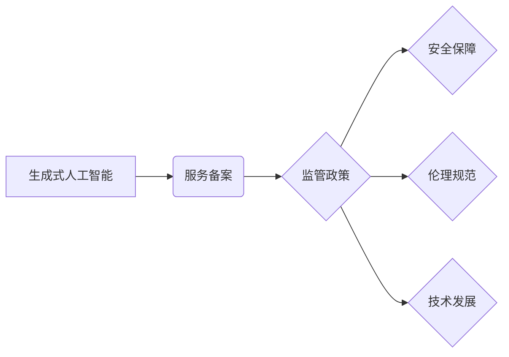

> 生成式人工智能，服务备案，中国大陆，监管政策，技术发展，伦理风险，应用场景

## 1. 背景介绍

近年来，生成式人工智能（Generative AI）技术突飞猛进，展现出强大的创造力和应用潜力。从文本生成、图像创作到代码编写，生成式人工智能正在深刻地改变着人们的生活和工作方式。然而，其强大的能力也带来了新的伦理风险和社会挑战，例如信息虚假、版权侵权和算法偏见等。

为了规范生成式人工智能的应用，促进其健康发展，中国大陆政府于2023年发布了《生成式人工智能服务备案管理办法》，要求提供生成式人工智能服务的企业和机构进行备案。该政策旨在加强对生成式人工智能的监管，保障公众利益，引导其朝着安全、可控、可持续的方向发展。

## 2. 核心概念与联系

**2.1 生成式人工智能**

生成式人工智能是指能够根据输入数据生成新数据的机器学习模型。它通过学习现有数据中的模式和结构，并利用这些知识生成新的、类似于训练数据的内容。常见的生成式人工智能模型包括：

* **文本生成模型:** 例如 GPT-3、LaMDA 等，能够生成流畅、自然的文本内容，用于写作、翻译、对话等应用。
* **图像生成模型:** 例如 DALL-E 2、Stable Diffusion 等，能够根据文本描述生成逼真的图像，用于艺术创作、设计、游戏等应用。
* **音频生成模型:** 例如 Jukebox、WaveNet 等，能够生成逼真的音频内容，用于音乐创作、语音合成等应用。

**2.2 服务备案**

服务备案是指企业或机构向相关部门提交相关信息，并经审核批准后，才能提供其所提供的服务。在生成式人工智能领域，服务备案旨在确保提供生成式人工智能服务的企业和机构具备相应的技术能力、安全保障和伦理意识，并对服务内容进行监管，防止其被用于违法犯罪活动。

**2.3 核心概念关系图**



## 3. 核心算法原理 & 具体操作步骤

**3.1 算法原理概述**

生成式人工智能的核心算法通常基于深度学习，特别是变分自编码器（VAE）和生成对抗网络（GAN）。

* **变分自编码器 (VAE):** VAE 通过将输入数据编码成低维表示，然后解码成输出数据，学习数据的潜在结构。

* **生成对抗网络 (GAN):** GAN 由两个网络组成：生成器和鉴别器。生成器试图生成逼真的数据，而鉴别器试图区分真实数据和生成数据。两者在对抗博弈中相互学习，最终生成器能够生成逼真的数据。

**3.2 算法步骤详解**

以文本生成模型为例，其训练步骤如下：

1. **数据预处理:** 收集大量文本数据，并进行清洗、分词、词向量化等预处理操作。
2. **模型构建:** 选择合适的文本生成模型架构，例如 Transformer。
3. **模型训练:** 使用训练数据训练模型，通过反向传播算法调整模型参数，使模型能够生成流畅、自然的文本。
4. **模型评估:** 使用测试数据评估模型的性能，例如困惑度、BLEU 等指标。
5. **模型部署:** 将训练好的模型部署到服务器上，提供文本生成服务。

**3.3 算法优缺点**

**优点:**

* 生成能力强，能够生成高质量的文本、图像、音频等内容。
* 可应用于多种领域，例如写作、艺术创作、游戏开发等。

**缺点:**

* 训练成本高，需要大量数据和计算资源。
* 容易受到训练数据的影响，可能生成带有偏见或错误的信息。
* 缺乏对生成的內容的理解和控制能力。

**3.4 算法应用领域**

* **文本生成:** 写作辅助、机器翻译、对话系统、内容创作等。
* **图像生成:** 艺术创作、图像编辑、游戏场景设计等。
* **音频生成:** 音乐创作、语音合成、音效制作等。
* **代码生成:** 代码自动补全、代码生成器等。

## 4. 数学模型和公式 & 详细讲解 & 举例说明

**4.1 数学模型构建**

生成式人工智能模型通常基于概率模型，例如条件概率分布。

**4.2 公式推导过程**

例如，在文本生成模型中，可以使用条件概率分布来表示下一个词的生成概率，即：

$$P(w_t | w_{1:t-1})$$

其中，$w_t$ 是第 $t$ 个词，$w_{1:t-1}$ 是前 $t-1$ 个词。

**4.3 案例分析与讲解**

假设我们有一个文本序列 "The cat sat on the mat"，我们想要预测下一个词。可以使用训练好的文本生成模型计算每个词的生成概率，然后选择概率最高的词作为下一个词。

## 5. 项目实践：代码实例和详细解释说明

**5.1 开发环境搭建**

使用 Python 语言和相关的深度学习框架，例如 TensorFlow 或 PyTorch，搭建开发环境。

**5.2 源代码详细实现**

```python
# 使用 TensorFlow 构建文本生成模型
import tensorflow as tf

# 定义模型架构
model = tf.keras.Sequential([
    tf.keras.layers.Embedding(vocab_size, embedding_dim),
    tf.keras.layers.LSTM(units),
    tf.keras.layers.Dense(vocab_size, activation='softmax')
])

# 编译模型
model.compile(optimizer='adam', loss='sparse_categorical_crossentropy', metrics=['accuracy'])

# 训练模型
model.fit(x_train, y_train, epochs=10)

# 生成文本
text = "The cat sat on"
for _ in range(10):
    predictions = model.predict(tf.expand_dims(text, 0))
    predicted_index = tf.argmax(predictions[0]).numpy()
    predicted_word = vocabulary[predicted_index]
    text += " " + predicted_word
```

**5.3 代码解读与分析**

* 使用 Embedding 层将词向量化。
* 使用 LSTM 层学习文本序列的上下文信息。
* 使用 Dense 层输出每个词的生成概率。
* 使用 Adam 优化器训练模型。
* 使用 softmax 函数将输出概率转换为概率分布。

**5.4 运行结果展示**

训练好的模型可以用于生成新的文本内容，例如：

```
The cat sat on the mat and purred contentedly.
```

## 6. 实际应用场景

**6.1 文本生成:**

* **内容创作:** 生成新闻报道、博客文章、小说等内容。
* **营销文案:** 生成广告文案、产品描述等营销材料。
* **聊天机器人:** 生成自然流畅的对话内容。

**6.2 图像生成:**

* **艺术创作:** 生成绘画、插画、摄影作品等。
* **游戏开发:** 生成游戏场景、角色、道具等。
* **设计领域:** 生成产品设计、建筑设计等。

**6.3 音频生成:**

* **音乐创作:** 生成音乐旋律、伴奏等。
* **语音合成:** 生成逼真的语音内容。
* **音效制作:** 生成游戏音效、电影音效等。

**6.4 未来应用展望**

* **个性化内容生成:** 根据用户的喜好和需求生成个性化的内容。
* **跨模态生成:** 生成多种模态的混合内容，例如文本和图像、文本和音频等。
* **自动代码生成:** 自动生成代码，提高开发效率。

## 7. 工具和资源推荐

**7.1 学习资源推荐**

* **书籍:**
    * 《深度学习》
    * 《生成对抗网络》
* **在线课程:**
    * Coursera: 深度学习
    * Udacity: 生成对抗网络
* **博客和论坛:**
    * TensorFlow Blog
    * PyTorch Blog
    * Reddit: r/MachineLearning

**7.2 开发工具推荐**

* **深度学习框架:** TensorFlow, PyTorch
* **编程语言:** Python
* **云计算平台:** Google Cloud Platform, Amazon Web Services, Microsoft Azure

**7.3 相关论文推荐**

* **Generative Pre-trained Transformer 3 (GPT-3)**
* **Deep Convolutional Generative Adversarial Networks (DCGAN)**
* **Variational Autoencoders (VAEs)**

## 8. 总结：未来发展趋势与挑战

**8.1 研究成果总结**

近年来，生成式人工智能技术取得了显著进展，在文本、图像、音频等多个领域展现出强大的应用潜力。

**8.2 未来发展趋势**

* **模型规模和能力提升:** 模型规模将继续扩大，模型能力将进一步提升。
* **跨模态生成:** 跨模态生成将成为新的研究热点。
* **可解释性和安全性:** 研究将更加注重生成式人工智能模型的可解释性和安全性。

**8.3 面临的挑战**

* **数据获取和隐私保护:** 生成式人工智能模型需要大量数据进行训练，如何获取高质量数据并保护用户隐私是一个挑战。
* **算法偏见和伦理风险:** 生成式人工智能模型可能存在算法偏见，并可能被用于生成虚假信息或进行恶意攻击，需要加强伦理规范和监管。
* **技术可解释性和控制性:** 生成式人工智能模型的决策过程往往难以理解，需要提高模型的可解释性和控制性。

**8.4 研究展望**

未来，生成式人工智能技术将继续发展，并应用于更多领域。需要加强基础研究，解决技术挑战，并制定相应的伦理规范和监管政策，引导其健康发展。

## 9. 附录：常见问题与解答

**9.1 如何选择合适的生成式人工智能模型？**

选择合适的模型取决于具体的应用场景和数据特点。例如，对于文本生成任务，GPT-3 和 BERT 等 Transformer 模型效果较好；对于图像生成任务，DALL-E 2 和 Stable Diffusion 等 GAN 模型效果较好。

**9.2 如何避免生成式人工智能模型的算法偏见？**

* 使用多样化的训练数据，减少数据偏差。
* 使用公平性评估指标，评估模型的公平性。
* 开发算法去偏见的方法，例如对抗训练。

**9.3 如何保障生成式人工智能服务的安全性？**

* 对生成式人工智能模型进行安全评估，识别潜在的漏洞。
* 对用户输入进行过滤，防止恶意攻击。
* 建立完善的监管机制，对生成式人工智能服务进行监督管理。


作者：禅与计算机程序设计艺术 / Zen and the Art of Computer Programming 
<end_of_turn>