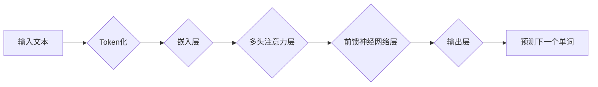

> 大规模语言模型（LLM）、Transformer、深度学习、自然语言处理（NLP）、文本生成、机器翻译、问答系统

## 1. 背景介绍

近年来，人工智能（AI）领域取得了令人瞩目的进展，其中大规模语言模型（LLM）作为一种强大的工具，在自然语言处理（NLP）领域展现出巨大的潜力。LLM 能够理解和生成人类语言，并应用于各种任务，例如文本生成、机器翻译、问答系统、代码生成等。

传统的自然语言处理方法主要依赖于手工设计的规则和特征工程，而LLM则通过深度学习算法从海量文本数据中学习语言的模式和结构，从而实现更准确、更自然的语言理解和生成。

## 2. 核心概念与联系

**2.1  Transformer 架构**

Transformer 是一种专门为处理序列数据设计的深度学习架构，它在自然语言处理领域取得了突破性的进展。Transformer 的核心创新在于使用注意力机制（Attention Mechanism），能够捕捉句子中单词之间的长距离依赖关系，从而更好地理解上下文信息。

**2.2  LLM 的构建**

LLM 通常由 Transformer 架构构建，并通过大量的文本数据进行训练。训练过程的目标是让模型能够预测下一个单词，从而学习语言的语法、语义和上下文关系。

**Mermaid 流程图**



**2.3  LLM 的特点**

* **规模庞大:** LLM 通常拥有数十亿甚至数千亿个参数，需要大量的计算资源进行训练。
* **数据依赖:** LLM 的性能与训练数据的质量和数量密切相关。
* **泛化能力强:** 经过充分训练的 LLM 能够在各种 NLP 任务中表现出色。
* **可解释性低:** LLM 的决策过程较为复杂，难以解释其背后的逻辑。

## 3. 核心算法原理 & 具体操作步骤

**3.1  算法原理概述**

LLM 的核心算法是基于 Transformer 架构的深度学习模型，其训练目标是通过最大化预测下一个单词的概率来学习语言的模式和结构。

**3.2  算法步骤详解**

1. **数据预处理:** 将文本数据进行清洗、分词、标记等预处理操作，使其能够被模型理解。
2. **嵌入层:** 将每个单词映射到一个低维向量空间，以便模型能够处理单词的语义信息。
3. **多头注意力层:** 计算每个单词与其他单词之间的注意力权重，捕捉句子中单词之间的长距离依赖关系。
4. **前馈神经网络层:** 对每个单词的嵌入向量进行非线性变换，提取更深层次的语义特征。
5. **输出层:** 将模型的输出向量映射到词汇表中，预测下一个单词。
6. **反向传播:** 使用梯度下降算法更新模型参数，使其能够更好地预测下一个单词。

**3.3  算法优缺点**

**优点:**

* 能够捕捉长距离依赖关系，提高语言理解能力。
* 泛化能力强，能够应用于各种 NLP 任务。

**缺点:**

* 训练成本高，需要大量的计算资源和数据。
* 可解释性低，难以理解模型的决策过程。

**3.4  算法应用领域**

* 文本生成
* 机器翻译
* 问答系统
* 代码生成
* 文本摘要
* 情感分析

## 4. 数学模型和公式 & 详细讲解 & 举例说明

**4.1  数学模型构建**

LLM 的数学模型通常基于概率论和统计学，其目标是学习一个概率分布，能够生成符合语言规则的文本序列。

**4.2  公式推导过程**

* **嵌入层:** 将每个单词映射到一个低维向量空间，可以使用词嵌入模型，例如 Word2Vec 或 GloVe。

$$
\mathbf{e}_i = \mathbf{W}_e \mathbf{x}_i
$$

其中，$\mathbf{e}_i$ 是单词 $i$ 的嵌入向量，$\mathbf{W}_e$ 是嵌入矩阵，$\mathbf{x}_i$ 是单词 $i$ 的 one-hot 编码。

* **多头注意力层:** 计算每个单词与其他单词之间的注意力权重，可以使用 scaled dot-product attention 机制。

$$
\mathbf{A} = \text{softmax}\left(\frac{\mathbf{Q} \mathbf{K}^T}{\sqrt{d_k}}\right)
$$

其中，$\mathbf{Q}$ 是查询矩阵，$\mathbf{K}$ 是键矩阵，$d_k$ 是键向量的维度。

* **前馈神经网络层:** 对每个单词的嵌入向量进行非线性变换，可以使用多层感知机 (MLP)。

$$
\mathbf{h} = \sigma(\mathbf{W}_1 \mathbf{x} + \mathbf{b}_1)
$$

其中，$\mathbf{h}$ 是前馈神经网络层的输出，$\mathbf{W}_1$ 是权重矩阵，$\mathbf{b}_1$ 是偏置向量，$\sigma$ 是激活函数。

* **输出层:** 将模型的输出向量映射到词汇表中，可以使用 softmax 函数。

$$
\mathbf{p} = \text{softmax}(\mathbf{W}_o \mathbf{h} + \mathbf{b}_o)
$$

其中，$\mathbf{p}$ 是每个单词的概率分布，$\mathbf{W}_o$ 是权重矩阵，$\mathbf{b}_o$ 是偏置向量。

**4.3  案例分析与讲解**

例如，在机器翻译任务中，LLM 可以将源语言文本序列映射到目标语言文本序列。训练过程中，模型会学习源语言和目标语言之间的对应关系，从而能够准确地翻译文本。

## 5. 项目实践：代码实例和详细解释说明

**5.1  开发环境搭建**

* Python 3.7+
* PyTorch 或 TensorFlow
* CUDA 和 cuDNN

**5.2  源代码详细实现**

```python
import torch
import torch.nn as nn

class Transformer(nn.Module):
    def __init__(self, vocab_size, embedding_dim, num_heads, num_layers):
        super(Transformer, self).__init__()
        self.embedding = nn.Embedding(vocab_size, embedding_dim)
        self.transformer_layers = nn.ModuleList([
            nn.TransformerEncoderLayer(embedding_dim, num_heads)
            for _ in range(num_layers)
        ])
        self.linear = nn.Linear(embedding_dim, vocab_size)

    def forward(self, x):
        x = self.embedding(x)
        for layer in self.transformer_layers:
            x = layer(x)
        x = self.linear(x)
        return x
```

**5.3  代码解读与分析**

* `__init__` 方法初始化模型参数，包括嵌入层、Transformer 层和输出层。
* `forward` 方法定义模型的正向传播过程，将输入序列映射到输出序列。

**5.4  运行结果展示**

训练完成后，可以使用模型对新的文本序列进行预测，例如生成文本、翻译文本等。

## 6. 实际应用场景

**6.1  文本生成**

LLM 可以用于生成各种类型的文本，例如小说、诗歌、新闻报道等。

**6.2  机器翻译**

LLM 可以用于将文本从一种语言翻译成另一种语言。

**6.3  问答系统**

LLM 可以用于构建问答系统，能够理解用户的问题并给出准确的答案。

**6.4  未来应用展望**

LLM 的应用前景广阔，未来可能在以下领域发挥重要作用：

* 个性化教育
* 智能客服
* 代码生成
* 药物研发

## 7. 工具和资源推荐

**7.1  学习资源推荐**

* **书籍:**
    * 《深度学习》
    * 《自然语言处理》
* **在线课程:**
    * Coursera: 自然语言处理
    * Udacity: 深度学习

**7.2  开发工具推荐**

* **PyTorch:** 深度学习框架
* **TensorFlow:** 深度学习框架
* **Hugging Face Transformers:** 预训练 Transformer 模型库

**7.3  相关论文推荐**

* 《Attention Is All You Need》
* 《BERT: Pre-training of Deep Bidirectional Transformers for Language Understanding》
* 《GPT-3: Language Models are Few-Shot Learners》

## 8. 总结：未来发展趋势与挑战

**8.1  研究成果总结**

近年来，LLM 在 NLP 领域取得了显著进展，能够处理更复杂的任务，并展现出更强的泛化能力。

**8.2  未来发展趋势**

* 模型规模进一步扩大
* 训练效率提升
* 可解释性增强
* 多模态理解

**8.3  面临的挑战**

* 数据偏见和公平性
* 计算资源消耗
* 安全性和隐私问题

**8.4  研究展望**

未来研究将重点关注解决 LLMs 的挑战，使其更加安全、可靠、可解释和公平。

## 9. 附录：常见问题与解答

**9.1  什么是 LLMs 的训练数据？**

LLMs 的训练数据通常是海量文本数据，例如书籍、文章、网站内容等。

**9.2  LLMs 的训练需要多长时间？**

LLMs 的训练时间取决于模型规模、数据量和计算资源等因素，通常需要数天甚至数周的时间。

**9.3  如何评估 LLMs 的性能？**

LLMs 的性能通常通过在标准 NLP 任务上的准确率、BLEU 分数等指标进行评估。


作者：禅与计算机程序设计艺术 / Zen and the Art of Computer Programming 
<end_of_turn>