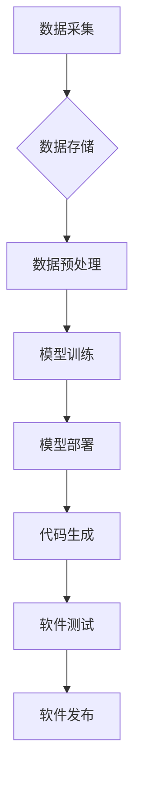

> 软件2.0，数据驱动，人工智能，机器学习，深度学习，智能化，软件架构，软件开发

## 1. 背景介绍

软件行业经历了从第一代到第三代的演变，从最初的命令式编程到面向对象的编程，再到如今的云计算和微服务架构，软件开发模式不断迭代升级。然而，随着人工智能、机器学习等新兴技术的快速发展，软件行业正迎来一场新的变革——软件2.0时代。

传统的软件开发模式主要依赖于人类经验和设计，开发人员需要根据需求进行手动编码和测试，效率低下，难以应对复杂系统和快速变化的需求。而数据驱动软件开发则将数据作为核心驱动力，通过机器学习和深度学习等算法，自动生成代码、优化性能、预测故障等，大幅提升软件开发效率和质量。

## 2. 核心概念与联系

**2.1 数据驱动软件开发的核心概念**

数据驱动软件开发的核心概念包括：

* **数据中心化:** 将数据作为软件开发的核心资产，构建统一的数据平台，实现数据共享和可复用。
* **自动化开发:** 利用机器学习和深度学习算法，自动生成代码、测试用例、文档等，减少人工干预。
* **智能化运营:** 通过数据分析和预测，实现软件性能优化、故障预警、用户体验提升等。

**2.2 数据驱动软件开发的架构**



**2.3 数据驱动软件开发与人工智能的关系**

数据驱动软件开发是人工智能技术在软件开发领域的应用，两者相互促进，共同推动软件行业的发展。人工智能技术为数据驱动软件开发提供了强大的工具和能力，而数据驱动软件开发则为人工智能技术提供了海量的数据和应用场景。

## 3. 核心算法原理 & 具体操作步骤

**3.1 算法原理概述**

数据驱动软件开发的核心算法主要包括机器学习和深度学习算法。

* **机器学习算法:** 通过学习数据中的模式和规律，自动构建模型，用于预测、分类、聚类等任务。常见的机器学习算法包括线性回归、逻辑回归、决策树、支持向量机、k近邻算法等。
* **深度学习算法:** 基于多层神经网络，能够学习更复杂的模式和特征，在图像识别、自然语言处理、语音识别等领域取得了突破性进展。常见的深度学习算法包括卷积神经网络、循环神经网络、生成对抗网络等。

**3.2 算法步骤详解**

数据驱动软件开发的具体操作步骤如下：

1. **数据采集:** 收集软件开发相关的各种数据，例如代码、文档、测试用例、用户行为数据等。
2. **数据预处理:** 对收集到的数据进行清洗、转换、特征提取等操作，使其适合机器学习和深度学习算法的训练。
3. **模型训练:** 选择合适的机器学习或深度学习算法，利用预处理后的数据进行模型训练，学习数据中的模式和规律。
4. **模型评估:** 对训练好的模型进行评估，例如准确率、召回率、F1-score等指标，判断模型的性能。
5. **模型部署:** 将训练好的模型部署到生产环境中，用于自动生成代码、测试用例、文档等。
6. **持续改进:** 持续收集数据、评估模型性能、调整模型参数，不断优化模型效果。

**3.3 算法优缺点**

**优点:**

* **提高开发效率:** 自动化代码生成、测试用例生成等任务，大幅提升开发效率。
* **提升软件质量:** 通过数据分析和预测，可以提前发现潜在问题，提高软件质量。
* **降低开发成本:** 自动化开发流程，减少人工成本。

**缺点:**

* **数据依赖:** 数据驱动软件开发依赖于海量高质量的数据，数据质量直接影响模型效果。
* **算法复杂性:** 机器学习和深度学习算法的训练和部署需要一定的技术门槛。
* **解释性问题:** 一些深度学习算法的决策过程难以解释，难以理解模型的决策逻辑。

**3.4 算法应用领域**

数据驱动软件开发的应用领域非常广泛，例如：

* **代码生成:** 自动生成代码模板、代码片段、甚至完整的软件模块。
* **测试用例生成:** 自动生成测试用例，提高测试覆盖率和效率。
* **软件缺陷预测:** 通过分析代码和历史数据，预测软件缺陷的发生概率。
* **软件性能优化:** 通过分析软件运行数据，优化软件性能，提高运行效率。
* **用户体验优化:** 通过分析用户行为数据，优化软件界面和功能，提升用户体验。

## 4. 数学模型和公式 & 详细讲解 & 举例说明

**4.1 数学模型构建**

数据驱动软件开发中常用的数学模型包括：

* **线性回归模型:** 用于预测连续变量，例如软件运行时间、代码复杂度等。
* **逻辑回归模型:** 用于预测分类变量，例如软件缺陷类型、用户行为类型等。
* **决策树模型:** 用于分类和预测，通过一系列规则将数据划分为不同的类别。
* **支持向量机模型:** 用于分类和回归，通过寻找最佳的分隔超平面将数据划分为不同的类别。

**4.2 公式推导过程**

例如，线性回归模型的公式如下：

$$y = \beta_0 + \beta_1x_1 + \beta_2x_2 + ... + \beta_nx_n + \epsilon$$

其中：

* $y$ 是预测变量
* $x_1, x_2, ..., x_n$ 是自变量
* $\beta_0, \beta_1, ..., \beta_n$ 是模型参数
* $\epsilon$ 是误差项

模型参数可以通过最小二乘法等方法进行估计。

**4.3 案例分析与讲解**

例如，可以使用线性回归模型预测软件运行时间。可以收集软件代码长度、代码复杂度等数据，以及相应的运行时间数据。通过训练线性回归模型，可以得到一个预测软件运行时间的公式，例如：

$$运行时间 = 0.5 * 代码长度 + 0.2 * 代码复杂度 + 10$$

## 5. 项目实践：代码实例和详细解释说明

**5.1 开发环境搭建**

数据驱动软件开发需要使用一些特定的工具和框架，例如：

* **机器学习库:** scikit-learn, TensorFlow, PyTorch等
* **数据存储库:** MySQL, MongoDB, Redis等
* **云计算平台:** AWS, Azure, GCP等

**5.2 源代码详细实现**

以下是一个简单的代码生成示例，使用Python和scikit-learn库实现一个简单的代码生成器：

```python
from sklearn.linear_model import LinearRegression
import pandas as pd

# 加载数据
data = pd.read_csv("code_data.csv")

# 训练模型
model = LinearRegression()
model.fit(data[["代码长度", "代码复杂度"]], data["运行时间"])

# 生成代码
new_code_length = 100
new_code_complexity = 20
predicted_runtime = model.predict([[new_code_length, new_code_complexity]])

print(f"预测运行时间: {predicted_runtime[0]}")
```

**5.3 代码解读与分析**

这段代码首先加载了代码数据，然后使用线性回归模型训练了一个预测软件运行时间的模型。最后，使用训练好的模型预测了新的代码的运行时间。

**5.4 运行结果展示**

运行结果会显示预测的软件运行时间。

## 6. 实际应用场景

数据驱动软件开发已经开始在一些实际应用场景中得到应用，例如：

* **自动代码生成:** 一些公司已经开发了自动生成代码的工具，例如GitHub Copilot，可以根据用户需求自动生成代码片段。
* **智能化测试:** 一些测试工具已经开始使用机器学习算法，自动生成测试用例，提高测试效率。
* **软件缺陷预测:** 一些公司已经开始使用机器学习算法，预测软件缺陷的发生概率，帮助开发人员提前发现和修复缺陷。

**6.4 未来应用展望**

未来，数据驱动软件开发将更加广泛地应用于软件开发各个环节，例如：

* **自动软件架构设计:** 利用机器学习算法，自动生成软件架构，提高软件设计效率和质量。
* **智能化代码审查:** 利用机器学习算法，自动审查代码，发现潜在的代码缺陷和安全漏洞。
* **个性化软件定制:** 利用机器学习算法，根据用户的需求和行为，自动定制个性化的软件。

## 7. 工具和资源推荐

**7.1 学习资源推荐**

* **书籍:**
    * 《Hands-On Machine Learning with Scikit-Learn, Keras & TensorFlow》
    * 《Deep Learning》
* **在线课程:**
    * Coursera: Machine Learning
    * Udacity: Deep Learning Nanodegree
* **博客和网站:**
    * Towards Data Science
    * Machine Learning Mastery

**7.2 开发工具推荐**

* **机器学习库:** scikit-learn, TensorFlow, PyTorch
* **数据存储库:** MySQL, MongoDB, Redis
* **云计算平台:** AWS, Azure, GCP

**7.3 相关论文推荐**

* 《Attention Is All You Need》
* 《BERT: Pre-training of Deep Bidirectional Transformers for Language Understanding》
* 《Generative Adversarial Networks》

## 8. 总结：未来发展趋势与挑战

**8.1 研究成果总结**

数据驱动软件开发是一个新兴的领域，近年来取得了显著的进展。机器学习和深度学习算法已经成功应用于代码生成、测试用例生成、软件缺陷预测等多个方面，大幅提升了软件开发效率和质量。

**8.2 未来发展趋势**

未来，数据驱动软件开发将朝着以下几个方向发展：

* **更智能化的软件开发:** 利用更先进的机器学习和深度学习算法，实现更智能化的代码生成、测试用例生成、软件缺陷预测等功能。
* **更个性化的软件定制:** 利用用户行为数据，实现更个性化的软件定制，满足用户的个性化需求。
* **更安全的软件开发:** 利用机器学习算法，识别和预防软件安全漏洞，提高软件安全性。

**8.3 面临的挑战**

数据驱动软件开发也面临一些挑战：

* **数据质量问题:** 数据驱动软件开发依赖于海量高质量的数据，而现实中数据质量往往参差不齐，需要进行大量的清洗和预处理工作。
* **算法解释性问题:** 一些深度学习算法的决策过程难以解释，难以理解模型的决策逻辑，这可能会导致模型的可信度降低。
* **伦理问题:** 数据驱动软件开发涉及到用户隐私和数据安全等伦理问题，需要谨慎处理。

**8.4 研究展望**

未来，需要进一步研究以下几个方面：

* **开发更鲁棒、更解释性的机器学习和深度学习算法。**
* **构建更完善的数据治理体系，保障数据质量和安全。**
* **制定更完善的伦理规范，引导数据驱动软件开发的健康发展。**


## 9. 附录：常见问题与解答

**9.1 数据驱动软件开发需要哪些数据？**

数据驱动软件开发需要各种软件开发相关的各种数据，例如：

* 代码数据：源代码、测试用例、文档等
* 用户行为数据：用户操作日志、用户反馈等
* 系统运行数据：软件运行时间、内存使用情况、CPU使用情况等

**9.2 数据驱动软件开发的成本如何？**

数据驱动软件开发的成本取决于具体项目的需求和规模。一般来说，数据驱动软件开发的成本比传统的软件开发成本更高，但可以带来更高的效率和质量，最终降低开发成本。

**9.3 数据驱动软件开发的安全性如何？**

数据驱动软件开发需要妥善处理用户隐私和数据安全问题。需要采取相应的安全措施，例如数据加密、访问控制等，保障数据的安全。

作者：禅与计算机程序设计艺术 / Zen and the Art of Computer Programming


<end_of_turn>