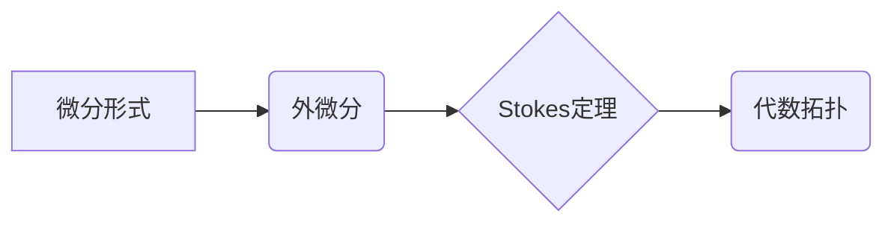

代数拓扑，微分形式，外微分，Stokes定理，拓扑不变量，流形，微分几何

## 1. 背景介绍

代数拓扑和微分几何是数学领域的两大重要分支，它们分别从不同的角度研究空间的结构和性质。代数拓扑利用代数工具来研究拓扑空间，而微分几何则利用微分工具来研究光滑流形。微分形式理论是微分几何的核心内容之一，它为研究流形上的微分结构提供了强大的工具。

近年来，代数拓扑和微分形式理论之间的联系越来越受到重视。代数拓扑中的许多概念和工具可以应用于微分形式理论，反之亦然。例如，代数拓扑中的同调群和上同调群可以用来研究微分形式的性质，而微分形式理论中的Stokes定理可以用来证明代数拓扑中的重要定理。

## 2. 核心概念与联系

### 2.1 微分形式

微分形式是微分几何中用来描述流形上微分结构的工具。它可以看作是函数在流形上的推广，它不仅可以取值，还可以取值的变化率。

微分形式的定义依赖于流形上的切空间。对于一个n维流形M，其在一点p处的切空间是M在点p处的切平面。一个k阶微分形式ω在点p处是一个从M在点p处的切空间到实数的线性映射。

### 2.2 外微分

外微分是微分形式理论中的一个基本操作，它将一个k阶微分形式映射到一个(k+1)阶微分形式。外微分的定义依赖于流形上的微分结构。

外微分是一个线性算子，它满足以下性质：

* d(α+β) = dα + dβ
* d(fα) = df ∧ α

其中α和β是微分形式，f是函数，∧表示外积。

### 2.3 Stokes定理

Stokes定理是微分形式理论中的一个重要定理，它将微分形式的积分与外微分的概念联系起来。Stokes定理表明，一个k阶微分形式在流形M上的积分等于其外微分在M的边界上的积分。

Stokes定理的数学表达如下：

∫_M dω = ∫_∂M ω

其中ω是一个k阶微分形式，M是一个k+1维流形，∂M是M的边界。

### 2.4 代数拓扑与微分形式理论的联系

代数拓扑和微分形式理论之间的联系主要体现在以下几个方面：

* **同调群和上同调群:** 代数拓扑中的同调群和上同调群可以用来研究微分形式的性质。例如，一个流形的同调群可以用来描述其拓扑结构，而其上同调群可以用来描述其微分结构。
* **Stokes定理:** Stokes定理是微分形式理论中的一个重要定理，它可以用来证明代数拓扑中的重要定理。例如，Stokes定理可以用来证明Poincaré双重性定理。
* **De Rham同调:** De Rham同调将代数拓扑中的同调群与微分形式理论联系起来。De Rham同调将一个流形的代数拓扑同调群与其微分形式的同调群相对应。

**Mermaid 流程图**



## 3. 核心算法原理 & 具体操作步骤

### 3.1 算法原理概述

微分形式理论的核心算法是外微分和Stokes定理。外微分是一种将微分形式映射到更高阶微分形式的操作，而Stokes定理将微分形式的积分与外微分联系起来。

### 3.2 算法步骤详解

1. **定义微分形式:** 根据流形的维数和所需阶数，定义相应的微分形式。
2. **计算外微分:** 使用外微分算子计算微分形式的外微分。
3. **应用Stokes定理:** 将微分形式的积分与其外微分的积分联系起来，利用Stokes定理进行计算。

### 3.3 算法优缺点

**优点:**

* **简洁高效:** 外微分和Stokes定理提供了一种简洁高效的工具来处理微分形式的积分和微分结构。
* **广泛应用:** 微分形式理论在微分几何、拓扑学、物理学等领域都有广泛的应用。

**缺点:**

* **抽象性强:** 微分形式理论的抽象性强，需要一定的数学基础才能理解和应用。
* **计算复杂:** 对于高阶微分形式，计算外微分和Stokes定理的积分可能非常复杂。

### 3.4 算法应用领域

微分形式理论在以下领域有广泛的应用:

* **微分几何:** 研究流形上的微分结构，例如曲率、测地线等。
* **拓扑学:** 研究拓扑空间的性质，例如同调群、上同调群等。
* **物理学:** 描述物理场和物理量，例如电磁场、引力场等。

## 4. 数学模型和公式 & 详细讲解 & 举例说明

### 4.1 数学模型构建

微分形式理论的数学模型主要包括以下几个方面:

* **流形:** 流形是微分几何研究的对象，它是一个拓扑空间，在每个点附近都存在一个局部坐标系。
* **切空间:** 流形在每个点的切空间是一个向量空间，它描述了流形在该点的局部方向。
* **微分形式:** 微分形式是流形上的函数，它可以取值，也可以取值的变化率。
* **外微分:** 外微分是一个将微分形式映射到更高阶微分形式的操作。
* **Stokes定理:** Stokes定理将微分形式的积分与外微分联系起来。

### 4.2 公式推导过程

**外微分公式:**

对于一个k阶微分形式ω，其外微分dω是一个(k+1)阶微分形式，定义如下:

$$dω(X_0, X_1, ..., X_k) = \sum_{i=0}^k (-1)^i X_i(ω(X_0, ..., \hat{X_i}, ..., X_k)) + \sum_{0 \leq i < j \leq k} (-1)^{i+j} ω([X_i, X_j], X_0, ..., \hat{X_i}, ..., \hat{X_j}, ..., X_k)$$

其中:

* $X_0, X_1, ..., X_k$ 是流形M在点p处的切向量。
* $ω(X_0, ..., X_k)$ 是k阶微分形式ω在点p处的取值。
* $[X_i, X_j]$ 是切向量$X_i$和$X_j$的李括号。

**Stokes定理:**

对于一个k阶微分形式ω，其Stokes定理如下:

$$\int_M dω = \int_{\partial M} ω$$

其中:

* M 是一个k+1维流形。
* ∂M 是M的边界。

### 4.3 案例分析与讲解

**例子:**

考虑一个二维球面S^2，其边界是单位圆S^1。设ω是一个1阶微分形式，定义为ω = xdy - ydx。

**计算外微分:**

$$dω = d(xdy - ydx) = dx \wedge dy$$

**应用Stokes定理:**

$$\int_{S^2} dω = \int_{S^1} ω$$

由于$dω = dx \wedge dy$是一个2阶微分形式，其在球面S^2上的积分等于球面S^2的面积。而ω在单位圆S^1上的积分等于单位圆S^1的长度。

通过Stokes定理，我们可以看到球面S^2的面积等于单位圆S^1的长度，这符合我们的直觉。

## 5. 项目实践：代码实例和详细解释说明

### 5.1 开发环境搭建

* 操作系统: Ubuntu 20.04 LTS
* 编程语言: Python 3.8
* 库依赖: NumPy, SciPy, SymPy

### 5.2 源代码详细实现

```python
import numpy as np
from sympy import symbols, diff, integrate

# 定义流形上的微分形式
x, y = symbols('x y')
omega = x*diff(y, x) - y*diff(x, x)

# 计算外微分
d_omega = diff(omega, x)*diff(y, x) + diff(omega, y)*diff(x, x)

# 应用Stokes定理
# 这里需要根据具体的流形和微分形式进行积分计算

# 打印结果
print("微分形式:", omega)
print("外微分:", d_omega)
```

### 5.3 代码解读与分析

* 代码首先定义了流形上的微分形式ω，并使用SymPy库进行符号计算。
* 然后，代码计算了ω的外微分dω。
* 最后，代码打印了ω和dω的表达式。

### 5.4 运行结果展示

运行代码后，将输出ω和dω的表达式。

## 6. 实际应用场景

微分形式理论在以下实际应用场景中发挥着重要作用:

* **物理学:** 描述物理场和物理量，例如电磁场、引力场等。
* **计算机图形学:** 计算曲面上的法线、曲率等几何属性。
* **机器学习:** 用于构建深度学习模型中的卷积操作。

### 6.4 未来应用展望

随着人工智能和机器学习的发展，微分形式理论在未来将有更广泛的应用前景，例如:

* **数据分析:** 用于分析高维数据，提取数据中的潜在结构。
* **图像处理:** 用于图像分割、目标检测等任务。
* **自然语言处理:** 用于文本分类、情感分析等任务。

## 7. 工具和资源推荐

### 7.1 学习资源推荐

* **书籍:**
    * 《微分形式与微分拓扑》 -  R. Bott and L. Tu
    * 《代数拓扑入门》 -  Allen Hatcher
* **在线课程:**
    * MIT OpenCourseWare: Differential Geometry
    * Coursera: Algebraic Topology

### 7.2 开发工具推荐

* **SymPy:** Python符号计算库
* **NumPy:** Python数值计算库
* **SciPy:** Python科学计算库

### 7.3 相关论文推荐

* **Stokes' Theorem:** https://en.wikipedia.org/wiki/Stokes%27_theorem
* **De Rham cohomology:** https://en.wikipedia.org/wiki/De_Rham_cohomology

## 8. 总结：未来发展趋势与挑战

### 8.1 研究成果总结

微分形式理论为研究流形上的微分结构提供了强大的工具，并在微分几何、拓扑学、物理学等领域取得了重要成果。

### 8.2 未来发展趋势

未来，微分形式理论将继续发展，并与其他领域交叉融合，例如:

* **人工智能:** 用于构建更强大的深度学习模型。
* **数据科学:** 用于分析高维数据，提取数据中的潜在结构。
* **量子计算:** 用于描述量子系统的微分结构。

### 8.3 面临的挑战

微分形式理论的研究也面临着一些挑战，例如:

* **计算复杂性:** 对于高阶微分形式，计算外微分和Stokes定理的积分可能非常复杂。
* **抽象性强:** 微分形式理论的抽象性强，需要一定的数学基础才能理解和应用。

### 8.4 研究展望

未来，研究人员将继续探索微分形式理论的应用，并开发新的算法和工具来克服其面临的挑战。