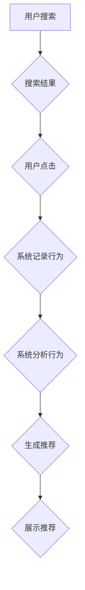

> 搜索推荐系统，单向交互，用户行为，协同过滤，内容过滤，推荐算法，个性化推荐

## 1. 背景介绍

在信息爆炸的时代，海量数据和信息涌现，用户面临着信息过载的困境。搜索推荐系统应运而生，旨在帮助用户快速找到所需信息，并提供个性化的推荐服务。传统搜索推荐系统主要依赖于用户搜索行为和物品属性信息，通过分析用户历史行为和物品特征，预测用户对特定物品的兴趣，从而实现推荐。

然而，传统搜索推荐系统存在着单向交互的局限性。用户与系统之间的交互主要以搜索查询和点击行为为主，系统无法主动获取用户更深层的意图和反馈。这种单向交互模式导致推荐结果缺乏个性化和精准度，难以满足用户日益增长的个性化需求。

## 2. 核心概念与联系

**2.1 搜索推荐系统**

搜索推荐系统是将搜索引擎和推荐系统的功能结合在一起的系统，旨在通过分析用户搜索行为和物品属性信息，提供更精准、更个性化的搜索结果和推荐列表。

**2.2 单向交互**

单向交互是指用户与系统之间信息流动的方向单一，用户主动向系统发出请求，系统被动地提供响应。

**2.3 用户行为**

用户行为是指用户在使用搜索推荐系统时所进行的所有操作，例如搜索查询、点击、浏览、购买等。

**2.4 协同过滤**

协同过滤是一种基于用户行为的推荐算法，通过分析用户对物品的评分或购买历史，预测用户对其他物品的兴趣。

**2.5 内容过滤**

内容过滤是一种基于物品属性的推荐算法，通过分析物品的特征和标签，预测用户对特定物品的兴趣。

**2.6 个性化推荐**

个性化推荐是指根据用户的兴趣、偏好和行为，提供定制化的推荐结果。

**2.7 推荐算法**

推荐算法是搜索推荐系统的核心，用于预测用户对特定物品的兴趣，并生成推荐列表。

**2.8 Mermaid 流程图**



## 3. 核心算法原理 & 具体操作步骤

### 3.1 算法原理概述

传统搜索推荐系统主要采用协同过滤和内容过滤两种推荐算法。

**协同过滤算法**

协同过滤算法基于用户的行为相似性进行推荐。它假设，如果用户A和用户B在过去对某些物品的评分或购买行为相似，那么用户A可能也喜欢用户B喜欢的物品。

**内容过滤算法**

内容过滤算法基于物品的属性特征进行推荐。它假设，如果用户A喜欢某些类型的物品，那么用户A也可能喜欢具有相似属性的物品。

### 3.2 算法步骤详解

**协同过滤算法步骤**

1. 收集用户行为数据，例如用户对物品的评分或购买历史。
2. 计算用户之间的相似度，例如余弦相似度或皮尔逊相关系数。
3. 找到与目标用户行为相似度最高的邻居用户。
4. 从邻居用户的行为数据中推荐目标用户可能感兴趣的物品。

**内容过滤算法步骤**

1. 收集物品属性数据，例如物品的类别、描述、标签等。
2. 为每个物品构建特征向量，表示物品的属性信息。
3. 计算用户与物品的相似度，例如余弦相似度。
4. 从与用户相似度最高的物品中推荐目标用户可能感兴趣的物品。

### 3.3 算法优缺点

**协同过滤算法**

* **优点:** 可以发现用户之间的隐性关系，推荐更个性化的物品。
* **缺点:** 数据稀疏性问题，当用户行为数据不足时，算法效果会下降。

**内容过滤算法**

* **优点:** 不需要用户行为数据，可以推荐新物品。
* **缺点:** 难以发现用户之间的隐性关系，推荐结果可能缺乏个性化。

### 3.4 算法应用领域

协同过滤和内容过滤算法广泛应用于电商推荐、音乐推荐、电影推荐等领域。

## 4. 数学模型和公式 & 详细讲解 & 举例说明

### 4.1 数学模型构建

**协同过滤算法的数学模型**

设用户集合为U，物品集合为I，用户对物品的评分矩阵为R，其中R(u,i)表示用户u对物品i的评分。协同过滤算法的目标是预测用户u对物品i的评分R(u,i)。

**内容过滤算法的数学模型**

设物品集合为I，物品特征向量集合为F，用户特征向量集合为U。内容过滤算法的目标是预测用户u对物品i的评分R(u,i)。

### 4.2 公式推导过程

**协同过滤算法的公式推导**

基于用户的行为相似性，协同过滤算法可以利用邻居用户的评分信息来预测目标用户的评分。例如，基于用户的评分相似度，可以计算出目标用户u对物品i的评分预测值：

$$
\hat{R}(u,i) = \frac{\sum_{v \in N(u)} \operatorname{sim}(u,v) \cdot R(v,i)}{\sum_{v \in N(u)} \operatorname{sim}(u,v)}
$$

其中，N(u)表示目标用户u的邻居用户集合，sim(u,v)表示用户u和用户v之间的相似度。

**内容过滤算法的公式推导**

基于物品的属性特征，内容过滤算法可以利用用户与物品的相似度来预测用户对物品的评分。例如，基于余弦相似度，可以计算出用户u对物品i的评分预测值：

$$
\hat{R}(u,i) = \operatorname{sim}(u,i) \cdot R(u,i)
$$

其中，sim(u,i)表示用户u与物品i的相似度。

### 4.3 案例分析与讲解

**协同过滤算法案例分析**

假设有一个电影推荐系统，用户A和用户B都喜欢动作片，并且对一部动作片都给出了5星的评分。根据协同过滤算法，可以认为用户A和用户B的行为相似，因此，如果用户A对一部新的动作片感兴趣，系统可以推荐给用户A，因为用户B也喜欢这部电影。

**内容过滤算法案例分析**

假设有一个音乐推荐系统，用户A喜欢摇滚乐，并且对一些摇滚乐歌曲都给出了高评分。根据内容过滤算法，系统可以分析这些歌曲的特征，例如音乐风格、节奏、歌词等，并推荐给用户A其他具有相似特征的摇滚乐歌曲。

## 5. 项目实践：代码实例和详细解释说明

### 5.1 开发环境搭建

* 操作系统：Windows/macOS/Linux
* Python版本：3.6+
* 必要的库：pandas, numpy, scikit-learn

### 5.2 源代码详细实现

```python
import pandas as pd
from sklearn.metrics.pairwise import cosine_similarity

# 加载用户评分数据
ratings_data = pd.read_csv('ratings.csv')

# 计算用户之间的余弦相似度
user_similarity = cosine_similarity(ratings_data.T)

# 获取目标用户ID
target_user_id = 1

# 获取目标用户喜欢的物品ID
liked_items = ratings_data[ratings_data['user_id'] == target_user_id][ratings_data['rating'] > 3]['item_id'].tolist()

# 找到与目标用户行为相似度最高的邻居用户
neighbors = user_similarity[target_user_id].argsort()[:-6:-1]

# 从邻居用户的行为数据中推荐目标用户可能感兴趣的物品
recommendations = []
for neighbor_user_id in neighbors:
    neighbor_ratings = ratings_data[ratings_data['user_id'] == neighbor_user_id]
    for item_id in neighbor_ratings['item_id'].tolist():
        if item_id not in liked_items:
            recommendations.append(item_id)

# 打印推荐结果
print(f'推荐给用户 {target_user_id} 的物品：{recommendations}')
```

### 5.3 代码解读与分析

* 代码首先加载用户评分数据，并使用余弦相似度计算用户之间的相似度。
* 然后，代码获取目标用户ID和喜欢的物品ID。
* 接着，代码找到与目标用户行为相似度最高的邻居用户。
* 最后，代码从邻居用户的行为数据中推荐目标用户可能感兴趣的物品，并打印推荐结果。

### 5.4 运行结果展示

运行上述代码后，将输出一个包含目标用户可能感兴趣物品ID的列表。

## 6. 实际应用场景

传统搜索推荐系统广泛应用于以下场景：

* **电商推荐:** 为用户推荐商品，提高转化率。
* **音乐推荐:** 为用户推荐歌曲，提高用户粘性。
* **电影推荐:** 为用户推荐电影，提高用户体验。
* **新闻推荐:** 为用户推荐新闻，提高用户获取信息效率。

### 6.4 未来应用展望

随着人工智能技术的不断发展，传统搜索推荐系统将朝着更智能、更个性化的方向发展。例如，

* **多模态推荐:** 将文本、图像、音频等多种模态信息融合到推荐系统中，提供更丰富的推荐结果。
* **个性化推荐:** 利用用户行为、兴趣、偏好等信息，提供更精准、更个性化的推荐结果。
* **实时推荐:** 基于用户实时行为，提供动态更新的推荐结果。

## 7. 工具和资源推荐

### 7.1 学习资源推荐

* **书籍:**
    * 推荐系统实践
    * 算法导论
* **在线课程:**
    * Coursera: Recommender Systems
    * edX: Introduction to Recommender Systems

### 7.2 开发工具推荐

* **Python:** 广泛应用于推荐系统开发，拥有丰富的库和工具。
* **Spark:** 大数据处理框架，可以用于处理海量用户行为数据。
* **TensorFlow/PyTorch:** 深度学习框架，可以用于构建更智能的推荐模型。

### 7.3 相关论文推荐

* **Collaborative Filtering for Implicit Feedback Datasets**
* **Matrix Factorization Techniques for Recommender Systems**
* **Deep Learning for Recommender Systems**

## 8. 总结：未来发展趋势与挑战

### 8.1 研究成果总结

传统搜索推荐系统已经取得了显著的成果，为用户提供了便捷的搜索和推荐服务。协同过滤和内容过滤算法是推荐系统的核心，并不断发展和完善。

### 8.2 未来发展趋势

未来，搜索推荐系统将朝着更智能、更个性化、更实时化的方向发展，并融合更多人工智能技术，例如深度学习、自然语言处理等。

### 8.3 面临的挑战

* **数据稀疏性:** 用户行为数据往往是稀疏的，这会影响推荐算法的准确性。
* **冷启动问题:** 新用户和新物品难以获得推荐，需要新的算法和策略来解决。
* **公平性问题:** 推荐结果可能存在偏差，需要确保推荐结果公平公正。

### 8.4 研究展望

未来，搜索推荐系统研究将重点关注以下几个方面:

* **解决数据稀疏性和冷启动问题:** 探索新的数据挖掘和特征工程方法，提高推荐算法的鲁棒性。
* **提升推荐个性化和精准度:** 利用深度学习和自然语言处理技术，更深入地理解用户需求，提供更精准的推荐结果。
* **保障推荐公平性和可解释性:** 研究推荐算法的公平性问题，并开发可解释的推荐模型，提高用户对推荐结果的信任度。

## 9. 附录：常见问题与解答

**Q1: 协同过滤和内容过滤算法有什么区别？**

**A1:** 协同过滤算法基于用户的行为相似性进行推荐，而内容过滤算法基于物品的属性特征进行推荐。

**Q2: 如何解决数据稀疏性问题？**

**A2:** 可以采用以下方法解决数据稀疏性