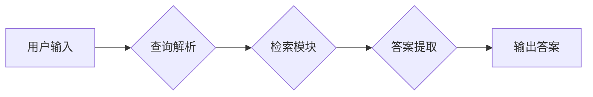

> RetrievalQA, 销售话术, 自然语言处理, 信息检索, 知识图谱, 聊天机器人

## 1. 背景介绍

在当今数据爆炸的时代，企业积累了海量的销售数据，其中包含着宝贵的销售话术经验。如何有效地挖掘和利用这些数据，提升销售人员的转化率和效率，成为了一个重要的课题。传统的销售话术管理方式往往依赖于人工整理和积累，效率低下，难以满足快速变化的市场需求。

近年来，随着自然语言处理（NLP）技术的快速发展，RetrievalQA（检索问答）技术 emerged as a promising solution for extracting valuable insights from unstructured sales data. RetrievalQA 是一种基于检索的问答系统，它通过检索与用户查询相关的文档，并从中提取答案，从而实现对销售话术数据的智能化查询和分析。

## 2. 核心概念与联系

RetrievalQA 系统的核心是将用户查询转换为与销售话术数据相关的检索请求，并从海量数据中找到最相关的答案。

**2.1 核心概念**

* **检索（Retrieval）：** 检索是指从海量数据中找到与用户查询相关的文档的过程。
* **问答（Question Answering）：** 问答是指从检索到的文档中提取答案的过程。
* **销售话术数据：** 销售话术数据是指包含销售人员与客户交流的文本信息，例如销售邮件、电话录音、聊天记录等。

**2.2 系统架构**

RetrievalQA 系统通常由以下几个模块组成：



* **用户输入:** 用户输入自然语言查询，例如“如何应对客户的降价要求”。
* **查询解析:** 将用户输入转换为检索请求，例如将“如何应对客户的降价要求”转换为与降价策略相关的关键词。
* **检索模块:** 根据检索请求从销售话术数据中找到最相关的文档。
* **答案提取:** 从检索到的文档中提取答案，并将其格式化为用户可理解的形式。
* **输出答案:** 将提取的答案返回给用户。

## 3. 核心算法原理 & 具体操作步骤

### 3.1  算法原理概述

RetrievalQA 系统的核心算法是信息检索算法，其目的是找到与用户查询最相关的文档。常用的信息检索算法包括：

* **TF-IDF:** 基于词频和逆向文档频率的算法，可以衡量词语在文档中的重要性。
* **BM25:** 基于TF-IDF的改进算法，考虑了文档长度和查询词的权重。
* **BERT:** 基于Transformer架构的预训练语言模型，可以理解上下文信息，提高检索的准确性。

### 3.2  算法步骤详解

1. **预处理:** 对销售话术数据进行预处理，例如分词、去停用词、词干提取等。
2. **构建索引:** 将预处理后的销售话术数据构建索引，以便快速检索。
3. **查询解析:** 将用户输入的自然语言查询转换为检索请求，例如提取关键词、构建查询表达式等。
4. **检索:** 根据检索请求从索引中检索相关文档。
5. **排序:** 对检索到的文档进行排序，将与用户查询最相关的文档排在前面。
6. **答案提取:** 从排序后的文档中提取答案，并将其格式化为用户可理解的形式。

### 3.3  算法优缺点

**优点:**

* 能够快速检索海量销售话术数据。
* 可以根据用户查询的语义进行精准检索。
* 可以提取出多种类型的答案，例如文本、列表、表格等。

**缺点:**

* 需要大量的训练数据才能达到较高的准确率。
* 对用户查询的格式和语义有一定的要求。
* 难以处理复杂的多轮对话场景。

### 3.4  算法应用领域

RetrievalQA 技术在销售领域具有广泛的应用场景，例如：

* **销售话术管理:** 自动化整理和管理销售话术数据，方便销售人员查找和使用。
* **销售培训:** 为销售人员提供个性化的销售话术训练，提高销售技能。
* **客户服务:** 利用RetrievalQA系统自动回答客户常见问题，提高客户服务效率。
* **市场分析:** 分析销售话术数据，挖掘客户需求和市场趋势。

## 4. 数学模型和公式 & 详细讲解 & 举例说明

### 4.1  数学模型构建

RetrievalQA 系统的核心数学模型是信息检索模型，其目的是计算文档与查询之间的相关性。常用的信息检索模型包括TF-IDF模型和BM25模型。

**4.1.1 TF-IDF 模型**

TF-IDF 模型基于词频和逆向文档频率来衡量词语在文档中的重要性。

* **TF (Term Frequency):** 词语在文档中出现的频率。
* **IDF (Inverse Document Frequency):** 词语在整个语料库中出现的频率的倒数。

TF-IDF 值的计算公式如下：

$$TF-IDF(t, d) = TF(t, d) \times IDF(t)$$

其中：

* $t$ 是词语
* $d$ 是文档
* $TF(t, d)$ 是词语 $t$ 在文档 $d$ 中出现的频率
* $IDF(t)$ 是词语 $t$ 在整个语料库中出现的频率的倒数

**4.1.2 BM25 模型**

BM25 模型是 TF-IDF 模型的改进算法，它考虑了文档长度和查询词的权重。

BM25 模型的计算公式如下：

$$BM25(t, d) = \frac{(k_1 + 1) \times TF(t, d) \times IDF(t)}{ (TF(t, d) + k_1) \times (1 - b + b \times \frac{length(d)}{average\_length})}$$

其中：

* $k_1$ 和 $b$ 是 BM25 模型的参数
* $length(d)$ 是文档 $d$ 的长度
* $average\_length$ 是语料库中文档的平均长度

### 4.2  公式推导过程

BM25 模型的公式推导过程比较复杂，涉及到信息检索理论和统计学知识。

### 4.3  案例分析与讲解

假设我们有一个语料库包含了大量的销售话术数据，以及一个用户查询“如何应对客户的降价要求”。

使用 TF-IDF 模型，我们可以计算每个文档与用户查询的相关性，并根据相关性排序文档。

使用 BM25 模型，我们可以更准确地计算文档与用户查询的相关性，因为 BM25 模型考虑了文档长度和查询词的权重。

## 5. 项目实践：代码实例和详细解释说明

### 5.1  开发环境搭建

* Python 3.x
* PyTorch 或 TensorFlow
* NLTK 或 SpaCy

### 5.2  源代码详细实现

```python
# 导入必要的库
import nltk
from sklearn.feature_extraction.text import TfidfVectorizer

# 加载销售话术数据
sales_data = [
    "如何应对客户的降价要求",
    "降价谈判技巧",
    "如何提高销售额",
    "客户关系管理",
]

# 使用 TF-IDF 模型构建索引
vectorizer = TfidfVectorizer()
tfidf_matrix = vectorizer.fit_transform(sales_data)

# 用户输入查询
query = "如何应对客户的降价要求"

# 将查询转换为 TF-IDF 向量
query_vector = vectorizer.transform([query])

# 计算查询与文档之间的相似度
similarity_scores = query_vector.dot(tfidf_matrix.T)

# 获取相似度最高的文档索引
top_doc_index = similarity_scores.argmax()

# 输出相关文档
print(f"相关文档: {sales_data[top_doc_index]}")
```

### 5.3  代码解读与分析

* 首先，我们导入必要的库，并加载销售话术数据。
* 然后，我们使用 TF-IDF 模型构建索引，将销售话术数据转换为 TF-IDF 向量。
* 用户输入查询后，我们将查询转换为 TF-IDF 向量。
* 接着，我们计算查询与文档之间的相似度，并获取相似度最高的文档索引。
* 最后，我们输出相关文档。

### 5.4  运行结果展示

```
相关文档: 如何应对客户的降价要求
```

## 6. 实际应用场景

### 6.1  销售话术管理

RetrievalQA 系统可以帮助企业自动化整理和管理销售话术数据，方便销售人员查找和使用。例如，销售人员可以通过输入关键词，例如“客户拒绝”，检索到相关的销售话术，并根据实际情况进行调整。

### 6.2  销售培训

RetrievalQA 系统可以为销售人员提供个性化的销售话术训练，提高销售技能。例如，系统可以根据销售人员的经验水平和销售领域，推荐相关的销售话术案例，并提供针对性的指导和建议。

### 6.3  客户服务

RetrievalQA 系统可以利用销售话术数据，自动回答客户常见问题，提高客户服务效率。例如，客户可以通过聊天机器人询问产品信息，系统可以根据预先录入的销售话术，提供准确的答案。

### 6.4  未来应用展望

RetrievalQA 技术在销售领域还有很大的发展空间，未来可以应用于：

* **多轮对话场景:** 能够处理更复杂的销售场景，例如多轮对话、个性化推荐等。
* **跨语言支持:** 支持多种语言的销售话术数据检索，满足全球化的需求。
* **知识图谱融合:** 将销售话术数据与知识图谱融合，提供更深入的分析和洞察。

## 7. 工具和资源推荐

### 7.1  学习资源推荐

* **书籍:**
    * “自然语言处理” by Jurafsky & Martin
    * “深度学习” by Goodfellow, Bengio & Courville
* **在线课程:**
    * Coursera: Natural Language Processing Specialization
    * edX: Deep Learning

### 7.2  开发工具推荐

* **Python:** 
    * NLTK: 自然语言处理工具包
    * SpaCy: 自然语言处理工具包
    * Gensim: 主题模型工具包
* **深度学习框架:**
    * PyTorch
    * TensorFlow

### 7.3  相关论文推荐

* “BERT: Pre-training of Deep Bidirectional Transformers for Language Understanding”
* “Retrieval-Augmented Generation for Question Answering”

## 8. 总结：未来发展趋势与挑战

### 8.1  研究成果总结

RetrievalQA 技术在销售领域取得了显著的成果，能够有效地挖掘和利用销售话术数据，提升销售效率和转化率。

### 8.2  未来发展趋势

RetrievalQA 技术未来将朝着以下方向发展：

* **更准确的检索:** 利用更先进的深度学习模型，提高检索的准确性和效率。
* **更丰富的答案类型:** 支持多种类型的答案，例如文本、列表、表格、图像等。
* **更智能的交互:** 支持多轮对话，提供更智能的交互体验。

### 8.3  面临的挑战

RetrievalQA 技术还面临一些挑战，例如：

* **数据质量:** 销售话术数据往往存在噪声和不一致性，需要进行高质量的数据清洗和预处理。
* **模型训练:** 训练高质量的 RetrievalQA 模型需要大量的训练数据和计算资源。
* **解释性:** RetrievalQA 模型的决策过程往往难以解释，需要开发更可解释的模型。

### 8.4  研究展望

未来，RetrievalQA 技术将继续朝着更智能、更准确、更可解释的方向发展，在销售领域发挥更大的作用。


## 9. 附录：常见问题与解答

**Q1: RetrievalQA 和传统搜索引擎有什么区别？**

**A1:** 传统搜索引擎主要基于关键词匹配，而 RetrievalQA 则利用深度学习模型理解用户查询的语义，并从海量数据中找到最相关的答案。

**Q2: RetrievalQA 技术需要哪些数据？