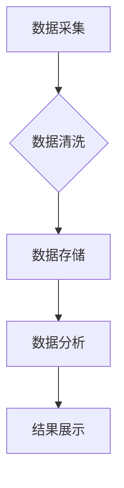

> 大数据，信息差，商业运营，数据分析，机器学习，预测模型，运营效率

## 1. 背景介绍

在当今数据爆炸的时代，企业拥有海量的数据资源，但如何有效地利用这些数据来提升运营效率，缩小信息差，从而获得竞争优势，成为了企业面临的重大挑战。大数据技术应运而生，为企业提供了强大的工具和手段，帮助企业从海量数据中挖掘价值，洞察市场趋势，优化运营决策，最终实现商业价值最大化。

传统商业运营模式往往依赖于经验和直觉，容易受到主观因素的影响，难以应对快速变化的市场环境。而大数据分析则可以提供更加客观、科学、精准的决策依据。通过对历史数据进行分析和挖掘，企业可以识别出潜在的市场机会和风险，制定更加有效的营销策略，优化产品设计，提高客户服务质量，最终提升整体运营效率。

## 2. 核心概念与联系

**2.1 信息差与商业运营**

信息差是指企业在获取、处理和利用信息方面与竞争对手之间的差距。在信息时代，信息差已经成为企业竞争的关键要素。拥有更丰富、更准确、更及时的信息，企业能够更有效地了解市场需求、预测市场趋势、制定战略决策，从而获得竞争优势。

**2.2 大数据与信息差缩小**

大数据是指海量、高速、多样化的数据。大数据技术可以帮助企业收集、存储、处理和分析海量数据，从中挖掘出隐藏的价值，缩小信息差。

**2.3 大数据应用于商业运营**

大数据技术可以应用于各个环节的商业运营，例如：

* **市场营销：** 通过分析客户数据，精准定位目标客户，制定个性化营销策略，提高营销效率。
* **产品开发：** 通过分析用户反馈和市场需求，洞察用户需求，开发更符合市场需求的产品。
* **运营管理：** 通过分析运营数据，优化运营流程，提高运营效率。
* **风险控制：** 通过分析风险数据，识别潜在风险，制定风险控制措施。

**2.4 大数据分析流程**



## 3. 核心算法原理 & 具体操作步骤

**3.1 算法原理概述**

大数据分析中常用的算法包括：

* **分类算法：** 用于将数据分类到不同的类别，例如垃圾邮件分类、客户画像分析。
* **回归算法：** 用于预测连续数值，例如销售额预测、房价预测。
* **聚类算法：** 用于将数据分组，例如客户群分析、市场细分。
* **关联规则挖掘算法：** 用于发现数据之间的关联关系，例如市场营销分析、商品推荐。

**3.2 算法步骤详解**

以分类算法为例，其基本步骤包括：

1. **数据预处理：** 对数据进行清洗、转换、特征工程等操作，以提高算法的准确性。
2. **模型训练：** 使用训练数据训练分类模型，例如决策树、支持向量机、神经网络等。
3. **模型评估：** 使用测试数据评估模型的性能，例如准确率、召回率、F1-score等。
4. **模型调优：** 根据评估结果，调整模型参数，以提高模型性能。
5. **模型部署：** 将训练好的模型部署到生产环境中，用于对新数据进行分类预测。

**3.3 算法优缺点**

不同的算法具有不同的优缺点，需要根据实际应用场景选择合适的算法。例如，决策树算法易于理解和解释，但性能可能不如支持向量机算法；神经网络算法性能强大，但训练复杂度高。

**3.4 算法应用领域**

大数据分析算法广泛应用于各个领域，例如：

* **金融：** 欺诈检测、风险评估、信用评分。
* **医疗：** 疾病诊断、药物研发、患者画像分析。
* **电商：** 商品推荐、用户画像分析、精准营销。
* **交通：** 交通流量预测、路线规划、智能交通管理。

## 4. 数学模型和公式 & 详细讲解 & 举例说明

**4.1 数学模型构建**

在数据分析中，数学模型可以用来描述数据之间的关系，并进行预测。例如，线性回归模型可以用来预测连续数值，其数学模型如下：

$$y = mx + c$$

其中：

* $y$ 是预测值
* $x$ 是输入变量
* $m$ 是斜率
* $c$ 是截距

**4.2 公式推导过程**

线性回归模型的系数 $m$ 和 $c$ 可以通过最小二乘法求解。最小二乘法是指寻找使得预测值与实际值之间的误差平方和最小的参数值。

**4.3 案例分析与讲解**

假设我们想要预测房屋价格，已知房屋面积 $x$ 和房屋价格 $y$ 的数据。我们可以使用线性回归模型来建立房屋价格预测模型。

通过对数据进行分析，我们可以得到线性回归模型的方程：

$$y = 5000x + 100000$$

其中：

* $y$ 是房屋价格
* $x$ 是房屋面积

根据这个模型，我们可以预测不同面积的房屋价格。例如，如果房屋面积为 100 平方米，则其价格为：

$$y = 5000 * 100 + 100000 = 1000000$$

## 5. 项目实践：代码实例和详细解释说明

**5.1 开发环境搭建**

* 操作系统：Windows/Linux/macOS
* Python 版本：3.6+
* 必要的库：pandas, numpy, scikit-learn

**5.2 源代码详细实现**

```python
import pandas as pd
from sklearn.linear_model import LinearRegression
from sklearn.model_selection import train_test_split

# 加载数据
data = pd.read_csv('house_data.csv')

# 分割特征和目标变量
X = data[['面积']]
y = data['价格']

# 将数据分成训练集和测试集
X_train, X_test, y_train, y_test = train_test_split(X, y, test_size=0.2, random_state=42)

# 创建线性回归模型
model = LinearRegression()

# 训练模型
model.fit(X_train, y_train)

# 预测测试集数据
y_pred = model.predict(X_test)

# 评估模型性能
from sklearn.metrics import mean_squared_error
mse = mean_squared_error(y_test, y_pred)
print(f'均方误差: {mse}')
```

**5.3 代码解读与分析**

* 首先，我们加载数据，并将其分割成特征和目标变量。
* 然后，我们将数据分成训练集和测试集，用于训练和评估模型。
* 接下来，我们创建线性回归模型，并使用训练集数据进行训练。
* 训练完成后，我们使用测试集数据进行预测，并评估模型性能。

**5.4 运行结果展示**

运行代码后，会输出模型的均方误差值。均方误差值越小，模型的预测精度越高。

## 6. 实际应用场景

**6.1 市场营销**

* **精准营销：** 通过分析客户数据，识别潜在客户，并根据客户的兴趣爱好、购买行为等信息，制定个性化的营销策略，提高营销效率。
* **客户关系管理：** 通过分析客户数据，了解客户的满意度、忠诚度等信息，及时解决客户问题，提升客户满意度。

**6.2 产品开发**

* **产品需求分析：** 通过分析用户反馈、市场趋势等数据，洞察用户需求，开发更符合市场需求的产品。
* **产品优化：** 通过分析用户使用数据，识别产品缺陷，并进行优化改进，提升产品质量。

**6.3 运营管理**

* **运营效率优化：** 通过分析运营数据，识别运营瓶颈，并制定优化措施，提高运营效率。
* **库存管理：** 通过分析销售数据，预测未来需求，优化库存管理，降低库存成本。

**6.4 未来应用展望**

随着大数据技术的不断发展，其应用场景将更加广泛，例如：

* **个性化推荐：** 基于用户行为数据，提供更加个性化的商品、服务推荐。
* **智能客服：** 利用自然语言处理技术，开发智能客服系统，提供更加便捷的客户服务。
* **预测分析：** 利用机器学习算法，对未来趋势进行预测，帮助企业做出更科学的决策。

## 7. 工具和资源推荐

**7.1 学习资源推荐**

* **书籍：**
    * 《Python数据科学手册》
    * 《机器学习实战》
    * 《大数据分析》
* **在线课程：**
    * Coursera
    * edX
    * Udemy

**7.2 开发工具推荐**

* **Python：** 
    * Jupyter Notebook
    * PyCharm
* **数据处理工具：**
    * pandas
    * numpy
* **机器学习库：**
    * scikit-learn
    * TensorFlow
    * PyTorch

**7.3 相关论文推荐**

* 《大数据分析方法综述》
* 《机器学习算法在商业运营中的应用》
* 《大数据驱动的精准营销》

## 8. 总结：未来发展趋势与挑战

**8.1 研究成果总结**

大数据技术在商业运营领域的应用取得了显著成果，帮助企业提高运营效率、缩小信息差、获得竞争优势。

**8.2 未来发展趋势**

* **人工智能技术的融合：** 将人工智能技术与大数据技术相结合，开发更加智能、高效的商业运营解决方案。
* **边缘计算的应用：** 将数据分析能力部署到边缘设备，实现实时数据处理和决策。
* **数据可视化的发展：** 开发更加直观、易懂的数据可视化工具，帮助企业更好地理解数据，做出更明智的决策。

**8.3 面临的挑战**

* **数据质量问题：** 大数据往往存在数据不完整、不准确、不一致等问题，需要进行有效的数据清洗和处理。
* **数据安全问题：** 大数据涉及到大量敏感信息，需要采取有效的安全措施，保护数据安全。
* **人才短缺问题：** 大数据分析需要专业的技术人才，而目前人才供给不足。

**8.4 研究展望**

未来，大数据技术将继续发展，并在商业运营领域发挥更加重要的作用。需要加强对大数据技术的研发和应用，培养大数据人才，解决数据质量、数据安全等问题，推动大数据技术在商业运营领域的健康发展。

## 9. 附录：常见问题与解答

**9.1 如何处理大数据中的缺失值？**

常见的方法包括：删除缺失值、用平均值或中位数填充缺失值、使用机器学习算法进行预测填充等。

**9.2 如何评估大数据分析模型的性能？**

常用的评估指标包括准确率、召回率、F1-score、AUC等。

**9.3 如何保护大数据中的敏感信息？**

常用的方法包括数据脱敏、加密、访问控制等。


作者：禅与计算机程序设计艺术 / Zen and the Art of Computer Programming 
<end_of_turn>