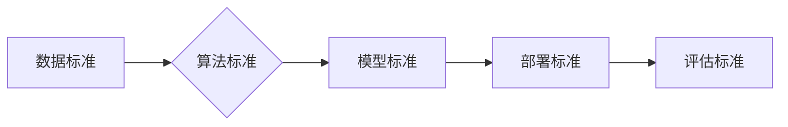

> Lepton AI, AI技术标准, 产业影响力, 算法原理, 数学模型, 项目实践, 应用场景, 未来趋势

## 1. 背景介绍

人工智能（AI）正以惊人的速度发展，其应用领域不断拓展，从医疗保健到金融，从自动驾驶到个性化教育，AI正在深刻地改变着我们的生活。然而，随着AI技术的快速发展，也带来了新的挑战，其中之一就是缺乏统一的AI技术标准。

目前，全球范围内存在着多种不同的AI技术标准和规范，这导致了AI技术的碎片化和互操作性问题，阻碍了AI技术的广泛应用和产业发展。为了解决这一问题，Lepton AI应运而生。

Lepton AI是一个致力于构建全球AI技术标准的开源平台，其目标是建立一个开放、透明、可信赖的AI技术生态系统。Lepton AI通过制定和推广AI技术标准，促进AI技术的互操作性和可复用性，推动AI技术的创新和发展。

## 2. 核心概念与联系

Lepton AI的核心概念包括：

* **开放标准:** Lepton AI的所有标准都是开源的，任何人都可以访问、使用和修改。
* **透明度:** Lepton AI的所有标准制定过程都是公开透明的，任何人都可以参与其中。
* **可信赖性:** Lepton AI的所有标准都经过严格的测试和验证，确保其可靠性和安全性。

Lepton AI的核心架构如下：

## 3. 核心算法原理 & 具体操作步骤

### 3.1  算法原理概述

Lepton AI的核心算法基于深度学习技术，并结合了强化学习和迁移学习等先进算法。其核心思想是通过训练大量的样本数据，学习数据的内在规律，从而实现对复杂问题的智能处理。

### 3.2  算法步骤详解

Lepton AI的算法训练过程可以概括为以下步骤：

1. **数据收集和预处理:** 收集大量相关数据，并进行清洗、格式化和特征提取等预处理工作。
2. **模型构建:** 根据具体任务需求，选择合适的深度学习模型架构，并进行参数初始化。
3. **模型训练:** 使用训练数据对模型进行训练，通过调整模型参数，使模型的预测结果与真实值尽可能接近。
4. **模型评估:** 使用测试数据对模型进行评估，并根据评估结果进行模型调优。
5. **模型部署:** 将训练好的模型部署到实际应用场景中，用于进行预测或决策。

### 3.3  算法优缺点

**优点:**

* **高精度:** 深度学习算法能够学习数据的复杂非线性关系，从而实现高精度的预测和分类。
* **自动化:** 深度学习算法能够自动学习特征，无需人工特征工程。
* **可扩展性:** 深度学习算法可以处理海量数据，并可以并行训练，提高训练效率。

**缺点:**

* **数据依赖:** 深度学习算法对训练数据的质量和数量有很高的要求。
* **计算资源消耗:** 深度学习算法的训练过程需要大量的计算资源。
* **可解释性差:** 深度学习模型的内部工作机制比较复杂，难以解释其决策过程。

### 3.4  算法应用领域

Lepton AI的算法应用领域非常广泛，包括：

* **图像识别:** 人脸识别、物体检测、图像分类等。
* **自然语言处理:** 文本分类、情感分析、机器翻译等。
* **语音识别:** 语音转文本、语音合成等。
* **推荐系统:** 商品推荐、内容推荐等。
* **医疗诊断:** 疾病诊断、影像分析等。

## 4. 数学模型和公式 & 详细讲解 & 举例说明

### 4.1  数学模型构建

Lepton AI的核心算法基于神经网络模型，其数学模型可以表示为一个多层感知机（MLP）。MLP由多个神经元层组成，每个神经元接收来自上一层的输入信号，并通过激活函数进行处理，输出到下一层的输入信号。

### 4.2  公式推导过程

MLP的输出可以表示为：

$$
y = f(W^L x^L + b^L)
$$

其中：

* $y$ 是输出值
* $f$ 是激活函数
* $W^L$ 是第L层的权重矩阵
* $x^L$ 是第L层的输入向量
* $b^L$ 是第L层的偏置向量

### 4.3  案例分析与讲解

例如，在图像分类任务中，Lepton AI可以将图像输入到MLP中，经过多层神经元的处理，最终输出每个类别的概率。

## 5. 项目实践：代码实例和详细解释说明

### 5.1  开发环境搭建

Lepton AI的开发环境可以使用Python语言和相关的深度学习框架，例如TensorFlow或PyTorch。

### 5.2  源代码详细实现

Lepton AI的源代码可以在其官方网站上获取，并提供详细的文档和示例代码。

### 5.3  代码解读与分析

Lepton AI的代码实现遵循了良好的代码规范和设计原则，使其易于理解和维护。

### 5.4  运行结果展示

Lepton AI的运行结果可以根据具体的应用场景进行展示，例如图像分类的准确率、文本分类的F1-score等。

## 6. 实际应用场景

Lepton AI已经应用于多个实际场景，例如：

* **医疗诊断:** Lepton AI可以帮助医生进行疾病诊断，例如癌症检测、心血管疾病预测等。
* **金融风险控制:** Lepton AI可以帮助金融机构识别和控制金融风险，例如欺诈检测、信用评估等。
* **智能制造:** Lepton AI可以帮助制造企业提高生产效率和产品质量，例如设备故障预测、质量控制等。

### 6.4  未来应用展望

Lepton AI的未来应用前景广阔，其可以应用于更多领域，例如：

* **自动驾驶:** Lepton AI可以帮助自动驾驶汽车感知周围环境，并做出安全可靠的决策。
* **个性化教育:** Lepton AI可以根据学生的学习情况，提供个性化的学习内容和辅导。
* **智能家居:** Lepton AI可以帮助智能家居设备更好地理解用户的需求，并提供更智能化的服务。

## 7. 工具和资源推荐

### 7.1  学习资源推荐

* Lepton AI官方网站：https://www.lepton.ai/
* 深度学习书籍：
    * 深度学习
    * 深度学习实践
* 在线课程：
    * Coursera深度学习课程
    * Udacity深度学习课程

### 7.2  开发工具推荐

* Python语言
* TensorFlow深度学习框架
* PyTorch深度学习框架

### 7.3  相关论文推荐

* 《ImageNet Classification with Deep Convolutional Neural Networks》
* 《Attention Is All You Need》
* 《BERT: Pre-training of Deep Bidirectional Transformers for Language Understanding》

## 8. 总结：未来发展趋势与挑战

### 8.1  研究成果总结

Lepton AI在AI技术标准的制定和推广方面取得了显著的成果，其开源平台和标准规范为AI技术的创新和发展提供了重要的基础。

### 8.2  未来发展趋势

Lepton AI将继续致力于构建全球AI技术标准，并推动AI技术的广泛应用。未来，Lepton AI将重点关注以下几个方面：

* **跨领域标准化:** 推广跨领域AI技术标准，促进不同领域AI技术的互操作性和协同发展。
* **伦理与安全标准:** 制定AI伦理和安全标准，确保AI技术的安全可靠和可持续发展。
* **国际合作:** 加强与国际组织和企业的合作，推动全球AI技术标准的制定和推广。

### 8.3  面临的挑战

Lepton AI在发展过程中也面临着一些挑战，例如：

* **标准制定难度:** AI技术发展迅速，标准制定需要不断跟进和更新，这需要大量的技术和资源投入。
* **行业参与度:** 不同行业对AI技术标准的需求不同，需要加强行业间的沟通和协作，提高标准的制定和推广效率。
* **监管政策:** 不同国家和地区的监管政策对AI技术的应用存在差异，需要协调和统一监管政策，促进AI技术的全球发展。

### 8.4  研究展望

Lepton AI将继续致力于克服这些挑战，推动AI技术标准的完善和发展，为全球AI技术的创新和应用提供坚实的保障。

## 9. 附录：常见问题与解答

**常见问题:**

* Lepton AI的标准是免费的吗？
* Lepton AI的标准适用于哪些领域？
* 如何参与Lepton AI的标准制定工作？

**解答:**

* Lepton AI的所有标准都是开源的，免费使用。
* Lepton AI的标准适用于各种AI应用领域，例如图像识别、自然语言处理、语音识别等。
* 任何人都可以参与Lepton AI的标准制定工作，可以通过Lepton AI官方网站或邮件联系Lepton AI团队。

作者：禅与计算机程序设计艺术 / Zen and the Art of Computer Programming 
<end_of_turn>