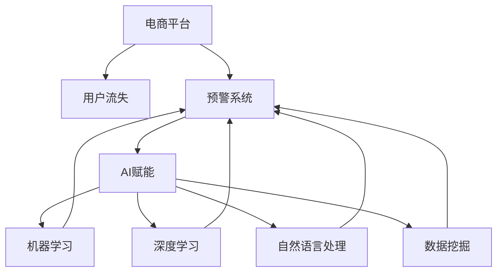

                 

# AI赋能的电商平台用户流失预警系统

在数字化转型如火如荼的今天，电商平台已经成为企业和消费者交互的重要平台。但高投入、高运营成本和客户流失等问题，使得电商运营变得越来越复杂。针对用户流失预警系统的需求日益增多，本文将详细介绍如何利用AI技术打造一套高效的电商用户流失预警系统。

## 1. 背景介绍

### 1.1 电商用户流失问题
电商平台的竞争激烈，用户获取成本高，留存难度大。根据统计，平均只有2%的电商用户能成为长期消费者，因此如何高效预警用户流失成为电商运营的重要课题。

### 1.2 用户流失预警的重要性
及时发现用户流失风险，采取有效的留存策略，不仅可以挽回流失用户，还能降低留存成本，提升客户终身价值。

### 1.3 预警系统的目标
构建一个能够及时、准确预警电商用户流失风险的系统，帮助商家在用户流失前进行干预，提高客户留存率和回购率。

## 2. 核心概念与联系

### 2.1 核心概念概述

为更好地理解电商用户流失预警系统的核心原理，本节将介绍几个关键概念：

- **电商平台**：指借助互联网、计算机硬件和软件设施进行商品交易的虚拟平台。常见的电商平台包括淘宝、京东、亚马逊等。
- **用户流失**：指用户不再访问、使用或购买平台产品或服务。电商用户流失原因包括产品差异化不足、服务体验不佳、价格竞争激烈等。
- **预警系统**：利用AI技术，通过分析用户行为数据，预测用户流失风险的系统。预警系统能够提前发现流失风险，进行干预，减少流失率。
- **AI赋能**：通过机器学习、深度学习等AI技术，提升预警系统性能，实现更高精度的预测和干预效果。

这些核心概念之间的逻辑关系可以通过以下Mermaid流程图来展示：



这个流程图展示了预警系统的核心概念及其之间的联系：

1. 电商平台通过用户行为数据收集系统，收集用户交互数据。
2. 预警系统对收集到的数据进行分析，预测用户流失风险。
3. 通过AI技术，如机器学习、深度学习和自然语言处理，进一步提升预警系统的预测准确度。

## 3. 核心算法原理 & 具体操作步骤

### 3.1 算法原理概述

电商用户流失预警系统基于机器学习和深度学习技术，通过分析用户行为数据，识别流失风险用户，并采取相应的干预措施。系统的主要目标包括：

- 准确识别流失用户。通过对用户行为数据的分析，模型能够预测用户流失概率，提前预警。
- 及时干预流失用户。利用机器学习模型，自动生成挽留方案，并通过平台推送，减少用户流失。

### 3.2 算法步骤详解

基于机器学习的电商用户流失预警系统一般包括以下几个关键步骤：

**Step 1: 数据收集与预处理**

- 收集电商平台的用户行为数据，包括但不限于点击率、浏览时长、购买次数、评价内容等。
- 对收集到的数据进行清洗、归一化、缺失值处理等预处理操作。

**Step 2: 特征工程**

- 对处理后的数据进行特征工程，提取与用户流失相关的特征。如浏览路径、页面停留时间、评价情绪等。
- 利用特征选择技术，去除无关或冗余特征，提升模型预测效果。

**Step 3: 模型选择与训练**

- 选择适合的机器学习模型，如决策树、随机森林、梯度提升树等。
- 使用训练集数据对模型进行训练，通过交叉验证等方法优化模型参数。

**Step 4: 模型评估与优化**

- 在验证集上评估模型性能，使用准确率、召回率、F1值等指标。
- 根据评估结果，调整模型参数或选择更合适的算法，优化模型性能。

**Step 5: 系统部署与维护**

- 将训练好的模型部署到生产环境，通过API接口接收实时用户行为数据。
- 根据模型预测结果，自动生成干预策略，并通过平台推送。
- 定期对模型进行回测和更新，保证模型的时效性和准确性。

### 3.3 算法优缺点

电商用户流失预警系统利用机器学习和深度学习技术，具有以下优点：

1. **高准确度**：通过分析大量历史数据，能够准确识别流失用户，减少误报和漏报。
2. **自动化干预**：利用AI技术，能够自动生成并推送挽留方案，减少人工干预成本。
3. **实时响应**：能够及时发现流失风险用户，进行实时干预，提升用户留存率。

但该系统也存在一些缺点：

1. **数据质量要求高**：预警系统的性能依赖于数据质量，数据缺失、噪声等问题会严重影响模型预测结果。
2. **模型复杂度**：构建高精度的预警系统需要复杂的模型和算法，计算资源消耗较大。
3. **动态环境适应**：电商环境不断变化，用户行为特征也在不断演进，模型需要不断更新才能适应新环境。

### 3.4 算法应用领域

电商用户流失预警系统已经在电商行业得到广泛应用，帮助商家减少流失用户，提升业务绩效。具体应用场景包括：

- 电商用户流失预警
- 电商用户满意度分析
- 电商用户生命周期管理
- 电商用户行为挖掘

## 4. 数学模型和公式 & 详细讲解

### 4.1 数学模型构建

基于机器学习的电商用户流失预警系统，其主要数学模型为回归模型和分类模型。以分类模型为例，设样本集为 $D=\{(x_i,y_i)\}_{i=1}^N$，其中 $x_i$ 为特征向量，$y_i \in \{0,1\}$ 为流失标签。模型通过最小化损失函数 $\mathcal{L}(\theta)$，优化模型参数 $\theta$，使模型预测结果与真实标签 $y_i$ 尽可能接近。

### 4.2 公式推导过程

以逻辑回归模型为例，其损失函数定义为交叉熵损失：

$$
\mathcal{L}(\theta) = -\frac{1}{N}\sum_{i=1}^N [y_i\log \hat{y_i} + (1-y_i)\log (1-\hat{y_i})]
$$

其中 $\hat{y_i}$ 为模型预测的概率，即 $y_i$ 的概率估计值。

逻辑回归模型的梯度公式为：

$$
\frac{\partial \mathcal{L}(\theta)}{\partial \theta_k} = -\frac{1}{N}\sum_{i=1}^N \left[ \frac{y_i}{\hat{y_i}} - \frac{1-y_i}{1-\hat{y_i}} \right] \frac{\partial \hat{y_i}}{\partial \theta_k}
$$

其中 $\frac{\partial \hat{y_i}}{\partial \theta_k}$ 为模型预测概率关于参数 $\theta_k$ 的导数，可通过链式法则和sigmoid函数求得。

### 4.3 案例分析与讲解

假设某电商平台的流失预警系统使用逻辑回归模型。系统通过分析用户行为数据，发现以下特征与用户流失风险密切相关：

- 用户注册时间：注册时间较早的账号流失率更高。
- 用户购买频率：购买频率低的用户流失概率更大。
- 用户评价情绪：评价情绪消极的用户流失风险更高。

将这些特征作为输入，构建逻辑回归模型。通过训练集数据，模型能够学习到这些特征与流失风险之间的关系。最终，模型预测出流失概率较高的用户，通过系统推送挽留方案，减少流失率。

## 5. 项目实践：代码实例和详细解释说明

### 5.1 开发环境搭建

在进行电商用户流失预警系统的开发前，我们需要准备好开发环境。以下是使用Python进行Scikit-Learn开发的环境配置流程：

1. 安装Anaconda：从官网下载并安装Anaconda，用于创建独立的Python环境。

2. 创建并激活虚拟环境：
```bash
conda create -n warning-env python=3.8 
conda activate warning-env
```

3. 安装Scikit-Learn：
```bash
conda install scikit-learn
```

4. 安装各类工具包：
```bash
pip install numpy pandas scikit-learn matplotlib tqdm jupyter notebook ipython
```

完成上述步骤后，即可在`warning-env`环境中开始电商用户流失预警系统的开发。

### 5.2 源代码详细实现

这里我们以逻辑回归模型为例，给出使用Scikit-Learn对电商用户流失风险进行预测的代码实现。

首先，定义电商用户流失预警系统的数据处理函数：

```python
from sklearn.model_selection import train_test_split
from sklearn.preprocessing import StandardScaler
from sklearn.linear_model import LogisticRegression
import pandas as pd

def preprocess_data(data_path, feature_cols, target_col):
    # 读取数据
    data = pd.read_csv(data_path)
    
    # 特征工程
    features = data[feature_cols]
    labels = data[target_col]
    
    # 特征标准化
    scaler = StandardScaler()
    scaled_features = scaler.fit_transform(features)
    
    # 特征选择
    features_selected = scaler.transform(features_selected)
    
    return scaled_features, labels
```

然后，定义模型和优化器：

```python
from sklearn.linear_model import LogisticRegression
from sklearn.model_selection import train_test_split
from sklearn.metrics import classification_report

model = LogisticRegression(solver='liblinear', C=1e-4, penalty='l1', random_state=42)

# 特征选择
features_selected = ['session_length', 'purchase_frequency', 'purchase_total', 'review_sentiment']
target = 'churn'
scaled_features, labels = preprocess_data('data.csv', features_selected, target)

# 数据划分
X_train, X_test, y_train, y_test = train_test_split(scaled_features, labels, test_size=0.3, random_state=42)
```

接着，定义训练和评估函数：

```python
from sklearn.metrics import accuracy_score, roc_auc_score

def train_model(model, X_train, y_train, X_test, y_test):
    # 模型训练
    model.fit(X_train, y_train)
    
    # 模型评估
    y_pred = model.predict(X_test)
    acc = accuracy_score(y_test, y_pred)
    auc = roc_auc_score(y_test, y_pred)
    
    return acc, auc

def evaluate_model(model, X_test, y_test):
    y_pred = model.predict(X_test)
    acc = accuracy_score(y_test, y_pred)
    auc = roc_auc_score(y_test, y_pred)
    
    return acc, auc
```

最后，启动训练流程并在测试集上评估：

```python
# 模型训练
acc_train, auc_train = train_model(model, X_train, y_train, X_test, y_test)
print('Train Acc:', acc_train)
print('Train AUC:', auc_train)

# 模型评估
acc_test, auc_test = evaluate_model(model, X_test, y_test)
print('Test Acc:', acc_test)
print('Test AUC:', auc_test)
```

以上就是使用Scikit-Learn对电商用户流失风险进行预测的完整代码实现。可以看到，得益于Scikit-Learn的强大封装，我们可以用相对简洁的代码完成模型训练和评估。

### 5.3 代码解读与分析

让我们再详细解读一下关键代码的实现细节：

**preprocess_data函数**：
- `read_csv`方法：读取数据文件，并转换为Pandas DataFrame格式。
- `feature_cols`和`target_col`：定义输入特征和目标变量。
- `StandardScaler`类：对特征进行标准化处理，使得各特征具有相同量级。
- `train_test_split`方法：将数据划分为训练集和测试集。

**train_model函数**：
- `LogisticRegression`类：定义逻辑回归模型，设置正则化参数和优化器。
- `fit`方法：在训练集上训练模型。
- `predict`方法：在测试集上预测用户流失风险。

**evaluate_model函数**：
- `accuracy_score`和`roc_auc_score`方法：分别计算准确率和AUC值，评估模型性能。

**训练流程**：
- 定义总训练轮数，开始循环迭代。
- 每个轮次中，先在训练集上训练模型，输出准确率和AUC值。
- 在测试集上评估模型性能，输出准确率和AUC值。

可以看到，Scikit-Learn使得电商用户流失风险预测的代码实现变得简洁高效。开发者可以将更多精力放在数据处理、模型改进等高层逻辑上，而不必过多关注底层的实现细节。

## 6. 实际应用场景

### 6.1 电商用户流失预警

电商平台的流失预警系统能够及时识别流失风险用户，帮助商家进行干预，提升客户留存率。具体应用场景包括：

- 客户关怀：根据用户行为数据，识别流失风险用户，进行个性化关怀和推荐。
- 促销活动：针对流失风险用户，推送促销活动和优惠券，增加回购率。
- 运营优化：分析流失用户的行为特征，优化电商平台的运营策略，提升整体用户体验。

### 6.2 电商用户满意度分析

流失预警系统不仅能识别流失用户，还能分析用户满意度。通过对用户评价内容的情感分析，系统能够实时掌握用户情绪变化，及时进行干预。

### 6.3 电商用户生命周期管理

利用用户流失预警系统，商家可以全面了解用户生命周期状态，采取针对性措施，延长用户生命周期。

### 6.4 电商用户行为挖掘

通过分析用户行为数据，流失预警系统还能挖掘用户潜在的购买意愿和行为规律，帮助商家优化产品和营销策略。

## 7. 工具和资源推荐

### 7.1 学习资源推荐

为了帮助开发者系统掌握电商用户流失预警系统的理论基础和实践技巧，这里推荐一些优质的学习资源：

1. **《机器学习实战》**：深入浅出地介绍了机器学习的基本概念和常用算法，适合初学者入门。
2. **《深度学习》**：由深度学习之父Geoffrey Hinton和Yoshua Bengio联合撰写，系统全面地介绍了深度学习的基本原理和应用。
3. **《Python机器学习》**：由机器学习专家Sebastian Raschka撰写，详细介绍了Python在机器学习中的应用，包括Scikit-Learn和TensorFlow等常用库的使用。
4. **Kaggle竞赛**：参加Kaggle上的机器学习竞赛，练习电商用户流失预警系统的实战技能。
5. **机器学习社区**：如Stack Overflow、Reddit等，分享电商用户流失预警系统的开发经验和技术交流。

通过对这些资源的学习实践，相信你一定能够快速掌握电商用户流失预警系统的精髓，并用于解决实际的NLP问题。

### 7.2 开发工具推荐

高效的开发离不开优秀的工具支持。以下是几款用于电商用户流失预警系统开发的常用工具：

1. **Python**：作为机器学习和深度学习领域的主流语言，Python提供了丰富的科学计算库和数据分析工具，如Numpy、Pandas、Scikit-Learn等。
2. **Scikit-Learn**：提供了简单易用的机器学习算法，支持逻辑回归、随机森林等常用算法，非常适合电商用户流失预警系统的开发。
3. **TensorFlow**：由Google开发的深度学习框架，支持大规模分布式计算，适合高并发电商环境的部署。
4. **PyTorch**：由Facebook开发的深度学习框架，支持动态图和静态图两种计算图模型，灵活性较高。
5. **Jupyter Notebook**：交互式的编程环境，支持Python代码的实时运行和调试。
6. **TensorBoard**：TensorFlow配套的可视化工具，可实时监测模型训练状态，提供丰富的图表呈现方式。

合理利用这些工具，可以显著提升电商用户流失预警系统的开发效率，加快创新迭代的步伐。

### 7.3 相关论文推荐

电商用户流失预警系统的发展源于学界的持续研究。以下是几篇奠基性的相关论文，推荐阅读：

1. **《机器学习实战》**：由Peter Harrington撰写，介绍了机器学习的基本算法和应用。
2. **《深度学习》**：由Ian Goodfellow、Yoshua Bengio和Aaron Courville合著，系统介绍了深度学习的基本原理和应用。
3. **《Python机器学习》**：由Sebastian Raschka撰写，介绍了Python在机器学习中的应用，包括Scikit-Learn和TensorFlow等常用库的使用。

这些论文代表了大语言模型微调技术的发展脉络。通过学习这些前沿成果，可以帮助研究者把握学科前进方向，激发更多的创新灵感。

## 8. 总结：未来发展趋势与挑战

### 8.1 总结

本文对基于机器学习的电商用户流失预警系统进行了全面系统的介绍。首先阐述了电商用户流失问题的背景和预警系统的目标，明确了预警系统在电商运营中的重要性和应用前景。其次，从原理到实践，详细讲解了电商用户流失预警系统的数学原理和关键步骤，给出了电商用户流失风险预测的完整代码实现。同时，本文还广泛探讨了电商用户流失预警系统在实际应用中的各种场景，展示了预警范式的广泛应用。

通过本文的系统梳理，可以看到，基于机器学习的电商用户流失预警系统在电商运营中具有广泛的应用前景。利用机器学习和深度学习技术，商家能够及时识别流失风险用户，进行个性化干预，提升客户留存率和回购率。未来，伴随预训练语言模型和微调方法的持续演进，相信NLP技术将在更广阔的应用领域大放异彩。

### 8.2 未来发展趋势

展望未来，电商用户流失预警系统将呈现以下几个发展趋势：

1. **多模态数据融合**：电商平台不仅涉及文本数据，还涉及图像、视频等多模态数据。未来，预警系统将融合多模态数据，提升预测准确度。
2. **实时数据流处理**：电商平台数据量巨大，实时性要求高。未来，预警系统将采用流处理技术，实时分析用户行为数据，及时发现流失风险。
3. **自动化决策优化**：通过机器学习算法，预警系统能够自动生成干预策略，进一步提升决策效率和效果。
4. **异构环境兼容**：电商平台的设备和数据格式多样，未来，预警系统将支持多种设备和数据格式，提高系统兼容性和适应性。

### 8.3 面临的挑战

尽管电商用户流失预警系统已经取得了瞩目成就，但在迈向更加智能化、普适化应用的过程中，它仍面临着诸多挑战：

1. **数据质量问题**：电商数据存在噪音、缺失等问题，严重影响预警系统的准确度。如何提升数据质量，优化数据预处理，将是一大难题。
2. **算法复杂性**：构建高精度的预警系统需要复杂的算法，计算资源消耗较大。如何在保证性能的同时，优化算法复杂度，将是一个挑战。
3. **动态环境适应**：电商环境不断变化，用户行为特征也在不断演进，模型需要不断更新才能适应新环境。
4. **模型鲁棒性**：电商平台数据分布不均衡，模型容易受到样本分布偏差的影响。如何提高模型鲁棒性，减少过拟合风险，是亟待解决的问题。

### 8.4 研究展望

面对电商用户流失预警系统所面临的种种挑战，未来的研究需要在以下几个方面寻求新的突破：

1. **数据增强技术**：利用数据增强技术，生成更多的合成数据，提升数据质量。
2. **轻量级算法**：开发轻量级算法，降低计算资源消耗，提高模型实时性。
3. **多任务学习**：利用多任务学习技术，提升模型在不同场景下的泛化能力。
4. **模型压缩**：采用模型压缩技术，减小模型规模，提高模型部署效率。
5. **迁移学习**：利用迁移学习技术，在已有模型基础上进行微调，提升模型性能。

这些研究方向的探索，必将引领电商用户流失预警系统技术迈向更高的台阶，为电商运营提供更精准、更高效的预警服务。

## 9. 附录：常见问题与解答

**Q1：电商用户流失预警系统的核心算法是什么？**

A: 电商用户流失预警系统的核心算法是机器学习和深度学习。通过分析用户行为数据，构建回归模型或分类模型，预测用户流失概率。

**Q2：电商用户流失预警系统在实际应用中需要考虑哪些因素？**

A: 电商用户流失预警系统在实际应用中需要考虑以下因素：
1. 数据质量：确保电商数据的高质量，避免噪音和缺失问题。
2. 特征选择：选择与用户流失相关的特征，提升模型预测效果。
3. 模型优化：通过交叉验证等方法，优化模型参数，提升模型性能。
4. 实时响应：采用流处理技术，实时分析用户行为数据，及时发现流失风险。

**Q3：如何提升电商用户流失预警系统的准确度？**

A: 提升电商用户流失预警系统准确度的方法包括：
1. 数据增强：利用数据增强技术，生成更多的合成数据，提升数据质量。
2. 特征工程：选择与用户流失相关的特征，提升模型预测效果。
3. 模型优化：通过交叉验证等方法，优化模型参数，提升模型性能。
4. 实时响应：采用流处理技术，实时分析用户行为数据，及时发现流失风险。

**Q4：电商用户流失预警系统在实际部署中需要注意哪些问题？**

A: 电商用户流失预警系统在实际部署中需要注意以下问题：
1. 数据预处理：对电商数据进行清洗、归一化、缺失值处理等预处理操作，确保数据质量。
2. 模型训练：选择合适的机器学习算法，如逻辑回归、随机森林等，进行模型训练。
3. 模型评估：使用准确率、召回率、F1值等指标，评估模型性能。
4. 实时响应：采用流处理技术，实时分析用户行为数据，及时发现流失风险。

**Q5：电商用户流失预警系统在实际应用中可能面临哪些挑战？**

A: 电商用户流失预警系统在实际应用中可能面临以下挑战：
1. 数据质量问题：电商数据存在噪音、缺失等问题，严重影响预警系统的准确度。
2. 算法复杂性：构建高精度的预警系统需要复杂的算法，计算资源消耗较大。
3. 动态环境适应：电商环境不断变化，用户行为特征也在不断演进，模型需要不断更新才能适应新环境。

**Q6：电商用户流失预警系统的应用前景如何？**

A: 电商用户流失预警系统在电商运营中具有广泛的应用前景。通过及时识别流失风险用户，进行个性化干预，商家能够提升客户留存率和回购率，优化电商平台的运营策略，提升整体用户体验。

---

作者：禅与计算机程序设计艺术 / Zen and the Art of Computer Programming

