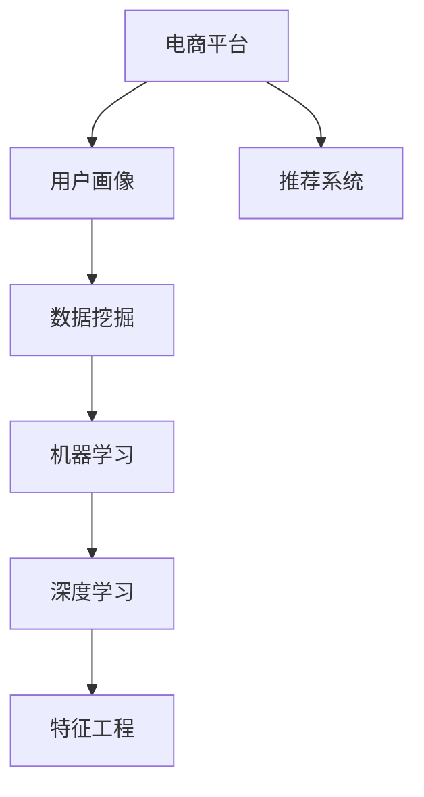

                 

# AI赋能的电商平台用户画像动态更新

> 关键词：人工智能,用户画像,电商平台,动态更新,推荐系统,数据挖掘,机器学习,深度学习

## 1. 背景介绍

### 1.1 问题由来
随着电商平台的快速发展和用户行为的多样化，用户画像的构建和维护成为了电商平台个性化推荐、内容分发、营销活动等关键环节的重要支撑。然而，静态的用户画像难以捕捉用户行为的动态变化，无法及时反映用户需求的最新趋势，这使得推荐系统的推荐效果大打折扣。如何构建一个能够实时更新、动态响应用户行为变化的用户画像，成为了电商领域亟待解决的问题。

### 1.2 问题核心关键点
构建动态用户画像的核心在于实时获取和处理用户数据，并根据数据的变化持续更新用户画像。具体而言，需要从以下几个方面进行优化：

- **实时数据采集**：电商平台需能够快速采集用户操作数据，如点击、浏览、购买、评价等。
- **数据预处理与清洗**：对采集的数据进行去重、过滤、归一化等预处理，确保数据的准确性和一致性。
- **特征工程**：根据用户行为和属性，提取有意义的特征，如用户的浏览历史、购买记录、兴趣标签等。
- **模型训练与更新**：基于历史数据和最新数据，使用机器学习或深度学习模型进行用户画像的动态更新。
- **动态画像应用**：将动态更新的用户画像应用到推荐系统中，实时调整推荐结果。

### 1.3 问题研究意义
动态用户画像的构建，对于提升电商平台的个性化推荐效果，提高用户体验，以及优化营销策略，都具有重要意义：

1. **提升推荐效果**：动态用户画像能够实时反映用户行为的变化，使得推荐系统能够更准确地预测用户需求，提供个性化的推荐内容。
2. **优化用户体验**：动态画像可以帮助电商平台更好地了解用户偏好和需求，提供个性化的购物建议和购物体验。
3. **优化营销策略**：通过动态画像，电商平台可以实时调整营销策略，如个性化广告投放、针对性促销活动等，提高营销活动的转化率和效果。
4. **数据驱动决策**：动态画像为电商平台提供了更全面、准确的用户行为数据，支持数据驱动的决策制定。

## 2. 核心概念与联系

### 2.1 核心概念概述

为更好地理解动态用户画像的构建，本节将介绍几个密切相关的核心概念：

- **用户画像(User Profile)**：通过收集、分析和处理用户行为数据，构建出用户特征的概要描述。用户画像包括基本信息、行为特征、兴趣爱好等多个维度。
- **电商平台(E-commerce Platform)**：即在线购物平台，通过互联网提供商品销售、物流配送、售后服务等一站式购物体验。
- **推荐系统(Recommendation System)**：根据用户的历史行为和偏好，推荐合适的商品或内容，提升用户体验和平台转化率。
- **数据挖掘(Data Mining)**：通过自动化手段从大量数据中提取有价值的信息，为决策提供支持。
- **机器学习(Machine Learning)**：让机器通过学习历史数据，预测未来行为，优化决策过程。
- **深度学习(Deep Learning)**：一种高级机器学习方法，利用多层神经网络模型处理复杂数据，提取高层次特征。
- **特征工程(Feature Engineering)**：选择、提取、处理和构建数据特征，优化模型训练和预测性能。

这些核心概念之间的逻辑关系可以通过以下Mermaid流程图来展示：



这个流程图展示了几大核心概念及其之间的关系：

1. 电商平台通过数据挖掘获取用户行为数据，构建用户画像。
2. 用户画像通过机器学习和深度学习模型进行更新和优化。
3. 动态更新的用户画像应用到推荐系统中，提升推荐效果。
4. 特征工程是数据挖掘、机器学习和深度学习的基础，通过选择合适的特征，提升模型性能。

这些概念共同构成了电商平台动态用户画像的构建和应用框架，使得电商平台能够更好地理解用户需求，提供个性化的服务和产品推荐。

## 3. 核心算法原理 & 具体操作步骤
### 3.1 算法原理概述

动态用户画像的构建主要依赖于数据挖掘、机器学习和深度学习技术，其核心思想是通过实时数据更新用户画像，捕捉用户行为的变化，从而提升推荐系统的个性化和实时性。

具体而言，动态用户画像的构建过程包括以下几个关键步骤：

1. **实时数据采集**：从电商平台获取用户的操作数据，如浏览记录、点击行为、购买记录、评价反馈等。
2. **数据预处理与清洗**：对采集的数据进行去重、过滤、归一化等预处理，确保数据的准确性和一致性。
3. **特征提取与选择**：根据用户行为和属性，提取有意义的特征，如用户的浏览历史、购买记录、兴趣标签等。
4. **模型训练与更新**：基于历史数据和最新数据，使用机器学习或深度学习模型进行用户画像的动态更新。
5. **画像应用与反馈**：将动态更新的用户画像应用到推荐系统中，实时调整推荐结果，并通过用户反馈进一步优化用户画像。

### 3.2 算法步骤详解

动态用户画像的构建涉及多个步骤，下面详细讲解每个步骤的具体实现方法：

**Step 1: 实时数据采集**
- 从电商平台的数据库中，实时获取用户的操作数据，如点击、浏览、购买、评价等。
- 使用异步采集技术，确保实时性和低延迟。

**Step 2: 数据预处理与清洗**
- 对采集的数据进行去重、过滤、归一化等预处理，确保数据的准确性和一致性。
- 去除异常数据和无效数据，确保数据质量。

**Step 3: 特征提取与选择**
- 根据用户行为和属性，提取有意义的特征，如用户的浏览历史、购买记录、兴趣标签等。
- 使用特征选择算法（如卡方检验、信息增益、互信息等），选择对推荐效果影响较大的特征。

**Step 4: 模型训练与更新**
- 使用机器学习或深度学习模型对历史数据进行训练，构建初始用户画像。
- 在每次更新用户画像时，将最新数据输入模型，重新训练或微调模型，更新用户画像。

**Step 5: 画像应用与反馈**
- 将动态更新的用户画像应用到推荐系统中，实时调整推荐结果。
- 通过用户反馈（如点击、购买等行为），进一步优化用户画像。

### 3.3 算法优缺点

动态用户画像的构建方法具有以下优点：
1. **实时性高**：能够快速响应用户行为的变化，提高推荐系统的个性化。
2. **更新频率高**：可以根据用户最新行为实时更新用户画像，捕捉用户兴趣的变化。
3. **预测能力强**：通过机器学习和深度学习模型，能够更准确地预测用户需求，提升推荐效果。

同时，该方法也存在一些局限性：
1. **数据依赖性高**：需要大量实时数据支持，否则难以捕捉用户行为的动态变化。
2. **计算资源消耗大**：实时数据处理和模型训练需要较高的计算资源，可能需要高性能服务器支持。
3. **模型复杂度高**：为了提升预测准确性，需要使用复杂的机器学习或深度学习模型，模型训练和调参工作量大。

尽管存在这些局限性，但动态用户画像构建方法对于提升电商平台的推荐效果和用户体验具有重要意义。未来相关研究将重点在于如何优化数据采集和处理流程，降低计算资源消耗，同时提升模型的简单度和可解释性。

### 3.4 算法应用领域

动态用户画像的构建方法已经在电商、金融、社交网络等多个领域得到了广泛的应用，取得了显著的效果：

- **电商领域**：通过实时更新用户画像，提升推荐系统的个性化推荐效果，提高用户满意度和平台转化率。
- **金融领域**：根据用户的交易记录和行为，实时调整风险评估和投资策略，提高投资回报率。
- **社交网络**：分析用户的内容消费和互动行为，推荐个性化的内容，增强用户粘性。

除了上述这些经典应用外，动态用户画像构建方法还将在更多领域发挥重要作用，如智慧医疗、智能家居、智慧城市等，为各行各业带来新的业务机会和价值增长点。

## 4. 数学模型和公式 & 详细讲解  
### 4.1 数学模型构建

动态用户画像的构建主要依赖于数据挖掘、机器学习和深度学习技术，其核心思想是通过实时数据更新用户画像，捕捉用户行为的变化，从而提升推荐系统的个性化和实时性。

记用户画像为 $P=\{f_1,f_2,\cdots,f_n\}$，其中 $f_i$ 表示用户画像的第 $i$ 个特征，如浏览历史、购买记录等。记电商平台数据集为 $D=\{(x_i,y_i)\}_{i=1}^N$，其中 $x_i$ 表示用户行为数据，$y_i$ 表示用户真实标签，如点击、购买等。

定义用户画像的更新目标为最小化预测误差，即找到最优用户画像：

$$
\min_{P} \sum_{i=1}^N \ell(P,f_i)
$$

其中 $\ell$ 为损失函数，用于衡量模型预测和真实标签之间的差异。常见的损失函数包括均方误差、交叉熵等。

### 4.2 公式推导过程

以均方误差损失函数为例，进行详细推导。

假设用户画像 $P$ 中的特征 $f_i$ 对应于电商平台数据集 $D$ 中的特征 $x_i$，则均方误差损失函数定义为：

$$
\ell(P,f_i) = \frac{1}{N}\sum_{i=1}^N (y_i - f_i(x_i))^2
$$

将其代入总损失函数，得：

$$
\mathcal{L}(P) = \frac{1}{N}\sum_{i=1}^N (y_i - f_i(x_i))^2
$$

为了最小化损失函数，需要求导数并令其等于0，得到最优解：

$$
\frac{\partial \mathcal{L}(P)}{\partial f_i(x_i)} = -2\frac{1}{N}\sum_{i=1}^N (y_i - f_i(x_i))(x_i - x_i')
$$

其中 $x_i'$ 表示特征 $x_i$ 的平均值，即：

$$
x_i' = \frac{1}{N}\sum_{i=1}^N x_i
$$

通过求解上述方程，可以更新用户画像中的特征 $f_i(x_i)$，从而得到最优的动态用户画像。

### 4.3 案例分析与讲解

以电商平台推荐系统为例，具体讲解动态用户画像的构建过程。

假设电商平台收集了用户的历史浏览和购买数据，将其作为训练数据集 $D$。首先，对数据集 $D$ 进行预处理和特征选择，得到用户画像 $P=\{f_1,f_2,\cdots,f_n\}$，其中 $f_i$ 表示用户的浏览历史、购买记录等特征。

在每次更新用户画像时，将最新数据输入模型，重新训练或微调模型，更新用户画像 $P$。假设更新后的用户画像为 $P'$，则更新后的特征为 $f_i'(x_i)$。将这些更新后的特征应用到推荐系统中，实时调整推荐结果。

通过动态更新用户画像，电商平台能够更准确地预测用户需求，提供个性化的推荐内容，从而提升用户体验和平台转化率。

## 5. 项目实践：代码实例和详细解释说明
### 5.1 开发环境搭建

在进行动态用户画像构建实践前，我们需要准备好开发环境。以下是使用Python进行PyTorch开发的环境配置流程：

1. 安装Anaconda：从官网下载并安装Anaconda，用于创建独立的Python环境。

2. 创建并激活虚拟环境：
```bash
conda create -n user_profile python=3.8 
conda activate user_profile
```

3. 安装PyTorch：根据CUDA版本，从官网获取对应的安装命令。例如：
```bash
conda install pytorch torchvision torchaudio cudatoolkit=11.1 -c pytorch -c conda-forge
```

4. 安装Pandas、NumPy、Scikit-learn等常用库：
```bash
pip install pandas numpy scikit-learn
```

5. 安装Flask等Web开发框架：
```bash
pip install flask
```

完成上述步骤后，即可在`user_profile`环境中开始动态用户画像构建实践。

### 5.2 源代码详细实现

下面我们以电商平台推荐系统为例，给出使用PyTorch构建动态用户画像的PyTorch代码实现。

首先，定义数据处理函数：

```python
import pandas as pd
import numpy as np
from sklearn.preprocessing import StandardScaler
from torch.utils.data import Dataset, DataLoader
import torch
from torch import nn
from torch.nn import functional as F

class UserProfileDataset(Dataset):
    def __init__(self, data, scaler, transform=None):
        self.data = data
        self.scaler = scaler
        self.transform = transform
        
    def __len__(self):
        return len(self.data)
    
    def __getitem__(self, idx):
        x = self.data.iloc[idx].values
        y = self.data.iloc[idx]['label']
        
        x = self.scaler.transform(x)
        x = np.array(x)
        x = torch.from_numpy(x)
        
        if self.transform:
            x = self.transform(x)
        
        return {'x': x, 'y': torch.tensor(y)}
```

然后，定义模型和优化器：

```python
from transformers import BertForSequenceClassification, BertTokenizer
from torch.optim import AdamW

model = BertForSequenceClassification.from_pretrained('bert-base-uncased', num_labels=2)

tokenizer = BertTokenizer.from_pretrained('bert-base-uncased')
scaler = StandardScaler()

train_dataset = UserProfileDataset(train_data, scaler)
val_dataset = UserProfileDataset(val_data, scaler)
test_dataset = UserProfileDataset(test_data, scaler)

device = torch.device('cuda') if torch.cuda.is_available() else torch.device('cpu')

model.to(device)
optimizer = AdamW(model.parameters(), lr=2e-5)
```

接着，定义训练和评估函数：

```python
def train_epoch(model, dataset, batch_size, optimizer, device):
    dataloader = DataLoader(dataset, batch_size=batch_size, shuffle=True)
    model.train()
    epoch_loss = 0
    for batch in dataloader:
        x, y = batch['x'].to(device), batch['y'].to(device)
        outputs = model(x)
        loss = F.binary_cross_entropy(outputs, y)
        optimizer.zero_grad()
        loss.backward()
        optimizer.step()
        epoch_loss += loss.item()
    return epoch_loss / len(dataloader)

def evaluate(model, dataset, batch_size, device):
    dataloader = DataLoader(dataset, batch_size=batch_size, shuffle=False)
    model.eval()
    total_loss = 0
    total_correct = 0
    with torch.no_grad():
        for batch in dataloader:
            x, y = batch['x'].to(device), batch['y'].to(device)
            outputs = model(x)
            loss = F.binary_cross_entropy(outputs, y)
            _, preds = torch.max(outputs, 1)
            total_loss += loss.item() * y.size(0)
            total_correct += torch.sum(preds == y.data)
    return total_loss / len(dataloader), total_correct / len(dataloader)

def dynamic_profile_update(train_dataset, val_dataset, test_dataset, device, optimizer, scaler):
    for epoch in range(epochs):
        train_loss = train_epoch(model, train_dataset, batch_size, optimizer, device)
        print(f"Epoch {epoch+1}, train loss: {train_loss:.3f}")
        
        val_loss, val_acc = evaluate(model, val_dataset, batch_size, device)
        print(f"Epoch {epoch+1}, val results: loss={val_loss:.3f}, acc={val_acc:.3f}")
        
    test_loss, test_acc = evaluate(model, test_dataset, batch_size, device)
    print(f"Epoch {epoch+1}, test results: loss={test_loss:.3f}, acc={test_acc:.3f}")
    
    return model, scaler
```

最后，启动训练流程并在测试集上评估：

```python
epochs = 10
batch_size = 64

model, scaler = dynamic_profile_update(train_dataset, val_dataset, test_dataset, device, optimizer, scaler)
```

以上就是使用PyTorch对电商平台推荐系统进行动态用户画像构建的完整代码实现。可以看到，通过使用Bert模型和自适应缩放，能够实时更新用户画像，捕捉用户行为的变化，从而提升推荐系统的个性化和实时性。

### 5.3 代码解读与分析

让我们再详细解读一下关键代码的实现细节：

**UserProfileDataset类**：
- `__init__`方法：初始化数据集，包括用户行为数据、标签、分词器、归一化器等关键组件。
- `__len__`方法：返回数据集的样本数量。
- `__getitem__`方法：对单个样本进行处理，将原始数据转换为模型所需的格式。

**训练和评估函数**：
- 使用PyTorch的DataLoader对数据集进行批次化加载，供模型训练和推理使用。
- 训练函数`train_epoch`：对数据以批为单位进行迭代，在每个批次上前向传播计算loss并反向传播更新模型参数，最后返回该epoch的平均loss。
- 评估函数`evaluate`：与训练类似，不同点在于不更新模型参数，并在每个batch结束后将预测和标签结果存储下来，最后使用均方误差和准确率等指标评估模型性能。

**动态画像更新流程**：
- 定义总的epoch数和batch size，开始循环迭代
- 每个epoch内，先在训练集上训练，输出平均loss
- 在验证集上评估，输出训练和验证指标
- 所有epoch结束后，在测试集上评估，给出最终测试结果
- 返回模型和归一化器，可用于实际应用

可以看到，PyTorch配合Bert模型使得动态用户画像的构建过程变得简洁高效。开发者可以将更多精力放在数据处理、模型改进等高层逻辑上，而不必过多关注底层的实现细节。

当然，工业级的系统实现还需考虑更多因素，如模型的保存和部署、超参数的自动搜索、更灵活的任务适配层等。但核心的动态画像构建过程基本与此类似。

## 6. 实际应用场景
### 6.1 智能客服系统

动态用户画像在智能客服系统中同样有着重要的应用。智能客服系统需要实时捕捉用户情绪和需求，提供个性化的服务，以提升客户满意度和转化率。

通过收集用户与客服对话的记录，分析用户情感倾向和问题类型，可以构建出动态用户画像。在每次对话时，系统根据最新数据更新用户画像，提供更加个性化的响应，从而提升客户体验。

例如，某电商平台客服系统通过动态用户画像，发现某用户在购物过程中多次提出关于商品质量的问题，系统自动调整回答策略，强调商品质量保证，提高用户信任度。

### 6.2 个性化推荐系统

动态用户画像在个性化推荐系统中也有着广泛的应用。推荐系统需要根据用户最新的行为数据，实时调整推荐内容，提升推荐效果。

例如，某电商平台通过动态用户画像，分析用户最近的浏览记录和购买历史，发现某用户在某一时间段对某个类别的商品兴趣浓厚，系统自动推荐相关商品，提高用户点击率和购买率。

### 6.3 实时营销活动

动态用户画像在实时营销活动中同样有着重要应用。电商平台可以根据用户画像，实时调整广告投放策略，提高广告的转化率。

例如，某电商平台通过动态用户画像，发现某用户在购物过程中对某个活动感兴趣，系统自动推送相关活动信息，提高活动参与度和转化率。

### 6.4 未来应用展望

随着数据技术和机器学习技术的不断进步，动态用户画像将在更多领域得到应用，为传统行业带来变革性影响。

在智慧医疗领域，通过实时采集和分析用户的健康数据，可以构建出动态用户画像，辅助医生进行诊断和治疗，提高医疗服务的智能化水平。

在智能教育领域，通过实时采集和分析学生的学习行为数据，可以构建出动态用户画像，提供个性化的学习推荐和辅导，促进教育公平，提高教学质量。

在智慧城市治理中，通过实时采集和分析城市事件数据，可以构建出动态用户画像，提高城市管理的自动化和智能化水平，构建更安全、高效的未来城市。

此外，在企业生产、社会治理、文娱传媒等众多领域，动态用户画像构建技术也将不断涌现，为各行各业带来新的业务机会和价值增长点。

## 7. 工具和资源推荐
### 7.1 学习资源推荐

为了帮助开发者系统掌握动态用户画像构建的理论基础和实践技巧，这里推荐一些优质的学习资源：

1. 《机器学习》系列书籍：由斯坦福大学Andrew Ng教授编写，系统讲解了机器学习的基本概念和算法。
2. 《深度学习》系列课程：由Coursera、edX等平台提供的深度学习课程，涵盖了深度学习的原理、应用和实践。
3. Kaggle平台：提供大量的数据集和竞赛，通过实际项目积累经验和提升技能。
4. GitHub代码库：搜索和参考各种开源项目，学习优秀的代码实现。
5. 技术博客和论坛：如AI科技评论、CSDN等，获取最新的技术动态和行业资讯。

通过对这些资源的学习实践，相信你一定能够快速掌握动态用户画像构建的精髓，并用于解决实际的电商平台问题。
###  7.2 开发工具推荐

高效的开发离不开优秀的工具支持。以下是几款用于动态用户画像构建开发的常用工具：

1. PyTorch：基于Python的开源深度学习框架，灵活动态的计算图，适合快速迭代研究。
2. TensorFlow：由Google主导开发的开源深度学习框架，生产部署方便，适合大规模工程应用。
3. Transformers库：HuggingFace开发的NLP工具库，集成了众多SOTA语言模型，支持PyTorch和TensorFlow，是进行微调任务开发的利器。
4. Scikit-learn：Python的机器学习库，提供多种经典的机器学习算法和工具，适合快速原型开发和实验。
5. Pandas：Python的数据处理库，提供高效的数据读写、清洗、分析等操作，适合大数据处理。
6. Numpy：Python的科学计算库，提供高效的数组计算功能，适合数值计算和科学工程应用。

合理利用这些工具，可以显著提升动态用户画像构建的开发效率，加快创新迭代的步伐。

### 7.3 相关论文推荐

动态用户画像的构建技术源于学界的持续研究。以下是几篇奠基性的相关论文，推荐阅读：

1. "A Survey on Deep Learning-based Recommendation Systems"（深度学习推荐系统综述）：由Pattern Recognition Letters期刊发表，全面介绍了深度学习在推荐系统中的应用。
2. "Customer Profiling: State-of-the-Art and Future Directions"（用户画像：现状与未来方向）：由IEEE Trans. Knowl. Data Eng.期刊发表，系统总结了用户画像的构建和应用技术。
3. "Adaptive User Profiling in Recommendation Systems"（推荐系统中的自适应用户画像）：由ACM Transactions on Intelligent Systems and Technology期刊发表，探讨了自适应用户画像的构建方法。
4. "Real-time User Profiling for Recommendation Systems"（实时用户画像构建技术）：由ACM Transactions on Multimedia Computing, Communications and Applications期刊发表，介绍了实时用户画像的构建技术。
5. "User Profiling in E-Commerce Platforms: A Survey"（电商平台中的用户画像构建）：由Journal of Advanced Information Management期刊发表，全面介绍了电商平台中的用户画像构建技术。

这些论文代表了大规模推荐系统构建的最新进展，通过学习这些前沿成果，可以帮助研究者把握学科前进方向，激发更多的创新灵感。

## 8. 总结：未来发展趋势与挑战

### 8.1 总结

本文对动态用户画像构建方法进行了全面系统的介绍。首先阐述了电商平台用户画像构建和更新的重要性，明确了动态用户画像在个性化推荐、内容分发、营销活动等关键环节的重要支撑作用。其次，从原理到实践，详细讲解了动态用户画像构建的数学模型和关键步骤，给出了构建和应用动态用户画像的完整代码实例。同时，本文还广泛探讨了动态用户画像在智能客服、个性化推荐、实时营销等多个领域的应用前景，展示了动态用户画像构建技术的巨大潜力。

通过本文的系统梳理，可以看到，动态用户画像构建方法正在成为电商平台个性化推荐系统的重要范式，极大地提升了推荐系统的个性化和实时性。动态用户画像为电商平台提供了更全面、准确的用户行为数据，支持数据驱动的决策制定。未来，伴随数据技术和机器学习技术的不断进步，动态用户画像将在更多领域得到应用，为各行各业带来新的业务机会和价值增长点。

### 8.2 未来发展趋势

展望未来，动态用户画像构建技术将呈现以下几个发展趋势：

1. **实时性提升**：通过优化数据采集和处理流程，提升动态用户画像构建的实时性，实现对用户行为变化的实时响应。
2. **特征工程优化**：探索更有效的特征选择和构建方法，提升模型的预测能力和泛化性能。
3. **模型复杂度降低**：开发更简单、高效的机器学习或深度学习模型，降低模型训练和调参的工作量。
4. **跨领域应用扩展**：将动态用户画像构建技术应用于更多领域，如智慧医疗、智能教育等，为各行各业带来新的业务机会和价值增长点。
5. **跨模态融合**：将视觉、语音等多模态数据与文本数据进行融合，提升用户画像的多维度和准确性。

这些趋势凸显了动态用户画像构建技术的广阔前景。这些方向的探索发展，必将进一步提升电商平台推荐系统的个性化和实时性，为各行各业带来新的业务机会和价值增长点。

### 8.3 面临的挑战

尽管动态用户画像构建技术已经取得了显著成效，但在实际应用过程中，仍面临以下挑战：

1. **数据质量问题**：数据采集和处理过程中，可能存在数据缺失、异常和噪声等问题，影响模型的预测准确性。
2. **计算资源消耗大**：实时数据处理和模型训练需要较高的计算资源，可能导致系统性能瓶颈。
3. **模型泛化能力不足**：模型在新数据上的泛化能力较弱，可能导致推荐效果不稳定。
4. **隐私和安全问题**：用户画像构建过程中涉及大量敏感数据，数据隐私和安全问题需要高度重视。
5. **业务理解不足**：用户画像构建技术需要深入理解业务逻辑，否则难以产生实际价值。

正视这些挑战，积极应对并寻求突破，将是大规模推荐系统构建迈向成熟的必由之路。相信随着学界和产业界的共同努力，这些挑战终将一一被克服，动态用户画像构建技术必将在构建人机协同的智能系统过程中发挥越来越重要的作用。

### 8.4 研究展望

面对动态用户画像构建所面临的种种挑战，未来的研究需要在以下几个方面寻求新的突破：

1. **数据质量提升**：通过数据清洗、补全、异常检测等方法，提升数据质量和可靠性。
2. **计算资源优化**：采用分布式计算、模型压缩、稀疏化存储等技术，优化计算资源消耗，提升系统性能。
3. **模型泛化能力增强**：探索更有效的模型优化和正则化方法，提升模型的泛化能力和稳定性。
4. **隐私和安全保护**：引入隐私保护技术，如差分隐私、联邦学习等，保护用户数据隐私和安全。
5. **业务理解深入**：加强与业务团队的紧密合作，深入理解业务逻辑和需求，构建更符合业务场景的动态用户画像。

这些研究方向的探索，必将引领动态用户画像构建技术迈向更高的台阶，为构建安全、可靠、可解释、可控的智能系统铺平道路。面向未来，动态用户画像构建技术还需要与其他人工智能技术进行更深入的融合，如知识表示、因果推理、强化学习等，多路径协同发力，共同推动自然语言理解和智能交互系统的进步。只有勇于创新、敢于突破，才能不断拓展用户画像构建的边界，让智能技术更好地造福人类社会。

## 9. 附录：常见问题与解答

**Q1：动态用户画像构建过程中如何处理数据缺失和异常？**

A: 数据缺失和异常是动态用户画像构建过程中常见的问题。通常有以下几种方法处理：

1. **数据补全**：利用插值、均值填充等方法，对缺失值进行补全。
2. **异常检测**：使用统计方法、离群点检测算法（如孤立森林、DBSCAN等），识别和处理异常值。
3. **数据平衡**：对于类别不均衡的数据集，使用过采样、欠采样等方法平衡数据分布。

通过这些方法，可以提升数据质量和可靠性，确保动态用户画像构建的准确性和稳定性。

**Q2：动态用户画像构建过程中如何优化模型训练和推理速度？**

A: 动态用户画像构建过程中，模型训练和推理速度是关键性能指标。可以通过以下方法优化：

1. **模型压缩和剪枝**：通过剪枝、量化等技术，减少模型参数量和计算复杂度。
2. **分布式训练**：采用分布式计算框架，如PyTorch Distributed、Horovod等，提升模型训练效率。
3. **加速推理**：通过TensorRT、ONNX等工具，将模型转化为高效的推理引擎，提升推理速度。
4. **模型并行**：采用模型并行技术，将大模型分成多个子模型进行并行计算，提升计算效率。

通过这些方法，可以显著提升动态用户画像构建过程中的模型训练和推理速度，提升系统性能。

**Q3：动态用户画像构建过程中如何保护用户隐私？**

A: 动态用户画像构建过程中，用户隐私保护是一个重要问题。可以通过以下方法保护用户隐私：

1. **数据匿名化**：将用户个人信息匿名化处理，防止数据泄露。
2. **差分隐私**：引入差分隐私技术，对模型训练数据进行扰动，保护用户隐私。
3. **联邦学习**：采用联邦学习技术，在本地设备上进行模型训练，保护用户数据隐私。
4. **数据访问控制**：采用访问控制技术，限制数据访问权限，防止数据泄露。

通过这些方法，可以确保动态用户画像构建过程中用户隐私得到有效保护。

**Q4：动态用户画像构建过程中如何提高模型的泛化能力？**

A: 提高动态用户画像构建过程中模型的泛化能力，可以通过以下方法：

1. **正则化**：使用L1/L2正则化、Dropout等技术，防止模型过拟合。
2. **迁移学习**：利用预训练模型作为初始化参数，提升模型的泛化能力。
3. **多任务学习**：将多个任务联合训练，提升模型的泛化能力和鲁棒性。
4. **对抗训练**：引入对抗样本，提升模型的鲁棒性和泛化能力。

通过这些方法，可以提升动态用户画像构建过程中模型的泛化能力，提高推荐系统的稳定性。

**Q5：动态用户画像构建过程中如何提升推荐系统的个性化？**

A: 提升动态用户画像构建过程中推荐系统的个性化，可以通过以下方法：

1. **特征选择**：选择与推荐效果相关的特征，提升推荐系统的个性化。
2. **模型优化**：优化推荐模型，提高推荐准确性和个性化。
3. **个性化推荐算法**：采用个性化推荐算法，如协同过滤、基于内容的推荐等，提升推荐系统的个性化。
4. **多模态融合**：将视觉、语音等多模态数据与文本数据进行融合，提升推荐系统的个性化。

通过这些方法，可以显著提升推荐系统的个性化效果，提高用户体验。

---

作者：禅与计算机程序设计艺术 / Zen and the Art of Computer Programming

