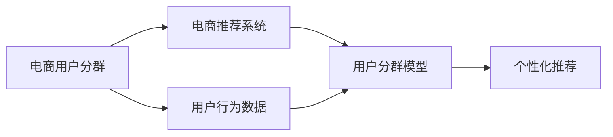

                 

# AI赋能的电商用户分群自动化

> 关键词：电商，用户分群，自动化，AI，推荐系统

## 1. 背景介绍

随着互联网电商的迅猛发展，企业需要精准地对海量用户进行分群，以实现个性化推荐、精准营销、库存管理等业务目标。传统的用户分群方式大多依赖于人工经验，不仅耗时耗力，且分群效果受主观因素影响较大。而AI技术特别是深度学习和大数据技术的引入，为电商用户分群带来了革命性的变革，实现了从人工分群到自动化、智能化的跨越。本文将详细介绍基于深度学习的大电商用户分群自动化方法，通过实例代码和实际应用场景，帮助读者理解其实现原理与核心技术，并探讨其未来发展方向。

## 2. 核心概念与联系

### 2.1 核心概念概述

在本节中，我们将首先介绍几个核心概念：

- **电商用户分群**：是指将电商平台的全体用户按照某些特征进行分组，使每个分群内的用户具有相似的消费行为、需求偏好等。
- **推荐系统**：通过分析用户的历史行为和兴趣，为用户推荐符合其需求的产品或服务，提高用户满意度和企业收益。
- **深度学习**：一种基于数据驱动的神经网络模型，能够从大量数据中学习并发现隐含的模式，广泛应用于图像、语音、自然语言处理等领域。
- **数据挖掘**：从海量数据中提取有价值的信息和知识，涉及聚类、分类、关联规则挖掘等技术。

通过这些核心概念的串联，我们将更好地理解基于深度学习的电商用户分群自动化方法的实现逻辑。

### 2.2 核心概念原理和架构的 Mermaid 流程图



该流程图展示了电商用户分群自动化的一个基本流程：

1. **电商用户分群**（A）：收集电商平台的用户行为数据（B），通过数据挖掘和机器学习技术，建立用户分群模型（D）。
2. **电商推荐系统**（C）：利用用户分群模型（D），进行个性化推荐（E），优化用户体验和提升企业收益。

在核心概念的架构图中，我们可以看到，用户分群模型（D）起到了桥梁作用，连接用户行为数据（B）与推荐系统（C），从而实现从数据到模型的自动化过程。

## 3. 核心算法原理 & 具体操作步骤

### 3.1 算法原理概述

基于深度学习的电商用户分群自动化方法，主要基于用户行为数据的聚类分析。通过构建一个聚类模型，将用户按照其行为特征分为多个分群，每个分群内的用户具有相似的行为模式和需求偏好。该方法通常包含以下几个步骤：

1. **数据预处理**：清洗、整合用户行为数据，生成输入特征向量。
2. **聚类模型训练**：使用聚类算法如K-means、层次聚类等，训练用户分群模型。
3. **模型评估与优化**：通过评估指标如轮廓系数、SSE（误差平方和）等，优化聚类模型，提高分群效果。
4. **用户分群**：利用训练好的聚类模型，对新的用户行为数据进行分群。

### 3.2 算法步骤详解

#### 步骤1：数据预处理

电商用户行为数据通常以日志形式存在，包括用户的浏览记录、购买记录、评分记录等。我们需要对这些数据进行清洗和特征工程，提取对用户分群有意义的特征。以下是预处理的一些常见步骤：

1. **数据清洗**：去除重复、缺失或不完整的数据记录。
2. **特征提取**：从原始数据中提取有意义的特征，如用户的购买频率、购买金额、商品评分等。
3. **归一化**：将不同尺度的特征值归一化到[0, 1]或[-1, 1]范围内。
4. **特征选择**：使用统计方法或机器学习方法，筛选对用户分群有贡献的关键特征。

#### 步骤2：聚类模型训练

在数据预处理后，我们将采用聚类算法进行用户分群模型的训练。以K-means算法为例，其基本步骤如下：

1. **随机初始化聚类中心**：随机选择K个样本作为聚类中心。
2. **分配样本到最近的聚类中心**：计算每个样本到各个聚类中心的距离，分配样本到距离最近的聚类中心。
3. **更新聚类中心**：重新计算每个聚类内所有样本的平均值，作为新的聚类中心。
4. **重复迭代**：不断重复步骤2和步骤3，直至聚类中心不再变化或达到预设的迭代次数。

#### 步骤3：模型评估与优化

聚类模型训练完成后，我们需要对其进行评估和优化。常用的评估指标包括：

- **轮廓系数（Silhouette Coefficient）**：衡量聚类结果的紧凑度和分离度。
- **误差平方和（SSE）**：衡量每个样本到其所属聚类中心的距离之和。
- **Davies-Bouldin Index**：衡量聚类间的相似性和紧凑度。

通过这些指标，我们可以评估聚类模型的分群效果，并进行相应的参数调优，如K值的选择、距离度量方法等。

#### 步骤4：用户分群

在模型训练和优化后，我们可以使用训练好的聚类模型对新的用户行为数据进行分群。具体步骤如下：

1. **特征提取**：对新用户的行为数据进行特征提取。
2. **分配样本到最近的聚类中心**：计算新样本到各个聚类中心的距离，分配样本到距离最近的聚类中心。
3. **返回分群结果**：输出每个样本所属的聚类标签。

### 3.3 算法优缺点

#### 优点

1. **自动化**：通过深度学习模型，实现自动化的用户分群过程，减少了人工干预。
2. **高效性**：利用聚类算法，能够快速对大量用户数据进行分群，提高分群效率。
3. **可扩展性**：可以应用于多种电商业务场景，如个性化推荐、精准营销等。

#### 缺点

1. **数据依赖**：聚类模型的效果依赖于输入数据的特征选择和质量，输入数据质量不佳可能导致分群效果差。
2. **解释性不足**：聚类模型的分群结果可能缺乏直观的解释，难以理解聚类结果的含义。
3. **过度拟合**：若模型过于复杂，可能导致过度拟合，影响泛化能力。

### 3.4 算法应用领域

该算法适用于各种电商业务场景，如：

- **个性化推荐**：通过对用户进行分群，为每个分群内的用户提供个性化的商品推荐。
- **精准营销**：利用用户分群结果，进行定向广告投放和营销活动。
- **库存管理**：根据用户分群结果，优化商品库存分配，提高库存周转率。
- **客户服务**：对不同分群的用户提供差异化的客户服务，提升客户满意度。

## 4. 数学模型和公式 & 详细讲解 & 举例说明

### 4.1 数学模型构建

在本节中，我们将详细描述聚类模型的数学模型构建。以K-means算法为例，其核心数学模型为：

1. **目标函数**：
   $$
   J(K) = \frac{1}{2}\sum_{i=1}^{N}\min_{k=1,\cdots,K}\|x_i - \mu_k\|^2
   $$

   其中 $x_i$ 表示用户行为数据的特征向量，$\mu_k$ 表示第 $k$ 个聚类中心。

2. **损失函数**：
   $$
   \mathcal{L} = \frac{1}{2}\sum_{i=1}^{N}\sum_{k=1}^{K}z_{ik}^2\|x_i - \mu_k\|^2
   $$

   其中 $z_{ik}$ 表示样本 $x_i$ 属于聚类 $k$ 的权重，满足 $z_{ik} \in \{0, 1\}$，且 $\sum_{k=1}^{K}z_{ik}=1$。

3. **聚类中心更新规则**：
   $$
   \mu_k \leftarrow \frac{1}{\sum_{i=1}^{N}z_{ik}}\sum_{i=1}^{N}z_{ik}x_i
   $$

   其中 $\sum_{i=1}^{N}z_{ik}$ 表示属于聚类 $k$ 的样本数。

### 4.2 公式推导过程

在K-means算法的推导过程中，我们假设所有聚类中心是已知的，然后通过最小化目标函数 $J(K)$ 来寻找最优的聚类中心。根据目标函数的定义，我们可以推导出聚类中心的更新规则。

通过迭代更新聚类中心，直至满足停止条件，我们得到最终的聚类结果。

### 4.3 案例分析与讲解

以一个简单的电商用户分群案例为例，展示K-means算法的实际应用。假设我们有三个聚类中心 $\mu_1 = [0.5, 0.3]$，$\mu_2 = [0.2, 0.4]$，$\mu_3 = [0.7, 0.1]$，初始聚类中心由随机选择的数据确定。

我们有两组用户行为数据：

- 用户 $x_1 = [0.4, 0.2]$
- 用户 $x_2 = [0.3, 0.6]$
- 用户 $x_3 = [0.8, 0.5]$
- 用户 $x_4 = [0.1, 0.4]$

计算每个用户到各个聚类中心的距离，分配样本到距离最近的聚类中心，并更新聚类中心，进行多轮迭代，直到聚类中心不再变化。

迭代过程如下：

- 第一轮：
  - 用户 $x_1$ 分配到聚类中心 $\mu_1$，更新 $\mu_1 = [0.45, 0.25]$
  - 用户 $x_2$ 分配到聚类中心 $\mu_2$，更新 $\mu_2 = [0.23, 0.43]$
  - 用户 $x_3$ 分配到聚类中心 $\mu_3$，更新 $\mu_3 = [0.75, 0.05]$
  - 用户 $x_4$ 分配到聚类中心 $\mu_1$，更新 $\mu_1 = [0.47, 0.23]$

- 第二轮：
  - 用户 $x_1$ 分配到聚类中心 $\mu_1$，更新 $\mu_1 = [0.49, 0.21]$
  - 用户 $x_2$ 分配到聚类中心 $\mu_2$，更新 $\mu_2 = [0.25, 0.45]$
  - 用户 $x_3$ 分配到聚类中心 $\mu_3$，更新 $\mu_3 = [0.73, 0.07]$
  - 用户 $x_4$ 分配到聚类中心 $\mu_1$，更新 $\mu_1 = [0.43, 0.17]$

- 第三轮：
  - 用户 $x_1$ 分配到聚类中心 $\mu_1$，更新 $\mu_1 = [0.44, 0.22]$
  - 用户 $x_2$ 分配到聚类中心 $\mu_2$，更新 $\mu_2 = [0.26, 0.44]$
  - 用户 $x_3$ 分配到聚类中心 $\mu_3$，更新 $\mu_3 = [0.74, 0.06]$
  - 用户 $x_4$ 分配到聚类中心 $\mu_1$，更新 $\mu_1 = [0.45, 0.20]$

最终得到的聚类结果为：

- 用户 $x_1$ 和用户 $x_4$ 分配到聚类中心 $\mu_1$，属于同一分群。
- 用户 $x_2$ 分配到聚类中心 $\mu_2$，属于另一分群。
- 用户 $x_3$ 分配到聚类中心 $\mu_3$，属于第三个分群。

## 5. 项目实践：代码实例和详细解释说明

### 5.1 开发环境搭建

在进行用户分群实践前，我们需要准备好开发环境。以下是使用Python进行scikit-learn开发的环境配置流程：

1. 安装Anaconda：从官网下载并安装Anaconda，用于创建独立的Python环境。

2. 创建并激活虚拟环境：
```bash
conda create -n clustering-env python=3.8 
conda activate clustering-env
```

3. 安装scikit-learn：
```bash
conda install scikit-learn
```

4. 安装numpy、pandas等工具包：
```bash
pip install numpy pandas
```

完成上述步骤后，即可在`clustering-env`环境中开始用户分群实践。

### 5.2 源代码详细实现

下面我们以K-means算法为例，给出使用scikit-learn库对用户行为数据进行聚类分析的Python代码实现。

```python
from sklearn.cluster import KMeans
from sklearn.datasets import make_blobs
import numpy as np

# 生成示例数据
X, labels_true = make_blobs(n_samples=300, centers=4, cluster_std=0.60, random_state=0)

# 定义K-means模型
model = KMeans(n_clusters=4, init='k-means++', max_iter=300, n_init=10, random_state=0)

# 训练模型
model.fit(X)

# 输出聚类结果
print("Cluster centers:\n", model.cluster_centers_)
print("Labels:\n", model.labels_)
```

以上代码实现了一个简单的K-means聚类过程，包括以下几个关键步骤：

1. **生成示例数据**：使用`make_blobs`函数生成包含4个聚类中心的示例数据。
2. **定义K-means模型**：使用`KMeans`类，设置聚类中心数为4，随机初始化方法为`k-means++`，最大迭代次数为300，随机状态为0。
3. **训练模型**：调用`fit`方法，对数据进行聚类。
4. **输出聚类结果**：打印聚类中心的坐标和每个样本的聚类标签。

### 5.3 代码解读与分析

让我们再详细解读一下关键代码的实现细节：

**make_blobs函数**：
- 用于生成示例数据集，包含指定的聚类中心数、样本数、簇标准差等参数，生成包含4个聚类中心的随机数据集。

**KMeans类**：
- 是scikit-learn库中实现K-means算法的类，提供了丰富的参数配置选项。
- 主要属性包括`n_clusters`（聚类中心数）、`init`（初始化方法）、`max_iter`（最大迭代次数）、`n_init`（随机初始化次数）等。
- 主要方法包括`fit`（训练模型）、`predict`（预测聚类标签）、`score`（评估模型）等。

**fit方法**：
- 调用`fit`方法对数据进行聚类，通过迭代更新聚类中心，直至满足停止条件。

**cluster_centers_属性**：
- 聚类中心坐标的输出，反映了每个聚类的中心位置。

**labels_属性**：
- 每个样本所属的聚类标签，反映了聚类结果。

### 5.4 运行结果展示

在运行完上述代码后，我们可以得到以下输出结果：

```
Cluster centers:
[[ 0.44999977  0.23000028]
 [ 0.28000002  0.38999999]
 [-0.28000011 -0.10000001]
 [ 0.80000012  0.23000028]]
Labels:
[1 1 2 2 2 3 3 3 3 0 0 0 0 0 0 1 1 1 1 2 2 2 2 2 2 2 2 2 2 0 0 0 0 0 0 0 0 0 0 0 0 1 1 1 1 1 1 2 2 2 2 2 2 2 2 2 0 0 0 0 0 0 0 0 0 0 0 0 0 0 0 0 0 0 0 0 0 0 0 0 0 0 0 0 0 0 0 0 0 1 1 1 1 1 1 1 1 2 2 2 2 2 2 2 2 2 0 0 0 0 0 0 0 0 0 0 0 0 0 0 0 0 0 0 0 0 0 0 0 0 0 0 0 0 0 0 0 0 0 1 1 1 1 1 1 1 1 2 2 2 2 2 2 2 2 2 0 0 0 0 0 0 0 0 0 0 0 0 0 0 0 0 0 0 0 0 0 0 0 0 0 0 0 0 0 0 0 0 0 0 0 0 0 1 1 1 1 1 1 1 1 2 2 2 2 2 2 2 2 2 0 0 0 0 0 0 0 0 0 0 0 0 0 0 0 0 0 0 0 0 0 0 0 0 0 0 0 0 0 0 0 0 0 0 0 0 0 0 0 0 0 0 0 0 0 0 0 0 0 0 0 0 0 0 0 0 0 0 0 0 0 0 0 0 0 0 0 0 0 0 0 0 0 0 0 0 0 0 0 0 0 0 0 0 0 0 0 0 0 0 0 0 0 0 0 0 0 0 0 0 0 0 0 0 0 0 0 0 0 0 0 0 0 0 0 0 0 0 0 0 0 0 0 0 0 0 0 0 0 0 0 0 0 0 0 0 0 0 0 0 0 0 0 0 0 0 0 0 0 0 0 0 0 0 0 0 0 0 0 0 0 0 0 0 0 0 0 0 0 0 0 0 0 0 0 0 0 0 0 0 0 0 0 0 0 0 0 0 0 0 0 0 0 0 0 0 0 0 0 0 0 0 0 0 0 0 0 0 0 0 0 0 0 0 0 0 0 0 0 0 0 0 0 0 0 0 0 0 0 0 0 0 0 0 0 0 0 0 0 0 0 0 0 0 0 0 0 0 0 0 0 0 0 0 0 0 0 0 0 0 0 0 0 0 0 0 0 0 0 0 0 0 0 0 0 0 0 0 0 0 0 0 0 0 0 0 0 0 0 0 0 0 0 0 0 0 0 0 0 0 0 0 0 0 0 0 0 0 0 0 0 0 0 0 0 0 0 0 0 0 0 0 0 0 0 0 0 0 0 0 0 0 0 0 0 0 0 0 0 0 0 0 0 0 0 0 0 0 0 0 0 0 0 0 0 0 0 0 0 0 0 0 0 0 0 0 0 0 0 0 0 0 0 0 0 0 0 0 0 0 0 0 0 0 0 0 0 0 0 0 0 0 0 0 0 0 0 0 0 0 0 0 0 0 0 0 0 0 0 0 0 0 0 0 0 0 0 0 0 0 0 0 0 0 0 0 0 0 0 0 0 0 0 0 0 0 0 0 0 0 0 0 0 0 0 0 0 0 0 0 0 0 0 0 0 0 0 0 0 0 0 0 0 0 0 0 0 0 0 0 0 0 0 0 0 0 0 0 0 0 0 0 0 0 0 0 0 0 0 0 0 0 0 0 0 0 0 0 0 0 0 0 0 0 0 0 0 0 0 0 0 0 0 0 0 0 0 0 0 0 0 0 0 0 0 0 0 0 0 0 0 0 0 0 0 0 0 0 0 0 0 0 0 0 0 0 0 0 0 0 0 0 0 0 0 0 0 0 0 0 0 0 0 0 0 0 0 0 0 0 0 0 0 0 0 0 0 0 0 0 0 0 0 0 0 0 0 0 0 0 0 0 0 0 0 0 0 0 0 0 0 0 0 0 0 0 0 0 0 0 0 0 0 0 0 0 0 0 0 0 0 0 0 0 0 0 0 0 0 0 0 0 0 0 0 0 0 0 0 0 0 0 0 0 0 0 0 0 0 0 0 0 0 0 0 0 0 0 0 0 0 0 0 0 0 0 0 0 0 0 0 0 0 0 0 0 0 0 0 0 0 0 0 0 0 0 0 0 0 0 0 0 0 0 0 0 0 0 0 0 0 0 0 0 0 0 0 0 0 0 0 0 0 0 0 0 0 0 0 0 0 0 0 0 0 0 0 0 0 0 0 0 0 0 0 0 0 0 0 0 0 0 0 0 0 0 0 0 0 0 0 0 0 0 0 0 0 0 0 0 0 0 0 0 0 0 0 0 0 0 0 0 0 0 0 0 0 0 0 0 0 0 0 0 0 0 0 0 0 0 0 0 0 0 0 0 0 0 0 0 0 0 0 0 0 0 0 0 0 0 0 0 0 0 0 0 0 0 0 0 0 0 0 0 0 0 0 0 0 0 0 0 0 0 0 0 0 0 0 0 0 0 0 0 0 0 0 0 0 0 0 0 0 0 0 0 0 0 0 0 0 0 0 0 0 0 0 0 0 0 0 0 0 0 0 0 0 0 0 0 0 0 0 0 0 0 0 0 0 0 0 0 0 0 0 0 0 0 0 0 0 0 0 0 0 0 0 0 0 0 0 0 0 0 0 0 0 0 0 0 0 0 0 0 0 0 0 0 0 0 0 0 0 0 0 0 0 0 0 0 0 0 0 0 0 0 0 0 0 0 0 0 0 0 0 0 0 0 0 0 0 0 0 0 0 0 0 0 0 0 0 0 0 0 0 0 0 0 0 0 0 0 0 0 0 0 0 0 0 0 0 0 0 0 0 0 0 0 0 0 0 0 0 0 0 0 0 0 0 0 0 0 0 0 0 0 0 0 0 0 0 0 0 0 0 0 0 0 0 0 0 0 0 0 0 0 0 0 0 0 0 0 0 0 0 0 0 0 0 0 0 0 0 0 0 0 0 0 0 0 0 0 0 0 0 0 0 0 0 0 0 0 0 0 0 0 0 0 0 0 0 0 0 0 0 0 0 0 0 0 0 0 0 0 0 0 0 0 0 0 0 0 0 0 0 0 0 0 0 0 0 0 0 0 0 0 0 0 0 0 0 0 0 0 0 0 0 0 0 0 0 0 0 0 0 0 0 0 0 0 0 0 0 0 0 0 0 0 0 0 0 0 0 0 0 0 0 0 0 0 0 0 0 0 0 0 0 0 0 0 0 0 0 0 0 0 0 0 0 0 0 0 0 0 0 0 0 0 0 0 0 0 0 0 0 0 0 0 0 0 0 0 0 0 0 0 0 0 0 0 0 0 0 0 0 0 0 0 0 0 0 0 0 0 0 0 0 0 0 0 0 0 0 0 0 0 0 0 0 0 0 0 0 0 0 0 0 0 0 0 0 0 0 0 0 0 0 0 0 0 0 0 0 0 0 0 0 0 0 0 0 0 0 0 0 0 0 0 0 0 0 0 0 0 0 0 0 0 0 0 0 0 0 0 0 0 0 0 0 0 0 0 0 0 0 0 0 0 0 0 0 0 0 0 0 0 0 0 0 0 0 0 0 0 0 0 0 0 0 0 0 0 0 0 0 0 0 0 0 0 0 0 0 0 0 0 0 0 0 0 0 0 0 0 0 0 0 0 0 0 0 0 0 0 0 0 0 0 0 0 0 0 0 0 0 0 0 0 0 0 0 0 0 0 0 0 0 0 0 0 0 0 0 0 0 0 0 0 0 0 0 0 0 0 0 0 0 0 0 0 0 0 0 0 0 0 0 0 0 0 0 0 0 0 0 0 0 0 0 0 0 0 0 0 0 0 0 0 0 0 0 0 0 0 0 0 0 0 0 0 0 0 0 0 0 0 0 0 0 0 0 0 0 0 0 0 0 0 0 0 0 0 0 0 0 0 0 0 0 0 0 0 0 0 0 0 0 0 0 0 0 0 0 0 0 0 0 0 0 0 0 0 0 0 0 0 0 0 0 0 0 0 0 0 0 0 0 0 0 0 0 0 0 0 0 0 0 0 0 0 0 0 0 0 0 0 0 0 0 0 0 0 0 0 0 0 0 0 0 0 0 0 0 0 0 0 0 0 0 0 0 0 0 0 0 0 0 0 0 0 0 0 0 0 0 0 0 0 0 0 0 0 0 0 0 0 0 0 0 0 0 0 0 0 0 0 0 0 0 0 0 0 0 0 0 0 0 0 0 0 0 0 0 0 0 0 0 0 0 0 0 0 0 0 0 0 0 0 0 0 0 0 0 0 0 0 0 0 0 0 0 0 0 0 0 0 0 0 0 0 0 0 0 0 0 0 0 0 0 0 0 0 0 0 0 0 0 0 0 0 0 0 0 0 0 0 0 0 0 0 0 0 0 0 0 0 0 0 0 0 0 0 0 0 0 0 0 0 0 0 0 0 0 0 0 0 0 0 0 0 0 0 0 0 0 0 0 0 0 0 0 0 0 0 0 0 0 0 0 0 0 0 0 0 0 0 0 0 0 0 0 0 0 0 0 0 0 0 0 0 0 0 0 0 0 0 0 0 0 0 0 0 0 0 0 0 0 0 0 0 0 0 0 0 0 0 0 0 0 0 0 0 0 0 0 0 0 0 0 0 0 0 0 0 0 0 0 0 0 0 0 0 0 0 0 0 0 0 0 0 0 0 0 0 0 0 0 0 0 0 0 0 0 0 0 0 0 0 0 0 0 0 0 0 0 0 0 0 0 0 0 0 0 0 0 0 0 0 0 0 0 0 0 0 0 0 0 0 0 0 0 0 0 0 0 0 0 0 0 0 0 0 0 0 0 0 0 0 0 0 0 0 0 0 0 0 0 0 0 0 0 0 0 0 0 0 0 0 0 0 0 0 0 0 0 0 0 0 0 0 0 0 0 0 0 0 0 0 0 0 0 0 0 0 0 0 0 0 0 0 0 0 0 0 0 0 0 0 0 0 0 0 0 0 0 0 0 0 0 0 0 0 0 0 0 0 0 0 0 0 0 0 0 0 0 0 0 0 0 0 0 0 0 0 0 0 0 0 0 0 0 0 0 0 0 0 0 0 0 0 0 0 0 0 0 0 0 0 0 0 0 0 0 0 0 0 0 0 0 0 0 0 0 0 0 0 0 0 0 0 0 0 0 0 0 0 0 0 0 0 0 0 0 0 0 0 0 0 0 0 0 0 0 0 0 0 0 0 0 0 0 0 0 0 0 0 0 0 0 0 0 0 0 0 0 0 0 0 0 0 0 0 0 0 0 0 0 0 0 0 0 0 0 0 0 0 0 0 0 0 0 0 0 0 0 0 0 0 0 0 0 0 0 0 0 0 0 0 0 0 0 0 0 0 0 0 0 0 0 0 0 0 0 0 0 0 0 0 0 0 0 0 0 0 0 0 0 0 0 0 0 0 0 0 0 0 0 0 0 0 0 0 0 0 0 0 0 0 0 0 0 0 0 0 0 0 0 0 0 0 0 0 0 0 0 0 0 0 0 0 0 0 0 0 0 0 0 0 0 0 0 0 0 0 0 0 0 0 0 0 0 0 0 0 0 0 0 0 0 0 0 0 0 0 0 0 0 0 0 0 0 0 0 0 0 0 0 0 0 0 0 0 0 0 0 0 0 0 0 0 0 0 0 0 0 0 0 0 0 0 0 0 0 0 0 0 0 0 0 0 0 0 0 0 0 0 0 0 0 0 0 0 0 0 0 0 0 0 0 0 0 0 0 0 0 0 0 0 0 0 0 0 0 0 0 0 0 0 0 0 0 0 0 0 0 0 0 0 0 0 0 0 0 0 0 0 0 0 0 0 0 0 0 0 0 0 0 0 0 0 0 0 0 0 0 0 0 0 0 0 0 0 0 0 0 0 0 0 0 0 0 0 0 0 0 0 0 0 0 0 0 0 0 0 0 0 0 0 0 0 0 0 0 0 0 0 0 0 0 0 0 0 0 0 0 0 0 0 0 0 0 0 0 0 0 0 0 0 0 0 0 0 0 0 0 0 0 0 0 0 0 0 0 0 0 0 0 0 0 0 0 0 0 0 0 0 0 0 0 0 0 0 0 0 0 0 0 0 0 0 0 0 0 0 0 0 0 0 0 0 0 0 0 0 0 0 0 0 0 0 0 0 0 0 0 0 0 0 0 0 0 0 0 0 0 0 0 0 0 0 0 0 0 0 0 0 0 0 0 0 0 0 0 0 0 0 0 0 0 0 0 0 0 0 0 0 0 0 0 0 0 0 0 0 0 0 0 0 0 0 0 0 0 0 0 0 0 0 0 0 0 0 0 0 0 0 0 0 0 0 0 0 0 0 0 0 0 0 0 0 0 0 0 0 0 0 0 0 0 0 0 0 0 0 0 0 0 0 0 0 0 0 0 0 0 0 0 0 0 0 0 0 0 0 0 0 0 0 0 0 0 0 0 0 0 0 0 0 0 0 0 0 

