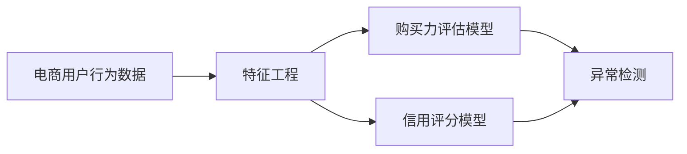

                 

# AI赋能的电商用户购买力评估与信用模型

> 关键词：电商用户购买力评估,信用模型,人工智能,机器学习,电商平台,风险管理,风险预测

## 1. 背景介绍

### 1.1 问题由来

随着电子商务的快速发展，电商平台之间的竞争日益激烈，用户流失率也越来越高。为了降低用户流失率，提升用户粘性，电商平台需要深入理解用户的购买力和信用水平，从而进行精准营销和风险管理。传统的购买力评估和信用模型往往依赖于手动标注和统计分析，效率低且效果差。

而随着人工智能技术的发展，基于机器学习和深度学习的大数据技术已经成为电商用户购买力评估和信用模型的重要手段。通过构建高质量的电商数据集，并应用先进的机器学习算法，可以大幅提升购买力评估和信用模型的精度，并实现实时化、自动化更新，从而帮助电商平台更精准地识别和推荐用户，防范风险。

### 1.2 问题核心关键点

构建电商用户购买力评估和信用模型，需要解决以下几个核心问题：

- 电商用户行为数据的收集与处理：电商平台通常有大量的用户行为数据，如浏览记录、购买记录、评价记录等。如何高效地收集和处理这些数据，以构建高质量的数据集，是构建模型的第一步。
- 特征工程的构建：用户行为数据往往包含大量噪音和冗余信息，需要对其进行有效的特征工程处理，提取最有用的特征，供机器学习模型使用。
- 机器学习模型的选择与优化：选择并优化合适的机器学习算法，如回归模型、分类模型、异常检测模型等，对用户进行购买力评估和信用评分。
- 模型的实时更新与维护：电商平台的业务场景变化频繁，购买力评估和信用模型需要实时更新以适应新的业务需求。
- 模型的解释性与可靠性：电商平台的决策对用户影响巨大，模型的解释性和可靠性必须得到充分保证，以避免造成误判或歧视。

### 1.3 问题研究意义

电商用户购买力评估和信用模型具有以下重要意义：

- 提高用户粘性：通过精确识别高价值用户，电商平台可以更好地进行个性化推荐和精准营销，提升用户满意度和忠诚度。
- 降低运营风险：电商平台上用户数量庞大，高信用用户对平台的声誉和资金安全至关重要。通过信用模型的筛选，可以有效识别和防范欺诈和风险用户，降低运营损失。
- 支持金融服务：电商用户信用评估结果可以作为贷款、信用卡等金融服务的依据，帮助用户获得更有竞争力的金融服务。
- 提升服务质量：通过智能化的信用评估，电商平台可以动态调整服务策略，提升整体服务质量，增强用户体验。

## 2. 核心概念与联系

### 2.1 核心概念概述

构建电商用户购买力评估与信用模型，涉及以下几个核心概念：

- 电商用户行为数据：包括用户的浏览记录、购买记录、评价记录、点击记录、收藏记录等。
- 特征工程：从原始数据中提取有用的特征，如用户历史行为、行为频率、购买金额、评价评分等。
- 购买力评估模型：预测用户未来可能购买的商品金额或消费频次，帮助电商平台识别高购买力用户。
- 信用评分模型：对用户进行信用评分，从平台角度评估用户的信用水平，用于风险控制和金融服务。
- 深度学习：通过神经网络模型对大量数据进行特征提取和复杂模式的学习。
- 异常检测：通过算法识别和筛选出异常行为，如欺诈行为、异常购买行为等，提升模型的风险识别能力。

这些概念之间的关系可以通过以下Mermaid流程图来展示：



这个流程图展示了电商用户行为数据经过特征工程处理后，可以用于购买力评估模型和信用评分模型的构建。同时，异常检测可以对模型的预测结果进行验证，提升模型的鲁棒性。

## 3. 核心算法原理 & 具体操作步骤
### 3.1 算法原理概述

电商用户购买力评估与信用模型的构建，本质上是基于机器学习的回归和分类问题。其核心思想是通过对用户行为数据的分析和建模，预测用户未来的购买力和信用水平。

具体来说，购买力评估模型需要预测用户未来的消费金额或购买频次。这通常是一个回归问题，可以采用线性回归、决策树回归、随机森林回归、梯度提升回归等算法进行建模。

信用评分模型则需要对用户进行信用等级划分，通常是二分类或多分类问题，可以采用逻辑回归、支持向量机、神经网络等算法进行建模。

异常检测模型则用于识别和筛选出异常用户行为，通常是一个异常检测问题，可以采用孤立森林、基于密度的聚类、高斯混合模型等算法进行建模。

### 3.2 算法步骤详解

电商用户购买力评估与信用模型的构建，一般包括以下几个关键步骤：

**Step 1: 数据收集与处理**

- 收集电商平台的用户行为数据，如浏览记录、购买记录、评价记录等。
- 清洗数据，处理缺失值、异常值，去除噪音数据。
- 划分训练集、验证集和测试集，确保模型训练和评估的公平性。

**Step 2: 特征工程**

- 对用户行为数据进行特征提取，如用户历史行为、行为频率、购买金额、评价评分等。
- 对特征进行归一化、标准化、降维等处理，减少特征冗余和噪音。
- 构建特征矩阵，作为机器学习模型的输入。

**Step 3: 模型训练与优化**

- 选择并训练合适的机器学习模型，如回归模型、分类模型、异常检测模型等。
- 使用交叉验证等方法评估模型性能，选择合适的超参数和模型结构。
- 采用集成学习、模型融合等技术提升模型效果。

**Step 4: 模型应用与更新**

- 将训练好的模型应用于电商平台的业务场景，进行用户购买力评估和信用评分。
- 实时收集新的用户行为数据，周期性地对模型进行更新和重新训练，确保模型能够适应业务的变化。
- 监控模型性能，及时调整模型参数，优化模型预测效果。

**Step 5: 结果展示与反馈**

- 将模型的评估结果反馈到电商平台，用于个性化推荐、风险控制等决策。
- 通过A/B测试等方式，评估模型效果，进行持续优化和改进。

### 3.3 算法优缺点

电商用户购买力评估与信用模型的构建，具有以下优点：

- 精度高：通过大量数据训练的机器学习模型，能够精确预测用户的购买力和信用水平。
- 自动化：模型自动化训练和应用，大大减少了人工操作，提升了工作效率。
- 实时性：模型可以根据实时数据进行更新和重新训练，确保预测结果的实时性。
- 适应性强：模型能够适应电商平台的业务变化，提升应用场景的覆盖范围。

同时，该方法也存在一定的局限性：

- 数据质量要求高：模型的训练和应用依赖于高质量的数据集，如果数据质量不高，模型效果将大打折扣。
- 计算资源消耗大：构建和训练深度学习模型需要大量的计算资源，对硬件设施要求较高。
- 模型解释性差：深度学习模型的内部工作机制复杂，难以解释其决策过程。
- 过度拟合风险：模型可能对训练数据过度拟合，导致泛化性能不佳。

### 3.4 算法应用领域

电商用户购买力评估与信用模型，广泛应用于以下几个领域：

- 个性化推荐：通过对用户购买力和信用水平的评估，电商平台可以更精准地推荐商品和广告。
- 风险控制：通过识别欺诈和风险用户，电商平台可以防范金融风险和运营损失。
- 金融服务：电商用户信用评分可以作为贷款、信用卡等金融服务的依据，提升用户体验和金融服务的精准性。
- 市场营销：电商平台可以通过用户购买力评估，进行精准营销和用户细分，提升市场投放效果。

## 4. 数学模型和公式 & 详细讲解  
### 4.1 数学模型构建

电商用户购买力评估与信用模型的构建，通常采用以下数学模型：

- 回归模型：如线性回归、决策树回归、随机森林回归、梯度提升回归等，用于预测用户的未来消费金额或购买频次。
- 分类模型：如逻辑回归、支持向量机、神经网络等，用于对用户进行信用评分。
- 异常检测模型：如孤立森林、基于密度的聚类、高斯混合模型等，用于识别和筛选出异常用户行为。

以线性回归模型为例，其数学公式为：

$$
y = \theta_0 + \sum_{i=1}^n \theta_i x_i + \epsilon
$$

其中，$y$ 为预测值，$\theta_0$ 为截距，$\theta_i$ 为回归系数，$x_i$ 为输入特征，$\epsilon$ 为误差项。

### 4.2 公式推导过程

以线性回归模型为例，推导其预测值和误差项的计算公式。

假设训练数据集为 $(x_{i,j},y_i)_{i=1}^m$，其中 $x_{i,j}$ 表示第 $i$ 个样本的第 $j$ 个特征，$y_i$ 表示样本的真实标签。

根据最小二乘法，线性回归模型的系数 $\theta$ 可以通过以下公式求解：

$$
\theta = (X^TX)^{-1}X^Ty
$$

其中，$X$ 为特征矩阵，$y$ 为标签向量。

线性回归模型的预测值为：

$$
\hat{y}_i = \theta_0 + \sum_{i=1}^n \theta_i x_{i,j}
$$

误差项 $\epsilon$ 的计算公式为：

$$
\epsilon = y_i - \hat{y}_i
$$

### 4.3 案例分析与讲解

以电商用户购买力评估为例，分析模型的构建和应用。

假设电商平台收集到用户的浏览记录和购买记录，每个用户有 $n=5$ 个特征，分别表示用户的平均浏览时间、平均浏览商品数、平均购买金额、平均购买频次、平均评价评分。

可以构建线性回归模型，预测用户的未来购买金额，用于识别高购买力用户。

假设模型经过训练，得到的回归系数为 $\theta_0=100, \theta_1=10, \theta_2=5, \theta_3=3, \theta_4=2, \theta_5=1$。则对于用户 $i$ 的预测购买金额为：

$$
\hat{y}_i = 100 + 10x_{i,1} + 5x_{i,2} + 3x_{i,3} + 2x_{i,4} + x_{i,5}
$$

假设用户 $i$ 的平均浏览时间为 $x_{i,1}=30$，平均浏览商品数为 $x_{i,2}=5$，平均购买金额为 $x_{i,3}=500$，平均购买频次为 $x_{i,4}=10$，平均评价评分为 $x_{i,5}=4$，则预测购买金额为：

$$
\hat{y}_i = 100 + 10 \times 30 + 5 \times 5 + 3 \times 500 + 2 \times 10 + 4 = 8024
$$

即该用户未来可能购买金额为8024元。

## 5. 项目实践：代码实例和详细解释说明
### 5.1 开发环境搭建

在进行电商用户购买力评估与信用模型的项目实践前，需要先准备好开发环境。以下是使用Python进行Pandas和Scikit-learn开发的环境配置流程：

1. 安装Anaconda：从官网下载并安装Anaconda，用于创建独立的Python环境。

2. 创建并激活虚拟环境：
```bash
conda create -n user-behavior-analysis python=3.8 
conda activate user-behavior-analysis
```

3. 安装Pandas和Scikit-learn：
```bash
conda install pandas scikit-learn
```

4. 安装各类工具包：
```bash
pip install numpy matplotlib seaborn
```

完成上述步骤后，即可在`user-behavior-analysis`环境中开始项目实践。

### 5.2 源代码详细实现

下面我们以电商用户购买力评估为例，给出使用Pandas和Scikit-learn进行线性回归模型的代码实现。

首先，定义数据处理函数：

```python
import pandas as pd

def load_data(file_path):
    data = pd.read_csv(file_path)
    return data

def clean_data(data):
    # 处理缺失值
    data.fillna(data.mean(), inplace=True)
    
    # 处理异常值
    data = data[data['avg_browsing_time'] < 300]  # 限定平均浏览时间为300分钟
    data = data[data['avg_purchase_amount'] > 0]  # 限定购买金额大于0
    data = data[data['avg_purchase_frequency'] > 1]  # 限定购买频次大于1
    return data

def split_data(data, test_size=0.2):
    train_data = data.sample(frac=1-test_size, random_state=42)
    test_data = data.drop(train_data.index)
    return train_data, test_data
```

然后，定义模型训练函数：

```python
from sklearn.linear_model import LinearRegression

def train_model(data, test_size=0.2):
    train_data, test_data = split_data(data, test_size)
    
    # 特征工程
    train_data = clean_data(train_data)
    X = train_data[['avg_browsing_time', 'avg_browsing_goods', 'avg_purchase_amount', 'avg_purchase_frequency', 'avg_review_score']]
    y = train_data['avg_purchase_amount']
    
    # 线性回归模型
    model = LinearRegression()
    model.fit(X, y)
    
    # 评估模型
    test_data = clean_data(test_data)
    X_test = test_data[['avg_browsing_time', 'avg_browsing_goods', 'avg_purchase_amount', 'avg_purchase_frequency', 'avg_review_score']]
    y_test = test_data['avg_purchase_amount']
    mse = model.score(X_test, y_test)
    print('Model MSE:', mse)
```

最后，启动训练流程：

```python
data = load_data('user_behavior.csv')
train_model(data)
```

以上就是使用Pandas和Scikit-learn对电商用户购买力评估进行线性回归模型的代码实现。可以看到，借助Pandas和Scikit-learn的强大封装，我们可以用相对简洁的代码完成模型的加载和训练。

### 5.3 代码解读与分析

让我们再详细解读一下关键代码的实现细节：

**load_data函数**：
- 读取原始用户行为数据集，使用Pandas的`read_csv`函数加载CSV文件。

**clean_data函数**：
- 处理缺失值和异常值，确保模型训练的可靠性。
- 限定平均浏览时间为300分钟，限定购买金额大于0，限定购买频次大于1，去除异常数据。

**split_data函数**：
- 将数据集划分为训练集和测试集，使用Pandas的`sample`函数随机采样。

**train_model函数**：
- 使用Pandas的`split_data`函数将数据集划分为训练集和测试集。
- 进行特征工程处理，提取有用的特征。
- 使用Scikit-learn的`LinearRegression`类构建线性回归模型。
- 使用`fit`函数对模型进行训练。
- 使用测试集对模型进行评估，计算均方误差。

**代码执行流程**：
- 加载用户行为数据集。
- 调用`train_model`函数，对数据集进行清理和训练，计算模型均方误差。

可以看到，借助Pandas和Scikit-learn，电商用户购买力评估模型的构建变得非常简单高效。开发者可以专注于业务逻辑的实现，而不必过多关注底层的数据处理和模型优化。

当然，在工业级的系统实现中，还需要考虑更多因素，如模型的保存和部署、超参数的自动搜索、更灵活的任务适配层等。但核心的模型构建方法基本与此类似。

## 6. 实际应用场景
### 6.1 电商平台个性化推荐

电商平台可以利用购买力评估模型，精准识别高价值用户，从而进行个性化推荐。根据用户的历史行为和预测购买力，推荐其可能感兴趣的商品，提升用户体验和销售转化率。

### 6.2 风险控制与欺诈检测

电商平台通过信用评分模型，对用户进行信用等级划分，筛选出高风险用户。对于高风险用户，可以采取更严格的审核措施，降低运营风险。同时，利用异常检测模型，识别和筛选出异常购买行为，防范欺诈和风险。

### 6.3 金融服务与贷款审批

电商用户的信用评分结果可以作为贷款、信用卡等金融服务的依据，帮助用户获得更有竞争力的金融服务。金融机构可以根据用户的信用评分结果，评估其贷款风险，进行风险控制和决策。

### 6.4 市场营销与用户细分

电商平台可以利用购买力评估模型，对用户进行精准营销和用户细分，提升市场投放效果。通过对不同用户群体的分析和识别，制定更有效的市场策略，提升整体营销效果。

## 7. 工具和资源推荐
### 7.1 学习资源推荐

为了帮助开发者系统掌握电商用户购买力评估与信用模型的理论基础和实践技巧，这里推荐一些优质的学习资源：

1. 《Python数据分析》：一本详细介绍Pandas库的数据分析应用的经典书籍，适合初学者入门。

2. 《Scikit-learn机器学习实战》：一本详细介绍Scikit-learn库的机器学习算法的实战书籍，适合Pandas和Scikit-learn的进阶学习。

3. 《机器学习》：斯坦福大学Andrew Ng教授的经典课程，涵盖了机器学习的基本概念和常用算法，适合全面了解机器学习技术。

4. 《深度学习》：Ian Goodfellow等人的经典教材，系统介绍了深度学习的基本原理和常用算法，适合深度学习的进阶学习。

5. 《Python机器学习》：一本详细介绍Python机器学习应用的书籍，适合Pandas和Scikit-learn的实战练习。

通过学习这些资源，相信你一定能够快速掌握电商用户购买力评估与信用模型的精髓，并用于解决实际的电商问题。

### 7.2 开发工具推荐

高效的开发离不开优秀的工具支持。以下是几款用于电商用户购买力评估与信用模型开发的常用工具：

1. Jupyter Notebook：一款强大的交互式编程环境，适合数据探索和模型训练。

2. Pandas：一款功能强大的数据处理库，适合数据的清洗和预处理。

3. Scikit-learn：一款简单易用的机器学习库，适合快速搭建和优化机器学习模型。

4. TensorFlow：一款强大的深度学习框架，适合构建和训练复杂的深度学习模型。

5. PyTorch：一款灵活易用的深度学习框架，适合动态构建和优化深度学习模型。

6. XGBoost：一款高效的梯度提升算法库，适合处理大规模数据和高维特征。

合理利用这些工具，可以显著提升电商用户购买力评估与信用模型的开发效率，加快创新迭代的步伐。

### 7.3 相关论文推荐

电商用户购买力评估与信用模型的发展源于学界的持续研究。以下是几篇奠基性的相关论文，推荐阅读：

1. "A linear regression approach for predicting customer lifetime value"（Jerry Wind, Paul R. covariance analysis"）：提出了线性回归模型预测客户终身价值的经典方法。

2. "Support Vector Machines"（Corinna Cortes, Vapnik）：提出了支持向量机算法，用于分类和回归问题。

3. "Anomaly detection in machine learning: a survey"（Haesun Park, Sergio Casellas）：综述了异常检测算法的现状和应用，适合了解异常检测的相关知识。

4. "The Elements of Statistical Learning"（Tibshirani, Hastie, Friedman）：全面介绍了统计学习的基本概念和常用算法，适合深入了解机器学习理论。

5. "Python Machine Learning"（Sebastian Raschka）：介绍了Python在机器学习中的应用，适合实战练习。

这些论文代表了大数据技术在电商用户购买力评估与信用模型领域的研究进展，通过学习这些前沿成果，可以帮助研究者把握学科前进方向，激发更多的创新灵感。

## 8. 总结：未来发展趋势与挑战
### 8.1 总结

本文对电商用户购买力评估与信用模型的构建进行了全面系统的介绍。首先阐述了电商用户行为数据收集和处理的重要性，明确了特征工程在构建高质量数据集中的关键作用。其次，从原理到实践，详细讲解了回归和分类模型的数学原理和操作步骤，给出了电商用户购买力评估与信用模型的完整代码实例。同时，本文还广泛探讨了模型在个性化推荐、风险控制、金融服务等多个电商场景中的应用前景，展示了模型的广泛适用性。此外，本文精选了电商用户购买力评估与信用模型的学习资源，力求为读者提供全方位的技术指引。

通过本文的系统梳理，可以看到，基于机器学习的大数据技术已经成为电商用户购买力评估与信用模型的重要手段。模型的训练和应用大大提升了电商平台的业务决策效率，推动了电商平台的智能化发展。未来，伴随技术的不断进步和算力资源的提升，基于深度学习的电商用户购买力评估与信用模型将取得更大的突破，为电商平台的智能化转型提供更强大的技术支持。

### 8.2 未来发展趋势

展望未来，电商用户购买力评估与信用模型将呈现以下几个发展趋势：

1. 深度学习模型的广泛应用：深度学习模型在电商用户购买力评估与信用模型中将占据主导地位，通过神经网络模型提取复杂特征，提升模型的预测能力。

2. 实时化和自动化：电商平台的业务场景变化频繁，购买力评估与信用模型需要实时更新和自动优化，以适应新的业务需求。

3. 多模态数据的融合：电商平台上存在多种数据类型，如图像、文本、视频等，未来模型将融合多种数据类型，提升对电商用户行为的全面理解。

4. 异常检测与风险控制：电商平台上存在大量的欺诈和风险行为，未来的模型将更加注重异常检测和风险控制，提升电商平台的运营安全。

5. 个性化推荐与精准营销：通过电商用户购买力评估与信用模型，电商平台可以更精准地推荐商品和广告，提升用户满意度和营销效果。

6. 金融服务与贷款审批：电商用户的信用评分结果可以作为金融服务的依据，未来的模型将更加关注金融领域的应用，提升金融服务的精准性和安全性。

以上趋势凸显了电商用户购买力评估与信用模型的广阔前景。这些方向的探索发展，必将进一步提升电商平台的智能化水平，为电商用户带来更优质的购物体验和金融服务。

### 8.3 面临的挑战

尽管电商用户购买力评估与信用模型已经取得了一定的进展，但在迈向更加智能化、普适化应用的过程中，仍面临诸多挑战：

1. 数据质量问题：电商用户行为数据往往包含大量噪音和冗余信息，数据质量不高将严重影响模型的预测效果。

2. 计算资源限制：深度学习模型需要大量的计算资源，大规模数据集的训练和推理需要高性能的硬件设施。

3. 模型解释性问题：深度学习模型的内部机制复杂，难以解释其决策过程，影响模型的可解释性和可信度。

4. 模型鲁棒性问题：模型可能对训练数据过度拟合，泛化性能不佳，无法适应新的业务场景。

5. 用户隐私问题：电商用户行为数据的隐私保护问题，需要在模型构建和应用过程中加以充分考虑。

6. 道德与公平问题：电商用户的信用评分模型可能存在偏见和歧视，需要充分考虑道德和公平性问题。

正视电商用户购买力评估与信用模型面临的这些挑战，积极应对并寻求突破，将是大模型微调走向成熟的必由之路。相信随着学界和产业界的共同努力，这些挑战终将一一被克服，电商用户购买力评估与信用模型必将在构建智能化电商生态中扮演越来越重要的角色。

### 8.4 研究展望

面向未来，电商用户购买力评估与信用模型的研究需要在以下几个方面寻求新的突破：

1. 无监督学习与半监督学习：摆脱对大规模标注数据的依赖，利用自监督学习、主动学习等方法，最大限度利用非结构化数据，实现更加灵活高效的模型构建。

2. 深度学习模型的优化：开发更加参数高效的深度学习模型，如稀疏化神经网络、混合精度训练等，在固定大部分参数的情况下，提升模型的泛化能力和推理速度。

3. 多模态数据的融合：将视觉、语音、文本等多种数据类型进行融合，提升对电商用户行为的全面理解，增强模型的预测能力。

4. 异常检测与风险控制：引入因果推断和强化学习等技术，提升模型对异常行为和风险行为的识别能力，增强模型的鲁棒性和稳定性。

5. 个性化推荐与精准营销：结合推荐系统、内容分发等技术，提升个性化推荐和精准营销的效果，提升用户满意度和营销效果。

6. 金融服务与贷款审批：将电商用户信用评分结果应用于金融领域，提升金融服务的精准性和安全性，为电商用户提供更优质的金融服务。

这些研究方向将引领电商用户购买力评估与信用模型向更高的台阶迈进，为电商平台的智能化转型提供更强大的技术支撑，推动电商行业的数字化、智能化发展。

## 9. 附录：常见问题与解答

**Q1：电商用户行为数据有哪些常见的来源？**

A: 电商用户行为数据可以从以下几个方面获取：
1. 电商平台内部的数据记录，如浏览记录、购买记录、评价记录等。
2. 第三方数据来源，如社交媒体、搜索引擎等。
3. 数据合作机构，如数据分析公司、行业协会等。
4. 用户主动填写的问卷调查数据。

通过多种数据来源的融合，可以构建更全面、更准确的用户行为数据集，提升模型的预测效果。

**Q2：电商用户购买力评估模型的训练与优化有哪些关键步骤？**

A: 电商用户购买力评估模型的训练与优化，一般包括以下关键步骤：
1. 数据收集与处理：收集电商平台的用户行为数据，并进行清洗、预处理，构建高质量的数据集。
2. 特征工程：提取有用的特征，如用户历史行为、行为频率、购买金额等，并进行归一化、标准化等处理。
3. 模型选择与训练：选择合适的机器学习模型，如线性回归、决策树、神经网络等，对模型进行训练和优化。
4. 模型评估与调优：使用交叉验证等方法评估模型性能，选择最优的超参数和模型结构。
5. 模型应用与更新：将训练好的模型应用于电商平台，进行实时数据更新和模型重新训练。

**Q3：电商用户购买力评估模型在实际应用中需要注意哪些问题？**

A: 电商用户购买力评估模型在实际应用中需要注意以下问题：
1. 数据质量问题：电商用户行为数据往往包含大量噪音和冗余信息，需要确保数据质量。
2. 计算资源限制：深度学习模型需要大量的计算资源，需要高性能的硬件设施。
3. 模型解释性问题：深度学习模型的内部机制复杂，难以解释其决策过程，影响模型的可解释性和可信度。
4. 用户隐私问题：电商用户行为数据的隐私保护问题，需要在模型构建和应用过程中加以充分考虑。
5. 模型鲁棒性问题：模型可能对训练数据过度拟合，泛化性能不佳，需要及时更新模型以适应新的业务场景。

正视这些挑战，积极应对并寻求突破，将是大模型微调走向成熟的必由之路。

**Q4：电商用户信用评分模型的构建与优化有哪些关键步骤？**

A: 电商用户信用评分模型的构建与优化，一般包括以下关键步骤：
1. 数据收集与处理：收集电商平台的用户行为数据，并进行清洗、预处理，构建高质量的数据集。
2. 特征工程：提取有用的特征，如用户历史行为、行为频率、购买金额、评价评分等，并进行归一化、标准化等处理。
3. 模型选择与训练：选择合适的机器学习模型，如逻辑回归、支持向量机、神经网络等，对模型进行训练和优化。
4. 模型评估与调优：使用交叉验证等方法评估模型性能，选择最优的超参数和模型结构。
5. 模型应用与更新：将训练好的模型应用于电商平台，进行实时数据更新和模型重新训练。

**Q5：电商用户行为数据的处理和预处理有哪些常见方法？**

A: 电商用户行为数据的处理和预处理，常见的方法包括：
1. 数据清洗：处理缺失值、异常值，去除噪音数据。
2. 特征工程：提取有用的特征，如用户历史行为、行为频率、购买金额等，并进行归一化、标准化等处理。
3. 数据划分：将数据集划分为训练集、验证集和测试集，确保模型训练和评估的公平性。
4. 数据增强：通过回译、近义替换等方式扩充训练集，提升模型的泛化能力。
5. 特征降维：通过主成分分析、因子分析等方法，减少特征冗余和噪音。

这些方法可以有效地处理和预处理电商用户行为数据，提升模型的预测效果。

---

作者：禅与计算机程序设计艺术 / Zen and the Art of Computer Programming

