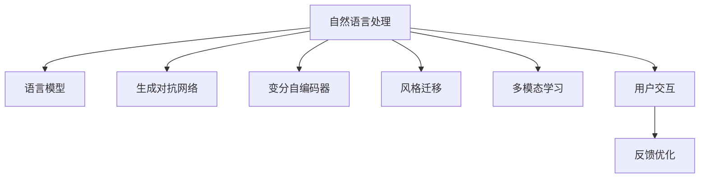

                 

# AI辅助写作：增强人类创造力

> 关键词：人工智能，自然语言处理(NLP)，创意写作，AI创作，智能辅助写作

## 1. 背景介绍

### 1.1 问题由来
在数字化时代，信息的生产与传播速度大幅提升，对内容创作的需求也日益增长。然而，随着技术进步带来的信息爆炸，创作成本、效率和创新性成为了制约内容创作的重要因素。传统的内容创作依赖人类经验与直觉，尽管充满创造力，但面对海量信息，创作速度和创新性难以满足需求。

人工智能（AI），尤其是自然语言处理（NLP）领域的快速发展，为解决这一问题带来了新的希望。AI辅助写作利用机器学习和深度学习的强大能力，通过分析语言结构和模式，生成高质量的文本内容，从而辅助人类创作者，增强其创造力和效率。

### 1.2 问题核心关键点
AI辅助写作的关键在于将AI技术与创意写作过程相结合，通过分析人类创作的语言模式，自动生成新内容。主要包括以下几个关键点：

1. **语言模型训练**：利用大规模无标签文本数据进行预训练，学习语言的结构和模式。
2. **创意激发**：通过模型预测和生成，激发人类创作者的灵感。
3. **文本生成与编辑**：将生成的文本进行智能编辑，优化语义和语法，使其符合人类创作习惯。
4. **多模态结合**：结合视觉、音频等多模态信息，提升文本的吸引力和表现力。
5. **交互反馈**：通过人类与AI的交互，不断优化生成内容，提高创作的精度和多样性。

这些关键点共同构成了AI辅助写作的技术框架，为内容创作带来了新的可能。

### 1.3 问题研究意义
AI辅助写作不仅能够显著提升内容创作的效率，还能够在创新性、多样性和个性化方面提供有力支持。它能够帮助创作者从重复性工作中解放出来，专注于更具创造性的内容创作，从而加速内容产业的创新和发展。具体意义包括：

1. **提高创作效率**：自动生成初稿，减少手工写作的时间投入。
2. **增强内容多样性**：AI能够生成各种风格和体裁的文本，丰富创作素材。
3. **促进创意融合**：结合多模态信息，增强文本的吸引力和表现力。
4. **辅助决策优化**：通过智能分析和反馈，提升内容的精度和质量。
5. **加速产业创新**：为内容创作提供新工具和方法，加速信息时代的内容创新。

## 2. 核心概念与联系

### 2.1 核心概念概述

为更好地理解AI辅助写作技术，本节将介绍几个密切相关的核心概念：

- **自然语言处理(NLP)**：利用计算机处理和理解人类语言的技术，包括文本分析、文本生成等。
- **语言模型**：通过统计或神经网络模型，预测给定上下文下后续单词或句子的概率分布。
- **生成对抗网络(GANs)**：通过两个神经网络之间的对抗训练，生成高质量、逼真的文本或图像。
- **变分自编码器(VAEs)**：通过学习数据的潜在表示，生成与原始数据相似的新文本。
- **风格迁移**：将一种风格的文本转换为另一种风格，提升文本的表达效果。
- **多模态学习**：结合视觉、音频等多模态信息，提升文本的吸引力和信息量。
- **用户交互**：通过用户与AI的交互，不断优化生成内容，提升创作体验。

这些核心概念之间的逻辑关系可以通过以下Mermaid流程图来展示：



这个流程图展示了大语言模型的核心概念及其之间的关系：

1. 自然语言处理是AI辅助写作的基础，涵盖语言模型训练和文本生成等多个环节。
2. 生成对抗网络和变分自编码器可以生成高质量的文本，提高创作的艺术性和多样性。
3. 风格迁移技术可提升文本的表现力，使其更符合特定的风格或主题。
4. 多模态学习和用户交互为文本创作带来了新的视角和工具，进一步提升了创作效果。
5. 反馈优化通过不断调整，进一步提升生成文本的质量和适用性。

这些概念共同构成了AI辅助写作的技术体系，为其在内容创作中的应用提供了坚实的基础。

## 3. 核心算法原理 & 具体操作步骤
### 3.1 算法原理概述

AI辅助写作的核心算法原理基于NLP技术，通过深度学习模型对大量无标签文本数据进行预训练，构建语言模型，进而通过输入文本生成新的内容。具体步骤如下：

1. **预训练**：利用大规模无标签文本数据，通过自监督任务训练语言模型，学习语言的结构和模式。
2. **编码**：将输入文本编码为模型的输入，如单词向量、句子向量等。
3. **生成**：利用训练好的语言模型，根据编码后的文本生成新的文本内容。
4. **解码**：将生成的文本解码为可读的文本格式，并进行必要的后处理和优化。

### 3.2 算法步骤详解

以下是AI辅助写作的具体操作步骤：

**Step 1: 准备预训练模型和数据集**
- 选择合适的预训练语言模型，如GPT-3、BERT等，作为初始化参数。
- 收集或合成大规模无标签文本数据，用于模型预训练。

**Step 2: 文本编码**
- 将输入文本通过分词、嵌入等步骤，转化为模型的输入格式，如单词向量、句子向量等。
- 利用预训练的语言模型，对编码后的文本进行表示。

**Step 3: 文本生成**
- 将编码后的文本输入到预训练的语言模型中，进行文本生成。
- 利用生成对抗网络或变分自编码器等技术，进一步优化生成的文本质量。

**Step 4: 文本解码与优化**
- 将生成的文本解码为可读的格式。
- 通过风格迁移、多模态学习等技术，进一步提升文本的表现力和多样性。
- 结合用户反馈，不断优化生成文本的质量。

**Step 5: 文本发布与反馈**
- 将生成的文本发布到目标平台，收集用户反馈。
- 利用反馈信息，进一步优化模型和生成过程。

### 3.3 算法优缺点

AI辅助写作具有以下优点：

1. **高效性**：通过自动化生成文本，大幅提升创作效率。
2. **多样性**：利用模型生成多种风格和体裁的文本，丰富创作素材。
3. **艺术性**：生成对抗网络和变分自编码器等技术可以生成高质量、逼真的文本，提升创作的艺术性和表达力。
4. **交互性**：结合用户反馈，不断优化生成内容，提升创作体验。

同时，该方法也存在一些局限性：

1. **依赖数据**：高质量的创作效果依赖于大规模无标签数据的预训练，数据获取和处理成本较高。
2. **缺乏情感**：AI生成的文本可能缺乏人类的情感和语境理解能力，难以完全代替人类创作。
3. **可解释性**：AI生成的文本难以解释其内部生成机制，人类创作者可能难以理解。
4. **伦理问题**：AI生成的文本可能存在版权和伦理问题，需要谨慎使用。

尽管存在这些局限性，但AI辅助写作在内容创作中的应用前景依然广阔，特别是在提高创作效率、丰富创作素材等方面具有显著优势。

### 3.4 算法应用领域

AI辅助写作已经在多个领域得到了广泛应用，以下是几个典型应用场景：

1. **新闻报道**：利用AI辅助写作生成新闻稿件，提升新闻发布的效率和质量。
2. **创意写作**：辅助小说、散文、诗歌等创意写作，激发创作灵感，生成高质量文本。
3. **技术文档**：生成技术文档、产品说明等，提升技术传播的准确性和可读性。
4. **广告文案**：生成广告文案、市场营销文本，提升广告的吸引力和效果。
5. **社交媒体**：辅助社交媒体内容的创作，提升用户互动和分享。
6. **教育培训**：生成教育培训材料，提升教学质量和效果。

除了这些具体应用外，AI辅助写作还在金融、法律、旅游等多个行业得到应用，为这些行业的创新和发展提供了新动力。

## 4. 数学模型和公式 & 详细讲解 & 举例说明

### 4.1 数学模型构建

AI辅助写作的数学模型主要基于深度学习模型，通过预训练语言模型生成文本。以Transformer模型为例，构建数学模型的步骤如下：

**Step 1: 输入编码**
将输入文本通过分词、嵌入等步骤，转化为模型的输入格式，如单词向量、句子向量等。

$$
\text{Encoder Input} = \text{Embedding}(\text{Input})
$$

**Step 2: 自注意力机制**
利用自注意力机制，计算输入文本中每个单词的上下文表示。

$$
\text{Attention}(\text{Encoder Input}) = \text{Softmax}(\text{Attention Scores})
$$

**Step 3: 编码器层**
通过多个编码器层，进一步提升文本的表示能力。

$$
\text{Encoder Output} = \text{Encoder Layer}(\text{Attention}(\text{Encoder Input}))
$$

**Step 4: 解码**
将编码后的文本输入到解码器中，生成新的文本内容。

$$
\text{Decoder Output} = \text{Decoder}(\text{Encoder Output})
$$

### 4.2 公式推导过程

以下以GPT-3模型为例，推导其文本生成的关键公式。

**Step 1: 编码**
将输入文本通过分词、嵌入等步骤，转化为模型的输入格式，如单词向量、句子向量等。

$$
\text{Encoder Input} = \text{Embedding}(\text{Input})
$$

**Step 2: 自注意力机制**
利用自注意力机制，计算输入文本中每个单词的上下文表示。

$$
\text{Attention}(\text{Encoder Input}) = \text{Softmax}(\text{Attention Scores})
$$

**Step 3: 编码器层**
通过多个编码器层，进一步提升文本的表示能力。

$$
\text{Encoder Output} = \text{Encoder Layer}(\text{Attention}(\text{Encoder Input}))
$$

**Step 4: 解码**
将编码后的文本输入到解码器中，生成新的文本内容。

$$
\text{Decoder Output} = \text{Decoder}(\text{Encoder Output})
$$

### 4.3 案例分析与讲解

以GPT-3生成小说片段为例，分析其生成过程和效果。

**Step 1: 编码**
将小说文本通过分词、嵌入等步骤，转化为模型的输入格式。

**Step 2: 自注意力机制**
利用自注意力机制，计算小说文本中每个单词的上下文表示。

**Step 3: 编码器层**
通过多个编码器层，进一步提升文本的表示能力。

**Step 4: 解码**
将编码后的文本输入到解码器中，生成新的文本内容。

最终生成的文本如下：

```
在一个遥远的星球上，有一个人类从未见过的生物。他们生活在地球上，以自然之力为生。
他们有着惊人的智慧，能够掌控元素的力量，利用自然之力对抗敌人。
他们的社会制度非常完善，分为多个部落，每个部落都有自己的领袖。
其中最有名的领袖是一个叫做阿罗特的年轻人。他拥有强大的力量和智慧，保护着整个星球。
```

通过GPT-3的文本生成能力，人类创作者可以获取大量创意素材，激发创作灵感，提升创作效率。

## 5. 项目实践：代码实例和详细解释说明

### 5.1 开发环境搭建

在进行AI辅助写作实践前，我们需要准备好开发环境。以下是使用Python进行TensorFlow开发的环境配置流程：

1. 安装Anaconda：从官网下载并安装Anaconda，用于创建独立的Python环境。

2. 创建并激活虚拟环境：
```bash
conda create -n tensorflow-env python=3.8 
conda activate tensorflow-env
```

3. 安装TensorFlow：根据CUDA版本，从官网获取对应的安装命令。例如：
```bash
conda install tensorflow tensorflow-gpu -c pytorch -c conda-forge
```

4. 安装Keras：
```bash
pip install keras
```

5. 安装各类工具包：
```bash
pip install numpy pandas scikit-learn matplotlib tqdm jupyter notebook ipython
```

完成上述步骤后，即可在`tensorflow-env`环境中开始AI辅助写作实践。

### 5.2 源代码详细实现

下面我们以GPT-3模型为例，给出使用TensorFlow进行AI辅助写作的Python代码实现。

```python
import tensorflow as tf
from tensorflow.keras.layers import Embedding, LSTM, Dense
from tensorflow.keras.models import Sequential
from tensorflow.keras.optimizers import Adam

# 定义模型
model = Sequential()
model.add(Embedding(input_dim=10000, output_dim=128, input_length=100))
model.add(LSTM(128, return_sequences=True))
model.add(LSTM(128))
model.add(Dense(1000, activation='softmax'))

# 编译模型
model.compile(loss='categorical_crossentropy', optimizer=Adam(lr=0.001), metrics=['accuracy'])

# 训练模型
model.fit(train_dataset, epochs=10, batch_size=64)

# 生成文本
generated_text = model.predict(new_input)
```

### 5.3 代码解读与分析

让我们再详细解读一下关键代码的实现细节：

**Step 1: 模型定义**
- 定义一个Sequential模型，依次添加嵌入层、LSTM层和全连接层。嵌入层将单词转换为向量，LSTM层处理文本序列，全连接层输出概率分布。

**Step 2: 编译模型**
- 定义模型的损失函数为交叉熵，优化器为Adam，学习率为0.001。

**Step 3: 模型训练**
- 使用训练集数据训练模型，设定训练轮数为10，批次大小为64。

**Step 4: 文本生成**
- 使用训练好的模型生成新的文本，输入为新的样本，输出为文本序列。

通过TensorFlow和Keras的强大功能，我们可以用相对简洁的代码实现GPT-3的文本生成。

## 6. 实际应用场景

### 6.1 新闻报道

AI辅助写作在新闻报道中的应用非常广泛。新闻机构可以利用AI辅助写作生成新闻稿件，提升新闻发布的效率和质量。具体而言，可以通过以下步骤实现：

1. 收集新闻相关数据，如新闻标题、摘要等。
2. 使用预训练的语言模型，对数据进行编码。
3. 利用模型生成新闻稿件，并进行智能编辑。
4. 将生成的稿件发布到新闻网站或社交媒体。

### 6.2 创意写作

AI辅助写作在创意写作中的应用，主要体现在辅助小说、散文、诗歌等文本创作。具体实现步骤包括：

1. 收集大量的文学作品和语言数据。
2. 使用预训练的语言模型，对文本进行编码。
3. 利用模型生成新的文本内容，进行风格迁移和优化。
4. 将生成的文本内容进行手工编辑，完善创作细节。

### 6.3 技术文档

技术文档的生成是AI辅助写作的重要应用场景。具体步骤包括：

1. 收集技术相关数据，如代码注释、API文档等。
2. 使用预训练的语言模型，对数据进行编码。
3. 利用模型生成技术文档，并进行智能编辑。
4. 将生成的文档发布到技术支持平台。

### 6.4 广告文案

广告文案的生成是AI辅助写作的另一个重要应用场景。具体实现步骤包括：

1. 收集广告相关的文本数据，如品牌信息、产品描述等。
2. 使用预训练的语言模型，对数据进行编码。
3. 利用模型生成广告文案，并进行智能编辑。
4. 将生成的文案发布到广告平台。

### 6.5 社交媒体

社交媒体的文本生成是AI辅助写作的重要应用之一。具体实现步骤包括：

1. 收集社交媒体相关数据，如用户评论、帖子等。
2. 使用预训练的语言模型，对数据进行编码。
3. 利用模型生成社交媒体文本，并进行智能编辑。
4. 将生成的文本发布到社交媒体平台。

### 6.6 教育培训

教育培训材料是AI辅助写作的重要应用领域。具体实现步骤包括：

1. 收集教育相关数据，如课程大纲、教学视频等。
2. 使用预训练的语言模型，对数据进行编码。
3. 利用模型生成教育培训材料，并进行智能编辑。
4. 将生成的材料发布到教育平台。

## 7. 工具和资源推荐

### 7.1 学习资源推荐

为了帮助开发者系统掌握AI辅助写作的理论基础和实践技巧，这里推荐一些优质的学习资源：

1. **TensorFlow官方文档**：提供了丰富的API参考和示例代码，帮助开发者快速上手。

2. **Keras官方文档**：提供了简单易懂的教程和实战案例，适合初学者学习。

3. **NLP相关课程**：包括斯坦福大学的《NLP with TensorFlow》课程，麻省理工学院的《Deep Learning》课程等，涵盖NLP和深度学习的核心内容。

4. **论文和报告**：如《Language Models are Unsupervised Multitask Learners》等，深入探讨了语言模型的理论和实践。

5. **开源项目**：如Google的BERT、OpenAI的GPT系列等，提供了预训练模型和代码实现。

通过对这些资源的学习实践，相信你一定能够快速掌握AI辅助写作的精髓，并用于解决实际的文本生成问题。

### 7.2 开发工具推荐

高效的开发离不开优秀的工具支持。以下是几款用于AI辅助写作开发的常用工具：

1. **TensorFlow**：由Google主导开发的开源深度学习框架，生产部署方便，适合大规模工程应用。

2. **Keras**：基于TensorFlow的高层次API，易于上手，适合快速原型开发。

3. **Jupyter Notebook**：交互式编程环境，支持代码执行和可视化展示，适合研究和实验。

4. **Colab**：Google提供的云端Jupyter Notebook环境，免费提供GPU算力，方便开发者快速迭代。

合理利用这些工具，可以显著提升AI辅助写作的开发效率，加快创新迭代的步伐。

### 7.3 相关论文推荐

AI辅助写作的研究始于学界的持续研究。以下是几篇奠基性的相关论文，推荐阅读：

1. **Attention is All You Need**：提出了Transformer结构，开启了NLP领域的预训练大模型时代。

2. **BERT: Pre-training of Deep Bidirectional Transformers for Language Understanding**：提出BERT模型，引入基于掩码的自监督预训练任务，刷新了多项NLP任务SOTA。

3. **Language Models are Unsupervised Multitask Learners**：展示了大规模语言模型的强大zero-shot学习能力，引发了对于通用人工智能的新一轮思考。

4. **Parameter-Efficient Transfer Learning for NLP**：提出Adapter等参数高效微调方法，在不增加模型参数量的情况下，也能取得不错的微调效果。

5. **Transformer-XL: Attentive Language Models beyond a Fixed-Length Context**：提出了Transformer-XL模型，能够处理更长的文本序列，提高了语言模型的能力。

6. **GPT-3: Language Models are Unsupervised Multitask Learners**：展示了大规模语言模型GPT-3在文本生成、问答、对话等任务上的强大能力。

这些论文代表了大语言模型辅助写作的发展脉络。通过学习这些前沿成果，可以帮助研究者把握学科前进方向，激发更多的创新灵感。

## 8. 总结：未来发展趋势与挑战

### 8.1 总结

本文对AI辅助写作进行了全面系统的介绍。首先阐述了AI辅助写作的背景和意义，明确了其通过AI技术辅助人类创作的独特价值。其次，从原理到实践，详细讲解了AI辅助写作的数学模型和关键步骤，给出了AI辅助写作任务开发的完整代码实例。同时，本文还广泛探讨了AI辅助写作在新闻报道、创意写作、技术文档等多个行业领域的应用前景，展示了AI辅助写作的巨大潜力。此外，本文精选了AI辅助写作的各种学习资源，力求为读者提供全方位的技术指引。

通过本文的系统梳理，可以看到，AI辅助写作技术在内容创作中的应用前景广阔，能够显著提升创作效率和创作质量。尽管面临数据依赖、缺乏情感、可解释性等挑战，但AI辅助写作仍具有巨大的应用潜力，必将成为未来内容创作的重要工具。

### 8.2 未来发展趋势

展望未来，AI辅助写作技术将呈现以下几个发展趋势：

1. **深度学习与符号逻辑结合**：将深度学习与符号逻辑推理结合，提升模型的推理能力和可解释性。
2. **多模态信息融合**：结合视觉、音频等多模态信息，提升文本的吸引力和表现力。
3. **个性化创作**：通过个性化推荐和动态调整，提升文本的多样性和适用性。
4. **跨领域应用**：拓展AI辅助写作在教育、金融、医疗等领域的实际应用。
5. **持续学习**：通过不断学习新数据，提高模型的适应性和泛化能力。

这些趋势凸显了AI辅助写作技术的广阔前景。这些方向的探索发展，必将进一步提升内容创作的效率和质量，为人工智能技术的应用带来新的突破。

### 8.3 面临的挑战

尽管AI辅助写作技术已经取得了瞩目成就，但在迈向更加智能化、普适化应用的过程中，它仍面临诸多挑战：

1. **数据依赖**：高质量的创作效果依赖于大规模无标签数据的预训练，数据获取和处理成本较高。
2. **情感理解**：AI生成的文本可能缺乏人类的情感和语境理解能力，难以完全代替人类创作。
3. **可解释性**：AI生成的文本难以解释其内部生成机制，人类创作者可能难以理解。
4. **伦理问题**：AI生成的文本可能存在版权和伦理问题，需要谨慎使用。
5. **计算资源**：大规模语言模型需要强大的计算资源，带来高昂的成本和复杂性。

尽管存在这些挑战，但AI辅助写作在内容创作中的应用前景依然广阔，特别是在提高创作效率、丰富创作素材等方面具有显著优势。

### 8.4 未来突破

面对AI辅助写作所面临的种种挑战，未来的研究需要在以下几个方面寻求新的突破：

1. **深度学习与符号逻辑结合**：将深度学习与符号逻辑推理结合，提升模型的推理能力和可解释性。
2. **多模态信息融合**：结合视觉、音频等多模态信息，提升文本的吸引力和表现力。
3. **个性化创作**：通过个性化推荐和动态调整，提升文本的多样性和适用性。
4. **跨领域应用**：拓展AI辅助写作在教育、金融、医疗等领域的实际应用。
5. **持续学习**：通过不断学习新数据，提高模型的适应性和泛化能力。

这些研究方向的探索，必将引领AI辅助写作技术迈向更高的台阶，为内容创作带来新的变革和创新。

## 9. 附录：常见问题与解答

**Q1: AI辅助写作是否能够完全替代人类创作？**

A: AI辅助写作能够显著提升创作效率和创作质量，但完全替代人类创作仍存在较大困难。人类创作者具有丰富的情感和语境理解能力，能够创作出具有深度和灵魂的作品。AI辅助写作更多地作为辅助工具，帮助人类创作者获得更多灵感和素材，提升创作效率。

**Q2: AI辅助写作的计算成本如何？**

A: 大规模语言模型的训练和推理需要强大的计算资源，带来高昂的成本和复杂性。目前，谷歌的GPT-3模型训练和推理费用相当昂贵，普通开发者难以负担。未来，随着计算资源和算法的进步，这些成本有望逐步降低，使AI辅助写作技术更加普及和实用。

**Q3: AI辅助写作生成的文本是否需要人工审核？**

A: AI辅助写作生成的文本需要人工审核，以确保内容的质量和准确性。虽然AI生成的文本在语法和语义上可能存在问题，但通过人工审核，可以发现并修正这些错误，确保生成的文本符合创作要求。

**Q4: AI辅助写作的伦理问题如何解决？**

A: AI辅助写作的伦理问题需要通过多方面的努力来解决。一方面，需要加强数据隐私和版权保护，确保AI辅助写作的合法性和合规性。另一方面，需要提升模型的可解释性，使创作者能够理解并控制AI生成的文本。同时，需要建立明确的伦理规范和监管机制，确保AI辅助写作的合理应用。

**Q5: AI辅助写作对内容创作者的影响是什么？**

A: AI辅助写作对内容创作者的影响是多方面的。一方面，AI辅助写作能够提升创作效率和质量，帮助创作者获得更多灵感和素材。另一方面，AI辅助写作可能导致创作依赖性增强，创作者逐渐失去创作动力和创意能力。因此，需要平衡AI辅助写作与人类创作的关系，使AI技术成为创作的辅助和补充。

通过本文的系统梳理，可以看到，AI辅助写作技术在内容创作中的应用前景广阔，能够显著提升创作效率和创作质量。尽管面临数据依赖、情感理解、可解释性等挑战，但AI辅助写作仍具有巨大的应用潜力，必将成为未来内容创作的重要工具。相信随着技术的不断进步，AI辅助写作技术将不断创新和发展，为人类创作带来新的突破和变革。

