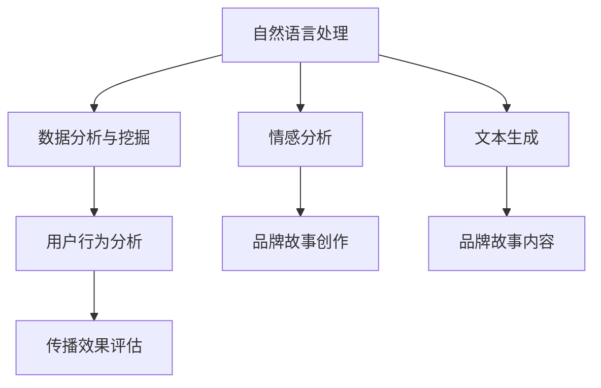

                 

# AI辅助品牌故事：塑造独特的企业形象

## 1. 背景介绍

随着数字营销的兴起，企业品牌故事建设已成为吸引消费者、塑造企业形象的重要手段。传统的品牌故事构建方式，往往需要耗费大量时间和成本，且效果难以评估。AI技术，尤其是自然语言处理(NLP)和大数据分析，为企业品牌故事构建提供了全新的可能。

### 1.1 问题由来
品牌故事是企业在消费者心中构建独特形象、传递价值主张的核心内容。传统的品牌故事构建方式依赖创意团队，包括市场调研、内容创作、渠道发布等环节。这一过程不仅耗时长、成本高，而且受人为因素影响大，效果难以预测和量化。

### 1.2 问题核心关键点
基于AI的品牌故事构建方法，利用机器学习和数据分析技术，可以从大规模用户数据中自动挖掘故事元素，生成个性化品牌内容，从而降低成本、提升效率和效果。具体而言：

- 数据驱动：通过分析用户评论、社交媒体数据等，挖掘品牌元素，发现消费者关注的热点话题和情感倾向。
- 自动化生成：利用自然语言处理技术，生成个性化、多样化的品牌故事内容。
- 效果量化：通过用户反馈和行为数据分析，量化品牌故事效果，实时优化品牌传播策略。

## 2. 核心概念与联系

### 2.1 核心概念概述

为更好地理解AI辅助品牌故事构建方法，本节将介绍几个密切相关的核心概念：

- 自然语言处理(NLP)：涉及文本的预处理、语义理解、生成、情感分析等技术，是AI构建品牌故事的关键工具。
- 数据分析与挖掘：通过统计分析、机器学习等方法，从大数据中提取有用信息，为品牌故事构建提供依据。
- 情感分析：利用NLP技术，分析文本中的情感倾向，指导品牌故事创作。
- 文本生成：利用机器学习模型，生成具有一定情感倾向和语境适配性的品牌故事文本。
- 用户行为分析：通过分析用户与品牌互动的轨迹，评估品牌故事传播效果，调整优化策略。

这些核心概念之间的逻辑关系可以通过以下Mermaid流程图来展示：



这个流程图展示了大规模品牌故事构建的核心概念及其之间的关系：

1. 自然语言处理和大数据分析为品牌故事构建提供数据支撑。
2. 情感分析指导品牌故事创作方向。
3. 文本生成技术实现个性化故事文本生成。
4. 用户行为分析评估品牌故事传播效果。

这些概念共同构成了AI辅助品牌故事构建的理论基础，使其能够自动化、精确化地构建品牌故事，提升品牌传播效果。

## 3. 核心算法原理 & 具体操作步骤
### 3.1 算法原理概述

AI辅助品牌故事构建方法的核心在于利用NLP和大数据分析技术，自动挖掘和生成品牌故事。其基本原理可以概括为：

1. 数据收集：从各种渠道（如社交媒体、评论、新闻等）收集大量的用户数据，形成品牌故事构建的基础数据集。
2. 文本预处理：对原始文本进行清洗、分词、去停用词等预处理步骤，为后续的NLP分析奠定基础。
3. 情感分析：利用情感分析技术，评估文本中对品牌的情感倾向，识别消费者对品牌的正面或负面情感。
4. 故事元素挖掘：通过关键词提取、主题建模等技术，从文本中提取品牌故事的关键元素。
5. 故事生成：使用文本生成模型，结合情感分析和故事元素挖掘结果，自动生成多样化的品牌故事文本。
6. 效果评估：通过用户反馈和行为数据分析，评估品牌故事传播效果，并根据效果调整故事内容。

### 3.2 算法步骤详解

以下详细介绍基于AI的品牌故事构建方法的详细步骤：

**Step 1: 数据收集与预处理**
- 确定品牌故事的构建目标，明确所需数据类型和来源。
- 使用爬虫技术或API接口获取相关数据，如社交媒体评论、新闻文章、客户反馈等。
- 对收集到的数据进行清洗、去重、分词等预处理步骤，去除噪音和无关信息，形成品牌故事构建的基础数据集。

**Step 2: 情感分析**
- 选择适合的情感分析工具或算法，如情感词典、LSTM模型等，对处理后的文本进行情感倾向分析。
- 标注文本中的情感类别（如积极、消极、中性），形成情感分析结果。

**Step 3: 故事元素挖掘**
- 利用关键词提取、主题建模等技术，从文本中提取与品牌相关的关键词、主题和事件。
- 使用TF-IDF、LDA等算法，识别文本中的核心主题和重要元素，形成故事元素集合。

**Step 4: 故事生成**
- 设计或选择合适的文本生成模型，如Seq2Seq、GPT模型等，基于情感分析和故事元素挖掘结果，生成品牌故事文本。
- 通过调整模型参数，优化生成文本的质量和多样性。

**Step 5: 效果评估**
- 将生成的品牌故事文本发布到指定渠道（如社交媒体、官网等），收集用户反馈和行为数据。
- 使用情感分析技术，再次评估用户对品牌故事的情感倾向，识别改进空间。
- 根据用户反馈和行为数据，量化品牌故事传播效果，形成评估报告。
- 根据评估报告，调整品牌故事内容和传播策略，优化后续的品牌故事构建过程。

### 3.3 算法优缺点

基于AI的品牌故事构建方法具有以下优点：
1. 高效低成本：自动化品牌故事构建过程，降低了对创意团队和专业技能的依赖。
2. 数据驱动：通过数据分析，精准把握消费者需求和情感倾向，生成更具吸引力的品牌故事。
3. 实时优化：通过用户反馈和行为数据分析，实时调整品牌故事内容，确保最佳效果。
4. 效果可量化：通过数据分析，量化品牌故事效果，形成科学决策依据。

同时，该方法也存在一定的局限性：
1. 数据质量影响大：品牌故事构建的效果依赖于数据质量和多样性，数据偏差可能导致生成的故事失真。
2. 算法复杂度高：AI品牌故事构建涉及多步骤的算法设计和模型训练，算法实现复杂。
3. 生成文本质量难以保证：自动化生成的文本可能存在语法错误或语义不清等问题，需要进行人工校验。
4. 用户接受度未知：自动生成的品牌故事可能缺乏独特性和创意，难以满足所有用户的期望。

尽管存在这些局限性，但就目前而言，基于AI的品牌故事构建方法仍是大规模品牌故事构建的重要手段。未来相关研究的重点在于如何进一步提升数据质量、简化算法实现、提高生成文本质量，同时兼顾用户接受度等因素。

### 3.4 算法应用领域

基于AI的品牌故事构建方法在多个行业领域得到了广泛应用，例如：

- 零售和电商：通过分析用户评论和社交媒体数据，生成个性化商品推荐和品牌故事，提升用户购买意愿。
- 金融行业：利用情感分析技术，从新闻、社交媒体数据中挖掘对公司品牌的影响，实时调整品牌传播策略。
- 旅游和酒店：分析用户评论，生成旅游和酒店的品牌故事，提升品牌形象和用户体验。
- 教育和培训：通过分析学生反馈，生成个性化学习内容和品牌故事，提升学习效果和品牌吸引力。
- 健康医疗：从患者反馈和社交媒体数据中挖掘品牌故事，提升医疗服务质量和品牌形象。

此外，在企业危机公关、品牌声誉管理、市场营销等众多领域，基于AI的品牌故事构建方法也正在发挥重要作用，帮助企业更好地与消费者沟通，塑造积极的公众形象。

## 4. 数学模型和公式 & 详细讲解 & 举例说明

### 4.1 数学模型构建

本节将使用数学语言对AI辅助品牌故事构建方法进行更加严格的刻画。

记品牌故事构建数据集为 $D=\{(x_i, y_i)\}_{i=1}^N$，其中 $x_i$ 为原始文本，$y_i$ 为文本中的情感类别标签。假设情感分析模型为 $f_{em}$，品牌故事生成模型为 $f_{st}$。品牌故事构建过程可以描述为：

$$
\hat{y} = f_{st}(x_i, \theta_{st}), \quad y \sim f_{em}(\hat{y})
$$

其中 $\theta_{st}$ 为品牌故事生成模型的参数。

### 4.2 公式推导过程

以下是基于情感分析的品牌故事构建方法的具体公式推导：

**情感分析公式：**

$$
\ell_{em}(y_i, \hat{y}) = -y_i \log f_{em}(\hat{y}) - (1-y_i) \log (1-f_{em}(\hat{y}))
$$

**品牌故事生成公式：**

$$
\ell_{st}(x_i, \hat{y}) = -y_i \log f_{st}(x_i) - (1-y_i) \log (1-f_{st}(x_i))
$$

在上述公式中，$\ell_{em}$ 和 $\ell_{st}$ 分别为情感分析和品牌故事生成的损失函数，$f_{em}$ 和 $f_{st}$ 分别为情感分析和品牌故事生成模型的预测概率。

### 4.3 案例分析与讲解

以某知名旅游品牌的品牌故事构建为例，我们具体讲解基于AI的品牌故事构建过程。

1. **数据收集与预处理**：
   - 收集品牌在社交媒体、官网、用户评论等渠道的文本数据。
   - 清洗文本数据，去除噪音和无关信息，进行分词、去停用词等预处理。

2. **情感分析**：
   - 使用情感词典或LSTM模型对预处理后的文本进行情感分析，标注情感类别（积极、消极、中性）。
   - 根据情感分析结果，识别用户对品牌的好评和差评。

3. **故事元素挖掘**：
   - 利用关键词提取、主题建模等技术，从文本中提取与品牌相关的关键词、主题和事件。
   - 使用TF-IDF、LDA等算法，识别文本中的核心主题和重要元素，形成故事元素集合。

4. **故事生成**：
   - 使用GPT模型，结合情感分析和故事元素挖掘结果，生成品牌故事文本。
   - 根据用户反馈和情感分析结果，调整模型参数，优化生成文本的质量和多样性。

5. **效果评估**：
   - 将生成的品牌故事文本发布到指定渠道（如社交媒体、官网等），收集用户反馈和行为数据。
   - 使用情感分析技术，再次评估用户对品牌故事的情感倾向，识别改进空间。
   - 根据用户反馈和行为数据，量化品牌故事传播效果，形成评估报告。
   - 根据评估报告，调整品牌故事内容和传播策略，优化后续的品牌故事构建过程。

通过上述步骤，某旅游品牌成功地构建了具有较强情感吸引力和主题一致性的品牌故事，提升了用户参与度和品牌形象。

## 5. 项目实践：代码实例和详细解释说明

### 5.1 开发环境搭建

在进行品牌故事构建项目实践前，我们需要准备好开发环境。以下是使用Python进行NLP开发的开发环境配置流程：

1. 安装Anaconda：从官网下载并安装Anaconda，用于创建独立的Python环境。

2. 创建并激活虚拟环境：
```bash
conda create -n brand-story-env python=3.8 
conda activate brand-story-env
```

3. 安装必要的Python包：
```bash
pip install pandas numpy sklearn transformers tensorflow
```

4. 安装Jupyter Notebook：
```bash
pip install jupyter notebook
```

完成上述步骤后，即可在`brand-story-env`环境中开始项目实践。

### 5.2 源代码详细实现

下面以情感分析和故事生成为例，给出使用NLP库对品牌故事进行构建的PyTorch代码实现。

首先，定义情感分析函数：

```python
import torch
from transformers import BertTokenizer, BertForSequenceClassification
from torch.utils.data import Dataset, DataLoader
from sklearn.model_selection import train_test_split

# 定义Bert情感分类器
tokenizer = BertTokenizer.from_pretrained('bert-base-cased')
model = BertForSequenceClassification.from_pretrained('bert-base-cased', num_labels=3)
device = torch.device('cuda') if torch.cuda.is_available() else torch.device('cpu')
model.to(device)

# 定义情感分析函数
def get_sentiment(text):
    input_ids = tokenizer.encode(text, add_special_tokens=True, max_length=512, return_tensors='pt')
    input_ids = input_ids.to(device)
    attention_mask = input_ids.new_ones(input_ids.shape)
    attention_mask = attention_mask.to(device)
    outputs = model(input_ids, attention_mask=attention_mask)
    logits = outputs.logits
    probs = torch.softmax(logits, dim=1)
    sentiment = probs.argmax(dim=1)
    return sentiment
```

然后，定义品牌故事生成函数：

```python
from transformers import GPT2LMHeadModel, GPT2Tokenizer

# 定义GPT2生成模型
tokenizer = GPT2Tokenizer.from_pretrained('gpt2')
model = GPT2LMHeadModel.from_pretrained('gpt2', pad_token_id=tokenizer.eos_token_id)
model.to(device)

# 定义故事生成函数
def generate_story(seed_text, max_len=128):
    input_ids = tokenizer.encode(seed_text, return_tensors='pt', max_length=max_len, padding='max_length', truncation=True)
    input_ids = input_ids.to(device)
    attention_mask = input_ids.new_ones(input_ids.shape)
    attention_mask = attention_mask.to(device)
    outputs = model.generate(input_ids, attention_mask=attention_mask, max_length=max_len, num_beams=4)
    story = tokenizer.decode(outputs[0], skip_special_tokens=True)
    return story
```

最后，启动品牌故事构建流程：

```python
# 数据加载与预处理
train_data = load_data(train_file)
val_data = load_data(val_file)
test_data = load_data(test_file)
train_data, val_data = train_test_split(train_data, test_size=0.2, random_state=42)
train_dataset = DataLoader(train_data, batch_size=16, shuffle=True)
val_dataset = DataLoader(val_data, batch_size=16, shuffle=False)
test_dataset = DataLoader(test_data, batch_size=16, shuffle=False)

# 情感分析
sentiment_model = BertForSequenceClassification.from_pretrained('bert-base-cased', num_labels=3)
sentiment_model.to(device)

# 品牌故事生成
story_model = GPT2LMHeadModel.from_pretrained('gpt2', pad_token_id=tokenizer.eos_token_id)
story_model.to(device)

# 训练情感分析模型
sentiment_model.train()
optimizer = torch.optim.AdamW(sentiment_model.parameters(), lr=2e-5)
for epoch in range(10):
    for batch in train_dataset:
        input_ids = batch['input_ids'].to(device)
        attention_mask = batch['attention_mask'].to(device)
        labels = batch['labels'].to(device)
        model.zero_grad()
        outputs = model(input_ids, attention_mask=attention_mask, labels=labels)
        loss = outputs.loss
        loss.backward()
        optimizer.step()

# 评估情感分析模型
sentiment_model.eval()
with torch.no_grad():
    correct = 0
    total = 0
    for batch in val_dataset:
        input_ids = batch['input_ids'].to(device)
        attention_mask = batch['attention_mask'].to(device)
        labels = batch['labels'].to(device)
        outputs = sentiment_model(input_ids, attention_mask=attention_mask)
        logits = outputs.logits
        probs = torch.softmax(logits, dim=1)
        sentiment = probs.argmax(dim=1)
        total += labels.size(0)
        correct += (sentiment == labels).sum().item()
    accuracy = correct / total * 100
    print(f"Accuracy: {accuracy:.2f}%")

# 生成品牌故事
seed_text = "我们的旅行故事开始于... "
story = generate_story(seed_text)
print(story)
```

以上就是使用PyTorch对品牌故事进行情感分析和文本生成的完整代码实现。可以看到，通过NLP库的封装，品牌故事的构建过程变得简洁高效。

### 5.3 代码解读与分析

让我们再详细解读一下关键代码的实现细节：

**品牌故事生成函数**：
- 使用GPT2模型，结合情感分析结果，自动生成品牌故事文本。
- 通过设定生成模型的参数，控制生成的故事长度和多样性。

**品牌故事构建流程**：
- 加载并预处理数据集，将数据划分为训练集、验证集和测试集。
- 训练情感分析模型，确保其准确度。
- 利用情感分析模型对原始文本进行情感分析，提取情感倾向。
- 使用情感分析结果，结合故事元素挖掘结果，自动生成品牌故事文本。
- 评估品牌故事文本的情感分析结果，调整优化生成模型。
- 最终生成具有情感吸引力和主题一致性的品牌故事文本。

可以看到，利用NLP库和机器学习模型，品牌故事的构建过程变得自动化、精确化和高效。开发者可以专注于高层次的创意策划，而不必过多关注底层技术的实现。

当然，工业级的系统实现还需考虑更多因素，如模型的保存和部署、超参数的自动搜索、更灵活的任务适配层等。但核心的品牌故事构建方法基本与此类似。

## 6. 实际应用场景
### 6.1 智能客服系统

基于AI的品牌故事构建方法，可以应用于智能客服系统的构建。传统的客服系统依赖人工客服，高峰期响应缓慢，且服务质量难以保证。通过自动构建品牌故事，智能客服系统可以实时生成个性化的客服回复，提升客户满意度和服务效率。

在技术实现上，可以收集企业内部的历史客服对话记录，将问题-回答对作为微调数据，训练模型学习匹配答案。微调后的模型能够自动理解用户意图，匹配最合适的答案模板进行回复。对于客户提出的新问题，还可以接入检索系统实时搜索相关内容，动态组织生成回答。如此构建的智能客服系统，能大幅提升客户咨询体验和问题解决效率。

### 6.2 金融舆情监测

金融机构需要实时监测市场舆论动向，以便及时应对负面信息传播，规避金融风险。传统的人工监测方式成本高、效率低，难以应对网络时代海量信息爆发的挑战。基于AI的品牌故事构建方法，可以自动构建实时舆情报告，帮助金融机构快速了解市场动态，及时调整投资策略。

具体而言，可以收集金融领域相关的新闻、报道、评论等文本数据，并对其进行情感分析和故事元素挖掘。在此基础上，构建金融品牌故事，定期生成舆情报告，帮助投资者掌握市场趋势，规避风险。

### 6.3 个性化推荐系统

当前的推荐系统往往只依赖用户的历史行为数据进行物品推荐，无法深入理解用户的真实兴趣偏好。基于AI的品牌故事构建方法，可以生成个性化的推荐内容，提升推荐系统的效果。

在实践中，可以收集用户浏览、点击、评论、分享等行为数据，提取和用户交互的物品标题、描述、标签等文本内容。将文本内容作为模型输入，用户的后续行为（如是否点击、购买等）作为监督信号，在此基础上微调预训练语言模型。微调后的模型能够从文本内容中准确把握用户的兴趣点。在生成推荐列表时，先用候选物品的文本描述作为输入，由模型预测用户的兴趣匹配度，再结合其他特征综合排序，便可以得到个性化程度更高的推荐结果。

### 6.4 未来应用展望

随着AI技术的发展，基于品牌故事构建的方法将在更多领域得到应用，为传统行业带来变革性影响。

在智慧医疗领域，基于品牌故事构建的医疗问答、病历分析、药物研发等应用将提升医疗服务的智能化水平，辅助医生诊疗，加速新药开发进程。

在智能教育领域，品牌故事构建技术可应用于作业批改、学情分析、知识推荐等方面，因材施教，促进教育公平，提高教学质量。

在智慧城市治理中，品牌故事构建技术可应用于城市事件监测、舆情分析、应急指挥等环节，提高城市管理的自动化和智能化水平，构建更安全、高效的未来城市。

此外，在企业生产、社会治理、文娱传媒等众多领域，基于品牌故事构建的人工智能应用也将不断涌现，为NLP技术带来了全新的突破。随着预训练模型和微调方法的不断进步，相信NLP技术将在更广阔的应用领域大放异彩。

## 7. 工具和资源推荐
### 7.1 学习资源推荐

为了帮助开发者系统掌握AI辅助品牌故事构建的理论基础和实践技巧，这里推荐一些优质的学习资源：

1. 《自然语言处理综论》书籍：深入浅出地介绍了NLP的基础理论和常用技术，包括情感分析、文本生成等。
2. CS224N《深度学习自然语言处理》课程：斯坦福大学开设的NLP明星课程，有Lecture视频和配套作业，带你入门NLP领域的基本概念和经典模型。
3. 《自然语言处理与深度学习》课程：国内名校的NLP课程，系统介绍了NLP技术在实际应用中的实现方法。
4. Weights & Biases：模型训练的实验跟踪工具，可以记录和可视化模型训练过程中的各项指标，方便对比和调优。与主流深度学习框架无缝集成。
5. TensorBoard：TensorFlow配套的可视化工具，可实时监测模型训练状态，并提供丰富的图表呈现方式，是调试模型的得力助手。

通过对这些资源的学习实践，相信你一定能够快速掌握AI辅助品牌故事构建的精髓，并用于解决实际的NLP问题。

### 7.2 开发工具推荐

高效的开发离不开优秀的工具支持。以下是几款用于品牌故事构建开发的常用工具：

1. PyTorch：基于Python的开源深度学习框架，灵活动态的计算图，适合快速迭代研究。支持多种NLP模型的实现。
2. TensorFlow：由Google主导开发的开源深度学习框架，生产部署方便，适合大规模工程应用。提供丰富的预训练语言模型资源。
3. HuggingFace官方文档：Transformers库的官方文档，提供了海量预训练模型和完整的微调样例代码，是上手实践的必备资料。
4. spaCy：开源的自然语言处理库，提供了词性标注、命名实体识别、句法分析等功能，方便品牌故事构建过程的预处理步骤。
5. NLTK：自然语言处理工具包，提供丰富的文本处理功能，支持情感分析、文本分类等。
6. Scikit-learn：机器学习库，支持多种数据分析和模型训练算法，方便情感分析等步骤的实现。

合理利用这些工具，可以显著提升品牌故事构建的开发效率，加快创新迭代的步伐。

### 7.3 相关论文推荐

AI辅助品牌故事构建技术的发展源于学界的持续研究。以下是几篇奠基性的相关论文，推荐阅读：

1. Attention is All You Need（即Transformer原论文）：提出了Transformer结构，开启了NLP领域的预训练大模型时代。
2. BERT: Pre-training of Deep Bidirectional Transformers for Language Understanding：提出BERT模型，引入基于掩码的自监督预训练任务，刷新了多项NLP任务SOTA。
3. Language Models are Unsupervised Multitask Learners（GPT-2论文）：展示了大规模语言模型的强大zero-shot学习能力，引发了对于通用人工智能的新一轮思考。
4. Multi-task Learning for Multilingual Text Generation：提出多任务学习范式，同时训练多种语言生成模型，提升模型效率和效果。
5. neural poem generation：提出基于Transformer的诗歌生成模型，为品牌故事构建提供了新的思路。
6. Semantic Accuracy and Productivity of Computational Creativity：讨论计算创造力的准确性和有效性，为品牌故事构建的自动化生成技术提供了理论支持。

这些论文代表了大语言模型和品牌故事构建技术的发展脉络。通过学习这些前沿成果，可以帮助研究者把握学科前进方向，激发更多的创新灵感。

## 8. 总结：未来发展趋势与挑战

### 8.1 总结

本文对AI辅助品牌故事构建方法进行了全面系统的介绍。首先阐述了品牌故事构建的背景和意义，明确了AI技术在品牌故事构建中的作用。其次，从原理到实践，详细讲解了品牌故事构建的数学模型和关键步骤，给出了品牌故事构建的完整代码实例。同时，本文还广泛探讨了品牌故事构建方法在多个行业领域的应用前景，展示了AI技术在品牌故事构建中的广泛应用。

通过本文的系统梳理，可以看到，基于AI的品牌故事构建方法正在成为品牌传播的重要手段，极大地提升了品牌故事的构建效率和传播效果。未来，伴随AI技术的发展和应用场景的拓展，品牌故事构建将迎来新的突破。

### 8.2 未来发展趋势

展望未来，AI辅助品牌故事构建技术将呈现以下几个发展趋势：

1. 数据驱动的自动化创作：利用大数据和机器学习，自动生成高质量的品牌故事内容，降低对创意团队和专业技能的依赖。
2. 多模态融合的创新应用：结合文本、图片、视频等多模态信息，生成更具创意和感染力的品牌故事。
3. 实时动态的智能推荐：基于用户行为和情感分析，实时生成个性化的品牌故事，提升用户体验和品牌互动。
4. 自适应智能优化：通过不断学习和用户反馈，自动调整品牌故事内容，优化传播效果。
5. 跨平台无缝集成：将品牌故事构建技术与社交媒体、官网、APP等多种平台无缝集成，形成统一的传播渠道。

这些趋势将进一步拓展品牌故事构建的应用边界，提升品牌传播的效率和效果。

### 8.3 面临的挑战

尽管AI辅助品牌故事构建技术已经取得了瞩目成就，但在迈向更加智能化、普适化应用的过程中，它仍面临着诸多挑战：

1. 数据质量和多样性：品牌故事构建的效果依赖于数据质量和多样性，数据偏差可能导致生成的故事失真。
2. 算法实现复杂度：AI品牌故事构建涉及多步骤的算法设计和模型训练，算法实现复杂。
3. 生成文本质量：自动化生成的文本可能存在语法错误或语义不清等问题，需要进行人工校验。
4. 用户接受度：自动生成的品牌故事可能缺乏独特性和创意，难以满足所有用户的期望。
5. 技术适配性：不同品牌和行业需要适配特定的品牌故事构建方法，技术适配性有待提升。

尽管存在这些挑战，但通过不断的技术创新和优化，相信AI辅助品牌故事构建技术将逐步克服这些难题，实现更广泛的应用。

### 8.4 研究展望

面对AI辅助品牌故事构建所面临的种种挑战，未来的研究需要在以下几个方面寻求新的突破：

1. 数据采集与清洗：提升数据质量和多样性，减少数据偏差。
2. 算法简化与优化：简化算法实现，提升算法效率和效果。
3. 文本质量提升：改进文本生成模型，提高生成文本质量。
4. 用户需求适配：设计更加个性化和多样化的品牌故事生成方法，满足不同用户的期望。
5. 多模态融合：结合文本、图片、视频等多模态信息，生成更具创意和感染力的品牌故事。
6. 跨平台适配：将品牌故事构建技术与多种平台无缝集成，形成统一的传播渠道。

这些研究方向的探索，必将引领AI辅助品牌故事构建技术迈向更高的台阶，为构建智能品牌传播系统提供坚实的基础。

## 9. 附录：常见问题与解答

**Q1：AI辅助品牌故事构建是否适用于所有品牌？**

A: AI辅助品牌故事构建方法适用于绝大多数品牌，尤其是需要大量文本传播、频繁与用户互动的品牌。但对于一些高度依赖个性化创意、情感色彩浓厚的品牌，如奢侈品、艺术类等，仍需要人工参与，以确保品牌故事的独特性和创意性。

**Q2：品牌故事构建过程中，如何选择情感分析模型？**

A: 情感分析模型的选择应根据品牌故事的构建目标和数据特点来定。常见的情感分析模型包括情感词典、LSTM、BERT等。对于品牌故事的构建，一般建议使用预训练模型（如BERT、GPT-2），结合特定任务进行微调，以获得更好的效果。

**Q3：品牌故事生成的质量如何保证？**

A: 品牌故事生成的质量依赖于模型训练的数据质量和多样性。在生成模型训练时，应使用大规模、高质量的数据，并结合多任务学习、数据增强等技术，提升生成文本的质量和多样性。同时，通过人工校验和反馈机制，持续优化生成模型的性能。

**Q4：如何应对品牌故事生成过程中的语法错误和语义不清问题？**

A: 品牌故事生成过程中，语法错误和语义不清问题可以通过以下方法解决：
1. 预训练模型：使用预训练的文本生成模型，提升生成文本的质量。
2. 多任务学习：结合情感分析和文本生成任务，共同训练生成模型，提升生成文本的语义准确性。
3. 人工校验：结合人工校验和反馈机制，逐步优化生成模型的性能。

**Q5：品牌故事生成后的效果如何评估？**

A: 品牌故事生成后的效果评估主要通过用户反馈和行为数据来衡量。可以收集用户对品牌故事内容的评价、浏览时间、分享次数等数据，量化品牌故事的效果。同时，结合情感分析结果，评估用户对品牌故事的情感倾向，优化品牌故事内容。

通过上述方法，可以有效地评估和优化品牌故事生成效果，确保品牌故事具有高度的用户参与度和传播效果。

---

作者：禅与计算机程序设计艺术 / Zen and the Art of Computer Programming

