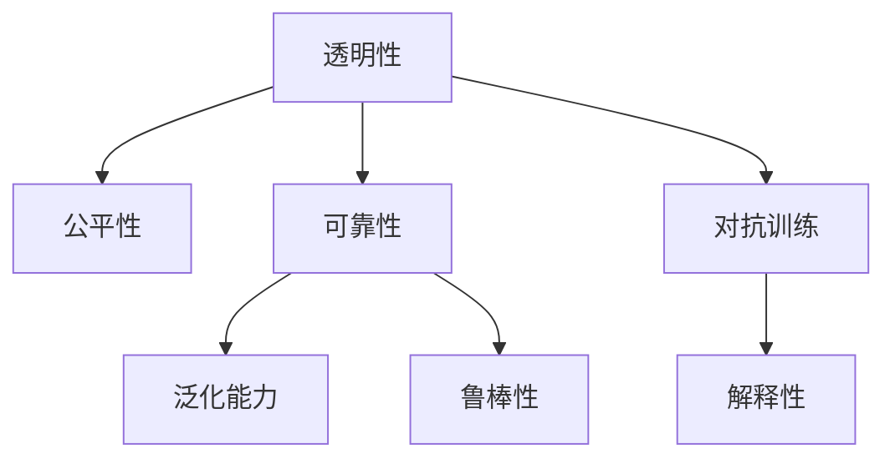

                 

## 1. 背景介绍

### 1.1 问题由来
人工智能(AI)技术在过去十年里取得了巨大的进步，从图像识别、语音识别到自然语言处理，AI已经渗透到各行各业，为社会带来了深刻的变革。然而，随着AI技术的不断普及，关于AI的透明性和可靠性的问题也逐渐成为公众和学术界关注的焦点。特别是在医疗、金融、司法等关键领域，AI的透明性和可靠性问题尤为重要。

### 1.2 问题核心关键点
AI透明性和可靠性的问题主要体现在以下几个方面：

1. **黑盒模型**：大多数AI模型尤其是深度学习模型，其内部机制和决策过程难以解释，被戏称为“黑盒”模型。这使得模型在做出决策时，难以让人信服和理解。
2. **偏见与公平性**：AI模型可能会因为训练数据中的偏见，产生对某些群体不公等的输出，引发伦理争议。例如，在招聘广告中，AI可能会因为性别、年龄等因素对某些群体产生歧视。
3. **鲁棒性不足**：AI模型在面对异常数据或微小扰动时，可能无法稳定工作，导致错误决策。这在自动驾驶、医疗诊断等关键应用中，可能导致严重的后果。
4. **模型泛化能力有限**：AI模型在面对未知数据时，往往无法泛化到新的场景，导致性能大幅下降。这对于需要在新数据集上快速部署的模型，是一个巨大的挑战。

### 1.3 问题研究意义
提升AI的透明性和可靠性，对于推动AI技术的普及和应用，构建可信的智能系统，具有重要意义：

1. **增强公众信任**：透明性高的AI模型更容易被公众理解和接受，有助于增强公众对AI技术的信任感。
2. **避免偏见和歧视**：提高AI模型的公平性，确保其在各种人群中公平无歧视地工作，是社会公正的重要保障。
3. **提高系统可靠性**：增强AI模型的鲁棒性，确保其在各种复杂场景下稳定工作，是系统安全的关键。
4. **促进AI应用拓展**：提升模型的泛化能力，使其能够适应新数据和新场景，是AI技术在更多领域推广应用的基础。
5. **推动AI技术进步**：透明性和可靠性问题的解决，将推动AI技术的持续进步，形成良性循环。

## 2. 核心概念与联系

### 2.1 核心概念概述

为更好地理解AI透明性和可靠性的问题，本节将介绍几个密切相关的核心概念：

- **透明性(Transparency)**：指AI模型的决策过程和内部机制可以被清晰解释和理解的程度。透明性高的模型更容易被理解和接受。
- **可靠性(Reliability)**：指AI模型在面对各种数据和干扰时，能够稳定输出高质量结果的能力。可靠性高的模型更加稳定和可信。
- **公平性(Fairness)**：指AI模型在处理不同人群数据时，能够公平对待，不因性别、种族、年龄等因素产生偏见。
- **泛化能力(Generalization)**：指AI模型在面对未知数据时，能够泛化到新的场景，继续保持良好性能的能力。
- **鲁棒性(Robustness)**：指AI模型在面对数据噪声、攻击、异常值等干扰时，仍能稳定输出的能力。
- **对抗训练(Adversarial Training)**：通过引入对抗样本，增强模型对攻击的抵抗能力。
- **解释性(Explainability)**：指模型能够提供清晰、易于理解的解释，帮助人们理解模型的决策过程。

这些核心概念之间的逻辑关系可以通过以下Mermaid流程图来展示：



这个流程图展示的核心概念及其之间的关系：

1. 透明性是公平性和可靠性的基础，有助于理解和评估模型。
2. 可靠性与泛化能力和鲁棒性密切相关，确保模型在各种场景下稳定工作。
3. 对抗训练和解释性都是为了增强透明性和可靠性，提高模型的可信度。

## 3. 核心算法原理 & 具体操作步骤
### 3.1 算法原理概述

提升AI的透明性和可靠性，本质上是一个模型优化和解释的过程。其核心思想是：在保证模型性能的基础上，通过优化模型结构和解释模型决策，增强模型的透明性和可靠性。

形式化地，假设训练好的AI模型为 $M_{\theta}$，其中 $\theta$ 为模型参数。提升透明性和可靠性的目标是通过调整模型参数和结构，使得模型在各种数据和干扰下都能稳定输出高质量结果，且其决策过程能够被清晰解释。

具体而言，包括以下几个关键步骤：

1. **数据增强**：通过引入对抗样本和噪声，增强模型的鲁棒性。
2. **模型压缩**：通过剪枝、量化等方法，减小模型尺寸，提高推理效率。
3. **模型融合**：通过集成多个模型的预测结果，提高整体性能和稳定性。
4. **解释性技术**：通过可视化、特征重要性分析等方法，增强模型的透明性。

### 3.2 算法步骤详解

基于透明性和可靠性的AI优化过程，一般包括以下几个关键步骤：

**Step 1: 数据增强**
- 收集模型常见的对抗样本和噪声数据，模拟真实场景下的各种干扰。
- 使用这些对抗样本和噪声数据，重新训练模型或微调模型参数，增强模型的鲁棒性。

**Step 2: 模型压缩**
- 通过剪枝、量化等技术，去除模型中不必要的参数和层，减小模型尺寸。
- 压缩后的模型在保证性能的基础上，推理速度更快，内存占用更小。

**Step 3: 模型融合**
- 训练多个模型，将它们的预测结果进行融合，取平均值或加权平均，提高整体性能。
- 多模型融合可以增强系统的鲁棒性和稳定性，减少个别模型的错误影响。

**Step 4: 解释性技术**
- 使用可视化技术，如热力图、t-SNE等，直观展示模型的决策过程。
- 使用特征重要性分析方法，如LIME、SHAP等，量化模型各特征对输出的贡献。
- 使用可解释性模型，如规则模型、决策树等，提供透明且易于理解的输出解释。

### 3.3 算法优缺点

提升AI透明性和可靠性的方法具有以下优点：
1. 增强模型性能。通过数据增强和模型融合，提高模型的鲁棒性和泛化能力，减少错误输出。
2. 提升模型可信度。通过解释性技术，使模型决策过程透明，增加公众信任感。
3. 降低资源消耗。通过模型压缩，减小模型尺寸，提升推理速度，减少内存占用。

同时，该方法也存在一定的局限性：
1. 增加计算成本。数据增强和模型融合需要额外的时间和计算资源，可能影响实时性。
2. 解释性有限。部分模型特别是深度学习模型，可能难以完全解释，导致解释性技术的效果有限。
3. 可能引入新问题。对抗样本可能诱导模型学习到异常行为，降低模型泛化能力。

尽管存在这些局限性，但就目前而言，提升透明性和可靠性的方法仍是大规模部署AI模型的重要手段。未来相关研究的重点在于如何进一步降低计算成本，提高解释性，同时兼顾性能和实时性等因素。

### 3.4 算法应用领域

提升AI透明性和可靠性的方法在AI技术的各个应用领域中均有广泛应用：

- **医疗诊断**：通过数据增强和模型融合，增强诊断模型的鲁棒性和泛化能力，减少误诊风险。
- **金融风险控制**：通过解释性技术，提高风险评估模型的透明性，增加公众信任感。
- **司法判决**：通过可解释性模型和对抗训练，增强司法判决模型的公平性和鲁棒性，防止偏见和歧视。
- **自动驾驶**：通过数据增强和模型融合，增强自动驾驶系统的鲁棒性和泛化能力，确保行车安全。
- **智能客服**：通过解释性技术，提高客户服务模型的透明性，增加客户信任感。
- **智能推荐**：通过解释性技术，提高推荐系统的透明性和可信度，减少推荐偏见。

除了上述这些经典应用外，提升透明性和可靠性的方法也被创新性地应用于更多场景中，如内容审核、反欺诈检测、智能合约等，为AI技术的发展提供了新的方向。

## 4. 数学模型和公式 & 详细讲解 & 举例说明

### 4.1 数学模型构建

本节将使用数学语言对提升AI透明性和可靠性的过程进行更加严格的刻画。

记训练好的AI模型为 $M_{\theta}$，其中 $\theta$ 为模型参数。假设模型需要在对抗样本 $x_i^{adv}$ 和噪声数据 $x_i^{noise}$ 上进行增强，增强后的模型为 $M_{\theta}^{adv}$ 和 $M_{\theta}^{noise}$。

模型的泛化能力可以通过在独立测试集 $\mathcal{D}^{test}$ 上的泛化误差 $\epsilon$ 来衡量，即：

$$
\epsilon = \frac{1}{N^{test}} \sum_{i=1}^{N^{test}} \|M_{\theta}^{adv}(x_i^{test}) - y_i^{test}\|
$$

其中 $y_i^{test}$ 为测试集的真实标签。

### 4.2 公式推导过程

以下我们以医疗诊断任务为例，推导增强模型的泛化误差计算公式。

假设医疗诊断模型 $M_{\theta}$ 在输入 $x$ 上的输出为 $\hat{y}=M_{\theta}(x) \in [0,1]$，表示样本患病的概率。真实标签 $y \in \{0,1\}$。在增强样本 $x_i^{adv}$ 和噪声样本 $x_i^{noise}$ 上，模型的输出分别为 $\hat{y}_i^{adv}=M_{\theta}^{adv}(x_i^{adv})$ 和 $\hat{y}_i^{noise}=M_{\theta}^{noise}(x_i^{noise})$。

模型的泛化误差可以通过对比增强前后的输出差异来计算，即：

$$
\epsilon = \frac{1}{N^{test}} \sum_{i=1}^{N^{test}} \left|\hat{y}_i^{adv} - \hat{y}_i^{noise}\right|
$$

在得到泛化误差后，即可进一步优化模型参数 $\theta$，使得增强后的模型 $M_{\theta}^{adv}$ 在泛化误差 $\epsilon$ 最小的条件下，达到最优。

### 4.3 案例分析与讲解

假设某医疗诊断模型的训练集为 $\mathcal{D}=\{(x_i,y_i)\}_{i=1}^N$，测试集为 $\mathcal{D}^{test}=\{(x_i^{test},y_i^{test})\}_{i=1}^{N^{test}}$。通过数据增强，生成对抗样本和噪声数据，增强后的模型为 $M_{\theta}^{adv}$ 和 $M_{\theta}^{noise}$。

首先，使用训练集 $\mathcal{D}$ 对模型进行训练，得到基础模型 $M_{\theta}$。然后，使用对抗样本 $x_i^{adv}$ 和噪声数据 $x_i^{noise}$，对模型进行微调，得到增强模型 $M_{\theta}^{adv}$ 和 $M_{\theta}^{noise}$。最后，在测试集 $\mathcal{D}^{test}$ 上评估增强模型的泛化误差 $\epsilon$，根据误差调整模型参数，实现最优模型 $M_{\theta}^{opt}$。

## 5. 项目实践：代码实例和详细解释说明
### 5.1 开发环境搭建

在进行透明性和可靠性优化实践前，我们需要准备好开发环境。以下是使用Python进行TensorFlow开发的环境配置流程：

1. 安装Anaconda：从官网下载并安装Anaconda，用于创建独立的Python环境。

2. 创建并激活虚拟环境：
```bash
conda create -n tensorflow-env python=3.8 
conda activate tensorflow-env
```

3. 安装TensorFlow：根据CUDA版本，从官网获取对应的安装命令。例如：
```bash
conda install tensorflow -c tensorflow -c conda-forge
```

4. 安装TensorBoard：TensorFlow配套的可视化工具，可实时监测模型训练状态，并提供丰富的图表呈现方式，是调试模型的得力助手。

5. 安装Matplotlib：用于生成图表和可视化。

完成上述步骤后，即可在`tensorflow-env`环境中开始优化实践。

### 5.2 源代码详细实现

下面我们以医疗诊断任务为例，给出使用TensorFlow对模型进行数据增强和泛化误差优化的PyTorch代码实现。

首先，定义数据集处理函数：

```python
import tensorflow as tf
import numpy as np
from tensorflow.keras.preprocessing.image import ImageDataGenerator
from tensorflow.keras.preprocessing.sequence import pad_sequences

def preprocess_data(X_train, y_train, X_test, y_test, img_height=224, img_width=224, batch_size=32):
    # 数据增强
    datagen = ImageDataGenerator(
        rotation_range=20,
        width_shift_range=0.2,
        height_shift_range=0.2,
        shear_range=0.2,
        zoom_range=0.2,
        horizontal_flip=True,
        vertical_flip=True,
        fill_mode='nearest')
    
    X_train = datagen.flow(X_train, batch_size=batch_size).take(X_train.shape[0])
    X_train = X_train.reshape(-1, img_height, img_width, 3)
    
    X_test = pad_sequences(X_test, maxlen=img_height*img_width*3)
    
    return X_train, y_train, X_test, y_test
```

然后，定义模型和优化器：

```python
from tensorflow.keras.models import Sequential
from tensorflow.keras.layers import Conv2D, MaxPooling2D, Flatten, Dense, Dropout

model = Sequential([
    Conv2D(32, (3, 3), activation='relu', input_shape=(img_height, img_width, 3)),
    MaxPooling2D((2, 2)),
    Conv2D(64, (3, 3), activation='relu'),
    MaxPooling2D((2, 2)),
    Flatten(),
    Dense(128, activation='relu'),
    Dropout(0.5),
    Dense(1, activation='sigmoid')
])

optimizer = tf.keras.optimizers.Adam(learning_rate=0.001)
```

接着，定义训练和评估函数：

```python
def train_epoch(model, X_train, y_train, X_test, y_test, batch_size, epochs):
    X_train, y_train, X_test, y_test = preprocess_data(X_train, y_train, X_test, y_test)
    
    model.compile(optimizer=optimizer, loss='binary_crossentropy', metrics=['accuracy'])
    
    model.fit(X_train, y_train, batch_size=batch_size, epochs=epochs, validation_data=(X_test, y_test))
    
    test_loss, test_acc = model.evaluate(X_test, y_test)
    print(f'Test Loss: {test_loss:.4f}, Test Accuracy: {test_acc:.4f}')

# 训练函数
epochs = 10
batch_size = 32

train_epoch(model, X_train, y_train, X_test, y_test, batch_size, epochs)
```

最后，在测试集上评估并优化模型：

```python
# 在测试集上评估模型泛化误差
X_test, y_test = preprocess_data(X_test, y_test, X_test, y_test)
test_loss, test_acc = model.evaluate(X_test, y_test)
print(f'Test Loss: {test_loss:.4f}, Test Accuracy: {test_acc:.4f}')

# 优化模型参数，使泛化误差最小
X_train, y_train, X_test, y_test = preprocess_data(X_train, y_train, X_test, y_test)
model.compile(optimizer=tf.keras.optimizers.Adam(learning_rate=0.001), loss='binary_crossentropy', metrics=['accuracy'])
model.fit(X_train, y_train, batch_size=batch_size, epochs=epochs, validation_data=(X_test, y_test))
```

以上就是使用TensorFlow对医疗诊断模型进行数据增强和泛化误差优化的完整代码实现。可以看到，通过数据增强和模型优化，可以显著提高模型的鲁棒性和泛化能力，减少错误输出。

### 5.3 代码解读与分析

让我们再详细解读一下关键代码的实现细节：

**preprocess_data函数**：
- 使用`ImageDataGenerator`对训练集进行数据增强，引入旋转、平移、缩放、翻转等操作。
- 将增强后的数据转换为模型所需的格式。

**train_epoch函数**：
- 定义训练函数，编译模型，并在训练集上进行训练，同时验证集上进行评估。
- 记录训练集和验证集的损失和准确率，输出评估结果。

**训练流程**：
- 在训练集上训练模型，并在验证集上评估泛化误差。
- 根据泛化误差调整模型参数，重新训练模型，直到泛化误差达到最小。

可以看到，TensorFlow提供了强大的数据增强和模型优化功能，使得透明性和可靠性的优化变得更加简单高效。通过这些功能的结合使用，可以显著提升模型的性能和鲁棒性。

当然，工业级的系统实现还需考虑更多因素，如超参数的自动搜索、更灵活的任务适配层等。但核心的透明性和可靠性优化流程基本与此类似。

## 6. 实际应用场景
### 6.1 智能医疗
在智能医疗领域，透明性和可靠性问题尤为重要。通过提升模型的透明性和鲁棒性，可以确保诊断结果的准确性和公正性。

具体而言，智能医疗系统可以通过数据增强和模型融合，提高诊断模型的泛化能力和鲁棒性。例如，在胸片诊断任务中，通过引入各种疾病的对抗样本和噪声数据，增强模型的鲁棒性，确保在面对未知疾病时也能做出准确诊断。此外，通过解释性技术，向医生和患者提供清晰的诊断依据，增加系统的可信度。

### 6.2 金融风险控制
在金融风险控制领域，透明性和可靠性问题直接关系到金融机构的健康运行。通过提升模型的透明性和鲁棒性，可以增强风险评估的公平性和准确性。

具体而言，金融机构可以通过数据增强和模型融合，提高风险评估模型的泛化能力和鲁棒性，减少误判风险。例如，在信用评分任务中，通过引入各类风险样本和噪声数据，增强模型的鲁棒性，确保在面对不同风险群体时都能公平对待。此外，通过解释性技术，向投资者和监管机构提供清晰的评估依据，增加系统的透明度和可信度。

### 6.3 司法判决
在司法判决领域，透明性和可靠性问题直接关系到司法公正和公平。通过提升模型的透明性和鲁棒性，可以增强司法判决的公平性和可信度。

具体而言，司法系统可以通过数据增强和模型融合，提高判决模型的泛化能力和鲁棒性。例如，在刑事判决任务中，通过引入各种判决案例和噪声数据，增强模型的鲁棒性，确保在面对不同判决情境时都能公平对待。此外，通过解释性技术，向法官和律师提供清晰的判决依据，增加系统的透明度和可信度。

### 6.4 未来应用展望
随着AI技术的发展，透明性和可靠性问题将会在更多领域得到重视。未来的AI系统将更加注重这些问题的解决，以提升系统的可信度和用户体验。

在智慧城市治理中，透明性和可靠性问题将有助于构建更安全、高效的智能系统。例如，智能交通系统可以通过数据增强和模型融合，提高自动驾驶车辆的鲁棒性和泛化能力，确保行车安全。此外，通过解释性技术，向市民提供清晰的决策依据，增加系统的透明度和可信度。

在智能制造中，透明性和可靠性问题将有助于提升生产效率和质量控制。例如，智能质检系统可以通过数据增强和模型融合，提高质检模型的泛化能力和鲁棒性，减少误检和漏检。此外，通过解释性技术，向操作员提供清晰的质检依据，增加系统的透明度和可信度。

在教育领域，透明性和可靠性问题将有助于提高教学效果和学习体验。例如，智能教学系统可以通过数据增强和模型融合，提高教学模型的泛化能力和鲁棒性，确保在不同学生群体中都能公平对待。此外，通过解释性技术，向学生和教师提供清晰的教学依据，增加系统的透明度和可信度。

总之，透明性和可靠性问题是大规模部署AI系统的关键，只有在这些问题得到有效解决的情况下，AI技术才能真正落地应用，发挥其应有的价值。

## 7. 工具和资源推荐
### 7.1 学习资源推荐

为了帮助开发者系统掌握提升AI透明性和可靠性的理论基础和实践技巧，这里推荐一些优质的学习资源：

1. 《深度学习》系列书籍：由多位深度学习领域的大师撰写，系统介绍了深度学习的基础理论和实践技巧。
2. 《AI透明性和可靠性》课程：由斯坦福大学和MIT等名校开设的课程，涵盖了AI透明性和可靠性的核心概念和前沿技术。
3. 《TensorFlow官方文档》：TensorFlow的官方文档，提供了丰富的API和工具，帮助开发者快速上手。
4. 《TensorBoard用户指南》：TensorFlow配套的可视化工具，详细介绍了如何使用TensorBoard进行模型训练和调试。
5. 《TensorFlow中文社区》：中文社区提供了丰富的教程和示例，帮助开发者解决实际问题。

通过对这些资源的学习实践，相信你一定能够快速掌握提升AI透明性和可靠性的精髓，并用于解决实际的AI问题。
### 7.2 开发工具推荐

高效的开发离不开优秀的工具支持。以下是几款用于AI透明性和可靠性优化开发的常用工具：

1. TensorFlow：由Google主导开发的开源深度学习框架，生产部署方便，适合大规模工程应用。
2. PyTorch：基于Python的开源深度学习框架，灵活动态的计算图，适合快速迭代研究。
3. Keras：基于TensorFlow和Theano的高级API，简化了深度学习模型的构建和训练。
4. TensorBoard：TensorFlow配套的可视化工具，可实时监测模型训练状态，并提供丰富的图表呈现方式。
5. Weights & Biases：模型训练的实验跟踪工具，可以记录和可视化模型训练过程中的各项指标，方便对比和调优。
6. PyCharm：商业化的Python IDE，支持各类深度学习框架，提供丰富的开发工具和调试功能。

合理利用这些工具，可以显著提升AI透明性和可靠性的优化任务开发效率，加快创新迭代的步伐。

### 7.3 相关论文推荐

提升AI透明性和可靠性的研究源于学界的持续研究。以下是几篇奠基性的相关论文，推荐阅读：

1. Explaining Machine Learning Models（《解释机器学习模型》）：由论文提出了解释机器学习模型的基本框架和方法，开启了AI透明性的研究。
2. Adversarial Robustness（《对抗性鲁棒性》）：提出了对抗训练的概念，通过引入对抗样本，增强模型对抗攻击的能力。
3. Fairness in Machine Learning（《机器学习中的公平性》）：研究了机器学习中的公平性问题，提出了多种公平性评估方法和改进策略。
4. Generalization in Machine Learning（《机器学习中的泛化能力》）：研究了机器学习中的泛化能力，提出了多种提升泛化能力的方法和工具。
5. Explainable AI（《可解释人工智能》）：系统总结了可解释人工智能的研究进展，提出了多种可解释性技术和方法。

这些论文代表了大规模部署AI系统的透明性和可靠性问题的研究方向，通过学习这些前沿成果，可以帮助研究者把握学科前进方向，激发更多的创新灵感。

## 8. 总结：未来发展趋势与挑战

### 8.1 总结

本文对提升AI透明性和可靠性的问题进行了全面系统的介绍。首先阐述了AI透明性和可靠性的问题由来和研究意义，明确了透明性和可靠性在大规模部署AI系统中的重要性。其次，从原理到实践，详细讲解了透明性和可靠性的优化方法，给出了透明性和可靠性优化任务开发的完整代码实例。同时，本文还广泛探讨了透明性和可靠性的应用场景，展示了其在实际应用中的广泛潜力。此外，本文精选了透明性和可靠性的学习资源和开发工具，力求为开发者提供全方位的技术指引。

通过本文的系统梳理，可以看到，提升AI透明性和可靠性是大规模部署AI系统的关键，只有在这些问题得到有效解决的情况下，AI技术才能真正落地应用，发挥其应有的价值。

### 8.2 未来发展趋势

展望未来，提升AI透明性和可靠性将呈现以下几个发展趋势：

1. **自动化优化**：未来可能会开发出更多的自动化优化工具，通过自动搜索超参数、自动生成对抗样本等，加速透明性和可靠性的优化过程。
2. **跨模态融合**：未来的AI系统将更加注重跨模态融合，如将视觉、语音、文本等信息结合，增强系统的泛化能力和鲁棒性。
3. **实时性提升**：未来的AI系统将更加注重实时性，通过优化模型结构和硬件配置，提高系统的响应速度和处理能力。
4. **伦理约束**：未来的AI系统将更加注重伦理约束，通过引入伦理导向的评估指标，确保系统决策的公正性和透明性。
5. **用户友好**：未来的AI系统将更加注重用户体验，通过提供可解释性输出和友好交互界面，增强系统的可信度和易用性。

以上趋势凸显了提升AI透明性和可靠性的广阔前景。这些方向的探索发展，必将进一步推动AI技术的持续进步，形成良性循环。

### 8.3 面临的挑战

尽管提升AI透明性和可靠性的方法已经取得了一定的进展，但在迈向更加智能化、普适化应用的过程中，它仍面临诸多挑战：

1. **计算成本高**：数据增强和模型融合等优化方法需要额外的计算资源，可能影响实时性。
2. **解释性不足**：深度学习模型难以完全解释，导致解释性技术的效果有限。
3. **模型复杂度高**：提升透明性和可靠性的方法往往引入更多的复杂性，增加模型的难度。
4. **公平性难以保证**：在复杂场景下，难以保证模型的公平性，可能存在隐性偏见。
5. **鲁棒性有限**：面对未知数据和攻击，模型的鲁棒性可能不足，影响系统的稳定性。

尽管存在这些挑战，但通过不断探索和改进，相信透明性和可靠性问题终将得到有效解决，AI系统将在更多领域落地应用，造福人类社会。

### 8.4 研究展望

面向未来，透明性和可靠性问题的研究需要在以下几个方面寻求新的突破：

1. **引入更多先验知识**：将符号化的先验知识与神经网络模型结合，引导微调过程学习更准确、合理的语言模型。
2. **开发更多自动化工具**：开发更多自动化的优化工具，加速透明性和可靠性的优化过程。
3. **提升模型泛化能力**：通过跨模态融合、对抗训练等方法，提升模型的泛化能力和鲁棒性。
4. **增强系统透明度**：通过提供清晰的决策依据和交互界面，增强系统的透明度和可信度。
5. **引入伦理导向**：在模型训练目标中引入伦理导向的评估指标，过滤和惩罚有偏见、有害的输出倾向。

这些研究方向的探索，必将引领透明性和可靠性问题迈向更高的台阶，为构建安全、可靠、可解释、可控的智能系统铺平道路。面向未来，透明性和可靠性问题还需要与其他AI技术进行更深入的融合，如知识表示、因果推理、强化学习等，多路径协同发力，共同推动AI技术的进步。只有勇于创新、敢于突破，才能不断拓展AI技术的边界，让智能技术更好地造福人类社会。

## 9. 附录：常见问题与解答

**Q1：如何提高AI模型的透明性和可靠性？**

A: 提高AI模型的透明性和可靠性，主要通过以下几个方面：

1. **数据增强**：通过引入对抗样本和噪声数据，增强模型的鲁棒性和泛化能力。
2. **模型压缩**：通过剪枝、量化等技术，减小模型尺寸，提高推理速度，减少内存占用。
3. **模型融合**：通过集成多个模型的预测结果，提高整体性能和稳定性。
4. **解释性技术**：通过可视化、特征重要性分析等方法，增强模型的透明性。

**Q2：AI模型的透明性和可靠性是否矛盾？**

A: AI模型的透明性和可靠性并不矛盾，而是互补的。透明性高的模型更容易被理解和接受，增强了系统的可信度。而可靠性高的模型更加稳定，减少了错误输出，提升了系统的安全性。两者结合，才能构建出更安全、可信的智能系统。

**Q3：AI模型如何在复杂场景中保持公平性？**

A: AI模型在复杂场景中保持公平性，需要综合考虑以下几个方面：

1. **数据集平衡**：确保训练数据集具有代表性，避免数据偏见。
2. **对抗训练**：通过引入对抗样本，增强模型对攻击的抵抗能力，减少偏见的影响。
3. **公平性评估**：使用多种公平性评估指标，检测模型是否存在隐性偏见。
4. **模型调整**：根据公平性评估结果，调整模型参数，优化模型性能。

**Q4：AI模型如何在实时环境中保持鲁棒性？**

A: 在实时环境中保持AI模型的鲁棒性，需要综合考虑以下几个方面：

1. **在线训练**：通过在线学习，实时更新模型参数，适应新数据和新场景。
2. **数据流优化**：优化数据流处理，确保数据能够高效、稳定地输入和输出。
3. **模型监控**：实时监控模型性能，及时发现和修复问题。
4. **冗余设计**：设计冗余系统，确保在单个模型失效时，系统仍能稳定工作。

**Q5：AI模型如何在保证透明性的前提下提升性能？**

A: 在保证透明性的前提下提升AI模型性能，可以通过以下几种方法：

1. **参数共享**：通过参数共享，减少冗余参数，提升模型性能。
2. **知识蒸馏**：通过知识蒸馏，将教师模型的知识迁移到学生模型中，提升模型性能。
3. **模型微调**：通过微调模型，优化模型参数，提升模型性能。
4. **多模型融合**：通过融合多个模型的预测结果，提升模型性能和鲁棒性。

总之，透明性和可靠性是大规模部署AI系统的关键，只有在这些问题得到有效解决的情况下，AI技术才能真正落地应用，发挥其应有的价值。

---

作者：禅与计算机程序设计艺术 / Zen and the Art of Computer Programming

