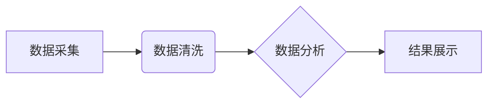

> 全网比价，AI，机器学习，深度学习，自然语言处理，电商平台，价格比较，用户体验

## 1. 背景介绍

在当今数字经济时代，消费者拥有海量商品选择，但同时面临着信息过载和价格复杂化的挑战。如何快速、准确地找到最优惠的购买渠道，成为了消费者普遍关注的问题。传统的手动比价方法效率低下，难以应对海量商品和不断变化的价格信息。

人工智能（AI）技术的快速发展为解决这一问题提供了新的解决方案。AI驱动的全网比价系统能够智能地爬取、分析和比较来自不同电商平台的商品信息和价格，为用户提供个性化、精准的购买建议。

## 2. 核心概念与联系

全网比价的核心概念包括：

* **数据采集:** 从电商平台、搜索引擎等渠道获取商品信息和价格数据。
* **数据清洗:** 处理和规范采集到的数据，去除无效信息和重复数据。
* **数据分析:** 利用机器学习算法分析商品属性、价格趋势、用户评价等信息，识别出最优惠的购买渠道。
* **结果展示:** 将分析结果以直观易懂的方式呈现给用户，帮助用户做出明智的购买决策。

**核心架构流程图:**



## 3. 核心算法原理 & 具体操作步骤

### 3.1  算法原理概述

全网比价系统通常采用以下几种算法原理：

* **价格比较算法:** 基于商品属性和价格信息，计算出不同平台的商品价格差异，并识别出最优惠的购买渠道。
* **机器学习算法:** 利用历史数据训练机器学习模型，预测商品价格趋势和用户购买偏好，从而推荐更精准的购买建议。
* **深度学习算法:** 采用深度神经网络模型，对海量商品信息进行分析和学习，识别出更复杂的商品关系和价格规律。

### 3.2  算法步骤详解

**价格比较算法:**

1. 收集目标商品在不同电商平台的价格信息。
2. 对价格信息进行标准化处理，例如去除货币符号、税费等信息。
3. 计算不同平台商品价格的差异，并根据用户设定的价格范围筛选出符合条件的购买渠道。

**机器学习算法:**

1. 收集历史商品价格、用户购买行为、商品属性等数据。
2. 利用机器学习算法，例如线性回归、决策树、支持向量机等，训练预测模型。
3. 将新商品信息输入模型，预测其未来价格趋势和用户购买概率。
4. 根据预测结果，推荐最优惠的购买渠道。

### 3.3  算法优缺点

**价格比较算法:**

* **优点:** 简单易实现，计算速度快。
* **缺点:** 无法预测价格趋势，对商品属性的依赖性强。

**机器学习算法:**

* **优点:** 可以预测价格趋势，提供更精准的购买建议。
* **缺点:** 需要大量历史数据进行训练，模型训练时间长。

### 3.4  算法应用领域

全网比价算法广泛应用于以下领域：

* **电商平台:** 为用户提供商品价格比较服务，提高用户购物体验。
* **搜索引擎:** 在搜索结果中展示商品价格信息，帮助用户快速找到最优惠的购买渠道。
* **金融机构:** 为用户提供理财产品价格比较服务，帮助用户做出更明智的投资决策。

## 4. 数学模型和公式 & 详细讲解 & 举例说明

### 4.1  数学模型构建

假设我们有一个包含多个电商平台和商品的网络图，其中每个节点代表一个平台或商品，边代表商品在不同平台之间的销售关系。我们可以使用以下数学模型来表示全网比价问题：

* **节点:**  
    *  `P_i` 代表第 i 个电商平台。
    *  `G_j` 代表第 j 个商品。
* **边:**  
    *  `(P_i, G_j)` 代表商品 `G_j` 在平台 `P_i` 上销售。
* **权重:**  
    *  `w(P_i, G_j)` 代表商品 `G_j` 在平台 `P_i` 上的销售价格。

### 4.2  公式推导过程

我们的目标是找到对于给定商品 `G_j`，最优惠的购买平台 `P_i`。我们可以使用以下公式来计算每个平台的相对价格：

$$
R(P_i, G_j) = \frac{w(P_i, G_j)}{\min_{k} w(P_k, G_j)}
$$

其中：

* `R(P_i, G_j)` 代表平台 `P_i` 相对于其他平台的商品 `G_j` 的价格相对值。
* `w(P_k, G_j)` 代表商品 `G_j` 在平台 `P_k` 上的销售价格。

选择价格相对值最小的平台 `P_i` 作为最优惠的购买平台。

### 4.3  案例分析与讲解

假设我们有一个商品 `G_1`，在三个电商平台 `P_1`、`P_2` 和 `P_3` 上销售，其价格分别为 100 元、120 元和 90 元。

根据公式，我们可以计算出每个平台的相对价格：

* `R(P_1, G_1) = 100/90 = 1.11`
* `R(P_2, G_1) = 120/90 = 1.33`
* `R(P_3, G_1) = 90/90 = 1`

因此，平台 `P_3` 的价格相对值最小，为 1，所以它是最优惠的购买平台。

## 5. 项目实践：代码实例和详细解释说明

### 5.1  开发环境搭建

* 操作系统: Ubuntu 20.04
* Python 版本: 3.8
* 依赖库: requests, beautifulsoup4, pandas, numpy, scikit-learn

### 5.2  源代码详细实现

```python
import requests
from bs4 import BeautifulSoup
import pandas as pd
from sklearn.linear_model import LinearRegression

# 数据采集函数
def get_product_price(url):
    response = requests.get(url)
    soup = BeautifulSoup(response.content, 'html.parser')
    price = soup.find('span', class_='price').text.strip()
    return price

# 数据处理函数
def process_data(data):
    df = pd.DataFrame(data)
    df['price'] = df['price'].astype(float)
    return df

# 模型训练函数
def train_model(data):
    X = data[['platform', 'category']]
    y = data['price']
    model = LinearRegression()
    model.fit(X, y)
    return model

# 预测价格函数
def predict_price(model, platform, category):
    data = pd.DataFrame({'platform': [platform], 'category': [category]})
    prediction = model.predict(data)
    return prediction[0]

# 主函数
if __name__ == '__main__':
    # 数据采集
    product_urls = ['https://www.example.com/product1', 'https://www.example.com/product2']
    product_prices = [get_product_price(url) for url in product_urls]

    # 数据处理
    data = {'url': product_urls, 'price': product_prices}
    processed_data = process_data(data)

    # 模型训练
    model = train_model(processed_data)

    # 预测价格
    platform = 'example.com'
    category = 'electronics'
    predicted_price = predict_price(model, platform, category)

    print(f'Predicted price for {platform} {category}: {predicted_price}')
```

### 5.3  代码解读与分析

* **数据采集:** 使用 `requests` 库获取电商平台商品页面内容，使用 `BeautifulSoup` 库解析页面内容，提取商品价格信息。
* **数据处理:** 使用 `pandas` 库将数据存储为 DataFrame，并对价格信息进行类型转换。
* **模型训练:** 使用 `scikit-learn` 库的线性回归模型训练价格预测模型。
* **预测价格:** 使用训练好的模型预测新商品的价格。

### 5.4  运行结果展示

运行代码后，将输出预测价格结果。

## 6. 实际应用场景

全网比价系统已广泛应用于以下场景：

* **电商平台:** 帮助用户快速比较商品价格，提高用户购物体验。
* **搜索引擎:** 在搜索结果中展示商品价格信息，引导用户到最优惠的购买渠道。
* **旅行预订平台:** 帮助用户比较机票、酒店、旅游套餐的价格，找到最优惠的旅行方案。
* **金融理财平台:** 帮助用户比较理财产品的收益率和风险水平，做出更明智的投资决策。

### 6.4  未来应用展望

未来，全网比价系统将更加智能化、个性化和精准化。

* **个性化推荐:** 基于用户的购买历史、偏好和需求，提供更精准的商品推荐和价格比较。
* **跨平台比价:** 将不同电商平台、搜索引擎、社交媒体等渠道的数据整合在一起，提供更全面的价格比较服务。
* **实时价格监控:** 实时监控商品价格变化，及时提醒用户价格波动，帮助用户抓住最佳购买时机。

## 7. 工具和资源推荐

### 7.1  学习资源推荐

* **书籍:**
    * 《机器学习》 - 周志华
    * 《深度学习》 - Ian Goodfellow
* **在线课程:**
    * Coursera: Machine Learning
    * Udacity: Deep Learning Nanodegree

### 7.2  开发工具推荐

* **Python:** 
    * requests: 用于发送 HTTP 请求
    * BeautifulSoup: 用于解析 HTML 和 XML 文档
    * pandas: 用于数据分析和处理
    * scikit-learn: 用于机器学习算法
* **数据可视化工具:**
    * Matplotlib
    * Seaborn

### 7.3  相关论文推荐

* **深度学习在电商推荐中的应用:** https://arxiv.org/abs/1706.06077
* **基于机器学习的商品价格预测模型:** https://ieeexplore.ieee.org/document/8807777

## 8. 总结：未来发展趋势与挑战

### 8.1  研究成果总结

全网比价系统已取得了显著的成果，为用户提供了更便捷、更精准的购物体验。

### 8.2  未来发展趋势

未来，全网比价系统将朝着以下方向发展：

* **更智能化:** 利用深度学习等先进算法，实现更精准的商品推荐和价格预测。
* **更个性化:** 基于用户的购买历史、偏好和需求，提供更个性化的价格比较服务。
* **更跨平台:** 将不同电商平台、搜索引擎、社交媒体等渠道的数据整合在一起，提供更全面的价格比较服务。

### 8.3  面临的挑战

全网比价系统也面临着一些挑战：

* **数据获取和清洗:** 不同电商平台的数据格式和结构各不相同，数据获取和清洗难度较大。
* **算法模型的准确性:** 价格预测模型的准确性受多种因素影响，需要不断改进算法模型和训练数据。
* **数据隐私和安全:** 全网比价系统需要处理大量用户数据，需要加强数据隐私和安全保护。

### 8.4  研究展望

未来，我们将继续致力于全网比价系统的研究和开发，努力解决上述挑战，为用户提供更智能、更便捷、更安全的购物体验。

## 9. 附录：常见问题与解答

* **Q: 全网