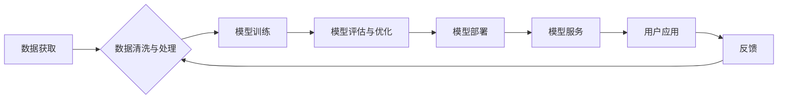

> 大模型、商业化、人工智能、深度学习、应用场景、技术挑战

## 1. 背景介绍

近年来，人工智能（AI）技术突飞猛进，特别是大模型的出现，为各行各业带来了前所未有的机遇。大模型，是指参数规模庞大、训练数据海量的人工智能模型，具备强大的泛化能力和学习能力，能够在自然语言处理、计算机视觉、语音识别等多个领域取得突破性进展。

从GPT-3到ChatGPT，从DALL-E 2到Stable Diffusion，一系列令人惊叹的成果不断涌现，证明了大模型的巨大潜力。这些模型不仅能够生成逼真的文本、图像和代码，还能进行复杂的推理和决策，为人类创造了无限可能。

然而，大模型的开发和应用也面临着诸多挑战。其训练成本高昂，需要海量数据和强大的计算资源；模型的解释性和可控性不足，难以理解模型的决策过程；模型的偏见和安全问题也需要得到有效解决。

尽管如此，创业者们对大模型的商业化前景充满热情。他们看到了大模型在各个领域的应用潜力，并积极探索其商业价值。

## 2. 核心概念与联系

大模型的商业化主要围绕以下几个核心概念展开：

* **模型训练与部署:** 训练大模型需要大量的计算资源和数据，而部署模型则需要考虑模型的效率和可扩展性。
* **模型定制与服务:** 针对不同行业和应用场景，需要对大模型进行定制和优化，并提供相应的服务。
* **数据获取与处理:** 大模型的训练和应用依赖于海量数据，因此数据获取、清洗和处理成为关键环节。
* **伦理与安全:** 大模型的应用需要考虑伦理和安全问题，例如模型的偏见、隐私保护和恶意攻击。

**大模型商业化流程图:**



## 3. 核心算法原理 & 具体操作步骤

### 3.1  算法原理概述

大模型的训练主要基于深度学习算法，特别是 Transformer 架构。Transformer 是一种基于注意力机制的神经网络架构，能够有效捕捉文本序列中的长距离依赖关系。

### 3.2  算法步骤详解

1. **数据预处理:** 将文本数据进行清洗、分词、词嵌入等预处理操作，以便模型训练。
2. **模型构建:** 根据 Transformer 架构构建模型，并设置模型参数。
3. **模型训练:** 使用训练数据训练模型，并通过反向传播算法更新模型参数。
4. **模型评估:** 使用验证数据评估模型的性能，并根据评估结果调整模型参数。
5. **模型部署:** 将训练好的模型部署到服务器或云平台，以便提供服务。

### 3.3  算法优缺点

**优点:**

* 强大的泛化能力和学习能力
* 能够处理长距离依赖关系
* 在自然语言处理等领域取得突破性进展

**缺点:**

* 训练成本高昂
* 模型解释性和可控性不足
* 模型的偏见和安全问题

### 3.4  算法应用领域

* 自然语言处理：文本生成、机器翻译、问答系统、情感分析等
* 计算机视觉：图像识别、物体检测、图像生成等
* 语音识别：语音转文本、语音合成等
* 其他领域：代码生成、药物研发、金融预测等

## 4. 数学模型和公式 & 详细讲解 & 举例说明

### 4.1  数学模型构建

大模型的训练基于深度学习算法，其核心是构建复杂的数学模型，并通过优化算法训练模型参数。

Transformer 架构的核心是注意力机制，其数学模型可以表示为：

$$
Attention(Q, K, V) = softmax(\frac{QK^T}{\sqrt{d_k}})V
$$

其中：

* $Q$：查询矩阵
* $K$：键矩阵
* $V$：值矩阵
* $d_k$：键向量的维度
* $softmax$：softmax 函数

### 4.2  公式推导过程

注意力机制的目的是计算查询向量与键向量的相关性，并根据相关性加权值向量。

softmax 函数将相关性分数转换为概率分布，使得每个值向量的权重之和为1。

### 4.3  案例分析与讲解

例如，在机器翻译任务中，查询向量表示源语言的词语，键向量表示目标语言的词语，值向量表示目标语言的词语嵌入。

注意力机制可以计算源语言词语与目标语言词语之间的相关性，并根据相关性加权目标语言词语的嵌入，从而生成更准确的翻译结果。

## 5. 项目实践：代码实例和详细解释说明

### 5.1  开发环境搭建

* Python 3.7+
* PyTorch 或 TensorFlow
* CUDA 和 cuDNN

### 5.2  源代码详细实现

```python
import torch
import torch.nn as nn

class Transformer(nn.Module):
    def __init__(self, vocab_size, embedding_dim, num_heads, num_layers):
        super(Transformer, self).__init__()
        self.embedding = nn.Embedding(vocab_size, embedding_dim)
        self.transformer_layers = nn.ModuleList([
            nn.TransformerEncoderLayer(embedding_dim, num_heads)
            for _ in range(num_layers)
        ])
        self.linear = nn.Linear(embedding_dim, vocab_size)

    def forward(self, x):
        x = self.embedding(x)
        for layer in self.transformer_layers:
            x = layer(x)
        x = self.linear(x)
        return x
```

### 5.3  代码解读与分析

* `__init__` 方法初始化模型参数，包括词嵌入层、Transformer 层和输出层。
* `forward` 方法定义模型的正向传播过程，将输入序列经过词嵌入层、Transformer 层和输出层，最终得到输出序列。

### 5.4  运行结果展示

训练好的模型可以用于各种自然语言处理任务，例如文本生成、机器翻译、问答系统等。

## 6. 实际应用场景

### 6.1  自然语言处理

* **文本生成:** 大模型可以生成高质量的文本，例如小说、诗歌、新闻报道等。
* **机器翻译:** 大模型可以实现高质量的机器翻译，跨越语言障碍，促进信息交流。
* **问答系统:** 大模型可以理解自然语言问题，并给出准确的答案。
* **情感分析:** 大模型可以分析文本的情感倾向，例如正面、负面或中性。

### 6.2  计算机视觉

* **图像识别:** 大模型可以识别图像中的物体、场景和人物。
* **物体检测:** 大模型可以定位图像中的物体，并识别物体的类别。
* **图像生成:** 大模型可以生成逼真的图像，例如风景、人物和物体。

### 6.3  语音识别

* **语音转文本:** 大模型可以将语音转换为文本，例如语音助手、会议记录等。
* **语音合成:** 大模型可以将文本转换为语音，例如语音播报、虚拟助手等。

### 6.4  未来应用展望

大模型的应用场景还在不断扩展，未来将应用于更多领域，例如：

* **医疗保健:** 辅助诊断、预测疾病、个性化治疗
* **教育:** 智能辅导、个性化学习、自动批改
* **金融:** 风险评估、欺诈检测、投资决策
* **制造业:** 自动化生产、质量控制、设备维护

## 7. 工具和资源推荐

### 7.1  学习资源推荐

* **书籍:**
    * Deep Learning by Ian Goodfellow, Yoshua Bengio, and Aaron Courville
    * Transformer by Jay Alammar
* **在线课程:**
    * Stanford CS224N: Natural Language Processing with Deep Learning
    * DeepLearning.AI TensorFlow Specialization

### 7.2  开发工具推荐

* **框架:** PyTorch, TensorFlow
* **库:** Hugging Face Transformers, OpenAI API

### 7.3  相关论文推荐

* Attention Is All You Need (Vaswani et al., 2017)
* BERT: Pre-training of Deep Bidirectional Transformers for Language Understanding (Devlin et al., 2018)
* GPT-3: Language Models are Few-Shot Learners (Brown et al., 2020)

## 8. 总结：未来发展趋势与挑战

### 8.1  研究成果总结

近年来，大模型在人工智能领域取得了突破性进展，展现出强大的学习能力和泛化能力，为各个领域带来了新的机遇。

### 8.2  未来发展趋势

* **模型规模和能力的提升:** 未来大模型的规模和能力将继续提升，能够处理更复杂的任务，并取得更优异的性能。
* **模型效率和可解释性的提升:** 研究者将致力于提高大模型的训练效率和推理效率，并开发更有效的模型解释方法。
* **模型的安全性、可靠性和可控性的提升:** 随着大模型的应用范围扩大，其安全性、可靠性和可控性将成为更加重要的研究方向。

### 8.3  面临的挑战

* **训练成本高昂:** 大模型的训练需要大量的计算资源和数据，成本非常高昂。
* **模型解释性和可控性不足:** 大模型的决策过程难以理解，难以控制模型的行为。
* **模型的偏见和安全问题:** 大模型可能存在偏见和安全问题，需要进行有效解决。

### 8.4  研究展望

未来，大模型研究将朝着更加安全、可靠、可解释和高效的方向发展，并为人类社会带来更多福祉。

## 9. 附录：常见问题与解答

* **Q: 大模型的训练需要多少数据？**
* **A:** 大模型的训练需要海量数据，通常需要数十亿甚至数千亿个数据点。
* **Q: 大模型的训练需要多少计算资源？**
* **A:** 大模型的训练需要大量的计算资源，通常需要数百甚至数千个GPU。
* **Q: 大模型的应用场景有哪些？**
* **A:** 大模型的应用场景非常广泛，包括自然语言处理、计算机视觉、语音识别等多个领域。


作者：禅与计算机程序设计艺术 / Zen and the Art of Computer Programming 
<end_of_turn>