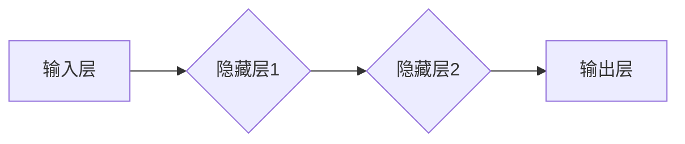

> 前馈网络，人工神经网络，深度学习，机器学习，分类，回归，激活函数，反向传播

## 1. 背景介绍

人工智能（AI）近年来取得了令人瞩目的进展，其中深度学习作为其重要组成部分，在图像识别、自然语言处理、语音识别等领域取得了突破性成果。深度学习模型的核心之一是前馈网络（Feedforward Neural Network），它以其结构简单、易于理解和训练的特点，成为构建各种AI应用的基础。

前馈网络的应用可以追溯到20世纪50年代，最初用于解决简单的模式识别问题。随着计算机硬件和算法的不断发展，前馈网络逐渐演变为更复杂、更强大的模型，例如卷积神经网络（CNN）和循环神经网络（RNN）。

## 2. 核心概念与联系

前馈网络是一种多层神经网络，信息仅沿着单向传播，从输入层到输出层，不包含反馈环路。每个神经元接收来自上一层的输入信号，经过激活函数处理后，将输出信号传递给下一层神经元。

**前馈网络的结构主要包括：**

* **输入层：**接收原始数据，每个神经元代表一个输入特征。
* **隐藏层：**位于输入层和输出层之间，负责对输入数据进行特征提取和表示学习。可以有多个隐藏层，层数越多，网络的表达能力越强。
* **输出层：**输出最终结果，每个神经元代表一个输出类别或值。

**前馈网络的运作机制：**

1. 输入数据首先进入输入层。
2. 每个输入神经元将信号传递给下一层的所有神经元。
3. 隐藏层神经元接收来自上一层的输入信号，经过激活函数处理后，将输出信号传递给下一层神经元。
4. 这一过程重复进行，直到信号到达输出层。
5. 输出层神经元输出最终结果。

**Mermaid 流程图：**



## 3. 核心算法原理 & 具体操作步骤

### 3.1  算法原理概述

前馈网络的训练基于**反向传播算法（Backpropagation）**。该算法通过计算误差信号，并反向传播到各层神经元，调整神经元的权重和偏置，从而使网络的输出更接近真实值。

**反向传播算法的步骤：**

1. 将输入数据输入网络，计算输出结果。
2. 计算输出结果与真实值的误差。
3. 将误差信号反向传播到各层神经元。
4. 根据误差信号，调整各层神经元的权重和偏置。
5. 重复步骤1-4，直到误差达到预设阈值。

### 3.2  算法步骤详解

1. **前向传播：**将输入数据输入网络，逐层计算神经元的激活值，最终得到输出结果。
2. **误差计算：**比较输出结果与真实值之间的误差，通常使用均方误差（MSE）作为误差函数。
3. **反向传播：**将误差信号反向传播到各层神经元，计算每个神经元的梯度。
4. **权重更新：**根据梯度下降算法，更新各层神经元的权重和偏置，使误差最小化。

### 3.3  算法优缺点

**优点：**

* 结构简单，易于理解和实现。
* 训练速度相对较快。
* 可以处理多种类型的数据，例如图像、文本、音频等。

**缺点：**

* 表现能力有限，难以处理复杂的任务。
* 容易陷入局部最优解。
* 需要大量的训练数据。

### 3.4  算法应用领域

前馈网络广泛应用于各种AI领域，例如：

* **图像识别：**识别物体、场景、人脸等。
* **自然语言处理：**文本分类、情感分析、机器翻译等。
* **语音识别：**将语音转换为文本。
* **预测分析：**预测股票价格、天气预报等。

## 4. 数学模型和公式 & 详细讲解 & 举例说明

### 4.1  数学模型构建

前馈网络的数学模型可以表示为一个多层感知机（MLP），其输出为输入数据的线性组合加上激活函数。

**公式：**

$$
y = f(W^L x^L + b^L)
$$

其中：

* $y$：输出值
* $f$：激活函数
* $W^L$：第L层的权重矩阵
* $x^L$：第L层的输入向量
* $b^L$：第L层的偏置向量

### 4.2  公式推导过程

前馈网络的输出值可以通过逐层计算得到。

**假设网络有L层，则输出值可以表示为：**

$$
y = f(W^L f(W^{L-1} f(W^{L-2} ... f(W^1 x^1 + b^1) ... + b^{L-1}) + b^L)
$$

其中：

* $x^1$：输入向量
* $W^i$：第i层的权重矩阵
* $b^i$：第i层的偏置向量
* $f$：激活函数

### 4.3  案例分析与讲解

**举例：**

假设一个简单的前馈网络，用于分类手写数字0-9。网络结构为：输入层784个神经元（对应MNIST数据集的图像像素），隐藏层128个神经元，输出层10个神经元（对应10个数字类别）。

**训练过程：**

1. 将MNIST数据集中的图像数据输入网络，并计算输出结果。
2. 计算输出结果与真实标签之间的误差。
3. 使用反向传播算法，反向传播误差信号，并更新网络的权重和偏置。
4. 重复步骤1-3，直到误差达到预设阈值。

**预测过程：**

1. 将新的图像数据输入网络。
2. 网络计算输出结果，并选择输出值最大的类别作为预测结果。

## 5. 项目实践：代码实例和详细解释说明

### 5.1  开发环境搭建

* Python 3.x
* TensorFlow 或 PyTorch 等深度学习框架
* Jupyter Notebook 或其他代码编辑器

### 5.2  源代码详细实现

```python
import tensorflow as tf

# 定义模型结构
model = tf.keras.models.Sequential([
    tf.keras.layers.Flatten(input_shape=(28, 28)),
    tf.keras.layers.Dense(128, activation='relu'),
    tf.keras.layers.Dense(10, activation='softmax')
])

# 编译模型
model.compile(optimizer='adam',
              loss='sparse_categorical_crossentropy',
              metrics=['accuracy'])

# 训练模型
model.fit(x_train, y_train, epochs=10)

# 评估模型
loss, accuracy = model.evaluate(x_test, y_test)
print('Test loss:', loss)
print('Test accuracy:', accuracy)
```

### 5.3  代码解读与分析

* **模型定义：**使用`tf.keras.models.Sequential`创建顺序模型，并添加两个全连接层和一个扁平化层。
* **激活函数：**隐藏层使用ReLU激活函数，输出层使用softmax激活函数，用于分类任务。
* **编译模型：**使用Adam优化器、稀疏类别交叉熵损失函数和准确率指标编译模型。
* **训练模型：**使用`model.fit`方法训练模型，输入训练数据和标签，设置训练轮数。
* **评估模型：**使用`model.evaluate`方法评估模型，输入测试数据和标签，输出测试损失和准确率。

### 5.4  运行结果展示

训练完成后，可以查看模型的测试准确率，评估模型的性能。

## 6. 实际应用场景

前馈网络在各种实际应用场景中发挥着重要作用，例如：

* **图像分类：**识别物体、场景、人脸等，应用于自动驾驶、医疗诊断、安防监控等领域。
* **自然语言处理：**文本分类、情感分析、机器翻译等，应用于搜索引擎、聊天机器人、社交媒体分析等领域。
* **语音识别：**将语音转换为文本，应用于语音助手、语音搜索、听力辅助等领域。
* **预测分析：**预测股票价格、天气预报、客户行为等，应用于金融、天气预报、市场营销等领域。

### 6.4  未来应用展望

随着人工智能技术的不断发展，前馈网络的应用场景将更加广泛，例如：

* **个性化推荐：**根据用户的行为和偏好，推荐个性化的商品、服务和内容。
* **自动写作：**生成新闻报道、小说、诗歌等文本内容。
* **药物研发：**预测药物的活性、毒性等，加速药物研发过程。

## 7. 工具和资源推荐

### 7.1  学习资源推荐

* **书籍：**
    * 《深度学习》
    * 《神经网络与深度学习》
* **在线课程：**
    * Coursera：深度学习
    * Udacity：机器学习工程师
* **博客和网站：**
    * TensorFlow 官方博客
    * PyTorch 官方博客
    * Towards Data Science

### 7.2  开发工具推荐

* **深度学习框架：**
    * TensorFlow
    * PyTorch
    * Keras
* **代码编辑器：**
    * Jupyter Notebook
    * VS Code
    * PyCharm

### 7.3  相关论文推荐

* **《手写数字识别》**
* **《AlexNet：图像分类的深度卷积神经网络》**
* **《ResNet：残差网络》**

## 8. 总结：未来发展趋势与挑战

### 8.1  研究成果总结

前馈网络在人工智能领域取得了显著成果，为图像识别、自然语言处理、语音识别等领域的发展做出了重要贡献。

### 8.2  未来发展趋势

* **模型规模和复杂度提升：**随着计算能力的提升，前馈网络的规模和复杂度将不断提升，能够处理更复杂的任务。
* **新颖的激活函数和网络结构：**研究人员将不断探索新的激活函数和网络结构，提高模型的表达能力和效率。
* **迁移学习和知识蒸馏：**利用预训练模型进行迁移学习和知识蒸馏，降低模型训练成本和时间。

### 8.3  面临的挑战

* **数据获取和标注：**深度学习模型需要大量的训练数据，数据获取和标注成本较高。
* **模型解释性和可解释性：**深度学习模型的内部机制复杂，难以解释模型的决策过程。
* **模型安全性与鲁棒性：**深度学习模型容易受到攻击和对抗样本的影响，需要提高模型的安全性与鲁棒性。

### 8.4  研究展望

未来，前馈网络的研究将继续深入，探索更强大的模型、更有效的训练方法和更广泛的应用场景。


## 9. 附录：常见问题与解答

**常见问题：**

* **前馈网络和循环神经网络的区别是什么？**
* **如何选择合适的激活函数？**
* **如何防止模型过拟合？**
* **如何评估模型的性能？**

**解答：**

* 前馈网络信息仅单向传播，而循环神经网络可以处理序列数据，信息可以循环传递。
* 激活函数的选择取决于具体的应用场景和模型结构。
* 可以使用正则化技术、数据增强和交叉验证等方法防止模型过拟合。
* 可以使用测试集上的准确率、损失函数值等指标评估模型的性能。


作者：禅与计算机程序设计艺术 / Zen and the Art of Computer Programming 
<end_of_turn>