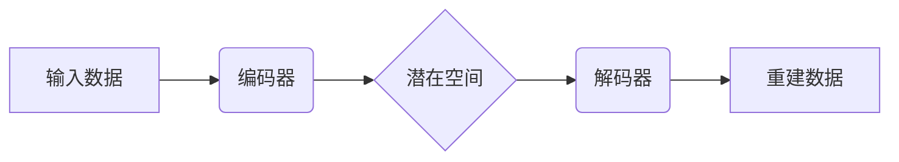

> 变分自编码器 (VAE)、深度学习、生成模型、降维、数据重建、概率模型、变分推断

## 1. 背景介绍

在深度学习领域，生成模型一直是研究的热点之一。生成模型的目标是学习数据的潜在表示，并能够生成与真实数据相似的样本。变分自编码器 (Variational Autoencoder, VAE) 是一种强大的生成模型，它结合了自编码器和变分推断的思想，能够有效地学习数据的低维表示并生成新的样本。

传统的自编码器通过压缩数据到一个低维空间，然后将其解码回原始空间。然而，传统的自编码器无法学习到数据的概率分布，因此生成的样本往往缺乏多样性和真实性。VAE 通过引入概率模型，将编码过程和解码过程都变成了概率分布，从而能够学习到数据的潜在概率分布，并生成更逼真的样本。

## 2. 核心概念与联系

VAE 的核心概念包括：

* **自编码器 (Autoencoder):**  一种神经网络架构，用于学习数据的压缩表示。它由编码器和解码器两部分组成。编码器将输入数据映射到一个低维空间，解码器将低维表示映射回原始空间。
* **变分推断 (Variational Inference):**  一种用于估计概率模型参数的方法。它通过寻找一个近似的概率分布来代替真实分布，并利用这个近似分布来计算模型参数。
* **潜在空间 (Latent Space):**  VAE 将数据映射到一个低维空间，称为潜在空间。在这个空间中，数据点之间的距离反映了它们之间的相似性。

**VAE 架构流程图:**



## 3. 核心算法原理 & 具体操作步骤

### 3.1  算法原理概述

VAE 的核心思想是将编码器输出的潜在变量视为一个概率分布，而不是一个确定的值。通过引入变分推断，VAE 学习到一个近似的潜在分布，并利用这个分布来生成新的样本。

VAE 的训练目标是：

* **数据重建:**  最小化输入数据与重建数据的差异。
* **KL 散度:**  最小化潜在分布与标准正态分布之间的KL散度，以确保潜在分布的平滑性和可解释性。

### 3.2  算法步骤详解

1. **编码:** 将输入数据输入编码器，得到潜在变量的均值和方差。
2. **采样:** 从潜在变量的分布中采样一个潜在变量。
3. **解码:** 将采样的潜在变量输入解码器，得到重建数据。
4. **损失函数:** 计算数据重建误差和KL散度，并将其作为训练目标。
5. **反向传播:** 使用梯度下降算法更新编码器和解码器的参数。

### 3.3  算法优缺点

**优点:**

* **生成多样性:**  由于潜在变量的分布是概率性的，VAE 可以生成多样性的样本。
* **可解释性:**  潜在空间可以用来理解数据的结构和特征。
* **降维:**  VAE 可以将数据压缩到一个低维空间，用于数据可视化和特征提取。

**缺点:**

* **训练复杂:**  VAE 的训练过程相对复杂，需要使用变分推断和梯度下降算法。
* **样本质量:**  生成的样本质量可能不如其他生成模型，例如GAN。

### 3.4  算法应用领域

VAE 在以下领域有广泛的应用:

* **图像生成:**  生成新的图像，例如人脸、风景、物体等。
* **图像修复:**  修复损坏的图像，例如补全缺失的部分。
* **图像风格迁移:**  将图像的风格迁移到其他图像。
* **文本生成:**  生成新的文本，例如诗歌、故事、对话等。
* **数据降维:**  将高维数据降维到低维空间，用于数据可视化和特征提取。

## 4. 数学模型和公式 & 详细讲解 & 举例说明

### 4.1  数学模型构建

VAE 的数学模型可以概括为以下几个部分:

* **编码器:**  将输入数据 x 映射到潜在空间的均值和方差，分别为 μ 和 σ。
* **潜在空间分布:**  潜在变量 z 服从正态分布 N(μ, σ^2)。
* **解码器:**  将潜在变量 z 映射回原始空间的重建数据 x'。

### 4.2  公式推导过程

VAE 的损失函数由两个部分组成:

* **重建损失:**  衡量输入数据 x 与重建数据 x' 之间的差异，通常使用均方误差 (MSE)。

$$
L_{reconstruction} = ||x - x'||^2
$$

* **KL 散度:**  衡量潜在分布 N(μ, σ^2) 与标准正态分布 N(0, 1) 之间的差异。

$$
L_{KL} = D_{KL}(N(μ, σ^2) || N(0, 1)) = 0.5 * ∑(1 + log(σ^2) - μ^2 - σ^2)
$$

VAE 的总损失函数为:

$$
L_{VAE} = L_{reconstruction} + β * L_{KL}
$$

其中 β 是一个超参数，用于平衡重建损失和 KL 散度。

### 4.3  案例分析与讲解

假设我们有一个图像数据集，我们想使用 VAE 来学习图像的潜在表示并生成新的图像。

1. **编码器:**  我们使用一个卷积神经网络作为编码器，将图像映射到潜在空间。
2. **潜在空间分布:**  我们假设潜在变量 z 服从标准正态分布。
3. **解码器:**  我们使用一个反卷积神经网络作为解码器，将潜在变量 z 映射回图像。
4. **训练:**  我们使用 VAE 的损失函数来训练编码器和解码器，目标是最小化重建损失和 KL 散度。
5. **生成:**  训练完成后，我们可以从潜在空间中采样新的潜在变量，并将其输入解码器生成新的图像。

## 5. 项目实践：代码实例和详细解释说明

### 5.1  开发环境搭建

* Python 3.6+
* TensorFlow 2.0+
* PyTorch 1.0+
* NumPy
* Matplotlib

### 5.2  源代码详细实现

```python
import tensorflow as tf

# 定义编码器
def encoder(x):
    # ...

# 定义解码器
def decoder(z):
    # ...

# 定义 VAE 模型
class VAE(tf.keras.Model):
    def __init__(self):
        super(VAE, self).__init__()
        self.encoder = encoder
        self.decoder = decoder

    def call(self, x):
        z = self.encoder(x)
        x_recon = self.decoder(z)
        return x_recon

# 实例化 VAE 模型
vae = VAE()

# 定义损失函数
def loss_function(x_recon, x):
    reconstruction_loss = tf.reduce_mean(tf.square(x - x_recon))
    kl_loss = -0.5 * tf.reduce_mean(1 + tf.math.log(sigma^2) - tf.math.square(mu) - sigma^2)
    return reconstruction_loss + kl_loss

# 训练模型
optimizer = tf.keras.optimizers.Adam()
for epoch in range(num_epochs):
    for batch in dataset:
        with tf.GradientTape() as tape:
            x_recon = vae(batch)
            loss = loss_function(x_recon, batch)
        gradients = tape.gradient(loss, vae.trainable_variables)
        optimizer.apply_gradients(zip(gradients, vae.trainable_variables))

# 保存模型
vae.save("vae_model.h5")

```

### 5.3  代码解读与分析

* **编码器和解码器:**  编码器和解码器分别使用卷积神经网络和反卷积神经网络实现。
* **潜在空间分布:**  潜在变量 z 服从标准正态分布。
* **损失函数:**  VAE 的损失函数由重建损失和 KL 散度组成。
* **训练过程:**  使用 Adam 优化器训练 VAE 模型，并使用批次梯度下降算法更新模型参数。

### 5.4  运行结果展示

训练完成后，我们可以使用 VAE 模型生成新的图像。生成的图像应该与训练数据相似，并具有多样性。

## 6. 实际应用场景

VAE 在以下实际应用场景中表现出色:

* **图像生成:**  生成人脸、风景、物体等图像。
* **图像修复:**  修复损坏的图像，例如补全缺失的部分。
* **图像风格迁移:**  将图像的风格迁移到其他图像。
* **文本生成:**  生成诗歌、故事、对话等文本。
* **数据降维:**  将高维数据降维到低维空间，用于数据可视化和特征提取。

### 6.4  未来应用展望

随着深度学习技术的不断发展，VAE 的应用场景将会更加广泛。未来，VAE 可能在以下领域发挥更大的作用:

* **医疗图像分析:**  用于疾病诊断、图像分割和病灶检测。
* **药物研发:**  用于药物分子设计和药物作用机制研究。
* **自然语言处理:**  用于文本生成、机器翻译和情感分析。
* **人工智能辅助创作:**  用于辅助艺术家、作家和音乐家进行创作。

## 7. 工具和资源推荐

### 7.1  学习资源推荐

* **书籍:**
    * "Deep Learning" by Ian Goodfellow, Yoshua Bengio, and Aaron Courville
    * "Generative Deep Learning" by David Foster
* **论文:**
    * "Auto-Encoding Variational Bayes" by Diederik P. Kingma and Max Welling
* **在线课程:**
    * Coursera: "Deep Learning Specialization" by Andrew Ng
    * Udacity: "Deep Learning Nanodegree"

### 7.2  开发工具推荐

* **TensorFlow:**  开源深度学习框架，支持多种硬件平台。
* **PyTorch:**  开源深度学习框架，以其灵活性和易用性而闻名。
* **Keras:**  高层深度学习 API，可以运行在 TensorFlow 或 Theano 上。

### 7.3  相关论文推荐

* "Variational Autoencoders for Text Generation" by  Alec Radford et al.
* "Conditional Variational Autoencoders" by  Xiangyu Zhang et al.
* "Adversarial Autoencoders" by  Martin Arjovsky et al.

## 8. 总结：未来发展趋势与挑战

### 8.1  研究成果总结

VAE 是一种强大的生成模型，在图像生成、图像修复、文本生成等领域取得了显著的成果。

### 8.2  未来发展趋势

* **更高效的训练方法:**  研究更有效率的训练方法，例如基于强化学习的训练。
* **更强大的生成能力:**  开发新的 VAE 变体，提高生成样本的质量和多样性。
* **更广泛的应用场景:**  将 VAE 应用到更多领域，例如医疗、金融和科学研究。

### 8.3  面临的挑战

* **样本质量:**  VAE 生成的样本质量可能不如其他生成模型，例如 GAN。
* **训练复杂度:**  VAE 的训练过程相对复杂，需要大量的计算资源和时间。
* **可解释性:**  VAE 的潜在空间难以解释，难以理解模型是如何学习数据的。

### 8.4  研究展望

