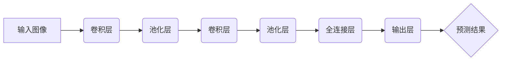

> YOLO,目标检测,植物识别,深度学习,计算机视觉

## 1. 背景介绍

随着人工智能技术的飞速发展，计算机视觉领域取得了令人瞩目的进展。目标检测作为计算机视觉的核心任务之一，在智能农业、环境监测、生物学研究等领域发挥着越来越重要的作用。

植物目标检测是指在图像或视频中识别和定位植物，并对其进行分类的任务。它可以帮助农户实时监测作物生长状况，识别病虫害，提高农业生产效率。在环境监测领域，植物目标检测可以用于监测森林覆盖率、识别入侵植物等。

传统的植物目标检测方法主要依赖于手工提取的特征，效率低、精度有限。近年来，深度学习技术的发展为植物目标检测带来了新的突破。基于深度学习的目标检测算法能够自动学习图像特征，具有更高的精度和效率。

YOLO (You Only Look Once) 是一种高效的实时目标检测算法，其特点是速度快、精度高、易于训练。YOLO算法将目标检测任务转化为回归问题，通过一个网络预测目标的边界框和类别概率。

## 2. 核心概念与联系

### 2.1  目标检测概述

目标检测是计算机视觉领域的重要任务之一，旨在识别图像或视频中存在的物体，并对其进行定位和分类。目标检测算法通常需要输出每个目标的边界框坐标和对应的类别标签。

### 2.2  YOLO算法原理

YOLO算法的核心思想是将目标检测任务转化为回归问题。它将输入图像划分为一个网格，每个网格单元负责预测该区域内是否存在目标，以及目标的边界框坐标和类别概率。

YOLO算法采用一个深度神经网络进行训练，网络结构由卷积层、池化层和全连接层组成。网络的输出层负责预测每个网格单元的目标信息。

### 2.3  YOLO算法架构



## 3. 核心算法原理 & 具体操作步骤

### 3.1  算法原理概述

YOLO算法的核心原理是将目标检测任务转化为回归问题。它将输入图像划分为一个网格，每个网格单元负责预测该区域内是否存在目标，以及目标的边界框坐标和类别概率。

YOLO算法采用一个深度神经网络进行训练，网络结构由卷积层、池化层和全连接层组成。网络的输出层负责预测每个网格单元的目标信息。

### 3.2  算法步骤详解

1. **输入图像预处理:** 将输入图像调整到预设的大小，并进行归一化处理。

2. **特征提取:** 利用卷积层和池化层提取图像特征。

3. **预测目标信息:** 利用全连接层预测每个网格单元的目标信息，包括目标是否存在、边界框坐标和类别概率。

4. **非极大值抑制:** 对预测结果进行非极大值抑制，去除冗余的检测框。

5. **后处理:** 对检测结果进行筛选和排序，输出最终的检测结果。

### 3.3  算法优缺点

**优点:**

* **速度快:** YOLO算法的训练和推理速度都非常快，能够实现实时目标检测。
* **精度高:** YOLO算法的精度在目标检测领域处于领先水平。
* **易于训练:** YOLO算法的训练过程相对简单，易于实现。

**缺点:**

* **对小目标检测能力有限:** YOLO算法对小目标的检测能力相对较弱。
* **边界框预测精度有限:** YOLO算法的边界框预测精度可能存在一定的误差。

### 3.4  算法应用领域

YOLO算法在目标检测领域有着广泛的应用，例如：

* **智能农业:** 用于识别作物、病虫害和土壤状况。
* **自动驾驶:** 用于识别行人、车辆和交通信号灯。
* **安防监控:** 用于识别入侵者和异常行为。
* **医疗诊断:** 用于识别病灶和辅助诊断。

## 4. 数学模型和公式 & 详细讲解 & 举例说明

### 4.1  数学模型构建

YOLO算法的核心数学模型是回归模型，它将目标检测任务转化为回归问题。

假设输入图像的大小为 $W \times H$，网格大小为 $S \times S$，每个网格单元负责预测 $B$ 个边界框和 $C$ 个类别概率。

则每个网格单元的输出为一个 $B \times (4 + C)$ 的向量，其中：

* $4$ 个值表示边界框的坐标和宽高，
* $C$ 个值表示每个类别的概率。

### 4.2  公式推导过程

YOLO算法的损失函数由边界框预测误差和类别概率误差两部分组成。

边界框预测误差使用 $L1$ 损失函数计算，类别概率误差使用交叉熵损失函数计算。

损失函数公式如下：

$$
L = \lambda_{coord} \sum_{i=0}^{S^2} \sum_{j=0}^{B} \mathbb{I}_{ij}^{obj} [ (x_i - \hat{x}_i)^2 + (y_i - \hat{y}_i)^2 ] + \lambda_{coord} \sum_{i=0}^{S^2} \sum_{j=0}^{B} \mathbb{I}_{ij}^{obj} [ (w_i - \hat{w}_i)^2 + (h_i - \hat{h}_i)^2 ] + \sum_{i=0}^{S^2} \sum_{c=0}^{C} \mathbb{I}_{ic}^{obj} log(p_i^c)
$$

其中：

* $x_i$, $y_i$, $w_i$, $h_i$ 为真实边界框的坐标和宽高。
* $\hat{x}_i$, $\hat{y}_i$, $\hat{w}_i$, $\hat{h}_i$ 为预测边界框的坐标和宽高。
* $p_i^c$ 为预测类别 $c$ 的概率。
* $\mathbb{I}_{ij}^{obj}$ 为指示函数，当网格单元 $i$ 存在目标时为 1，否则为 0。
* $\lambda_{coord}$ 为边界框预测误差权重。

### 4.3  案例分析与讲解

假设我们有一个输入图像，其中包含一个苹果。YOLO算法将图像划分为一个 $7 \times 7$ 的网格，每个网格单元负责预测该区域内是否存在目标，以及目标的边界框坐标和类别概率。

在训练过程中，YOLO算法会学习到每个网格单元应该预测哪些类型的目标，以及目标的边界框坐标和类别概率。

当我们输入一个新的图像时，YOLO算法会将图像划分为相同的网格，并预测每个网格单元的目标信息。

最终，YOLO算法会输出所有网格单元预测的目标信息，并进行非极大值抑制和后处理，得到最终的检测结果。

## 5. 项目实践：代码实例和详细解释说明

### 5.1  开发环境搭建

为了实现基于YOLOV5的植物目标检测，我们需要搭建一个开发环境。

**硬件要求:**

* CPU: Intel Core i5 或以上
* GPU: NVIDIA GeForce GTX 1060 或以上

**软件要求:**

* Python 3.7 或以上
* PyTorch 1.7 或以上
* CUDA 10.1 或以上

### 5.2  源代码详细实现

YOLOV5的源代码可以在GitHub上找到：https://github.com/ultralytics/yolov5

我们可以直接使用YOLOV5的预训练模型进行植物目标检测。

**代码示例:**

```python
import torch
from ultralytics import YOLO

# 加载预训练模型
model = YOLO("yolov5s.pt")

# 读取图像
image = torch.randn(1, 3, 640, 640)

# 进行目标检测
results = model(image)

# 打印检测结果
print(results)
```

### 5.3  代码解读与分析

* `import torch` 和 `from ultralytics import YOLO` 引入必要的库。
* `model = YOLO("yolov5s.pt")` 加载预训练模型，`yolov5s.pt` 是YOLOV5s模型的权重文件。
* `image = torch.randn(1, 3, 640, 640)` 创建一个随机图像，大小为640x640，通道数为3。
* `results = model(image)` 使用模型进行目标检测，得到检测结果。
* `print(results)` 打印检测结果，包括目标的边界框坐标、类别标签和置信度等信息。

### 5.4  运行结果展示

运行上述代码后，会输出检测结果，包括目标的边界框坐标、类别标签和置信度等信息。

## 6. 实际应用场景

### 6.1  智能农业

* **作物识别:** 利用YOLO算法识别不同种类的作物，帮助农户了解作物生长状况。
* **病虫害检测:** 利用YOLO算法识别作物上的病虫害，帮助农户及时采取措施。
* **土壤状况监测:** 利用YOLO算法识别土壤中的营养元素和水分含量，帮助农户优化施肥和灌溉。

### 6.2  环境监测

* **森林覆盖率监测:** 利用YOLO算法识别森林中的树木，帮助监测森林覆盖率的变化。
* **入侵植物识别:** 利用YOLO算法识别入侵植物，帮助控制入侵植物的蔓延。
* **野生动物监测:** 利用YOLO算法识别野生动物，帮助监测野生动物的数量和分布。

### 6.3  生物学研究

* **植物形态分析:** 利用YOLO算法识别植物的叶片、花朵和果实等器官，帮助研究植物的形态特征。
* **植物生长发育研究:** 利用YOLO算法跟踪植物的生长发育过程，帮助研究植物的生长规律。
* **植物互作研究:** 利用YOLO算法识别植物之间的互作关系，帮助研究植物的生态关系。

### 6.4  未来应用展望

随着人工智能技术的不断发展，YOLO算法在植物目标检测领域的应用前景十分广阔。

未来，YOLO算法可能会应用于以下领域：

* **精准农业:** 利用YOLO算法实现精准施肥、精准灌溉和精准病虫害防治。
* **可持续农业:** 利用YOLO算法监测作物生长状况，帮助提高农业生产效率，减少资源浪费。
* **生物多样性保护:** 利用YOLO算法监测野生动物的数量和分布，帮助保护生物多样性。

## 7. 工具和资源推荐

### 7.1  学习资源推荐

* **YOLO官方文档:** https://docs.ultralytics.com/
* **PyTorch官方文档:** https://pytorch.org/docs/stable/
* **深度学习书籍:** 《深度学习》

### 7.2  开发工具推荐

* **Jupyter Notebook:** 用于代码编写和实验。
* **VS Code:** 用于代码编写和调试。
* **Git:** 用于代码版本控制。

### 7.3  相关论文推荐

* **You Only Look Once: Unified, Real-Time Object Detection:** https://arxiv.org/abs/1506.02640

## 8. 总结：未来发展趋势与挑战

### 8.1  研究成果总结

YOLO算法在目标检测领域取得了显著的成果，其速度快、精度高、易于训练的特点使其成为广泛应用的算法。

### 8.2  未来发展趋势

未来，YOLO算法可能会朝着以下方向发展：

* **提高对小目标的检测能力:** 研究新的网络结构和训练方法，提高YOLO算法对小目标的检测能力。
* **增强对多尺度目标的检测能力:** 研究新的网络结构和训练方法