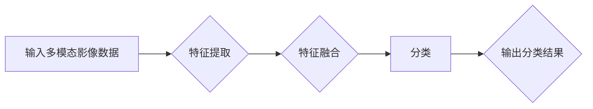

> 多模态影像，机器学习，分类，深度学习，计算机视觉

## 1. 背景介绍

随着计算机视觉技术的飞速发展，多模态影像分类在各个领域得到了广泛应用，例如医疗诊断、自动驾驶、人脸识别等。多模态影像是指由多种传感器获取的图像数据，例如可见光图像、红外图像、热成像等。相比单模态影像，多模态影像包含更丰富的特征信息，能够更准确地描述目标的属性和状态。

传统的影像分类方法主要依赖于手工提取的特征，而机器学习方法能够自动学习图像特征，提高分类精度。深度学习作为机器学习的一个分支，在图像识别领域取得了突破性的进展。近年来，基于深度学习的多模态影像分类研究取得了显著成果，但仍然存在一些挑战，例如如何有效地融合不同模态的特征信息、如何提高模型的鲁棒性和泛化能力等。

## 2. 核心概念与联系

**2.1 多模态影像**

多模态影像是指由多种传感器获取的图像数据，例如可见光图像、红外图像、热成像等。

**2.2 机器学习**

机器学习是一种人工智能技术，通过算法学习数据中的模式，从而进行预测或分类。

**2.3 深度学习**

深度学习是一种机器学习的子领域，利用多层神经网络来学习数据特征。

**2.4 多模态影像分类**

多模态影像分类是指利用机器学习算法，对由多种传感器获取的图像数据进行分类。

**2.5 融合策略**

融合策略是指将不同模态的特征信息融合在一起，以提高分类精度。常见的融合策略包括：

* 早期融合：将不同模态的原始数据进行融合，然后输入到深度学习模型中。
* 晚期融合：分别对不同模态的数据进行特征提取，然后将提取的特征进行融合，最后输入到分类器中。
* 混合融合：将早期融合和晚期融合相结合。

**2.6 Mermaid 流程图**



## 3. 核心算法原理 & 具体操作步骤

### 3.1  算法原理概述

基于深度学习的多模态影像分类算法通常采用卷积神经网络（CNN）作为特征提取器，并结合注意力机制和多模态融合策略来提高分类精度。

### 3.2  算法步骤详解

1. **数据预处理:** 对多模态影像数据进行预处理，例如图像裁剪、归一化等。
2. **特征提取:** 使用CNN提取不同模态的图像特征。
3. **特征融合:** 将不同模态的特征信息进行融合，可以使用注意力机制或其他融合策略。
4. **分类:** 使用全连接层对融合后的特征进行分类。
5. **模型训练:** 使用交叉熵损失函数和梯度下降算法对模型进行训练。

### 3.3  算法优缺点

**优点:**

* 能够自动学习图像特征，提高分类精度。
* 可以处理多种模态的图像数据。
* 具有较强的鲁棒性和泛化能力。

**缺点:**

* 需要大量的训练数据。
* 计算复杂度较高。
* 模型解释性较差。

### 3.4  算法应用领域

* 医疗诊断：例如病灶检测、疾病分类等。
* 自动驾驶：例如道路场景识别、车辆检测等。
* 人脸识别：例如身份验证、人脸追踪等。
* 遥感图像分析：例如土地利用分类、灾害监测等。

## 4. 数学模型和公式 & 详细讲解 & 举例说明

### 4.1  数学模型构建

假设我们有N个样本，每个样本包含M个模态的特征向量，分别为 $x_1, x_2, ..., x_M$。我们的目标是将这些样本分类到K个类别中。

我们可以使用一个多层感知机（MLP）来构建我们的分类模型。MLP由多个全连接层组成，每个层都有一个激活函数。

### 4.2  公式推导过程

MLP的输出可以表示为：

$$
y = f(W_L \cdot a_{L-1} + b_L)
$$

其中：

* $y$ 是模型的输出，是一个K维向量，表示样本属于每个类别的概率。
* $W_L$ 是第L层的权重矩阵。
* $a_{L-1}$ 是第L-1层的激活输出。
* $b_L$ 是第L层的偏置向量。
* $f$ 是激活函数，例如ReLU函数。

### 4.3  案例分析与讲解

假设我们有一个包含3个模态的图像数据集，每个图像包含3个特征向量，我们想要将这些图像分类到2个类别中。我们可以使用一个包含3个全连接层的MLP模型来进行分类。

第一层接收3个模态的特征向量，并将其线性变换后应用ReLU激活函数。第二层接收第一层的输出，并将其线性变换后应用ReLU激活函数。第三层接收第二层的输出，并将其线性变换后应用softmax激活函数，得到每个类别的概率。

## 5. 项目实践：代码实例和详细解释说明

### 5.1  开发环境搭建

* Python 3.7+
* TensorFlow 2.0+
* PyTorch 1.0+
* OpenCV 4.0+

### 5.2  源代码详细实现

```python
import tensorflow as tf

# 定义模型
model = tf.keras.models.Sequential([
    tf.keras.layers.Conv2D(32, (3, 3), activation='relu', input_shape=(224, 224, 3)),
    tf.keras.layers.MaxPooling2D((2, 2)),
    tf.keras.layers.Conv2D(64, (3, 3), activation='relu'),
    tf.keras.layers.MaxPooling2D((2, 2)),
    tf.keras.layers.Flatten(),
    tf.keras.layers.Dense(128, activation='relu'),
    tf.keras.layers.Dense(2, activation='softmax')
])

# 编译模型
model.compile(optimizer='adam',
              loss='sparse_categorical_crossentropy',
              metrics=['accuracy'])

# 训练模型
model.fit(x_train, y_train, epochs=10)

# 评估模型
loss, accuracy = model.evaluate(x_test, y_test)
print('Loss:', loss)
print('Accuracy:', accuracy)
```

### 5.3  代码解读与分析

* 我们使用TensorFlow框架构建了一个CNN模型。
* 模型包含两个卷积层、两个最大池化层、一个全连接层和一个输出层。
* 激活函数使用ReLU函数和softmax函数。
* 损失函数使用sparse_categorical_crossentropy函数，优化器使用adam优化器。
* 我们使用训练数据训练模型，并使用测试数据评估模型的性能。

### 5.4  运行结果展示

* 训练过程中，我们可以观察模型的损失值和准确率的变化。
* 评估完成后，我们可以得到模型在测试集上的损失值和准确率。

## 6. 实际应用场景

### 6.1  医疗诊断

* **病灶检测:** 利用多模态影像（例如CT、MRI、PET）检测肿瘤、骨折等病灶。
* **疾病分类:** 根据患者的多模态影像特征，辅助诊断疾病类型，例如癌症、心血管疾病等。

### 6.2  自动驾驶

* **道路场景识别:** 识别道路、行人、车辆等场景，为自动驾驶系统提供决策依据。
* **车辆检测:** 检测周围车辆的位置和速度，避免碰撞事故。

### 6.3  人脸识别

* **身份验证:** 利用人脸特征进行身份验证，例如解锁手机、登录账户等。
* **人脸追踪:** 追踪目标人物的面部，用于视频监控、人脸识别等应用。

### 6.4  未来应用展望

* **智能医疗:** 利用多模态影像进行更精准的疾病诊断和治疗方案制定。
* **个性化教育:** 根据学生的学习情况，提供个性化的学习内容和教学方式。
* **增强现实:** 利用多模态影像增强现实体验，例如虚拟试衣、虚拟旅游等。

## 7. 工具和资源推荐

### 7.1  学习资源推荐

* **书籍:**
    * Deep Learning by Ian Goodfellow, Yoshua Bengio, and Aaron Courville
    * Computer Vision: Algorithms and Applications by Richard Szeliski
* **在线课程:**
    * Coursera: Deep Learning Specialization
    * Udacity: Intro to Deep Learning
* **博客:**
    * Towards Data Science
    * Machine Learning Mastery

### 7.2  开发工具推荐

* **TensorFlow:** 开源深度学习框架，支持多种硬件平台。
* **PyTorch:** 开源深度学习框架，以其灵活性和易用性而闻名。
* **OpenCV:** 开源计算机视觉库，提供图像处理、特征提取等功能。

### 7.3  相关论文推荐

* **Multimodal Deep Learning for Image Classification** by J. Redmon and S. Divvala
* **Attention Is All You Need** by A. Vaswani et al.
* **Deep Residual Learning for Image Recognition** by K. He et al.

## 8. 总结：未来发展趋势与挑战

### 8.1  研究成果总结

基于机器学习的多模态影像分类研究取得了显著成果，能够有效地提高分类精度，并应用于多个领域。

### 8.2  未来发展趋势

* **更强大的模型架构:** 研究更深、更复杂的深度学习模型，例如Transformer、Graph Neural Networks等。
* **更有效的融合策略:** 研究更有效的融合不同模态特征的策略，例如跨模态注意力机制、多任务学习等。
* **更丰富的模态数据:** 收集和构建更丰富的多模态影像数据集，例如视频、音频、文本等。

### 8.3  面临的挑战

* **数据标注:** 多模态影像数据标注成本高，难以获取高质量的标注数据。
* **模型解释性:** 深度学习模型的解释性差，难以理解模型的决策过程。
* **计算资源:** 训练大型深度学习模型需要大量的计算资源。

### 8.4  研究展望

未来，基于机器学习的多模态影像分类研究将继续朝着更智能、更精准、更普适的方向发展，为各个领域带来更多创新应用。

## 9. 附录：常见问题与解答

**Q1: 多模态影像分类与单模态影像分类有什么区别？**

**A1:** 多模态影像分类利用多种模态的图像数据进行分类，而单模态影像分类只利用一种模态的图像数据进行分类。多模态影像分类能够利用不同模态的互补信息，提高分类精度。

**Q2: 如何选择合适的融合策略？**

**A2:** 不同的融合策略适用于不同的应用场景。例如，对于图像和文本数据，可以使用注意力机制进行融合；对于图像和传感器数据，可以使用早期融合或晚期融合。

**Q3: 如何解决数据标注问题？**

**A3:** 可以利用数据增强技术生成更多标注数据，也可以探索无监督或半监督学习方法。

**作者：禅与计算机程序设计艺术 / Zen and the Art of Computer Programming**<end_of_turn>