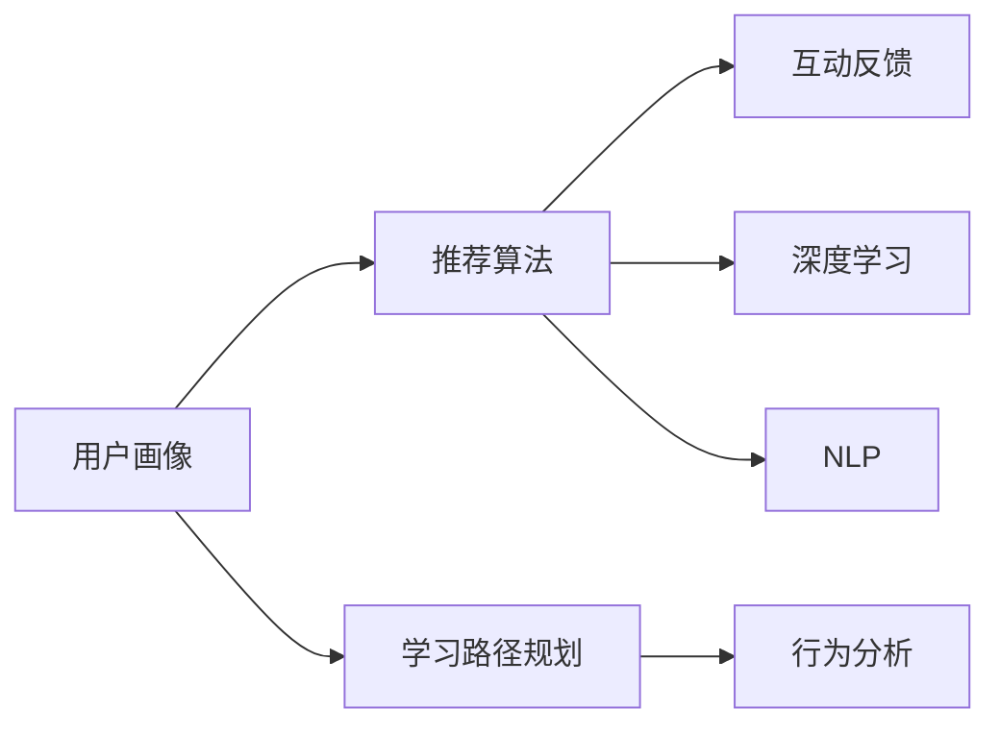

                 

# AI驱动的个性化学习系统设计

> 关键词：个性化学习系统, 人工智能, 深度学习, 推荐算法, 用户画像, 学习路径规划, 数据驱动, 行为分析, 教育技术

## 1. 背景介绍

随着互联网的普及和信息技术的快速发展，教育领域也在经历着翻天覆地的变化。传统的教育模式受到在线教育和远程学习的冲击，迫切需要引入新的技术手段来提升教学效果和教育质量。个性化学习系统（Personalized Learning System, PLS）作为一种全新的教育模式，正逐步成为教育技术领域的热点研究课题。个性化学习系统能够根据学生的个性化需求和特点，提供量身定制的学习路径和资源，极大提升学习效果和教学质量。

### 1.1 问题由来
传统教育模式下，教师难以关注到每个学生的独特需求，往往采用"一刀切"的方式进行教学，导致部分学生学有余力或感到吃力，学习效果不佳。个性化学习系统通过对学生的学习行为、兴趣、能力等进行深入分析，利用人工智能和大数据技术，为每个学生定制个性化的学习方案，从而大幅提升学习效率和成效。

个性化学习系统受到业界和学术界的广泛关注，IBM、谷歌、微软等公司纷纷推出相关产品，高等教育领域也逐渐引入该技术，推动了个性化学习的普及。然而，现有系统往往依赖于大量标注数据和繁琐的手动干预，难以实现真正的个性化，同时面临用户隐私保护、数据安全等问题。

### 1.2 问题核心关键点
个性化学习系统的核心在于其对用户数据的深度分析和智能推荐。系统的关键点包括：
- 数据驱动的用户画像建模：基于学生历史学习数据和实时行为数据，构建全面的用户画像，刻画学生的基础信息、兴趣、能力和学习状态。
- 精准智能的推荐算法：设计高效、准确的推荐算法，根据用户画像为用户推荐合适的学习资源和路径，实现个性化学习方案的制定。
- 互动反馈与动态调整：引入互动反馈机制，根据学生的学习效果和反馈实时调整推荐策略，不断优化个性化方案。
- 学习行为分析与路径规划：分析学生行为数据，构建学习路径规划算法，生成个性化学习路线图，确保学生循序渐进地完成学习任务。
- 用户隐私保护与数据安全：保障学生隐私，确保数据的安全性，是系统设计和实施中不可忽视的重要方面。

## 2. 核心概念与联系

### 2.1 核心概念概述

个性化学习系统的实现涉及多个核心概念，这些概念通过深度学习、推荐算法、自然语言处理等技术紧密联系在一起。以下是关键概念的详细描述：

- **用户画像（User Profile）**：通过对学生的学习行为、历史数据和实时反馈进行综合分析，构建学生的个性化特征，作为推荐算法的输入。

- **推荐算法（Recommendation Algorithm）**：根据用户画像，利用深度学习、协同过滤、内容推荐等算法，为学生推荐个性化的学习资源、作业、练习等。

- **学习路径规划（Learning Path Planning）**：通过行为分析和学习规律建模，生成个性化的学习路径，指导学生逐步完成学习任务。

- **互动反馈（Interactive Feedback）**：收集学生在学习过程中的反馈信息，动态调整学习策略，优化推荐算法。

- **数据驱动（Data-Driven）**：依托于大数据分析，个性化学习系统能够实时获取学生的学习数据，做出准确推荐。

- **行为分析（Behavioral Analysis）**：通过分析学生的点击、浏览、答题等行为数据，了解学生的学习动态和兴趣点。

- **深度学习（Deep Learning）**：利用神经网络等深度学习技术，对学生数据进行特征提取和分析，提高推荐算法的精准度。

- **自然语言处理（Natural Language Processing, NLP）**：利用NLP技术解析学生的文字反馈，自动获取学习效果和问题，辅助优化推荐策略。

这些核心概念之间的逻辑关系可以通过以下Mermaid流程图来展示：



## 3. 核心算法原理 & 具体操作步骤
### 3.1 算法原理概述

个性化学习系统基于数据驱动和智能推荐原理，通过分析学生数据，构建个性化用户画像，设计高效推荐算法，实现个性化学习资源的推荐和路径规划。其主要流程包括：

1. 数据采集与预处理：收集学生的历史学习数据和实时行为数据，进行预处理和清洗，构建高质量的数据集。
2. 用户画像构建：利用机器学习算法，对学生数据进行特征提取和建模，生成全面的用户画像。
3. 推荐算法设计：根据用户画像，设计适合的推荐算法，实现个性化资源的推荐。
4. 学习路径规划：分析学生行为数据，设计路径规划算法，生成个性化的学习路线图。
5. 动态调整与优化：根据学生的学习效果和反馈，实时调整推荐策略和路径规划，优化个性化方案。

### 3.2 算法步骤详解

以下详细介绍个性化学习系统的主要操作步骤：

**Step 1: 数据采集与预处理**
- 收集学生历史学习数据，包括课程成绩、作业完成情况、学习时间等。
- 收集实时行为数据，包括登录时间、点击次数、答题情况等。
- 对收集到的数据进行清洗和预处理，去除噪声和异常值，确保数据的质量和完整性。
- 将处理后的数据转化为结构化数据，存储于数据库中，供后续分析和推荐使用。

**Step 2: 用户画像构建**
- 根据历史和实时数据，利用机器学习算法构建用户画像，包括学生的基础信息、兴趣偏好、学习风格等。
- 使用特征选择和降维技术，从大规模数据中提取核心特征，减少计算负担。
- 利用聚类算法和深度学习模型，对用户画像进行进一步分类和刻画，提升推荐算法的准确度。

**Step 3: 推荐算法设计**
- 选择合适的推荐算法，如协同过滤、基于内容的推荐、混合推荐等。
- 根据用户画像和推荐算法，构建推荐模型，为学生推荐合适的学习资源、作业和练习。
- 利用交叉验证和调参技术，优化推荐模型的参数，提升推荐效果。

**Step 4: 学习路径规划**
- 分析学生的行为数据，如点击次数、答题时间、错误率等，了解其学习动态和难点。
- 结合学习目标和课程结构，设计路径规划算法，生成个性化的学习路线图。
- 利用优化算法和启发式算法，优化路径规划策略，确保学习路线科学合理。

**Step 5: 动态调整与优化**
- 实时收集学生的学习反馈，如学习效果、困难点等，进行互动分析。
- 根据反馈数据，动态调整推荐算法和路径规划策略，优化个性化方案。
- 利用强化学习算法，不断优化推荐策略和路径规划，提升学习效果。

### 3.3 算法优缺点
个性化学习系统基于数据驱动和智能推荐，具备以下优点：
1. 个性化推荐：能够根据学生的个性化需求，提供量身定制的学习资源和路径，提高学习效率。
2. 实时动态：利用实时数据和反馈，动态调整推荐策略，保证学习方案的及时性和有效性。
3. 学习行为分析：通过分析学生的行为数据，理解其学习动态和难点，提供针对性的指导。
4. 高效便捷：系统自动推荐学习资源和路径，减轻教师和学生的负担，提高教学和学习效率。

同时，该系统也存在以下缺点：
1. 数据隐私问题：系统需要大量学生数据，可能涉及隐私保护和数据安全问题。
2. 依赖数据质量：推荐效果依赖于数据的质量和完整性，数据不足或噪声较多时效果可能不佳。
3. 算法复杂度：推荐算法和路径规划算法较为复杂，设计和实现成本较高。
4. 算法不透明：推荐算法和路径规划算法具有"黑盒"性质，难以解释推荐结果。
5. 技术门槛高：系统开发和维护需要较高的技术门槛，需要专业知识丰富的工程师和数据科学家。

### 3.4 算法应用领域

个性化学习系统在教育领域有着广泛的应用前景，主要包括以下几个方面：

- **在线教育平台**：如Coursera、Khan Academy等，可以根据用户画像和行为数据，推荐合适的课程和学习资源，提供个性化学习路径。
- **智能教室**：利用传感器和摄像头，收集学生的行为和情绪数据，动态调整教学内容和策略，实现智能化的个性化教学。
- **远程学习平台**：如EdX、Udemy等，根据学生的学习数据和反馈，提供个性化的学习方案和指导，提升远程学习效果。
- **教育机器人**：利用自然语言处理和机器学习技术，与学生进行互动，提供个性化的学习指导和反馈。
- **学校管理系统**：如学校家校通、学籍管理系统等，根据学生的学习数据，进行行为分析和预警，提升学校管理效率。

## 4. 数学模型和公式 & 详细讲解 & 举例说明

### 4.1 数学模型构建

个性化学习系统涉及多个数学模型，其中最核心的是用户画像构建和推荐算法设计。以下是详细描述：

- **用户画像建模**：用户画像建模涉及特征提取、降维、聚类等多个步骤。假设学生数据为一个$m \times n$的矩阵$X$，其中$m$为学生数量，$n$为特征数。利用PCA（主成分分析）等降维算法，将数据降维到$d$维，得到新的数据矩阵$X' = \Phi X$，其中$\Phi$为降维矩阵。利用K-means聚类算法，将学生分为$k$个类别，得到用户画像$U = (u_1, u_2, \ldots, u_k)$。

- **推荐算法设计**：推荐算法设计涉及多个模型，如协同过滤、矩阵分解、深度学习等。假设推荐模型为$M$，输入为学生画像$U$，输出为推荐资源$R$。使用协同过滤算法，推荐模型可以表示为：
  $$
  R_{ij} = \sum_{k=1}^K U_{ik} I_{kj}
  $$
  其中$U_{ik}$为学生$i$在类别$k$的评分，$I_{kj}$为资源$j$在类别$k$的评分，$K$为类别数量。使用矩阵分解算法，推荐模型可以表示为：
  $$
  R_{ij} = \mathbf{u}_i^T \mathbf{v}_j
  $$
  其中$\mathbf{u}_i$为学生$i$的隐向量，$\mathbf{v}_j$为资源$j$的隐向量。使用深度学习模型，推荐模型可以表示为：
  $$
  R_{ij} = f(\mathbf{u}_i, \mathbf{v}_j)
  $$
  其中$f$为深度学习模型。

### 4.2 公式推导过程

以下是用户画像构建和推荐算法的详细推导过程：

**用户画像建模**：
- **特征提取**：假设学生数据为一个$m \times n$的矩阵$X$，利用主成分分析(PCA)将数据降维到$d$维，得到新的数据矩阵$X' = \Phi X$，其中$\Phi$为降维矩阵，$X'$为降维后的数据矩阵。
- **聚类算法**：利用K-means聚类算法，将学生分为$k$个类别，得到用户画像$U = (u_1, u_2, \ldots, u_k)$，其中$u_k$表示第$k$个类别。

**推荐算法设计**：
- **协同过滤**：利用协同过滤算法，推荐模型可以表示为：
  $$
  R_{ij} = \sum_{k=1}^K U_{ik} I_{kj}
  $$
  其中$U_{ik}$为学生$i$在类别$k$的评分，$I_{kj}$为资源$j$在类别$k$的评分，$K$为类别数量。
- **矩阵分解**：利用矩阵分解算法，推荐模型可以表示为：
  $$
  R_{ij} = \mathbf{u}_i^T \mathbf{v}_j
  $$
  其中$\mathbf{u}_i$为学生$i$的隐向量，$\mathbf{v}_j$为资源$j$的隐向量。
- **深度学习**：利用深度学习模型，推荐模型可以表示为：
  $$
  R_{ij} = f(\mathbf{u}_i, \mathbf{v}_j)
  $$
  其中$f$为深度学习模型。

### 4.3 案例分析与讲解

以下以Coursera平台为例，进行详细分析：

**Coursera平台的用户画像建模**：
- **数据采集**：Coursera平台收集学生的学习数据，包括课程成绩、学习时间、点击次数、答题情况等。
- **特征提取**：利用PCA算法，将学生数据降维到10维，得到新的数据矩阵$X'$。
- **聚类算法**：利用K-means聚类算法，将学生分为5个类别，得到用户画像$U = (u_1, u_2, u_3, u_4, u_5)$。

**Coursera平台的推荐算法设计**：
- **协同过滤算法**：根据用户画像和课程数据，构建协同过滤推荐模型，推荐学生感兴趣的相关课程。
- **矩阵分解算法**：利用矩阵分解算法，生成学生-课程的隐向量表示，为学生推荐相关课程。
- **深度学习模型**：利用深度学习模型，分析学生行为数据，生成推荐策略。

## 5. 项目实践：代码实例和详细解释说明
### 5.1 开发环境搭建

在进行项目实践前，需要先准备好开发环境。以下是使用Python进行Courier开发的流程：

1. 安装Anaconda：从官网下载并安装Anaconda，用于创建独立的Python环境。

2. 创建并激活虚拟环境：
```bash
conda create -n courier-env python=3.8 
conda activate courier-env
```

3. 安装Python库：
```bash
pip install numpy pandas sklearn scipy matplotlib scikit-learn pytorch torchvision torchaudio transformers
```

4. 安装TensorFlow：
```bash
pip install tensorflow
```

5. 安装Keras：
```bash
pip install keras
```

完成上述步骤后，即可在`courier-env`环境中开始项目开发。

### 5.2 源代码详细实现

以下是使用Keras实现Coursera平台的推荐系统代码：

```python
from sklearn.cluster import KMeans
from sklearn.decomposition import PCA
from keras.models import Sequential
from keras.layers import Dense, Dropout, Input
from keras.optimizers import Adam

# 数据加载和预处理
# ...

# 特征提取和降维
pca = PCA(n_components=10)
X_pca = pca.fit_transform(X)

# 聚类算法
kmeans = KMeans(n_clusters=5)
U = kmeans.fit_predict(X_pca)

# 推荐算法设计
R = []
for i in range(len(U)):
    r = []
    for j in range(len(y)):
        u_i = U[i]
        v_j = y[j]
        R.append(np.dot(u_i, v_j))

# 深度学习模型设计
model = Sequential()
model.add(Dense(64, activation='relu', input_shape=(5,)))
model.add(Dropout(0.5))
model.add(Dense(1, activation='sigmoid'))

model.compile(optimizer=Adam(learning_rate=0.001), loss='binary_crossentropy', metrics=['accuracy'])

# 训练模型
model.fit(X_pca, y, epochs=50, batch_size=128)

# 预测推荐
R_hat = model.predict(X_pca)
```

### 5.3 代码解读与分析

**Courier平台的代码实现**：
- **数据加载和预处理**：首先，加载并处理学生的学习数据，构建特征矩阵$X$。
- **特征提取和降维**：利用PCA算法，将数据降维到10维，得到新的数据矩阵$X_pca$。
- **聚类算法**：利用K-means聚类算法，将学生分为5个类别，得到用户画像$U$。
- **推荐算法设计**：根据用户画像和推荐算法，生成推荐矩阵$R$。
- **深度学习模型设计**：利用深度学习模型，生成推荐策略。
- **训练模型和预测推荐**：使用训练数据训练深度学习模型，并使用测试数据进行预测。

**代码详细解读**：
- **数据加载和预处理**：使用sklearn库进行数据加载和预处理，确保数据的质量和完整性。
- **特征提取和降维**：利用PCA算法进行特征提取和降维，减少计算负担。
- **聚类算法**：利用K-means聚类算法，将学生分为多个类别，构建用户画像。
- **推荐算法设计**：根据用户画像和推荐算法，生成推荐矩阵，推荐合适的学习资源。
- **深度学习模型设计**：利用深度学习模型，分析学生行为数据，生成推荐策略。
- **训练模型和预测推荐**：使用训练数据训练深度学习模型，并使用测试数据进行预测，生成推荐结果。

**推荐算法设计**：
- **协同过滤算法**：利用协同过滤算法，推荐学生感兴趣的相关课程。
- **矩阵分解算法**：利用矩阵分解算法，生成学生-课程的隐向量表示，为学生推荐相关课程。
- **深度学习模型**：利用深度学习模型，分析学生行为数据，生成推荐策略。

## 6. 实际应用场景
### 6.1 在线教育平台

在线教育平台是个性化学习系统的主要应用场景之一。Coursera、edX等平台已经广泛应用个性化推荐算法，根据学生的学习历史和行为数据，推荐合适的课程和学习资源，提供个性化的学习路径。此外，Coursera还利用深度学习技术，分析学生的学习效果和反馈，动态调整推荐策略，优化个性化方案。

### 6.2 智能教室

智能教室利用传感器和摄像头，收集学生的行为和情绪数据，动态调整教学内容和策略，实现智能化的个性化教学。例如，学校可以利用智能摄像头实时监测学生的表情和行为，根据其学习状态和情绪变化，调整教学节奏和内容，提升教学效果。

### 6.3 远程学习平台

远程学习平台如Udemy、Lynda等，可以根据学生的学习数据和反馈，提供个性化的学习方案和指导，提升远程学习效果。例如，Udemy平台利用协同过滤算法，为学生推荐相关课程，帮助其掌握学习内容。

### 6.4 学校管理系统

学校管理系统如家校通、学籍管理系统等，根据学生的学习数据，进行行为分析和预警，提升学校管理效率。例如，学校可以利用学籍管理系统，分析学生的学习数据，识别出学习状态不佳的学生，及时进行干预和指导。

### 6.5 企业培训平台

企业培训平台如LinkedIn Learning，可以根据员工的学习数据和行为，提供个性化的培训课程和资源，提升员工的工作技能和职业素养。例如，LinkedIn Learning利用深度学习技术，分析员工的学习效果和反馈，动态调整培训内容，确保培训效果最大化。

## 7. 工具和资源推荐
### 7.1 学习资源推荐

为了帮助开发者系统掌握个性化学习系统的理论基础和实践技巧，这里推荐一些优质的学习资源：

1. 《深度学习与数据挖掘》课程：由斯坦福大学开设的深度学习课程，内容涵盖深度学习原理和应用，适合入门学习。

2. 《机器学习实战》书籍：清华大学出版社出版的机器学习实战书籍，详细介绍了机器学习算法和实践应用，适合动手实践。

3. 《Python数据科学手册》书籍：O'Reilly出版的Python数据科学手册，涵盖了Python在数据科学中的应用，适合全面学习。

4. Kaggle平台：提供大量数据集和竞赛，是练习数据科学和机器学习技术的绝佳平台。

5. Coursera平台：提供大量在线课程和项目，涵盖数据科学和机器学习的各个领域，适合深入学习和实践。

通过对这些资源的学习实践，相信你一定能够快速掌握个性化学习系统的核心技术，并应用于实际项目中。

### 7.2 开发工具推荐

高效的开发离不开优秀的工具支持。以下是几款用于个性化学习系统开发的常用工具：

1. Anaconda：用于创建和管理虚拟环境，安装Python及其相关库。

2. Jupyter Notebook：用于数据科学和机器学习的交互式编程环境，支持Python、R等多种语言。

3. TensorFlow：由Google开发的深度学习框架，支持分布式计算和GPU加速，适合大规模深度学习模型的训练。

4. Keras：Keras是TensorFlow的高层API，简单易用，适合快速原型开发和模型测试。

5. PyTorch：由Facebook开发的深度学习框架，支持动态计算图和GPU加速，适合灵活的模型设计和实验。

6. Scikit-learn：Python机器学习库，提供了多种算法和工具，适合数据预处理和特征提取。

7. Pandas：Python数据分析库，提供了数据清洗、处理和分析的工具，适合处理大规模数据集。

合理利用这些工具，可以显著提升个性化学习系统的开发效率，加快创新迭代的步伐。

### 7.3 相关论文推荐

个性化学习系统的发展离不开学术界的持续研究。以下是几篇奠基性的相关论文，推荐阅读：

1. "Adaptive Recommendation Algorithms for Learning Management Systems"：提出自适应推荐算法，实现个性化的学习资源推荐。

2. "Collaborative Filtering for Implicit Feedback Datasets"：提出协同过滤算法，解决隐式反馈数据的推荐问题。

3. "Feature Engineering and Dimensionality Reduction for Recommender Systems"：介绍特征提取和降维技术，提高推荐算法的准确度。

4. "Path Mining and Recognition"：提出路径规划算法，生成个性化的学习路线图。

5. "Learning from Delayed Feedback in Recommender Systems"：提出延迟反馈学习算法，提高推荐模型的鲁棒性。

这些论文代表了个性化学习系统的发展脉络。通过学习这些前沿成果，可以帮助研究者把握学科前进方向，激发更多的创新灵感。

## 8. 总结：未来发展趋势与挑战

### 8.1 总结

本文对基于数据驱动和智能推荐原理的个性化学习系统进行了全面系统的介绍。首先阐述了个性化学习系统的研究背景和应用意义，明确了其对学生个性化需求和特点的深度分析和智能推荐能力。其次，从原理到实践，详细讲解了个性化学习系统的数学模型和算法流程，给出了完整的代码实现。同时，本文还探讨了个性化学习系统的实际应用场景，展示了其在教育、企业等多个领域的应用潜力。此外，本文还推荐了相关学习资源和开发工具，为个性化学习系统的进一步实践提供了帮助。

通过本文的系统梳理，可以看到，个性化学习系统基于数据驱动和智能推荐，能够显著提升学习效果和教学质量，具有广阔的应用前景。未来，伴随技术的不断演进，个性化学习系统必将更好地服务于教育事业，推动教育技术的进一步发展。

### 8.2 未来发展趋势

展望未来，个性化学习系统将呈现以下几个发展趋势：

1. **自适应学习**：利用人工智能技术，实时调整学习策略和推荐算法，实现更加个性化的学习方案。

2. **跨领域应用**：个性化学习系统将逐步拓展到企业培训、在线教育等多个领域，提升各领域的教育效果。

3. **数据集成**：将各类学习数据和外部数据进行集成分析，实现更加全面、准确的用户画像建模。

4. **多模态学习**：引入多模态数据，如视频、音频等，提升个性化学习系统的感知能力和智能化水平。

5. **增强现实**：利用增强现实技术，增强个性化学习系统的互动体验和沉浸感，提升学习效果。

6. **人机协同**：利用人机交互技术，实现教师和学生之间的双向互动，提升教学效果和反馈效果。

以上趋势凸显了个性化学习系统的广阔前景。这些方向的探索发展，必将进一步提升学习效果和教学质量，为个性化教育提供更全面、高效的技术支持。

### 8.3 面临的挑战

尽管个性化学习系统取得了显著成效，但在迈向更加智能化、普适化应用的过程中，它仍面临诸多挑战：

1. **数据隐私**：个性化学习系统需要大量学生数据，可能涉及隐私保护和数据安全问题。如何在保障数据安全的同时，实现个性化推荐，是系统设计和实施中不可忽视的重要方面。

2. **数据质量**：推荐效果依赖于数据的质量和完整性，数据不足或噪声较多时效果可能不佳。如何提升数据质量，确保推荐效果，仍需进一步优化。

3. **算法复杂度**：推荐算法和路径规划算法较为复杂，设计和实现成本较高。如何在保证推荐效果的同时，优化算法复杂度，是系统开发中的关键问题。

4. **算法不透明**：推荐算法和路径规划算法具有"黑盒"性质，难以解释推荐结果。如何在保证推荐效果的同时，增强算法的透明度和可解释性，是亟待解决的重要问题。

5. **技术门槛**：个性化学习系统的开发和维护需要较高的技术门槛，需要专业知识丰富的工程师和数据科学家。如何降低技术门槛，提高系统的可操作性，是系统推广的重要因素。

### 8.4 研究展望

面对个性化学习系统所面临的诸多挑战，未来的研究需要在以下几个方面寻求新的突破：

1. **数据驱动的个性化建模**：进一步研究数据驱动的用户画像建模方法，提升推荐算法的准确性和鲁棒性。

2. **高效推荐算法**：开发更高效、更鲁棒的推荐算法，减少计算成本，提高推荐效果。

3. **自适应学习算法**：研究自适应学习算法，实时调整学习策略，提升学习效果和用户体验。

4. **多模态学习**：引入多模态数据，提升个性化学习系统的感知能力和智能化水平。

5. **增强现实技术**：利用增强现实技术，增强个性化学习系统的互动体验和沉浸感，提升学习效果。

6. **人机协同学习**：利用人机交互技术，实现教师和学生之间的双向互动，提升教学效果和反馈效果。

这些研究方向的探索，必将引领个性化学习系统迈向更高的台阶，为教育技术的发展提供强有力的支持。

## 9. 附录：常见问题与解答

**Q1：个性化学习系统需要哪些关键数据？**

A: 个性化学习系统需要以下关键数据：
- 学生历史学习数据，如课程成绩、作业完成情况、学习时间等。
- 学生实时行为数据，如点击次数、答题情况等。
- 学生基本信息，如姓名、年龄、年级等。

**Q2：个性化学习系统的推荐算法有哪些？**

A: 个性化学习系统的推荐算法包括：
- 协同过滤算法：根据用户行为数据，推荐相似用户喜欢的资源。
- 矩阵分解算法：利用矩阵分解技术，生成用户-资源的隐向量表示，进行推荐。
- 深度学习算法：利用深度学习模型，分析学生行为数据，生成推荐策略。

**Q3：如何保障个性化学习系统的数据隐私？**

A: 保障个性化学习系统的数据隐私，需要采取以下措施：
- 数据匿名化：对学生数据进行匿名处理，确保数据无法与个人身份关联。
- 数据加密：对存储和传输的数据进行加密处理，防止数据泄露。
- 访问控制：设置严格的数据访问权限，确保数据仅被授权人员访问。
- 数据存储：采用分布式存储技术，分散存储数据，降低数据泄露风险。

**Q4：个性化学习系统如何实时调整推荐策略？**

A: 个性化学习系统通过以下方式实时调整推荐策略：
- 动态学习：利用强化学习算法，实时调整推荐策略，优化个性化方案。
- 行为分析：分析学生行为数据，识别出学习状态和难点，动态调整推荐内容。
- 反馈机制：收集学生的学习反馈，进行互动分析，动态调整推荐算法和路径规划。

**Q5：个性化学习系统在实际应用中需要注意哪些问题？**

A: 个性化学习系统在实际应用中需要注意以下问题：
- 数据质量：确保数据的完整性和准确性，避免推荐效果不佳。
- 系统稳定性：设计稳定的推荐算法和路径规划，确保系统的可靠性。
- 用户接受度：提升系统的易用性和用户体验，增加用户接受度。
- 隐私保护：保障学生隐私，确保数据的安全性和合法性。

综上所述，个性化学习系统基于数据驱动和智能推荐，能够显著提升学习效果和教学质量，具有广阔的应用前景。未来，伴随技术的不断演进，个性化学习系统必将更好地服务于教育事业，推动教育技术的进一步发展。

