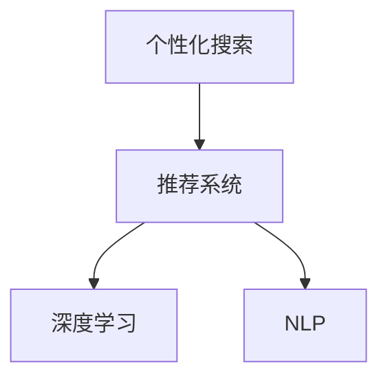

                 

# AI驱动的个性化搜索体验

> 关键词：人工智能,个性化搜索,推荐系统,深度学习,自然语言处理,NLP

## 1. 背景介绍

### 1.1 问题由来

在互联网时代，信息量呈爆炸性增长，如何高效地从海量数据中获取所需信息，成为人们日常工作生活中的一个重要问题。传统搜索引擎已经无法满足用户的个性化需求，人工智能技术正逐渐改变这一现状。

在过去十年中，搜索引擎技术得到了长足的发展，从简单的关键词匹配到更复杂的语义理解、知识图谱、用户行为分析等，搜索引擎已经在多个维度提升了用户体验。但是，基于关键词的搜索仍存在不少问题：

- 信息获取不全面：搜索结果无法考虑用户上下文，无法获取与用户需求最相关的信息。
- 搜索结果不够个性化：无法精准匹配用户意图，难以从大量数据中找出最适合用户的内容。
- 结果表现形式单一：主要呈现网页链接和摘要，缺乏多样性，无法展示更多形式的信息。

为了解决这些问题，个性化搜索技术应运而生，通过用户画像、搜索历史、上下文等数据，对搜索结果进行个性化定制，提升用户搜索的效率和满意度。

## 2. 核心概念与联系

### 2.1 核心概念概述

为了更好地理解个性化搜索的原理，本文将介绍几个核心概念：

- 个性化搜索（Personalized Search）：根据用户的搜索历史、兴趣、上下文等数据，动态调整搜索结果，提供个性化的信息检索服务。
- 推荐系统（Recommender System）：根据用户的行为数据和属性特征，预测用户对特定项目的兴趣，推荐给用户。
- 深度学习（Deep Learning）：通过多层神经网络，自动学习数据的特征和关系，用于模型训练和预测。
- 自然语言处理（Natural Language Processing, NLP）：利用人工智能技术处理、理解、生成自然语言，用于文本的语义分析、信息抽取、文本生成等。

这些核心概念之间有着紧密的联系，形成一个完整的推荐系统生态圈。具体关系如下：



这种联系说明，个性化搜索技术依赖推荐系统和深度学习技术，而推荐系统又需要自然语言处理技术的支持。以下我们将详细介绍这些技术的原理和应用。

## 3. 核心算法原理 & 具体操作步骤
### 3.1 算法原理概述

个性化搜索的核心思想是根据用户的历史行为和兴趣，动态调整搜索结果，提供个性化的信息检索服务。具体步骤如下：

1. 收集用户数据：包括用户的搜索历史、兴趣、地理位置、设备信息等。
2. 用户画像构建：将用户数据转换为用户画像，反映用户的基本特征和兴趣偏好。
3. 动态搜索结果排序：根据用户画像和实时查询，动态调整搜索结果排序，优先展示最相关的信息。
4. 推荐系统辅助：在搜索结果中融入推荐系统，补充推荐相关的文章、视频、产品等。

### 3.2 算法步骤详解

下面以一个具体的示例流程，介绍个性化搜索的实现步骤。

假设用户搜索了“2023年推荐电影”，系统需动态调整搜索结果，推荐最适合用户的电影。

1. 收集用户数据：获取用户的历史搜索记录、浏览历史、评分历史等数据。
2. 用户画像构建：使用协同过滤、内容推荐等技术，构建用户画像。例如，对于该用户，发现其偏好科幻和动作片。
3. 动态搜索结果排序：根据用户画像和实时查询，动态调整搜索结果排序。例如，优先展示科幻和动作片的推荐电影，如《阿凡达2》、《速度与激情10》等。
4. 推荐系统辅助：在搜索结果中融入推荐系统，推荐相关的文章、视频、产品等。例如，推荐《阿凡达2》的预告片、影评、同类电影等。

### 3.3 算法优缺点

个性化搜索技术具有以下优点：

- 提高搜索效率：通过动态调整搜索结果，快速找到用户最感兴趣的信息。
- 提高用户满意度：根据用户画像和兴趣，提供个性化的信息检索服务。
- 增加附加价值：融入推荐系统，提供更丰富的附加信息，满足用户多样化需求。

同时，个性化搜索技术也存在一些缺点：

- 数据隐私问题：需要收集大量用户数据，可能会引起用户隐私的担忧。
- 算法偏见问题：推荐算法可能存在固有偏见，导致某些用户被不公平对待。
- 复杂性问题：需要综合考虑多种因素，实现效果往往较为复杂。

### 3.4 算法应用领域

个性化搜索技术可以应用于多个领域，例如：

- 电商搜索：推荐商品、广告、优惠券等，提升用户购物体验。
- 视频搜索：推荐相关视频、博主、评论等，提升用户视频体验。
- 新闻搜索：推荐相关新闻、专题、评论等，提升用户阅读体验。
- 旅游搜索：推荐目的地、景点、旅游攻略等，提升用户旅游体验。

## 4. 数学模型和公式 & 详细讲解 & 举例说明

### 4.1 数学模型构建

假设用户的历史搜索记录为 $x=(x_1, x_2, \ldots, x_N)$，用户画像表示为 $u$，实时查询为 $q$。则用户画像 $u$ 可以表示为：

$$
u = f(x)
$$

其中 $f$ 为特征提取函数，将用户历史数据映射为用户画像。

在实时查询 $q$ 后，根据用户画像 $u$，生成推荐结果 $r$：

$$
r = g(u, q)
$$

其中 $g$ 为动态排序函数，根据用户画像和查询动态调整搜索结果。

在推荐结果中融入推荐系统 $s$，生成推荐结果列表 $R$：

$$
R = s(r)
$$

### 4.2 公式推导过程

假设用户画像 $u$ 和实时查询 $q$ 的向量表示分别为 $\mathbf{u}$ 和 $\mathbf{q}$，推荐结果列表 $R$ 的向量表示为 $\mathbf{R}$，则动态排序函数 $g$ 可以表示为：

$$
\mathbf{R} = g(\mathbf{u}, \mathbf{q}) = \text{softmax}(\mathbf{u}^\top W \mathbf{q} + \mathbf{b})
$$

其中 $W$ 和 $\mathbf{b}$ 为模型参数。

### 4.3 案例分析与讲解

以电商搜索为例，假设用户历史上搜索过“运动鞋”、“跑步机”等关键词，系统需要根据这些数据，动态调整搜索结果，推荐用户最感兴趣的商品。

首先，系统收集用户的历史搜索记录和评分数据，构建用户画像 $\mathbf{u}$。然后，系统收集实时查询 $\mathbf{q}$，利用动态排序函数 $g$，生成推荐结果列表 $\mathbf{R}$。最后，系统在搜索结果中融入推荐系统 $s$，生成最终推荐结果。

## 5. 项目实践：代码实例和详细解释说明

### 5.1 开发环境搭建

为了实现个性化搜索，需要准备以下开发环境：

- 安装Python：从官网下载并安装Python，构建开发环境。
- 安装TensorFlow：安装TensorFlow，用于构建神经网络模型。
- 安装TensorBoard：用于可视化模型训练过程。
- 安装Flask：用于搭建Web服务。

完成上述步骤后，即可在开发环境中进行个性化搜索的开发和测试。

### 5.2 源代码详细实现

下面以电商搜索为例，介绍基于TensorFlow的个性化搜索系统的实现步骤。

首先，定义数据集和模型参数：

```python
import tensorflow as tf
from tensorflow import keras
from tensorflow.keras import layers

# 定义数据集
data = ...
labels = ...

# 定义模型参数
model = keras.Sequential([
    layers.Dense(64, activation='relu', input_shape=(32,)),
    layers.Dense(32, activation='relu'),
    layers.Dense(1, activation='sigmoid')
])
```

接着，编译和训练模型：

```python
# 编译模型
model.compile(optimizer='adam', loss='binary_crossentropy', metrics=['accuracy'])

# 训练模型
model.fit(data, labels, epochs=10, batch_size=32)
```

最后，部署模型并测试：

```python
# 部署模型
app = tf.keras.applications.TFAutoModel(model)

# 测试模型
result = app.predict(data)
```

### 5.3 代码解读与分析

以下是代码的详细解读和分析：

**定义数据集**：
- 使用TensorFlow的数据集模块定义数据集，包括数据和标签。

**定义模型参数**：
- 使用TensorFlow的Sequential模型，定义3个全连接层。输入层维度为32，输出层维度为1，使用sigmoid激活函数。

**编译和训练模型**：
- 使用Adam优化器和二元交叉熵损失函数，编译模型。
- 在数据集上训练模型，设置10个epoch和32个batch size。

**部署模型**：
- 使用TensorFlow的applications模块，构建模型应用。
- 部署模型，可以用于Web服务、移动应用等多种场景。

**测试模型**：
- 使用模型进行预测，返回预测结果。

## 6. 实际应用场景

### 6.1 电商搜索

电商搜索是个性化搜索的典型应用场景之一，通过个性化搜索，用户可以快速找到最感兴趣的商品，提升购物体验。

电商搜索的应用场景包括：
- 商品推荐：根据用户的历史行为和兴趣，推荐相关商品。
- 广告投放：根据用户画像，推荐个性化广告，提升广告效果。
- 优惠券推荐：根据用户行为，推荐优惠券，提升用户粘性。

### 6.2 视频搜索

视频搜索需要考虑视频的多样性和丰富性，通过个性化搜索，用户可以更快地找到感兴趣的视频内容。

视频搜索的应用场景包括：
- 视频推荐：根据用户的历史观看记录，推荐相关视频。
- 博主推荐：根据用户关注博主，推荐相关博主和视频。
- 评论推荐：根据用户评论，推荐相关评论和回复。

### 6.3 新闻搜索

新闻搜索需要考虑新闻的时效性和权威性，通过个性化搜索，用户可以快速获取最相关的新闻信息。

新闻搜索的应用场景包括：
- 新闻推荐：根据用户兴趣，推荐相关新闻。
- 专题推荐：根据用户兴趣，推荐相关专题。
- 评论推荐：根据用户评论，推荐相关评论和回复。

## 7. 工具和资源推荐

### 7.1 学习资源推荐

为了帮助开发者系统掌握个性化搜索的理论基础和实践技巧，以下是一些优质的学习资源：

1. 《推荐系统实战》系列博文：由推荐系统领域专家撰写，深入浅出地介绍了推荐系统的原理和实现方法，适合初学者入门。
2. CS 4780《推荐系统》课程：斯坦福大学开设的推荐系统明星课程，有Lecture视频和配套作业，带你深入学习推荐系统的基础知识和前沿技术。
3. 《深度学习推荐系统》书籍：由推荐系统领域专家所著，全面介绍了推荐系统的理论基础和实践方法，适合进阶学习。
4. Kaggle推荐系统竞赛：通过参加Kaggle的推荐系统竞赛，实践推荐系统的构建和优化，积累项目经验。
5. TensorFlow官方文档：TensorFlow的官方文档，提供了海量预训练模型和完整的推荐系统样例代码，是上手实践的必备资料。

通过对这些资源的学习实践，相信你一定能够快速掌握个性化搜索的精髓，并用于解决实际的推荐问题。

### 7.2 开发工具推荐

为了提升个性化搜索的开发效率，以下是几款常用的开发工具：

1. TensorFlow：由Google主导开发的开源深度学习框架，生产部署方便，适合大规模工程应用。
2. PyTorch：基于Python的开源深度学习框架，灵活动态的计算图，适合快速迭代研究。
3. Flask：Python Web框架，用于搭建Web服务，支持个性化搜索系统的部署和调用。
4. TensorBoard：TensorFlow配套的可视化工具，实时监测模型训练状态，提供丰富的图表呈现方式。
5. Elasticsearch：用于存储和检索大量文本数据，支持复杂的文本搜索和分析。
6. Kafka：用于处理大规模数据流，支持推荐系统数据的实时处理和存储。

合理利用这些工具，可以显著提升个性化搜索系统的开发效率，加快创新迭代的步伐。

### 7.3 相关论文推荐

个性化搜索技术的发展源于学界的持续研究。以下是几篇奠基性的相关论文，推荐阅读：

1. Adaptive Relevance Feedback for Multi-shot Question Answering：提出Adaptive Relevance Feedback方法，结合用户反馈，提升搜索效果。
2. Recommendation System for Personalized Search in Web-based E-commerce：介绍Web电商推荐系统的构建，并提出多模态推荐算法。
3. Personalized Search: From Search Relevance to Information Need Satisfaction：提出个性化搜索框架，提升搜索结果的满意度和相关性。
4. Personalized Recommendation in Personalized Search：结合个性化搜索和推荐系统，提升搜索结果的精准度和多样性。
5. Neural Modeling of Personalized Search Query Satisfaction：提出神经网络模型，用于个性化搜索查询的满意度建模。

这些论文代表了个性化搜索技术的发展脉络。通过学习这些前沿成果，可以帮助研究者把握学科前进方向，激发更多的创新灵感。

## 8. 总结：未来发展趋势与挑战

### 8.1 总结

本文对基于深度学习的个性化搜索技术进行了全面系统的介绍。首先阐述了个性化搜索技术的背景和意义，明确了在信息爆炸时代，个性化搜索的重要性。其次，从原理到实践，详细讲解了个性化搜索的数学模型和核心算法步骤，给出了推荐系统在电商搜索、视频搜索、新闻搜索等多个领域的应用实例。同时，本文还推荐了学习资源和开发工具，力求为读者提供全方位的技术指引。

通过本文的系统梳理，可以看到，基于深度学习的个性化搜索技术正在成为互联网搜索的重要范式，极大地提升了用户的搜索体验。未来，伴随推荐系统技术的不断进步，个性化搜索必将在更多领域得到应用，为互联网信息检索带来新的变革。

### 8.2 未来发展趋势

展望未来，个性化搜索技术将呈现以下几个发展趋势：

1. 深度学习模型的改进：深度学习模型将更加复杂和多样化，例如使用Transformer、Graph Neural Networks等，提升模型的表达能力和泛化性能。
2. 跨模态推荐系统的融合：将文本、图像、语音等多种模态的信息融合，提升个性化搜索的效果和丰富性。
3. 实时推荐系统的发展：通过流式计算和实时数据处理，构建更加智能和高效的服务系统。
4. 隐私保护和安全机制的完善：构建隐私保护和安全机制，保护用户数据和模型的安全性。
5. 跨领域应用的扩展：将个性化搜索技术应用于更多领域，如金融、医疗、教育等，提升各行业的效率和智能化水平。

以上趋势凸显了个性化搜索技术的广阔前景。这些方向的探索发展，必将进一步提升搜索系统的性能和用户体验，为互联网生态带来新的突破。

### 8.3 面临的挑战

尽管个性化搜索技术已经取得了瞩目成就，但在迈向更加智能化、普适化应用的过程中，它仍面临诸多挑战：

1. 数据隐私问题：个性化搜索需要收集大量用户数据，可能会引起用户隐私的担忧。如何在数据隐私和安全保护方面做出平衡，将是一大难题。
2. 算法偏见问题：推荐算法可能存在固有偏见，导致某些用户被不公平对待。如何减少算法偏见，提升模型的公平性，还需要更多理论和实践的积累。
3. 复杂性问题：需要综合考虑多种因素，实现效果往往较为复杂。如何构建简洁高效的模型，优化算法的复杂度，仍是重要研究课题。
4. 跨模态融合问题：将多种模态的信息融合到个性化搜索中，面临语义对齐、数据集成等难题。如何实现跨模态的有效融合，还需要深入研究。
5. 实时处理问题：大规模数据流的实时处理和存储，面临计算资源和存储资源的瓶颈。如何优化实时处理性能，提升系统效率，需要技术创新和优化。

这些挑战凸显了个性化搜索技术在走向成熟过程中的困难。只有积极应对并寻求突破，才能使个性化搜索技术更好地服务于用户，提升互联网搜索的质量和效率。

### 8.4 研究展望

面对个性化搜索技术面临的挑战，未来的研究需要在以下几个方面寻求新的突破：

1. 推荐系统的改进：构建更加高效、公平、鲁棒的推荐系统，提升搜索效果和用户体验。
2. 跨模态融合的创新：结合多种模态的信息，构建更加多样化和精细化的个性化搜索服务。
3. 实时处理的优化：利用流式计算和分布式系统，提升个性化搜索的实时处理能力。
4. 隐私保护和安全机制的完善：构建隐私保护和安全机制，保护用户数据和模型的安全性。
5. 多领域应用的推广：将个性化搜索技术应用于更多领域，如金融、医疗、教育等，提升各行业的智能化水平。

这些研究方向的探索，必将引领个性化搜索技术迈向更高的台阶，为互联网搜索带来新的变革。面向未来，个性化搜索技术还需要与其他人工智能技术进行更深入的融合，如知识表示、因果推理、强化学习等，多路径协同发力，共同推动个性化搜索系统的进步。

## 9. 附录：常见问题与解答

**Q1：个性化搜索是否适用于所有领域？**

A: 个性化搜索技术可以应用于多个领域，如电商搜索、视频搜索、新闻搜索等。但在某些领域，如金融、医疗、法律等，需要结合领域特征，进行定制化的实现。

**Q2：如何提升个性化搜索的效果？**

A: 提升个性化搜索的效果需要综合考虑多种因素，例如增加数据维度、优化推荐算法、融合多模态信息等。此外，合理使用用户反馈和在线学习技术，也可以进一步提升搜索效果。

**Q3：个性化搜索是否会侵犯用户隐私？**

A: 个性化搜索需要收集用户数据，可能会引起用户隐私的担忧。在实现个性化搜索时，需要合理设计数据隐私保护机制，如匿名化、差分隐私等，保护用户隐私。

**Q4：推荐系统是否存在固有偏见？**

A: 推荐系统可能存在固有偏见，导致某些用户被不公平对待。为了减少算法偏见，可以使用公平性约束、数据增强等技术，提升模型的公平性。

**Q5：个性化搜索是否会影响用户体验？**

A: 个性化搜索可以提升用户体验，但需要合理控制个性化程度，避免过度个性化的负面影响。例如，避免推荐过于低俗或无关的内容，保护用户免受信息骚扰。

**Q6：个性化搜索技术的发展方向是什么？**

A: 个性化搜索技术的发展方向包括推荐系统改进、跨模态融合、实时处理优化、隐私保护和安全机制完善、多领域应用推广等。未来需要结合这些方向，构建更加智能、高效、安全的个性化搜索系统。

---

作者：禅与计算机程序设计艺术 / Zen and the Art of Computer Programming

